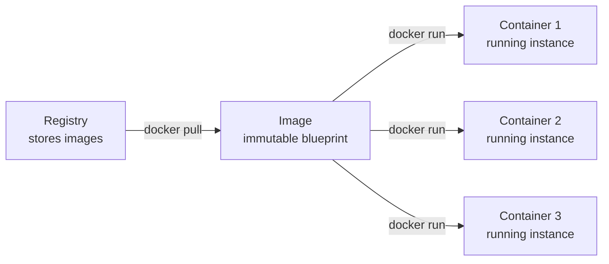
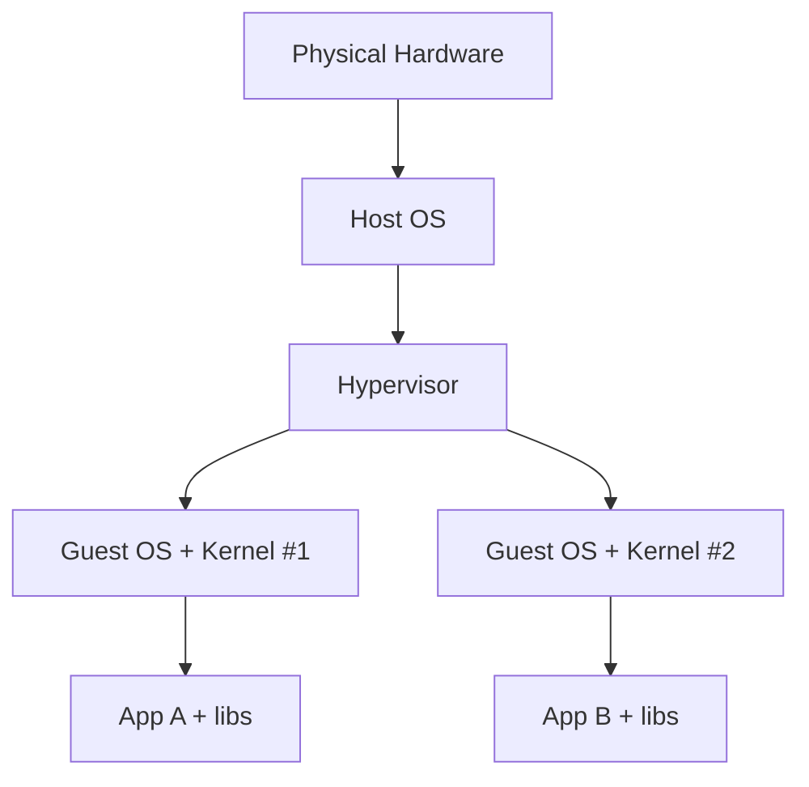
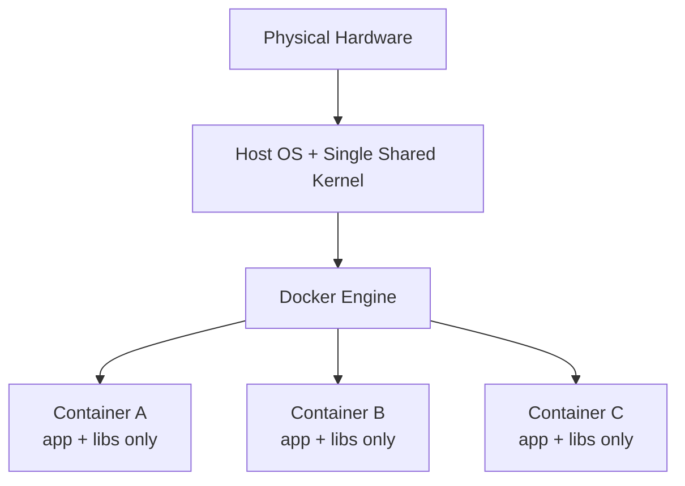
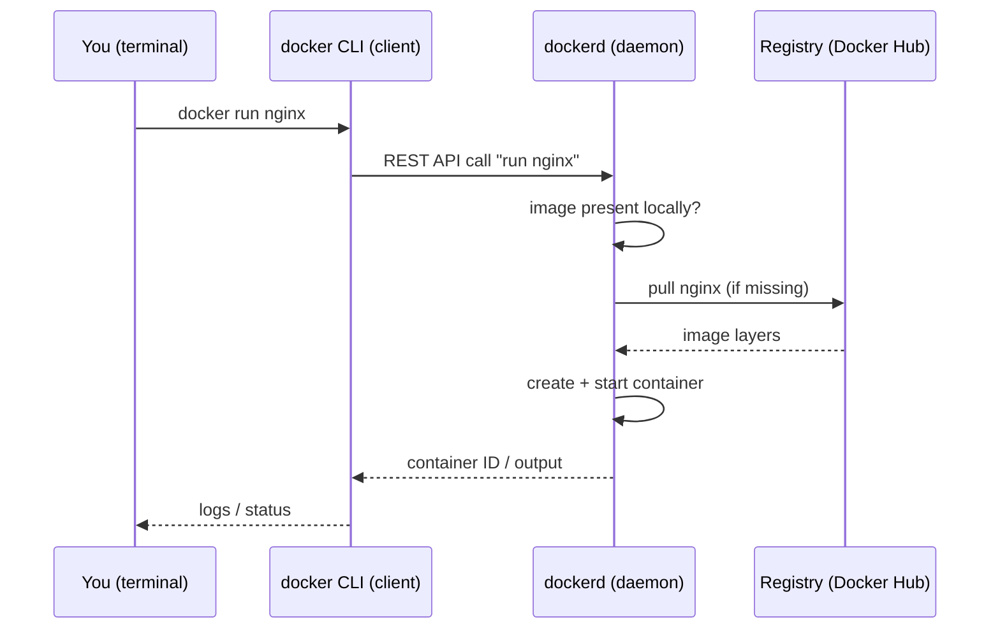

# Chapter 1 — Introduction: Why Docker Exists

## 1. Introduction

Imagine you write a program on your laptop. It works perfectly. You hand it to a
colleague, they run it, and it crashes — "missing library," "wrong Python version,"
"that flag doesn't exist on my OS." You shrug and say the words every developer has
said at least once: *"…but it works on my machine."*

That single sentence is the reason Docker exists.

Software does not run in a vacuum. It depends on a specific operating system, specific
versions of language runtimes, specific system libraries, specific environment
variables, and specific files being in specific places. We call all of that the
**environment**. The classic, painful truth of software is that *the environment is
part of the program*, even though we usually pretend it isn't. When the environment on
your machine differs from the environment on the server, the program behaves
differently — or not at all.

Docker's core idea is simple and powerful: **package the application together with its
entire environment into one portable, self-contained unit, and run that unit the same
way everywhere.** That unit is called a **container**. In this chapter we build up the
intuition for what a container actually is, why it beats older solutions, and how the
pieces of the Docker ecosystem fit together — without touching a single advanced
feature yet.

---

## 2. Learning Goals

By the end of this chapter you will be able to:

- Explain, in plain language, the problem Docker solves and why "works on my machine"
  is an environment problem.
- Define **container**, **image**, and **registry**, and describe how they relate.
- Clearly distinguish a **container** from a **virtual machine**, and say *why* a
  container is lighter.
- Describe the **client–daemon** model that Docker uses.
- Run your very first container and reason about what just happened.

---

## 3. Concepts Explained

Let's introduce the vocabulary carefully. Each of these terms will recur in every
later chapter, so we define them precisely now.

### 3.1 The environment problem (first principles)

A running program needs four kinds of things from its surroundings:

1. **A runtime** — e.g. the Python interpreter, the Java JVM, the Node engine.
2. **Libraries and dependencies** — packages your code imports, plus *system*
   libraries those packages secretly rely on (think `libssl`, `glibc`).
3. **Configuration** — environment variables, config files, secrets, ports.
4. **The filesystem layout** — where files live, what's installed, file permissions.

Any difference in any of these between two machines can change behavior. Historically
we tried to fix this by writing setup documentation ("install Python 3.11, then
`apt install libpq-dev`, then…"). Documentation drifts, humans skip steps, and OSes
differ. The dream is to make the environment **executable and reproducible** instead
of documented. That dream is the container.

### 3.2 Image (the blueprint)

An **image** is a read-only, immutable package containing everything needed to run an
application: the application code, its runtime, its libraries, and a snapshot of the
filesystem layout. Think of it as a *template* or a *blueprint*. An image does nothing
on its own — it just sits there, like a class definition in code, or a `.iso` file.

> **Analogy:** An image is like a cake recipe written down with all ingredients
> pre-measured into the recipe itself. It's not a cake yet.

### 3.3 Container (the running instance)

A **container** is a running (or stopped) instance created *from* an image. When you
"run" an image, Docker creates a container: an isolated process with its own
filesystem view, its own network interface, and its own slice of the machine's
resources. You can create many containers from one image, just as you can create many
objects from one class.

> **Analogy:** If the image is the recipe, the container is the actual cake you baked
> from it. You can bake many cakes (containers) from one recipe (image).



### 3.4 Registry (the warehouse)

A **registry** is a server that stores and distributes images. The most famous public
registry is **Docker Hub**. You `pull` images down from a registry and `push` your own
images up to it. Registries are how images travel between your laptop, your CI system,
and your servers.

> **Analogy:** A registry is like an app store (or a GitHub for images): a central
> place to publish and download the blueprints.

### 3.5 Putting the words in one sentence

> You **pull** an **image** from a **registry**, and you **run** that image to create a
> **container**.

---

## 4. Internal Working / Deep Dive

Beginners often imagine a container is "a tiny virtual machine." It is not, and
understanding *why* is the single most important conceptual leap in this chapter. (We
go to the kernel level in Chapter 4; here we build the mental model.)

### 4.1 Virtual machines: emulating a whole computer

A **virtual machine (VM)** works by running a piece of software called a **hypervisor**
that emulates an entire computer — virtual CPU, virtual memory, virtual disk. On top of
that emulated hardware, you install a **complete guest operating system**, including its
own kernel. Your application then runs inside that guest OS.

So a VM stack looks like this:



Every VM ships a full operating system, often several gigabytes, and boots a kernel.
That gives strong isolation but is heavy: slow to start (seconds to minutes) and
expensive in disk and memory.

### 4.2 Containers: sharing one kernel, isolating the rest

A **container** does *not* emulate hardware and does *not* ship its own kernel. Instead,
all containers on a machine **share the host's single Linux kernel**. The kernel is
asked to give each container its own *isolated view* of the system — its own process
list, its own filesystem root, its own network — using built-in kernel features
(namespaces and cgroups, covered in Ch 4). The container is, fundamentally, **just a
normal process on the host that has been fenced off** so it believes it has the machine
to itself.



Because there's no extra OS and no extra kernel to boot, containers:

- **start in milliseconds**, not seconds;
- are **small** (tens of MB, not GBs) because they package only the app and its
  libraries — not a whole OS;
- pack **densely** — you can run far more containers than VMs on the same hardware.

The trade-off: containers share the host kernel, so isolation is *process-level*, not
*hardware-level*. A VM boundary is harder to escape than a container boundary, which is
why security hardening (Ch 10) matters in multi-tenant settings.

> **Key mental model:** A VM virtualizes the *hardware*. A container virtualizes the
> *operating system's view*. Same goal (isolation), very different cost.

### 4.3 The Docker client–daemon architecture

When you type `docker` commands, you're using the **Docker CLI client**. The client
doesn't actually create containers itself. It sends your request over an API to a
long-running background service called the **Docker daemon** (`dockerd`). The daemon is
the part that builds images, pulls from registries, and starts/stops containers.



This separation matters: the daemon can run on a *different machine* than the client,
which is how remote Docker hosts and many CI systems work. It's also why Docker needs a
running daemon/service in the background, and why permission to talk to the daemon
socket effectively grants broad control of the host (a security point we revisit later).

---

## 5. Examples

You don't need to fully understand the syntax yet — read these as illustrations of the
ideas above. (Chapter 2 dissects every flag.)

### Example 1 — Run your first container

```bash
docker run hello-world
```

What happens, mapped to the concepts:
1. The **client** sends the request to the **daemon**.
2. The daemon doesn't have the `hello-world` **image** locally, so it **pulls** it from
   the **registry** (Docker Hub).
3. The daemon creates a **container** from that image and runs it.
4. The container prints a confirmation message and exits.

### Example 2 — Run something long-lived and reach it

```bash
docker run -d -p 8080:80 nginx
```

- `nginx` is the **image** (a web server).
- `-d` runs the **container** in the background ("detached").
- `-p 8080:80` maps port 8080 on your machine to port 80 inside the container.

Now open `http://localhost:8080` — you're talking to a web server running in an
isolated container, even though you never installed nginx on your machine. *That* is
the payoff: the environment came packaged in the image.

### Example 3 — See that the container is just a process with a private view

```bash
docker run -it ubuntu bash
```

This drops you into an interactive shell *inside* an Ubuntu container. Run `ls /` and
`ps aux` — you'll see a filesystem and a process list that look like a fresh Ubuntu
box, even if your host is Fedora or macOS. Yet on the host, this is just one more
process. Type `exit` to leave; the container stops.

---

## 6. Real-World Use Cases

- **"Works on my machine" → works everywhere.** The same image runs identically on a
  laptop, a CI runner, and a production server. This is the original and biggest win.
- **Microservices.** Each service ships as its own image with its own dependencies, so
  one service can use Python 3.10 and another Go 1.22 without conflict on the same host.
- **Clean local development.** Spin up Postgres, Redis, and your app with one command;
  delete them with another. No polluting your laptop with database installs.
- **Reproducible builds and CI/CD.** Build once into an immutable image, then promote
  that *exact* artifact through test → staging → production. No "it was rebuilt
  differently" surprises.
- **Fast, dense scaling.** Because containers are light, orchestrators can start dozens
  in seconds to absorb traffic spikes — the foundation Kubernetes builds on.
- **Legacy isolation.** Wrap an old app and its ancient dependencies in a container so
  it stops conflicting with everything else on the host.

---

## 7. Common Mistakes

- **Thinking a container is a VM.** It changes everything downstream — you don't "log
  into" a container to install things long-term; you rebuild the image. Containers are
  meant to be disposable and immutable.
- **Expecting data to persist by default.** Anything written inside a container's
  writable layer disappears when the container is removed. Persistence requires volumes
  (Ch 5). New users lose database data this way constantly.
- **Confusing image and container.** "Restarting the image" is meaningless; you restart
  *containers*. You build/pull *images*.
- **Assuming you'll run Windows software in a Linux container (or vice versa).** A
  container shares the host kernel; a Linux image needs a Linux kernel. (Docker Desktop
  hides this by running a small Linux VM behind the scenes.)
- **Running everything as one giant container.** The container model favors one main
  process per container; cramming a whole stack into one container fights the tooling.

---

## 8. Best Practices

These are *mindset* best practices for beginners; concrete ones come in later chapters.

- **Treat containers as cattle, not pets.** They should be disposable, identical, and
  recreatable from the image — never hand-tuned and irreplaceable.
- **Treat images as immutable artifacts.** To change behavior, change the image and
  redeploy; don't patch a running container.
- **Keep one primary concern per container.** App in one, database in another, cache in
  a third. It simplifies scaling, logging, and updates.
- **Make the environment explicit.** If your app needs something, it belongs in the
  image or in declared configuration — not in a setup doc.
- **Start from official, trusted base images.** They're maintained and patched.

---

## 9. Hands-On Exercise

**Goal:** confirm your setup and internalize image → container → registry.

1. **Verify Docker is running:**
   ```bash
   docker version
   docker info
   ```
   Note the separate "Client" and "Server (Engine)" sections — that's the
   client–daemon split in action.

2. **Run your first container:**
   ```bash
   docker run hello-world
   ```
   Read its output. It literally narrates the client→daemon→registry→container flow.

3. **Run a real service and reach it:**
   ```bash
   docker run -d -p 8080:80 --name web nginx
   ```
   Visit `http://localhost:8080`. Then:
   ```bash
   docker ps          # see your running container
   docker logs web    # see what it printed
   ```

4. **Prove containers are isolated:**
   ```bash
   docker run -it --rm ubuntu bash
   ```
   Inside, run `cat /etc/os-release` (it'll say Ubuntu regardless of your host),
   `ps aux` (almost no processes — its own world), then `exit`.

5. **Clean up:**
   ```bash
   docker stop web
   docker rm web
   ```

**Reflection (write 3–4 sentences):** Where did the `nginx` image come from? When you
removed the container, did the image disappear too? (Check with `docker images`.) Why
do you think the image stayed?

---

## 10. Quiz Questions

1. In one sentence, what problem does Docker fundamentally solve?
2. Define **image**, **container**, and **registry**, and give the verb that connects
   each to the next.
3. True or false: each container runs its own operating system kernel. Explain.
4. Why does a container start in milliseconds while a VM takes seconds?
5. When you type `docker run`, which component actually creates the container — the CLI
   or the daemon?
6. You run a container, write a file inside it, then remove the container. Is the file
   still there next time? Why?
7. Give one reason container isolation is considered *weaker* than VM isolation.

<details>
<summary>Answer key</summary>

1. It packages an application with its complete environment so it runs identically
   everywhere, eliminating "works on my machine."
2. **Image** = immutable blueprint; you **run** it to create a **container** = running
   instance; you **pull/push** images from/to a **registry** = image warehouse.
3. False. Containers share the host's single kernel; only their *view* (filesystem,
   processes, network) is isolated.
4. No guest OS/kernel to boot — a container is just a host process that gets started
   directly; a VM must boot an entire operating system.
5. The **daemon** (`dockerd`). The CLI only sends the request over the API.
6. No (by default) — it lived in the container's ephemeral writable layer, which is
   destroyed with the container. Persistence needs volumes (Ch 5).
7. Containers share the host kernel, so a kernel vulnerability or misconfiguration can
   let a process escape its container, whereas a VM has a hardware-level boundary.
</details>

---

## 11. Chapter Summary

- Software depends on its **environment** (runtime, libraries, config, filesystem), and
  environment differences cause the classic "works on my machine" failures.
- Docker packages an app *with* its environment into an **image** (immutable blueprint),
  which you **run** to create a **container** (isolated running process), distributed via
  a **registry** (image warehouse).
- A **container is not a VM**: VMs virtualize hardware and ship a full guest OS + kernel;
  containers share the host's single kernel and isolate only the OS *view*, making them
  far lighter and faster — at the cost of a softer isolation boundary.
- Docker uses a **client–daemon** model: the CLI sends requests to `dockerd`, which does
  the real work of pulling, building, and running.
- The right mindset: containers are **disposable**, images are **immutable**, one
  **primary process per container**, and data is **not persistent by default**.

You now have the conceptual scaffolding. In **Chapter 2 — Fundamentals**, we get
hands-on with images and containers in depth: the full container lifecycle, the
essential CLI, inspecting and debugging containers, and managing images on disk.

---

## 12. Further Reading

- Docker official "Get Started" overview and "What is a container?" pages.
- The OCI (Open Container Initiative) homepage — the standards behind images/runtimes
  (we revisit this in Ch 10).
- "Containers vs Virtual Machines" explainers from cloud providers (AWS/GCP/Azure docs)
  for alternative framings of Section 4.
- Linux `man namespaces` and `man cgroups` — optional foreshadowing of Chapter 4; skim
  the intros, don't worry about the detail yet.
