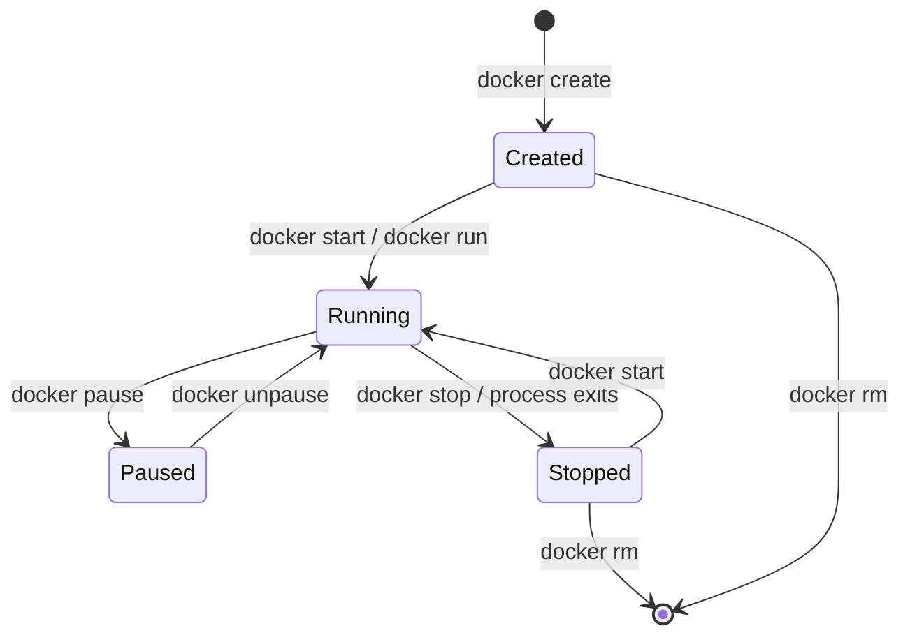
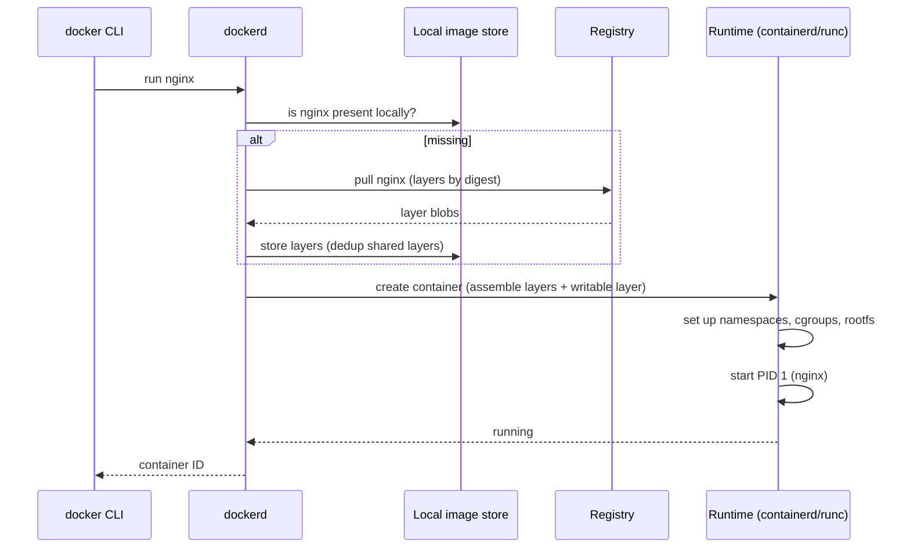

# Chapter 2 — Fundamentals: Images, Containers, and the Lifecycle

## 1. Introduction

In Chapter 1 you met the three nouns of Docker — **image**, **container**, **registry** —
and the one-line story that connects them: *pull an image from a registry, run it to get
a container.* That was the map. This chapter is the territory. You will spend real time
with the command line, learn the **full lifecycle** of a container (created → running →
paused → stopped → removed), and learn to **inspect and debug** what's happening. By the
end, the Docker CLI should feel less like incantations and more like a small, predictable
vocabulary you can compose.

We deliberately stay at the "operator" level here — running and managing images other
people built. Chapter 3 teaches you to *build your own* with Dockerfiles. Mastering this
chapter first means that when builds go wrong later, you already know how to poke at the
result.

---

## 2. Learning Goals

By the end of this chapter you will be able to:

- Use the essential `docker` commands fluently: `run`, `ps`, `images`, `pull`, `stop`,
  `start`, `rm`, `rmi`, `logs`, `exec`, `inspect`.
- Describe and reason about the **container lifecycle** and the states a container moves
  through.
- Understand the most important `docker run` flags (`-d`, `-it`, `-p`, `--name`, `--rm`,
  `-e`, `-v`) and *why* each exists.
- Inspect a running container's logs, processes, and metadata to debug problems.
- Manage images and containers on disk, and reclaim space safely.

---

## 3. Concepts Explained

### 3.1 Images are made of layers (a first look)

When you `docker pull nginx`, you'll notice it downloads several pieces in parallel,
each with its own hash. Those are **layers**. An image is not one monolithic blob — it's
a *stack* of read-only layers, each representing a filesystem change (e.g. "install
nginx," "copy config"). We dissect layers in Chapter 3; for now just know: layers are why
pulls and builds are fast (shared layers are downloaded once and reused across images).

### 3.2 Image identity: repository, tag, and digest

An image reference looks like `nginx:1.27` or `registry.example.com/team/api:v2`.

- **Repository** — the name (`nginx`, `team/api`).
- **Tag** — a human-friendly label for a version (`1.27`, `latest`, `v2`). Tags are
  *mutable pointers*: `nginx:latest` can point to different content over time.
- **Digest** — a content hash like `sha256:abc123…`. Digests are *immutable*: a digest
  always refers to the exact same bytes. Production systems often pin by digest for
  reproducibility (Ch 6/8).

> `latest` is **not** "the newest" in any magical sense — it's just the default tag used
> when you omit one. Relying on it blindly is a classic source of "it changed under me"
> bugs.

### 3.3 The container lifecycle

A container moves through well-defined states:



- **Created** — the container exists (filesystem prepared) but isn't running.
- **Running** — its main process is executing.
- **Paused** — its processes are frozen (via cgroups freezer), holding memory but using
  no CPU.
- **Stopped (Exited)** — the main process has ended; the container's writable layer still
  exists on disk.
- **Removed** — deleted; writable layer gone. `docker run` is just `create` + `start`.

A crucial subtlety: **a container lives only as long as its main process (PID 1).** If
that process exits, the container stops. This is why `docker run ubuntu` exits
immediately (bash with no input ends) while `docker run nginx` keeps running (nginx
stays in the foreground).

### 3.4 The anatomy of `docker run`

```text
docker run [OPTIONS] IMAGE [COMMAND] [ARGS...]
```

The most important options, each tied to a reason it exists:

| Flag | Meaning | Why it exists |
|---|---|---|
| `-d` | Detached (background) | Long-lived services shouldn't block your terminal |
| `-it` | Interactive + TTY | To get a shell or interact with the process |
| `-p H:C` | Publish host port → container port | Containers are isolated; you must explicitly expose ports |
| `--name` | Give the container a name | So you can reference it without copying IDs |
| `--rm` | Auto-remove on exit | Keep the system clean for throwaway runs |
| `-e K=V` | Set an environment variable | Configure the app without rebuilding the image |
| `-v` / `--mount` | Mount a volume/bind | Persist or share data (Ch 5) |
| `--restart` | Restart policy | Auto-recover crashed containers (Ch 8) |

---

## 4. Internal Working / Deep Dive

### 4.1 What actually happens on `docker run nginx`



The daemon assembles the image's read-only layers, adds a thin **writable layer** on top
(a "copy-on-write" layer where the container's runtime changes go), sets up isolation,
and launches the entry process as PID 1 inside the container. The runtime details
(namespaces/cgroups, containerd/runc) are Chapter 4 — but notice the writable layer
already: it's where your "lost data" from Chapter 1's exercise went.

### 4.2 The writable layer and why data is ephemeral

Every container gets its own thin read-write layer stacked on the shared read-only image
layers. Writes go there via **copy-on-write**: when a process modifies a file from a lower
layer, the file is first copied up into the writable layer, then changed. When the
container is removed, that writable layer is deleted — hence ephemeral data. Volumes
(Ch 5) bypass this layer entirely to persist data.

### 4.3 Foreground process and signals

PID 1 in a container is special: the Linux kernel treats PID 1 differently (it doesn't get
default signal handlers, and it's responsible for reaping zombie child processes). This is
why `docker stop` sends **SIGTERM** to PID 1 and, after a grace period (default 10s), a
**SIGKILL**. Apps that ignore SIGTERM get hard-killed and may lose in-flight work — a real
production concern we revisit in Chapter 8 (graceful shutdown).

### 4.4 `exec` vs `attach`

- `docker exec` starts a **new** process inside an already-running container (great for
  debugging: `docker exec -it web bash`).
- `docker attach` connects your terminal to the container's **existing PID 1**
  stdin/stdout — detaching incorrectly can kill the container. Prefer `exec` for poking
  around.

---

## 5. Examples

### Example 1 — Run, list, inspect, stop

```bash
docker run -d --name web -p 8080:80 nginx     # start detached, named, port-mapped
docker ps                                      # running containers
docker ps -a                                   # include stopped ones
docker logs web                                # see stdout/stderr
docker logs -f web                             # follow live (Ctrl-C to stop following)
docker stop web                                # graceful stop (SIGTERM then SIGKILL)
docker start web                               # bring it back
docker rm -f web                               # force-remove (stop + delete)
```

### Example 2 — Debug a running container from the inside

```bash
docker run -d --name api -p 3000:3000 my/api:dev
docker exec -it api sh        # open a shell inside (use bash if available)
# inside:
#   env            -> see the container's environment variables
#   ps aux         -> see its processes (usually just your app + your shell)
#   cat /etc/hosts -> see how Docker wired its networking
#   exit
```

### Example 3 — Pass configuration without rebuilding

```bash
docker run -d --name api \
  -e NODE_ENV=production \
  -e DATABASE_URL=postgres://db:5432/app \
  -p 3000:3000 \
  my/api:1.4
```

The same image behaves differently in dev vs prod purely via `-e`. This is the
"externalize configuration" principle in action (formalized in Ch 8).

### Example 4 — Inspect metadata programmatically

```bash
docker inspect web                                   # full JSON metadata
docker inspect -f '{{.State.Status}}' web            # just the status
docker inspect -f '{{.NetworkSettings.IPAddress}}' web   # container IP
docker stats                                         # live CPU/mem per container
docker top web                                       # processes as seen from the host
```

`docker inspect` is your single most valuable debugging tool — it shows the exact config,
mounts, networks, env, and state of a container.

### Example 5 — Manage images and reclaim space

```bash
docker images                 # list local images
docker pull redis:7           # fetch a specific tag
docker rmi nginx:1.27         # remove an image (must have no containers using it)
docker image prune            # remove dangling (untagged) images
docker system df              # see disk usage by images/containers/volumes
docker system prune           # remove unused containers, networks, dangling images
docker system prune -a --volumes   # aggressive cleanup (careful: removes more)
```

---

## 6. Real-World Use Cases

- **Spinning up dependencies for local dev:** `docker run -d -p 5432:5432 -e
  POSTGRES_PASSWORD=dev postgres:16` gives you a database in seconds, deletable in one
  command — no system install.
- **Debugging a misbehaving service:** `docker logs -f`, `docker exec -it … sh`, and
  `docker inspect` are the trio you'll reach for daily to answer "why is this container
  unhealthy?"
- **Quick tool runs:** run a CLI tool from an image without installing it, e.g.
  `docker run --rm -v "$PWD:/work" -w /work some/linter`.
- **Reproducing a teammate's bug:** pull the exact tag/digest they used and run it; the
  environment is identical, so the bug reproduces.
- **CI ephemeral environments:** `--rm` containers spun up and torn down per test job.

---

## 7. Common Mistakes

- **Forgetting `-p`, then "the service isn't reachable."** Containers are isolated; an
  exposed port inside the container is invisible until published with `-p`.
- **Reusing a `--name` that's already taken.** `docker: Error … name is already in use`.
  Remove the old container or pick a new name.
- **Assuming `docker stop` is instant.** It waits up to ~10s for graceful shutdown. Apps
  that ignore SIGTERM get killed and may corrupt/lose work.
- **Letting stopped containers and dangling images pile up** until the disk fills. Use
  `docker ps -a`, `docker system df`, and periodic `prune`.
- **Editing files inside a running container and expecting them to survive.** They live in
  the ephemeral writable layer. Rebuild the image (Ch 3) or use a volume (Ch 5).
- **Using `latest` in scripts/CI** and being surprised when behavior changes. Pin a tag or
  digest.
- **`docker attach` when you meant `docker exec`,** then accidentally killing PID 1 on
  detach.

---

## 8. Best Practices

- **Always name long-lived containers** (`--name`) so commands read clearly.
- **Use `--rm` for throwaway/experimental runs** to avoid clutter.
- **Pin image tags** (and digests in production) instead of relying on `latest`.
- **Reach for `docker logs`, `docker inspect`, and `docker stats` first** when debugging —
  in that order: what did it say, how is it configured, how is it resourced.
- **Prefer `docker exec -it … sh`/`bash` over `attach`** for interactive debugging.
- **Run `docker system df` before pruning** so you understand what you're about to delete,
  and avoid `--volumes` unless you're sure (it can delete data).
- **One concern per container** — don't run your app and its database in the same
  container.

---

## 9. Hands-On Exercise

**Goal:** internalize the lifecycle and the debugging toolkit.

1. **Lifecycle walk-through.** Run a detached nginx named `lab`. Use `docker ps`, then
   `docker pause lab` and observe `docker ps` again (note the status), `docker unpause`,
   `docker stop`, `docker ps -a`, `docker start`, and finally `docker rm -f`.

2. **Prove the ephemeral layer.** Run `docker run -it --name tmp ubuntu bash`. Inside,
   create a file: `echo hi > /root/note.txt`, then `exit`. Start it again with
   `docker start -ai tmp` and check the file is still there (it is — same container).
   Now `docker rm tmp`, run a *fresh* `docker run -it ubuntu bash`, and look for
   `/root/note.txt` — gone. Explain why in two sentences.

3. **Configure via environment.** Run Postgres with a password set via `-e`, then
   `docker exec -it <name> env | grep POSTGRES` to confirm the variable is set inside.

4. **Inspect like a pro.** For your running Postgres, extract *only* its IP address and
   its status using `docker inspect -f`. Then run `docker stats` for 10 seconds and note
   its memory use.

5. **Clean up & measure.** Run `docker system df` before and after `docker system prune`.
   Record how much space you reclaimed.

**Deliverable:** a short note answering: *What's the difference between `start`ing an
existing stopped container and `run`ning a new one from the same image?*

---

## 10. Quiz Questions

1. What two operations does `docker run` combine?
2. Why does `docker run ubuntu` exit immediately while `docker run nginx` keeps running?
3. What is the difference between a **tag** and a **digest**, and which should production
   pin to?
4. A container is in the **Exited** state. Does its writable layer still exist? When is it
   destroyed?
5. What signal does `docker stop` send first, and what happens if the app ignores it?
6. When would you use `docker exec` instead of `docker attach`?
7. Your service is running (`docker ps` shows it) but `curl localhost:9000` fails. Name
   two things to check.
8. What's the risk of `docker system prune -a --volumes`?

<details>
<summary>Answer key</summary>

1. `create` (prepare the container) + `start` (run its process).
2. A container lives as long as PID 1. `ubuntu`'s default `bash` with no TTY/input exits
   immediately; `nginx` runs in the foreground and stays alive.
3. A tag is a mutable, human-friendly pointer; a digest is an immutable content hash.
   Production should pin to a digest (or at least a specific tag) for reproducibility.
4. Yes — the writable layer persists while the container is merely stopped; it's destroyed
   on `docker rm`.
5. SIGTERM. If ignored, after the grace period (~10s) Docker sends SIGKILL, hard-killing
   it and risking lost in-flight work.
6. Use `exec` to start a new debugging process (e.g. a shell) inside a running container
   without touching PID 1; `attach` connects to PID 1 and can accidentally kill it.
7. Did you publish the port with `-p`? Is the app actually listening on the expected
   container port/interface (0.0.0.0, not 127.0.0.1)? Also check logs for crashes.
8. It removes all unused images (not just dangling) *and* all unused volumes — which can
   delete data you wanted to keep.
</details>

---

## 11. Chapter Summary

- Images are **layered**, identified by **repository\:tag** (mutable) or **digest**
  (immutable); pin digests for reproducibility.
- A container moves through **Created → Running → (Paused) → Stopped → Removed**, and
  **lives only as long as its PID 1 process**.
- `docker run` = `create` + `start`; the key flags (`-d`, `-it`, `-p`, `--name`, `--rm`,
  `-e`, `-v`) each exist to solve a specific isolation/usability problem.
- Each container has an ephemeral **copy-on-write writable layer** — the reason in-container
  data vanishes on removal.
- Your daily debugging trio is **`docker logs`, `docker inspect`, `docker stats`**, plus
  `docker exec -it … sh` to get inside.
- Keep the system tidy with `docker system df` and careful `prune`.

Next: **Chapter 3 — Core Concepts**, where you stop running other people's images and start
*building your own* with Dockerfiles, layers, and the build cache.

---

## 12. Further Reading

- Docker CLI reference for `run`, `exec`, `inspect`, `logs`, `system`.
- Docker docs: "Container lifecycle" and "Manage data in Docker" (preview for Ch 5).
- The `docker inspect` Go-template formatting guide (for `-f '{{…}}'`).
- Article: how PID 1 and signal handling differ in containers (search "PID 1 zombie
  reaping Docker").
