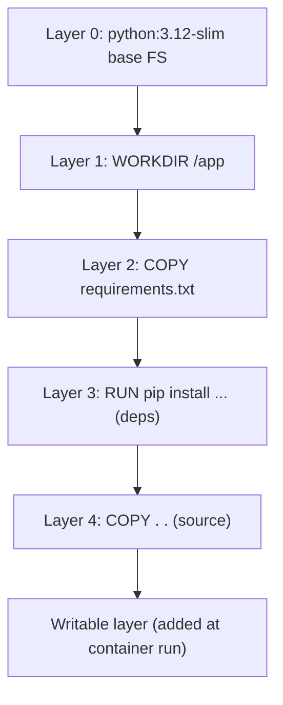

# Chapter 3 — Core Concepts: Dockerfiles, Layers, and the Build Cache

## 1. Introduction

Until now you've run images other people built. The moment you build your own, Docker
stops being a convenience and becomes a core part of how you ship software. The tool for
this is the **Dockerfile**: a plain-text recipe that describes, step by step, how to
assemble an image. It is the single most important file in the Docker world, and writing
good ones is a genuine skill — the difference between a 1.2 GB image that takes four
minutes to build and a 40 MB image that builds in eight seconds is almost entirely in how
you write this file.

This chapter teaches you to read and write Dockerfiles *with understanding*: not just
which instructions exist, but how each one creates a **layer**, how the **build cache**
decides what to reuse, and how **tagging** and the **build context** work. Get this right
and Chapters 5–6 (where we optimize and productionize) become straightforward.

---

## 2. Learning Goals

By the end of this chapter you will be able to:

- Write a correct Dockerfile from scratch for a real application.
- Explain how each instruction maps to an **image layer** and why layers are cached.
- Order instructions to **maximize build-cache hits** and minimize rebuild time.
- Distinguish the commonly confused pairs: `RUN` vs `CMD` vs `ENTRYPOINT`, `COPY` vs `ADD`,
  `ARG` vs `ENV`, shell vs exec form.
- Understand the **build context** and why a stray `node_modules` slows everything down.
- Build, tag, and push an image you authored.

---

## 3. Concepts Explained

### 3.1 What a Dockerfile is

A Dockerfile is an ordered list of **instructions**. The build process reads it top to
bottom, and most instructions produce a new **layer** stacked on the previous one. The
result is an image.

A minimal example for a Python web app:

```dockerfile
# 1. Start from a base image (someone else's layers)
FROM python:3.12-slim

# 2. Set the working directory inside the image
WORKDIR /app

# 3. Copy only dependency manifests first (cache optimization — see 4.2)
COPY requirements.txt .

# 4. Install dependencies
RUN pip install --no-cache-dir -r requirements.txt

# 5. Copy the rest of the source code
COPY . .

# 6. Document the port the app listens on
EXPOSE 8000

# 7. Define the default command to run when a container starts
CMD ["uvicorn", "main:app", "--host", "0.0.0.0", "--port", "8000"]
```

### 3.2 The essential instructions

| Instruction | Purpose |
|---|---|
| `FROM` | The base image you build on top of. Every Dockerfile starts here. |
| `WORKDIR` | Set/create the current directory for following instructions. |
| `COPY` | Copy files from the build context into the image. |
| `ADD` | Like COPY, but also unpacks local tarballs and can fetch URLs (use sparingly). |
| `RUN` | Execute a command **at build time**, baking the result into a layer. |
| `CMD` | Default command **at run time** (overridable by `docker run … <cmd>`). |
| `ENTRYPOINT` | The fixed executable **at run time**; `CMD` becomes its default args. |
| `ENV` | Set an environment variable present at build and run time. |
| `ARG` | A build-time-only variable, passed via `--build-arg`. |
| `EXPOSE` | Documents the port; does **not** publish it (you still need `-p`). |
| `LABEL` | Add metadata (maintainer, version, source). |
| `USER` | Switch the user for following instructions / runtime (security: Ch 6/10). |
| `HEALTHCHECK` | Define how Docker tests the container's health (Ch 7). |
| `VOLUME` | Declare a mount point for external data (Ch 5). |

### 3.3 The three pairs people confuse

**`RUN` vs `CMD` vs `ENTRYPOINT`**
- `RUN` happens **once, at build time**, and its effect is frozen into a layer (e.g.
  installing packages).
- `CMD` and `ENTRYPOINT` define what happens **at run time** when a container starts.
- `ENTRYPOINT` is the *fixed* program; `CMD` provides *default arguments* (or a default
  command if no ENTRYPOINT). Pattern: `ENTRYPOINT ["python", "app.py"]` +
  `CMD ["--port", "8000"]` lets users override just the args:
  `docker run myimg --port 9000`.

**`COPY` vs `ADD`** — Prefer `COPY` (predictable). Use `ADD` only when you specifically
want local-tarball auto-extraction. Avoid `ADD <url>` (opaque, uncacheable, a footgun).

**`ARG` vs `ENV`** — `ARG` exists only during the build and is **not** present in the
running container. `ENV` persists into the running container. Never pass secrets via
`ARG`/`ENV` (they end up in image history/metadata — Ch 6/8 cover the right way).

**Shell form vs exec form** — `CMD npm start` (shell form) runs via `/bin/sh -c`, which
means your app is *not* PID 1 (the shell is), so signals like SIGTERM may not reach it.
`CMD ["npm", "start"]` (exec form, JSON array) runs the program directly as PID 1. **Use
exec form** for `CMD`/`ENTRYPOINT` so graceful shutdown works.

### 3.4 Tagging and the build command

```bash
docker build -t myorg/api:1.0 .
```

- `-t myorg/api:1.0` names and tags the image.
- The final `.` is the **build context** — the directory sent to the daemon (3.5).
- You can apply multiple tags: `-t myorg/api:1.0 -t myorg/api:latest`.

Push to a registry:
```bash
docker login
docker push myorg/api:1.0
```

---

## 4. Internal Working / Deep Dive

### 4.1 Layers: what they are and why they exist

Each layer is a **diff** of filesystem changes relative to the layer below it. When you
build, Docker stacks these read-only layers using a **union filesystem** (Ch 4) so they
appear as one coherent filesystem. Layers are **content-addressed** (identified by a hash
of their contents) and **shared**: if two images both start `FROM python:3.12-slim`, that
base layer is stored once on disk and downloaded once.



### 4.2 The build cache — the single biggest performance lever

For each instruction, Docker computes a cache key. If the instruction *and* its inputs
are unchanged since a previous build, Docker **reuses the cached layer** instead of
re-running it. The catch: **once one layer's cache is invalidated, every layer after it
is rebuilt too.**

This is why instruction order matters enormously. Consider the difference:

```dockerfile
# BAD: any source change busts the dependency cache
COPY . .
RUN pip install -r requirements.txt
```

```dockerfile
# GOOD: deps only re-install when requirements.txt changes
COPY requirements.txt .
RUN pip install -r requirements.txt
COPY . .
```

In the bad version, editing one line of source invalidates the `COPY . .` layer, which
busts the `pip install` layer below it — so you reinstall every dependency on every code
change. In the good version, dependencies are cached until `requirements.txt` itself
changes. **Rule: order instructions from least-frequently-changing to
most-frequently-changing.**

For `RUN` instructions, the cache key is the *command text*, not the actual result — so
`RUN apt-get update` can serve stale data from cache. Combine update+install in one
`RUN` and you sidestep this (also fewer layers):

```dockerfile
RUN apt-get update && apt-get install -y --no-install-recommends curl \
    && rm -rf /var/lib/apt/lists/*
```

### 4.3 The build context

When you run `docker build … .`, the CLI **tars up the entire directory** (the context)
and sends it to the daemon — because the daemon may be remote and needs the files. If your
directory contains a 500 MB `node_modules` or a `.git` folder, all of that is transferred
even if the Dockerfile doesn't `COPY` it. The fix is a **`.dockerignore`** file (same
syntax as `.gitignore`):

```text
.git
node_modules
*.log
__pycache__
.env
dist
```

A good `.dockerignore` speeds up builds, shrinks context transfer, and prevents secrets
(like `.env`) from accidentally being copied into images.

### 4.4 Image history and reproducibility

```bash
docker history myorg/api:1.0
```

shows each layer, the instruction that created it, and its size — invaluable for finding
"why is my image so big?" Because tags are mutable, two builds of `:1.0` can differ;
**digests** (Ch 2) are how you refer to an exact build. Pinning your *base* image by
digest (`FROM python:3.12-slim@sha256:…`) makes builds reproducible even if the upstream
tag moves.

---

## 5. Examples

### Example 1 — A clean, cache-friendly Node service

```dockerfile
FROM node:20-slim
WORKDIR /app
COPY package.json package-lock.json ./
RUN npm ci --omit=dev
COPY . .
EXPOSE 3000
CMD ["node", "server.js"]
```

`npm ci` re-runs only when the lockfile changes; source edits reuse the dependency layer.

### Example 2 — ENTRYPOINT + CMD for a configurable CLI tool

```dockerfile
FROM python:3.12-slim
WORKDIR /app
COPY . .
ENTRYPOINT ["python", "tool.py"]
CMD ["--help"]
```

```bash
docker run myorg/tool                 # runs: python tool.py --help
docker run myorg/tool --input data.csv  # runs: python tool.py --input data.csv
```

### Example 3 — Build, tag, inspect, push

```bash
docker build -t myorg/api:1.0 -t myorg/api:latest .
docker images | grep api
docker history myorg/api:1.0          # see layer sizes
docker run --rm -p 8000:8000 myorg/api:1.0   # smoke test
docker login
docker push myorg/api:1.0
docker push myorg/api:latest
```

### Example 4 — Build args for flexible builds

```dockerfile
FROM node:20-slim
ARG BUILD_ENV=production
ENV NODE_ENV=$BUILD_ENV
WORKDIR /app
COPY package*.json ./
RUN npm ci
COPY . .
CMD ["node", "server.js"]
```

```bash
docker build --build-arg BUILD_ENV=staging -t myorg/api:staging .
```

---

## 6. Real-World Use Cases

- **Standardizing how every service is built** across a team: one Dockerfile pattern per
  language stack, reviewed and reused.
- **Reproducible CI builds:** the Dockerfile is the source of truth, so the CI runner and a
  developer laptop produce equivalent images.
- **Onboarding:** a new hire runs `docker build` + `docker run` and has the whole app
  working, regardless of their OS.
- **Pinning environments for compliance:** base images pinned by digest, dependencies
  pinned by lockfile — auditable and reproducible.
- **Building tools as images:** distributing a CLI tool as an image so users don't install
  a runtime (see the ENTRYPOINT pattern).

---

## 7. Common Mistakes

- **`COPY . .` before installing dependencies**, destroying the dependency cache on every
  source edit. Order matters.
- **Many separate `RUN` apt commands**, creating extra layers and stale-cache bugs.
  Combine with `&&` and clean up package lists in the same layer.
- **Shell form `CMD`** (`CMD npm start`) so the app isn't PID 1 and ignores SIGTERM —
  breaking graceful shutdown. Use exec form (JSON array).
- **Putting secrets in `ARG`/`ENV`/layers.** They persist in image history; anyone with the
  image can read them. (Proper secret handling: Ch 6/8.)
- **No `.dockerignore`,** so the build ships `node_modules`, `.git`, and maybe `.env` into
  the context (slow, leaky).
- **Confusing `EXPOSE` with publishing.** `EXPOSE` is documentation only; you still need
  `-p` at run time.
- **Using `ADD` for everything,** inheriting its surprising URL/tarball behavior. Default to
  `COPY`.
- **Not pinning the base tag** (`FROM python` with no tag), so builds drift over time.

---

## 8. Best Practices

- **Order instructions least- to most-frequently-changing** to maximize cache reuse.
- **Copy dependency manifests and install before copying source.**
- **Use exec form** for `CMD`/`ENTRYPOINT` (JSON arrays).
- **One logical step, one `RUN`,** chaining and cleaning up in the same layer
  (`&& rm -rf /var/lib/apt/lists/*`).
- **Always add a `.dockerignore`.**
- **Pin base images** by specific tag, and by digest for production.
- **Prefer slim/minimal base images** (`-slim`, `alpine`, or distroless — Ch 6) to shrink
  size and attack surface.
- **Add `LABEL`s** for provenance (source repo, version, maintainer).
- **Run as a non-root `USER`** where possible (deep dive in Ch 6/10).
- **Keep the Dockerfile in version control** next to the code it builds.

---

## 9. Hands-On Exercise

**Goal:** author, optimize, and publish your own image.

1. **Containerize a small app.** Take any small web app you have (or scaffold a 10-line
   Flask/Express app). Write a Dockerfile that installs deps then copies source, in the
   cache-friendly order. Build it: `docker build -t me/app:0.1 .` and run it.

2. **Prove the cache.** Change one line of *source* and rebuild — observe in the build
   output that the dependency layer is `CACHED`. Now change a dependency manifest line and
   rebuild — observe the dependency layer rebuilds.

3. **Add a `.dockerignore`.** Before/after, compare the "Sending build context" size in the
   build output (or note build time). Make sure `.git`/`node_modules`/`__pycache__` are
   ignored.

4. **Inspect layers.** Run `docker history me/app:0.1`. Identify the largest layer. Write
   one sentence on what you'd try to shrink it (foreshadowing Ch 6).

5. **ENTRYPOINT/CMD.** Convert your `CMD` to an `ENTRYPOINT` + `CMD` split and verify you can
   override the args from `docker run`.

6. **(Optional) Push.** Create a free Docker Hub repo and `docker push` your tagged image.

**Deliverable:** your Dockerfile + `.dockerignore`, plus a 3-sentence note explaining the
instruction order you chose and why.

---

## 10. Quiz Questions

1. Which instructions create a new layer, and which (like `CMD`) mostly add metadata?
2. Why should you `COPY requirements.txt` and install *before* `COPY . .`?
3. Explain the difference between `RUN`, `CMD`, and `ENTRYPOINT`.
4. Why is exec form (`CMD ["node","server.js"]`) preferred over shell form?
5. What is the build context, and what problem does `.dockerignore` solve?
6. Where do `ARG` values exist, and why must you never pass a secret via `ARG` or `ENV`?
7. `EXPOSE 8000` is in your Dockerfile but `curl localhost:8000` fails. Why?
8. How would you make a build reproducible against a moving upstream base tag?

<details>
<summary>Answer key</summary>

1. `FROM`, `RUN`, `COPY`, `ADD` create filesystem layers; `CMD`, `ENTRYPOINT`, `ENV`,
   `EXPOSE`, `LABEL` mostly add metadata/config (some create tiny metadata layers).
2. So the dependency-install layer stays cached across source-only changes; copying source
   first would bust that cache on every edit.
3. `RUN` executes at build time and bakes results into a layer; `CMD` sets the default
   runtime command (overridable); `ENTRYPOINT` sets the fixed runtime executable, with
   `CMD` supplying its default arguments.
4. Exec form runs the process directly as PID 1, so it receives SIGTERM for graceful
   shutdown; shell form wraps it in `/bin/sh -c`, so the shell is PID 1 and signals may
   not reach the app.
5. The context is the directory tar'd up and sent to the daemon at build time;
   `.dockerignore` excludes files (e.g. `node_modules`, `.git`, `.env`) to speed builds and
   avoid leaking files into the image.
6. `ARG` values exist only during the build (not in the running container); both `ARG` and
   `ENV` end up in image metadata/history, so secrets baked in are readable by anyone with
   the image.
7. `EXPOSE` only documents the port; you must publish it at run time with `-p 8000:8000`.
8. Pin the base image by digest: `FROM python:3.12-slim@sha256:…`.
</details>

---

## 11. Chapter Summary

- A **Dockerfile** is an ordered recipe; most instructions create a **layer**, and images
  are stacks of content-addressed, shared, read-only layers.
- The **build cache** reuses unchanged layers, but invalidating one layer rebuilds all
  below it — so **order instructions least- to most-frequently-changing** and copy
  dependency manifests before source.
- Know the confusing pairs cold: `RUN`/`CMD`/`ENTRYPOINT`, `COPY`/`ADD`, `ARG`/`ENV`, and
  shell vs **exec form** (use exec form for signals).
- The **build context** is sent to the daemon; a **`.dockerignore`** keeps it small and
  leak-free.
- Tag meaningfully, pin base images (digests for prod), and use `docker history` to
  understand size.

Next: **Chapter 4 — Architecture**, where we go below the CLI to see how the daemon,
containerd, runc, namespaces, cgroups, and the union filesystem actually create the
isolation you've been relying on.

---

## 12. Further Reading

- Docker docs: "Dockerfile reference" and "Best practices for writing Dockerfiles."
- Docker docs: "Build cache" and "`.dockerignore` file."
- "Understanding image layers" articles; `dive` tool for exploring layers visually.
- BuildKit documentation (preview for Ch 10's advanced build features).
