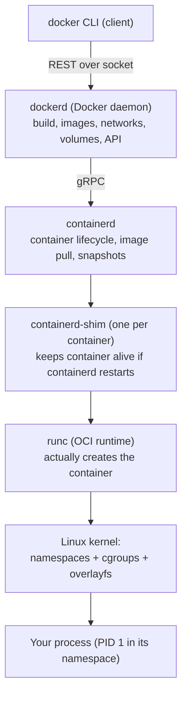
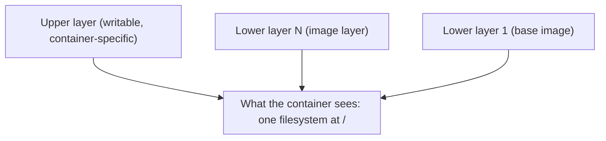

# Chapter 4 — Architecture: How Containers Actually Work

## 1. Introduction

You can use Docker productively for years treating it as a black box. But the moment a
container behaves strangely — a process won't die, memory limits don't seem to apply, a
file appears in one container and not another, networking does something inexplicable —
the black box becomes a wall. This chapter knocks the wall down.

We answer the question Chapter 1 deferred: *what is a container, really, at the level of
the Linux kernel?* The honest answer is almost anticlimactic: **a container is just a
normal Linux process that the kernel has been told to lie to.** It's told it has its own
process tree, its own filesystem root, its own network stack, and a limited slice of CPU
and memory. Three kernel features make those lies convincing — **namespaces** (isolation),
**cgroups** (resource limits), and **union filesystems** (layered images). Above the
kernel sits a small stack of programs — **dockerd**, **containerd**, **runc** — that
coordinate it all. Understanding this stack is what separates an operator from an
engineer.

---

## 2. Learning Goals

By the end of this chapter you will be able to:

- Describe the Docker runtime stack: **CLI → dockerd → containerd → shim → runc → process**,
  and what each component is responsible for.
- Explain the major **Linux namespaces** and which aspect of isolation each provides.
- Explain **cgroups** and how they enforce CPU/memory/IO limits.
- Explain **union/overlay filesystems** and how they implement image layers and
  copy-on-write.
- Reason about container behavior (signals, limits, isolation) from first principles when
  things go wrong.

---

## 3. Concepts Explained

### 3.1 The runtime stack

Docker is not one program; it's a layered stack, each layer with a narrow job. This
modularity is *why* Kubernetes can drop Docker and talk to containerd directly.



- **dockerd** — the high-level daemon. Handles the Docker API, image building, networking,
  volumes, and orchestrates everything. This is the "Docker-specific" layer.
- **containerd** — a lower-level, standards-based daemon that manages the complete
  container lifecycle: pulling images, managing snapshots (layers), and supervising
  containers. It's a CNCF project usable independently of Docker.
- **containerd-shim** — a tiny process, one per container, that becomes the container's
  parent. Its job: keep the container running even if containerd or dockerd restarts, and
  report exit status. This is why you can restart the Docker daemon without killing your
  containers.
- **runc** — the reference **OCI runtime**: a small CLI tool that does the actual kernel
  syscalls to create namespaces, set up cgroups, set the root filesystem, and `exec` your
  process. After it sets things up, runc exits — the container is now just your process
  supervised by the shim.

> **Key insight:** Docker delegates the *actual* container creation to runc via containerd.
> The "container" isn't a long-running Docker thing — it's your process, fenced off by the
> kernel.

### 3.2 Namespaces — the isolation mechanism

A **namespace** wraps a global system resource so that the processes inside the namespace
see their own isolated instance of it. Linux provides several; a container typically gets
one of each:

| Namespace | Isolates | Effect inside the container |
|---|---|---|
| **PID** | Process IDs | Your app sees itself as PID 1; can't see host processes |
| **Mount (mnt)** | Filesystem mount points | Its own root filesystem and mounts |
| **Network (net)** | Network stack | Own interfaces, IP, routing, ports |
| **UTS** | Hostname/domain | Can set its own hostname |
| **IPC** | Inter-process comm (shared mem, queues) | Isolated IPC from other containers |
| **User** | UID/GID mappings | Can map container-root to an unprivileged host user (rootless) |
| **Cgroup** | cgroup root view | Sees a clean cgroup hierarchy |

When you ran `ps aux` inside the Ubuntu container in Chapter 1 and saw almost nothing, that
was the **PID namespace** at work. When you needed `-p` to reach a service, that was the
**network namespace** (the container has its own isolated network stack, so you must bridge
a port across).

### 3.3 cgroups — the resource limiting mechanism

**Control groups (cgroups)** limit, account for, and isolate resource usage (CPU, memory,
block IO, network, PIDs) of a group of processes. Namespaces decide *what a process can
see*; cgroups decide *how much it can use*.

```bash
docker run -d --name limited \
  --memory=256m --cpus="0.5" --pids-limit=100 \
  nginx
```

- `--memory=256m` — the container's processes are killed (OOM) if they exceed 256 MB.
- `--cpus="0.5"` — capped at half a CPU core's worth of time.
- `--pids-limit=100` — can't fork-bomb the host.

Without cgroups, one greedy container could starve every other container and the host
itself. cgroups are the reason containers are safe to pack densely.

### 3.4 Union / overlay filesystems — how layers become one FS

Image layers (Ch 3) are stacked using a **union filesystem**, in modern Docker almost
always **OverlayFS**. OverlayFS merges multiple directories ("lower" read-only layers and
one "upper" writable layer) into a single unified view.



- **Lower layers** are the read-only image layers, shared across all containers using that
  image.
- **Upper layer** is the container's writable layer.
- **Copy-on-write:** reading a file comes straight from a lower layer; *modifying* it copies
  the file up to the writable layer first, then edits the copy. The original lower layer is
  never changed — which is why one image can back many containers safely, and why removing a
  container (deleting its upper layer) loses its changes.

---

## 4. Internal Working / Deep Dive

### 4.1 Life of `docker run`, kernel edition

1. CLI → dockerd: "run image X."
2. dockerd asks containerd to ensure the image's layers are present (pull if needed) and
   creates a **snapshot** (the merged overlay rootfs with a fresh writable upper layer).
3. containerd spawns a **shim** and invokes **runc** with an **OCI runtime spec** (a JSON
   `config.json` describing the rootfs path, the command, env, namespaces to create,
   cgroup limits, mounts, capabilities, seccomp profile).
4. runc makes the syscalls: `clone()`/`unshare()` to create namespaces, writes cgroup
   limits, `pivot_root` into the container rootfs, drops capabilities, applies seccomp,
   then `exec`s your process.
5. runc exits. Your process is now PID 1 in its PID namespace, parented to the shim.

This is the whole magic. There is no "container object" running — just your process, the
kernel's isolation, and a shim watching it.

### 4.2 Why a process "won't die" or limits "don't apply"

- **A defunct/zombie pile-up:** PID 1 in a container must reap children. If your app isn't a
  proper init and spawns children, zombies accumulate. Fix: use an init (`--init` adds a
  tiny `tini`), or run a real init process.
- **`docker stop` seems ignored:** your PID 1 ignores SIGTERM (often because it's a shell,
  per Ch 3's shell-vs-exec point). The kernel doesn't give PID 1 default signal handlers, so
  ignoring SIGTERM means waiting for the SIGKILL.
- **Memory limit "ignored":** many runtimes (JVM, Node) historically read *host* memory, not
  the cgroup limit, and over-allocate. Modern runtimes are cgroup-aware, but you may need
  flags. The cgroup limit is real — the app just didn't *look* at it.

### 4.3 Docker Desktop on macOS/Windows: the hidden Linux VM

Namespaces, cgroups, and OverlayFS are **Linux kernel** features. macOS and Windows don't
have them. So Docker Desktop quietly runs a **lightweight Linux VM**, and your containers
run *inside that VM*. This explains a few "gotchas": bind-mount performance is slower
(crossing the VM boundary), `localhost` semantics differ, and "the host" from a container's
perspective is the VM, not your laptop. On native Linux, containers run directly on your
kernel — which is why the internals chapters are best practiced there.

### 4.4 The OCI standards (why this is all interchangeable)

The **Open Container Initiative (OCI)** defines two specs: the **image spec** (how images
are structured — layers, manifest, config) and the **runtime spec** (the `config.json` runc
consumes). Because Docker images are OCI images and runc is an OCI runtime, you can swap
runc for alternative runtimes (gVisor for stronger isolation, Kata for VM-backed
containers) and swap Docker for other tools (Podman, containerd directly) while reusing the
same images. We return to OCI in Chapter 10.

---

## 5. Examples

### Example 1 — See the isolation directly

```bash
docker run -d --name iso --hostname mybox alpine sleep 1000

# PID namespace: container sees only its own processes
docker exec iso ps aux

# UTS namespace: its own hostname
docker exec iso hostname            # -> mybox

# From the host, the same process is visible with a host PID
docker top iso
ps aux | grep sleep                 # find it on the host (different PID)
```

The `sleep` is PID 1 inside the container but some large PID on the host — same process,
two views. That's the PID namespace.

### Example 2 — Enforce and observe a memory limit

```bash
docker run -d --name mem --memory=64m polinux/stress \
  stress --vm 1 --vm-bytes 128M --vm-hang 0

sleep 3
docker inspect -f '{{.State.OOMKilled}}' mem   # -> true (killed for exceeding 64m)
docker logs mem
```

The cgroup memory controller enforces the cap and the kernel OOM-kills the offender.

### Example 3 — Watch copy-on-write happen

```bash
docker run -it --rm --name cow alpine sh
# inside:
#   ls -la /etc/hostname        (a file from a lower, read-only layer)
#   echo changed > /etc/hostname  (this copies the file up to the writable layer)
#   exit
```

Reading was free; the write triggered copy-up into the container's writable upper layer.
A brand-new container from the same image still sees the original — proof the lower layer
was untouched.

### Example 4 — Restart the daemon without killing containers

```bash
docker run -d --name survivor nginx
sudo systemctl restart docker     # (on Linux) restart the daemon
docker ps                         # survivor is still running, thanks to the shim
```

---

## 6. Real-World Use Cases

- **Right-sizing workloads:** setting `--memory`/`--cpus` per service so one noisy neighbor
  can't take down a host — the foundation of multi-tenant density and the basis for
  Kubernetes resource requests/limits.
- **Diagnosing "stuck" containers:** knowing PID 1 / signal behavior lets you fix
  shutdown-hang and zombie-process incidents instead of just `docker kill`-ing.
- **Choosing isolation strength:** swapping runc for gVisor/Kata in security-sensitive,
  multi-tenant platforms because you understand the runtime is pluggable.
- **Explaining Docker Desktop performance:** knowing the hidden VM tells you why bind mounts
  are slow on macOS and how to mitigate (named volumes, cache modes).
- **Migrating to Kubernetes:** K8s talks to containerd via the CRI; understanding the stack
  makes the transition conceptual rather than mysterious — directly relevant when you're
  moving workloads onto a cluster.

---

## 7. Common Mistakes

- **Believing a container is a VM** and expecting hardware-level isolation; it's
  kernel-shared process isolation.
- **Running no init for multi-process or child-spawning apps,** leading to zombie buildup;
  forgetting `--init`.
- **Setting `--memory` but assuming the runtime respects it,** when the app reads host
  memory and over-allocates.
- **Expecting Linux-internals exercises to behave identically on macOS/Windows,** ignoring
  the Docker Desktop VM.
- **Thinking `--cpus` pins a core;** it limits CPU *time/share*, it doesn't reserve a
  specific core.
- **Assuming the writable layer is a good place for important data;** it's per-container and
  ephemeral (use volumes — Ch 5).
- **Killing containers with `docker kill` as a habit,** masking real signal-handling bugs.

---

## 8. Best Practices

- **Set resource limits (`--memory`, `--cpus`, `--pids-limit`)** on anything that matters;
  unbounded containers are an outage waiting to happen.
- **Use `--init`** (or a proper init like tini) for apps that spawn child processes.
- **Make your app handle SIGTERM** and run it as PID 1 via exec-form `CMD`/`ENTRYPOINT`.
- **Practice internals on native Linux** to see true behavior; treat Docker Desktop as a
  convenience layer with its own quirks.
- **Drop capabilities and apply seccomp** for untrusted workloads (the runtime spec supports
  it; details in Ch 10).
- **Prefer OverlayFS** (the modern default storage driver) unless you have a specific reason
  not to.
- **Reason from the stack:** when something's weird, ask "is this a namespace thing, a
  cgroup thing, or a filesystem thing?" — it localizes the problem fast.

---

## 9. Hands-On Exercise

**Goal:** observe namespaces, cgroups, and overlay with your own eyes (best on Linux).

1. **PID namespace.** Run `docker run -d --name s alpine sleep 600`. Inside
   (`docker exec s ps aux`), note the `sleep` PID. On the host, `docker top s` and
   `ps aux | grep sleep` — record both PIDs and explain why they differ.

2. **cgroup memory limit.** Run a container with `--memory=64m` running a stress tool that
   tries to allocate more. Confirm `docker inspect -f '{{.State.OOMKilled}}' <name>` reports
   `true`. Then re-run with `--memory=512m` and show it survives.

3. **CPU share.** Run two `--cpus="0.5"` busy-loop containers and watch `docker stats` — note
   neither exceeds ~50% of a core.

4. **Copy-on-write.** Modify a file in a container (Example 3). Start a fresh container from
   the same image and confirm the original file is unchanged. Explain in two sentences.

5. **Shim survives daemon restart.** Start a container, restart the Docker daemon (Linux),
   and confirm with `docker ps` it's still running. Explain which component made that
   possible.

6. **(Reflection)** Map each thing you observed to a kernel feature: visibility →
   namespace; limits → cgroup; layered files → overlay.

**Deliverable:** a short table mapping each observation to the kernel mechanism responsible.

---

## 10. Quiz Questions

1. Name the components in the runtime stack from CLI down to the kernel, and give each a
   one-line job.
2. What is the job of the **containerd-shim**, and what failure does it prevent?
3. Which namespace makes a container see its app as PID 1 and hides host processes?
4. Namespaces vs cgroups: which controls *visibility* and which controls *resource usage*?
5. Explain copy-on-write in an overlay filesystem and why it lets many containers share one
   image safely.
6. Why do namespaces/cgroups mean Docker Desktop on macOS must run a Linux VM?
7. Your app spawns children and you see zombie processes accumulating. What's the cause and
   one fix?
8. What does the OCI standardize, and why does that make runtimes and tooling
   interchangeable?

<details>
<summary>Answer key</summary>

1. **dockerd** (Docker API, build, networks, volumes) → **containerd** (lifecycle, image
   pull, snapshots) → **shim** (per-container supervisor) → **runc** (makes the kernel
   syscalls to create the container) → **kernel** (namespaces/cgroups/overlay) → your
   process.
2. The shim becomes the container's parent and keeps it alive (and tracks exit status) even
   if containerd/dockerd restarts — preventing a daemon restart from killing running
   containers.
3. The **PID namespace**.
4. Namespaces control visibility/isolation; cgroups control resource usage/limits.
5. Reads come from shared read-only lower layers; a write copies the file up into the
   container's private writable layer and edits the copy, leaving lower layers untouched —
   so one image backs many containers without conflict.
6. Those are Linux kernel features absent on macOS/Windows, so Docker Desktop runs a small
   Linux VM and runs containers inside it.
7. PID 1 isn't reaping children (no proper init). Fix: run with `--init` (adds tini) or use
   a real init as PID 1.
8. The OCI standardizes the **image spec** and **runtime spec**, so OCI images run on any OCI
   runtime and any compliant tool — letting you swap runc for gVisor/Kata or Docker for
   Podman/containerd while reusing images.
</details>

---

## 11. Chapter Summary

- A container is **a normal Linux process** isolated by three kernel features:
  **namespaces** (what it can see), **cgroups** (how much it can use), and **union/overlay
  filesystems** (layered images + copy-on-write).
- The runtime stack is **CLI → dockerd → containerd → shim → runc → kernel → your process**;
  the **shim** is why containers survive daemon restarts, and **runc** does the real
  syscalls then exits.
- Resource limits (`--memory`, `--cpus`, `--pids-limit`) are enforced by cgroups and are
  essential for safe density.
- **Docker Desktop on macOS/Windows runs a hidden Linux VM** because containers are a Linux
  technology — explaining several performance and networking quirks.
- The **OCI specs** make images, runtimes, and tools interchangeable, which is why
  Kubernetes can talk straight to containerd.

Next: **Chapter 5 — Practical Usage**, where we turn isolation into productivity: persisting
and sharing data with volumes, wiring containers together with networks, and orchestrating
multi-service stacks with Docker Compose.

---

## 12. Further Reading

- "containerd architecture" and "runc" project docs.
- Linux kernel docs / `man` pages: `namespaces(7)`, `cgroups(7)`, `pid_namespaces(7)`,
  `mount_namespaces(7)`.
- "OverlayFS" kernel documentation.
- The OCI image-spec and runtime-spec repositories.
- Liz Rice's talks/demos building a container "from scratch" in a few lines of code.
