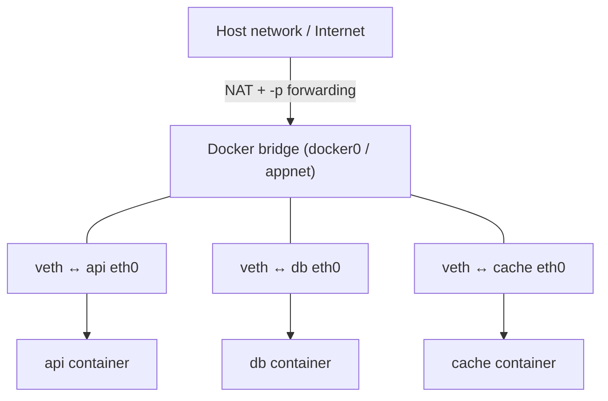

# Chapter 5 — Practical Usage: Volumes, Networking, and Compose

## 1. Introduction

A single isolated container is rarely useful by itself. Real applications need to **keep
data** (a database can't lose everything on restart), **talk to other services** (an API
needs its database and cache), and be **started together as a unit** (nobody wants to type
five `docker run` commands in the right order every time). This chapter covers the three
capabilities that turn Docker from a toy into a development and deployment platform:
**volumes** (persistence and sharing), **networking** (service-to-service communication),
and **Docker Compose** (declarative multi-service orchestration).

This is the chapter where everything you've learned starts to feel like building real
systems. It's also the longest, because these three topics are where most day-to-day Docker
work actually happens.

---

## 2. Learning Goals

By the end of this chapter you will be able to:

- Persist data with **named volumes** and share host files with **bind mounts**, and know
  when to use each.
- Explain Docker's default **bridge network** and create **user-defined networks** for
  service discovery by name.
- Connect multiple containers so they communicate reliably.
- Write a **Docker Compose** file to define and run a multi-service application with one
  command.
- Manage the lifecycle of a Compose stack (up, down, logs, scaling).

---

## 3. Concepts Explained

### 3.1 The data problem and the three mount types

Recall (Ch 2/4): a container's writable layer is **ephemeral**. To keep data, you mount
storage that lives outside that layer. Docker offers three mechanisms:

| Type | What it is | Managed by | Best for |
|---|---|---|---|
| **Named volume** | Docker-managed storage on the host | Docker | Databases, persistent app data |
| **Bind mount** | A specific host path mapped in | You | Dev (live source code), config files |
| **tmpfs** | In-memory, never on disk | Docker | Secrets/scratch you never want persisted |

**Named volume:**
```bash
docker volume create pgdata
docker run -d --name db -v pgdata:/var/lib/postgresql/data postgres:16
```
Docker stores `pgdata` in its own area; the database survives `docker rm db` and can be
re-attached to a new container.

**Bind mount:**
```bash
docker run -d --name web -v "$PWD/site:/usr/share/nginx/html:ro" -p 8080:80 nginx
```
Maps your host's `./site` directory into the container. Edit a file on the host and it's
instantly visible inside — perfect for development. `:ro` makes it read-only.

> **Rule of thumb:** named volumes for data the *app* owns (databases), bind mounts for
> things *you* own and edit (source code, local config).

### 3.2 The `--mount` syntax (preferred, explicit)

`-v` is terse but ambiguous; `--mount` is verbose but clear and is recommended for scripts:

```bash
docker run -d --name db \
  --mount type=volume,source=pgdata,target=/var/lib/postgresql/data \
  postgres:16
```

### 3.3 Networking basics

Each container gets its own network namespace (Ch 4), so by default it can't be reached
unless you do something. Docker provides several **network drivers**:

| Driver | Purpose |
|---|---|
| **bridge** | Default. A private virtual network on a single host. |
| **host** | Container shares the host's network stack (no isolation, no `-p`). |
| **none** | No networking at all. |
| **overlay** | Multi-host networking (Swarm/clusters) — Ch 7. |
| **macvlan** | Give the container its own MAC/IP on the physical LAN — Ch 7. |

The critical practical fact: **on the default bridge network, containers can only reach
each other by IP, not by name.** On a **user-defined bridge network**, Docker provides
**automatic DNS** so containers can reach each other by **container name**. This is the
single most important networking practice for multi-container apps.

```bash
docker network create appnet
docker run -d --name db --network appnet postgres:16
docker run -d --name api --network appnet -e DB_HOST=db myorg/api
# Inside "api", the hostname "db" resolves to the database container.
```

### 3.4 Publishing ports vs internal communication

- **Internal:** services on the same user-defined network talk freely by name on any port —
  no `-p` needed. Your API reaches Postgres on `db:5432` without publishing anything.
- **External:** to reach a service from *outside* Docker (your browser, the internet), you
  **publish** a port with `-p host:container`. Only publish what truly needs external
  access — typically just your front door (a web server/proxy), not your database.

### 3.5 Docker Compose

Typing many `docker run`/`docker network`/`docker volume` commands in order is tedious and
error-prone. **Docker Compose** lets you describe the whole stack declaratively in a
`compose.yaml` file and manage it with `docker compose up` / `down`. Compose automatically
creates a dedicated network for the project (so DNS-by-service-name just works) and wires
up volumes.

```yaml
# compose.yaml
services:
  api:
    build: .                 # build from local Dockerfile
    ports:
      - "8000:8000"          # publish externally
    environment:
      DATABASE_URL: postgres://app:secret@db:5432/app
    depends_on:
      db:
        condition: service_healthy
  db:
    image: postgres:16
    environment:
      POSTGRES_USER: app
      POSTGRES_PASSWORD: secret
      POSTGRES_DB: app
    volumes:
      - pgdata:/var/lib/postgresql/data
    healthcheck:
      test: ["CMD-SHELL", "pg_isready -U app"]
      interval: 5s
      timeout: 3s
      retries: 5
  cache:
    image: redis:7
volumes:
  pgdata:
```

```bash
docker compose up -d        # build/create/start everything
docker compose ps           # status
docker compose logs -f api  # follow one service's logs
docker compose down         # stop & remove containers + network (keeps named volumes)
docker compose down -v      # also remove named volumes (deletes data!)
```

In this file, `api` reaches the database at hostname `db` — Compose's per-project network
gives every service a DNS name equal to its service name.

---

## 4. Internal Working / Deep Dive

### 4.1 How volumes bypass the layer system

A volume mount **overrides** the corresponding path in the union filesystem: instead of
reading/writing the container's writable layer, I/O goes to the volume (a directory on the
host, or a plugin-backed store). Because it's outside the layer stack, it survives container
removal and isn't part of the image. This also makes volume I/O faster than copy-on-write
writes for write-heavy workloads like databases — another reason databases want a volume,
not the writable layer.

### 4.2 How the bridge network actually works

On a host, Docker creates a virtual bridge (default `docker0`). Each container gets a
**veth pair**: one end inside the container's network namespace (its `eth0`), the other
attached to the bridge. The bridge routes between containers; NAT rules (iptables) handle
outbound traffic and published-port forwarding from the host into containers.



On a **user-defined** bridge, Docker runs an embedded DNS server (at `127.0.0.11` inside
containers) that resolves service/container names to their current container IPs — which is
why name-based discovery works there but not on the legacy default bridge.

### 4.3 `depends_on`, healthchecks, and startup ordering

`depends_on` controls **start order**, but by default *not* readiness — a database
container can be "started" before it's actually accepting connections. Pairing
`depends_on: { condition: service_healthy }` with a `healthcheck` makes Compose wait until
the dependency reports healthy. Even so, robust apps should **retry their connections** at
startup, because health can flap and ordering guarantees are weak in distributed systems.
(Healthchecks get full treatment in Ch 7.)

### 4.4 Compose project scoping

Compose namespaces everything by **project name** (default: the directory name). Containers
are named `project-service-N`, the network is `project_default`, volumes are
`project_name`. This isolation lets you run multiple stacks side by side without collisions,
and is why `docker compose down` only touches *this* project's resources.

---

## 5. Examples

### Example 1 — Persistent database you can destroy and recreate

```bash
docker volume create pgdata
docker run -d --name db -v pgdata:/var/lib/postgresql/data \
  -e POSTGRES_PASSWORD=secret postgres:16

# create some data...
docker exec -it db psql -U postgres -c "CREATE TABLE t(x int); INSERT INTO t VALUES(42);"

docker rm -f db                      # destroy the container
docker run -d --name db -v pgdata:/var/lib/postgresql/data \
  -e POSTGRES_PASSWORD=secret postgres:16   # new container, same volume
docker exec -it db psql -U postgres -c "SELECT * FROM t;"   # 42 is still there
```

### Example 2 — Live-reload dev with a bind mount

```bash
docker run -d --name web -p 8080:80 \
  -v "$PWD/public:/usr/share/nginx/html:ro" nginx
# edit ./public/index.html on the host; refresh the browser — change appears instantly
```

### Example 3 — Two containers talking by name

```bash
docker network create appnet
docker run -d --name redis --network appnet redis:7
docker run --rm --network appnet redis:7 redis-cli -h redis ping   # -> PONG
```

`redis` (the name) resolves via Docker's embedded DNS on the user-defined network.

### Example 4 — Full stack with Compose

Use the `compose.yaml` from §3.5, then:

```bash
docker compose up -d
docker compose ps
curl localhost:8000/health
docker compose logs -f
docker compose down          # keep data
# docker compose down -v     # wipe data too
```

### Example 5 — Scale a stateless service

```bash
docker compose up -d --scale api=3
docker compose ps            # three api replicas (put a proxy in front to load-balance)
```

---

## 6. Real-World Use Cases

- **Local dev environments:** one `compose.yaml` brings up the app, DB, cache, and a mail
  catcher; new teammates run `docker compose up` and start coding.
- **Database persistence:** named volumes keep data across deploys and container rebuilds;
  the database can be upgraded by swapping the image while keeping the volume.
- **Microservice wiring:** user-defined networks let a dozen services find each other by
  name without hard-coded IPs.
- **Integration testing in CI:** spin up a real Postgres/Redis alongside the app via
  Compose, run tests against them, tear down with `down -v`.
- **Live-reload development:** bind-mount source so code changes reflect without rebuilding
  the image.
- **Internal-only services:** databases and caches stay unpublished (no `-p`), reachable
  only by the app on the private network — a simple, strong default.

---

## 7. Common Mistakes

- **Storing database data in the writable layer** (no volume), then losing everything on
  `docker rm`. Always volume your data.
- **Using the default bridge and wondering why name resolution fails.** Create a
  user-defined network (or use Compose, which does it for you).
- **Publishing the database port (`-p 5432:5432`) needlessly,** exposing it to the host/LAN.
  Keep internal services unpublished.
- **Bind-mounting over a directory the image populated** (e.g. mounting an empty host dir
  onto `/app/node_modules`), wiping what the image installed. Mount carefully.
- **Trusting `depends_on` for readiness.** It only orders startup; add healthchecks and
  in-app retries.
- **`docker compose down -v` by reflex,** deleting volumes (and data) you wanted to keep.
- **Hard-coding container IPs** instead of using service names; IPs change on recreate.
- **Putting secrets directly in `compose.yaml` env** committed to git (Ch 8 covers the right
  way).

---

## 8. Best Practices

- **Named volumes for app-owned data; bind mounts for code/config you edit.**
- **Always use a user-defined network** (or Compose) for multi-container apps to get DNS by
  name.
- **Publish only the entry point;** keep databases/caches internal.
- **Prefer `--mount` syntax** in scripts for clarity.
- **Pair `depends_on` with healthchecks** and make apps retry connections at startup.
- **Keep `compose.yaml` in version control;** use override files (`compose.override.yaml`)
  for local-only tweaks.
- **Name volumes explicitly** so backups/migrations are predictable; document them.
- **Use `:ro`** for mounts the container shouldn't write to.
- **One service per container, one stack per `compose.yaml`** for a given app.

---

## 9. Hands-On Exercise

**Goal:** build a persistent, networked, multi-service stack with Compose.

1. **Volume persistence.** Reproduce Example 1: create data in Postgres, destroy the
   container, recreate against the same volume, and confirm the data survived. Then
   `docker volume inspect pgdata` and note where Docker stores it.

2. **Bind-mount dev loop.** Serve a folder with nginx via a bind mount, edit a file on the
   host, and confirm the change appears without rebuilding. Add `:ro` and confirm writes
   from inside the container are refused.

3. **Name-based networking.** Create a user-defined network, run Redis and a one-off
   `redis-cli` container on it, and `ping` Redis by name. Then try the same on the *default*
   bridge and observe the difference.

4. **Compose stack.** Write a `compose.yaml` with an app + Postgres + Redis (use the §3.5
   template, adapt the app). Bring it up, confirm the app reaches the DB by hostname `db`,
   check `docker compose ps`, and tail logs.

5. **Lifecycle discipline.** `docker compose down` (data kept), bring it back up, confirm
   data persisted. Then `docker compose down -v` and confirm data is gone. Write one
   sentence on the difference.

**Deliverable:** your `compose.yaml` plus a short note: which data persisted across which
operations, and why.

---

## 10. Quiz Questions

1. Why does a database need a volume rather than the container's writable layer?
2. Named volume vs bind mount — when do you use each?
3. On the *default* bridge network, can containers reach each other by name? What changes on
   a user-defined network, and why?
4. Your API talks to Postgres internally. Should you publish Postgres's port? Why or why
   not?
5. What does Compose do automatically that makes service-to-service DNS "just work"?
6. `depends_on: db` is set, but the app still fails on startup with "connection refused."
   What's happening and how do you fix it?
7. What's the difference between `docker compose down` and `docker compose down -v`?
8. How does a volume mount interact with the union filesystem at the mounted path?

<details>
<summary>Answer key</summary>

1. The writable layer is ephemeral and destroyed on `docker rm`; a volume lives outside the
   layer stack, persists across container removal, and is faster for write-heavy I/O.
2. Named volumes for app-owned persistent data (databases); bind mounts for host files you
   edit (source code, local config).
3. No — only by IP on the default bridge. A user-defined bridge runs Docker's embedded DNS
   (127.0.0.11), so containers resolve each other by container/service name.
4. No. Internal services reach each other over the private network by name; publishing
   exposes the DB to the host/LAN unnecessarily, widening the attack surface.
5. It creates a dedicated per-project network and gives each service a DNS name equal to its
   service name.
6. `depends_on` only orders startup, not readiness — Postgres started but isn't accepting
   connections yet. Add a `healthcheck` with `condition: service_healthy`, and have the app
   retry its connection.
7. `down` removes containers and the project network but keeps named volumes; `down -v` also
   deletes the named volumes (and thus the data).
8. The mount overrides that path in the union filesystem — I/O goes to the volume/host
   instead of the writable layer, so it's persistent and outside the image.
</details>

---

## 11. Chapter Summary

- **Volumes** make data durable: **named volumes** for app-owned data (databases),
  **bind mounts** for host files you edit (code/config), **tmpfs** for in-memory secrets.
  Mounts bypass the ephemeral writable layer.
- **Networking:** containers are isolated by default; **user-defined bridge networks** give
  **DNS by name** (the default bridge does not). Services talk internally by name; you only
  **publish (`-p`)** the external entry point.
- **Docker Compose** declares the whole stack in `compose.yaml`, auto-creates a project
  network (so name-based DNS works), wires volumes, and manages everything with
  `up`/`down`.
- `depends_on` orders startup but not readiness — combine with **healthchecks** and
  in-app retries.
- Mind the data-destroying commands: `down -v` and aggressive prunes.

Next: **Chapter 6 — Best Practices**, where we make images small, fast, and secure with
multi-stage builds, minimal bases, sound caching, and the first layer of security hardening.

---

## 12. Further Reading

- Docker docs: "Manage data in Docker" (volumes, bind mounts, tmpfs).
- Docker docs: "Networking overview" and "Bridge network driver."
- Docker docs: "Docker Compose" and the Compose file specification.
- Article: "Why your container can't connect to the database" (startup ordering &
  healthchecks).
