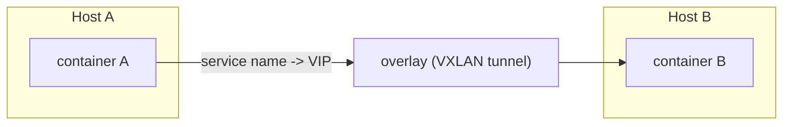
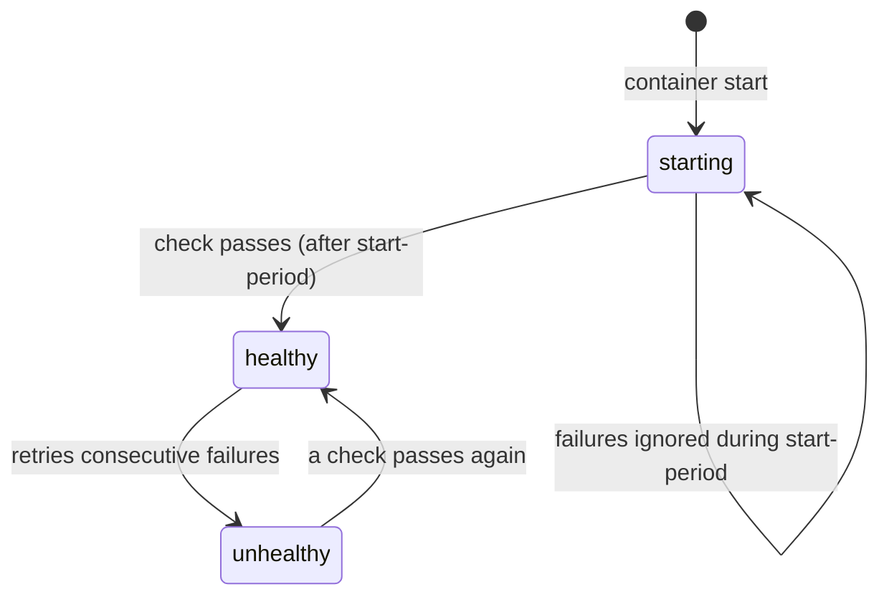

# Chapter 7 — Advanced Topics: Networking, Storage, Compose, and Health

## 1. Introduction

You now build small, secure images and run multi-service stacks. This chapter goes deep on
the systems that make those stacks robust and flexible: the full range of **network
drivers** (and when each is the right tool), how **storage drivers** and volume plugins
work under the hood, **advanced Docker Compose** patterns (profiles, overrides, extends,
multiple files), and **production-grade healthchecks** that let your system detect and
recover from failure automatically.

The theme is *control*. Earlier you used defaults that "just work" for a single host. Here
you learn the knobs you'll reach for when the simple defaults stop fitting — multi-host
networking, giving a container a real LAN address, environment-specific Compose
configurations, and health-driven recovery.

---

## 2. Learning Goals

By the end of this chapter you will be able to:

- Choose between **bridge, host, none, overlay, and macvlan** network drivers and explain
  the trade-offs.
- Understand **storage drivers** (overlay2 and friends) and how volume **plugins** extend
  storage.
- Use advanced Compose features: **multiple compose files / overrides**, **profiles**,
  **`extends`**, **`env_file`**, and **`x-` extension fields with YAML anchors**.
- Write effective **healthchecks** and use them to drive dependency ordering and
  auto-recovery.
- Reason about how these pieces behave as you move from one host toward a cluster.

---

## 3. Concepts Explained

### 3.1 Network drivers in depth

| Driver | Scope | What it does | Use when |
|---|---|---|---|
| **bridge** | single host | Private virtual network; NAT to outside; DNS by name on user-defined nets | Default for most apps on one host |
| **host** | single host | Container shares host's network namespace; no isolation, no `-p` | Max network performance / when you need host ports directly |
| **none** | single host | No network at all | Fully isolated batch jobs |
| **overlay** | multi-host | Virtual network spanning multiple hosts (Swarm) | Clustered services across nodes |
| **macvlan** | single host | Container gets its own MAC + IP on the physical LAN | App must appear as a real device on the network |
| **ipvlan** | single host | Like macvlan but shares the host MAC (L2/L3 modes) | macvlan-style needs where switches limit MACs |

**host networking** removes the network namespace boundary — the container binds directly to
host ports, so `-p` is irrelevant and there's no NAT overhead. Great for performance-
sensitive or port-heavy workloads, but you lose isolation and risk port conflicts.

**overlay** uses a VXLAN tunnel to make containers on different physical hosts behave as if
on one L2 network, with a distributed key-value store tracking endpoints. This is what
Swarm services use to communicate cluster-wide; Kubernetes solves the same problem with its
CNI plugins.

**macvlan** is for when something on your LAN must treat the container as a first-class
device with its own IP (legacy systems, network appliances, certain monitoring tools).

### 3.2 Storage drivers

The **storage driver** implements the union filesystem (Ch 4) that stacks image layers and
provides copy-on-write. The modern default is **overlay2** (built on OverlayFS). Others exist
for historical/edge reasons:

| Driver | Notes |
|---|---|
| **overlay2** | Default, recommended; good performance on modern kernels |
| **fuse-overlayfs** | Userspace overlay, used in rootless mode |
| **btrfs / zfs** | Use the host filesystem's snapshotting; niche |
| **devicemapper** | Legacy, largely deprecated |

Check yours with `docker info | grep "Storage Driver"`. You rarely change it, but knowing
overlay2's behavior explains write performance and why write-heavy workloads belong on
volumes (which bypass the driver).

**Volume plugins** extend storage beyond the local host — e.g. NFS, cloud block storage,
or distributed filesystems — so a container can keep data on networked storage and survive
moving to another node. This is essential in clusters where a container may reschedule onto
a different machine.

### 3.3 Advanced Compose

**Multiple files / overrides.** Compose merges files in order, later overriding earlier:
```bash
docker compose -f compose.yaml -f compose.prod.yaml up -d
```
A common pattern: a base `compose.yaml`, a `compose.override.yaml` for local dev (loaded
automatically), and a `compose.prod.yaml` for production tweaks.

**Profiles.** Tag optional services so they only start when their profile is active:
```yaml
services:
  app: { image: myorg/app }
  debugger:
    image: myorg/debugger
    profiles: ["debug"]
```
```bash
docker compose --profile debug up -d   # includes debugger; default run omits it
```

**`env_file`.** Pull environment from a file instead of inlining:
```yaml
services:
  api:
    image: myorg/api
    env_file: [.env.production]
```

**YAML anchors + `x-` extensions.** Reduce duplication with reusable blocks:
```yaml
x-common-env: &common-env
  LOG_LEVEL: info
  REGION: ap-south-1

services:
  api:
    image: myorg/api
    environment:
      <<: *common-env
  worker:
    image: myorg/worker
    environment:
      <<: *common-env
```

**`depends_on` with conditions** (Ch 5) plus `restart` policies make startup robust.

### 3.4 Healthchecks done right

A **healthcheck** is a command Docker runs periodically *inside* the container to decide if
it's healthy. It powers `condition: service_healthy`, restart decisions, and (in orchestrators)
load-balancer membership.

```dockerfile
HEALTHCHECK --interval=10s --timeout=3s --start-period=30s --retries=3 \
  CMD curl -fsS http://localhost:8000/health || exit 1
```

- `--interval` — how often to check.
- `--timeout` — how long a single check may take before counting as a failure.
- `--start-period` — grace window during startup where failures don't count (avoids killing
  slow-booting apps).
- `--retries` — consecutive failures before marking `unhealthy`.

The check should be **cheap, dependency-aware, and honest**: a good `/health` endpoint
verifies the app can actually serve (and optionally that critical dependencies are
reachable), not just that the process is alive.

---

## 4. Internal Working / Deep Dive

### 4.1 How overlay networking spans hosts

On a Swarm, an overlay network creates a VXLAN tunnel between participating hosts. Each
container endpoint is registered in a distributed store; when a container sends a packet to
a service name, embedded DNS resolves it (often to a **virtual IP** fronting all replicas),
and the VXLAN encapsulation carries the packet to whichever host runs the target. To the
containers, it looks like one flat network even though packets traverse the physical
underlay between machines.



### 4.2 macvlan vs bridge at the packet level

On a bridge, the host NATs container traffic, so the LAN sees the *host's* IP. With macvlan,
the container is bound to a sub-interface with its **own MAC/IP**, so packets hit the
physical switch as if from a separate machine — no NAT. The cost: the host often *can't* talk
to its own macvlan containers directly (a quirk of how macvlan handles host-to-container
traffic), and your network team must be okay with extra MACs/IPs on the segment.

### 4.3 Healthcheck state machine



Docker records health in `docker inspect … State.Health`. Importantly, an `unhealthy`
container is **not** automatically restarted by the Docker *engine* alone — you need a
**restart policy** (`--restart`) or an orchestrator (Swarm/K8s) that acts on health. In
Compose/Swarm and Kubernetes, health drives whether traffic is routed to the container.

### 4.4 Why write-heavy workloads bypass the storage driver

overlay2's copy-on-write is great for sharing read-only image layers, but every modification
triggers a copy-up, which is overhead for databases doing constant writes. Volumes mount a
plain host directory (or plugin-backed store) directly, skipping the union filesystem — so
DB I/O is near-native. This is the mechanical reason "always put your database on a volume"
is both a persistence rule (Ch 5) and a performance rule.

---

## 5. Examples

### Example 1 — host networking for performance

```bash
docker run -d --name fast --network host nginx
# nginx now listens on the host's port 80 directly; no -p, no NAT
```

### Example 2 — macvlan giving a container a LAN IP

```bash
docker network create -d macvlan \
  --subnet=192.168.1.0/24 --gateway=192.168.1.1 \
  -o parent=eth0 lan
docker run -d --name appliance --network lan --ip 192.168.1.50 myorg/appliance
# Other devices on 192.168.1.0/24 reach the container at 192.168.1.50
```

### Example 3 — environment-specific Compose

```bash
# Base + local override (override auto-loaded):
docker compose up -d
# Base + production overrides:
docker compose -f compose.yaml -f compose.prod.yaml up -d
```

`compose.prod.yaml` might set replicas, drop bind mounts, switch to read-only, and add
resource limits — without duplicating the whole base file.

### Example 4 — profiles for optional tooling

```yaml
services:
  app: { image: myorg/app, ports: ["8000:8000"] }
  seed:
    image: myorg/app
    command: ["python", "seed.py"]
    profiles: ["init"]
```
```bash
docker compose --profile init up seed   # run one-off seeding only when asked
docker compose up -d                     # normal run skips seed
```

### Example 5 — robust healthcheck wired into Compose

```yaml
services:
  api:
    build: .
    healthcheck:
      test: ["CMD", "curl", "-fsS", "http://localhost:8000/health"]
      interval: 10s
      timeout: 3s
      start_period: 30s
      retries: 3
    restart: unless-stopped
    depends_on:
      db: { condition: service_healthy }
  db:
    image: postgres:16
    healthcheck:
      test: ["CMD-SHELL", "pg_isready -U postgres"]
      interval: 5s
      retries: 5
```

---

## 6. Real-World Use Cases

- **High-throughput edge proxies** using host networking to shave NAT overhead and avoid
  port-mapping limits.
- **Legacy/network-appliance integration** via macvlan so the container is a first-class LAN
  device with its own IP.
- **Multi-host clustered apps** using overlay networks (Swarm) — the conceptual stepping
  stone to Kubernetes networking.
- **One repo, many environments:** base + override Compose files for dev/staging/prod without
  copy-paste drift.
- **Optional services on demand:** profiles to run seeders, debuggers, or load generators
  only when needed.
- **Self-healing services:** healthchecks plus restart policies (single host) or orchestrator
  health gating (cluster) keep traffic flowing only to ready instances.
- **Networked/persistent storage:** volume plugins (NFS/cloud block) so data survives a
  container rescheduling onto another node.

---

## 7. Common Mistakes

- **Using host networking everywhere** "for speed," losing isolation and creating port
  conflicts.
- **Expecting the host to reach its own macvlan containers** — by default it can't without
  extra configuration.
- **Assuming `unhealthy` auto-restarts** — the engine needs a restart policy or an
  orchestrator to act on it.
- **Healthchecks that only check the process is alive** (e.g. `exit 0`) instead of whether it
  can serve — masking real failures.
- **No `start_period`,** so slow-booting apps are marked unhealthy and killed during normal
  startup.
- **Overusing bind mounts in production** Compose files instead of building config into images
  or using volumes/secrets.
- **Duplicating config across environment Compose files** instead of layering overrides /
  anchors.
- **Putting databases on the writable layer/storage driver** under heavy writes, then
  wondering about performance.

---

## 8. Best Practices

- **Default to user-defined bridge; reach for host/macvlan/overlay deliberately,** documenting
  why.
- **Keep `overlay2` as your storage driver** unless you have a specific, validated reason.
- **Put write-heavy/persistent data on volumes** (and use volume plugins for networked
  storage in clusters).
- **Layer Compose configs** (base + override + prod) and **DRY with anchors/`x-` fields**;
  pull secrets from `env_file`/secret stores, not inline.
- **Use profiles** to keep optional services out of the default run.
- **Write meaningful healthchecks** with `start_period`, sensible `interval`/`timeout`/
  `retries`, that verify the app can actually serve.
- **Pair healthchecks with `restart` policies** (single host) or rely on the orchestrator
  (cluster) for recovery.
- **Test failure modes:** kill a dependency and confirm health flips and recovery behaves as
  intended.

---

## 9. Hands-On Exercise

**Goal:** exercise advanced networking, layered Compose, and real healthchecks.

1. **Driver comparison.** Run the same web server with (a) default bridge + `-p`, and (b)
   `--network host`. Compare reachability and note when `-p` is required. (On macOS/Windows,
   note the Docker Desktop caveat for host networking.)

2. **macvlan (Linux, optional).** If you have a spare subnet, create a macvlan network and
   give a container its own LAN IP; ping it from another LAN device. Note whether the host can
   reach it directly.

3. **Layered Compose.** Take your Ch 5 stack. Add a `compose.prod.yaml` that removes bind
   mounts, adds resource limits, and sets `restart: unless-stopped`. Bring it up with
   `-f compose.yaml -f compose.prod.yaml` and confirm the overrides applied
   (`docker inspect`).

4. **Profiles.** Add a `seed` service behind an `init` profile. Confirm a normal `up` skips it
   and `--profile init` runs it.

5. **Healthcheck-driven recovery.** Add a healthchecked `/health` to your API and a `restart`
   policy. Then *break* the app (make `/health` fail) and watch `docker ps` show `unhealthy`;
   restore it and watch it recover. Inspect `State.Health.Log`.

6. **DRY it.** Refactor shared env into a YAML anchor / `x-` field used by two services.

**Deliverable:** your layered Compose files + a short note on what each environment override
changes and how your healthcheck decides "healthy."

---

## 10. Quiz Questions

1. When would you choose host networking over bridge, and what do you give up?
2. What problem does an overlay network solve that bridge cannot?
3. What's distinctive about macvlan, and what's a common gotcha with it?
4. What is the default storage driver, and why do write-heavy workloads belong on volumes?
5. How do multiple Compose files combine, and why is that useful across environments?
6. What does `--start-period` prevent in a healthcheck?
7. Does Docker automatically restart an `unhealthy` container? What's required for recovery?
8. What makes a healthcheck "good" versus one that merely checks the process is alive?

<details>
<summary>Answer key</summary>

1. For maximum network performance / direct host-port binding (no NAT, no `-p`). You give up
   network isolation and risk port conflicts with the host and other containers.
2. Networking that spans multiple hosts — overlay (VXLAN) makes containers on different
   machines behave as one L2 network; bridge is single-host only.
3. macvlan gives the container its own MAC/IP as a real device on the physical LAN (no NAT).
   Common gotcha: the host typically can't reach its own macvlan containers without extra
   config.
4. overlay2. Volumes bypass the union filesystem's copy-on-write, giving near-native I/O for
   constant writes (databases).
5. Later files override earlier ones (deep merge), so you keep a base file and layer
   environment-specific overrides (dev/prod) without duplicating the whole config.
6. A startup grace window where failing checks don't count, so slow-booting apps aren't
   marked unhealthy and killed during normal startup.
7. No — the engine only records health. Recovery needs a `--restart` policy (single host) or
   an orchestrator (Swarm/K8s) that acts on health.
8. A good check verifies the app can actually serve requests (and optionally that critical
   dependencies are reachable), is cheap, and has appropriate timing; a weak one just confirms
   the process exists, hiding real failures.
</details>

---

## 11. Chapter Summary

- **Network drivers:** bridge (default, single host, DNS by name), host (no isolation, max
  perf), none, overlay (multi-host via VXLAN — the Swarm/K8s analog), macvlan/ipvlan (own LAN
  identity). Choose deliberately.
- **Storage:** overlay2 is the default union driver; **volumes bypass it** for persistence
  *and* write performance; **volume plugins** provide networked/portable storage for clusters.
- **Advanced Compose:** layer files (base + override + prod), use **profiles** for optional
  services, **`env_file`** for config, and **anchors/`x-` fields** to stay DRY.
- **Healthchecks** with proper `start_period`/`interval`/`timeout`/`retries` drive dependency
  ordering and recovery — but the engine needs a **restart policy or orchestrator** to act on
  `unhealthy`.

Next: **Chapter 8 — Production Considerations**, where we turn a working stack into an
operable one: logging, monitoring, secrets, resource limits, private registries, and CI/CD.

---

## 12. Further Reading

- Docker docs: networking drivers (bridge, host, overlay, macvlan, ipvlan).
- Docker docs: "Select a storage driver" and volume plugin guides.
- Docker Compose specification: profiles, multiple files, `extends`, fragments/anchors.
- Docker docs: "HEALTHCHECK instruction" and health-status inspection.
