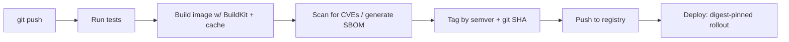

# Chapter 8 — Production Considerations: Operating Containers for Real

## 1. Introduction

Running a stack on your laptop and running it in production are different disciplines. In
production you can't just `docker logs` on a whim across fifty hosts; you can't lose data
when a node dies; you can't put a password in a YAML file and commit it; and you can't
rebuild images by hand on every deploy. This chapter covers the operational concerns that
separate "it runs" from "it runs reliably, observably, and securely, and ships itself."

We address six pillars: **logging** (so you can see what happened), **monitoring/metrics**
(so you can see what's happening now), **secrets** (so credentials don't leak), **resource
limits & restart policies** (so the system stays stable and self-heals), **registries** (so
images flow securely through environments), and **CI/CD** (so builds, scans, and deploys are
automated and reproducible). This is the chapter that makes you dangerous in a real org.

---

## 2. Learning Goals

By the end of this chapter you will be able to:

- Configure Docker **logging drivers** and design log output apps should emit.
- Expose and collect **metrics** and understand container monitoring building blocks.
- Manage **secrets** correctly at build and run time, and explain why env vars/layers are
  unsafe.
- Apply **resource limits** and **restart policies**, and implement **graceful shutdown**.
- Run and secure a **private registry**, and promote images by **immutable digest**.
- Build a **CI/CD pipeline** that tests, builds, scans, tags, and pushes images.

---

## 3. Concepts Explained

### 3.1 Logging

Containers should log to **stdout/stderr**, not to files inside the container. Docker
captures that stream and hands it to a **logging driver**:

| Driver | Behavior |
|---|---|
| `json-file` | Default; stores logs as JSON on the host (set rotation!) |
| `local` | Efficient local format with built-in rotation (good default) |
| `journald` | Sends to systemd journal |
| `syslog` / `fluentd` / `gelf` / `awslogs` / etc. | Ship logs to a central system |

The default `json-file` driver **does not rotate by default**, so logs can fill the disk.
Always configure rotation:

```json
// /etc/docker/daemon.json
{
  "log-driver": "local",
  "log-opts": { "max-size": "10m", "max-file": "3" }
}
```

Apps should emit **structured logs** (JSON with a level, timestamp, request ID, etc.) so a
central system can index and query them. The "twelve-factor" principle: **treat logs as
event streams**; the app shouldn't manage log files or routing — the platform does.

### 3.2 Monitoring and metrics

Three complementary signals ("observability"):
- **Logs** — discrete events (what happened).
- **Metrics** — numeric time series (CPU, memory, request rate, error rate, latency).
- **Traces** — the path of a request across services.

Docker exposes basic container metrics (`docker stats`, the engine's metrics endpoint), and
production setups typically run an agent (e.g. cAdvisor/Prometheus node exporters) to scrape
per-container CPU/memory/network/IO, plus app-level metrics the service exposes (e.g. a
`/metrics` endpoint). Define **alerts** on the signals that indicate user-facing pain (error
rate, latency, saturation), not just raw resource use.

### 3.3 Secrets

Recap the wrong ways (Ch 6): `ENV`, `ARG`, `COPY .env`, or committing secrets to Compose —
all leak into images, history, or version control. The right ways:

- **Build time:** BuildKit secret mounts (`--mount=type=secret`) — available during a `RUN`,
  never stored in a layer.
- **Run time:**
  - **Docker/orchestrator secrets** (Swarm secrets, Kubernetes Secrets) mounted as files
    (often under `/run/secrets/...`), in memory, not on disk in the image.
  - **External secrets managers** (Vault, cloud KMS/Secrets Manager) the app reads at
    startup.
  - At minimum, **inject env vars at runtime** from a secure source — never baked into the
    image.

Prefer **file-based secrets over env vars** where possible: env vars can leak via
`/proc/<pid>/environ`, crash dumps, child processes, and logging of the environment.

### 3.4 Resource limits, restart policies, graceful shutdown

- **Limits** (cgroups, Ch 4): set `--memory`, `--cpus`, `--pids-limit` (or Compose `deploy:
  resources:` / `mem_limit`) so one container can't starve the host.
- **Restart policies:** `--restart` controls auto-recovery:
  - `no` (default), `on-failure[:max]`, `always`, `unless-stopped`.
  - Production services usually want `unless-stopped` or `on-failure`.
- **Graceful shutdown:** handle **SIGTERM** to finish in-flight work and close connections
  before the SIGKILL deadline (tune with `--stop-timeout` / Compose `stop_grace_period`). Run
  as PID 1 in exec form (Ch 3) and use `--init` if you spawn children.

### 3.5 Registries

A **registry** stores and distributes images. Beyond Docker Hub, orgs use private
registries (self-hosted `registry:2`, Harbor, or managed: ECR/GCR/ACR/GitHub/GitLab). Key
practices:

- **Authenticate** (`docker login`) and use least-privilege robot/CI credentials.
- **Promote by immutable digest**, not by mutable tag, through environments
  (build once → test → staging → prod = the same bytes).
- **Tag meaningfully:** semver (`1.4.0`), git SHA (`sha-abc123`), and environment channels;
  avoid relying on `latest` in deploys.
- **Scan on push** and optionally **sign** images (e.g. cosign) to verify provenance.
- **Garbage-collect** old images to control storage.

### 3.6 CI/CD for containers

The pipeline turns a git push into a deployable, verified image:



Each stage can gate the next (fail the build on test failures or critical CVEs). The output
is an **immutable, scanned, traceable artifact**, deployed by **digest** so every environment
runs identical bytes.

---

## 4. Internal Working / Deep Dive

### 4.1 Why stdout/stderr logging is the right model

A container's PID 1 stdout/stderr are wired to the daemon, which routes them to the logging
driver. This decouples the *app* from log *transport*: the same image logs to a file in dev
and to Fluentd/CloudWatch/Loki in prod purely by changing the driver — no app change. Apps
that write their own log files inside the container instead trap logs in the ephemeral layer
(lost on removal) and bypass the platform's collection. Hence: **log to streams, let the
platform route**.

### 4.2 How file-based secrets avoid env-var leakage

Orchestrator secrets are mounted into a tmpfs (memory-backed) at a path like
`/run/secrets/db_password`. They never touch the image, never appear in `docker history`,
and aren't in the process environment (so they don't leak via `/proc/<pid>/environ`, a
child process inheriting env, or accidental env logging). The app reads the file at startup.
This is strictly safer than `-e DB_PASSWORD=...`.

### 4.3 The SIGTERM → SIGKILL window, precisely

On stop, the daemon sends **SIGTERM** to PID 1, waits `--stop-timeout` (default 10s), then
sends **SIGKILL**. A well-behaved server, on SIGTERM, should: stop accepting new
connections/requests, finish or drain in-flight ones, flush buffers, close DB connections,
then exit 0. If it doesn't, clients see reset connections and you risk partial writes. This
is why "handle SIGTERM" is a production requirement, not a nicety — and why exec-form
`CMD`/`ENTRYPOINT` (so your app *is* PID 1 and receives the signal) matters.

### 4.4 Build once, promote by digest

A tag like `:1.4.0` is mutable; a digest `@sha256:…` is not. If you deploy by tag, staging
and prod might pull different bytes if someone re-pushed the tag. Capturing the **digest**
emitted at build/push time and deploying *that* guarantees byte-for-byte identical artifacts
across environments — the core of reproducible, trustworthy delivery. Image signing
(cosign) adds cryptographic proof that the digest came from your pipeline.

---

## 5. Examples

### Example 1 — Log rotation and shipping

```json
// /etc/docker/daemon.json — sane default with rotation
{ "log-driver": "local", "log-opts": { "max-size": "10m", "max-file": "5" } }
```
```yaml
# per-service override in Compose, shipping to fluentd
services:
  api:
    image: myorg/api:1.4
    logging:
      driver: fluentd
      options:
        fluentd-address: "logs.internal:24224"
        tag: "app.api"
```

### Example 2 — Run-time secret as a file (Compose secrets)

```yaml
services:
  api:
    image: myorg/api:1.4
    secrets: [db_password]
    environment:
      DB_PASSWORD_FILE: /run/secrets/db_password   # app reads the file, not an env value
secrets:
  db_password:
    file: ./secrets/db_password.txt   # in Swarm, use external secret stores
```

### Example 3 — Limits, restart, graceful shutdown

```yaml
services:
  api:
    image: myorg/api:1.4
    restart: unless-stopped
    stop_grace_period: 30s        # SIGTERM window before SIGKILL
    init: true                    # proper PID 1 / zombie reaping
    deploy:
      resources:
        limits: { cpus: "1.0", memory: 512M }
    healthcheck:
      test: ["CMD","curl","-fsS","http://localhost:8000/health"]
      interval: 10s
      retries: 3
```

### Example 4 — Self-hosted registry + digest promotion

```bash
docker run -d -p 5000:5000 --restart unless-stopped --name reg registry:2
docker tag myorg/api:1.4 localhost:5000/myorg/api:1.4
docker push localhost:5000/myorg/api:1.4
# capture the digest emitted by push, then deploy by digest everywhere:
docker pull localhost:5000/myorg/api@sha256:<digest>
```

### Example 5 — CI pipeline (GitHub Actions sketch)

```yaml
name: build
on: { push: { branches: [main] } }
jobs:
  ci:
    runs-on: ubuntu-latest
    steps:
      - uses: actions/checkout@v4
      - run: make test
      - uses: docker/setup-buildx-action@v3
      - uses: docker/login-action@v3
        with: { registry: ghcr.io, username: ${{ github.actor }}, password: ${{ secrets.GITHUB_TOKEN }} }
      - uses: docker/build-push-action@v6
        with:
          push: true
          tags: ghcr.io/myorg/api:${{ github.sha }}
          cache-from: type=gha
          cache-to: type=gha,mode=max
      - run: docker scout cves ghcr.io/myorg/api:${{ github.sha }} --exit-code --only-severity critical,high
```

---

## 6. Real-World Use Cases

- **Centralized logging:** every service logs JSON to stdout; a Fluentd/Loki/CloudWatch
  pipeline aggregates so on-call can search across the fleet.
- **Capacity planning & alerting:** Prometheus scrapes container + app metrics; alerts fire on
  error-rate/latency SLO breaches before users complain.
- **Zero-leak credentials:** DB passwords delivered as in-memory files via orchestrator
  secrets; nothing sensitive in images or git.
- **Stable multi-tenant hosts:** per-service memory/CPU limits prevent one bad deploy from
  taking down neighbors; restart policies auto-recover crashes.
- **Reliable deploys:** images built once in CI, scanned, signed, and promoted by digest from
  staging to prod — no surprise rebuilds.
- **Supply-chain assurance:** SBOM + scan + signature give auditors a verifiable trail of
  what's running.

---

## 7. Common Mistakes

- **Default `json-file` logging with no rotation,** filling the disk and taking the host down.
- **Apps writing log files inside the container** instead of to stdout/stderr, losing logs and
  bypassing collection.
- **Secrets in env vars or images,** leaking via history, `/proc/<pid>/environ`, or committed
  YAML.
- **No resource limits,** letting a memory leak or fork-bomb take out the host.
- **No SIGTERM handling,** causing dropped connections and partial writes on every deploy.
- **Deploying by mutable tag,** so environments silently run different bytes.
- **No image scanning/signing,** shipping known-vulnerable or unverified images.
- **`restart: always` on a crash-looping container** without alerting, masking a real bug.
- **Skipping log/metric cardinality discipline,** blowing up storage costs.

---

## 8. Best Practices

- **Log to stdout/stderr in structured JSON;** configure a logging driver with **rotation**;
  centralize logs.
- **Expose app metrics and scrape container metrics;** alert on user-impacting signals (errors,
  latency, saturation).
- **Never bake secrets;** use BuildKit secrets (build) and file-based orchestrator/manager
  secrets (run); prefer files over env vars.
- **Set memory/CPU/PID limits** on everything; choose a sensible **restart policy**
  (`unless-stopped`/`on-failure`).
- **Implement graceful shutdown** (handle SIGTERM, tune `stop_grace_period`, exec-form PID 1,
  `--init` for child-spawners).
- **Run a private registry with auth; promote images by immutable digest;** tag with semver +
  git SHA.
- **Scan on push and gate on severity; sign images; generate SBOMs; GC old images.**
- **Automate everything in CI/CD:** test → build (with cache) → scan → tag → push → deploy by
  digest.
- **Keep daemon and image config in version control** (`daemon.json`, Compose, pipeline YAML).

---

## 9. Hands-On Exercise

**Goal:** make your stack production-shaped.

1. **Logging.** Configure local/json-file logging with rotation in `daemon.json` (or a
   per-service `logging:` block). Make your app log JSON to stdout. Generate traffic and
   confirm rotation kicks in.

2. **Limits & restart.** Add memory/CPU limits and `restart: unless-stopped` to your API in
   Compose. Force an OOM (small `--memory` + a memory hog) and confirm it restarts. Inspect
   `RestartCount`.

3. **Graceful shutdown.** Add a SIGTERM handler to your app that logs "draining" and exits
   cleanly. Set `stop_grace_period`, then `docker compose stop` and confirm in logs that it
   drained rather than being killed.

4. **Secrets.** Move a DB password from an env var to a Compose/orchestrator **file secret**
   under `/run/secrets/...` and have the app read the file. Confirm the secret is *not* in
   `docker history` or the process environment.

5. **Registry + digest.** Run a local `registry:2`, push your image, capture the digest, and
   deploy by digest. Re-push the same tag with different content and show that the
   digest-pinned deploy is unaffected.

6. **CI sketch.** Write a CI workflow (or pseudo-pipeline) that runs tests, builds with cache,
   scans, tags by git SHA, and pushes. Note where you'd gate on critical CVEs.

**Deliverable:** updated Compose + `daemon.json` + a CI workflow file, plus a short note on
how each of the six pillars is now addressed.

---

## 10. Quiz Questions

1. Where should containerized apps send logs, and why? What must you configure on the default
   driver?
2. Name the three observability signals and what each tells you.
3. Why are file-based secrets generally safer than env-var secrets?
4. What sequence does `docker stop` follow, and what should an app do on SIGTERM?
5. Why deploy by digest instead of tag across environments?
6. What does a typical container CI/CD pipeline do between `git push` and deploy?
7. What's the risk of `restart: always` without alerting?
8. Why is the default `json-file` logging driver a production hazard out of the box?

<details>
<summary>Answer key</summary>

1. To stdout/stderr, so the platform's logging driver routes them (decoupling app from log
   transport). On `json-file` you must configure rotation (`max-size`/`max-file`) or logs fill
   the disk.
2. Logs (discrete events — what happened), metrics (numeric time series — what's happening),
   traces (a request's path across services).
3. Env vars can leak via `/proc/<pid>/environ`, inherited child environments, crash dumps, and
   accidental environment logging; file secrets (often tmpfs-backed) avoid the environment and
   never enter the image.
4. SIGTERM, wait `--stop-timeout` (~10s default), then SIGKILL. On SIGTERM the app should stop
   accepting new work, drain in-flight requests, flush/close resources, and exit cleanly.
5. Tags are mutable; a digest is immutable, so deploying by digest guarantees every environment
   runs byte-identical images (no surprise rebuilds/re-pushes).
6. Run tests, build the image (with cache), scan for CVEs / generate SBOM, tag (semver + git
   SHA), push to the registry, then deploy pinned by digest — gating on test/scan failures.
7. It can hide a crash-looping bug (the container keeps restarting) while masking the root
   cause; without alerting you won't know it's unhealthy.
8. It stores logs as JSON on the host with no rotation by default, so a chatty app can fill the
   disk and crash the host.
</details>

---

## 11. Chapter Summary

- **Log** to stdout/stderr in structured JSON; pick a logging driver and **configure
  rotation**; centralize for fleet-wide search.
- **Observe** with logs + metrics + traces; alert on user-impacting signals.
- **Secrets** never belong in images/env/git — use BuildKit secrets (build) and file-based
  orchestrator/manager secrets (run); prefer files over env vars.
- **Stability & recovery:** set cgroup **limits**, choose a **restart policy**, and implement
  **graceful SIGTERM shutdown** (exec-form PID 1, `--init`, tuned grace period).
- **Registries:** authenticate, scan, sign, and **promote by immutable digest**; tag with
  semver + git SHA.
- **CI/CD** automates test → build (cached) → scan/SBOM → tag → push → digest-pinned deploy,
  producing reproducible, verified artifacts.

Next: **Chapter 9 — Real-World Projects**, where you assemble everything into complete,
guided builds of realistic systems.

---

## 12. Further Reading

- Docker docs: "Configure logging drivers" and "View container logs."
- The Twelve-Factor App (esp. Config, Logs, Disposability).
- Docker docs: secrets; HashiCorp Vault; cloud secrets managers.
- Docker docs: registry (`registry:2`), Harbor, cosign (image signing), Docker Scout/Trivy.
- `docker/build-push-action` and BuildKit cache backends for CI.
