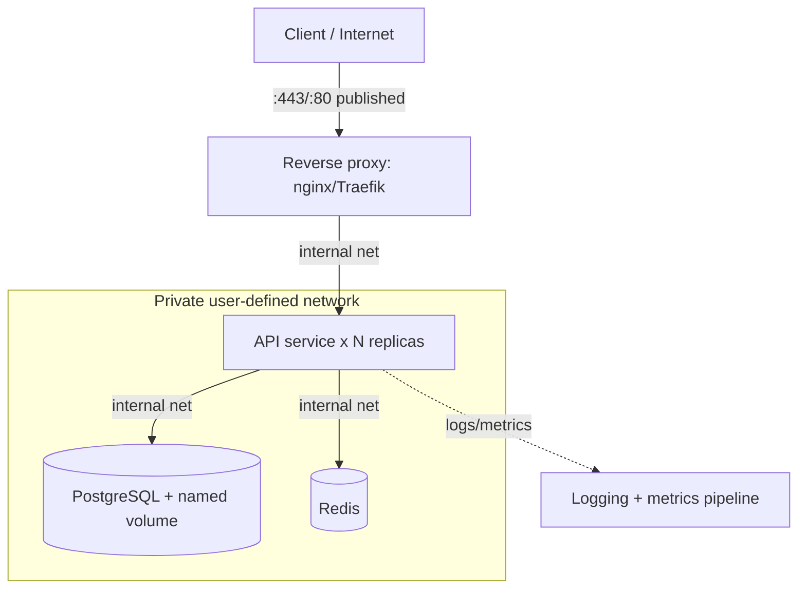

# Chapter 9 — Real-World Projects: Putting It All Together

## 1. Introduction

Everything so far has been building toward this: the ability to take a real application and
containerize, network, secure, observe, and ship it like a professional. This chapter is
project-driven. Rather than introducing many new concepts, it **integrates** the ones you've
learned through three complete, increasingly sophisticated builds:

1. **Project A — Containerize a single service** (consolidates Ch 1–3, 6).
2. **Project B — A full multi-service stack with Compose** (consolidates Ch 4–7).
3. **Project C — Production-shaped delivery** (consolidates Ch 6–8: hardening, secrets,
   logging, limits, registry, CI/CD).

Each project gives you the architecture, the key files, the build/run steps, validation
criteria, and stretch goals. Work through them in order; each reuses and extends the last.
The capstone (in the roadmap) then asks you to do all of this independently.

---

## 2. Learning Goals

By the end of this chapter you will be able to:

- Containerize a real application end to end with a clean, optimized Dockerfile.
- Compose a multi-service system (app + database + cache + reverse proxy) with persistence,
  private networking, and healthchecks.
- Apply production concerns — hardening, secrets, logging, limits, restart policies — to a
  realistic deployment.
- Wire a CI/CD pipeline that builds, scans, and publishes images.
- Validate your work against concrete acceptance criteria.

---

## 3. Concepts Explained (the integration mindset)

There are no brand-new primitives here; the skill is **composition and judgment**. As you
build, keep asking the questions a senior engineer asks:

- *What owns this data?* → volume vs bind vs nothing.
- *Who needs to reach this?* → publish only the front door; everything else internal.
- *What happens on crash / deploy / node loss?* → restart policy, healthcheck, graceful
  shutdown, persistent volume.
- *What's the smallest, safest image that runs this?* → slim/distroless base, multi-stage,
  non-root.
- *Where do credentials live?* → never in the image; injected at runtime.
- *How do I know it's healthy?* → meaningful healthcheck + logs + metrics.
- *Is this build reproducible?* → pinned bases, lockfiles, digest promotion, CI.

Reference architecture for Projects B/C:



Only the proxy is published. The API, database, and cache live on the private network,
reachable by name. Data persists on a named volume. Secrets are injected at runtime.

---

## 4. Internal Working / Deep Dive — design decisions explained

For each architectural choice in the reference design, the *why*:

- **Reverse proxy in front of the API:** TLS termination, a single published entry point, and
  load balancing across API replicas. Keeps the API itself internal and replaceable.
- **API as multiple stateless replicas:** statelessness lets you scale horizontally and lose a
  replica without data loss; all state lives in the DB/cache.
- **PostgreSQL on a named volume:** the one stateful component; the volume survives container
  rebuilds and DB image upgrades, and bypasses copy-on-write for write performance.
- **Redis as cache:** ephemeral by design; if it's lost, the app rebuilds the cache — so it may
  not need persistence (a deliberate decision, not an oversight).
- **Private network + publish-only-proxy:** minimizes attack surface; the DB is never exposed
  to the host/LAN.
- **Healthchecks everywhere + restart policies:** the system detects unready/failed components
  and routes/recovers accordingly.
- **Multi-stage, non-root, minimal images:** fast pulls, small attack surface, least
  privilege.
- **Digest-pinned, CI-built images:** reproducible deploys; the same bytes flow from test to
  prod.

These are the trade-offs you should be able to defend out loud — that ability *is* the
professional proficiency this course targets.

---

## 5. Examples (the three projects)

### Project A — Containerize a single service

**Goal:** take one web API and produce a small, correct, hardened image.

**Dockerfile (Python/FastAPI example; adapt to your stack):**
```dockerfile
# ---- build deps in a slim base, cache-friendly order ----
FROM python:3.12-slim AS base
ENV PYTHONUNBUFFERED=1 PIP_NO_CACHE_DIR=1
WORKDIR /app
COPY requirements.txt .
RUN pip install -r requirements.txt
COPY . .

# non-root + healthcheck-ready
RUN useradd --uid 10001 appuser && chown -R appuser /app
USER appuser
EXPOSE 8000
HEALTHCHECK --interval=10s --timeout=3s --start-period=20s --retries=3 \
  CMD python -c "import urllib.request,sys; sys.exit(0 if urllib.request.urlopen('http://localhost:8000/health').status==200 else 1)"
CMD ["uvicorn", "main:app", "--host", "0.0.0.0", "--port", "8000"]
```

**`.dockerignore`:**
```text
.git
__pycache__
*.pyc
.env
.venv
tests
```

**Build, run, validate:**
```bash
docker build -t me/api:0.1 .
docker run -d --name api -p 8000:8000 me/api:0.1
curl localhost:8000/health
docker ps                       # STATUS should show (healthy) after start-period
docker history me/api:0.1       # check size
```

**Acceptance criteria:** image builds reproducibly; runs as non-root; `/health` returns 200;
container reports `healthy`; image is "slim" (note your number); a source-only change reuses
the dependency layer.

**Stretch:** convert to multi-stage if your stack has a build step; try a distroless final
stage; add OCI provenance labels.

---

### Project B — Full multi-service stack with Compose

**Goal:** the reference architecture (proxy + API + Postgres + Redis) running with one
command, with persistence, private networking, and healthchecks.

**`compose.yaml`:**
```yaml
services:
  proxy:
    image: nginx:1.27-alpine
    ports: ["8080:80"]            # the ONLY published service
    volumes:
      - ./nginx.conf:/etc/nginx/conf.d/default.conf:ro
    depends_on:
      api: { condition: service_healthy }

  api:
    build: .
    environment:
      DATABASE_URL: postgres://app:secret@db:5432/app
      REDIS_URL: redis://cache:6379/0
    healthcheck:
      test: ["CMD","python","-c","import urllib.request;urllib.request.urlopen('http://localhost:8000/health')"]
      interval: 10s
      timeout: 3s
      start_period: 20s
      retries: 3
    depends_on:
      db: { condition: service_healthy }
      cache: { condition: service_started }
    restart: unless-stopped

  db:
    image: postgres:16
    environment:
      POSTGRES_USER: app
      POSTGRES_PASSWORD: secret      # Project C moves this to a secret
      POSTGRES_DB: app
    volumes:
      - pgdata:/var/lib/postgresql/data
    healthcheck:
      test: ["CMD-SHELL","pg_isready -U app"]
      interval: 5s
      retries: 5
    restart: unless-stopped

  cache:
    image: redis:7-alpine
    restart: unless-stopped

volumes:
  pgdata:
```

**`nginx.conf` (proxy → api):**
```nginx
server {
  listen 80;
  location / {
    proxy_pass http://api:8000;
    proxy_set_header Host $host;
  }
}
```

**Run, validate, scale:**
```bash
docker compose up -d --build
docker compose ps                     # all healthy; only proxy publishes a port
curl localhost:8080/health            # reaches API through the proxy
docker compose up -d --scale api=3    # 3 API replicas behind the proxy
docker compose logs -f api
docker compose down                   # data persists
docker compose up -d                  # confirm DB data survived
```

**Acceptance criteria:** one command brings the stack up; the DB and cache are *not*
published; the API reaches `db`/`cache` by name; DB data persists across `down`/`up`; all
services report healthy; scaling the API works.

**Stretch:** add a `seed` service behind an `init` profile; add a `compose.prod.yaml` override
with resource limits and `restart: unless-stopped` everywhere.

---

### Project C — Production-shaped delivery

**Goal:** harden and operationalize Project B, and ship it via CI.

**Changes to apply:**

1. **Secrets (no plaintext passwords):**
```yaml
services:
  db:
    environment:
      POSTGRES_PASSWORD_FILE: /run/secrets/db_password
    secrets: [db_password]
  api:
    environment:
      DB_PASSWORD_FILE: /run/secrets/db_password
    secrets: [db_password]
secrets:
  db_password:
    file: ./secrets/db_password.txt    # use an external secret store in real prod
```
(Adapt the API and DB to read the password from the file.)

2. **Limits, restart, graceful shutdown** (per service):
```yaml
    restart: unless-stopped
    stop_grace_period: 30s
    init: true
    deploy:
      resources:
        limits: { cpus: "1.0", memory: 512M }
```

3. **Logging with rotation** (`daemon.json` or per-service `logging:`), app emits JSON to
   stdout.

4. **Hardening at run** (where the app allows): non-root user (already in the image),
   `read_only: true` with a tmpfs for scratch, `cap_drop: [ALL]`, `security_opt:
   ["no-new-privileges:true"]`.

5. **CI/CD pipeline** (GitHub Actions sketch):
```yaml
name: ci
on: { push: { branches: [main] } }
jobs:
  build:
    runs-on: ubuntu-latest
    steps:
      - uses: actions/checkout@v4
      - run: make test
      - uses: docker/setup-buildx-action@v3
      - uses: docker/login-action@v3
        with: { registry: ghcr.io, username: ${{ github.actor }}, password: ${{ secrets.GITHUB_TOKEN }} }
      - id: build
        uses: docker/build-push-action@v6
        with:
          push: true
          tags: |
            ghcr.io/myorg/api:${{ github.sha }}
            ghcr.io/myorg/api:latest
          cache-from: type=gha
          cache-to: type=gha,mode=max
      - run: docker scout cves ghcr.io/myorg/api:${{ github.sha }} --exit-code --only-severity critical
      - run: echo "Deploy by digest ${{ steps.build.outputs.digest }}"
```

**Acceptance criteria:** no secret appears in `docker history` or the environment; each
service has limits + restart policy; the API drains on SIGTERM (visible in logs); logs are
JSON with rotation; the CI workflow builds, scans (gating on critical CVEs), and pushes;
deploys reference an **immutable digest**.

**Stretch:** add image signing (cosign) and SBOM generation; deploy the stack to a single-node
**Swarm** (`docker swarm init`, `docker stack deploy`) and observe service-level health and
rolling updates — your on-ramp to Chapter 10.

---

## 6. Real-World Use Cases

These three projects mirror exactly how teams ship software:

- **Project A** is what you do the first day you containerize a service — and the template you
  reuse for every new microservice.
- **Project B** is the standard local-dev and integration-test environment: clone, `compose
  up`, everything works; it's also the shape of many small production deployments.
- **Project C** is how that same stack becomes production-grade and self-shipping — the
  difference between a demo and a system on call at 3 a.m.

Variations you'll meet in the wild: swapping nginx for Traefik (auto service discovery),
adding a message queue (RabbitMQ/Kafka) as another internal service, adding a migrations
job as an `init`-profile service, and promoting the Compose stack to Swarm or Kubernetes for
multi-node scale.

---

## 7. Common Mistakes

- **Publishing internal services** (DB/cache) "to test them," leaving them exposed after.
- **Forgetting persistence** until the first `down -v` wipes the database.
- **Healthchecks that pass while the app is broken,** so the proxy keeps sending traffic to a
  dead replica.
- **Hard-coding the same secret in multiple services' env** instead of a shared file secret.
- **Skipping graceful shutdown,** so scaling/redeploying drops in-flight requests.
- **Building images by hand** for each environment instead of building once in CI and promoting
  by digest.
- **Letting the proxy and API disagree on ports/hostnames** (proxy points at the wrong
  internal name).
- **Treating the cache as durable** and being surprised when a restart clears it (decide
  intentionally).

---

## 8. Best Practices

- **Start from the questions in §3** for every component; write down the answers as comments in
  your Compose/Dockerfiles.
- **Publish only the entry point;** keep all else on the private network.
- **Volume your stateful service; decide consciously about the cache.**
- **Make every service healthchecked and restart-policed;** test failure and recovery.
- **Centralize config and secrets;** inject at runtime, never bake.
- **Build once in CI, scan, and promote by digest;** tag with git SHA + semver.
- **Keep dev/prod parity** via layered Compose files, not divergent manual setups.
- **Document the architecture** (a diagram + a short rationale) so others can operate it.

---

## 9. Hands-On Exercise

Work the three projects in order, committing each to git:

1. **Project A.** Containerize your own (or a provided) service per the spec. Meet every
   acceptance criterion; record image size and the size delta from any multi-stage/distroless
   change.

2. **Project B.** Stand up the full stack. Prove: only the proxy is published, the API reaches
   `db`/`cache` by name, data persists across `down`/`up`, all services healthy, API scales to
   3. Capture `docker compose ps` output.

3. **Project C.** Apply all production changes. Prove: secret not in `history`/env, limits +
   restart in effect, SIGTERM drain visible in logs, JSON logs with rotation, and a CI run that
   builds + scans + pushes. Capture the emitted **digest** and deploy by it.

4. **Failure drills.** Kill the DB container and watch the API/healthchecks react; restore and
   confirm recovery. OOM the API (tiny memory limit) and confirm restart. Re-push a tag with
   different content and show your digest-pinned deploy is unaffected.

5. **Write-up.** Produce a one-page architecture doc: the diagram, each component's role, and
   the rationale for each major decision (data ownership, exposure, recovery, image strategy,
   secrets, delivery).

**Deliverable:** a git repo with the three projects' files and the architecture write-up —
this *is* your capstone foundation.

---

## 10. Quiz Questions

1. In the reference architecture, which service is published and why are the others not?
2. Which component is stateful, how do you persist it, and why does the cache differ?
3. Why must the API be stateless to scale to multiple replicas safely?
4. How does the proxy reach the API, and how does the API reach the database?
5. What proves a secret is *not* leaking into your image?
6. Why build the image once in CI and deploy by digest instead of rebuilding per environment?
7. During a deploy, what makes the difference between dropped requests and a clean handoff?
8. Name two failure drills that validate your healthcheck/restart design.

<details>
<summary>Answer key</summary>

1. The reverse proxy (single entry point, TLS, load balancing). Others stay on the private
   network to minimize attack surface — the DB/cache should never be exposed.
2. PostgreSQL; persist it with a named volume (survives rebuilds, bypasses copy-on-write). The
   cache (Redis) is intentionally ephemeral — losing it just forces a rebuild of cached data.
3. State must live in the DB/cache so any replica can serve any request and losing a replica
   loses no data; in-replica state would make replicas inconsistent and unsafe to scale.
4. By service name over the private user-defined network: the proxy proxies to `api:8000`, the
   API connects to `db:5432`/`cache:6379` — Docker's embedded DNS resolves the names.
5. It doesn't appear in `docker history` or the process environment; it's delivered as a
   runtime file (e.g. `/run/secrets/...`) the app reads.
6. Tags are mutable; building once and promoting the immutable digest guarantees byte-identical
   images across environments and avoids "rebuilt differently" surprises.
7. Graceful shutdown: on SIGTERM the app stops taking new requests, drains in-flight ones, and
   exits cleanly within the grace period — instead of being SIGKILLed mid-request.
8. e.g. kill the DB and confirm health flips / API recovers on restore; set a tiny memory limit
   to force an OOM and confirm the restart policy recovers the container.
</details>

---

## 11. Chapter Summary

- This chapter **integrated** the course into three builds: containerize one service (A), a
  full Compose stack with persistence/private networking/health (B), and a production-shaped,
  CI-delivered, hardened deployment (C).
- The professional skill is **composition and judgment**: data ownership, exposure, recovery,
  image strategy, secrets, and reproducible delivery — being able to defend each choice.
- The reference architecture — **published proxy → stateless API replicas → volumed DB +
  ephemeral cache on a private network**, all healthchecked and restart-policed — is a pattern
  you'll reuse constantly.
- Your repo of the three projects plus the architecture write-up is the foundation for the
  **capstone**.

Next: **Chapter 10 — Expert Topics**, where we cross into orchestration (Swarm and the
Kubernetes on-ramp), advanced builds with BuildKit/buildx, rootless Docker, deep security
hardening, and the OCI internals that underpin the whole ecosystem.

---

## 12. Further Reading

- Docker docs: "Get started" sample apps; "Compose in production."
- nginx and Traefik reverse-proxy guides for containers.
- Docker docs: "Swarm mode" and `docker stack deploy` (preview for Ch 10).
- The Twelve-Factor App (Disposability, Config, Dev/prod parity).
- Reference container app repos (realworld-example-apps) to study multi-service designs.
