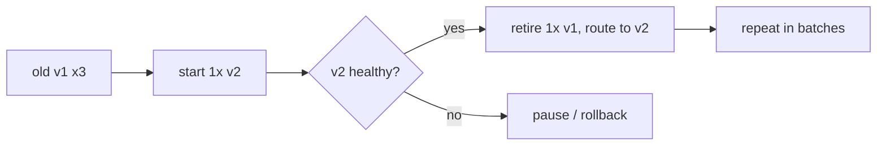

# Chapter 10 — Expert Topics: Orchestration, BuildKit, Rootless, Hardening, OCI

## 1. Introduction

You can now design, build, secure, and operate containerized systems on one host or a small
cluster. This final chapter takes you to the edges of Docker expertise and points you at
what's beyond it. We cover five expert domains: **orchestration** (Docker Swarm, and the
conceptual on-ramp to Kubernetes), **advanced builds** with **BuildKit/buildx** (cache mounts,
build secrets, multi-platform images), **rootless Docker** (running the daemon and containers
without root), **deep security hardening** (capabilities, seccomp, AppArmor/SELinux, user
namespaces), and the **OCI internals** (image and runtime specs) that make the entire
ecosystem interoperable.

The goal here isn't to make you a Kubernetes administrator in one chapter — it's to give you
the accurate mental models so that whatever you adopt next (Kubernetes, Nomad, hardened
runtimes, supply-chain tooling) feels like a natural extension rather than a new mystery.

---

## 2. Learning Goals

By the end of this chapter you will be able to:

- Explain the **orchestration problem** and how Docker Swarm solves it, and map those concepts
  onto **Kubernetes** so the transition is conceptual.
- Use **BuildKit/buildx** features: cache mounts, build secrets, and **multi-platform**
  builds.
- Explain and run **rootless Docker** and articulate its security benefits and limits.
- Apply **deep hardening**: drop capabilities, apply seccomp/AppArmor/SELinux, use user
  namespaces, read-only rootfs.
- Describe the **OCI image and runtime specs** and why they make runtimes/tools
  interchangeable.

---

## 3. Concepts Explained

### 3.1 The orchestration problem

A single host with Compose breaks down when you need: more than one machine, automatic
rescheduling when a node dies, rolling updates without downtime, service discovery and load
balancing across nodes, declarative desired-state with self-healing, and secret/config
distribution at scale. An **orchestrator** manages a *cluster* of hosts to deliver these.

**Docker Swarm** is Docker's built-in orchestrator — simple, Compose-compatible:
```bash
docker swarm init                                   # make this node a manager
docker stack deploy -c compose.yaml mystack         # deploy a stack to the swarm
docker service ls                                   # services and replica counts
docker service scale mystack_api=5                  # scale
docker service update --image myorg/api:1.5 mystack_api   # rolling update
```
Swarm adds: **services** (a desired number of replicas), **overlay networks** (Ch 7) for
cross-node communication, **routing mesh** (any node can accept traffic for any service),
**secrets/configs** distributed to nodes, and **self-healing** (it reschedules lost replicas).

**Kubernetes** solves the same problems with more power and complexity. The concept mapping:

| Swarm / Compose concept | Kubernetes concept |
|---|---|
| Container | Container (inside a **Pod**, the smallest unit) |
| Service (replicas) | **Deployment** (manages **ReplicaSets** of Pods) |
| `docker service` exposure / routing mesh | **Service** (+ **Ingress** for HTTP) |
| Overlay network | Cluster network via a **CNI** plugin |
| Named volume / volume plugin | **PersistentVolume / PersistentVolumeClaim** |
| Docker/Swarm secret | **Secret** |
| Compose env / configs | **ConfigMap** |
| Healthcheck | **liveness / readiness / startup probes** |
| `docker stack deploy` | `kubectl apply -f` (declarative manifests) |
| Engine talks to containerd via... | the **CRI** (Container Runtime Interface) |

Crucially, Kubernetes runs your **OCI images** on **containerd** via the CRI — the same images
you've been building all along. You don't rebuild for Kubernetes; you write manifests that
schedule those images. That's the on-ramp.

### 3.2 BuildKit and buildx

**BuildKit** is the modern build engine (default in current Docker). It's faster (parallel
stage execution, better caching), and unlocks features via the `# syntax=docker/dockerfile:1`
directive:

- **Cache mounts** — persist a package cache across builds without baking it into a layer:
```dockerfile
# syntax=docker/dockerfile:1
RUN --mount=type=cache,target=/root/.cache/pip pip install -r requirements.txt
```
- **Build secrets** (Ch 6) — credentials available during a `RUN`, never in a layer:
```dockerfile
RUN --mount=type=secret,id=token TOKEN=$(cat /run/secrets/token) ./fetch-private-deps.sh
```
- **SSH forwarding** — use the host's SSH agent to clone private repos at build time:
```dockerfile
RUN --mount=type=ssh git clone git@github.com:org/private.git
```
- **Bind mounts at build** — read host files for a single step without `COPY`.

**buildx** is the CLI front-end that drives BuildKit and adds **multi-platform builds**:
```bash
docker buildx create --use
docker buildx build --platform linux/amd64,linux/arm64 \
  -t myorg/api:1.5 --push .
```
This produces a **multi-arch image** (a manifest list) so the same tag runs on Intel and ARM
(e.g. Apple Silicon, Graviton, Raspberry Pi) — the registry serves each host the right
variant automatically.

### 3.3 Rootless Docker

Traditionally `dockerd` runs as **root**, and access to the Docker socket effectively grants
root on the host (you can mount `/` from a container). **Rootless mode** runs the daemon and
containers **as an unprivileged user**, using **user namespaces** to map container-root to an
unprivileged host UID. Benefits: a container escape lands you as an unprivileged user, not
host root; multiple users can run isolated Docker instances. Limits: some features need extra
setup (low ports, certain network/storage drivers, cgroup v2 niceties), and performance can
differ. For multi-tenant or security-sensitive hosts, rootless (or Podman, which is rootless
and daemonless by design) is a strong default.

### 3.4 Deep security hardening (defense in depth)

Layer these on top of Ch 6's basics:

- **Capabilities:** Linux splits root's powers into ~40 capabilities. Drop all, add back only
  what's needed: `--cap-drop ALL --cap-add NET_BIND_SERVICE`.
- **seccomp:** filters which **syscalls** a container may make. Docker ships a sensible default
  profile; you can supply a stricter custom one.
- **AppArmor / SELinux:** mandatory access control (MAC) confining what files/operations a
  container process may touch.
- **User namespaces:** remap container UIDs to unprivileged host UIDs (`userns-remap`), so
  in-container root ≠ host root even without full rootless mode.
- **Read-only rootfs + tmpfs**, `no-new-privileges`, **non-root USER** (Ch 6).
- **Supply chain:** pin by digest, scan, **sign** (cosign), generate **SBOMs**, and verify
  signatures at deploy (admission policies in K8s).
- **Pluggable runtimes for stronger isolation:** **gVisor** (a userspace kernel intercepting
  syscalls) or **Kata Containers** (lightweight VM per container) when kernel-shared isolation
  isn't enough.

### 3.5 OCI internals

The **Open Container Initiative** defines the contracts everything implements:

- **Image spec:** an image is a **manifest** (listing layers + a config by digest), a **config**
  (env, entrypoint, architecture, history), and **layer blobs** (tar archives), all
  content-addressed by SHA-256. A **manifest list / index** ties together per-architecture
  manifests (how multi-arch images work).
- **Runtime spec:** the `config.json` that a runtime (runc) consumes — rootfs path, process,
  env, namespaces, cgroups, capabilities, seccomp, mounts.
- **Distribution spec:** the registry HTTP API for pushing/pulling those blobs and manifests.

Because Docker emits OCI images and runc is an OCI runtime, *any* compliant tool (Podman,
containerd, CRI-O, BuildKit, K8s) and *any* compliant registry interoperate. This standard is
the quiet reason the ecosystem isn't locked to one vendor.

---

## 4. Internal Working / Deep Dive

### 4.1 How a rolling update avoids downtime

In Swarm/K8s, updating a service doesn't replace all replicas at once. The orchestrator
replaces them **in batches**: start new-version replicas, wait for them to pass health
(readiness) checks, route traffic to them, then retire old ones — repeating until done. If new
replicas fail health, it can **pause or roll back**. This is why healthchecks (Ch 7) are
load-bearing in orchestration: they gate traffic and decide update success. Parameters like
update parallelism, delay, and failure action are configurable.



### 4.2 How a multi-platform image is served

`buildx --platform` builds one image per target architecture and publishes a **manifest list
(index)** under a single tag. When a host pulls that tag, the registry/daemon inspects the
host architecture and returns the matching manifest+layers. To the user it's one tag; under
the hood it's several images plus an index — pure OCI image-spec machinery.

### 4.3 Why the Docker socket is root-equivalent (and rootless fixes it)

The daemon runs as root and will do anything you ask via its API — including running a
container that bind-mounts the host's `/` and chroots into it. So **giving someone access to
`/var/run/docker.sock` is giving them root**. This is why mounting the Docker socket into a
container (a common CI pattern) is dangerous, and why rootless mode (daemon as a normal user,
container-root mapped to an unprivileged host UID via user namespaces) meaningfully reduces
blast radius: even socket access only yields the unprivileged user's powers.

### 4.4 gVisor / Kata: trading performance for isolation

Kernel-shared containers (runc) are fast but a kernel vulnerability can be an escape path.
**gVisor** inserts a userspace "kernel" (Sentry) that intercepts container syscalls, so the
real host kernel is exposed to a far smaller surface. **Kata** runs each container in a
lightweight VM, restoring a hardware boundary. Both implement the OCI runtime spec, so you
swap them in via `--runtime` without changing images — choosing where to sit on the
performance/isolation spectrum.

---

## 5. Examples

### Example 1 — Deploy your Ch 9 stack to a single-node Swarm

```bash
docker swarm init
docker stack deploy -c compose.yaml app
docker service ls
docker service ps app_api
docker service scale app_api=4
docker service update --image myorg/api:1.5 --update-parallelism 1 --update-delay 10s app_api
docker stack rm app
docker swarm leave --force
```

### Example 2 — BuildKit cache mount + secret + multi-arch

```dockerfile
# syntax=docker/dockerfile:1
FROM python:3.12-slim
WORKDIR /app
COPY requirements.txt .
RUN --mount=type=cache,target=/root/.cache/pip \
    --mount=type=secret,id=pip_extra,target=/root/.config/pip/pip.conf \
    pip install -r requirements.txt
COPY . .
CMD ["python","main.py"]
```
```bash
docker buildx create --use
docker buildx build --platform linux/amd64,linux/arm64 \
  --secret id=pip_extra,src=$HOME/.config/pip/pip.conf \
  -t myorg/api:1.5 --push .
```

### Example 3 — Hardened run

```bash
docker run -d --name api \
  --user 10001:10001 \
  --cap-drop ALL --cap-add NET_BIND_SERVICE \
  --security-opt no-new-privileges \
  --security-opt seccomp=./seccomp-strict.json \
  --read-only --tmpfs /tmp \
  --pids-limit 200 --memory 512m --cpus 1 \
  myorg/api:1.5
```

### Example 4 — Rootless Docker (Linux)

```bash
# install rootless mode for the current user
dockerd-rootless-setuptool.sh install
export DOCKER_HOST=unix://$XDG_RUNTIME_DIR/docker.sock
docker run hello-world          # daemon + container run as your unprivileged user
docker info | grep -i rootless  # confirm rootless: true
```

### Example 5 — Inspect OCI internals

```bash
docker buildx imagetools inspect myorg/api:1.5   # see the manifest list (architectures)
docker manifest inspect myorg/api:1.5            # raw OCI manifest
# explore layers/config of an image:
docker save myorg/api:1.5 -o api.tar && tar -tf api.tar   # manifest.json + layer tars
```

---

## 6. Real-World Use Cases

- **Multi-node production** with self-healing, rolling updates, and load balancing via Swarm or
  (far more commonly) Kubernetes — using the OCI images you already build.
- **Apple Silicon / ARM cloud (Graviton) support:** multi-platform images so one tag runs on
  developers' M-series laptops and ARM production nodes.
- **Fast CI builds:** BuildKit cache mounts and registry-backed caches slash dependency
  re-install time across pipeline runs.
- **Private-dependency builds without leaks:** BuildKit SSH/secret mounts to fetch private
  packages at build time.
- **Hardened multi-tenant platforms:** rootless + dropped capabilities + seccomp/AppArmor +
  gVisor/Kata for untrusted workloads.
- **Verifiable supply chain:** digest pinning + signing + SBOM + admission-time verification to
  prove what's running came from your pipeline.
- **Runtime swaps:** drop in gVisor/Kata for sensitive services without touching images,
  thanks to the OCI runtime spec.

---

## 7. Common Mistakes

- **Reaching for Kubernetes when Swarm/Compose suffices,** taking on huge operational cost
  prematurely.
- **Assuming images must change for Kubernetes** — they don't; only the orchestration manifests
  do.
- **Mounting the Docker socket into containers/CI** without realizing it's root-equivalent.
- **Rolling updates without good readiness checks,** so traffic hits not-yet-ready replicas (or
  a bad version rolls out fully).
- **Single-arch images** that fail to run (or run emulated and slow) on ARM hosts.
- **Treating rootless as a silver bullet,** ignoring its feature/setup limitations.
- **Over-restricting seccomp/capabilities** and breaking the app, then disabling security
  entirely instead of adding back the minimum.
- **Ignoring OCI knowledge,** then being mystified by multi-arch manifests, signatures, or
  cross-tool behavior.

---

## 8. Best Practices

- **Match the tool to the scale:** Compose (one host) → Swarm (simple clusters) → Kubernetes
  (large/complex). Don't over-orchestrate.
- **Learn the Swarm↔K8s concept mapping** so migration is conceptual; your **OCI images carry
  over unchanged**.
- **Adopt BuildKit features:** cache mounts for speed, secret/SSH mounts for safe private deps,
  buildx for **multi-platform** images by default.
- **Prefer rootless (or Podman)** on shared/sensitive hosts; never expose the Docker socket
  casually.
- **Harden in depth:** non-root, `cap-drop ALL` + minimal adds, seccomp/AppArmor/SELinux, user
  namespaces, read-only rootfs, limits.
- **Secure the supply chain:** pin digests, scan, **sign**, ship **SBOMs**, verify at deploy.
- **Choose isolation strength deliberately:** runc for speed, **gVisor/Kata** for untrusted or
  high-stakes workloads.
- **Understand OCI** well enough to debug manifests, multi-arch, and signatures.

---

## 9. Hands-On Exercise

**Goal:** operate at expert level across orchestration, builds, rootless, and hardening.

1. **Swarm rollout.** Initialize a single-node Swarm, deploy your Ch 9 stack with
   `docker stack deploy`, scale the API, then perform a **rolling update** to a new image tag
   with `--update-parallelism 1 --update-delay`. Break the new image's healthcheck and observe
   the update behavior; then fix and complete it.

2. **K8s concept map (paper exercise).** For your Ch 9 stack, write the Kubernetes equivalents:
   which parts become Deployments, Services, an Ingress, a PVC, a Secret, a ConfigMap, and
   readiness/liveness probes. (You don't need a cluster — the mapping is the learning.)

3. **Multi-platform build.** Use `buildx` to build and push your API for `linux/amd64` and
   `linux/arm64`. Inspect the manifest list with `docker buildx imagetools inspect` and confirm
   both architectures are present.

4. **BuildKit cache + secret.** Add a `--mount=type=cache` to your dependency install and
   measure the build-time improvement on a second build. Add a `--mount=type=secret` for a
   (dummy) private credential and confirm it's absent from `docker history`.

5. **Rootless (Linux).** Set up rootless Docker, run a container as your unprivileged user, and
   confirm `docker info` reports rootless. Reflect: what does a container escape get the
   attacker now versus in rootful mode?

6. **Hardening pass.** Run your API with `--cap-drop ALL` (add back only what's needed),
   `--read-only` + tmpfs, `no-new-privileges`, and a seccomp profile. If something breaks,
   identify the missing capability/syscall and add back the **minimum**.

7. **OCI peek.** `docker save` your image and inspect the tar: find `manifest.json`, the config
   blob, and the layer tarballs. Match what you see to the OCI image spec.

**Deliverable:** the Swarm stack + rolling-update notes, the K8s mapping table, a multi-arch
manifest inspection, and a hardened `docker run` (or Compose `security_opt`/`cap_drop` block)
that still passes your healthcheck.

---

## 10. Quiz Questions

1. What problems does an orchestrator solve that single-host Compose cannot?
2. Map these Compose/Swarm concepts to Kubernetes: service-with-replicas, named volume, secret,
   healthcheck, `stack deploy`.
3. Do you need to rebuild your images to move to Kubernetes? Why or why not?
4. What does `buildx --platform linux/amd64,linux/arm64` produce, and how does a host get the
   right variant?
5. Why is access to the Docker socket equivalent to host root, and how does rootless mode change
   that?
6. Give three distinct hardening mechanisms and what each restricts.
7. What three specs does the OCI define, and why do they enable tool/runtime interchangeability?
8. When would you choose gVisor or Kata over the default runc runtime?

<details>
<summary>Answer key</summary>

1. Multi-host scheduling, self-healing/rescheduling on node loss, rolling updates, cross-node
   service discovery + load balancing, declarative desired-state, and at-scale secret/config
   distribution.
2. service-with-replicas → Deployment (managing ReplicaSets of Pods); named volume →
   PersistentVolume/PVC; secret → Secret; healthcheck → readiness/liveness/startup probes;
   `stack deploy` → `kubectl apply` of manifests.
3. No. Kubernetes runs the same OCI images via containerd/CRI; only the orchestration manifests
   are new.
4. A multi-arch image (a manifest list/index) under one tag; the registry/daemon serves each
   host the manifest+layers matching its architecture.
5. The daemon runs as root and will run a container that mounts the host `/`, so socket access =
   root. Rootless runs the daemon as an unprivileged user with container-root mapped to an
   unprivileged host UID, so escapes/socket access yield only that user's powers.
6. e.g. capabilities (which root powers a process has), seccomp (which syscalls it may make),
   AppArmor/SELinux (which files/operations via MAC), user namespaces (UID remapping), read-only
   rootfs (filesystem writes) — any three with their scope.
7. Image spec, runtime spec, and distribution spec; because every tool/runtime/registry
   implements the same contracts, OCI images run on any OCI runtime and any compliant tool or
   registry.
8. For untrusted or high-stakes/multi-tenant workloads where kernel-shared isolation is
   insufficient — gVisor (userspace syscall interception) or Kata (per-container VM) provide
   stronger boundaries, at some performance cost; both are OCI runtimes you swap in without
   changing images.
</details>

---

## 11. Chapter Summary

- **Orchestration** delivers multi-host scheduling, self-healing, rolling updates, and
  service discovery; **Swarm** is the simple built-in option and a clean **concept on-ramp to
  Kubernetes**, which runs your **unchanged OCI images** via containerd/CRI.
- **BuildKit/buildx** unlock cache mounts, build secrets, SSH forwarding, and **multi-platform
  images** (manifest lists) — faster, safer, portable builds.
- **Rootless Docker** runs daemon and containers unprivileged via user namespaces, shrinking
  blast radius; never treat the **Docker socket** as anything less than root.
- **Deep hardening** layers capabilities, seccomp, AppArmor/SELinux, user namespaces, read-only
  rootfs, and a verified **supply chain** (pin/scan/sign/SBOM); **gVisor/Kata** offer stronger
  isolation as drop-in OCI runtimes.
- The **OCI specs** (image, runtime, distribution) are the standards that make the whole
  ecosystem interchangeable.

**You've completed the course.** From "works on my machine" to multi-platform, hardened,
orchestrated, supply-chain-verified delivery — you now have both the conceptual models and the
practical skills. The **capstone project** (in `00-roadmap.md`) is where you prove it: build the
production-grade platform end to end and defend every decision.

---

## 12. Further Reading

- Docker docs: "Swarm mode" overview, services, stacks, rolling updates, secrets/configs.
- Kubernetes docs: "Concepts" (Pods, Deployments, Services, Ingress, ConfigMaps, Secrets,
  Probes); the CRI.
- Docker docs: BuildKit and buildx (`# syntax`, cache/secret/ssh mounts, multi-platform).
- Docker docs: "Rootless mode"; Podman docs for the daemonless/rootless alternative.
- seccomp/AppArmor/SELinux container guides; gVisor and Kata Containers project docs.
- The OCI image-spec, runtime-spec, and distribution-spec repositories; cosign + SBOM (SPDX/
  CycloneDX) and Sigstore.
