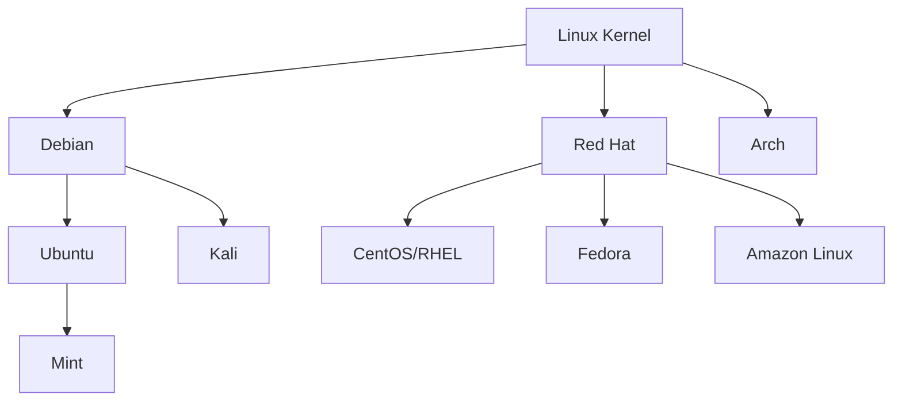

# Chapter 01 — Introduction & Why Linux

## Learning Objectives

By the end of this chapter, you will:
- Understand what Linux is and why it dominates servers and DevOps
- Know the difference between Linux distributions and which to use
- Open a terminal and run your first commands
- Understand the structure of a Linux command
- Know what a shell is and how it works

## Prerequisites

- None — this is the starting point

---

## 1.1 What Is Linux?

Think of your computer as a building. **Hardware** is the physical structure — the CPU, RAM, hard disk. **Software** is everything running inside. Between the two sits the **operating system (OS)** — the building manager that controls who gets access to which room.

Linux is an operating system. But unlike Windows or macOS, Linux is:

1. **Open source** — its source code is publicly available and free to modify
2. **Free** — no license cost
3. **Everywhere** — from your smartwatch to the International Space Station

### Why Does Linux Dominate Servers?

| Environment | Linux Market Share |
|-------------|-------------------|
| Web servers | ~96% |
| Cloud infrastructure | ~90%+ |
| Supercomputers (Top 500) | 100% |
| Android (Linux kernel) | ~72% of mobile |
| Docker containers | 100% |

When you deploy to AWS, GCP, or Azure — your application runs on Linux. When you use Docker — Linux containers. When you manage Kubernetes — Linux nodes. **Linux is not optional for DevOps. It is the foundation.**

### The Linux Kernel

Linux, strictly speaking, refers to the **kernel** — the core piece of software that manages:
- CPU scheduling (which program runs when)
- Memory allocation (which program gets RAM)
- Device drivers (talking to hardware)
- File systems (reading/writing disks)
- Networking (sending/receiving packets)

Everything else (commands, GUIs, package managers) is built on top of the kernel.

```
┌─────────────────────────────────────────┐
│           Your Applications             │
│        (nginx, docker, python)          │
├─────────────────────────────────────────┤
│              Shell / Terminal           │
│            (bash, zsh, sh)              │
├─────────────────────────────────────────┤
│          System Libraries               │
│              (glibc, etc.)              │
├─────────────────────────────────────────┤
│            Linux Kernel                 │
│  (process mgmt, memory, networking,     │
│   filesystem, device drivers)           │
├─────────────────────────────────────────┤
│             Hardware                    │
│       (CPU, RAM, Disk, NIC)             │
└─────────────────────────────────────────┘
```

---

## 1.2 Linux Distributions

A **distribution (distro)** = Linux kernel + package manager + default software + configuration tools. Think of them as different "flavors" of Linux.



### Which Distro Should You Learn?

For DevOps, focus on two families:

| Family | Distros | Package Manager | Used Where |
|--------|---------|-----------------|------------|
| **Debian/Ubuntu** | Ubuntu, Debian | `apt` | Most cloud VMs, containers, WSL2 |
| **Red Hat** | RHEL, CentOS, Amazon Linux, Fedora | `yum` / `dnf` | Enterprise, AWS EC2 defaults |

> **Start with Ubuntu 22.04 LTS.** It's the most widely used, has excellent documentation, and most DevOps tutorials target it.

### Long-Term Support (LTS)

Ubuntu releases an LTS version every 2 years (20.04, 22.04, 24.04). LTS versions are supported for **5 years** — these are what production servers run. Always use LTS for servers.

---

## 1.3 Setting Up Your Linux Environment

### Option A: WSL2 (Windows Users — Recommended)

```powershell
# Run in PowerShell as Administrator
wsl --install
# Restart your computer
# Launch "Ubuntu" from Start Menu
```

### Option B: Virtual Machine (Any OS)

1. Download [VirtualBox](https://www.virtualbox.org/) (free)
2. Download [Ubuntu 22.04 LTS ISO](https://ubuntu.com/download/server)
3. Create a new VM: 2 CPU cores, 4GB RAM, 20GB disk
4. Boot from ISO and follow installer

### Option C: Cloud VM (Best for DevOps Context)

AWS Free Tier: Launch an EC2 `t2.micro` with Ubuntu 22.04
```bash
# Connect via SSH
ssh -i your-key.pem ubuntu@<your-ec2-ip>
```

### Verify Your Setup

Once you have Linux running, type:
```bash
uname -a
```
You should see something like:
```
Linux ubuntu 5.15.0-1041-aws #46-Ubuntu SMP ...
```
Congratulations — you're running Linux.

---

## 1.4 The Terminal and Shell

### What Is a Terminal?

A **terminal** (also called terminal emulator) is the application window where you type commands. It's just a text input/output interface.

- On Ubuntu: press `Ctrl+Alt+T` or search "Terminal"
- On WSL2: open the "Ubuntu" app from Start
- On a remote server: your SSH session IS the terminal

### What Is a Shell?

The **shell** is the program running *inside* the terminal that interprets your commands. The most common shell is **Bash** (Bourne Again Shell).

```
You type:  ls -la
              ↓
        Terminal receives text
              ↓
        Shell (bash) interprets it
              ↓
        Kernel executes the command
              ↓
        Output returned to terminal
              ↓
        You see the result
```

### Other Shells

| Shell | Notes |
|-------|-------|
| `bash` | Default on most Linux systems — learn this first |
| `zsh` | Default on macOS, enhanced bash with better autocomplete |
| `sh` | Minimal POSIX shell, used in scripts for portability |
| `fish` | User-friendly but non-standard |

> For this course: **always use bash**. It's the universal DevOps shell.

---

## 1.5 Anatomy of a Linux Command

Every command follows this structure:

```
command  [options]  [arguments]
   ↑         ↑           ↑
The tool   Flags that   What to
to run     modify       operate on
           behavior
```

### Real Example

```bash
ls -la /home/akash
│  │    └─────────── argument: the directory to list
│  └──────────────── option: -l (long format) + -a (show hidden)
└─────────────────── command: list files
```

### Options: Short vs Long Form

Most commands support both:
```bash
ls -a           # short form: single dash + single letter
ls --all        # long form: double dash + word
ls -la          # combine multiple short options
ls -l -a        # same as -la, written separately
```

### Getting Help for Any Command

```bash
man ls          # full manual page (press q to quit)
ls --help       # quick help summary
info ls         # detailed info pages (less common)
tldr ls         # simplified examples (install: sudo apt install tldr)
```

> **Pro tip:** When you don't know a command, `man <command>` is always your first stop. Reading man pages is a core DevOps skill.

---

## 1.6 Your First Commands

Let's run real commands. Type each one and observe the output:

### Who Am I?
```bash
whoami          # prints your username
id              # prints user ID, group ID, and groups
hostname        # prints the machine's hostname
```

### Where Am I?
```bash
pwd             # Print Working Directory — shows current location
```

### What's Around Me?
```bash
ls              # list files in current directory
ls -l           # long format with permissions, size, date
ls -la          # include hidden files (those starting with .)
ls -lh          # human-readable sizes (KB, MB, GB)
```

### System Information
```bash
uname -a        # kernel version and architecture
cat /etc/os-release   # OS name and version
uptime          # how long the system has been running
date            # current date and time
```

### Sample Output of `ls -la`
```
total 48
drwxr-xr-x 6 akash akash 4096 Jun 23 10:00 .
drwxr-xr-x 3 root  root  4096 Jun 20 08:00 ..
-rw-r--r-- 1 akash akash  220 Jun 20 08:00 .bash_logout
-rw-r--r-- 1 akash akash 3526 Jun 20 08:00 .bashrc
drwxrwxr-x 2 akash akash 4096 Jun 23 09:00 projects
```

We'll decode each column in later chapters. For now, notice:
- Lines starting with `d` are directories
- Lines starting with `-` are files
- Lines starting with `.` are hidden (like `.bashrc`)

---

## 1.7 The Linux Philosophy

Understanding Linux's design philosophy makes everything click faster:

1. **Everything is a file** — devices (`/dev/sda`), processes (`/proc/1234`), sockets — all represented as files
2. **Do one thing well** — each command does one thing. Combine them with pipes (`|`) for power
3. **Text is the universal interface** — commands read/write text, making them composable
4. **Silence means success** — if a command produces no output, it worked
5. **Root is all-powerful** — the `root` user can destroy everything. Respect this

```bash
# The Unix philosophy in action:
# Find all .log files, search for "ERROR", count occurrences
find /var/log -name "*.log" | xargs grep "ERROR" | wc -l
#     ↑ one thing    ↑ one thing         ↑ one thing  ↑ one thing
```

---

## Summary

- Linux is the foundation of DevOps — 96%+ of servers run it
- A **distribution** = kernel + tools (Ubuntu for learning, Amazon Linux/RHEL in enterprise)
- The **terminal** is where you type; the **shell** (bash) interprets commands
- Command structure: `command [options] [arguments]`
- Use `man <command>` to learn any command
- Linux philosophy: text interfaces, one task per tool, silence = success

---

## Knowledge Check

1. What is the difference between the Linux kernel and a Linux distribution?
2. What command shows your current directory?
3. What does `ls -la` do differently from just `ls`?
4. How do you get help for a command you don't know?
5. Why does Linux dominate server and cloud environments?

---

## Hands-On Exercise

Complete these tasks in your Linux environment:

```bash
# 1. Find out what Linux distro and version you're running
cat /etc/os-release

# 2. Find out your username and user ID
id

# 3. See how long your system has been up
uptime

# 4. List all files (including hidden) in your home directory
ls -la ~

# 5. Read the manual page for the 'ls' command
# Find the flag that sorts by file size (hint: search for "size" with /size)
man ls

# 6. Run this and decode what each column means
ls -lah /etc | head -20
```

**Challenge:** Find a command that shows all currently logged-in users. (Hint: `man who` or search "who is logged in linux terminal")

---

## Further Reading

- [The Linux Command Line (free book)](http://linuxcommand.org/tlcl.php) — Chapter 1
- `man intro` — run this in your terminal for a built-in intro
- [Linux Journey](https://linuxjourney.com/) — Grasshopper section

---

---


<div style="display:flex;justify-content:space-between;align-items:center;">
  <a href="00-index.md">← Previous: Index</a>
  <a href="./00-index.md">🏠 Index</a>
  <a href="02-linux-filesystem-hierarchy.md">Next: Linux Filesystem Hierarchy →</a>
</div>
