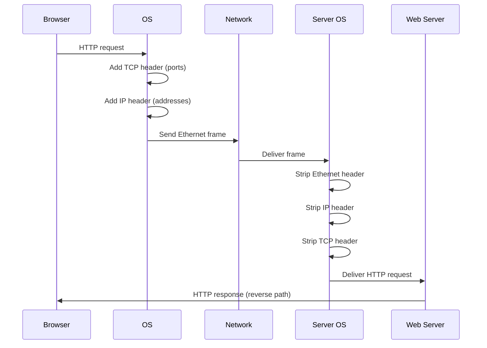

# Chapter 01 — Introduction to Networking

## Learning Objectives

By the end of this chapter, you will:
- Understand what a computer network is and why it exists
- Know the OSI model and what happens at each layer
- Understand the TCP/IP model used in practice
- Trace the complete journey of data from browser to server
- Know the key terminology: packets, protocols, encapsulation

## Prerequisites

- Linux Fundamentals (Chapters 01–08)

---

## 1.1 Why Networking Matters for DevOps

Every application you deploy communicates over a network:
- Your app talks to its database (TCP connection)
- Users reach your app (HTTP over TCP/IP)
- Your CI/CD pipeline pulls code (HTTPS to GitHub)
- Kubernetes pods call each other (DNS + HTTP)
- Docker containers communicate (virtual networks)

When something breaks — and it will — you need to reason about *where* in the network stack the problem is. This chapter gives you that mental model.

---

## 1.2 What Is a Network?

A **network** is two or more computers connected so they can exchange data.

```
Simple network:
  Computer A ──── switch ──── Computer B

Internet (network of networks):
  Your laptop → home router → ISP → backbone → data center → server
```

**Key insight:** The internet is just computers connected to computers, all using agreed-upon rules (protocols) to communicate.

---

## 1.3 The OSI Model — 7 Layers

The **OSI (Open Systems Interconnection)** model is a conceptual framework that describes how data communication works in 7 layers. Each layer has a specific job and communicates with the layer above and below it.

```
┌─────────────────────────────────────────────────────────┐
│  Layer 7 — Application   HTTP, HTTPS, DNS, FTP, SSH     │
│  Layer 6 — Presentation  Encryption, compression, TLS   │
│  Layer 5 — Session       Session establishment, teardown │
│  Layer 4 — Transport     TCP, UDP (ports, reliability)  │
│  Layer 3 — Network       IP addresses, routing          │
│  Layer 2 — Data Link     MAC addresses, Ethernet frames │
│  Layer 1 — Physical      Cables, fiber, Wi-Fi signals   │
└─────────────────────────────────────────────────────────┘
```

### Mnemonic: "Please Do Not Throw Sausage Pizza Away"
- Physical, Data Link, Network, Transport, Session, Presentation, Application

### What Each Layer Does

**Layer 1 — Physical**
- The actual medium: copper wire, fiber optic cable, radio waves (Wi-Fi)
- Deals with bits (0s and 1s) as electrical/optical/radio signals
- Problems here: broken cable, bad NIC, Wi-Fi interference

**Layer 2 — Data Link**
- Packages bits into **frames** for local network delivery
- Uses **MAC addresses** (hardware addresses burned into NICs)
- Switches operate at this layer
- Problems here: MAC flooding, ARP issues, VLAN misconfiguration

**Layer 3 — Network**
- Packages frames into **packets** with source/destination **IP addresses**
- Handles **routing** — finding the path across multiple networks
- Routers operate at this layer
- Problems here: wrong subnet mask, missing route, IP conflict

**Layer 4 — Transport**
- Provides **end-to-end communication** between processes
- **TCP**: reliable, ordered, error-checked delivery
- **UDP**: fast, connectionless, no guaranteed delivery
- Uses **port numbers** to identify which process to deliver to
- Problems here: firewall blocking port, connection refused, timeout

**Layer 5 — Session**
- Manages sessions (start, maintain, end conversations)
- In practice, often merged with Layer 4 (TCP handles this)

**Layer 6 — Presentation**
- Data formatting: encryption (TLS), compression, encoding (UTF-8, ASCII)
- Problems here: TLS certificate errors, encoding mismatches

**Layer 7 — Application**
- The protocols your applications use: HTTP, HTTPS, DNS, SSH, FTP, SMTP
- Problems here: wrong URL, bad headers, authentication failures

### DevOps Usage of OSI

```
"Connection refused" → Layer 4 problem (nothing listening on that port)
"Host unreachable"   → Layer 3 problem (no route to host)
"SSL error"          → Layer 6 problem (TLS negotiation failed)
"404 Not Found"      → Layer 7 problem (server responded, path wrong)
```

---

## 1.4 The TCP/IP Model — What's Actually Used

In practice, engineers use the **4-layer TCP/IP model** (also called the Internet model):

```
OSI Model           TCP/IP Model
─────────────       ──────────────────────────────
Application  ┐
Presentation ├─────► Application   (HTTP, DNS, SSH, FTP)
Session      ┘
Transport    ──────► Transport      (TCP, UDP)
Network      ──────► Internet       (IP, ICMP, ARP)
Data Link    ┐
Physical     ├─────► Network Access (Ethernet, Wi-Fi)
```

The TCP/IP model maps more directly to how modern protocols are actually implemented.

---

## 1.5 Protocols — The Rules of Communication

A **protocol** is an agreed-upon set of rules for communication. Think of it like a language — both sides must speak the same one.

```
Analogy: Ordering coffee
  You (client): "I'd like a medium latte, please."
  Barista (server): "That'll be $4.50."
  You: "Here you go." [gives money]
  Barista: "Here's your latte." [delivers response]

HTTP protocol:
  Browser (client): GET /index.html HTTP/1.1
  Server: HTTP/1.1 200 OK [response body follows]
```

### Key Protocols by Layer

| Layer | Protocol | Purpose |
|-------|----------|---------|
| Application | HTTP/HTTPS | Web communication |
| Application | DNS | Name resolution |
| Application | SSH | Secure remote shell |
| Application | SMTP/IMAP | Email |
| Transport | TCP | Reliable ordered delivery |
| Transport | UDP | Fast unreliable delivery |
| Internet | IP | Packet addressing and routing |
| Internet | ICMP | Control messages (ping) |
| Internet | ARP | IP→MAC address resolution |
| Network Access | Ethernet | Local network framing |
| Network Access | 802.11 (Wi-Fi) | Wireless framing |

---

## 1.6 Packets and Encapsulation

Data travels through the network as **packets**. As data moves down the OSI layers, each layer wraps the data in its own **header** (and sometimes trailer). This is called **encapsulation**.

```
Application data: "GET /index.html HTTP/1.1"
         ↓ Layer 7 adds HTTP headers
[HTTP Header | Data]
         ↓ Layer 4 (TCP) adds port numbers
[TCP Header | HTTP Header | Data]
         ↓ Layer 3 (IP) adds IP addresses
[IP Header | TCP Header | HTTP Header | Data]
         ↓ Layer 2 (Ethernet) adds MAC addresses
[Ethernet Header | IP | TCP | HTTP | Data | Ethernet Trailer]
         ↓ Layer 1 (Physical) converts to bits/signals
10110101001010...
```

On the receiving side, each layer **strips** its header and passes the payload up.



---

## 1.7 A Complete Request Journey

Let's trace what happens when you type `https://github.com` in a browser:

```
1. DNS Resolution
   Browser asks: "What IP is github.com?"
   DNS responds: "140.82.121.4"

2. TCP Connection (3-way handshake)
   Browser → Server: SYN (I want to connect)
   Server → Browser: SYN-ACK (OK, and I want to connect too)
   Browser → Server: ACK (Acknowledged)
   Connection established!

3. TLS Handshake (because HTTPS)
   Browser → Server: "I support these cipher suites..."
   Server → Browser: "Use this one. Here's my certificate."
   Browser: [verifies certificate against trusted CAs]
   Browser → Server: "Agreed. Here's an encrypted session key."
   Encrypted channel established!

4. HTTP Request
   Browser → Server: GET / HTTP/2
                     Host: github.com
                     Accept: text/html,...

5. HTTP Response
   Server → Browser: HTTP/2 200 OK
                     Content-Type: text/html
                     [page HTML follows]

6. Connection Reuse or Close
   Keep-Alive: connection stays open for more requests
   Or: TCP FIN/FIN-ACK/ACK to close gracefully
```

---

## 1.8 Client-Server Architecture

Almost all networked applications follow the **client-server** model:

```
Client                              Server
  │                                   │
  │──── TCP connect ──────────────────►│
  │──── Request (GET /api/data) ──────►│
  │◄─── Response (200 OK + data) ──────│
  │──── More requests... ─────────────►│
  │◄─── More responses... ─────────────│
  │──── TCP close ────────────────────►│
```

- **Client**: initiates connection, sends requests
- **Server**: listens for connections, processes requests, sends responses
- **Peer-to-peer (P2P)**: every node is both client and server (BitTorrent, some blockchain)

---

## 1.9 Bandwidth vs Latency

Two completely different measures of network performance:

**Bandwidth** — how much data can flow per second  
Think of a highway: bandwidth = number of lanes

**Latency** — how long it takes for data to travel from A to B  
Think of a highway: latency = distance

```
High bandwidth, high latency:
  Satellite internet: 100 Mbps, 600ms latency
  Good for bulk downloads, terrible for gaming/realtime

Low bandwidth, low latency:
  Old DSL: 2 Mbps, 10ms latency
  Terrible for 4K video, fine for VoIP

High bandwidth, low latency (ideal):
  Fiber: 1 Gbps, <5ms latency
```

For DevOps:
- **Database queries**: latency-sensitive (you want <1ms between app and DB)
- **File transfers**: bandwidth-sensitive (you want high throughput for deployments)
- **API calls**: latency-sensitive (each round-trip adds up)

---

## Summary

| Concept | Key Point |
|---------|-----------|
| OSI Model | 7 layers: Physical → Data Link → Network → Transport → Session → Presentation → Application |
| TCP/IP Model | 4 layers: Network Access → Internet → Transport → Application |
| Packet | Unit of data with headers from each layer |
| Protocol | Agreed rules for communication |
| Encapsulation | Each layer adds its own header as data travels down |
| Bandwidth | Capacity (data/second) |
| Latency | Speed (time for one trip) |

---

## Knowledge Check

1. Which OSI layer does a router operate at? Which does a switch operate at?
2. What protocol resolves domain names to IP addresses? What layer is it?
3. What is the difference between bandwidth and latency?
4. When you get a "Connection refused" error, which OSI layer is the problem?
5. What does "encapsulation" mean in networking?

---

## Hands-On Exercise

```bash
# 1. Observe encapsulation: capture a single HTTP request
sudo tcpdump -i any -nn -v 'host example.com' &
curl -s http://example.com > /dev/null
# Watch the output: you see Ethernet → IP → TCP → HTTP layers

# 2. Trace a full request journey
curl -v https://github.com 2>&1 | head -40
# Note: * = TLS info, > = sent headers, < = received headers

# 3. Measure latency to different hosts
ping -c 5 8.8.8.8         # Google DNS (nearby)
ping -c 5 1.1.1.1         # Cloudflare DNS
ping -c 5 yahoo.co.jp     # Japan (should be higher latency from India)

# 4. Trace network path (see each hop)
traceroute google.com
# Each line = one router hop, with latency at that hop

# 5. See all active connections on your machine
ss -tn state established   # established TCP connections
ss -tlnp                   # listening services
```

**Challenge:** Use `curl -w` with format strings to measure the DNS lookup time, TCP connect time, and TLS handshake time for `https://github.com` separately.

---

## Further Reading

- `man 7 tcp` — Linux TCP implementation details
- [High Performance Browser Networking](https://hpbn.co/) — Chapter 1 (free online)
- [Cloudflare: What is the OSI model?](https://www.cloudflare.com/learning/ddos/glossary/open-systems-interconnection-model-osi/)

---


<div style="display:flex;justify-content:space-between;align-items:center;">
  <a href="00-index.md">← Previous: Index</a>
  <a href="./00-index.md">🏠 Index</a>
  <a href="02-ip-addressing-and-subnetting.md">Next: IP Addressing & Subnetting →</a>
</div>
