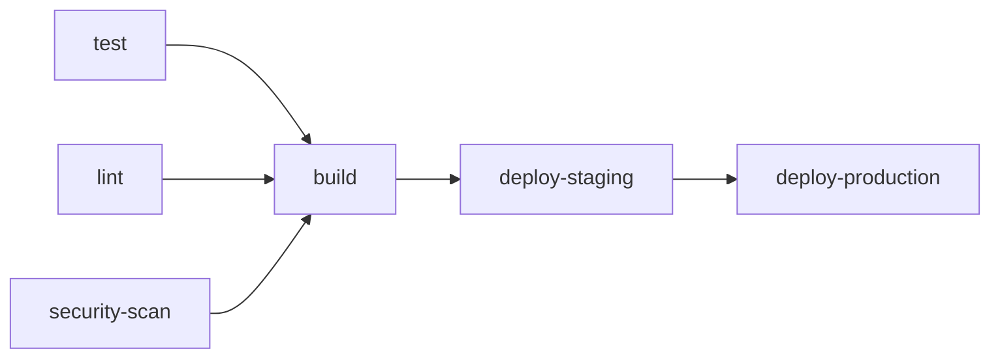

# Chapter 3 — GitHub Actions Fundamentals

## Learning Objectives

By the end of this chapter you will be able to:

- Explain the GitHub Actions architecture and how its components fit together
- Write a complete workflow file from scratch
- Use marketplace actions, shell commands, and context variables
- Configure job dependencies for parallel and sequential execution
- Cache dependencies to speed up workflows
- Pass artifacts between jobs
- Write conditional steps and jobs
- Build a complete, real-world CI/CD workflow for a Node.js application

---

## 3.1 GitHub Actions Architecture

GitHub Actions is an event-driven automation platform built into GitHub. Understanding how the pieces relate to each other makes the YAML structure obvious rather than mysterious.

```
GitHub Repository
└── .github/
    └── workflows/
        ├── ci.yml          ← Workflow 1
        └── deploy.yml      ← Workflow 2

Workflow
├── Triggered by: Event (push, pull_request, schedule, ...)
└── Jobs (run in parallel by default)
    ├── Job A
    │   ├── runs-on: ubuntu-latest   ← Runner
    │   └── Steps (run sequentially)
    │       ├── Step 1: uses an Action
    │       └── Step 2: runs a shell command
    └── Job B (needs: A → runs after A)
        └── Steps
```

**Key relationships:**
- An **event** triggers one or more **workflows**
- A **workflow** contains one or more **jobs**
- A **job** runs on a **runner** (a VM or container)
- A **job** contains one or more **steps**
- A **step** either uses a pre-built **action** or runs a shell command

---

## 3.2 Workflow File Structure

Every GitHub Actions workflow is a YAML file placed in `.github/workflows/`. The filename can be anything (it becomes the workflow's ID in URLs).

```yaml
name: My Workflow           # Display name shown in GitHub UI Actions tab

on:                         # Trigger(s) — when this workflow runs
  push:
    branches: [main]

env:                        # Workflow-level environment variables
  NODE_VERSION: '20'        # Available to all jobs and steps

jobs:
  job-id:                   # Unique identifier — kebab-case, no spaces
    name: Human-Readable Name   # Optional display name in UI
    runs-on: ubuntu-latest      # Runner type

    env:                    # Job-level env vars (override workflow-level)
      FOO: bar

    steps:
      - name: Check out code          # Step display name (optional but helpful)
        uses: actions/checkout@v4     # Use a marketplace action

      - name: Run a command
        run: echo "Hello from CI"     # Run a shell command

      - name: Multi-line command
        run: |                        # | preserves newlines — each line runs sequentially
          npm ci
          npm run lint
          npm test

      - name: Command with env var
        run: echo "Node version is $NODE_VERSION"
        env:                          # Step-level env vars (override job-level)
          NODE_VERSION: '18'
```

---

## 3.3 Runners

The `runs-on` key specifies what machine executes the job.

```yaml
runs-on: ubuntu-latest       # Ubuntu (fastest, cheapest, most common)
runs-on: ubuntu-22.04        # Pinned Ubuntu LTS version
runs-on: windows-latest      # Windows Server (for Windows-specific builds)
runs-on: macos-latest        # macOS (required for iOS/macOS builds; costs more)
runs-on: self-hosted         # Any available self-hosted runner
runs-on: [self-hosted, linux, x64]   # Self-hosted with specific label requirements
runs-on: [self-hosted, gpu]          # Self-hosted runner labeled "gpu"
```

**GitHub-hosted runner characteristics:**
- A brand-new VM is provisioned for every job run — you always start clean
- The VM is destroyed after the job completes
- GitHub-hosted runners come pre-installed with many common tools (Node.js, Python, Docker, kubectl, etc.)
- List of pre-installed software: [github.com/actions/runner-images](https://github.com/actions/runner-images)

---

## 3.4 Actions

An action is a reusable unit of work. Instead of writing shell commands from scratch, you use pre-built actions from GitHub's marketplace or from within your repository.

```yaml
steps:
  # Marketplace action: owner/repository@version
  - uses: actions/checkout@v4            # Clone your repo into the runner

  - uses: actions/setup-node@v4          # Install Node.js
    with:
      node-version: '20'
      cache: 'npm'                       # Also cache npm packages automatically

  - uses: actions/setup-python@v5        # Install Python
    with:
      python-version: '3.12'

  # Docker container action — run a command inside a container
  - uses: docker://alpine:3.19
    with:
      args: sh -c "echo running in Alpine"

  # Local action — defined in your own repository
  - uses: ./.github/actions/my-action
    with:
      my-input: 'some value'
```

**Finding actions:** Go to [github.com/marketplace?type=actions](https://github.com/marketplace?type=actions). Filter by category. Always check: star count, last updated date, whether the source code is public, and what permissions it requests.

---

## 3.5 Environment Variables and Secrets

GitHub Actions has multiple layers of variable management:

```yaml
# Workflow-level: available in all jobs and steps
env:
  API_URL: https://api.example.com

jobs:
  deploy:
    runs-on: ubuntu-latest
    
    # Job-level: overrides workflow-level vars with the same name
    env:
      LOG_LEVEL: debug

    steps:
      - name: Use a plaintext variable
        run: echo "Deploying to $API_URL"

      - name: Use a secret (set in repo Settings → Secrets)
        run: ./deploy.sh
        env:
          API_KEY: ${{ secrets.DEPLOY_API_KEY }}   # Masked in logs automatically

      - name: Use a GitHub variable (non-sensitive config)
        run: echo "Feature flag: ${{ vars.FEATURE_FLAG_X }}"

      - name: GitHub built-in context variables
        run: |
          echo "Repository:  ${{ github.repository }}"
          echo "Branch:      ${{ github.ref_name }}"
          echo "Commit SHA:  ${{ github.sha }}"
          echo "Short SHA:   ${{ github.sha && github.sha[0:7] }}"
          echo "Actor:       ${{ github.actor }}"
          echo "Event type:  ${{ github.event_name }}"
          echo "Run ID:      ${{ github.run_id }}"
          echo "Run number:  ${{ github.run_number }}"
```

### Secrets vs Variables

| | Secrets | Variables |
|--|---------|-----------|
| Sensitive? | Yes — masked in logs | No — visible in logs |
| Use for | API keys, passwords, tokens | Feature flags, URLs, config |
| Set in | Settings → Secrets and variables → Actions | Settings → Secrets and variables → Actions |
| Access | `${{ secrets.NAME }}` | `${{ vars.NAME }}` |

### The special GITHUB_TOKEN

GitHub automatically provides a `GITHUB_TOKEN` secret for every workflow run. It is a short-lived token scoped to your repository — you do not need to create it manually.

```yaml
- name: Push to GHCR
  uses: docker/login-action@v3
  with:
    registry: ghcr.io
    username: ${{ github.actor }}
    password: ${{ secrets.GITHUB_TOKEN }}   # Pre-created, no setup needed
```

---

## 3.6 Job Dependencies and Parallelism

By default, all jobs in a workflow run simultaneously (in parallel). Use `needs:` to declare dependencies.

```yaml
jobs:
  test:
    runs-on: ubuntu-latest
    steps:
      - uses: actions/checkout@v4
      - run: npm ci && npm test

  lint:
    runs-on: ubuntu-latest
    steps:
      - uses: actions/checkout@v4
      - run: npm ci && npm run lint

  security-scan:
    runs-on: ubuntu-latest
    steps:
      - uses: actions/checkout@v4
      - run: npm audit --audit-level=high

  build:
    needs: [test, lint, security-scan]   # waits for ALL three to pass
    runs-on: ubuntu-latest
    steps:
      - uses: actions/checkout@v4
      - run: docker build -t myapp .

  deploy-staging:
    needs: build
    runs-on: ubuntu-latest
    steps:
      - run: ./deploy.sh staging

  deploy-production:
    needs: deploy-staging
    runs-on: ubuntu-latest
    environment: production              # requires manual approval
    steps:
      - run: ./deploy.sh production
```

### DAG visualization



`test`, `lint`, and `security-scan` all run at the same time. `build` starts only after all three pass. This is the key pattern for fast pipelines: maximize parallelism in the early stages, sequence only what genuinely depends on something else.

---

## 3.7 Caching Dependencies

Dependency installation is the single biggest source of wasted time in CI pipelines. Caching brings a 60-second `npm ci` down to 2-3 seconds on cache hits.

```yaml
# Manual cache control
- name: Cache npm packages
  uses: actions/cache@v4
  with:
    path: ~/.npm
    key: ${{ runner.os }}-npm-${{ hashFiles('**/package-lock.json') }}
    restore-keys: |
      ${{ runner.os }}-npm-

- run: npm ci
```

How the key works:
- `${{ runner.os }}` — separates Linux, macOS, Windows caches
- `hashFiles('**/package-lock.json')` — produces a fingerprint of the lock file. If `package-lock.json` changes (new or updated dependency), the key changes and the cache misses, forcing a fresh install
- `restore-keys` — fallback keys if the exact key misses. GitHub restores the most recent cache entry whose key starts with `${{ runner.os }}-npm-`, then runs `npm ci` on top of it (which only installs the delta). This is faster than a full cold install.

### Automatic caching with setup actions

Many `setup-*` actions handle caching for you:

```yaml
- uses: actions/setup-node@v4
  with:
    node-version: '20'
    cache: 'npm'              # automatically caches ~/.npm

- uses: actions/setup-python@v5
  with:
    python-version: '3.12'
    cache: 'pip'              # automatically caches pip packages

- uses: actions/setup-java@v4
  with:
    java-version: '21'
    cache: 'maven'            # automatically caches ~/.m2
```

Prefer the built-in `cache:` option when available — it handles key generation correctly and requires less boilerplate.

---

## 3.8 Uploading and Downloading Artifacts

Artifacts let jobs share files, and let developers download outputs like test reports and coverage data.

```yaml
jobs:
  test:
    runs-on: ubuntu-latest
    steps:
      - uses: actions/checkout@v4
      - uses: actions/setup-node@v4
        with:
          node-version: '20'
          cache: 'npm'
      - run: npm ci
      - run: npm test -- --coverage

      - name: Upload test coverage report
        uses: actions/upload-artifact@v4
        if: always()                      # upload even if tests failed
        with:
          name: coverage-report
          path: coverage/
          retention-days: 14              # automatically deleted after 14 days

      - name: Upload test results (JUnit XML)
        uses: actions/upload-artifact@v4
        if: always()
        with:
          name: test-results
          path: test-results/junit.xml
          retention-days: 7

  deploy:
    needs: test
    runs-on: ubuntu-latest
    steps:
      - name: Download coverage report
        uses: actions/download-artifact@v4
        with:
          name: coverage-report
          path: ./coverage             # downloaded to this local path

      - run: ./upload-coverage-to-codecov.sh ./coverage
```

After a workflow run, artifacts appear in the GitHub Actions UI under the workflow run summary. Anyone with read access to the repository can download them.

---

## 3.9 Conditional Steps and Jobs

Not every step should run in every situation. Use `if:` expressions to control execution.

```yaml
steps:
  # Only run on pushes to main (not on PRs)
  - name: Deploy to production
    if: github.ref == 'refs/heads/main' && github.event_name == 'push'
    run: ./deploy-prod.sh

  # Run only when the workflow has already failed
  - name: Notify team on failure
    if: failure()
    run: ./notify-slack.sh "${{ github.run_id }} failed"

  # Always run (even after failures) — good for cleanup
  - name: Remove temp files
    if: always()
    run: rm -rf /tmp/ci-workspace

  # Run only when a specific file changed
  - name: Run database migrations
    if: contains(github.event.head_commit.modified, 'migrations/')
    run: ./run-migrations.sh

  # Conditional job
  deploy-staging:
    needs: build
    if: github.ref == 'refs/heads/main'   # entire job only runs on main
    runs-on: ubuntu-latest
    steps:
      - run: ./deploy.sh staging
```

### Common condition expressions

| Expression | Meaning |
|-----------|---------|
| `success()` | Previous steps/jobs succeeded (default when no `if:` is set) |
| `failure()` | A previous required step or job failed |
| `always()` | Run regardless of outcome |
| `cancelled()` | The workflow was cancelled |
| `github.ref == 'refs/heads/main'` | Current branch is main |
| `github.event_name == 'pull_request'` | Triggered by a pull request |
| `startsWith(github.ref, 'refs/tags/v')` | Triggered by a version tag |

---

## 3.10 A Complete Real-World Node.js Workflow

Here is a production-quality CI/CD workflow that combines everything from this chapter:

```yaml
name: CI/CD

on:
  push:
    branches: [main]
  pull_request:
    branches: [main]

permissions:
  contents: read          # read-only by default
  packages: write         # needed to push to GHCR

env:
  REGISTRY: ghcr.io
  IMAGE_NAME: ${{ github.repository }}

jobs:
  test:
    name: Test
    runs-on: ubuntu-latest
    steps:
      - name: Checkout code
        uses: actions/checkout@v4

      - name: Set up Node.js
        uses: actions/setup-node@v4
        with:
          node-version: '20'
          cache: 'npm'

      - name: Install dependencies
        run: npm ci

      - name: Run linter
        run: npm run lint

      - name: Run tests with coverage
        run: npm test -- --coverage --ci

      - name: Upload coverage report
        uses: actions/upload-artifact@v4
        if: always()
        with:
          name: coverage-report
          path: coverage/
          retention-days: 7

  build:
    name: Build Docker Image
    needs: test
    runs-on: ubuntu-latest
    steps:
      - name: Checkout code
        uses: actions/checkout@v4

      - name: Set up Docker Buildx
        uses: docker/setup-buildx-action@v3

      - name: Log in to GitHub Container Registry
        uses: docker/login-action@v3
        with:
          registry: ${{ env.REGISTRY }}
          username: ${{ github.actor }}
          password: ${{ secrets.GITHUB_TOKEN }}

      - name: Extract metadata for Docker
        id: meta
        uses: docker/metadata-action@v5
        with:
          images: ${{ env.REGISTRY }}/${{ env.IMAGE_NAME }}
          tags: |
            type=sha,format=long
            type=ref,event=branch
            type=semver,pattern={{version}}

      - name: Build and push
        uses: docker/build-push-action@v5
        with:
          context: .
          push: ${{ github.ref == 'refs/heads/main' }}   # push only from main
          tags: ${{ steps.meta.outputs.tags }}
          labels: ${{ steps.meta.outputs.labels }}
          cache-from: type=gha              # use GitHub Actions cache for Docker layers
          cache-to: type=gha,mode=max

  deploy-staging:
    name: Deploy to Staging
    needs: build
    runs-on: ubuntu-latest
    if: github.ref == 'refs/heads/main'
    environment: staging                    # optional: configure protection rules
    steps:
      - name: Checkout code
        uses: actions/checkout@v4

      - name: Deploy
        run: ./scripts/deploy.sh staging ${{ github.sha }}
        env:
          DEPLOY_TOKEN: ${{ secrets.STAGING_DEPLOY_TOKEN }}
```

### What this workflow does

1. **On every push to main and every PR**: runs linting and tests, uploads coverage report as an artifact
2. **After tests pass**: builds a Docker image using Buildx (with layer caching)
3. **Only on pushes to main**: pushes the image to GHCR tagged with the git SHA
4. **Only on pushes to main**: deploys to the staging environment

PRs get full test feedback but never deploy or push images. The main branch gets the full pipeline including deployment. This is the standard pattern for team workflows.

---

## Summary

- Workflows are YAML files in `.github/workflows/` that are triggered by events
- Jobs run in parallel by default; `needs:` creates sequential dependencies
- Actions are reusable steps from the marketplace or your own repo
- `${{ secrets.NAME }}` accesses secrets; `${{ github.sha }}` accesses context variables
- Cache dependency directories with `actions/cache@v4` or the `cache:` option in setup actions
- Upload build outputs and test reports with `actions/upload-artifact@v4`
- Use `if:` conditions to limit expensive steps (deploys, pushes) to the right branches and events
- `GITHUB_TOKEN` is automatically provided — no manual setup needed for pushing to GHCR

---

## Knowledge Check

1. What is the difference between `uses:` and `run:` in a step?
2. A workflow has jobs A, B, C. B has `needs: A` and C has `needs: A`. Draw the execution order.
3. Why should you use `${{ secrets.GITHUB_TOKEN }}` instead of a personal access token for pushing to GHCR?
4. What does `hashFiles('**/package-lock.json')` do in a cache key, and why is it important?
5. Why do we add `if: always()` to the artifact upload step in the test job?

---

## Hands-On Exercise

Create a complete GitHub Actions workflow for your own project (or fork a public repository). The workflow must:

1. Run on every pull request targeting `main` and every push to `main`
2. Check out the code and install dependencies (with caching)
3. Run the test suite and upload the test results as an artifact (with `if: always()`)
4. Build a Docker image — but only push it when running on `main` (not on PRs)
5. In the GitHub Actions UI: verify the dependency graph renders correctly, download the test artifact, and confirm the Docker push step was skipped on a PR run

Confirm you understand each decision by adding a comment (`# explanation`) above any non-obvious line.

---

<div style="display:flex;justify-content:space-between;align-items:center;">
  <a href="./02-core-concepts.md">← Previous: Core Concepts & Architecture</a>
  <a href="./00-index.md">🏠 Index</a>
  <a href="./04-github-actions-advanced.md">Next: GitHub Actions Advanced →</a>
</div>
