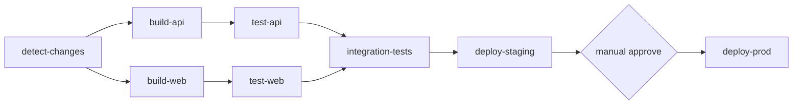

# Chapter 11 — Intermediate Concepts

## Learning Objectives

By the end of this chapter, you will be able to:

- Implement effective caching strategies to dramatically reduce pipeline runtime
- Pass data between jobs using job outputs
- Generate dynamic matrix builds from runtime logic
- Structure CI pipelines for monorepos with path-based change detection
- Send notifications and post build status reports to PRs and Slack
- Optimize pipeline performance with a systematic checklist
- Trigger workflows on a schedule or manually with custom inputs

---

## 11.1 Pipeline Caching Strategies

Caching is the single biggest lever for reducing pipeline runtime. A cold npm install can take 90 seconds; a cache hit takes 3 seconds. The investment in setting up caching correctly pays back on every single run.

**Built-in caching via setup actions:**

```yaml
# npm — cache by lockfile hash
- uses: actions/setup-node@v4
  with:
    node-version: '20'
    cache: npm                # built-in, uses package-lock.json hash

# pip
- uses: actions/setup-python@v5
  with:
    python-version: '3.11'
    cache: pip                # built-in, uses requirements*.txt hash
```

**Manual cache with custom keys:**

```yaml
- uses: actions/cache@v4
  with:
    path: |
      ~/.npm
      ~/.cache/Cypress
    key: ${{ runner.os }}-npm-${{ hashFiles('**/package-lock.json') }}
    restore-keys: |
      ${{ runner.os }}-npm-
```

The `restore-keys` fallback allows a partial cache hit when the lockfile changes — better than a cold cache.

**Go modules:**

```yaml
- uses: actions/cache@v4
  with:
    path: |
      ~/go/pkg/mod
      ~/.cache/go-build
    key: ${{ runner.os }}-go-${{ hashFiles('**/go.sum') }}
    restore-keys: |
      ${{ runner.os }}-go-
```

**Docker layer caching via GitHub Actions cache:**

```yaml
- uses: docker/build-push-action@v5
  with:
    cache-from: type=gha
    cache-to: type=gha,mode=max
```

`mode=max` caches all intermediate layers, not just the final image — maximizes hit rate at the cost of more cache storage.

**Cache invalidation rule:** The cache key includes a hash of the dependency file. When `package-lock.json` changes (a dependency was added or updated), the key changes, a new cache is written, and the old one expires after 7 days of disuse.

---

## 11.2 Job Outputs — Passing Data Between Jobs

Jobs run in separate virtual machines and cannot share environment variables directly. Job outputs are the mechanism for passing values downstream.

```yaml
jobs:
  generate-version:
    runs-on: ubuntu-latest
    outputs:
      version: ${{ steps.version.outputs.version }}
      sha: ${{ steps.sha.outputs.sha }}
    steps:
      - id: version
        run: echo "version=$(cat VERSION)" >> $GITHUB_OUTPUT
      - id: sha
        run: echo "sha=${GITHUB_SHA::8}" >> $GITHUB_OUTPUT

  build:
    needs: generate-version
    runs-on: ubuntu-latest
    steps:
      - run: |
          echo "Building version ${{ needs.generate-version.outputs.version }}"
          docker build -t myapp:${{ needs.generate-version.outputs.sha }} .

  deploy:
    needs: [generate-version, build]
    runs-on: ubuntu-latest
    steps:
      - run: |
          echo "Deploying ${{ needs.generate-version.outputs.version }}"
          ./deploy.sh --tag ${{ needs.generate-version.outputs.sha }}
```

**Pattern:** One upstream job computes a value (version string, image tag, list of changed services), exposes it as an output, and all downstream jobs consume it via `needs.<job-id>.outputs.<output-name>`.

---

## 11.3 Dynamic Matrix Generation

Static matrices are defined in YAML. Dynamic matrices are computed at runtime — useful when the set of services, environments, or test shards is not known ahead of time.

```yaml
jobs:
  generate-matrix:
    runs-on: ubuntu-latest
    outputs:
      matrix: ${{ steps.set-matrix.outputs.matrix }}
    steps:
      - uses: actions/checkout@v4
        with:
          fetch-depth: 2        # need parent commit to diff against
      - id: set-matrix
        run: |
          # Build list of services with changed files
          SERVICES=$(git diff --name-only HEAD~1 \
            | grep '^services/' \
            | cut -d/ -f2 \
            | sort -u \
            | jq -Rc '[.]' \
            | jq -sc add)
          echo "matrix={\"service\":$SERVICES}" >> $GITHUB_OUTPUT

  build:
    needs: generate-matrix
    runs-on: ubuntu-latest
    strategy:
      matrix: ${{ fromJSON(needs.generate-matrix.outputs.matrix) }}
    steps:
      - uses: actions/checkout@v4
      - run: docker build services/${{ matrix.service }}
```

If no services changed (empty matrix), the `build` job is skipped. If three services changed, three parallel `build` jobs run — one per service.

**Guard against empty matrix:** An empty matrix causes a workflow error. Add a fallback:

```yaml
- id: set-matrix
  run: |
    SERVICES=$(...)
    if [ -z "$SERVICES" ] || [ "$SERVICES" = "[]" ]; then
      echo "matrix={\"service\":[\"none\"]}" >> $GITHUB_OUTPUT
    else
      echo "matrix={\"service\":$SERVICES}" >> $GITHUB_OUTPUT
    fi
```

---

## 11.4 Monorepo CI Strategies

Monorepos contain multiple services or packages in a single repository. Running the full pipeline on every commit is wasteful — if only the `api` package changed, there is no reason to rebuild and redeploy the `web` package.

**Path-based triggers (coarse-grained):**

```yaml
on:
  push:
    paths:
      - 'packages/api/**'
      - 'packages/shared/**'
```

This approach is simple but limited: a single workflow file can only trigger on one set of paths.

**Per-job change detection (fine-grained):**

```yaml
jobs:
  detect-changes:
    runs-on: ubuntu-latest
    outputs:
      api: ${{ steps.changes.outputs.api }}
      web: ${{ steps.changes.outputs.web }}
      infra: ${{ steps.changes.outputs.infra }}
    steps:
      - uses: actions/checkout@v4
      - uses: dorny/paths-filter@v3
        id: changes
        with:
          filters: |
            api:
              - 'packages/api/**'
              - 'packages/shared/**'
            web:
              - 'packages/web/**'
              - 'packages/shared/**'
            infra:
              - 'infra/**'

  build-api:
    needs: detect-changes
    if: needs.detect-changes.outputs.api == 'true'
    runs-on: ubuntu-latest
    steps:
      - uses: actions/checkout@v4
      - run: cd packages/api && docker build .

  build-web:
    needs: detect-changes
    if: needs.detect-changes.outputs.web == 'true'
    runs-on: ubuntu-latest
    steps:
      - uses: actions/checkout@v4
      - run: cd packages/web && npm run build

  deploy-infra:
    needs: detect-changes
    if: needs.detect-changes.outputs.infra == 'true'
    runs-on: ubuntu-latest
    steps:
      - uses: actions/checkout@v4
      - run: cd infra && terraform apply -auto-approve
```

Note that `packages/shared/**` is included in both `api` and `web` filters — a change to shared code triggers both downstream pipelines.

---

## 11.5 Workflow Visualization with Mermaid

Complex pipelines with many interdependencies are hard to reason about from YAML alone. Mermaid diagrams make the execution graph clear.



GitHub renders Mermaid diagrams natively in Markdown files. Adding a diagram to your workflow documentation helps new team members understand the pipeline at a glance.

**Reading the graph:** `detect-changes` runs first, its outputs fan out to `build-api` and `build-web` in parallel, their test jobs both feed `integration-tests`, which gates the staging deployment, which in turn requires manual approval before production.

---

## 11.6 Notifications and Reporting

Pipelines that fail silently are worse than no pipeline at all. Good notification practices close the feedback loop immediately.

**Slack notification on failure:**

```yaml
- name: Slack notification
  if: failure()
  uses: slackapi/slack-github-action@v1.27.0
  with:
    payload: |
      {
        "text": "Pipeline failed: ${{ github.repository }} (${{ github.ref_name }})",
        "blocks": [{
          "type": "section",
          "text": {
            "type": "mrkdwn",
            "text": "*Pipeline Failed*\n*Repo:* ${{ github.repository }}\n*Branch:* ${{ github.ref_name }}\n*Commit:* ${{ github.sha }}\n*By:* ${{ github.actor }}\n<${{ github.server_url }}/${{ github.repository }}/actions/runs/${{ github.run_id }}|View Run>"
          }
        }]
      }
  env:
    SLACK_WEBHOOK_URL: ${{ secrets.SLACK_WEBHOOK_URL }}
```

**PR comment with build status:**

```yaml
- uses: actions/github-script@v7
  if: github.event_name == 'pull_request'
  with:
    script: |
      const { data: comments } = await github.rest.issues.listComments({
        owner: context.repo.owner,
        repo: context.repo.repo,
        issue_number: context.issue.number,
      });
      const botComment = comments.find(
        c => c.user.type === 'Bot' && c.body.includes('CI Status')
      );
      const body = `## CI Status\n\nImage: \`ghcr.io/${{ github.repository }}:${{ github.sha }}\`\n\nAll tests passed.`;
      if (botComment) {
        await github.rest.issues.updateComment({
          ...context.repo,
          comment_id: botComment.id,
          body
        });
      } else {
        await github.rest.issues.createComment({
          ...context.repo,
          issue_number: context.issue.number,
          body
        });
      }
```

The script checks for an existing bot comment and updates it rather than posting a new comment on every push — keeps the PR thread clean.

---

## 11.7 Pipeline Performance Optimization

Use this checklist when a pipeline feels slow:

```
Cache dependencies
  - npm, pip, Go modules, Maven, Gradle
  - saves 60-90 seconds per job on typical projects

Parallelize independent jobs
  - lint, type-check, unit tests, and security scans can all run simultaneously
  - do not chain them sequentially unless one truly depends on another

Use path filters
  - do not rebuild the docs site when only backend code changed
  - dorny/paths-filter or native paths: triggers

Cancel in-progress runs on new push
  - concurrency:
      group: ${{ github.ref }}
      cancel-in-progress: true
  - stops wasted runner time when a developer pushes a fix immediately after a broken commit

Docker BuildKit GHA cache
  - cache-from: type=gha / cache-to: type=gha,mode=max
  - dramatically reduces image build time after the first run

Shard test suites across matrix runners
  - split tests into N shards, run each shard in a parallel matrix job
  - halves test time with 2 shards, thirds it with 3, etc.

Skip jobs with if: conditions
  - do not run deploy jobs on PRs to feature branches
  - if: github.ref == 'refs/heads/main' && github.event_name == 'push'

Self-hosted runners for heavy builds
  - 3-5x faster than GitHub-hosted for CPU-intensive or memory-intensive builds
  - no queue time during peak hours
  - use spot/preemptible instances to control cost
```

**Concurrency example:**

```yaml
concurrency:
  group: ${{ github.workflow }}-${{ github.ref }}
  cancel-in-progress: true
```

---

## 11.8 Scheduled and Manual Workflows

Not all workflows are triggered by code changes. Scheduled workflows handle recurring tasks (dependency audits, database backups, health checks). Manual workflows handle on-demand operations (hotfix deploys, data migrations).

```yaml
on:
  schedule:
    - cron: '0 1 * * *'        # daily at 1am UTC — dependency audit
    - cron: '0 */6 * * *'      # every 6 hours — health check
  workflow_dispatch:            # enables Run workflow button in UI
    inputs:
      environment:
        type: choice
        description: Deployment target
        options: [staging, production]
        required: true
      dry-run:
        type: boolean
        description: Dry run (no actual deployment)
        default: false
      reason:
        type: string
        description: Reason for manual deployment (for audit log)
        required: false

jobs:
  deploy:
    runs-on: ubuntu-latest
    steps:
      - uses: actions/checkout@v4
      - run: |
          echo "Deploying to ${{ inputs.environment }}"
          echo "Triggered by: ${{ github.actor }}"
          echo "Reason: ${{ inputs.reason }}"
          if [ "${{ inputs.dry-run }}" = "true" ]; then
            echo "DRY RUN: would deploy to ${{ inputs.environment }}"
          else
            ./deploy.sh ${{ inputs.environment }}
          fi
```

**Cron syntax reference:**

```
┌─ minute (0-59)
│  ┌─ hour (0-23)
│  │  ┌─ day of month (1-31)
│  │  │  ┌─ month (1-12)
│  │  │  │  ┌─ day of week (0-6, Sunday=0)
│  │  │  │  │
0  1  *  *  *   → daily at 01:00 UTC
0  */6 * *  *   → every 6 hours
0  9  *  *  1   → every Monday at 09:00 UTC
0  0  1  *  *   → first of every month at midnight
```

GitHub Actions uses UTC for all scheduled cron times. Scheduled workflows do not run on forks.

---

## Summary

| Topic | Key Takeaway |
|---|---|
| Caching | Hash-based keys on lockfiles; fallback restore-keys for partial hits |
| Job outputs | `$GITHUB_OUTPUT` to pass values; `needs.<job>.outputs.<name>` to consume |
| Dynamic matrix | Generate matrix JSON at runtime from git diff or API call |
| Monorepo CI | `dorny/paths-filter` for per-job change detection; include shared deps in filters |
| Notifications | Slack on failure; updateComment to keep PRs clean |
| Performance | Cache, parallelize, cancel-in-progress, path filters, sharded tests |
| Scheduled/manual | `schedule` cron + `workflow_dispatch` with typed inputs |

---

## Knowledge Check

1. Why does the `restore-keys` fallback in `actions/cache` exist, and when does it activate?
2. What is `$GITHUB_OUTPUT` and how does it differ from a regular environment variable?
3. A monorepo has `packages/api` and `packages/shared`. If a file in `packages/shared` changes, which downstream jobs should rebuild and why?
4. What does `cancel-in-progress: true` do and what problem does it solve?
5. A scheduled workflow is configured to run at `0 2 * * *`. A developer pushes a commit at 1:58 AM. Does the push trigger the scheduled run?

---

## Hands-on Exercise

**Goal:** Build a monorepo CI pipeline with smart change detection and inter-job data passing.

**Steps:**

1. Create a monorepo structure with two packages: `packages/api` and `packages/web`, each with a `Dockerfile`
2. Implement a `detect-changes` job using `dorny/paths-filter` that outputs `api` and `web` boolean flags
3. Add a `generate-version` job that reads a `VERSION` file and exposes it as a job output
4. Create `build-api` and `build-web` jobs that:
   - Only run when the corresponding change flag is `true`
   - Consume the version output from `generate-version` to tag the built image
5. Add a `notify` job with `if: always()` that posts a Slack message (or logs to the console) indicating which services were rebuilt
6. Verify by making changes to only one package — confirm the other package's build job is skipped

---

<div style="display:flex;justify-content:space-between;align-items:center;">
  <a href="10-secrets-management.md">← Previous: Secrets Management</a>
  <a href="./00-index.md">🏠 Index</a>
  <a href="12-advanced-concepts.md">Next: Advanced Concepts →</a>
</div>
