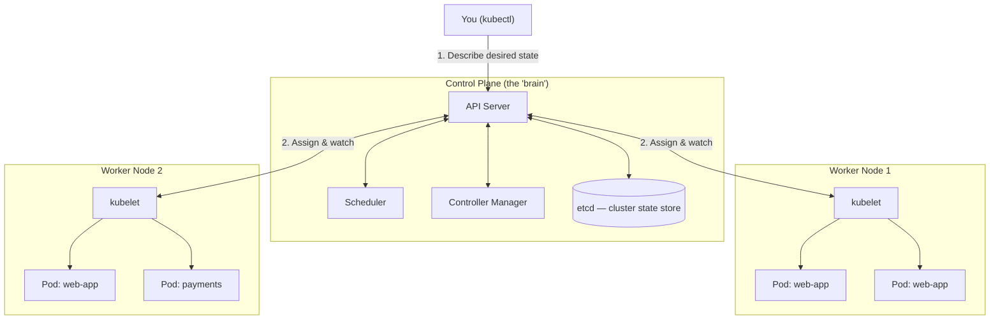

# Chapter 1 — Introduction to Kubernetes

## Learning Objectives

By the end of this chapter you will be able to:

- Explain the "container orchestration problem" and why a single Docker host is not enough for production
- Describe Kubernetes' origin (Borg → open source → CNCF) and its release cadence
- Define Kubernetes accurately, including what it is and what it deliberately is not
- Sketch the high-level architecture of a Kubernetes cluster (control plane vs worker nodes)
- Compare Kubernetes to alternative orchestrators and explain why it became the industry standard
- Use core Kubernetes vocabulary (Cluster, Node, Pod, Control Plane, kubelet, Namespace, Deployment, Service) correctly in conversation

---

## Prerequisites for This Chapter

- **Docker (Topic 4)** — you should be comfortable with images, containers, `docker run`, port mapping, and container networking basics. This chapter assumes you already know what a container is and does not re-explain it.
- **Networking Basics (Topic 2)** — familiarity with IP addresses, DNS, and load balancing concepts is helpful for the terminology glossary later in this chapter, though it will be covered again in depth in Chapter 6.
- No prior Kubernetes knowledge is assumed. This is the first chapter of the course.

---

## 1.1 The Container Orchestration Problem

Imagine you run an e-commerce site. You containerized it with Docker back in Topic 4 — your checkout service, product catalog, and payment gateway each run as a container on a single EC2 instance. For months, this works fine. Traffic is predictable, and when something breaks, you SSH in, run `docker restart`, and move on with your day.

Then Black Friday arrives.

**6:00 AM** — Traffic starts climbing as your flash sale goes live. Your single Docker host is running at 95% CPU. There is no second machine to spread the load onto, and nothing to add one automatically.

**6:45 AM** — The catalog service container OOM-kills itself under load. Nobody notices for eleven minutes because nothing is watching it. Customers see a blank product page and leave.

**7:30 AM** — You need to ship a hotfix to the checkout service. You `docker stop` the old container and `docker run` the new one. For the four seconds in between, every checkout request fails. On your highest-traffic day of the year.

**9:00 AM** — The host itself needs more RAM. The only way to "scale" is to stop everything, resize the EC2 instance, and start it all again — with your entire site down for the maintenance window.

**11:00 AM** — You want to run three replicas of the checkout service to handle load, but now you need to manually track which replica is on which port, configure a load balancer by hand, and update it every time a replica dies and gets replaced.

None of this is a Docker problem — Docker did exactly what it promised: it packaged your application into a portable, isolated unit. But Docker's job stops at "run one container on one machine." It has no concept of a *fleet* of machines, no idea that a container should be restarted after it crashes, no built-in way to shift traffic away from an unhealthy instance, and no mechanism for coordinating a zero-downtime rollout across replicas.

This gap has a name: **container orchestration**. An orchestrator is the layer above the container runtime that answers questions like:

- If a container dies, who restarts it — and where?
- If a machine dies, who reschedules its containers onto healthy machines?
- How do I deploy a new version with zero downtime, and roll back instantly if it's broken?
- How do I automatically add more replicas when traffic increases, and scale back down when it drops?
- How do containers find and talk to each other reliably, even as they are created and destroyed?
- How do I roll this out consistently across dev, staging, and production?

Kubernetes is the industry's answer to every one of these questions.

```
Single Docker Host                        Kubernetes Cluster
───────────────────────                   ──────────────────────────────
One machine, one point of failure    →    Many machines, no single point of failure
Manual restart on crash              →    Automatic self-healing
Manual, unsafe rolling deploys       →    Automated, zero-downtime rolling updates
No autoscaling                       →    Automatic horizontal scaling under load
Hand-configured load balancing       →    Built-in Service discovery & load balancing
"Which port is replica 3 on?"        →    Declarative desired state, K8s tracks it
```

---

## 1.2 A Brief History: From Borg to CNCF

Kubernetes did not appear from nowhere — it is the public descendant of over a decade of internal infrastructure work at Google.

| Year | Event |
|------|-------|
| ~2003–2004 | Google builds **Borg**, an internal cluster management system that runs virtually all of Google's workloads (Search, Gmail, etc.) across hundreds of thousands of machines |
| 2013 | Google engineers begin designing a new, simpler system inspired by Borg's lessons, intended for the outside world |
| June 2014 | **Kubernetes** (Greek for "helmsman" or "pilot" — hence the ship's-wheel logo, and the abbreviation **K8s**, "K, 8 letters, s") is open-sourced by Google |
| July 2015 | Kubernetes 1.0 ships; Google donates it to the newly formed **Cloud Native Computing Foundation (CNCF)**, under the Linux Foundation |
| 2015–2017 | The "orchestration wars" play out between Kubernetes, Docker Swarm, and Apache Mesos |
| 2017–2018 | Docker Inc., AWS, and other major vendors all announce native Kubernetes support; Kubernetes becomes the de facto standard |
| Today | Kubernetes is the most widely adopted container orchestrator in the world, and the CNCF's flagship graduated project |

Two things about that history matter for how you should think about Kubernetes today:

1. **It is battle-tested design, not a startup experiment.** The architecture patterns you'll learn in Chapter 2 — a central API server, a distributed reconciliation loop, declarative desired state — are the distilled result of running enormous, heterogeneous workloads reliably for two decades at Google, later generalized for everyone else.
2. **It is vendor-neutral by governance.** Because Kubernetes lives under the CNCF rather than inside one company, no single vendor controls its roadmap. This is a major reason cloud providers who compete fiercely elsewhere (AWS, Google Cloud, Microsoft Azure) all offer first-class managed Kubernetes.

**Release cadence.** Kubernetes ships a new minor version roughly every four months (three releases per year), following a predictable numbering scheme: `1.29`, `1.30`, `1.31`, and so on. Each minor version is supported (patched for bugs and security issues) for about 14 months. This matters practically: if you run a managed cluster (EKS, GKE, AKS), you cannot ignore versions forever — cloud providers deprecate old versions and will eventually force an upgrade. Staying within 2-3 minor versions of current is a common production policy.

---

## 1.3 What Kubernetes Actually Is

**Kubernetes is a declarative, self-healing platform for running and managing containerized applications across a cluster of machines.**

Unpacking that definition piece by piece:

**Declarative.** You do not tell Kubernetes *how* to do something step by step. You tell it *what you want the end state to look like*, and Kubernetes continuously works to make reality match that description. If you say "I want 3 replicas of this container running," Kubernetes doesn't just create 3 replicas once — it watches, forever, and if one crashes, it creates a replacement without you asking again. This "desired state vs. actual state" idea is the single most important mental model in this entire course, and Chapter 2 explains the mechanism (the reconciliation loop) that makes it work.

**Self-healing.** Because Kubernetes is always comparing desired state to actual state, failures are corrected automatically. A container crashes — restarted. A whole machine dies — its workloads are rescheduled elsewhere. A container fails a health check — traffic is routed away from it. You do not get paged at 3 AM to manually restart a process; the system already did it.

**A platform for containerized applications across a cluster of machines.** Kubernetes takes a pool of machines (physical or virtual, on-premises or in the cloud) and presents them to you as a single logical unit. You stop thinking "which specific server should this run on?" and start thinking "this cluster needs to run these workloads" — Kubernetes handles the placement.

A useful analogy: if Docker is the shipping container (a standard, portable unit for your cargo), Kubernetes is the entire global shipping *network* — the ports, cranes, ships, and dispatch systems that decide which container goes on which ship, reroute cargo when a port closes, and load-balance traffic across multiple routes.

---

## 1.4 What Kubernetes Is NOT

Understanding the boundaries of Kubernetes is just as important as understanding what it does, because misplaced expectations are a leading cause of frustration for newcomers.

- **Kubernetes is not a Platform-as-a-Service (PaaS).** Compare it to Heroku: with Heroku, you `git push` and Heroku figures out the build, the runtime, the routing, the TLS certificates, and the scaling — with almost no configuration. Kubernetes gives you the *primitives* to build something like that (and tools such as OpenShift or Knative build PaaS-like layers on top of it), but out of the box, Kubernetes requires you to explicitly define images, resource limits, networking, and scaling rules. It is a toolkit, not a turnkey product.
- **Kubernetes is not a CI/CD tool.** It does not check out your source code, run your tests, or build your artifacts. CI/CD pipelines (Topic 5 of this course) build and push images to a registry; Kubernetes' job starts *after* that, pulling and running the finished image.
- **Kubernetes does not build container images.** There is no `kubectl build`. You still use `docker build`, Buildpacks, or a CI system to produce an OCI-compliant image and push it to a registry — Kubernetes only ever consumes finished images.
- **Kubernetes does not replace Docker for image building.** This point trips people up because of a related but separate fact: as of Kubernetes 1.24 (2022), Kubernetes stopped using the Docker Engine *directly* to run containers on nodes (a component called "dockershim" was removed). This is purely an internal implementation detail about which low-level runtime executes containers — Kubernetes now talks to runtimes like **containerd** or **CRI-O** directly. It has zero effect on you as a developer: your Dockerfiles, `docker build` workflow, and OCI images all continue to work completely unchanged, because Kubernetes and Docker both speak the same open **OCI (Open Container Initiative)** image format. Chapter 2 explains this runtime relationship in full.

In short: Docker (or an OCI-compliant builder) creates the box; Kubernetes decides where the box goes, keeps it running, and replaces it if it breaks.

---

## 1.5 Architecture at a Glance

This is intentionally a simplified orientation map — full architectural depth, including every control plane and node component, is Chapter 2. For now, just build the mental skeleton.

A Kubernetes **cluster** is made up of two categories of machines:



Two categories, one job each:

- **Control Plane** — the decision-making brain of the cluster. It receives your requests ("run 3 replicas of this app"), stores the desired state, decides which machine each workload should run on, and continuously watches for drift from that desired state. In production, the control plane usually runs on its own dedicated machines, separate from your application workloads.
- **Worker Nodes** — the machines that actually run your application containers, wrapped inside Kubernetes' smallest deployable unit, the **Pod**. Each worker node runs an agent (`kubelet`) that takes instructions from the control plane and makes sure the right containers are running locally.

You, as a user, almost never touch machines directly. You describe what you want using `kubectl` (the Kubernetes CLI) and YAML manifests, submit that description to the control plane, and the cluster does the rest.

---

## 1.6 Kubernetes vs. the Alternatives

Kubernetes was not the only orchestrator in the running. Here is how it compares to the other serious contenders, including two that are still used today in specific niches.

| Tool | Origin | Complexity | Ecosystem | Best Fit Today |
|------|--------|-----------|-----------|-----------------|
| **Kubernetes** | Google / CNCF | High — steep learning curve, huge feature surface | Enormous — Helm, Prometheus, Istio, ArgoCD, every major cloud offers managed K8s | De facto standard; microservices, multi-cloud, any serious production scale |
| **Docker Swarm** | Docker Inc. | Low — simplest to learn, native `docker` CLI extensions | Small, largely stagnant since ~2018 | Small teams, simple deployments, fast prototyping |
| **HashiCorp Nomad** | HashiCorp | Medium — simpler than K8s, single binary | Growing, integrates with Consul/Vault | Mixed workloads (containers + non-containerized batch/VM jobs), teams already in the HashiCorp stack |
| **AWS ECS** | AWS | Low-Medium — AWS-native, no cluster to manage (with Fargate) | AWS-only, deep AWS service integration | Teams fully committed to AWS wanting less operational overhead than K8s |

**Why Kubernetes won the "orchestration wars":**

1. **Ecosystem gravity.** Once a critical mass of tools (Helm for packaging, Prometheus for monitoring, Istio for service mesh, ArgoCD for GitOps, cert-manager for TLS) standardized on Kubernetes as their target platform, choosing anything else meant losing access to that entire tooling universe.
2. **Universal cloud vendor support.** Every major cloud provider offers a managed Kubernetes control plane — **EKS** (AWS), **GKE** (Google Cloud), **AKS** (Azure). This means the skills and manifests you learn are portable across clouds, which is a powerful hedge against vendor lock-in and a major reason enterprises standardized on it.
3. **CNCF neutrality.** As discussed in section 1.2, no single company controls Kubernetes' direction, which made it politically safe for competing vendors to invest in it jointly.
4. **API extensibility.** Kubernetes' API can be extended with Custom Resource Definitions (CRDs), letting the ecosystem build entirely new capabilities (databases-as-Kubernetes-objects, service meshes, serverless frameworks) without forking Kubernetes itself. This is covered in Topic 9, Advanced Kubernetes.

Docker Swarm remains genuinely easier for very small deployments, and Nomad is a legitimate choice for organizations with mixed containerized/non-containerized workloads — but for anything resembling "production at scale with a team," Kubernetes is now the default assumption in job postings, cloud documentation, and open-source tooling.

---

## 1.7 Core Terminology Glossary

You will meet every one of these terms in depth in later chapters. This table exists so that when they show up early, they aren't jarring — treat it as a vocabulary preview, not something to memorize deeply yet.

| Term | One-Line Definition |
|------|---------------------|
| **Cluster** | A set of machines (nodes) managed together as a single Kubernetes environment |
| **Node** | A single machine (physical or virtual) in the cluster — either a control plane node or a worker node |
| **Pod** | The smallest deployable unit in Kubernetes; one or more tightly-coupled containers that share network and storage |
| **Control Plane** | The set of components that make global decisions about the cluster (scheduling, scaling, responding to events) |
| **kubelet** | The agent running on every worker node that ensures the containers described for that node are actually running |
| **Namespace** | A virtual sub-division of a cluster used to organize and isolate groups of resources (e.g., `dev`, `staging`, `prod`) |
| **Deployment** | A higher-level object that manages a set of identical Pods, handling replication and rolling updates |
| **Service** | A stable network endpoint that load-balances traffic to a dynamic set of Pods |

---

## 1.8 Real-World Scenario: A SaaS Company on Kubernetes

Consider a mid-size SaaS company — call it "Notionly," a project-management tool with around 40 engineers. Their production stack looks like this:

- **~25 microservices** — auth, billing, notifications, search, the core project API, a websocket service for live collaboration, and more — each one its own container image, each deployed independently.
- **Three environments per service** — `dev`, `staging`, and `production` — implemented as separate Kubernetes **Namespaces**, so the same cluster (or a small set of clusters) can safely host isolated copies of the entire stack without services from different environments colliding.
- **Autoscaling under load** — during business hours in North America and Europe, traffic to the core API roughly triples. Rather than provisioning for peak load 24/7, Notionly uses the Horizontal Pod Autoscaler (Chapter 14) to automatically add Pods when CPU usage climbs, and scale back down overnight, saving significant infrastructure cost.
- **Zero-downtime deploys, dozens of times a day.** Each engineering team ships independently. When the billing team merges a change, a CI/CD pipeline builds a new image and applies an updated Deployment manifest; Kubernetes performs a rolling update, gradually replacing old Pods with new ones while continuously health-checking, so customers never see a dropped request.
- **Self-healing on infrastructure failure.** When an underlying cloud VM is reclaimed or fails (which happens routinely at this scale), the Pods that were running on it are automatically rescheduled onto healthy nodes within seconds — no on-call engineer needs to intervene for routine hardware failure.
- **A managed control plane.** Notionly doesn't run its own control plane machines — they use a managed offering (e.g., EKS) so AWS handles control plane upgrades, etcd backups, and high availability, and Notionly's platform team focuses on the application layer instead of babysitting Kubernetes internals.

Every concept in that description — Namespaces, Deployments, autoscaling, self-healing, rolling updates, managed control planes — is something you will be able to configure yourself by the end of this course. This chapter's job was only to give you the map; the rest of the course fills in the terrain.

---

## Best Practices

- Learn the vocabulary before the syntax — a surprising amount of early Kubernetes confusion comes from not knowing what a term refers to, not from the YAML itself.
- Think in terms of "desired state," not "steps to run." If you catch yourself planning a sequence of manual actions, you are probably fighting the platform rather than using it.
- When comparing Kubernetes to alternatives for a real decision, weigh operational complexity honestly — Kubernetes' power comes with a genuine learning curve and operational overhead, especially if you self-manage the control plane.
- Prefer managed Kubernetes offerings (EKS/GKE/AKS) for production unless you have a specific, well-understood reason to self-host the control plane.
- Keep track of your cluster's Kubernetes version and its support window; do not let a managed cluster drift onto an unsupported version.

## Common Mistakes

- Assuming Kubernetes replaces Docker entirely — you still build images with Docker (or another OCI builder); Kubernetes only runs them.
- Expecting PaaS-like simplicity out of the box — Kubernetes is a toolkit, and the "batteries" (ingress controllers, autoscaling policies, CI/CD integration) must be assembled deliberately.
- Treating Kubernetes as "just a bigger Docker Compose" — the declarative, self-healing reconciliation model (Chapter 2) is a fundamentally different operating philosophy, not just more YAML.
- Jumping straight to writing manifests without understanding the architecture — this reliably leads to confusing debugging sessions later, because you won't know which component is responsible for what.

---

## Summary

A single Docker host breaks down under real production demands: no automatic recovery from crashes, no zero-downtime deploys, no autoscaling, and no built-in load balancing across machines. Kubernetes, born from Google's internal Borg system and open-sourced in 2014 under the CNCF, solves this by providing a declarative, self-healing platform that manages containers across a cluster of machines. It is not a PaaS, not a CI/CD tool, and does not build images — it consumes OCI images produced elsewhere and focuses purely on running and managing them reliably. Its architecture splits cleanly into a control plane (the decision-making brain) and worker nodes (where your Pods actually run). Despite competition from Docker Swarm, Nomad, and cloud-native services like ECS, Kubernetes became the industry standard due to its ecosystem, universal cloud support, and vendor-neutral governance. You now have the vocabulary and the map — Chapter 2 opens the hood.

---

## Knowledge Check

1. Describe three specific problems that occur when you try to run a production workload on a single Docker host without an orchestrator.
2. What was Borg, and what is its relationship to Kubernetes?
3. In your own words, explain what "declarative, desired-state" management means, using an example that isn't from this chapter.
4. Name two things Kubernetes deliberately does NOT do, and explain what tool or process fills that gap instead.
5. Why did Kubernetes become the dominant orchestrator over Docker Swarm and Nomad, despite Swarm being simpler to learn?
6. What are the two broad categories of machines in a Kubernetes cluster, and what is the core responsibility of each?

---

## Hands-On Exercise

You will not touch a cluster yet — that begins in Chapter 3 — but you should start building real-world awareness before you type a single `kubectl` command.

1. Visit the CNCF's official **Cloud Native Landscape** (landscape.cncf.io) and spend 15 minutes browsing the "Orchestration & Management" category. Note five tool names you don't recognize and write one sentence guessing what each might do.
2. Pick any well-known public company (e.g., a company whose engineering blog you already follow) and search for `"[company name]" kubernetes engineering blog`. Find one blog post describing why or how they use Kubernetes. Summarize in 3-4 sentences: what problem were they solving, and which Kubernetes feature (scaling, self-healing, rolling deploys, multi-environment isolation) mattered most to them?
3. Write a short paragraph (in your own words, no more than 150 words) explaining Kubernetes to a developer who has only ever used `docker run` and `docker-compose up`. Focus on the *problem* it solves, not the feature list.

---

## Further Reading

- kubernetes.io/docs/concepts/overview/ — official "What is Kubernetes?" overview
- kubernetes.io/docs/concepts/overview/component-overview/ — Kubernetes components overview
- CNCF Cloud Native Landscape — landscape.cncf.io
- "Large-scale cluster management at Google with Borg" — the original Borg paper (Google Research, 2015), for readers who want the historical source material
- kubernetes.io/releases/ — official Kubernetes release history and support policy

---

<div style="display:flex;justify-content:space-between;align-items:center;">
  <a href="./00-index.md">← Previous: Index</a>
  <a href="./00-index.md">🏠 Index</a>
  <a href="./02-architecture-and-internals.md">Next: Architecture and Internals →</a>
</div>
