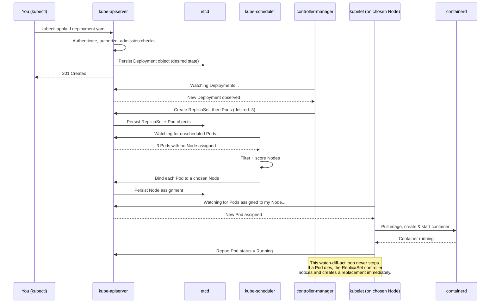
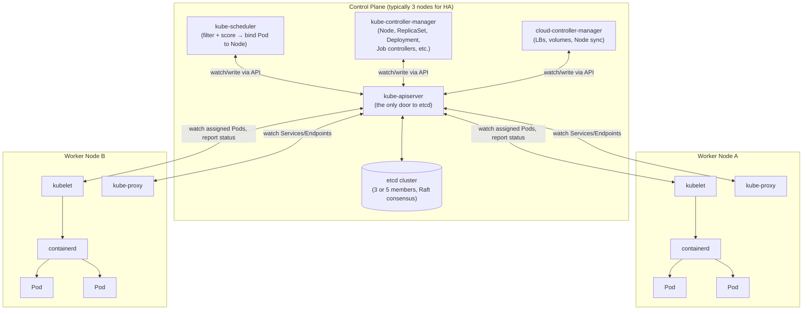

# Chapter 2 — Architecture and Internals

## Learning Objectives

By the end of this chapter you will be able to:

- Name and describe the role of every control plane component: `kube-apiserver`, `etcd`, `kube-scheduler`, `kube-controller-manager`, `cloud-controller-manager`
- Name and describe the role of every worker node component: `kubelet`, `kube-proxy`, and the container runtime
- Explain the Container Runtime Interface (CRI) and why Kubernetes no longer talks to Docker Engine directly
- Explain the reconciliation loop ("desired state vs. actual state") and why it is the mechanism behind self-healing
- Trace a `kubectl apply` command end-to-end through every architectural component
- Explain why production control planes run with 3+ nodes and an odd number of etcd members

---

## Prerequisites for This Chapter

- **Chapter 1 — Introduction to Kubernetes** — required. This chapter assumes you already know the orientation map (control plane vs. worker nodes vs. Pods) and the core vocabulary glossary from Chapter 1; here we go several levels deeper into each piece.
- **Docker (Topic 4)** — required, particularly the architecture chapter covering `dockerd`, `containerd`, and `runc`, since Kubernetes' container runtime layer builds on the same OCI/CRI concepts.

---

## 2.1 Why Architecture Matters Before Syntax

It is tempting to skip straight to writing YAML and running `kubectl apply`. Resist that temptation for one more chapter. Nearly every confusing Kubernetes debugging session — "why is my Pod stuck in `Pending`?", "why did my Deployment not pick up the new image?", "why does the cluster say everything is fine but my app is down?" — is really a question about *which component is responsible for what*. If you know the architecture, these questions become mechanical to answer. If you don't, they feel like magic, and magic is un-debuggable.

Think of this chapter as popping the hood on the diagram from Chapter 1, section 1.5.

---

## 2.2 The Control Plane, Component by Component

The control plane is not one process — it is a set of independent components that communicate with each other exclusively through the API server. In production, these run on dedicated control plane nodes, separate from the machines running your application Pods.

### kube-apiserver — The Front Door

The API server is the **only** component that talks to `etcd` directly, and it is the **only** entry point for every other component — including you.

- It exposes a REST API (the Kubernetes API) that validates and processes all requests: creating a Pod, listing Deployments, updating a Service, deleting a Namespace — everything goes through it.
- It handles **authentication** (who are you — client certificate, bearer token, OIDC?) and **authorization** (are you allowed to do this — typically via RBAC, covered in Topic 9).
- It performs **admission control** — a pipeline of checks and mutations that run after authorization but before an object is persisted (e.g., rejecting a Pod that violates a resource quota, or injecting a sidecar container).
- Every other component — the scheduler, the controllers, every `kubelet` on every node, and the `kubectl` CLI itself — is a *client* of the API server. None of them talk to each other directly, and none of them talk to `etcd` directly.

This "everything goes through the API server" design is deliberate: it means there is exactly one place to enforce security, exactly one place to validate data, and exactly one source of truth for "what is the current state of the cluster."

### etcd — The Cluster's Single Source of Truth

`etcd` is a distributed, consistent key-value store. It is where the entire state of the cluster actually lives — every Pod spec, every Secret, every ConfigMap, every Node's status. If it isn't in `etcd`, as far as Kubernetes is concerned, it doesn't exist.

- Only the API server talks to `etcd`. This keeps the storage layer simple and centrally governed.
- `etcd` uses the **Raft consensus algorithm** to keep multiple copies of the data consistent across machines. Raft requires a **majority (quorum)** of members to agree before any write is considered committed.
- This is why production `etcd` clusters run with an **odd number of members — typically 3 or 5.** Quorum math explains why:

| Cluster Size | Members Needed for Quorum | Failures Tolerated |
|--------------|---------------------------|---------------------|
| 1 | 1 | 0 |
| 3 | 2 | 1 |
| 4 | 3 | 1 (same as 3, but costs one more machine) |
| 5 | 3 | 2 |
| 7 | 4 | 3 |

Notice that 4 members tolerate the *same* one failure as 3 members, while costing an extra machine — this is exactly why even numbers are avoided. 3 is the common production baseline; 5 is used for larger, more failure-tolerant clusters.

- **If `etcd` loses quorum** (e.g., 2 out of 3 members die), the cluster becomes **read-only at best, and typically fully unavailable for writes** — no new Pods can be scheduled, no Deployments can be updated, nothing can change, even though already-running Pods generally keep running undisturbed (since `kubelet`s continue enforcing the last-known state locally). This is precisely why **etcd backups are treated as critical infrastructure**: `etcd` is the only place holding your cluster's entire configuration, and losing it without a backup means rebuilding every object in the cluster from scratch.

### kube-scheduler — Deciding Where Pods Run

When a new Pod is created but has no Node assigned yet, the scheduler's job is to pick one. It does this in two phases:

1. **Filtering** — eliminate any Node that *cannot* run this Pod: insufficient CPU/memory, a node taint the Pod doesn't tolerate, a node selector that doesn't match, a port conflict, and so on.
2. **Scoring** — of the Nodes that remain, rank them by preference: spread Pods evenly across nodes, prefer nodes that already have the container image cached, respect affinity/anti-affinity rules, and other pluggable priorities.

The highest-scoring Node wins, and the scheduler writes that decision back to the API server (which persists it to `etcd`) — the scheduler itself never starts a container; it only makes the placement *decision*. Node affinity, taints, and tolerations are covered in full in Chapter 10.

### kube-controller-manager — The Reconciliation Engine

This is actually a single binary that bundles together many independent **controllers**, each responsible for one type of object, each running its own continuous reconciliation loop (explained fully in section 2.4). Examples include:

- **Node controller** — watches Node health; if a Node stops reporting heartbeats, marks it unhealthy and eventually evicts its Pods for rescheduling elsewhere.
- **ReplicaSet controller** — watches ReplicaSets; if the number of running Pods doesn't match the desired replica count, creates or deletes Pods to fix it.
- **Deployment controller** — orchestrates rolling updates by manipulating ReplicaSets over time.
- **Job controller**, **Endpoint controller**, **Namespace controller**, and many others — each one small, single-purpose, and independent.

Every one of these controllers follows the exact same pattern: watch the API server for a specific type of object, compare desired state to actual state, and take action to close the gap. This pattern is the heart of Kubernetes, and section 2.4 covers it in depth.

### cloud-controller-manager — The Cloud Integration Point

This component exists to keep cloud-provider-specific logic out of the core Kubernetes codebase. It handles integrations like:

- Provisioning a cloud load balancer when you create a `Service` of type `LoadBalancer`
- Attaching cloud block storage volumes to the correct Node
- Keeping Node objects in sync with the actual state of the underlying cloud instances (e.g., marking a Node as gone if the EC2 instance behind it was terminated)

If you use a managed Kubernetes offering (EKS, GKE, AKS), the cloud provider runs and maintains this component for you as part of the control plane you don't see. If you self-host on bare metal with no cloud provider, this component is often simply absent or replaced by community projects.

---

## 2.3 Worker Node Components

Every worker node — the machines that actually run your application Pods — runs three components.

### kubelet — The Node Agent

`kubelet` runs on every Node (including, often, control plane nodes themselves) and is the local enforcer of the API server's instructions.

- It watches the API server for Pods that have been assigned to *its* Node.
- For each assigned Pod, it ensures the containers described in the PodSpec are actually running, using the container runtime (see below) to start/stop them.
- It continuously runs health checks (liveness/readiness/startup probes — Chapter 10) and reports Pod and Node status back to the API server.
- It is, in effect, the on-the-ground translator between "the cluster wants this Pod running here" (an abstract API object) and "there is an actual running container process on this machine."

### kube-proxy — Implementing Service Networking

`kube-proxy` runs on every Node and implements the networking rules that make the `Service` abstraction work (Services are covered fully in Chapter 6, but the mechanism belongs here).

- A `Service` gives a stable virtual IP and DNS name to a shifting set of Pods. `kube-proxy`'s job is to make traffic sent to that stable IP actually reach one of the healthy backing Pods.
- It does this by programming the Node's networking rules — historically via **iptables**, and increasingly via the more performant **IPVS (IP Virtual Server)** mode for large clusters with many Services.
- This happens entirely at the networking layer — there is no proxy process actually forwarding every packet in userspace (in `iptables`/`IPVS` mode); the kernel does the packet rewriting according to rules `kube-proxy` maintains.

### Container Runtime — Actually Running Containers

The container runtime is the software that actually pulls images and starts/stops container processes on the Node, on `kubelet`'s instruction.

Kubernetes communicates with the runtime through a standardized plugin interface called the **Container Runtime Interface (CRI)**. Any runtime that implements CRI can plug into Kubernetes — the two most common today are:

- **containerd** — a lightweight, high-performance runtime (originally extracted from Docker Engine itself) that is now the most widely used Kubernetes runtime, including by default in EKS, GKE, and AKS.
- **CRI-O** — a runtime built specifically and only for Kubernetes, popular in OpenShift and other Red Hat-centric environments.

**An important, frequently misunderstood historical note:** prior to Kubernetes 1.24 (released in 2022), Kubernetes could talk to Docker Engine directly through a compatibility shim called `dockershim`. That shim was removed in 1.24, which caused a wave of "Kubernetes is dropping Docker support!" headlines. In practice, this changed nothing for application developers: Docker Engine internally always used `containerd` anyway, so Kubernetes now simply talks to `containerd` directly, cutting out a redundant layer. Your Dockerfiles, `docker build` workflow, and the images you produce remain **100% compatible**, because both Docker and every CRI runtime consume the same open **OCI (Open Container Initiative)** image format. Nothing about how you build images changed — only which internal component runs them on the Node.

```
Kubernetes  ──CRI──▶  containerd  (or CRI-O)  ──▶  runc  ──▶  Linux namespaces/cgroups
                                                              (the actual container process)
```

---

## 2.4 The Reconciliation Loop: Desired State vs. Actual State

This is the single mechanism that makes every "self-healing," "auto-scaling," and "rolling update" feature in Kubernetes possible, so it deserves a slow, careful explanation.

Every controller in Kubernetes (the ReplicaSet controller, the Node controller, the Deployment controller, and dozens more) follows the same loop, forever, for as long as the cluster runs:

```
       ┌─────────────────────────────────────────────┐
       │                                               │
       ▼                                               │
  1. OBSERVE                                            │
  Watch the API server for the current                  │
  actual state of the objects I care about              │
       │                                               │
       ▼                                               │
  2. DIFF                                               │
  Compare actual state against the                      │
  desired state stored in the object's spec              │
       │                                               │
       ▼                                               │
  3. ACT                                                │
  If they differ, take the smallest action              │
  needed to move actual state toward desired            │
       │                                               │
       └──────────────── repeat forever ────────────────┘
```

Concretely: a `Deployment` object's `spec.replicas` field says `3`. The ReplicaSet controller watches how many matching Pods actually exist. If only 2 exist (one crashed), it creates exactly 1 more. If 4 exist (a Node came back online with a stale Pod), it deletes exactly 1. It never needs to be told "a Pod crashed, please restart it" — it simply notices the mismatch on its next observation and corrects it. This is what "self-healing" *actually means* mechanically: not that Kubernetes has special crash-detection magic, but that something is *always* comparing desired vs. actual state and closing the gap.

The "watch" in step 1 is not polling in a naive loop — components use an efficient **watch** mechanism against the API server, which streams change events as they happen, so reconciliation reacts quickly (typically within a second or so) rather than on a slow fixed timer.

### Tracing `kubectl apply` End to End



Every arrow in that diagram is a real network call or a real watch subscription against the API server. Nothing here is hidden magic — it is components independently watching and reacting, coordinated only through shared state in `etcd`.

---

## 2.5 Full Cluster Architecture Diagram

Putting the control plane and worker node components together into one picture:



Notice the pattern repeats at every level: nothing talks peer-to-peer. The API server is the hub; everything else is a spoke that watches it and writes back to it.

---

## 2.6 High Availability Control Planes

A single control plane node is a single point of failure — if it goes down, you cannot deploy anything new, scale anything, or recover from further failures, even though already-running Pods typically keep serving traffic (since `kubelet` continues enforcing the last state it knew about locally). For any environment that matters, this is unacceptable.

Production clusters therefore run **at least 3 control plane nodes**:

- Multiple **`kube-apiserver`** instances run behind a load balancer (often the same load balancer your `kubectl` and `kubelet`s talk to) — the API server itself is stateless, so running several copies is straightforward.
- **`etcd`** runs as a clustered set — 3 or 5 members, as discussed in section 2.2 — often colocated on the same machines as the API servers, though large clusters sometimes run `etcd` on entirely separate dedicated machines for performance and blast-radius isolation.
- Only **one** `kube-scheduler` and **one** `kube-controller-manager` are ever *active* at a time (they use a leader-election mechanism, via a lease object in the API server, to agree on which replica is currently in charge) — the standby replicas sit ready to take over instantly if the active one fails.

**What happens if `etcd` loses quorum?** Say you run 3 `etcd` members and 2 fail simultaneously. The remaining single member cannot form a majority, so `etcd` refuses new writes to protect consistency. Practically, this means: the API server can still *read* some cached/local information and existing Pods keep running, but you cannot create, update, or delete any object — no new deployments, no scaling, no self-healing reactions to further failures — until quorum is restored. This is precisely why etcd backups and monitoring etcd health are treated as some of the highest-priority operational responsibilities in running a self-managed cluster, and it is one of the strongest arguments for using a managed control plane (EKS/GKE/AKS) where the cloud provider owns this responsibility.

---

## 2.7 Real-World Scenario: What Happens When You Run `kubectl apply -f deployment.yaml`

Let's ground everything in this chapter with one concrete walkthrough, tying every component back together in plain language (the sequence diagram in section 2.4 showed this mechanically; this is the same journey narrated).

An engineer, Priya, has just finished updating the image tag in `deployment.yaml` for the `checkout-service` from `v1.4` to `v1.5`. She runs:

```bash
kubectl apply -f deployment.yaml
```

1. **kubectl** reads the local YAML file, converts it to JSON, and sends an HTTPS request to the **API server**, authenticated with Priya's client certificate.
2. The **API server** checks that Priya is authorized to modify Deployments in this Namespace (RBAC), runs admission checks (e.g., is this within the Namespace's resource quota?), and — seeing this Deployment already exists — computes the diff between the existing object and the new one Priya submitted.
3. The API server persists the updated Deployment spec (image tag now `v1.5`) into **etcd**. As far as Kubernetes is concerned, the "desired state" has now officially changed.
4. The **Deployment controller** (part of `kube-controller-manager`), which has an active watch on Deployments, is notified of the change within moments. It sees the Pod template changed and begins a rolling update: it creates a new ReplicaSet for `v1.5` and starts gradually scaling it up while scaling the old `v1.4` ReplicaSet down, respecting the Deployment's rolling update strategy (max surge / max unavailable — covered fully in Chapter 5).
5. Each new Pod created by the new ReplicaSet is written to etcd without a Node assignment. The **scheduler**, watching for exactly this condition, filters and scores the available worker Nodes and binds each new Pod to a chosen Node.
6. On each chosen Node, the local **kubelet** notices (via its watch) that a new Pod has been assigned to it. It instructs the **container runtime** (`containerd`) to pull the `v1.5` image if it isn't already cached, and start the container.
7. As each new Pod passes its readiness probe, **kube-proxy** on every Node updates its networking rules so that traffic sent to the `checkout-service` Service starts including the new Pod as a valid backend — and correspondingly stops sending traffic to terminated old Pods.
8. Priya runs `kubectl rollout status deployment/checkout-service` and watches the new ReplicaSet scale to 100% while the old one scales to zero, with zero dropped requests throughout, because old Pods are only removed from load balancing after new ones are confirmed healthy.

Every step in that story maps directly onto a component from this chapter. There is no step where "Kubernetes just does it" — it is always one specific, named component, doing one specific, well-defined job, coordinated entirely through the API server and etcd.

---

## Best Practices

- Always run production control planes with 3 (or 5) nodes/etcd members — never a single control plane node outside of local development.
- Take and test regular `etcd` backups (`etcdctl snapshot save`) if you self-manage a cluster; an untested backup is not a backup.
- Prefer managed control planes (EKS/GKE/AKS) unless you have a specific operational reason and the staffing to run `etcd` and the API server yourselves.
- Monitor `etcd` disk latency and leader elections — `etcd` is highly sensitive to slow disks, and degraded `etcd` performance degrades the entire cluster's responsiveness.
- When debugging "stuck" resources, always ask which component owns the next step (is it waiting on the scheduler? the kubelet? image pull?) rather than guessing.

## Common Mistakes

- Believing Kubernetes "restarts crashed containers" via some special-cased logic — it is actually the generic reconciliation loop (desired replicas vs. actual replicas) doing its normal job.
- Running a single-node or single-etcd-member control plane in anything resembling production and being surprised when an update or a maintenance reboot causes an outage.
- Confusing the container runtime (`containerd`, what actually runs containers) with Docker Engine (a full toolchain including the CLI and build tooling) — removing "Docker support" in 1.24 only removed a compatibility shim, not OCI image compatibility.
- Assuming the scheduler starts containers — it only decides *placement*; the kubelet and container runtime on the chosen Node do the actual starting.

---

## Summary

A Kubernetes cluster's control plane is made of independent, single-purpose components — `kube-apiserver` (the only door to the cluster's state), `etcd` (the distributed source of truth, requiring quorum via an odd number of members), `kube-scheduler` (filters and scores Nodes to place Pods), `kube-controller-manager` (a bundle of reconciliation-loop controllers), and `cloud-controller-manager` (cloud-specific integrations). Worker nodes run `kubelet` (the local enforcer talking to the API server), `kube-proxy` (implements Service networking via iptables/IPVS), and a CRI-compliant container runtime like `containerd`. The entire system is powered by one repeating pattern — observe actual state, diff against desired state, act to close the gap — which is what makes Kubernetes self-healing without any special-cased failure logic. Production clusters run control planes with 3+ nodes and an odd-numbered etcd cluster specifically to survive the loss of any single member without losing write availability.

---

## Knowledge Check

1. Why does only the API server talk directly to `etcd`, and what would go wrong architecturally if every component queried `etcd` independently?
2. Explain, in your own words, the two phases the scheduler uses to choose a Node for a Pod.
3. What is the difference in responsibility between `kubelet` and the container runtime (e.g., `containerd`)?
4. Why must `etcd` clusters have an odd number of members, and what specifically happens if quorum is lost?
5. Describe the three steps of the reconciliation loop pattern and explain how they produce "self-healing" behavior without any crash-specific code.
6. Trace what happens, component by component, from the moment you run `kubectl apply -f deployment.yaml` to the moment a container is actually running.

---

## Hands-On Exercise

You do not need a running cluster for this exercise — it is a research and diagramming exercise designed to cement the architecture before you touch `kubectl` in Chapter 3.

1. From memory (do not look back at section 2.5), draw the full cluster architecture diagram on paper or a whiteboard: the control plane box with its five components, at least two worker nodes with their three components each, and the arrows showing who talks to whom. Then compare your drawing against this chapter's diagram and correct any mistakes.
2. Research and write two or three sentences answering: what specific component in a managed EKS/GKE/AKS cluster does the cloud provider operate for you, and what remains your responsibility as the cluster user? (Hint: look up "shared responsibility model" for your preferred cloud provider's managed Kubernetes offering.)
3. Explain to a colleague (or write it down as if you were) why a Kubernetes cluster with only one control plane node is risky for production, using the specific failure mode from section 2.6 (etcd quorum loss) as your example.

---

## Further Reading

- kubernetes.io/docs/concepts/architecture/ — official Kubernetes Components documentation
- kubernetes.io/docs/concepts/overview/components/ — control plane and node components reference
- kubernetes.io/docs/concepts/architecture/control-plane-node-communication/ — control plane to node communication paths
- etcd.io/docs/ — official etcd documentation, including the Raft consensus explanation and backup/restore procedures
- kubernetes.io/docs/concepts/architecture/cri/ — Container Runtime Interface (CRI) documentation

---

<div style="display:flex;justify-content:space-between;align-items:center;">
  <a href="./01-introduction.md">← Previous: Introduction to Kubernetes</a>
  <a href="./00-index.md">🏠 Index</a>
  <a href="./03-installation-and-setup.md">Next: Installation and Setup →</a>
</div>
