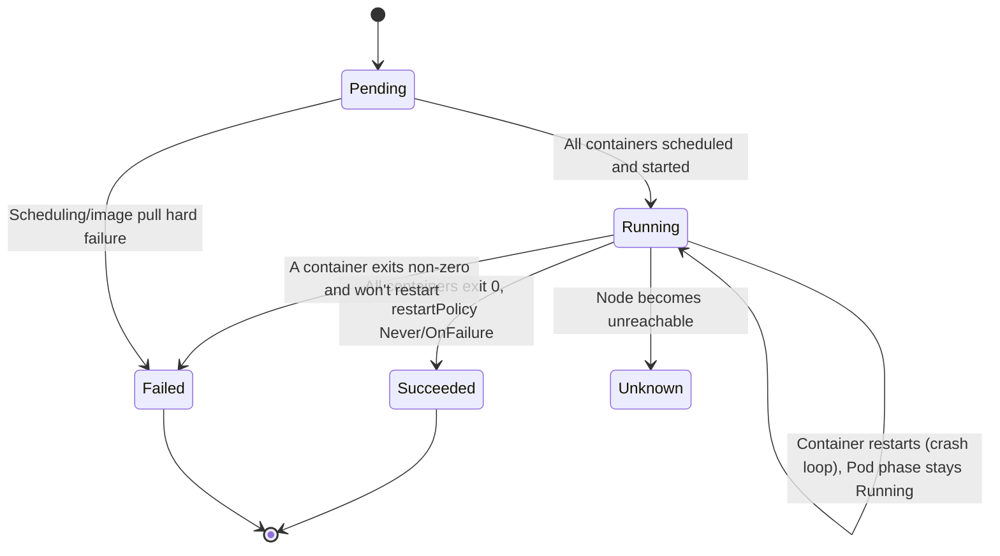

# Chapter 4 — Pods and Workloads

## Learning Objectives

By the end of this chapter you will be able to:

- Explain what a Pod is and why Kubernetes schedules Pods instead of bare containers
- Write and read a complete Pod spec YAML, including containers, ports, resources, and env vars
- Recognize and implement the sidecar and init container multi-container patterns
- Describe Pod phases and container states, and read them from `kubectl describe` and `kubectl get`
- Explain why Pods are ephemeral/disposable and why nobody runs bare Pods in production
- Use labels and selectors as the mechanism controllers and Services use to find Pods

## Prerequisites for This Chapter

- Chapter 1 (Introduction to Kubernetes) — the orchestration problem and what Kubernetes is
- Chapter 2 (Architecture and Internals) — the control plane, kubelet, and the reconciliation loop
- Chapter 3 (Installation and Setup) — a working `kubectl` against a local `kind` cluster, and comfort applying YAML manifests
- Docker fundamentals (Topic 4) — images, containers, and container networking basics

---

## 4.1 Why Kubernetes Doesn't Schedule Bare Containers

In Docker, the unit you run is a container. In Kubernetes, the smallest unit you can create is a **Pod** — and a Pod is not a container, it's a wrapper around one or more containers.

This is the first conceptual jump most newcomers stumble on: why add a layer? The answer comes from a real operational need. Some applications are genuinely single-process, single-container things — a stateless API server, for example. But many real workloads need a *helper* running alongside the main process: something that ships logs, proxies traffic, watches for config changes, or performs a one-time setup step before the app starts. These helpers need to be scheduled onto the same machine as the app, share the same network identity, and live and die together with it.

Docker alone has no native concept for "these two containers are one deployable unit." You could stitch them together with `docker run --network container:other`, but there's no scheduler-level primitive that says "always place these together, always scale them together, always restart them together." Kubernetes introduces the Pod to be exactly that primitive.

**A Pod is one or more containers that:**

- Share the same **network namespace** — they get a single Pod IP, and containers inside the Pod can reach each other via `localhost` on their respective ports
- Can share **storage volumes** — a volume defined at the Pod level can be mounted into multiple containers
- Are always scheduled together onto the same node — never split across machines
- Share the same lifecycle from the scheduler's perspective — they start together and (as a unit) are considered for termination together

### The Roommates Analogy

Think of a Pod as an apartment, and containers as roommates living in it.

- The **apartment has one street address** (the Pod IP) — mail (network traffic) arrives at that address regardless of which roommate it's for.
- Roommates can **walk down the hall and knock on each other's door** (`localhost:<port>`) without needing to know the building's street address at all.
- Each roommate still has **their own room** — their own filesystem, their own process space, their own resource limits. One roommate crashing doesn't remodel the other's room.
- When the **lease ends**, everyone moves out together — you don't evict one roommate and leave the apartment half-occupied while keeping the same address; the whole apartment (Pod) is torn down and, if needed, a new one is built elsewhere with a new address.

This single-IP-many-processes model is precisely why sidecar containers (4.3) work so naturally: a logging sidecar can read from `localhost` or a shared volume without any special network plumbing.

### Pods vs. Containers — Quick Comparison

| | Container | Pod |
|---|---|---|
| Smallest unit Kubernetes schedules | No | Yes |
| Has its own IP address | Only via Docker's own networking | Yes — one IP for the whole Pod |
| Can contain multiple processes as siblings | Only by convention/hacks | Yes — this is the intended design |
| Restarted by | Docker's restart policy | The kubelet, per Pod container restart policy |
| Directly created in production | Rare | Rare (see 4.5 — a controller creates it for you) |

---

## 4.2 Anatomy of a Pod Spec

Here is a complete, annotated single-container Pod manifest:

```yaml
apiVersion: v1              # Pods are a core (v1) API resource
kind: Pod
metadata:
  name: web-app              # unique name within the namespace
  namespace: default
  labels:                    # key-value tags — see 4.6
    app: web-app
    tier: frontend
spec:
  containers:
    - name: web-app           # container name, unique within the Pod
      image: nginx:1.25-alpine
      ports:
        - containerPort: 80    # informational: documents the port the app listens on
          name: http
      env:
        - name: APP_ENV
          value: "production"
        - name: LOG_LEVEL
          value: "info"
      resources:
        requests:              # what the scheduler reserves for this container
          cpu: "100m"           # 100 millicores = 0.1 of a CPU core
          memory: "128Mi"
        limits:                # hard ceiling — enforced by the kernel/kubelet
          cpu: "500m"
          memory: "256Mi"
  restartPolicy: Always        # Always | OnFailure | Never (default: Always)
```

Apply it and inspect it:

```bash
kubectl apply -f web-app-pod.yaml

kubectl get pods
kubectl get pod web-app -o wide      # shows Pod IP, node, and status
kubectl describe pod web-app         # full event history and container states
```

### Field-by-Field Notes

| Field | Purpose |
|---|---|
| `metadata.name` | Unique identifier within the namespace. Immutable once created. |
| `metadata.labels` | Arbitrary key-value pairs used for selection (4.6) — not for humans to read, for machines to query. |
| `spec.containers[].image` | Always pin a specific tag in real manifests (`nginx:1.25-alpine`, not `nginx:latest`) — same reasoning as Chapter 3 of the Docker course. |
| `spec.containers[].ports` | Purely documentation/introspection — Kubernetes does **not** block traffic to unlisted ports. Unlike Docker's `-p`, this does not "publish" anything. |
| `spec.containers[].resources.requests` | Used by the **scheduler** to decide which node has room for this Pod. |
| `spec.containers[].resources.limits` | Enforced by the kubelet/container runtime — exceeding the memory limit gets the container OOM-killed; exceeding CPU limit gets it throttled. |
| `spec.restartPolicy` | Applies to the whole Pod: whether the kubelet restarts containers that exit. `Always` is the default and what most workloads want. |

Requests and limits get their own deep dive in Chapter 9 (Namespaces and Resource Management) — for now, know that requests drive scheduling and limits are a hard ceiling.

---

## 4.3 Multi-Container Pod Patterns

Because containers in a Pod share network and (optionally) storage, a handful of well-known design patterns have emerged. You will see these constantly in real clusters.

### Sidecar Pattern

A **sidecar** is a helper container that extends or augments the main application container, running alongside it for the Pod's entire life. The classic example: an app writes logs to a file, and a sidecar tails that file and ships it to a central logging system (rather than making the app itself responsible for shipping logs).

```yaml
apiVersion: v1
kind: Pod
metadata:
  name: web-app-with-sidecar
  labels:
    app: web-app
spec:
  volumes:
    - name: shared-logs
      emptyDir: {}            # ephemeral volume shared by both containers

  containers:
    - name: web-app
      image: myregistry/web-app:v1.4.0
      ports:
        - containerPort: 8080
      volumeMounts:
        - name: shared-logs
          mountPath: /var/log/app

    - name: log-shipper       # the sidecar
      image: fluent/fluent-bit:2.2
      volumeMounts:
        - name: shared-logs
          mountPath: /var/log/app
          readOnly: true
      resources:
        requests:
          cpu: "50m"
          memory: "64Mi"
        limits:
          cpu: "100m"
          memory: "128Mi"
```

Both containers mount the same `emptyDir` volume. The app writes log files into it; the sidecar reads and forwards them. Neither container needs to know anything special about the other beyond the shared path — this is the shared-storage half of the Pod contract at work.

### Init Containers

An **init container** runs to completion *before* any regular (app) container in the Pod starts. Kubernetes runs init containers sequentially, in the order listed, and only starts the main containers once every init container has exited successfully (exit code 0). If an init container fails, the kubelet retries it according to the Pod's restart policy — the app containers never start until init containers succeed.

Common uses: waiting for a dependency to become reachable, running a one-time database migration check, or fetching configuration before the app can boot.

```yaml
apiVersion: v1
kind: Pod
metadata:
  name: api-with-init
  labels:
    app: api
spec:
  initContainers:
    - name: wait-for-db
      image: busybox:1.36
      command:
        - sh
        - -c
        - |
          until nc -z -w2 postgres-svc 5432; do
            echo "waiting for postgres...";
            sleep 2;
          done

    - name: run-migration-check
      image: myregistry/api-migrator:v1.4.0
      command: ["./check-migrations.sh"]

  containers:
    - name: api
      image: myregistry/api:v1.4.0
      ports:
        - containerPort: 8080
```

The distinction to internalize: init containers are **run-to-completion, sequential, one-shot** — they are not sidecars. A sidecar lives for the whole Pod lifetime; an init container's job is done (and its resources released) before the app container ever starts.

### Other Patterns (Conceptual)

Two more patterns worth knowing by name, without needing full YAML here:

- **Ambassador** — a sidecar that acts as a local proxy for outbound traffic. The app talks to `localhost:<port>`, and the ambassador container forwards that traffic elsewhere (a different environment, a service mesh sidecar proxy, or a database with connection pooling). This decouples the app from needing to know real network locations.
- **Adapter** — a sidecar that normalizes the app's output into a standard format for external tools — for example, converting a legacy app's proprietary metrics format into Prometheus-compatible metrics, so monitoring tooling doesn't need to understand every app's native format.

You'll encounter both again when service meshes (Advanced Kubernetes, Topic 9) inject their own ambassador-style sidecars automatically into every Pod.

---

## 4.4 Pod Lifecycle: Phases and Container States

A Pod's `status.phase` is a coarse, high-level summary of where the Pod is in its life. Individual containers inside the Pod additionally have their own, more granular states.

### Pod Phases

| Phase | Meaning |
|---|---|
| `Pending` | Accepted by the API server, but not all containers are running yet (image pulling, waiting to be scheduled, etc.) |
| `Running` | The Pod has been bound to a node and at least one container is running |
| `Succeeded` | All containers terminated successfully (exit code 0) and will not be restarted — typical for batch-style Pods |
| `Failed` | All containers terminated, and at least one terminated with a failure |
| `Unknown` | The Pod's state could not be determined, usually because the node is unreachable |

### Container States

Independent of the Pod phase, each container tracked by the kubelet is in one of:

- **Waiting** — not running yet (pulling its image, waiting on a previous init container, etc.)
- **Running** — process is executing, no problems detected
- **Terminated** — the container ran and stopped, either successfully or with an error; the exit code and reason are recorded



Note the subtlety in the diagram: a **crash-looping container** does not necessarily change the Pod's phase. A Pod can sit in `Running` phase indefinitely while one of its containers is stuck in `Waiting` (reason: `CrashLoopBackOff`) because the Pod phase reflects the Pod as a whole, and other containers may still be healthy.

### Reading Lifecycle State from kubectl

```bash
# Quick status, one line per Pod, includes the node it's running on
kubectl get pod web-app -o wide

# Full detail: phase, container states, restart counts, and the event log
kubectl describe pod web-app
```

A `kubectl describe pod` output includes a `Containers:` section showing each container's `State:` (e.g. `Running`, `Waiting`, `Terminated`) and a `Events:` section at the bottom — this event log is often the fastest way to diagnose why a Pod won't start (`ImagePullBackOff`, `FailedScheduling`, `CrashLoopBackOff`, etc.).

```bash
# Example fragment of `kubectl describe pod` output
State:          Waiting
  Reason:       CrashLoopBackOff
Last State:     Terminated
  Reason:       Error
  Exit Code:    1
Restart Count:  5
```

---

## 4.5 Pods Are Ephemeral and Disposable

This is the single most important mental shift for anyone coming from traditional server administration: **you do not fix a broken Pod.**

If a Pod's container crashes repeatedly, if the node it's running on dies, or if you need to change the container image, the answer is never "SSH in and patch it." The Pod is deleted (or dies on its own) and a *new* Pod — with a new name, a new IP, and a freshly-pulled image — takes its place. Pods are treated like cattle, not pets: you don't nurse a sick one back to health, you replace it.

This has a direct consequence: **a bare Pod you create by hand has no such replacement mechanism.** If you `kubectl apply -f pod.yaml` and that Pod's node crashes, nothing brings it back — there is no controller watching over it. This is exactly the gap Chapter 5 closes with ReplicaSets and Deployments, which continuously watch for "how many Pods matching this label selector currently exist?" and create replacements automatically. That's why, outside of quick debugging or one-off manual tests, **nobody creates bare Pods directly in production.**

---

## 4.6 Labels and Selectors

**Labels** are arbitrary key-value pairs attached to objects (most commonly Pods) purely for identification and grouping — Kubernetes itself assigns them no built-in meaning.

```yaml
metadata:
  labels:
    app: web-app
    tier: frontend
    environment: production
    version: v1.4.0
```

**Selectors** are queries against those labels. A controller or a Service doesn't reference Pods by name — it says, in effect, "manage/route to every Pod whose labels match this selector." This indirection is the single mechanism that every higher-level object in Kubernetes builds on:

- A ReplicaSet's `selector` decides which Pods it counts and manages (Chapter 5)
- A Service's `selector` decides which Pods receive its traffic (Chapter 6)
- `kubectl` lets you query by label directly

```bash
# List Pods with a specific label value
kubectl get pods -l app=web-app

# Combine label expressions
kubectl get pods -l 'app=web-app,environment=production'

# Show all labels on all pods
kubectl get pods --show-labels

# Add or update a label on a running Pod
kubectl label pod web-app version=v1.4.1 --overwrite
```

You cannot overstate how central this idea is — it recurs in every remaining chapter of this course. Whenever you see the word "selector" from here on, mentally translate it to: *"find every Pod whose labels match this."*

---

## Real-World Scenario: Web App with a Log-Shipping Sidecar

Imagine you run a customer-facing web application, and your organization has a central logging system (say, an Elasticsearch/Loki-based stack) that every team ships logs to. Rather than modifying the app's code to talk to the logging backend directly — which would couple your app to a specific logging vendor — you attach a sidecar that reads the app's log files and forwards them.

```yaml
apiVersion: v1
kind: Pod
metadata:
  name: storefront-web
  labels:
    app: storefront
    tier: frontend
spec:
  volumes:
    - name: app-logs
      emptyDir: {}

  containers:
    - name: storefront
      image: myregistry/storefront:v3.2.1
      ports:
        - containerPort: 8080
          name: http
      env:
        - name: LOG_DIR
          value: "/var/log/storefront"
      volumeMounts:
        - name: app-logs
          mountPath: /var/log/storefront
      resources:
        requests:
          cpu: "250m"
          memory: "256Mi"
        limits:
          cpu: "500m"
          memory: "512Mi"

    - name: log-shipper
      image: fluent/fluent-bit:2.2
      volumeMounts:
        - name: app-logs
          mountPath: /var/log/storefront
          readOnly: true
      env:
        - name: LOKI_ENDPOINT
          value: "http://loki.logging.svc.cluster.local:3100"
      resources:
        requests:
          cpu: "50m"
          memory: "64Mi"
        limits:
          cpu: "100m"
          memory: "128Mi"
```

Both containers share the Pod's network namespace and the `app-logs` volume. The `storefront` container has no idea a sidecar exists — it just writes to `/var/log/storefront` like it would on any single machine. The `log-shipper` reads the same directory and forwards everything to Loki. If you ever swap logging vendors, you change the sidecar image and its env vars — the application container is untouched.

---

## Best Practices

- Never rely on a bare Pod for anything that needs to survive a crash or a node failure — use a Deployment (Chapter 5) even for a single replica.
- Always set both `requests` and `limits` on every container, even in development — an unbounded container can starve its node's other workloads.
- Pin image tags exactly (`v1.4.0`, not `latest`) so a Pod recreated six months from now runs the same code.
- Use init containers for genuine "must finish before app starts" work (dependency checks, migrations) rather than baking wait-loops into the application's own startup code.
- Give every Pod meaningful, consistent labels (`app`, `tier`, `environment` at minimum) — you cannot retrofit good labeling once dozens of controllers and Services depend on the wrong selector.
- Keep sidecars lightweight — a sidecar competing heavily for CPU/memory with the main container defeats the purpose of separating concerns.

## Common Mistakes

- Creating bare Pods directly for long-running services instead of a Deployment, then being surprised when a crashed Pod is never replaced.
- Forgetting `resources.limits`, leading to one runaway container starving every other Pod scheduled on the same node.
- Confusing an init container with a sidecar and expecting an init container to keep running alongside the app (it exits and stays exited).
- Mislabeling Pods inconsistently across a team, breaking Service/controller selectors silently (the selector simply matches zero Pods — no error is raised).

*(The full catalog of Kubernetes pitfalls is covered in Chapter 16 — Common Mistakes and Pitfalls.)*

---

## Summary

- A Pod is one or more containers sharing a network namespace (one IP) and optionally storage volumes — it is the smallest unit Kubernetes schedules.
- A Pod spec's key fields are `containers`, `image`, `ports`, `env`, and `resources.requests`/`resources.limits`.
- Multi-container patterns: **sidecar** (long-lived helper alongside the app), **init container** (run-to-completion setup before the app starts), and conceptually, **ambassador** and **adapter**.
- Pods move through phases (`Pending`, `Running`, `Succeeded`, `Failed`, `Unknown`); containers within a Pod independently move through states (`Waiting`, `Running`, `Terminated`).
- Pods are ephemeral and disposable by design — you replace a broken Pod, you don't repair it, which is why controllers exist (Chapter 5).
- Labels are key-value tags on Pods; selectors are queries against those labels — this is the mechanism every controller and Service uses to find the Pods it manages.

---

## Knowledge Check

1. Why does Kubernetes schedule Pods instead of individual containers? What two things do containers within a Pod share?
2. What is the difference between an init container and a sidecar container? Give one real use case for each.
3. A Pod's phase shows `Running`, but `kubectl describe pod` shows one container in `Waiting` with reason `CrashLoopBackOff`. Is this contradictory? Explain.
4. Why is it considered bad practice to create bare Pods directly for a production web service?
5. What is the relationship between labels and selectors, and name two Kubernetes objects (beyond Pods themselves) that rely on this mechanism.
6. In the sidecar YAML example in this chapter, how do the `storefront` and `log-shipper` containers communicate without any network configuration?

---

## Hands-On Exercise

Using your local `kind` cluster from Chapter 3:

1. Create a file `web-app-pod.yaml` using the single-container Pod example from section 4.2. Apply it with `kubectl apply -f web-app-pod.yaml`.
2. Run `kubectl get pod web-app -o wide` and note the Pod IP and node. Run `kubectl describe pod web-app` and find the `Events:` section.
3. Delete the Pod (`kubectl delete pod web-app`) and immediately run `kubectl get pods` — confirm it does *not* come back. This demonstrates the lack of self-healing for bare Pods.
4. Create the multi-container sidecar Pod from the "Real-World Scenario" section (`storefront-web`). Once it's `Running`, exec into the main container and write a line to the shared log file:
   ```bash
   kubectl exec -it storefront-web -c storefront -- sh -c 'echo "test log line" >> /var/log/storefront/app.log'
   ```
5. Exec into the sidecar container and confirm it can see the same file:
   ```bash
   kubectl exec -it storefront-web -c log-shipper -- cat /var/log/storefront/app.log
   ```
6. Create the init container Pod from section 4.3 (`api-with-init`) pointing at a service name that doesn't exist yet. Run `kubectl get pods` repeatedly and observe the Pod stuck in `Init:0/2` — this is the init container blocking the app container from starting. Delete the Pod when done.
7. Clean up all Pods you created: `kubectl delete pod web-app storefront-web api-with-init --ignore-not-found`.

---

## Further Reading

- kubernetes.io/docs/concepts/workloads/pods/
- kubernetes.io/docs/concepts/workloads/pods/init-containers/
- kubernetes.io/docs/concepts/workloads/pods/sidecar-containers/
- kubernetes.io/docs/concepts/workloads/pods/pod-lifecycle/
- kubernetes.io/docs/concepts/overview/working-with-objects/labels/

---

<div style="display:flex;justify-content:space-between;align-items:center;">
  <a href="./03-installation-and-setup.md">← Previous: Installation and Setup</a>
  <a href="./00-index.md">🏠 Index</a>
  <a href="./05-deployments-and-replicasets.md">Next: Deployments and ReplicaSets →</a>
</div>
