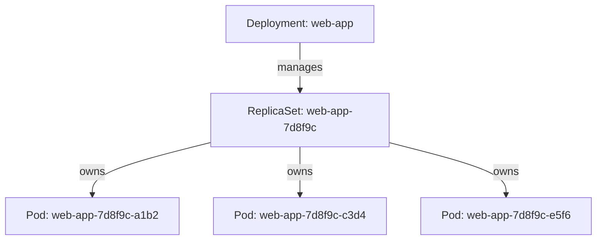
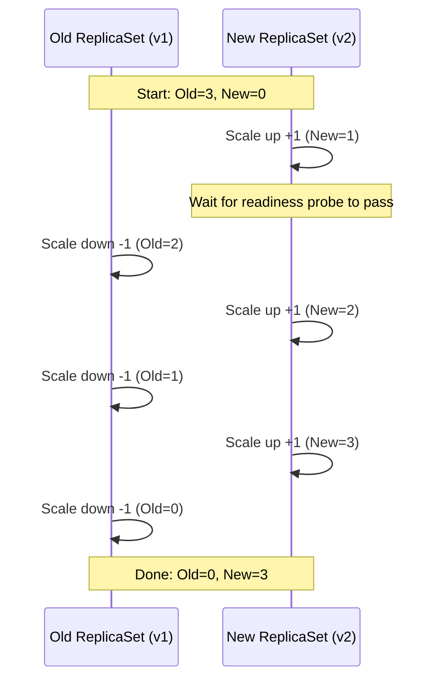

# Chapter 5 — Deployments and ReplicaSets

## Learning Objectives

By the end of this chapter you will be able to:

- Explain why bare Pods are unfit for production workloads and what problem ReplicaSets solve
- Write a ReplicaSet manifest and explain how its reconciliation loop keeps replica count correct
- Write a Deployment manifest and explain why Deployments are the standard way to run workloads, not raw ReplicaSets
- Walk through rolling update mechanics step by step, including `maxSurge` and `maxUnavailable`
- Choose between `RollingUpdate` and `Recreate` strategies based on application constraints
- Use `kubectl rollout status`, `history`, and `undo` to monitor and roll back a Deployment
- Describe blue-green and canary deployment patterns conceptually and know when dedicated tooling is warranted

## Prerequisites for This Chapter

- Chapter 4 (Pods and Workloads) — Pod anatomy, labels and selectors, and why Pods are ephemeral
- Chapter 2 (Architecture and Internals) — the reconciliation loop / control loop concept, which ReplicaSets and Deployments both implement
- Comfort applying and inspecting YAML manifests with `kubectl apply`, `kubectl get`, `kubectl describe`

---

## 5.1 The Problem With Bare Pods

Chapter 4 ended on a cliffhanger: Pods are disposable, and nobody creates bare Pods directly in production. Here's precisely why.

Imagine you deploy a single Pod running your API server. Three things will eventually go wrong, and a bare Pod has no answer for any of them:

1. **No self-healing.** If the container crashes hard, or the node it's scheduled on dies, the Pod is simply gone. Nothing is watching for "did this Pod disappear unexpectedly?" and nothing recreates it.
2. **No way to run multiple copies.** Production traffic requires more than one replica for both capacity and availability. A bare Pod is a single, uniquely-named object — you'd have to hand-create `api-1`, `api-2`, `api-3` yourself and manage each individually.
3. **No update logic.** When you ship a new image version, you need a controlled process — replace old copies with new ones gradually, verify the new ones are healthy, and only then finish the rollout. A bare Pod has no concept of "old version" vs. "new version" at all; you'd delete it and hope the replacement works.

Kubernetes solves all three problems with two layered controllers: the **ReplicaSet** (problems 1 and 2) and the **Deployment** (problem 3, built on top of ReplicaSets).

---

## 5.2 ReplicaSets: Keeping N Copies Running

A ReplicaSet's entire job is captured in one sentence: **continuously watch how many Pods matching its label selector currently exist, and reconcile that number to match the desired `replicas` count.**

This is the same reconciliation loop pattern from Chapter 2 — observe actual state, compare to desired state, act to close the gap, repeat forever. If a Pod is deleted, crashes irrecoverably, or its node disappears, the ReplicaSet controller notices the count dropped below `replicas` and creates a new Pod from its Pod template to bring the count back up. If you manually create an extra Pod carrying the same labels the ReplicaSet selects on, the controller will notice the count is now *too high* and delete one to bring it back down.

```yaml
apiVersion: apps/v1
kind: ReplicaSet
metadata:
  name: web-app-rs
  labels:
    app: web-app
spec:
  replicas: 3                  # desired count
  selector:
    matchLabels:
      app: web-app              # "manage every Pod with this label"
  template:                     # the Pod template used to create new Pods
    metadata:
      labels:
        app: web-app             # MUST match spec.selector.matchLabels
    spec:
      containers:
        - name: web-app
          image: myregistry/web-app:v1.4.0
          ports:
            - containerPort: 8080
          resources:
            requests:
              cpu: "100m"
              memory: "128Mi"
            limits:
              cpu: "500m"
              memory: "256Mi"
```

```bash
kubectl apply -f web-app-rs.yaml
kubectl get replicasets
kubectl get pods -l app=web-app       # 3 Pods, each with a generated suffix

# Demonstrate self-healing
kubectl delete pod <one-of-the-three-pod-names>
kubectl get pods -l app=web-app       # a replacement Pod appears within seconds
```

A critical detail: **`spec.selector.matchLabels` must be a subset of `spec.template.metadata.labels`.** If they don't align, the ReplicaSet either can't find its own Pods (and endlessly creates new ones) or accidentally adopts Pods that belong to something else. Kubernetes enforces that the template's labels satisfy the selector at creation time.

### Why You Almost Never Create a Raw ReplicaSet

A ReplicaSet solves self-healing and replica count — but it has no concept of "version history" or "controlled rollout." If you edit a ReplicaSet's `template.spec.containers[].image` directly, existing Pods are **not** updated — the ReplicaSet only acts when the *count* is wrong, not when the template changes. You'd have to manually delete old Pods one by one and trust the ReplicaSet to replace them with the new template, with zero coordination over how many are down at once. This is exactly the gap the Deployment closes.

---

## 5.3 Deployments: Managing ReplicaSets for You

A **Deployment** is a higher-level controller that manages ReplicaSets on your behalf. When you create a Deployment, it creates a ReplicaSet underneath it (which in turn creates Pods). When you change the Pod template inside a Deployment — most commonly, the container image — the Deployment doesn't touch the old ReplicaSet's Pods directly. Instead, it creates a **new ReplicaSet** with the updated template and orchestrates a controlled transition from the old ReplicaSet to the new one.

This is why, in practice, almost nobody creates a raw ReplicaSet: the Deployment gives you the ReplicaSet's self-healing and replica-count guarantees *plus* rolling updates, rollback history, and pause/resume — for the same amount of YAML.

```yaml
apiVersion: apps/v1
kind: Deployment
metadata:
  name: web-app
  labels:
    app: web-app
spec:
  replicas: 3
  revisionHistoryLimit: 10        # how many old ReplicaSets to retain for rollback
  strategy:
    type: RollingUpdate           # RollingUpdate (default) | Recreate
    rollingUpdate:
      maxSurge: 1                  # how many extra Pods above `replicas` are allowed during rollout
      maxUnavailable: 0             # how many Pods below `replicas` are allowed during rollout
  selector:
    matchLabels:
      app: web-app
  template:
    metadata:
      labels:
        app: web-app
    spec:
      containers:
        - name: web-app
          image: myregistry/web-app:v1.4.0
          ports:
            - containerPort: 8080
          resources:
            requests:
              cpu: "100m"
              memory: "128Mi"
            limits:
              cpu: "500m"
              memory: "256Mi"
```

```bash
kubectl apply -f web-app-deployment.yaml

kubectl get deployments
kubectl get replicasets                 # owned by the Deployment
kubectl get pods -l app=web-app -o wide
```

Notice the object hierarchy this creates: **Deployment → ReplicaSet → Pods.** Each layer exists to solve one specific problem, and each is implemented as its own controller running its own reconciliation loop.



---

## 5.4 Rolling Update Mechanics in Depth

`RollingUpdate` is the default strategy: replace old Pods with new ones gradually, without ever taking the whole workload offline. Two fields control exactly how gradual:

| Field | Meaning |
|---|---|
| `maxSurge` | The maximum number (or %) of Pods that can exist **above** the desired `replicas` count during the rollout |
| `maxUnavailable` | The maximum number (or %) of Pods that can be **unavailable** (below desired `replicas`) during the rollout |

With `replicas: 3`, `maxSurge: 1`, `maxUnavailable: 0`, updating the image plays out like this:

1. Start: 3 old Pods running, 0 new Pods. Desired total available: 3.
2. Because `maxSurge: 1`, the Deployment is allowed to briefly run 4 Pods total. It creates **1 new Pod** (new ReplicaSet scales 0 → 1).
3. Once that new Pod passes its readiness check, the Deployment can now safely remove an old Pod without dropping below 3 available — it scales the **old ReplicaSet down by 1** (3 → 2 old Pods).
4. The Deployment creates another new Pod (new ReplicaSet 1 → 2), waits for readiness, then scales the old ReplicaSet down again (2 → 1).
5. Repeats once more: new ReplicaSet 2 → 3, old ReplicaSet 1 → 0.
6. Rollout complete: 3 new Pods running, old ReplicaSet scaled to 0 (but retained, not deleted, for rollback — see 5.6).



Because `maxUnavailable: 0` in this example, the number of *available* Pods never drops below 3 — the trade-off is that the rollout temporarily uses more resources (up to 4 Pods' worth) than steady state. Flip the values — `maxSurge: 0`, `maxUnavailable: 1` — and you get the opposite trade-off: never more than 3 Pods total, but capacity briefly drops to 2 while a Pod is being replaced. Most real-world Deployments use small positive values for both (Kubernetes' own default is `25%` for each), balancing rollout speed against both resource headroom and momentary capacity dips.

**A rolling update only proceeds past each step once the new Pod's readiness probe succeeds** (readiness probes are covered fully in Chapter 10) — this is what makes rolling updates *safe*, not just gradual. A new Pod that crashes on startup never gets counted as available, so the rollout stalls rather than replacing all your healthy old Pods with broken new ones.

```bash
# Trigger a rolling update by changing the image
kubectl set image deployment/web-app web-app=myregistry/web-app:v1.5.0

# Watch it happen live
kubectl rollout status deployment/web-app
```

---

## 5.5 Recreate Strategy

The alternative strategy, `Recreate`, is blunt: **terminate every existing Pod first, then create all the new Pods.** There is a guaranteed window where the workload has zero running replicas.

```yaml
spec:
  strategy:
    type: Recreate
```

Why would you ever choose this over rolling updates? The rolling update model assumes old and new versions can coexist safely for a few minutes — often true for stateless HTTP APIs, but not always. Choose `Recreate` when:

- The application cannot tolerate two versions running simultaneously against the same shared resource — for example, a schema migration that old-version code would misinterpret if it kept running against the new schema
- The application holds an exclusive lock or listens on a host port/hostPath resource that a second copy can't share
- A brief outage during deploys is acceptable (internal batch tooling, low-traffic admin panels) and you'd rather have that simplicity than manage version-compatibility during overlap

For anything customer-facing with an availability requirement, `RollingUpdate` is almost always the right default.

---

## 5.6 Rollbacks: History, Status, and Undo

Every time a Deployment's Pod template changes, Kubernetes records a new **revision**. Old ReplicaSets are kept around (scaled to 0) up to `revisionHistoryLimit`, specifically so you can roll back to them.

```bash
# Watch a rollout in progress; blocks until it completes or fails
kubectl rollout status deployment/web-app

# See the revision history
kubectl rollout history deployment/web-app

# See what changed in a specific revision
kubectl rollout history deployment/web-app --revision=2

# Roll back to the immediately previous revision
kubectl rollout undo deployment/web-app

# Roll back to a specific revision
kubectl rollout undo deployment/web-app --to-revision=1

# Pause a rollout partway through (useful for manual canary-style verification)
kubectl rollout pause deployment/web-app
kubectl rollout resume deployment/web-app
```

A rollback is implemented the same way as a forward rollout: the Deployment controller scales the target (old) ReplicaSet back up and scales the current one down, following the exact same `maxSurge`/`maxUnavailable` rules. Rolling back is not a special operation — it's a rolling update in the opposite direction.

`revisionHistoryLimit` controls how many old, scaled-to-zero ReplicaSets stick around. Set it too low and you lose the ability to roll back several versions; set it unnecessarily high and you accumulate clutter in `kubectl get replicasets`. `10` is a reasonable default for most teams.

---

## 5.7 Beyond Built-In Rolling Updates: Blue-Green and Canary

`RollingUpdate` and `Recreate` are the two strategies Kubernetes gives you natively on a Deployment object. Two more advanced patterns are commonly discussed, and it's worth knowing how they're actually achieved — because they're not separate Kubernetes primitives, they're **patterns built by combining Deployments with Services (Chapter 6) or Ingress (Chapter 11).**

### Blue-Green Deployment

Run two complete, independent Deployments simultaneously — "blue" (current production version) and "green" (new version) — each with their own full set of replicas. A Service's label selector points at "blue." Once "green" is fully up and verified healthy (outside of user traffic), you flip the Service's selector to point at "green" — traffic switches instantly and completely. If something's wrong, flip the selector back.

```
Service (selector: version=blue)  ──▶  Deployment "blue"  (currently receiving all traffic)
                                        Deployment "green" (fully running, receiving zero traffic)

# cut over:
kubectl patch service web-app-svc -p '{"spec":{"selector":{"version":"green"}}}'
```

The trade-off versus rolling updates: you need double the resource capacity during the transition (two full fleets running at once), but the cutover is instantaneous and trivially reversible, with no window where old and new versions serve traffic simultaneously.

### Canary Deployment

Run a small number of new-version Pods alongside the majority-old fleet, and let a percentage of real traffic hit the new version before committing to a full rollout. In its simplest native form, this is achieved by running two Deployments that share the same Service selector labels but in different proportions — e.g., 9 Pods on `v1` and 1 Pod on `v2`, both carrying `app: web-app`, so the Service load-balances roughly 90/10 between them purely as a side effect of Pod count. You watch error rates and latency on the canary before scaling it up and scaling the old version down.

This basic approach is coarse — you only control traffic split via replica counts, and observability into "how is the canary doing specifically" is entirely manual. For real canary rollouts with fine-grained traffic percentages, automated rollback on error-rate thresholds, and metrics-driven promotion, teams reach for dedicated tools: **Argo Rollouts** (a Kubernetes controller purpose-built for canary/blue-green with automated analysis) or a **service mesh** (Istio, Linkerd) that can split traffic at the request level independent of replica counts. Full coverage of these tools is out of scope for this basics course — Topic 9 (Advanced Kubernetes) and dedicated GitOps/mesh material go deeper.

---

## Real-World Scenario: A Broken Rollout and a Rollback

You're deploying v2 of an internal API. The change looks safe in code review, tests pass in CI, and you push the new image:

```bash
kubectl set image deployment/orders-api orders-api=myregistry/orders-api:v2.0.0
kubectl rollout status deployment/orders-api
```

`rollout status` reports the update is progressing — new Pods are being created — but a few minutes in, your monitoring dashboard shows a spike in 500 errors, and `kubectl get pods` shows something is off:

```bash
kubectl get pods -l app=orders-api
# orders-api-6b9f7d8c9-h2k1p   0/1   CrashLoopBackOff   4          2m
# orders-api-6b9f7d8c9-x8m2q   0/1   CrashLoopBackOff   3          90s
# orders-api-5f7c6b8a7-p3n9r   1/1   Running            0          10d   (old, still up because maxUnavailable protected it)
```

You check the logs of the crashing new Pod:

```bash
kubectl logs orders-api-6b9f7d8c9-h2k1p --previous
# panic: missing required env var DATABASE_POOL_SIZE
```

The new image expects a config value nobody set. Rather than scrambling to patch the Deployment under pressure, you roll back immediately to restore service, and investigate the missing config calmly afterward:

```bash
# Confirm which revision you're rolling back to
kubectl rollout history deployment/orders-api

# Roll back to the last known-good revision
kubectl rollout undo deployment/orders-api

# Watch the rollback complete
kubectl rollout status deployment/orders-api

# Confirm all Pods are back on v1.x and healthy
kubectl get pods -l app=orders-api
```

Because `maxUnavailable` was conservative, the old ReplicaSet's Pods were never fully scaled down while the new ones were failing — real users likely saw a partial error rate, not a full outage. This is precisely the safety net rolling updates with sane `maxSurge`/`maxUnavailable` values are designed to provide, and it's why `kubectl rollout undo` is such a fast, low-drama fix: it's just another rolling update, running in reverse, using ReplicaSets Kubernetes already kept around for you.

---

## Best Practices

- Always deploy via a Deployment, never a raw ReplicaSet or a bare Pod, for anything expected to stay up.
- Set explicit `maxSurge`/`maxUnavailable` rather than relying on defaults if your capacity or availability requirements are strict.
- Keep `revisionHistoryLimit` reasonable (5–10) so rollback is always available without unlimited ReplicaSet clutter.
- Always run `kubectl rollout status` after triggering an update in a script or CI/CD pipeline — don't assume `kubectl apply` succeeding means the rollout succeeded.
- Use readiness probes (Chapter 10) on every container in a Deployment — without them, a rolling update has no reliable signal for "is the new Pod actually ready," and can happily replace healthy Pods with broken ones.
- Reserve `Recreate` for workloads that genuinely cannot run two versions concurrently — default to `RollingUpdate` otherwise.

## Common Mistakes

- Editing a ReplicaSet's Pod template directly and expecting existing Pods to update (they won't — only a Deployment orchestrates that).
- Setting `maxUnavailable: 0` and `maxSurge: 0` simultaneously, which makes a rolling update impossible (there's no room to add or remove any Pod).
- Forgetting that `kubectl rollout undo` triggers a brand-new rolling update rather than an instant revert — it still respects `maxSurge`/`maxUnavailable` timing.
- Treating replica count as a substitute for real canary traffic control, then being surprised traffic isn't split evenly or predictably.

*(The full catalog of Kubernetes pitfalls is covered in Chapter 16 — Common Mistakes and Pitfalls.)*

---

## Summary

- Bare Pods have no self-healing, no multi-replica management, and no update logic — ReplicaSets and Deployments exist to solve exactly these gaps.
- A ReplicaSet reconciles actual Pod count to a desired `replicas` count using a label selector — the same control-loop pattern from Chapter 2.
- A Deployment manages ReplicaSets for you, enabling rolling updates, rollback history, and pause/resume — which is why you create Deployments, not raw ReplicaSets, in practice.
- `RollingUpdate` gradually replaces old Pods with new ones according to `maxSurge` and `maxUnavailable`; `Recreate` tears everything down before bringing anything new up.
- `kubectl rollout status/history/undo` give you full visibility and control over a Deployment's revision history.
- Blue-green and canary are patterns built on top of Deployments and Services/Ingress, not native Kubernetes objects; dedicated tools like Argo Rollouts or a service mesh provide first-class support for advanced traffic-shaping rollouts.

---

## Knowledge Check

1. What specific problem does a ReplicaSet solve that a bare Pod does not? What problem does a Deployment solve that a raw ReplicaSet does not?
2. With `replicas: 4`, `maxSurge: 1`, `maxUnavailable: 1`, what is the minimum and maximum number of Pods that could exist at any point during a rolling update?
3. Why would a team choose the `Recreate` strategy over `RollingUpdate` even though it causes downtime?
4. What is the difference between `kubectl rollout undo` and manually re-applying an older manifest file?
5. How is a canary deployment typically achieved using only native Deployment and Service objects, and what are its limitations compared to a tool like Argo Rollouts?
6. Why does a rolling update stall on an unhealthy new Pod instead of continuing to replace the rest of the old Pods?

---

## Hands-On Exercise

Using your local `kind` cluster:

1. Apply the Deployment from section 5.3 (`web-app`, image `v1.4.0`, 3 replicas). Confirm with `kubectl get deployments,replicasets,pods -l app=web-app`.
2. Trigger a rolling update to a new tag: `kubectl set image deployment/web-app web-app=myregistry/web-app:v1.5.0` (any nonexistent tag is fine for observing mechanics — it will show `ImagePullBackOff`, which is useful for step 4).
3. Immediately run `kubectl rollout status deployment/web-app` and, in a second terminal, `kubectl get pods -l app=web-app -w` to watch Pods being created and terminated in real time.
4. Because the image tag doesn't exist, the rollout will stall. Confirm with `kubectl get replicasets -l app=web-app` that the old ReplicaSet is still holding most of its replicas — the rollout refuses to proceed past what `maxUnavailable` allows.
5. Roll back: `kubectl rollout undo deployment/web-app`, then `kubectl rollout status deployment/web-app` to confirm it returns to fully healthy on the original image.
6. Inspect history: `kubectl rollout history deployment/web-app`, and view details of a specific revision with `--revision=<N>`.
7. Clean up: `kubectl delete deployment web-app`.

---

## Further Reading

- kubernetes.io/docs/concepts/workloads/controllers/deployment/
- kubernetes.io/docs/concepts/workloads/controllers/replicaset/
- kubernetes.io/docs/tasks/run-application/rolling-update-replication-controller/
- kubernetes.io/docs/concepts/workloads/pods/pod-lifecycle/#pod-readiness-gate
- argo-rollouts.readthedocs.io (Argo Rollouts — advanced canary/blue-green tooling)

---

<div style="display:flex;justify-content:space-between;align-items:center;">
  <a href="./04-pods-and-workloads.md">← Previous: Pods and Workloads</a>
  <a href="./00-index.md">🏠 Index</a>
  <a href="./06-services-and-networking.md">Next: Services and Networking →</a>
</div>
