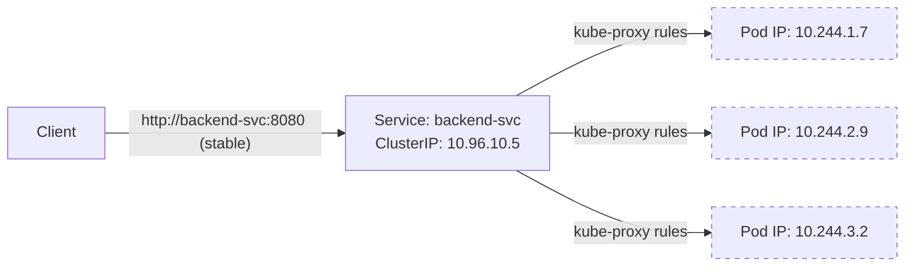
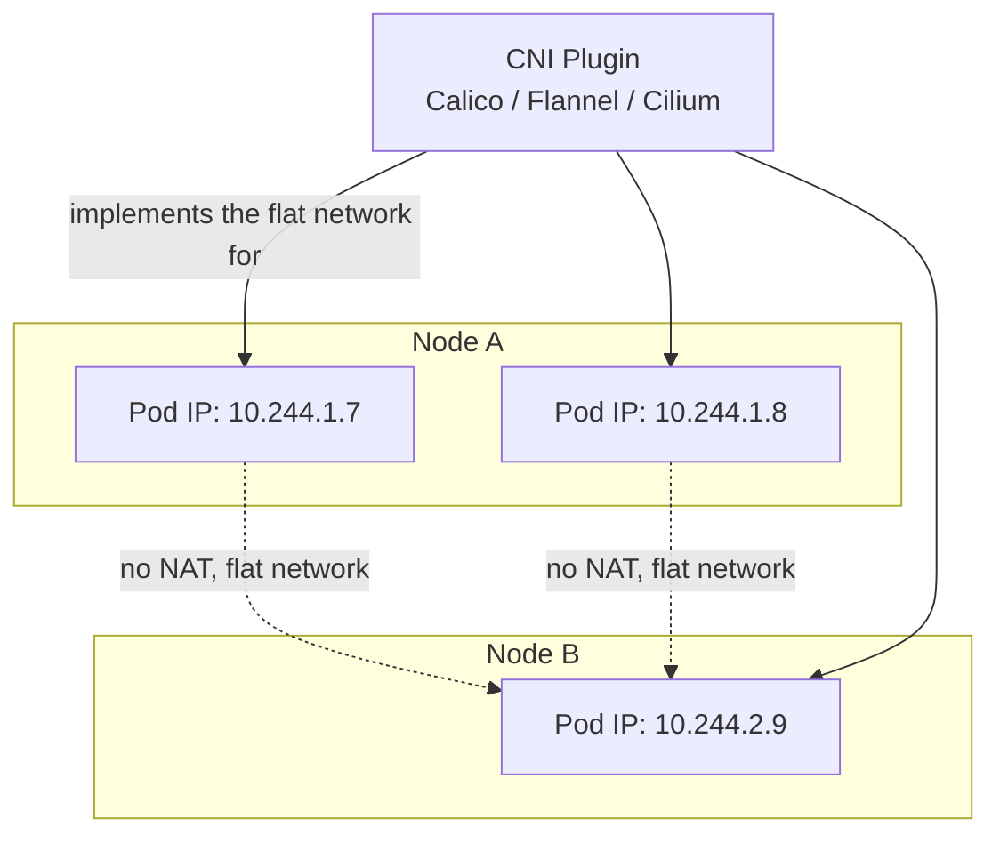

# Chapter 6 — Services and Networking

## Learning Objectives

By the end of this chapter you will be able to:

- Explain why Pod IPs are unreliable and why nothing should ever talk to a Pod IP directly
- Choose the correct Service type (`ClusterIP`, `NodePort`, `LoadBalancer`, `ExternalName`, headless) for a given scenario
- Write Service manifests and connect them to backing Pods via label selectors
- Explain conceptually how `kube-proxy` programs traffic routing rules on every node
- Explain how CoreDNS gives every Service a stable, predictable DNS name
- Describe the Kubernetes flat-network model and the role of a CNI plugin

## Prerequisites for This Chapter

- Chapter 4 (Pods and Workloads) — Pod IPs, labels, and selectors
- Chapter 5 (Deployments and ReplicaSets) — rolling updates, and how Pods are replaced (not repaired) during updates
- Networking Basics (Topic 2) — DNS resolution, ports, and basic load-balancing concepts

---

## 6.1 The Problem: Pod IPs Are Not Reliable Addresses

Every Pod gets its own IP address when it starts. That sounds useful until you remember Chapter 4 and 5's central lesson: **Pods are ephemeral.** A rolling update replaces old Pods with new ones. A crashed Pod gets recreated by its ReplicaSet. A node failure causes the scheduler to recreate the Pod elsewhere. Every single one of these ordinary, constant events produces a **brand-new Pod IP.**

If your frontend code had `10.244.1.7` hardcoded as "the backend," it would break the moment the backend Pod was recreated for any reason — including a routine deploy. Multiply this by dozens of microservices constantly rolling and rescheduling, and hardcoded Pod IPs become unworkable within minutes of real operation.

**The rule is absolute: nothing should ever talk to a Pod IP directly.** Kubernetes solves this with the **Service** object — a stable virtual IP address and DNS name that sits in front of a dynamic, ever-changing set of Pods. The Service doesn't care how many times its backing Pods are replaced; as long as *some* Pod matches its label selector (the same selector mechanism from Chapters 4 and 5), the Service keeps routing traffic correctly, transparently, with zero client-side changes.



The dashed Pod IPs in the diagram are the point: they change constantly. The Service's ClusterIP and DNS name are the only things a client should ever be configured to know about.

---

## 6.2 Service Types

A Service always uses a label selector to find its backing Pods — identical mechanism to a ReplicaSet's selector from Chapter 5. What differs between Service *types* is **who can reach the Service**, and **how**.

### ClusterIP (Default)

A stable, virtual IP reachable only from *inside* the cluster. This is what most Services should be — internal microservice-to-microservice traffic never needs to leave the cluster network.

```yaml
apiVersion: v1
kind: Service
metadata:
  name: backend-svc
spec:
  type: ClusterIP           # this is the default; can be omitted
  selector:
    app: backend             # routes to every Pod with this label
  ports:
    - port: 8080               # the Service's own port
      targetPort: 8080          # the port the container actually listens on
      protocol: TCP
```

```bash
kubectl apply -f backend-svc.yaml
kubectl get svc backend-svc
# NAME          TYPE        CLUSTER-IP     PORT(S)
# backend-svc   ClusterIP   10.96.10.5     8080/TCP
```

### NodePort

Exposes the Service on a static port (default range `30000–32767`) on **every node's IP** in the cluster, in addition to the internal ClusterIP. Useful for quick external access without a cloud load balancer — common in bare-metal or local development clusters.

```yaml
apiVersion: v1
kind: Service
metadata:
  name: frontend-svc
spec:
  type: NodePort
  selector:
    app: frontend
  ports:
    - port: 80
      targetPort: 8080
      nodePort: 30080          # optional — Kubernetes assigns one automatically if omitted
```

Any client that can reach *any* node's IP on port `30080` reaches this Service, regardless of which node the backing Pods actually run on — `kube-proxy` (6.4) handles that final hop.

### LoadBalancer

Requests an external load balancer from the underlying cloud provider (an AWS NLB/ELB, a GCP Load Balancer, etc.), automatically wired to route into the cluster. This is implemented by the **cloud-controller-manager** you saw in Chapter 2 — it watches for `LoadBalancer`-type Services and calls the cloud provider's API to provision the actual load balancer resource.

```yaml
apiVersion: v1
kind: Service
metadata:
  name: frontend-svc
spec:
  type: LoadBalancer
  selector:
    app: frontend
  ports:
    - port: 80
      targetPort: 8080
```

```bash
kubectl get svc frontend-svc
# NAME           TYPE           CLUSTER-IP     EXTERNAL-IP      PORT(S)
# frontend-svc   LoadBalancer   10.96.20.11    34.123.45.67     80:31842/TCP
```

On a local `kind` cluster there is no real cloud provider to provision anything, so `EXTERNAL-IP` stays `<pending>` forever unless you install a local implementation like MetalLB — this is expected and not a misconfiguration.

### ExternalName

No selector, no proxying — just a DNS-level alias. A Pod that looks up `legacy-db-svc` gets a `CNAME` response pointing at an external hostname. Useful for gradually migrating a dependency into the cluster, or referencing an external managed service (e.g., a cloud-managed database) using the same internal naming convention as everything else.

```yaml
apiVersion: v1
kind: Service
metadata:
  name: legacy-db-svc
spec:
  type: ExternalName
  externalName: legacy-db.mycompany-internal.com
```

### Headless Services

Setting `clusterIP: None` gives you a **headless Service** — DNS still resolves the Service name, but instead of returning one stable virtual IP, it returns the **individual Pod IPs directly** (one A/AAAA record per ready Pod). This trades away the single-stable-IP abstraction in exchange for **direct, individual Pod addressability** — necessary when clients need to talk to a *specific* Pod rather than "any one of them," which is exactly the case for StatefulSets (foreshadowing Chapter 12), where each Pod has a distinct identity and possibly its own persistent data.

```yaml
apiVersion: v1
kind: Service
metadata:
  name: database-headless
spec:
  clusterIP: None
  selector:
    app: database
  ports:
    - port: 5432
      targetPort: 5432
```

### Service Type Comparison

| Type | Reachable From | Gets a stable ClusterIP | Typical Use |
|---|---|---|---|
| `ClusterIP` (default) | Inside the cluster only | Yes | Internal service-to-service traffic |
| `NodePort` | Any node's IP, from outside the cluster | Yes (plus the NodePort) | Quick external access, local/bare-metal clusters |
| `LoadBalancer` | The internet, via a cloud LB | Yes (plus an external IP) | Public-facing production services on a cloud provider |
| `ExternalName` | N/A — DNS alias only | No | Referencing an external/legacy service by internal name |
| Headless (`clusterIP: None`) | Inside the cluster, per-Pod | No — returns individual Pod IPs | Direct Pod addressing, e.g. StatefulSets |

---

## 6.3 How Service Routing Actually Works: kube-proxy

Creating a Service object doesn't spin up an actual proxy process that traffic flows through in the traditional sense. Instead, **`kube-proxy`**, a component running on every node (introduced in Chapter 2), watches the API server for Services and their backing Endpoints, and continuously programs low-level packet-routing rules directly into the node's networking stack. When a packet destined for a Service's ClusterIP arrives, these rules rewrite its destination to one of the healthy backing Pod IPs *before the packet is ever routed anywhere* — there's no user-space proxy process actually forwarding the traffic. It's closer to a NAT.

`kube-proxy` supports a few implementation modes:

| Mode | Mechanism | Characteristics |
|---|---|---|
| `iptables` (long-time default) | Programs Linux `iptables` NAT rules; one chain of rules per Service | Simple, battle-tested; rule evaluation is roughly linear in the number of Services, which can matter at very large scale |
| `IPVS` | Uses the Linux kernel's IP Virtual Server, a purpose-built load-balancing table | Designed for large clusters; O(1) lookup regardless of Service count; supports more load-balancing algorithms (round-robin, least-connection, etc.) |
| `userspace` (legacy, effectively retired) | An actual user-space proxy process | Much slower; kept only for historical reference |

You don't typically choose this per-Service — it's a cluster-wide `kube-proxy` configuration set by whoever installed the cluster. What matters for you as an application operator is the *effect*: every node in the cluster has rules that know how to get a packet addressed to a Service's ClusterIP to one of its live backing Pods, no matter which node that Pod actually lives on.

```bash
# See which Pods are currently backing a Service (this is what kube-proxy watches)
kubectl get endpoints backend-svc

# NAME          ENDPOINTS
# backend-svc   10.244.1.7:8080,10.244.2.9:8080,10.244.3.2:8080
```

That `Endpoints` object (or the newer `EndpointSlice`) is the live, continuously-updated list of "which Pod IPs currently match this Service's selector and are ready." It is the missing link between "a Service has a selector" and "kube-proxy has concrete IPs to route to."

---

## 6.4 DNS and Service Discovery

Every Service, of every type except `ExternalName` (which *is* a DNS record itself), automatically gets a predictable DNS name, served by **CoreDNS** — the cluster's internal DNS server, itself running as Pods managed by a Deployment inside the cluster.

The full form is:

```
<service-name>.<namespace>.svc.cluster.local
```

```bash
# From any Pod in the same namespace, the short name is enough
curl http://backend-svc:8080

# From a Pod in a different namespace, include the namespace
curl http://backend-svc.payments.svc.cluster.local:8080

# Full form always works, from anywhere in the cluster
curl http://backend-svc.payments.svc.cluster.local:8080
```

This is precisely why application code should be configured with **Service names, never IPs, never even a fully-hardcoded Service DNS name if the short form works.** `http://backend-svc:8080` is portable across environments (dev/staging/prod) as long as each environment has a Service by that name in the relevant namespace — you're not baking any environment-specific network detail into your application.

```bash
# Verify DNS resolution from inside a debug Pod
kubectl run -it --rm dnsutils --image=busybox:1.36 --restart=Never -- nslookup backend-svc
```

---

## 6.5 The Kubernetes Networking Model

Kubernetes imposes a small set of strict requirements on any network implementation, often summarized as the "flat network" model:

- **Every Pod gets its own IP address** — no port-mapping tricks like Docker's `-p`, no shared IP-per-node.
- **Pods can reach all other Pods' IPs directly, cluster-wide, without NAT** — a Pod on node A can talk straight to a Pod's IP on node B, as if they were on the same simple flat network, even though physically they're on different machines.
- **Nodes can reach all Pods, and vice versa, without NAT.**

Kubernetes itself does not implement this network — it delegates the job to a pluggable **CNI (Container Network Interface) plugin**, installed as part of setting up the cluster. The CNI plugin is responsible for actually assigning Pod IPs, wiring up the virtual network interfaces, and making the "any Pod reaches any Pod" guarantee true across however many physical or virtual nodes make up the cluster.

Common CNI plugins you'll encounter:

| Plugin | Notable For |
|---|---|
| **Flannel** | Simple, lightweight, easy to reason about; a common default for learning clusters |
| **Calico** | Popular in production; supports NetworkPolicy enforcement and BGP-based routing at scale |
| **Cilium** | eBPF-based, high performance, increasingly popular for advanced observability and security features |

`kind`, which you set up in Chapter 3, ships with a default CNI already configured so you don't need to install one manually for this course. Full CNI internals — how overlay networks are built, BGP peering, eBPF datapaths — are advanced material outside the scope of this basics course; what matters here is knowing that **the CNI plugin is the thing beneath Services and kube-proxy that makes Pod-to-Pod networking work at all**, and that it's swappable per-cluster.



---

## Real-World Scenario: Frontend Calling Backend Through a Rolling Update

You run a two-tier application: a `frontend` Deployment and a `backend` Deployment, each exposed via a `ClusterIP` Service.

```yaml
apiVersion: v1
kind: Service
metadata:
  name: backend-svc
spec:
  selector:
    app: backend
  ports:
    - port: 8080
      targetPort: 8080
```

The frontend code is configured with one simple setting:

```yaml
env:
  - name: BACKEND_URL
    value: "http://backend-svc:8080"
```

Now suppose the backend team ships v2 and triggers a rolling update, exactly as in Chapter 5:

```bash
kubectl set image deployment/backend backend=myregistry/backend:v2.0.0
kubectl rollout status deployment/backend
```

Here's what happens from the frontend's point of view — **nothing.** As each old backend Pod is terminated and each new backend Pod becomes ready, the `Endpoints` object behind `backend-svc` is updated automatically: the old Pod's IP is removed, the new Pod's IP is added. `kube-proxy` on every node picks up that change and updates its routing rules within moments. The frontend was never configured with any Pod IP — it only ever knew `http://backend-svc:8080` — so from its perspective, in-flight and new requests simply keep landing on *some* healthy backend Pod throughout the entire rollout.

```bash
# While the rollout is in progress, this keeps returning healthy responses
# with zero client-side reconfiguration, because it never referenced a Pod IP
kubectl run -it --rm client-test --image=busybox:1.36 --restart=Never -- \
  wget -qO- http://backend-svc:8080/health
```

This is the entire point of the Service abstraction: the rolling update mechanics from Chapter 5 (Pods being replaced) and the stable addressing from this chapter (Services never changing) combine to produce a deployment that is, from the client's perspective, invisible.

---

## Best Practices

- Never hardcode a Pod IP anywhere in application configuration — always use a Service name.
- Default to `ClusterIP`; only use `NodePort`/`LoadBalancer` for Services that genuinely need external traffic.
- Use the short DNS form (`service-name`) within the same namespace, and the namespaced form (`service-name.namespace`) for cross-namespace calls, to keep manifests portable across environments.
- Use headless Services only when you specifically need per-Pod addressability (e.g., peer discovery in a StatefulSet) — not as a default.
- Match Service `selector` labels carefully against Deployment Pod template labels; a typo produces a Service with zero endpoints and no error message, just silently failed connections.
- For production external traffic on a cloud provider, prefer `LoadBalancer` (or Ingress, Chapter 11) over `NodePort`, which exposes a raw port on every node and is not typically meant for direct internet exposure.

## Common Mistakes

- Configuring an application with a Pod IP captured once during testing, which breaks the next time that Pod is replaced.
- Mismatched labels between a Service's selector and a Deployment's Pod template, resulting in a Service with no endpoints and confusing "connection refused" errors.
- Expecting `LoadBalancer` to work out of the box on a local `kind`/minikube cluster without a cloud provider or MetalLB installed.
- Forgetting that `targetPort` (the container's actual port) can differ from `port` (the Service's exposed port), and mismatching the two.

*(The full catalog of Kubernetes pitfalls is covered in Chapter 16 — Common Mistakes and Pitfalls.)*

---

## Summary

- Pod IPs are ephemeral and unreliable; Services provide a stable virtual IP and DNS name in front of a dynamic set of Pods, selected via labels.
- Service types: `ClusterIP` (internal-only, default), `NodePort` (exposes a port on every node), `LoadBalancer` (provisions a cloud load balancer via the cloud-controller-manager), `ExternalName` (a DNS CNAME alias), and headless (`clusterIP: None`, direct per-Pod DNS resolution).
- `kube-proxy` runs on every node and programs routing rules (via `iptables` or `IPVS` mode) so traffic addressed to a Service IP reaches a live backing Pod.
- CoreDNS gives every Service a predictable DNS name (`service.namespace.svc.cluster.local`), so applications should reference Services by name, never by IP.
- The Kubernetes networking model guarantees every Pod has its own IP and can reach every other Pod without NAT — implemented by a pluggable CNI plugin (Flannel, Calico, Cilium).
- Because Services provide stable addressing while Deployments replace Pods underneath, rolling updates are invisible to clients that only ever reference the Service.

---

## Knowledge Check

1. Why is it unsafe to hardcode a Pod's IP address in another service's configuration?
2. Compare `ClusterIP`, `NodePort`, and `LoadBalancer` — who can reach each one, and when would you choose each?
3. What is a headless Service, and what specific problem does it solve that a normal `ClusterIP` Service cannot?
4. What is the role of `kube-proxy`, and what are the two main modes it can operate in?
5. What DNS name would a Pod in the `checkout` namespace use to reach a Service named `inventory-svc` running in the `warehouse` namespace?
6. During a rolling update of a backend Deployment, why does a frontend Pod calling the backend by Service name experience no disruption in where its traffic is routed?

---

## Hands-On Exercise

Using your local `kind` cluster:

1. Apply the `backend` Deployment from Chapter 5's `web-app` example (rename it `backend` and its image tag as needed, 3 replicas), then create the `backend-svc` ClusterIP Service from section 6.2.
2. Inspect the live backing Pods: `kubectl get endpoints backend-svc`. Confirm the IPs match `kubectl get pods -l app=backend -o wide`.
3. Launch a temporary debug Pod and call the Service by name:
   ```bash
   kubectl run -it --rm client-test --image=busybox:1.36 --restart=Never -- \
     wget -qO- http://backend-svc:8080
   ```
4. Delete one backend Pod (`kubectl delete pod <name>`) and immediately re-run `kubectl get endpoints backend-svc` — observe the old IP disappear and a new one appear once the ReplicaSet replaces it, with no changes needed to the Service itself.
5. Create a `NodePort` version of the Service (a second Service object, `backend-nodeport`, same selector, `type: NodePort`). Find its assigned port with `kubectl get svc backend-nodeport`, then reach it from your host machine via the `kind` node's address (see Chapter 3 for how `kind` exposes node ports, or use `kubectl port-forward svc/backend-nodeport 8080:8080` as a simpler alternative).
6. Create a headless Service (`clusterIP: None`) with the same selector, and run `kubectl run -it --rm dnsutils --image=busybox:1.36 --restart=Never -- nslookup backend-headless` — observe multiple A records returned (one per Pod) instead of a single ClusterIP.
7. Clean up: `kubectl delete deployment backend; kubectl delete svc backend-svc backend-nodeport backend-headless`.

---

## Further Reading

- kubernetes.io/docs/concepts/services-networking/service/
- kubernetes.io/docs/concepts/services-networking/dns-pod-service/
- kubernetes.io/docs/reference/networking/virtual-ips/
- kubernetes.io/docs/concepts/cluster-administration/networking/
- kubernetes.io/docs/concepts/services-networking/service/#headless-services

---

<div style="display:flex;justify-content:space-between;align-items:center;">
  <a href="./05-deployments-and-replicasets.md">← Previous: Deployments and ReplicaSets</a>
  <a href="./00-index.md">🏠 Index</a>
  <a href="./07-configmaps-and-secrets.md">Next: ConfigMaps and Secrets →</a>
</div>
