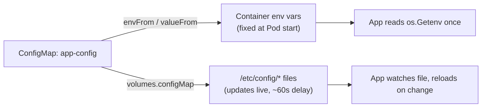

# Chapter 7 — ConfigMaps and Secrets

> **Kubernetes Basics — Chapter 7 of 19**

## Learning Objectives

By the end of this chapter you will be able to:

- Explain the externalized-configuration principle and why baking config into an image is an anti-pattern
- Create ConfigMaps from literals, files, and YAML manifests
- Consume ConfigMaps as environment variables and as mounted volumes, and choose correctly between them
- Explain why Secrets are encoded, not encrypted, and what that means for your security posture
- Identify and use the three common Secret types: `Opaque`, `kubernetes.io/dockerconfigjson`, and `kubernetes.io/tls`
- Describe how encryption at rest and external secret managers fit into a production security story
- Use immutable ConfigMaps/Secrets and the versioned-name pattern to keep rollouts and rollbacks clean

---

## Prerequisites for This Chapter

- **Chapter 4 — Pods and Workloads**: you should be comfortable with Pod YAML, containers, and volumes at a basic level.
- **Chapter 5 — Deployments and ReplicaSets**: this chapter assumes you understand how a Deployment rolls out a new Pod template.
- **Chapter 6 — Services and Networking**: not strictly required for this chapter, but the running example builds on the idea of an app needing to reach a database.
- Comfort with `kubectl apply -f`, `kubectl get`, and `kubectl describe` from earlier chapters.

---

## 7.1 The Externalized-Configuration Principle

Imagine you build a container image for your API server. The database connection string is hardcoded inside the application code as `postgres://db.dev.internal:5432/myapp`. It works fine in development. Now you need to deploy the exact same application to staging and production, where the database host is different.

You have two bad options:

1. **Rebuild the image for every environment.** Now you have `myapp:dev`, `myapp:staging`, `myapp:prod` — three different images built from the same source, and you can no longer say "the image that passed CI is the image running in production," because the production image was built separately with different baked-in values. This defeats the entire point of a CI/CD pipeline that promotes a single artifact through environments (Chapter 5, Topic 5).
2. **Hardcode logic into the app** that branches on an environment name compiled into the binary. This couples your application code to deployment concerns, and every new environment requires a code change and a redeploy.

The [12-factor app](https://12factor.net/config) methodology names this problem directly in its third factor: **"store config in the environment, not in the code."** Configuration is anything that varies between deploys — database URLs, API keys, feature flags, hostnames, log levels. Code is everything that doesn't change between deploys. If a value differs between dev, staging, and prod, it is configuration, and it does not belong in the image.

Kubernetes gives you two first-class objects for this: **ConfigMap** for non-sensitive configuration, and **Secret** for sensitive configuration. Both let you build one image, push it once, and run it anywhere by injecting different configuration values into the Pod at deploy time.

```
┌────────────────────────┐        ┌────────────────────────┐
│   myapp:v1.4.2 (image)  │        │   myapp:v1.4.2 (image)  │
│   — same image, both    │        │   — same image, both    │
│     environments        │        │     environments        │
└───────────┬─────────────┘        └───────────┬─────────────┘
            │                                   │
   + ConfigMap (staging)                + ConfigMap (prod)
   DB_HOST=db.staging.internal          DB_HOST=db.prod.internal
            │                                   │
            ▼                                   ▼
     Pod in staging namespace           Pod in prod namespace
```

The image never changes. Only the ConfigMap/Secret referenced by the Deployment changes between environments.

---

## 7.2 ConfigMap: A Key-Value Store for Non-Sensitive Configuration

A **ConfigMap** is a Kubernetes object that stores configuration data as key-value pairs. It is *not* encrypted or access-restricted beyond normal Kubernetes RBAC — treat it as a place for things you would be comfortable pasting into a Slack channel: URLs, feature flags, log levels, non-secret file contents like an `nginx.conf` template.

There are three ways to create a ConfigMap.

### Method 1 — `--from-literal`

Good for one or two quick key-value pairs, often used ad hoc or in scripts.

```bash
kubectl create configmap app-config \
  --from-literal=LOG_LEVEL=info \
  --from-literal=FEATURE_DARK_MODE=enabled \
  --from-literal=API_TIMEOUT_SECONDS=30
```

### Method 2 — `--from-file`

Good for turning an entire config file (e.g., `nginx.conf`, `application.properties`) into a ConfigMap, where each file becomes one key and the file's contents become the value.

```bash
# Single file — the key defaults to the filename
kubectl create configmap nginx-config --from-file=nginx.conf

# Explicit key name
kubectl create configmap nginx-config --from-file=custom.conf=nginx.conf

# Entire directory — every file in the directory becomes a key
kubectl create configmap app-config-dir --from-file=./config/
```

### Method 3 — YAML Manifest (declarative, recommended for GitOps)

This is the approach you should use for anything checked into version control, because it is reviewable in a pull request and reproducible with `kubectl apply -f`.

```yaml
# app-config.yaml
apiVersion: v1
kind: ConfigMap
metadata:
  name: app-config
  namespace: default
data:
  LOG_LEVEL: "info"
  API_TIMEOUT_SECONDS: "30"
  FEATURE_DARK_MODE: "enabled"
  # Multi-line values are supported too — useful for whole config files
  app.properties: |
    server.port=8080
    server.timeout=5000
    cache.enabled=true
```

```bash
kubectl apply -f app-config.yaml
kubectl get configmap app-config -o yaml
kubectl describe configmap app-config
```

All values in `data` are stored as strings, even numbers — this is why `API_TIMEOUT_SECONDS` is quoted. If you need to store binary data, use the `binaryData` field instead, which base64-encodes the value.

---

## 7.3 Consuming a ConfigMap in a Pod

There are two fundamentally different ways to get ConfigMap data into a running container, and the choice between them is one of the most consequential configuration decisions you'll make.

### Option A — Environment Variables

```yaml
apiVersion: v1
kind: Pod
metadata:
  name: app-env-demo
spec:
  containers:
    - name: app
      image: myapp:v1.4.2
      # Import every key in the ConfigMap as an env var
      envFrom:
        - configMapRef:
            name: app-config
      # Or, import a single specific key with a custom env var name
      env:
        - name: LOG_LEVEL_OVERRIDE
          valueFrom:
            configMapKeyRef:
              name: app-config
              key: LOG_LEVEL
```

### Option B — Mounted Volume

```yaml
apiVersion: v1
kind: Pod
metadata:
  name: app-volume-demo
spec:
  containers:
    - name: app
      image: myapp:v1.4.2
      volumeMounts:
        - name: config-volume
          mountPath: /etc/config
          readOnly: true
  volumes:
    - name: config-volume
      configMap:
        name: app-config
```

With the volume approach, each key in the ConfigMap's `data` becomes a **file** inside `/etc/config`, and the file's contents are the value. So `/etc/config/LOG_LEVEL` would contain the text `info`, and `/etc/config/app.properties` would contain the full multi-line properties file.

### The Tradeoff: Env Vars vs. Mounted Volumes

| | Environment Variables | Mounted Volume |
|---|---|---|
| Simplicity | Very simple — `envFrom`/`env` | Slightly more setup (volume + volumeMount) |
| Live updates | **No.** Env vars are injected once at container start. Changing the ConfigMap has no effect until the Pod is restarted. | **Yes** (with a propagation delay of up to ~1 minute, governed by kubelet sync period). The kubelet watches the mounted ConfigMap and updates the files in place. |
| Best for | Values read once at startup: initial log level, feature flags read once, simple key=value settings | Config files an app is designed to hot-reload: nginx configs, TLS certs bundled as config, JSON/YAML app config watched by a file-watcher |
| Gotcha | A Pod restart (Deployment rollout, crash, reschedule) is required to see updates | The application itself must support watching the file for changes — Kubernetes only updates the file, it does not tell your app to reread it |

A good mental model: **environment variables are a one-time injection at process start; a mounted ConfigMap is a live window into etcd** (with some lag). If your application already knows how to watch a file and reload (many use libraries like `viper` in Go or `chokidar` in Node.js for exactly this), mounting is more powerful — you can push a config change without a rollout. If your app just reads `os.Getenv()` once at boot, env vars are simpler and there's no reason to reach for a volume.



---

## 7.4 Secrets: Like ConfigMaps, but for Sensitive Data

A **Secret** looks and behaves almost exactly like a ConfigMap — same `data` field, same consumption methods (`envFrom`, `env.valueFrom.secretKeyRef`, volume mounts) — but it is intended for sensitive values: passwords, API tokens, TLS private keys, SSH keys.

### The Critical Warning: Encoded Is Not Encrypted

```bash
kubectl create secret generic db-secret \
  --from-literal=DB_PASSWORD='SuperSecret123!'

kubectl get secret db-secret -o jsonpath='{.data.DB_PASSWORD}'
# U3VwZXJTZWNyZXQxMjMh

echo "U3VwZXJTZWNyZXQxMjMh" | base64 -d
# SuperSecret123!
```

**That is the entire "encryption."** Kubernetes Secrets store values as base64-encoded strings, not encrypted ciphertext. Base64 is an *encoding*, not a cipher — it has no key, and anyone can reverse it in one command, as shown above. This is a genuinely common misconception, and it matters because it changes your threat model:

- Anyone with `kubectl get secret -o yaml` permission (i.e., RBAC read access to Secrets in that namespace) can trivially read the plaintext.
- Anyone with direct access to the etcd datastore backing the cluster can read every Secret in the cluster in plaintext, unless encryption at rest is explicitly configured (see 7.5).
- Secrets are **not** encrypted in transit to a lesser degree either — they're protected only insofar as all API server traffic is TLS-protected, same as everything else in the cluster.

Do not treat "it's a Secret object" as "it's safe." It gives you a small amount of engineering convenience (it won't accidentally show up in a `kubectl get pod -o yaml` the way an inline env value would, and tools generally know to mask fields named `*secret*`) but it is not cryptographic protection on its own.

### Common Secret Types

```yaml
apiVersion: v1
kind: Secret
metadata:
  name: db-secret
type: Opaque          # generic, unstructured key-value secret — the default
data:
  DB_PASSWORD: U3VwZXJTZWNyZXQxMjMh   # base64 of "SuperSecret123!"
```

| Type | Purpose | How it's created |
|---|---|---|
| `Opaque` | Generic key-value secret — the default type, used for arbitrary credentials, tokens, API keys | `kubectl create secret generic` |
| `kubernetes.io/dockerconfigjson` | Credentials for pulling images from a private container registry | `kubectl create secret docker-registry` |
| `kubernetes.io/tls` | A TLS certificate and private key pair, consumed by Ingress controllers (Chapter 11) for HTTPS termination | `kubectl create secret tls` |

```bash
# Opaque — imperative, avoids putting the plaintext password in a YAML file/git history
kubectl create secret generic db-secret \
  --from-literal=DB_PASSWORD='SuperSecret123!'

# dockerconfigjson — for pulling from a private registry (e.g. private ECR, GHCR, Docker Hub)
kubectl create secret docker-registry regcred \
  --docker-server=myregistry.example.com \
  --docker-username=deploy-bot \
  --docker-password='RegistryToken456!' \
  --docker-email=devops@example.com

# tls — certificate + key for Ingress TLS termination
kubectl create secret tls my-tls-secret \
  --cert=path/to/tls.crt \
  --key=path/to/tls.key
```

Notice these are all created **imperatively** rather than from a YAML file checked into git. This is deliberate: a YAML manifest with a Secret's `data` field is only base64, not encrypted, so committing it to a git repository is equivalent to committing the plaintext password. If you must manage Secrets declaratively (GitOps), use a tool designed for that — Sealed Secrets or SOPS-encrypted manifests are common choices, and are covered further in Topic 9 (Advanced Kubernetes).

---

## 7.5 Encryption at Rest and External Secret Managers

Two things you should know exist, even though full depth is out of scope for this "basics" course:

**Encryption at rest for etcd.** By default, a Secret's base64 value is stored *as-is* in etcd — anyone with etcd access reads plaintext. Production clusters should configure an `EncryptionConfiguration` on the API server so that Secret data is encrypted before being written to etcd (using a provider like `aescbc` or a cloud KMS integration such as AWS KMS, GCP KMS, or Azure Key Vault). This protects you against etcd disk/backup exposure, though it does *not* protect against someone with legitimate `kubectl get secret` RBAC access — that's a separate authorization problem.

**External secret managers.** The production-grade pattern used by most serious organizations is to not store the actual secret material in Kubernetes at all. Instead:

- Secrets live in a dedicated secret manager — **HashiCorp Vault**, **AWS Secrets Manager**, **GCP Secret Manager**, or **Azure Key Vault**.
- A controller like the **External Secrets Operator** watches a custom `ExternalSecret` resource, fetches the real value from the external store, and materializes it as a native Kubernetes Secret in-cluster — kept in sync automatically.
- This gives you centralized audit logging, automatic rotation, fine-grained access policies, and a single source of truth that isn't tied to any one cluster.

```
┌──────────────────────┐     watches      ┌─────────────────────┐
│  HashiCorp Vault /     │ ◄──────────────  │ External Secrets     │
│  AWS Secrets Manager   │ ──────────────►  │ Operator (in-cluster)│
└──────────────────────┘   fetches value   └──────────┬───────────┘
                                                        │ creates/updates
                                                        ▼
                                            ┌─────────────────────┐
                                            │ native Secret object │
                                            │ (consumed by Pods)   │
                                            └─────────────────────┘
```

You won't build this in this course — it's covered in Topic 9 — but you should recognize the pattern and the vocabulary when you see it in a job description or a production cluster's manifests.

---

## 7.6 Immutable ConfigMaps and Secrets

Since Kubernetes 1.21, both ConfigMaps and Secrets support an `immutable: true` field:

```yaml
apiVersion: v1
kind: ConfigMap
metadata:
  name: app-config-v2
data:
  LOG_LEVEL: "warn"
  API_TIMEOUT_SECONDS: "45"
immutable: true
```

Once `immutable: true` is set, any attempt to change the `data` or `binaryData` fields is rejected by the API server — you'd get an error, not a silent update. To ship new values, you create a brand-new object (`app-config-v3`) rather than editing the existing one.

**Why this exists — two reasons:**

1. **Performance.** For a mutable ConfigMap consumed via a volume mount, the kubelet on every node running a Pod that uses it must keep a watch open to detect changes and update the mounted files. In a large cluster with thousands of ConfigMaps, this adds real, measurable load to the API server. An immutable ConfigMap tells the kubelet "this will never change," so it can skip the watch entirely.
2. **Safety.** A mutable ConfigMap can be edited directly with `kubectl edit configmap app-config` — a live, in-place change with no review, no diff, and no record beyond the Kubernetes audit log. This is the same class of danger as SSHing into a production server and hand-editing a config file: it works until it doesn't, and nobody can reconstruct what changed or why.

### The Versioned-Name Pattern

Because an immutable object can never be updated, the accompanying convention is to **version the name**: `app-config-v1`, `app-config-v2`, `app-config-v3`. A Deployment references the specific version it needs:

```yaml
apiVersion: apps/v1
kind: Deployment
metadata:
  name: myapp
spec:
  template:
    spec:
      containers:
        - name: app
          image: myapp:v1.4.2
          envFrom:
            - configMapRef:
                name: app-config-v2   # bump to app-config-v3 to roll out new config
```

To change configuration, you create `app-config-v3`, update the Deployment's `envFrom` to point at it, and `kubectl apply` the Deployment. This triggers a normal, observable **rolling update** (Chapter 5) — the same rollout mechanism, history, and `kubectl rollout undo` safety net you already use for image changes. Rolling back a bad config change becomes exactly as easy as rolling back a bad image: `kubectl rollout undo deployment/myapp`. Compare that to editing a mutable ConfigMap in place, which leaves no rollout history at all.

---

## 7.7 Real-World Scenario: Database URL, Password, and a Private Registry

Your team runs an internal API that connects to a PostgreSQL database. The database *hostname* is not sensitive (it's an internal DNS name useless without credentials), but the database *password* is. The image is pulled from a private container registry, so the Pod also needs an `imagePullSecret`.

```yaml
# db-config.yaml — non-sensitive connection info
apiVersion: v1
kind: ConfigMap
metadata:
  name: db-config-v1
  namespace: production
immutable: true
data:
  DB_HOST: "postgres.production.svc.cluster.local"
  DB_PORT: "5432"
  DB_NAME: "orders"
---
# db-secret.yaml — sensitive credential (created imperatively in real life;
# shown here in YAML only for illustration — do NOT commit real base64 secrets to git)
apiVersion: v1
kind: Secret
metadata:
  name: db-secret-v1
  namespace: production
type: Opaque
immutable: true
data:
  DB_PASSWORD: U3VwZXJTZWNyZXQxMjMh   # base64 of "SuperSecret123!"
```

```bash
# In practice, create the Secret imperatively so the plaintext never touches disk/git:
kubectl create secret generic db-secret-v1 \
  --namespace=production \
  --from-literal=DB_PASSWORD='SuperSecret123!'

# The imagePullSecret for a private registry
kubectl create secret docker-registry regcred \
  --namespace=production \
  --docker-server=registry.example.com \
  --docker-username=deploy-bot \
  --docker-password="$REGISTRY_TOKEN" \
  --docker-email=devops@example.com
```

```yaml
# order-api-deployment.yaml
apiVersion: apps/v1
kind: Deployment
metadata:
  name: order-api
  namespace: production
spec:
  replicas: 3
  selector:
    matchLabels:
      app: order-api
  template:
    metadata:
      labels:
        app: order-api
    spec:
      imagePullSecrets:
        - name: regcred                # lets kubelet pull from the private registry
      containers:
        - name: order-api
          image: registry.example.com/order-api:v2.3.0
          envFrom:
            - configMapRef:
                name: db-config-v1      # DB_HOST, DB_PORT, DB_NAME
          env:
            - name: DB_PASSWORD
              valueFrom:
                secretKeyRef:
                  name: db-secret-v1
                  key: DB_PASSWORD
          ports:
            - containerPort: 8080
```

Notice the pattern: the non-sensitive `DB_HOST`/`DB_PORT`/`DB_NAME` come from a ConfigMap via `envFrom` (bulk import), while the sensitive `DB_PASSWORD` is deliberately pulled with a specific `secretKeyRef` rather than a blanket `secretRef` in `envFrom` — this is a common convention that makes it easy to grep a manifest and see exactly which secret keys a container consumes, rather than importing "everything in the secret" implicitly.

```bash
kubectl apply -f db-config.yaml
kubectl apply -f order-api-deployment.yaml
kubectl get pods -n production -l app=order-api
kubectl exec -it deploy/order-api -n production -- env | grep DB_
```

---

## Best Practices

- Never commit a Secret manifest with real base64 values to git. Create Secrets imperatively, from a secure CI/CD variable store, or via a GitOps-safe encryption tool (Sealed Secrets, SOPS).
- Use `envFrom`/`configMapRef` for bulk, non-sensitive config; use explicit `secretKeyRef` per key for sensitive values so the manifest documents exactly what's consumed.
- Prefer mounted volumes over env vars for configuration your application is built to hot-reload; use env vars for simple values read once at boot.
- Mark ConfigMaps and Secrets `immutable: true` once they stabilize, and adopt the versioned-name pattern (`-v1`, `-v2`, ...) so config changes go through the same reviewable rollout/rollback path as image changes.
- Enable etcd encryption at rest in any cluster you operate in production, and evaluate an external secret manager (Vault, AWS/GCP/Azure secret services) as your team and secret count grows.
- Restrict RBAC read access to Secrets tightly — `get`/`list` on Secrets is equivalent to read access to plaintext credentials for anyone with that permission.

---

## Common Mistakes

- Assuming a Kubernetes Secret is encrypted because it's base64-encoded and called "Secret" — it is trivially reversible without a key.
- Committing rendered Secret YAML (with real base64 data) into a git repository.
- Changing a mutable ConfigMap in place with `kubectl edit` and wondering why there's no rollout history or rollback path.
- Using `envFrom` and expecting a config change to take effect without restarting the Pod — env vars are frozen at container start.
- Forgetting `imagePullSecrets` on the Pod spec when pulling from a private registry, resulting in `ImagePullBackOff`.

---

## Summary

- Configuration that varies between environments belongs outside the container image — the 12-factor principle of "config in the environment."
- ConfigMaps hold non-sensitive key-value config; create them via `--from-literal`, `--from-file`, or a YAML manifest.
- Consume a ConfigMap as environment variables (simple, requires restart to update) or as a mounted volume (files, can update live with a short propagation delay).
- Secrets look like ConfigMaps but are intended for sensitive data — remember that the default storage is base64-*encoded*, not encrypted, and is trivially reversible by anyone with API or etcd access.
- Common Secret types: `Opaque` (generic), `kubernetes.io/dockerconfigjson` (registry credentials), `kubernetes.io/tls` (certificate + key).
- Real encryption-at-rest requires configuring `EncryptionConfiguration` on etcd; real production-grade secret management usually means an external secret manager plus an operator that syncs values into the cluster.
- Immutable ConfigMaps/Secrets, combined with versioned names, give you performance benefits and turn config changes into safe, rollback-able Deployment rollouts.

---

## Knowledge Check

1. Why is baking a database URL directly into a container image considered an anti-pattern, even if it "works"?
2. What is the practical difference between consuming a ConfigMap via `envFrom` versus via a mounted volume, in terms of how config updates propagate?
3. A teammate says, "It's fine, it's stored in a Secret, so it's encrypted." What is wrong with this statement, and how would you demonstrate it?
4. Name the three common Secret `type` values covered in this chapter and what each is used for.
5. What problem does `immutable: true` solve, and why is it usually paired with a versioned object name like `app-config-v2`?
6. Why might a production team choose to fetch secrets from HashiCorp Vault instead of storing them directly as Kubernetes Secrets?

---

## Hands-On Exercise

**Goal:** Create a ConfigMap and Secret, consume both in a Pod two different ways, and observe the live-update behavior of a mounted ConfigMap.

1. Create a local cluster if you don't already have one running: `kind create cluster --name k8s-basics`
2. Create a ConfigMap from a YAML manifest with at least three keys, including one multi-line value (a small `.conf`-style file).
3. Create an `Opaque` Secret imperatively with `kubectl create secret generic` containing a fake `API_KEY`.
4. Write a Pod manifest that:
   - Imports all ConfigMap keys as environment variables via `envFrom`
   - Imports the `API_KEY` from the Secret via `env.valueFrom.secretKeyRef`
   - Also mounts the same ConfigMap as a volume at `/etc/config`
5. Apply the Pod and verify with `kubectl exec <pod> -- env` that the env vars are present, and `kubectl exec <pod> -- ls /etc/config` / `cat` that the files are present.
6. With the Pod still running, edit the ConfigMap's data (`kubectl edit configmap ...`) and change one value. Wait about a minute, then `cat` the mounted file again inside the Pod — confirm it updated. Then check the environment variable again — confirm it did **not** update, proving the env-var-vs-volume propagation difference firsthand.
7. Clean up: `kubectl delete pod`, `kubectl delete configmap`, `kubectl delete secret`.

---

## Further Reading

- [Kubernetes Docs — ConfigMaps](https://kubernetes.io/docs/concepts/configuration/configmap/)
- [Kubernetes Docs — Secrets](https://kubernetes.io/docs/concepts/configuration/secret/)
- [Kubernetes Docs — Encrypting Confidential Data at Rest](https://kubernetes.io/docs/tasks/administer-cluster/encrypt-data/)
- [Kubernetes Docs — Pull an Image from a Private Registry](https://kubernetes.io/docs/tasks/configure-pod-container/pull-image-private-registry/)
- [12-Factor App — Config](https://12factor.net/config)

---

<div style="display:flex;justify-content:space-between;align-items:center;">
  <a href="./06-services-and-networking.md">← Previous: Services and Networking</a>
  <a href="./00-index.md">🏠 Index</a>
  <a href="./08-storage-and-persistent-volumes.md">Next: Storage and Persistent Volumes →</a>
</div>
