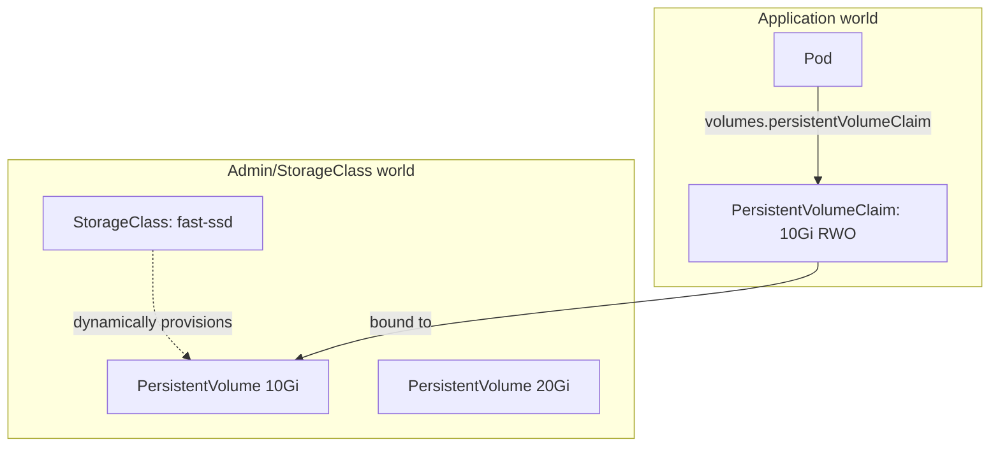
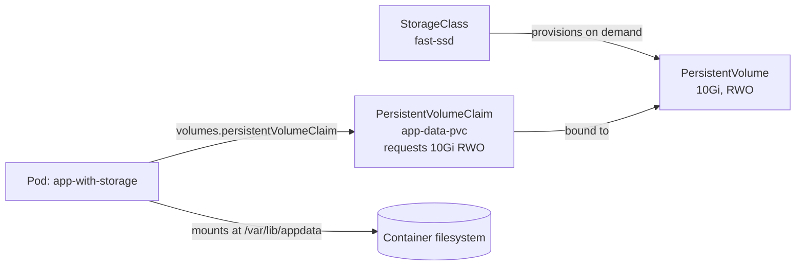

# Chapter 8 — Storage and Persistent Volumes

> **Kubernetes Basics — Chapter 8 of 19**

## Learning Objectives

By the end of this chapter you will be able to:

- Explain why container and Pod storage is ephemeral by default, and demonstrate it
- Use `emptyDir` and `hostPath` volumes, and explain why `hostPath` is a production anti-pattern
- Explain the PersistentVolume (PV) / PersistentVolumeClaim (PVC) abstraction and why it exists
- Configure a StorageClass for dynamic provisioning and explain the `provisioner` field
- Choose the correct access mode (`ReadWriteOnce`, `ReadOnlyMany`, `ReadWriteMany`) for a given workload
- Choose the correct reclaim policy (`Retain` vs `Delete`) based on data-loss tolerance
- Wire a StorageClass, PVC, and Pod together end to end and diagram the relationship

---

## Prerequisites for This Chapter

- **Chapter 4 — Pods and Workloads**: you need to be comfortable with Pod YAML and the `volumes`/`volumeMounts` fields at a basic level.
- **Chapter 7 — ConfigMaps and Secrets**: not a hard dependency, but this chapter continues the volume-mounting concepts introduced there.
- Familiarity with the idea of a "node" from Chapter 2 (Architecture and Internals) — storage in Kubernetes is deeply tied to which node a Pod is scheduled on.

---

## 8.1 The Ephemeral Storage Baseline

By default, everything written inside a container's filesystem lives only as long as that specific container instance. If the container crashes and is restarted, if the Pod is deleted, or if the Pod is rescheduled to a different node, the data is gone. This is the same copy-on-write, disposable-filesystem model you learned in Docker (Topic 4) — Kubernetes does not change that default, it just gives you tools to opt out of it where needed.

You can prove this to yourself with the simplest possible experiment:

```bash
kubectl run scratch --image=busybox --restart=Never -- sh -c "sleep 3600"
kubectl exec scratch -- sh -c "echo 'important data' > /tmp/data.txt"
kubectl exec scratch -- cat /tmp/data.txt
# important data

kubectl delete pod scratch
kubectl run scratch --image=busybox --restart=Never -- sh -c "sleep 3600"
kubectl exec scratch -- cat /tmp/data.txt
# cat: /tmp/data.txt: No such file or directory
```

The moment the Pod is deleted, the file is gone forever — a brand-new Pod, even with the same name and image, starts with a completely fresh filesystem.

### `emptyDir` — Scoped to the Pod's Lifetime

An `emptyDir` volume is a directory that Kubernetes creates when a Pod is scheduled, and deletes when the Pod is removed. Critically, it is **shared across every container in the same Pod** — this makes it the standard mechanism for sidecar patterns where one container produces data and another consumes it.

```yaml
apiVersion: v1
kind: Pod
metadata:
  name: log-processor
spec:
  containers:
    - name: app
      image: myapp:v1.0
      volumeMounts:
        - name: shared-logs
          mountPath: /var/log/app
    - name: log-shipper
      image: fluent-bit:latest
      volumeMounts:
        - name: shared-logs
          mountPath: /var/log/app
          readOnly: true
  volumes:
    - name: shared-logs
      emptyDir: {}
```

Here, the `app` container writes logs to `/var/log/app`, and the `log-shipper` sidecar reads from the same physical directory (mounted at the same path, but the two containers still have separate filesystems everywhere else) and ships them elsewhere. If the Pod is deleted, the `emptyDir` is deleted with it — it survives container restarts *within* the Pod, but not Pod deletion.

`emptyDir` is also commonly used simply as **scratch space** — sorting a large file, caching a downloaded asset, or any working directory an app needs that doesn't need to outlive the Pod.

### `hostPath` — Mounting the Node's Filesystem (Anti-Pattern in Production)

A `hostPath` volume mounts a path from the **underlying node's** filesystem directly into the Pod.

```yaml
apiVersion: v1
kind: Pod
metadata:
  name: node-inspector
spec:
  containers:
    - name: inspector
      image: busybox
      command: ["sh", "-c", "ls /host-var-log && sleep 3600"]
      volumeMounts:
        - name: host-logs
          mountPath: /host-var-log
  volumes:
    - name: host-logs
      hostPath:
        path: /var/log
        type: Directory
```

`hostPath` has legitimate, narrow uses — a DaemonSet (Chapter 12) that needs to read node-level logs or the Docker socket for monitoring purposes, for example. But using it as general application storage is a well-known anti-pattern, for concrete reasons:

- **It ties the Pod to a specific node.** The data at `/var/log` on `node-1` does not exist on `node-2`. If the scheduler places a rescheduled Pod on a different node, it sees an empty (or different) directory — silently, with no error.
- **It breaks portability.** The manifest now implicitly depends on the host machine having a specific path with specific permissions. It works on your bare-metal test node and then fails mysteriously in a managed cloud cluster (EKS/GKE/AKS) where nodes are ephemeral and rotate frequently.
- **It is a security risk.** A container with a `hostPath` mount into a sensitive part of the node's filesystem (or the Docker/containerd socket) can potentially read node secrets, other Pods' data, or escalate to control the node itself. Cluster admission policies in production commonly block `hostPath` for regular workloads entirely.

**Rule of thumb:** if you find yourself reaching for `hostPath` for anything other than a node-monitoring DaemonSet, stop — you almost certainly want a PersistentVolume instead.

---

## 8.2 The Core Problem: Storage That Outlives the Pod

Neither `emptyDir` nor `hostPath` solves the real requirement: **give a Pod storage that survives Pod deletion, and follows the Pod (or is at least available) no matter which node it gets rescheduled to.** A database is the canonical example — if the Postgres Pod is deleted and recreated (a routine event: a rolling update, a node draining for maintenance, a crash), the actual table data must still be there when the new Pod starts.

Kubernetes solves this with two paired objects:

- **PersistentVolume (PV)** — an actual piece of provisioned storage in the cluster: a chunk of an AWS EBS volume, a GCE Persistent Disk, an NFS export, or a local disk. A PV exists independently of any Pod and has its own lifecycle.
- **PersistentVolumeClaim (PVC)** — a *request* for storage made by a user or a Pod's spec: "I need 10Gi, ReadWriteOnce, at least this fast." Kubernetes matches the claim to an available PV that satisfies it (or dynamically creates one — see 8.3).

**Analogy:** think of a PersistentVolume as a **hotel room** and a PersistentVolumeClaim as a **room reservation**. The hotel (cluster admin, or a StorageClass acting on the admin's behalf) maintains an inventory of rooms with different characteristics (size, view, bed type — analogous to capacity, access mode, storage class). A guest (Pod, via its PVC) doesn't care which physical room they get — they just reserve "a king room for 2 nights" and the hotel assigns a specific matching room. The guest interacts with the reservation; the hotel manages the actual rooms.



A Pod never references a PV directly. It references a PVC, and the PVC is bound to a PV. This indirection is what lets the same Pod spec work whether the underlying storage is an AWS EBS volume, a GCE disk, or a local test directory — the Pod only knows about the claim, not the implementation.

---

## 8.3 StorageClass and Dynamic Provisioning

In the earliest days of Kubernetes storage, an administrator had to manually create PersistentVolume objects ahead of time — this is called **static provisioning**. It doesn't scale: every time an application needs a new volume, someone has to go create cloud disks and register them as PV objects by hand.

A **StorageClass** solves this by describing *how* to create a PV on demand. When a PVC references a StorageClass, the cluster's storage provisioner automatically creates a matching PV — this is **dynamic provisioning**, and it's the default expectation in any modern cluster.

```yaml
# StorageClass for a cloud environment (AWS EBS gp3)
apiVersion: storage.k8s.io/v1
kind: StorageClass
metadata:
  name: fast-ssd
provisioner: ebs.csi.aws.com     # the CSI driver responsible for provisioning
parameters:
  type: gp3
  iops: "3000"
  throughput: "125"
reclaimPolicy: Delete
volumeBindingMode: WaitForFirstConsumer
allowVolumeExpansion: true
```

The `provisioner` field is the key piece: it names the driver (usually a CSI — Container Storage Interface — plugin) responsible for actually talking to the underlying storage system's API to create a disk. Every major cloud and storage vendor ships one: `ebs.csi.aws.com` for AWS EBS, `pd.csi.storage.gke.io` for GCP Persistent Disk, `disk.csi.azure.com` for Azure Disk, and so on.

For local development with `kind`, a StorageClass named `standard` is created automatically and backed by [`local-path-provisioner`](https://github.com/rancher/local-path-provisioner) — it provisions storage as a directory on the `kind` node's own filesystem. It's not production-grade (it's node-local, so it doesn't tolerate a node failure) but it lets you exercise the entire PV/PVC/StorageClass workflow with zero cloud dependency:

```bash
kubectl get storageclass
# NAME                 PROVISIONER             RECLAIMPOLICY   VOLUMEBINDINGMODE      ALLOWVOLUMEEXPANSION
# standard (default)   rancher.io/local-path   Delete          WaitForFirstConsumer   false
```

Most clusters mark one StorageClass as the **default** (`kubectl get storageclass` shows `(default)` next to it) — a PVC that doesn't specify `storageClassName` at all will be dynamically provisioned against whichever StorageClass is marked default.

---

## 8.4 Access Modes

A PersistentVolume advertises which access patterns it supports. This matters because not every storage backend can be safely attached to multiple nodes at once.

| Access Mode | Abbreviation | Meaning | Example Use Case |
|---|---|---|---|
| `ReadWriteOnce` | RWO | Can be mounted read-write by Pods on a **single node** at a time | A database's data directory (PostgreSQL, MySQL) — the overwhelmingly common case |
| `ReadOnlyMany` | ROX | Can be mounted read-only by Pods across **many nodes** simultaneously | A shared, static dataset or reference file set read by many replicas (e.g., a shared ML model file, shared reference data) |
| `ReadWriteMany` | RWX | Can be mounted read-write by Pods across **many nodes** simultaneously | Shared upload directories, shared content-management storage — requires a genuinely networked filesystem like NFS, AWS EFS, or Azure Files; block storage like EBS/GCE PD cannot do this |

A subtlety worth internalizing: `ReadWriteOnce` limits the volume to being **written from a single node**, not a single Pod — multiple Pods scheduled to that same node can mount an RWO volume simultaneously. But you cannot assume that; treat RWO as "one node" in your capacity planning and don't design an architecture that depends on multiple nodes writing to an RWO volume, because the scheduler will refuse to place a second consuming Pod on a different node while it's in use.

`ReadWriteMany` is the odd one out because most cloud block storage (EBS, GCE PD, Azure Disk) fundamentally cannot support it — block devices can only be attached to one machine at a time at the hardware level. RWX requires a network filesystem protocol on top: NFS, AWS EFS, Azure Files, or similar.

---

## 8.5 Reclaim Policies

When a PVC is deleted, what happens to the underlying storage (and the data on it)? The PV's `reclaimPolicy` decides:

- **`Retain`** — the PV and its underlying storage are kept even after the PVC is deleted. The PV moves to a `Released` state and must be manually cleaned up or reclaimed by an administrator before it can be reused. Use this for data you genuinely cannot afford to lose to an accidental `kubectl delete pvc`.
- **`Delete`** — the underlying storage is destroyed along with the PVC. This is the **default** for volumes created via dynamic provisioning through a StorageClass. Convenient for disposable/dev workloads, dangerous if you assumed it behaved like `Retain`.

```yaml
apiVersion: storage.k8s.io/v1
kind: StorageClass
metadata:
  name: critical-data
provisioner: ebs.csi.aws.com
reclaimPolicy: Retain    # override the cluster default of Delete
parameters:
  type: gp3
```

A common production pattern: use a StorageClass with `reclaimPolicy: Delete` for ephemeral/dev workloads and short-lived test databases, but define a separate StorageClass with `reclaimPolicy: Retain` for anything backing production data, so an accidental `kubectl delete pvc` doesn't silently destroy the disk.

---

## 8.6 Full Worked Example: StorageClass → PVC → Pod

```yaml
# 1. StorageClass — describes HOW storage gets created (often already exists in real clusters)
apiVersion: storage.k8s.io/v1
kind: StorageClass
metadata:
  name: fast-ssd
provisioner: ebs.csi.aws.com
parameters:
  type: gp3
reclaimPolicy: Delete
volumeBindingMode: WaitForFirstConsumer
---
# 2. PersistentVolumeClaim — the REQUEST for storage made by the application
apiVersion: v1
kind: PersistentVolumeClaim
metadata:
  name: app-data-pvc
spec:
  accessModes:
    - ReadWriteOnce           # single-node read-write, typical for app data
  storageClassName: fast-ssd  # which StorageClass should fulfill this claim
  resources:
    requests:
      storage: 10Gi           # how much storage we're asking for
---
# 3. Pod — consumes the PVC, not the PV, via volumes.persistentVolumeClaim
apiVersion: v1
kind: Pod
metadata:
  name: app-with-storage
spec:
  containers:
    - name: app
      image: myapp:v1.0
      volumeMounts:
        - name: data
          mountPath: /var/lib/appdata   # path INSIDE the container
  volumes:
    - name: data
      persistentVolumeClaim:
        claimName: app-data-pvc         # binds this volume to the PVC above
```

```bash
kubectl apply -f storage-example.yaml

# Watch the PVC move from Pending to Bound as the provisioner creates a matching PV
kubectl get pvc app-data-pvc -w
# NAME            STATUS    VOLUME                                     CAPACITY   ACCESS MODES   STORAGECLASS
# app-data-pvc    Pending
# app-data-pvc    Bound     pvc-3f2504e0-...                           10Gi       RWO            fast-ssd

kubectl get pv
kubectl describe pvc app-data-pvc
```

Note `volumeBindingMode: WaitForFirstConsumer` on the StorageClass — this delays actual provisioning until a Pod that uses the PVC is actually scheduled, so the volume can be created in the same availability zone as the node the Pod lands on. Without this, a PVC could be provisioned in AZ-a while the Pod gets scheduled in AZ-b, and cloud block storage generally cannot attach across availability zones — a very common source of `Pending` Pods that turns out to be a zone mismatch.



---

## 8.7 Real-World Scenario: A PostgreSQL Pod That Must Not Lose Data

Your team is running a small internal PostgreSQL instance. It absolutely must not lose data if the Pod restarts, crashes, or is rescheduled to a different node during a cluster upgrade.

```yaml
apiVersion: v1
kind: PersistentVolumeClaim
metadata:
  name: postgres-data
  namespace: backend
spec:
  accessModes:
    - ReadWriteOnce       # a single Postgres instance only ever needs one writer node
  storageClassName: fast-ssd
  resources:
    requests:
      storage: 20Gi
---
apiVersion: v1
kind: Pod
metadata:
  name: postgres
  namespace: backend
  labels:
    app: postgres
spec:
  containers:
    - name: postgres
      image: postgres:16
      env:
        - name: POSTGRES_PASSWORD
          valueFrom:
            secretKeyRef:
              name: postgres-secret
              key: POSTGRES_PASSWORD
      ports:
        - containerPort: 5432
      volumeMounts:
        - name: pgdata
          mountPath: /var/lib/postgresql/data
  volumes:
    - name: pgdata
      persistentVolumeClaim:
        claimName: postgres-data
```

```bash
kubectl apply -f postgres-pvc.yaml
kubectl exec -it postgres -n backend -- psql -U postgres -c "CREATE TABLE demo (id serial, note text);"
kubectl exec -it postgres -n backend -- psql -U postgres -c "INSERT INTO demo (note) VALUES ('survives restarts');"

# Simulate a crash/reschedule
kubectl delete pod postgres -n backend
kubectl apply -f postgres-pvc.yaml   # recreates the Pod, same PVC name

kubectl exec -it postgres -n backend -- psql -U postgres -c "SELECT * FROM demo;"
#  id |        note
# ----+---------------------
#   1 | survives restarts
```

The data survives because the PVC — and the PV it's bound to — is an object independent of the Pod's lifecycle. Deleting and recreating the Pod does not touch the PVC.

**Important caveat for this chapter:** running a database as a bare Pod like this is a **teaching simplification**, not a production pattern. A plain Pod has no automatic identity, no ordered/predictable restart behavior, and if you scale to multiple replicas, each one would need its own distinctly-named PVC — a plain Pod spec has no mechanism for that. **Chapter 12 (StatefulSets, DaemonSets and Jobs)** introduces the StatefulSet, which is purpose-built for exactly this: stable network identity plus a unique, durable PVC per replica, correctly matched even as Pods are recreated. This chapter's job was to teach you the storage primitives (PV, PVC, StorageClass) in isolation, with the simplest possible workload wrapped around them, before you meet the workload type that uses them correctly at scale.

---

## Best Practices

- Never use `hostPath` for application data. Reserve it for node-level monitoring/DaemonSet use cases, and only with admission policies that restrict which paths can be mounted.
- Default to `ReadWriteOnce` unless you have a specific, verified need for `ReadWriteMany` — RWX requires a networked filesystem and adds real operational complexity and cost.
- Set `reclaimPolicy: Retain` on StorageClasses backing genuinely important data; reserve `Delete` for disposable/dev workloads.
- Use `volumeBindingMode: WaitForFirstConsumer` for cloud StorageClasses to avoid availability-zone mismatches between the provisioned volume and the scheduled Pod.
- Always set a `storage` request under `resources.requests` on every PVC — an unset or too-small request leads to `Pending` PVCs or applications running out of disk mid-operation.
- Treat `emptyDir` strictly as scratch/shared-sidecar space, never as the durability layer for anything you'd be upset to lose.

---

## Common Mistakes

- Using `hostPath` for application storage and being surprised when a rescheduled Pod on a different node sees empty data.
- Assuming `ReadWriteOnce` means "only one Pod" instead of "only one node" — and being confused when multiple Pods on the same node share it fine.
- Forgetting that dynamically-provisioned PVs default to `reclaimPolicy: Delete`, then losing data after what was assumed to be a "safe" `kubectl delete pvc`.
- Requesting `ReadWriteMany` from a cloud block-storage StorageClass (EBS/GCE PD/Azure Disk) that fundamentally cannot support it, and getting a PVC stuck `Pending`.
- Running a stateful workload as a bare Pod (or even a Deployment) instead of a StatefulSet, and being unable to scale beyond one replica without manual, per-replica PVC management.

---

## Summary

- Container and Pod storage is ephemeral by default; `emptyDir` gives Pod-lifetime scratch/shared space, `hostPath` mounts the node's own filesystem and is a production anti-pattern.
- PersistentVolume (PV) is provisioned storage; PersistentVolumeClaim (PVC) is a request for storage. Pods consume PVCs, never PVs directly — think hotel room vs. room reservation.
- A StorageClass automates PV creation on demand (dynamic provisioning) via a named `provisioner` (a CSI driver), replacing manual, admin-created static PVs.
- Access modes — RWO (single node), ROX (many nodes, read-only), RWX (many nodes, read-write, needs a network filesystem) — must match your workload's actual concurrency needs.
- Reclaim policy `Retain` preserves storage after PVC deletion; `Delete` (the dynamic-provisioning default) destroys it — choose deliberately per StorageClass.
- The full chain is StorageClass → PVC → Pod, with the PVC as the binding point between the two.
- A plain Pod with a PVC is fine for learning the storage primitives, but real stateful production workloads use a StatefulSet (Chapter 12) for correct per-replica identity and storage.

---

## Knowledge Check

1. What happens to data written inside a container if the Pod is deleted and no volume was configured at all?
2. Why is `hostPath` considered dangerous for general application storage, specifically with respect to Pod rescheduling?
3. In the hotel analogy, what does the PersistentVolume represent, and what does the PersistentVolumeClaim represent?
4. What field on a StorageClass tells Kubernetes which driver should actually create the underlying storage, and what is that field called?
5. Your PVC has been stuck in `Pending` for ten minutes and you discover you requested `ReadWriteMany` from an AWS EBS-backed StorageClass. Why won't this work, and what should you use instead?
6. You delete a PVC and are alarmed to discover the underlying cloud disk was also destroyed. Which `reclaimPolicy` was in effect, and what should you set for critical data going forward?

---

## Hands-On Exercise

**Goal:** Provision storage dynamically in a local `kind` cluster, prove it survives Pod deletion, and observe the effect of a reclaim policy.

1. Create a `kind` cluster if you don't have one: `kind create cluster --name k8s-basics`
2. Check the default StorageClass: `kubectl get storageclass` (note the provisioner, e.g., `rancher.io/local-path`).
3. Write a PVC manifest requesting `1Gi`, `ReadWriteOnce`, using the default StorageClass (omit `storageClassName` to use whatever is marked default).
4. Write a Pod manifest that mounts the PVC at `/data` and, on start, writes a file: `command: ["sh", "-c", "echo hello-from-pvc > /data/hello.txt && sleep 3600"]`.
5. Apply both, confirm the PVC reaches `Bound` with `kubectl get pvc -w`, and confirm the file exists with `kubectl exec <pod> -- cat /data/hello.txt`.
6. Delete only the Pod (not the PVC), recreate it from the same manifest, and confirm `/data/hello.txt` still contains `hello-from-pvc` — proving the data survived Pod deletion.
7. Now delete the PVC (`kubectl delete pvc ...`) and check `kubectl get pv` — observe whether the PV was deleted or is sitting in a `Released` state, based on the StorageClass's `reclaimPolicy`.
8. Clean up: `kind delete cluster --name k8s-basics` (or delete the individual objects if you want to keep the cluster for later chapters).

---

## Further Reading

- [Kubernetes Docs — Volumes](https://kubernetes.io/docs/concepts/storage/volumes/)
- [Kubernetes Docs — Persistent Volumes](https://kubernetes.io/docs/concepts/storage/persistent-volumes/)
- [Kubernetes Docs — Storage Classes](https://kubernetes.io/docs/concepts/storage/storage-classes/)
- [Kubernetes Docs — Dynamic Volume Provisioning](https://kubernetes.io/docs/concepts/storage/dynamic-provisioning/)
- [Kubernetes CSI Documentation](https://kubernetes-csi.github.io/docs/)

---

<div style="display:flex;justify-content:space-between;align-items:center;">
  <a href="./07-configmaps-and-secrets.md">← Previous: ConfigMaps and Secrets</a>
  <a href="./00-index.md">🏠 Index</a>
  <a href="./09-namespaces-and-resource-management.md">Next: Namespaces and Resource Management →</a>
</div>
