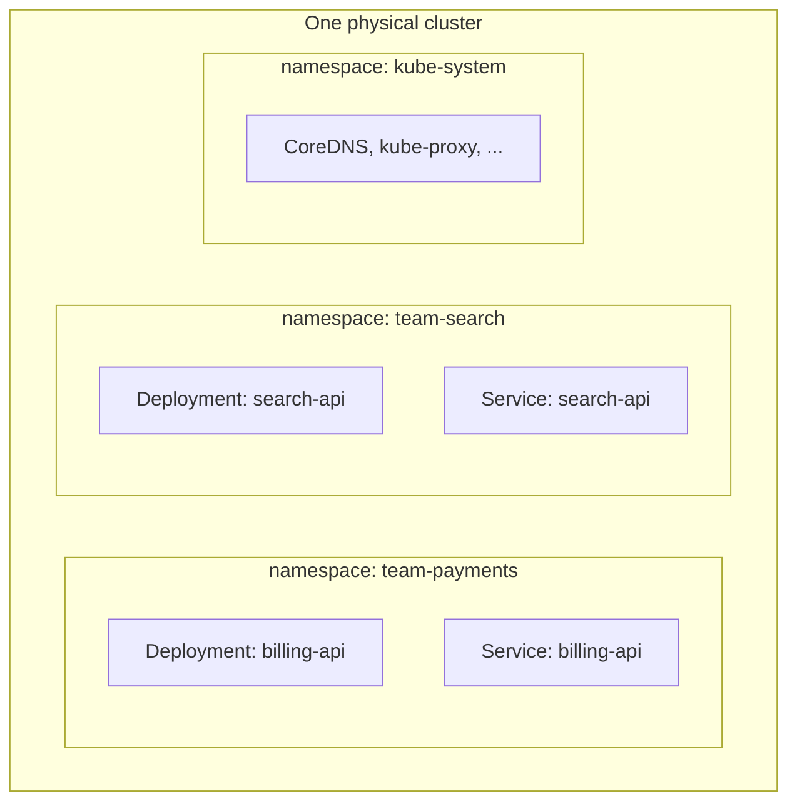
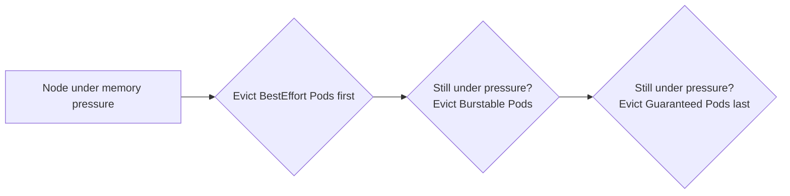

# Chapter 9 — Namespaces and Resource Management

> **Kubernetes Basics — Chapter 9 of 19**

## Learning Objectives

By the end of this chapter you will be able to:

- Explain what a Namespace is, what it partitions, and what it deliberately does not partition
- Create and switch between namespaces, and set a default namespace for your kubeconfig context
- Explain the difference between resource `requests` and `limits`, and how each is used by Kubernetes
- Identify the three Quality of Service (QoS) classes and predict eviction order under memory pressure
- Configure a `LimitRange` to enforce sane defaults and bounds on Pod resource specs
- Configure a `ResourceQuota` to cap total namespace-wide resource and object consumption

---

## Prerequisites for This Chapter

- **Chapter 2 — Architecture and Internals**: you should understand what the scheduler does and, at a high level, the reconciliation loop — this chapter builds directly on the scheduler's role.
- **Chapter 3 — Installation and Setup**: you should already be comfortable with `kubectl config` and the concept of a context/kubeconfig — this chapter extends that discussion.
- **Chapter 4 — Pods and Workloads**: comfort with Pod YAML and container specs.

---

## 9.1 What a Namespace Is (and Is Not)

A **Namespace** is a way to partition a single physical Kubernetes cluster into multiple virtual clusters. Most Kubernetes object types (Pods, Deployments, Services, ConfigMaps, Secrets, PVCs) are **namespaced** — they live inside exactly one namespace, and two objects with the same name can coexist peacefully as long as they're in different namespaces. A handful of object types are **cluster-scoped** and exist outside any namespace — Nodes, PersistentVolumes, StorageClasses, and Namespaces themselves.

Every cluster ships with four namespaces out of the box:

| Namespace | Purpose |
|---|---|
| `default` | Where objects land if you don't specify a namespace — fine for learning, not recommended for real workloads |
| `kube-system` | Pods belonging to the control plane and cluster add-ons: CoreDNS, kube-proxy, the CNI plugin, etc. Don't deploy application workloads here. |
| `kube-public` | Readable by all users (even unauthenticated ones in some setups); used for cluster-wide public information |
| `kube-node-lease` | Holds `Lease` objects used for node heartbeats — an internal implementation detail of node health-checking |

```bash
kubectl get namespaces
# NAME              STATUS   AGE
# default           Active   30d
# kube-node-lease   Active   30d
# kube-public       Active   30d
# kube-system       Active   30d
```

### Why Namespaces Exist: Three Common Patterns

1. **Team isolation.** `team-payments`, `team-search`, `team-platform` — each team gets a namespace they can freely create objects in, without naming collisions or accidentally touching another team's Deployments.
2. **Environment isolation within one cluster.** `dev`, `staging`, `prod` namespaces inside a single cluster. This is cheap (one cluster to operate) but comes with a real tradeoff: a control-plane-level failure, a misconfigured cluster-wide admission policy, or a Kubernetes version upgrade affects all three environments simultaneously. Many organizations instead prefer **separate clusters per environment** — more infrastructure to manage, but true blast-radius isolation, since a broken `dev` cluster upgrade can never take down `prod`. There is no universally correct answer; it's a cost/operational-complexity tradeoff you make deliberately, not a default you should apply blindly.
3. **Per-application grouping.** A large platform might namespace by application or product line (`checkout`, `inventory`, `notifications`) regardless of team ownership, so RBAC and quotas map cleanly to a bounded set of workloads.



---

## 9.2 Creating and Using Namespaces

```yaml
# team-payments-namespace.yaml
apiVersion: v1
kind: Namespace
metadata:
  name: team-payments
  labels:
    team: payments
    environment: production
```

```bash
# Declarative (recommended, reviewable in git)
kubectl apply -f team-payments-namespace.yaml

# Imperative equivalent, useful for quick scratch namespaces
kubectl create namespace team-search

# List all Pods in a specific namespace
kubectl get pods -n team-payments

# List Pods across ALL namespaces
kubectl get pods --all-namespaces
kubectl get pods -A     # shorthand

# Create an object directly into a namespace
kubectl apply -f deployment.yaml -n team-payments
```

### Setting a Default Namespace for Your Context

Typing `-n team-payments` on every single command gets old fast. Recall from Chapter 3 that a kubeconfig **context** bundles a cluster, a user, and a namespace together. You can update the current context's namespace so it applies automatically to every subsequent command, without touching which cluster or credentials you're using:

```bash
# View your current context and its namespace
kubectl config view --minify

# Set the default namespace for the CURRENT context
kubectl config set-context --current --namespace=team-payments

# From now on, this is equivalent to the -n flag every time:
kubectl get pods
kubectl get deployments

# Confirm which namespace is now the default
kubectl config view --minify | grep namespace
```

This is exactly the mechanism from Chapter 3's kubeconfig discussion — a context is not just "which cluster," it's "which cluster, as which user, defaulting to which namespace." Switching between working on `team-payments` and `team-search` day to day is just switching contexts (`kubectl config use-context ...`) or updating the current one's namespace, not re-authenticating.

---

## 9.3 What Namespaces Do NOT Do

This is a frequently misunderstood point: **creating a namespace does not, by itself, create any network isolation.** By default, a Pod in `team-search` can send traffic to a Pod in `team-payments` just as freely as it can reach a Pod in its own namespace — Kubernetes' flat networking model (Chapter 6) applies cluster-wide regardless of namespace boundaries. A namespace is an organizational and API-level boundary (naming, RBAC scoping, quota scoping) — it is not a firewall.

If you need actual network-level isolation between namespaces (e.g., payments workloads must not be reachable from arbitrary other namespaces), you need a **NetworkPolicy** — a separate object type that explicitly allow-lists or deny-lists traffic between Pods based on labels and namespaces. NetworkPolicies require a CNI plugin that supports enforcing them (not all do), and designing them correctly is genuinely nuanced. Full coverage is in **Topic 9, Advanced Kubernetes** — for now, just remember the rule: *namespaces organize, NetworkPolicies isolate.*

---

## 9.4 Resource Requests and Limits

Every container in a Pod can declare two separate numbers for CPU and memory: `requests` and `limits`. They answer two completely different questions, and confusing them is one of the most common sources of production incidents in Kubernetes.

- **`requests`** — "this container needs at least this much to run acceptably." The scheduler (Chapter 2) uses this number, and only this number, to decide which node has room for the Pod. If a node has 2 CPU cores free and your Pod requests `500m`, the scheduler considers it a fit — regardless of what `limits` says.
- **`limits`** — "this container must never be allowed to use more than this." This is enforced by the kubelet/container runtime at runtime, not by the scheduler.

```yaml
apiVersion: v1
kind: Pod
metadata:
  name: resource-demo
spec:
  containers:
    - name: app
      image: myapp:v1.0
      resources:
        requests:
          cpu: "250m"        # 250 millicores = a quarter of one CPU core
          memory: "256Mi"    # 256 mebibytes
        limits:
          cpu: "500m"        # may burst up to half a CPU core
          memory: "512Mi"    # hard ceiling
```

CPU is measured in **millicores** — `1000m` equals one full CPU core, so `250m` is a quarter of a core. Memory is measured in bytes, typically expressed with binary suffixes like `Mi` (mebibyte) or `Gi` (gibibyte).

**What happens when you exceed each one is different, and this trips people up constantly:**

- **Exceeding a CPU limit** results in **throttling**, not termination. The kernel's CFS (Completely Fair Scheduler) simply prevents the container's processes from getting more CPU time than the limit allows during each scheduling period. The container keeps running, just slower — visible as increased latency, not a crash.
- **Exceeding a memory limit** results in the container being **OOMKilled** (Out-Of-Memory killed) by the kernel, immediately and without warning. Memory cannot be "throttled" the way CPU can — there's no way to make an allocation "slower" — so the kernel just kills the process. Kubernetes will then restart the container per its restart policy, and you'll see `OOMKilled` as the last termination reason in `kubectl describe pod`.

```bash
kubectl describe pod resource-demo
# ...
# Last State:     Terminated
#   Reason:       OOMKilled
#   Exit Code:    137
```

---

## 9.5 Quality of Service (QoS) Classes

Kubernetes automatically assigns every Pod one of three QoS classes based purely on how its containers set `requests` and `limits`. You never set this directly — it's derived.

| QoS Class | How It's Assigned | Eviction Priority Under Node Memory Pressure |
|---|---|---|
| **Guaranteed** | Every container has `requests == limits` for **both** CPU and memory | Evicted **last** — the most protected |
| **Burstable** | At least one container has `requests` set, but they differ from `limits` (or only some resources/containers have both set) | Evicted **second** |
| **BestEffort** | No `requests` or `limits` set on **any** container, for **any** resource | Evicted **first** — the least protected |

```yaml
# Guaranteed — requests exactly equal limits for every resource
resources:
  requests:
    cpu: "500m"
    memory: "512Mi"
  limits:
    cpu: "500m"
    memory: "512Mi"
---
# Burstable — requests set, but lower than limits (can "burst" up to the limit)
resources:
  requests:
    cpu: "250m"
    memory: "256Mi"
  limits:
    cpu: "500m"
    memory: "512Mi"
---
# BestEffort — no resources block at all
# (simply omit the `resources` field entirely)
```

The intuition behind the eviction order: a `Guaranteed` Pod has told the scheduler exactly what it will use and never asked for more, so the node can be confident evicting it won't help — and it was likely placed carefully. A `BestEffort` Pod made no promises and no reservations at all, so it's both the easiest to justify evicting (it never asked for a guarantee) and, when a node is genuinely starved for memory, the most likely culprit for unpredictable, uncapped growth.



**Practical implication:** anything you actually care about staying up — a payment service, a primary database — should run with `Guaranteed` QoS. Batch jobs, low-priority background workers, and dev/test workloads are reasonable candidates for `Burstable` or even `BestEffort`.

---

## 9.6 LimitRange: Enforcing Sane Defaults Namespace-Wide

Relying on every engineer to remember to set `requests`/`limits` on every container is fragile. A **LimitRange** lets a namespace enforce default values (applied automatically if omitted) and minimum/maximum bounds (rejecting Pods that fall outside them).

```yaml
apiVersion: v1
kind: LimitRange
metadata:
  name: default-limits
  namespace: team-payments
spec:
  limits:
    - type: Container
      default:                 # applied as the LIMIT if a container doesn't set one
        cpu: "500m"
        memory: "512Mi"
      defaultRequest:          # applied as the REQUEST if a container doesn't set one
        cpu: "250m"
        memory: "256Mi"
      min:                     # reject any container requesting less than this
        cpu: "100m"
        memory: "64Mi"
      max:                     # reject any container requesting more than this
        cpu: "2"
        memory: "2Gi"
```

```bash
kubectl apply -f limitrange.yaml
kubectl describe limitrange default-limits -n team-payments
```

With this in place, a developer who deploys a Pod with no `resources` block at all in `team-payments` doesn't end up `BestEffort` by accident — the LimitRange silently fills in `250m`/`256Mi` requests and `500m`/`512Mi` limits, making it `Burstable` by default. A developer who tries to request `4` CPU cores for a single container gets the Pod rejected outright at creation time, with a clear error, rather than silently starving the rest of the namespace's workloads of scheduling headroom.

---

## 9.7 ResourceQuota: Capping Total Namespace Consumption

Where a `LimitRange` governs individual containers/Pods, a **ResourceQuota** caps the **sum total** of resource consumption across an entire namespace — total CPU requested, total memory requested, and even object counts like the maximum number of Pods, Services, or PVCs allowed.

```yaml
apiVersion: v1
kind: ResourceQuota
metadata:
  name: team-payments-quota
  namespace: team-payments
spec:
  hard:
    requests.cpu: "10"          # sum of all Pod CPU requests in this namespace
    requests.memory: "20Gi"     # sum of all Pod memory requests
    limits.cpu: "20"            # sum of all Pod CPU limits
    limits.memory: "40Gi"       # sum of all Pod memory limits
    pods: "50"                  # max number of Pod objects
    services: "10"               # max number of Service objects
    persistentvolumeclaims: "5"  # max number of PVC objects
```

```bash
kubectl apply -f resourcequota.yaml
kubectl describe resourcequota team-payments-quota -n team-payments
# Name:                    team-payments-quota
# Namespace:               team-payments
# Resource                 Used   Hard
# --------                 ----   ----
# limits.cpu               4      20
# limits.memory            8Gi    40Gi
# persistentvolumeclaims   1      5
# pods                     8      50
# requests.cpu             2      10
# requests.memory          4Gi    20Gi
# services                 3      10
```

**An important interaction:** once a `ResourceQuota` that constrains `requests.cpu`/`requests.memory`/`limits.cpu`/`limits.memory` exists in a namespace, the API server requires **every** Pod created in that namespace to explicitly specify `requests` and `limits` — a Pod with no `resources` block will be rejected outright, because the quota system has no default value to count against the quota. This is precisely why `ResourceQuota` and `LimitRange` are almost always deployed together: the `LimitRange` supplies the defaults so ordinary Pod specs without explicit resources still work, and the `ResourceQuota` enforces the namespace-wide ceiling on top of those (defaulted or explicit) values.

---

## 9.8 Real-World Scenario: A Namespace-Per-Team Platform with Quotas

A platform team supports three product teams sharing one cluster. Without any guardrails, a single runaway workload (a memory leak, an accidental `replicas: 500`) in one team's namespace could consume enough of the cluster's capacity to starve every other team's Pods from ever being scheduled — a classic "noisy neighbor" problem.

The platform team's standard onboarding for a new team namespace:

```yaml
apiVersion: v1
kind: Namespace
metadata:
  name: team-search
  labels:
    team: search
---
apiVersion: v1
kind: LimitRange
metadata:
  name: default-limits
  namespace: team-search
spec:
  limits:
    - type: Container
      default:
        cpu: "500m"
        memory: "512Mi"
      defaultRequest:
        cpu: "100m"
        memory: "128Mi"
      max:
        cpu: "2"
        memory: "4Gi"
---
apiVersion: v1
kind: ResourceQuota
metadata:
  name: team-search-quota
  namespace: team-search
spec:
  hard:
    requests.cpu: "8"
    requests.memory: "16Gi"
    limits.cpu: "16"
    limits.memory: "32Gi"
    pods: "40"
```

Now imagine an engineer on the search team accidentally deploys a Deployment with `replicas: 100`, each Pod requesting `500m` CPU — that's `50` CPU cores requested, far above the namespace's `8`-core quota.

```bash
kubectl apply -f runaway-deployment.yaml -n team-search
kubectl get events -n team-search --field-selector reason=FailedCreate
# Warning  FailedCreate  replicaset/search-api-7d9f...
#   Error creating: pods "search-api-7d9f...-x2k9p" is forbidden:
#   exceeded quota: team-search-quota, requested: requests.cpu=500m,
#   used: requests.cpu=8, limited: requests.cpu=8
```

The Deployment's ReplicaSet controller keeps trying to create the 100th, 101st... Pod, and each attempt beyond the quota ceiling is cleanly rejected by the API server with a specific, actionable error — not a vague failure, not a cluster-wide slowdown, and critically, **not an impact on `team-payments` or `team-platform`'s namespaces at all**. The runaway workload is contained entirely within its own namespace's quota. The on-call engineer sees the `FailedCreate` events, realizes the replica count was a typo, and fixes it — the blast radius stopped exactly where the platform team designed it to stop.

---

## Best Practices

- Avoid deploying real workloads into the `default` namespace — always create purpose-named namespaces, even for a single small project.
- Pair every `ResourceQuota` with a `LimitRange` in the same namespace, so Pods without explicit resource specs still get sensible defaults instead of being rejected outright.
- Run anything business-critical at `Guaranteed` QoS (`requests == limits`); reserve `BestEffort` for genuinely disposable workloads you're fine losing under pressure.
- Set memory `limits` conservatively and test under realistic load — an OOMKill is abrupt and immediate, unlike CPU throttling which degrades more gracefully.
- Use `kubectl config set-context --current --namespace=<ns>` to avoid the class of mistakes where you `apply` or `delete` against the wrong namespace by forgetting `-n`.
- Remember namespaces are not a security boundary on their own — pair them with NetworkPolicies (Topic 9) and RBAC if you need real isolation, not just organizational separation.

---

## Common Mistakes

- Assuming namespace separation implies network isolation, and being surprised when a Pod in one namespace can freely reach a Service in another.
- Setting `limits` without `requests` (or vice versa) and being confused about the resulting QoS class and scheduling behavior.
- Deploying a ResourceQuota without a companion LimitRange, causing every Pod without explicit resource specs to be rejected outright.
- Confusing CPU and memory failure modes — expecting a memory-limit breach to "throttle" like CPU does, when it actually triggers an immediate OOMKill.
- Leaving all workloads in the `default` namespace, making RBAC scoping, quota enforcement, and blast-radius containment effectively impossible later.

---

## Summary

- A Namespace partitions one physical cluster into multiple virtual clusters for team, environment, or application-based organization — but it provides no network isolation by itself.
- Kubernetes ships with `default`, `kube-system`, `kube-public`, and `kube-node-lease` out of the box.
- `kubectl config set-context --current --namespace=<ns>` sets a persistent default namespace for your current kubeconfig context.
- `requests` inform scheduling decisions; `limits` are hard runtime ceilings — CPU is throttled past its limit, memory triggers an OOMKill past its limit.
- QoS classes (`Guaranteed`, `Burstable`, `BestEffort`) are derived automatically from how requests/limits are set, and directly determine eviction order under node memory pressure.
- `LimitRange` supplies namespace-wide defaults and min/max bounds for individual Pods/containers; `ResourceQuota` caps total namespace-wide consumption and object counts.
- Deploying `LimitRange` and `ResourceQuota` together is the standard pattern for giving every team a safe, contained slice of a shared cluster.

---

## Knowledge Check

1. Name the four default namespaces Kubernetes ships with and what each is for.
2. Why doesn't creating a namespace, by itself, prevent a Pod in one namespace from reaching a Service in another?
3. A container has `requests.memory: 256Mi` and `limits.memory: 512Mi`. It tries to allocate 600Mi. What happens, and why is this different from what would happen if it were a CPU limit instead?
4. What QoS class does a Pod get if it sets no `resources` field at all, and what does that mean for its eviction priority?
5. Why are `LimitRange` and `ResourceQuota` almost always deployed together rather than just one or the other?
6. A ResourceQuota in a namespace caps `requests.cpu` at `8`. A team tries to deploy a Deployment that would push total requested CPU to `10`. What exactly happens, and does it affect other namespaces?

---

## Hands-On Exercise

**Goal:** Set up an isolated namespace with enforced defaults and a hard quota, then deliberately exceed the quota and observe the failure.

1. Create a `kind` cluster if you don't have one running: `kind create cluster --name k8s-basics`
2. Create a namespace called `sandbox-team`.
3. Set your kubectl context's default namespace to `sandbox-team` using `kubectl config set-context --current --namespace=sandbox-team`.
4. Apply a `LimitRange` in `sandbox-team` with a `defaultRequest` of `100m`/`128Mi` and a `default` limit of `250m`/`256Mi`.
5. Apply a `ResourceQuota` in `sandbox-team` capping `requests.cpu` at `500m` and `pods` at `5`.
6. Deploy a simple Deployment (e.g., `nginx`) with `replicas: 2` and no `resources` block at all — confirm with `kubectl describe pod <pod>` that the LimitRange's defaults were applied automatically.
7. Scale the Deployment up (`kubectl scale deployment nginx --replicas=10`) and observe that some Pods fail to schedule/create due to the CPU quota being exceeded — inspect the reason with `kubectl get events -n sandbox-team`.
8. Clean up: `kubectl delete namespace sandbox-team` (this deletes everything inside it in one command).

---

## Further Reading

- [Kubernetes Docs — Namespaces](https://kubernetes.io/docs/concepts/overview/working-with-objects/namespaces/)
- [Kubernetes Docs — Resource Management for Pods and Containers](https://kubernetes.io/docs/concepts/configuration/manage-resources-containers/)
- [Kubernetes Docs — Pod Quality of Service Classes](https://kubernetes.io/docs/concepts/workloads/pods/pod-qos/)
- [Kubernetes Docs — Limit Ranges](https://kubernetes.io/docs/concepts/policy/limit-range/)
- [Kubernetes Docs — Resource Quotas](https://kubernetes.io/docs/concepts/policy/resource-quotas/)

---

<div style="display:flex;justify-content:space-between;align-items:center;">
  <a href="./08-storage-and-persistent-volumes.md">← Previous: Storage and Persistent Volumes</a>
  <a href="./00-index.md">🏠 Index</a>
  <a href="./10-health-checks-and-scheduling.md">Next: Health Checks and Scheduling →</a>
</div>
