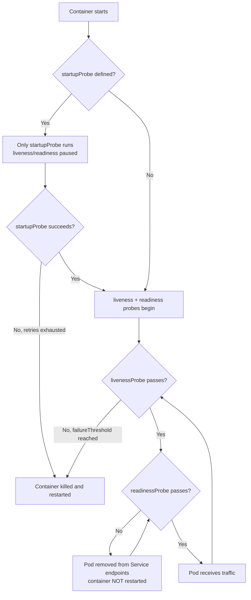
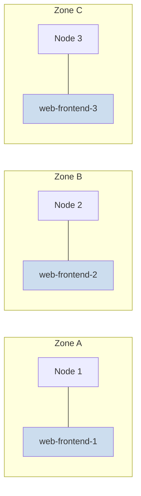

# Chapter 10 — Health Checks and Scheduling

## Learning Objectives

By the end of this chapter, you will be able to:

- Explain why "the process is running" is not the same as "the application is healthy"
- Configure liveness, readiness, and startup probes and describe what Kubernetes does when each one fails
- Choose the right probe mechanism (`httpGet`, `tcpSocket`, `exec`, `grpc`) for a given workload
- Tune probe timing fields to avoid false-positive restarts under load
- Diagnose a `CrashLoopBackOff` using `kubectl describe pod` and `kubectl logs --previous`
- Control which nodes a Pod can run on using `nodeSelector` and node affinity/anti-affinity
- Use Pod affinity/anti-affinity to co-locate or spread Pods across failure domains
- Explain taints and tolerations and how they differ from affinity
- Fix a real startup-timing bug by replacing a misused liveness probe with a startup probe

---

## Prerequisites for This Chapter

- Comfortable creating and reading Pod and Deployment manifests (Chapter 4, Chapter 5)
- Understand Services and how endpoints are populated (Chapter 6)
- Basic familiarity with `kubectl get`, `kubectl describe`, and `kubectl logs`
- Namespaces and resource requests/limits (Chapter 9) — not required, but referenced briefly

---

## 10.1 "Running" Is Not the Same as "Healthy"

Kubernetes has a very shallow default definition of "alive." The kubelet — the agent running on every node — checks whether the container's main process is still running. If the process hasn't exited, the Pod is reported as `Running`. That's it. No knowledge of whether the application inside can actually serve a request.

This gap matters more than it sounds. Consider a Java application that deadlocks on a shared lock, or a Node.js process stuck in an infinite loop waiting on a database connection that will never arrive, or a web server that's still accepting TCP connections but its request-handling thread pool is exhausted. In every one of these cases, the OS process is alive and well — `ps aux` on the node would show it happily consuming CPU or sitting idle — but the application is functionally dead. It cannot do its job.

Without a probe, Kubernetes has no way to know this. The Pod stays `Running`, stays in the Service's list of endpoints, and keeps receiving traffic that it cannot answer. Users see timeouts and errors while your dashboard proudly shows "1/1 Pods Running."

This is the problem probes solve: they let you tell Kubernetes, in application-specific terms, what "healthy" actually means for your workload — and what Kubernetes should do about it when it isn't.

**Analogy:** think of a restaurant host checking on the kitchen. "Is the lights on in the kitchen?" (process running) tells you almost nothing. "Can the kitchen still plate a dish within two minutes?" (a probe) tells you whether to keep seating customers there.

---

## 10.2 The Three Probe Types

Kubernetes gives you three distinct probes, and mixing up what each one does is one of the most common sources of production incidents. They ask different questions and Kubernetes reacts to failures in completely different ways.

| Probe | Question it answers | On failure | Restarts container? | Removed from Service endpoints? |
|---|---|---|---|---|
| **Liveness** | "Is this container stuck and needs a restart?" | kubelet kills and restarts the container | Yes | Yes (temporarily, due to restart) |
| **Readiness** | "Is this container ready to accept traffic right now?" | Pod is marked `NotReady` | No | Yes, until it passes again |
| **Startup** | "Has this slow-starting app finished booting?" | Container is killed and restarted (treated like liveness failure during startup) | Yes | Yes |

The critical distinction to internalize: **readiness failures never trigger a restart.** A readiness probe failing just means "temporarily don't send this Pod traffic" — useful for a Pod that's briefly overloaded, reconnecting to a database, or performing a graceful shutdown drain. A liveness probe failing means "this container is broken beyond self-recovery, kill it and start fresh."

Confusing the two is a classic mistake: teams sometimes point their liveness probe at a deep health check that includes downstream dependencies (database, cache, third-party API). If the database blips for ten seconds, every Pod's liveness probe fails simultaneously, and Kubernetes restarts your *entire fleet* at once — precisely when you can least afford it. Deep dependency checks belong on the **readiness** probe (temporarily stop traffic, let it recover) not the **liveness** probe (which should only ask "is my own process irrecoverably stuck?").

**Startup probes** solve a different problem entirely: apps that are slow to boot (JVM apps warming up, apps loading a large in-memory cache, apps running database migrations on startup). While a startup probe is defined and has not yet succeeded, Kubernetes **disables liveness and readiness checks entirely**. This prevents a slow-booting app from being killed by an impatient liveness probe before it ever gets a chance to finish starting.



---

## 10.3 Probe Mechanisms

Every probe type (`livenessProbe`, `readinessProbe`, `startupProbe`) can use one of four mechanisms to check health. The mechanism is just *how* the check is performed — the semantics of liveness vs. readiness vs. startup stay the same.

### httpGet — check an HTTP endpoint

The most common mechanism for web services. Kubernetes sends an HTTP GET request; any response code in the `200–399` range counts as success.

```yaml
livenessProbe:
  httpGet:
    path: /healthz
    port: 8080
    httpHeaders:
      - name: X-Health-Check
        value: kubelet
  initialDelaySeconds: 10
  periodSeconds: 10
```

Your application must implement `/healthz` (or whatever path you choose) as a real endpoint. A good liveness `/healthz` does the bare minimum — confirm the process's internal event loop or request handler is responsive — without calling out to a database.

### tcpSocket — check that a port accepts connections

Useful for non-HTTP services (databases, message brokers, raw TCP servers) where you just need to know the listener is up.

```yaml
readinessProbe:
  tcpSocket:
    port: 5432
  periodSeconds: 5
```

This only proves the port is open — it says nothing about application logic. It's a coarse but cheap check, often good enough for readiness on backend services with more specific health logic elsewhere.

### exec — run a command inside the container

Kubernetes runs a command inside the container's namespace; **exit code 0 means success**, anything else means failure.

```yaml
livenessProbe:
  exec:
    command:
      - cat
      - /tmp/healthy
  initialDelaySeconds: 5
  periodSeconds: 5
```

This is flexible — you can script arbitrary checks — but it's also the most expensive mechanism, since it forks a process inside the container on every check interval. Use it when `httpGet`/`tcpSocket` genuinely can't express what you need (e.g., checking a CLI-only database client, verifying a lock file, running a small script that checks disk space).

### grpc — check a gRPC health service

For gRPC services that implement the standard [gRPC Health Checking Protocol](https://github.com/grpc/grpc/blob/master/doc/health-checking.md):

```yaml
readinessProbe:
  grpc:
    port: 9090
    service: my.package.HealthService   # optional; omit to check overall server health
  periodSeconds: 10
```

This mechanism has been stable since Kubernetes 1.24 and is the correct choice for gRPC workloads instead of hacking an `exec`-based `grpc_health_probe` binary call (which was the old workaround).

| Mechanism | Best for | Cost | Notes |
|---|---|---|---|
| `httpGet` | Web APIs, REST services | Low | Needs a dedicated endpoint; use 2xx-3xx as success |
| `tcpSocket` | Databases, brokers, raw TCP | Very low | Only proves port is open, not app logic |
| `exec` | Anything scriptable | Higher (forks a process) | Most flexible, most expensive |
| `grpc` | gRPC services | Low | Requires the gRPC health protocol implemented |

---

## 10.4 Tuning Probe Timing

Every probe accepts five timing fields. Getting these wrong is one of the most common causes of production instability — a probe that is technically "correct" but badly tuned can cause more outages than having no probe at all.

| Field | Meaning | Default |
|---|---|---|
| `initialDelaySeconds` | Wait this long after container start before the first probe | 0 |
| `periodSeconds` | How often to run the probe | 10 |
| `timeoutSeconds` | How long to wait for a probe response before counting it as failed | 1 |
| `failureThreshold` | Consecutive failures before taking action (restart or NotReady) | 3 |
| `successThreshold` | Consecutive successes needed to mark healthy again (readiness/startup only; liveness must be 1) | 1 |

**The classic mistake: an aggressive liveness probe causing a restart-crash-loop under normal load.**

Imagine a Java API with:

```yaml
livenessProbe:
  httpGet:
    path: /healthz
    port: 8080
  initialDelaySeconds: 5
  periodSeconds: 5
  timeoutSeconds: 1
  failureThreshold: 1
```

Under a normal traffic spike (a marketing email goes out, a batch job kicks off, a garbage-collection pause happens), the JVM briefly pauses for 1.5 seconds to service the request queue. The health endpoint doesn't respond within `timeoutSeconds: 1`. That's a single failure — but `failureThreshold: 1` means Kubernetes doesn't wait for a second confirmation; it kills the container immediately.

The container restarts, which means it has to re-JIT-warm the JVM and repopulate any caches — during which it's slower and more likely to miss the next probe too. Now you have a restart-crash-loop caused entirely by the health check, not by an actual application defect. This is a self-inflicted outage.

**The fix** is a more forgiving liveness configuration:

```yaml
livenessProbe:
  httpGet:
    path: /healthz
    port: 8080
  initialDelaySeconds: 15
  periodSeconds: 10
  timeoutSeconds: 3
  failureThreshold: 3     # requires 3 consecutive failures (~30s of sustained trouble) before acting
```

**Rule of thumb:** liveness probes should be tolerant. Their job is to catch a container that is *permanently* stuck, not to nitpick every momentary slowdown. Readiness probes can be stricter and faster to react, since failing readiness is cheap (just a brief traffic pause) — failing liveness is expensive (a full restart).

---

## 10.5 Restart Policies and CrashLoopBackOff

Every Pod has a `restartPolicy` that governs what the kubelet does when a container exits:

| Policy | Behavior | Typical use |
|---|---|---|
| `Always` (default) | Always restart the container, regardless of exit code | Long-running services (Deployments, StatefulSets, DaemonSets) |
| `OnFailure` | Restart only if the container exits with a non-zero code | Jobs — a successful exit (0) should not be restarted |
| `Never` | Never restart, no matter the exit code | One-shot debugging Pods, certain Job configurations |

When a container keeps failing and `restartPolicy` calls for a restart, Kubernetes doesn't retry instantly forever — it applies **exponential backoff**: 10s, 20s, 40s, 80s... up to a cap of 5 minutes between attempts. This backoff state is what you see reported as `CrashLoopBackOff` in `kubectl get pods`. It is not a distinct failure — it is a *status describing the restart backoff timer*, telling you "this container keeps dying and I'm now waiting longer between attempts."

**Diagnosing a CrashLoopBackOff:**

```bash
# Step 1: see the high-level status and recent events
kubectl describe pod myapp-7d9f8c6b5-x2j4k

# Look for:
#   Restart Count: 7
#   Last State: Terminated, Reason: Error, Exit Code: 1
#   Events: Back-off restarting failed container

# Step 2: check logs from the CURRENT (likely crashed) container
kubectl logs myapp-7d9f8c6b5-x2j4k

# Step 3: check logs from the PREVIOUS instantiation — this is often more useful,
# since the current container may have just restarted and logged nothing yet
kubectl logs myapp-7d9f8c6b5-x2j4k --previous

# Step 4: if it's a liveness-probe-induced restart (not an app crash), confirm by checking Events for:
#   "Liveness probe failed: ..."
# versus an actual application panic/exception in the logs
```

The single most common root causes behind `CrashLoopBackOff`, in rough order of frequency:

1. Application throws an uncaught exception on startup (bad config, missing environment variable, unreachable dependency)
2. Liveness probe misconfigured too aggressively (Section 10.4)
3. `OOMKilled` — the container exceeds its memory limit and is killed by the kernel (check `kubectl describe pod` for `Reason: OOMKilled`)
4. Missing ConfigMap/Secret that the Pod depends on, causing an init failure

---

## 10.6 Scheduling: Controlling Where Pods Run

By default, the Kubernetes scheduler picks a node for you based on resource availability. Often that's fine. Sometimes you need more control — a workload that needs a GPU node, replicas that must be spread across zones for high availability, or a cache that should sit on the same node as the app using it.

### nodeSelector — the simplest constraint

`nodeSelector` matches Pods to nodes carrying a specific label. It's a hard requirement: if no node has the label, the Pod stays `Pending` forever.

```bash
# Label a node
kubectl label nodes node1 disktype=ssd
```

```yaml
apiVersion: v1
kind: Pod
metadata:
  name: fast-storage-app
spec:
  nodeSelector:
    disktype: ssd
  containers:
    - name: app
      image: myapp:1.0
```

`nodeSelector` is simple but limited — it only supports exact-match AND logic across multiple keys. For anything more expressive, use node affinity.

### Node Affinity — hard and soft rules

Node affinity is `nodeSelector`'s more expressive successor, supporting operators (`In`, `NotIn`, `Exists`, `Gt`, `Lt`) and, critically, both **hard (required)** and **soft (preferred)** rules.

```yaml
apiVersion: apps/v1
kind: Deployment
metadata:
  name: ml-inference
spec:
  replicas: 3
  selector:
    matchLabels: { app: ml-inference }
  template:
    metadata:
      labels: { app: ml-inference }
    spec:
      affinity:
        nodeAffinity:
          # HARD rule: the Pod will not schedule unless this matches
          requiredDuringSchedulingIgnoredDuringExecution:
            nodeSelectorTerms:
              - matchExpressions:
                  - key: accelerator
                    operator: In
                    values: ["nvidia-t4", "nvidia-a10"]
          # SOFT rule: prefer nodes in us-east-1a, but schedule elsewhere if unavailable
          preferredDuringSchedulingIgnoredDuringExecution:
            - weight: 80
              preference:
                matchExpressions:
                  - key: topology.kubernetes.io/zone
                    operator: In
                    values: ["us-east-1a"]
      containers:
        - name: inference
          image: ml-inference:2.3
```

The verbose field names actually describe their behavior precisely:

- `requiredDuringScheduling` = must be true for the Pod to be *placed* on a node
- `preferredDuringScheduling` = the scheduler tries to satisfy it, weighted against other soft rules, but will schedule elsewhere if it can't
- `IgnoredDuringExecution` = once the Pod is running, if the node's labels change and no longer match, the Pod is **not** evicted (this is the only mode Kubernetes currently supports — there's no "required during execution" enforcement yet)

| Rule type | Hard or soft | Effect if unsatisfied |
|---|---|---|
| `requiredDuringSchedulingIgnoredDuringExecution` | Hard | Pod stays `Pending` |
| `preferredDuringSchedulingIgnoredDuringExecution` | Soft | Pod schedules anyway, best-effort |

### Pod Affinity and Anti-Affinity — positioning relative to other Pods

Node affinity relates a Pod to node labels. **Pod affinity/anti-affinity** relates a Pod to *other Pods already running* — useful for two opposite goals:

**Co-locate for performance** (Pod affinity) — e.g., put a cache sidecar-equivalent Pod on the same node as the app that uses it, minimizing network latency:

```yaml
affinity:
  podAffinity:
    requiredDuringSchedulingIgnoredDuringExecution:
      - labelSelector:
          matchExpressions:
            - key: app
              operator: In
              values: ["redis-cache"]
        topologyKey: kubernetes.io/hostname   # "same node"
```

**Spread for resilience** (Pod anti-affinity) — e.g., ensure replicas of the same Deployment never land on the same node, so a single node failure can't take down every replica at once:

```yaml
apiVersion: apps/v1
kind: Deployment
metadata:
  name: web-frontend
spec:
  replicas: 3
  selector:
    matchLabels: { app: web-frontend }
  template:
    metadata:
      labels: { app: web-frontend }
    spec:
      affinity:
        podAntiAffinity:
          requiredDuringSchedulingIgnoredDuringExecution:
            - labelSelector:
                matchExpressions:
                  - key: app
                    operator: In
                    values: ["web-frontend"]
              topologyKey: kubernetes.io/hostname
      containers:
        - name: web
          image: web-frontend:4.2
```

`topologyKey` defines what "spread apart" means. `kubernetes.io/hostname` means "no two Pods on the same node." `topology.kubernetes.io/zone` means "no two Pods in the same availability zone" — a stronger, more expensive-to-satisfy guarantee typically used for genuinely critical services that must survive an entire zone outage.



*Pod anti-affinity with `topology.kubernetes.io/zone` spreads replicas so that losing one zone still leaves two replicas serving traffic.*

---

## 10.7 Taints and Tolerations

Affinity is **Pod-driven attraction** — a Pod says "I want to run on nodes like this." Taints and tolerations are the opposite: **node-driven exclusion** — a node says "don't schedule anything here unless it explicitly tolerates me." They solve a different problem and are frequently confused with affinity.

**Tainting a node:**

```bash
kubectl taint nodes node1 dedicated=gpu-team:NoSchedule
```

This taint means: "No Pod may be scheduled on `node1` unless it has a toleration matching `dedicated=gpu-team`." Existing Pods already running are unaffected (with `NoSchedule`); only future scheduling decisions are blocked.

**Taint effects:**

| Effect | Behavior |
|---|---|
| `NoSchedule` | New Pods without a matching toleration will not be scheduled here |
| `PreferNoSchedule` | Scheduler tries to avoid this node, but will use it if there's no alternative |
| `NoExecute` | New Pods are not scheduled, **and existing Pods without the toleration are evicted** |

**Adding a matching toleration to a Pod:**

```yaml
apiVersion: v1
kind: Pod
metadata:
  name: gpu-training-job
spec:
  tolerations:
    - key: "dedicated"
      operator: "Equal"
      value: "gpu-team"
      effect: "NoSchedule"
  containers:
    - name: trainer
      image: ml-trainer:1.0
      resources:
        limits:
          nvidia.com/gpu: 1
```

A toleration does not *attract* a Pod to the tainted node — it only permits scheduling there if the scheduler chooses it anyway based on other criteria (like resource fit or affinity). This is why GPU node pools are usually set up with **both** a taint (keep unrelated workloads off) **and** a node affinity or nodeSelector on the GPU workload (actively steer it there):

```yaml
spec:
  tolerations:
    - key: "dedicated"
      operator: "Equal"
      value: "gpu-team"
      effect: "NoSchedule"
  nodeSelector:
    accelerator: nvidia-a10
```

**Common real-world use case: keeping workloads off control-plane nodes.** Kubernetes automatically taints control-plane nodes with `node-role.kubernetes.io/control-plane:NoSchedule` so that ordinary application Pods don't compete for resources with the API server, scheduler, and etcd. Only Pods with a matching toleration (typically core system components) can run there.

| | Taints/Tolerations | Affinity |
|---|---|---|
| Driven by | The node ("I repel Pods") | The Pod ("I'm attracted to/repelled by...") |
| Default behavior | Pod is excluded unless it opts in | Pod schedules anywhere unless a rule restricts it |
| Typical use | Dedicated hardware pools, control-plane isolation | Zone spreading, co-locating related Pods, hardware requirements |

---

## 10.8 Real-World Scenario: The 45-Second Cache Warm-Up

A team deploys a product-catalog service. On startup, it loads a 45-second in-memory cache of product data from a database before it can serve any request. Their initial liveness probe:

```yaml
livenessProbe:
  httpGet:
    path: /healthz
    port: 8080
  initialDelaySeconds: 10
  periodSeconds: 10
  failureThreshold: 3
```

`initialDelaySeconds: 10` means the first liveness check fires at 10 seconds — but the app isn't even listening on `/healthz` yet (it's still loading the cache), or it returns `503` because it deliberately reports unhealthy until the cache is warm. With `failureThreshold: 3` and `periodSeconds: 10`, three consecutive failures accumulate by roughly the 40-second mark — just *before* the cache finishes loading at 45 seconds. Kubernetes kills the container. It restarts. The cache load starts over. It never gets there — a permanent crash loop caused entirely by timing, not a bug in the app.

**The fix:** add a `startupProbe` that gates liveness/readiness until the app has actually finished booting, and relax the liveness probe since it no longer needs to account for startup time at all.

```yaml
apiVersion: apps/v1
kind: Deployment
metadata:
  name: product-catalog
spec:
  replicas: 3
  selector:
    matchLabels: { app: product-catalog }
  template:
    metadata:
      labels: { app: product-catalog }
    spec:
      containers:
        - name: catalog
          image: product-catalog:3.1
          ports:
            - containerPort: 8080
          startupProbe:
            httpGet:
              path: /healthz
              port: 8080
            periodSeconds: 5
            failureThreshold: 20        # 5s x 20 = 100s allowed for startup — comfortable margin over 45s
          livenessProbe:
            httpGet:
              path: /healthz
              port: 8080
            periodSeconds: 10
            failureThreshold: 3         # only evaluated AFTER startupProbe succeeds
          readinessProbe:
            httpGet:
              path: /ready
              port: 8080
            periodSeconds: 5
            failureThreshold: 2
```

Now the sequence is: the startup probe alone polls every 5 seconds for up to 100 seconds, giving the 45-second cache load plenty of room. Liveness and readiness are completely paused during this window — no premature kill. Once `/healthz` returns success, the startup probe succeeds permanently (it never runs again for this container instance), and normal liveness/readiness checking begins. The crash loop disappears without touching the actual application code.

---

## Best Practices

- Keep liveness checks shallow — verify your own process is responsive, not that every downstream dependency is healthy
- Put deep dependency checks (database connectivity, downstream API health) on the **readiness** probe, never liveness
- Always add a `startupProbe` for any application with a boot/warm-up time longer than a few seconds
- Set `failureThreshold` on liveness probes high enough to tolerate a normal GC pause or brief load spike — 3 failures at a 10s period (30s total) is a reasonable floor
- Use `topology.kubernetes.io/zone` anti-affinity for genuinely critical services; it's a stronger, costlier guarantee than hostname-level spreading and shouldn't be the default for everything
- Pair taints on dedicated node pools with a matching toleration **and** an affinity/nodeSelector rule on the workload — a toleration alone doesn't attract Pods there
- Never rely on `nodeSelector` alone for critical placement logic once you need more than one label match — move to node affinity for its richer operators and soft-rule support

---

## Common Mistakes

- Pointing the liveness probe at a health check that includes database/downstream dependency status, causing mass simultaneous restarts during a dependency blip
- Setting `initialDelaySeconds` too short for a slow-starting app instead of using a proper `startupProbe`
- Using `failureThreshold: 1` on a liveness probe, turning any single transient blip into an immediate restart
- Assuming a toleration will *attract* a Pod to a tainted node (it only permits scheduling there — it doesn't cause it)
- Forgetting that `IgnoredDuringExecution` means affinity rules are not re-checked after a Pod is already running, so labels changing later won't evict it

*(The full catalog of common Kubernetes mistakes, with fixes, is covered in Chapter 16.)*

---

## Summary

| Topic | Key Point |
|---|---|
| The core problem | "Process running" ≠ "application healthy"; probes close that gap |
| Liveness probe | Detects a stuck container; failure causes a restart |
| Readiness probe | Detects temporary unavailability; failure removes the Pod from Service endpoints, no restart |
| Startup probe | Gates liveness/readiness until a slow-booting app finishes starting |
| Probe mechanisms | `httpGet` for web APIs, `tcpSocket` for raw ports, `exec` for scriptable checks, `grpc` for gRPC health protocol |
| Timing fields | `initialDelaySeconds`, `periodSeconds`, `timeoutSeconds`, `failureThreshold`, `successThreshold` — tune liveness to be forgiving |
| CrashLoopBackOff | A restart-backoff status, not a distinct error; diagnose with `describe pod` + `logs --previous` |
| nodeSelector / node affinity | Pod-driven placement by node labels; affinity adds hard/soft rules and richer operators |
| Pod affinity/anti-affinity | Position Pods relative to other Pods — co-locate for performance, spread for resilience |
| Taints/tolerations | Node-driven exclusion; a toleration permits scheduling but doesn't attract |

---

## Knowledge Check

1. A readiness probe fails three times in a row. What happens to the Pod? Does the container restart? Justify your answer in terms of what a readiness probe is meant to represent.
2. Why is it a bad idea to put a database connectivity check on a liveness probe, but a good idea to put it on a readiness probe?
3. An application takes 60 seconds to warm up. Design a `startupProbe` configuration (periodSeconds and failureThreshold) that allows at least 90 seconds for startup, and explain your math.
4. What does `CrashLoopBackOff` actually mean? What two `kubectl` commands would you run first to diagnose it, and what is each one for?
5. Explain the difference between `requiredDuringSchedulingIgnoredDuringExecution` and `preferredDuringSchedulingIgnoredDuringExecution` in a node affinity rule.
6. A team tags their GPU nodes with a `NoSchedule` taint but their GPU Pods are still landing on regular CPU-only nodes some of the time, and their GPU Pods sometimes fail to schedule at all. What two things are likely missing from the Pod spec?

---

## Hands-On Exercise

**Goal:** Observe probe behavior directly on a local `kind` cluster.

1. Create a `kind` cluster if you don't already have one: `kind create cluster --name k8s-basics`.
2. Deploy a simple Deployment (`nginx:alpine` is fine) with a `livenessProbe` using `httpGet` on `/` port 80, `initialDelaySeconds: 3`, `periodSeconds: 5`, `failureThreshold: 1`.
3. Exec into the running Pod (`kubectl exec -it <pod> -- sh`) and rename or move the nginx binary temporarily, or block port 80 some other way, to force the liveness probe to fail. Watch `kubectl get pods -w` and observe the restart count increment.
4. Fix the Deployment: change `failureThreshold` to `3` and add a `readinessProbe` with the same `httpGet` check. Redeploy.
5. Add a `nodeSelector` requiring a label that does not exist on any node in your cluster (e.g., `disktype: ssd`). Apply it and confirm with `kubectl describe pod` that it stays `Pending` with a `FailedScheduling` event. Remove the `nodeSelector` and confirm it schedules normally.
6. Taint your `kind` node with `kubectl taint nodes k8s-basics-control-plane dedicated=test:NoSchedule`, redeploy your Deployment, and observe it fails to schedule. Add a matching `toleration` to the Pod spec and confirm it now schedules successfully. Remove the taint afterward (`kubectl taint nodes k8s-basics-control-plane dedicated=test:NoSchedule-`).

---

## Further Reading

- [Configure Liveness, Readiness and Startup Probes](https://kubernetes.io/docs/tasks/configure-pod-container/configure-liveness-readiness-startup-probes/)
- [Assigning Pods to Nodes](https://kubernetes.io/docs/concepts/scheduling-eviction/assign-pod-node/)
- [Taints and Tolerations](https://kubernetes.io/docs/concepts/scheduling-eviction/taint-and-toleration/)
- [Pod Lifecycle](https://kubernetes.io/docs/concepts/workloads/pods/pod-lifecycle/)
- [Debug Running Pods](https://kubernetes.io/docs/tasks/debug/debug-application/debug-running-pod/)

---

<div style="display:flex;justify-content:space-between;align-items:center;">
  <a href="./09-namespaces-and-resource-management.md">← Previous: Namespaces and Resource Management</a>
  <a href="./00-index.md">🏠 Index</a>
  <a href="./11-ingress-and-load-balancing.md">Next: Ingress and Load Balancing →</a>
</div>
