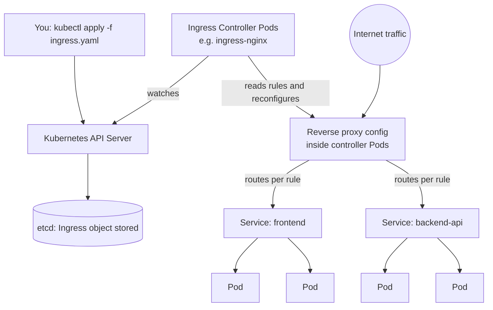

# Chapter 11 — Ingress and Load Balancing

## Learning Objectives

By the end of this chapter, you will be able to:

- Explain the cost and routing limitations of exposing every microservice with its own `LoadBalancer` Service
- Distinguish clearly between an Ingress **resource** (routing rules) and an Ingress **Controller** (the software that implements them)
- Install ingress-nginx on a local `kind` cluster and verify it is running
- Write path-based routing rules that send different URL paths to different backend Services
- Write host-based routing rules that route different hostnames to different backend Services
- Terminate TLS at the Ingress using a Kubernetes Secret, and explain where cert-manager fits in
- Compare `Service type=LoadBalancer`, Ingress, and the emerging Gateway API

---

## Prerequisites for This Chapter

- Services and Kubernetes networking fundamentals, especially `ClusterIP`, `NodePort`, and `LoadBalancer` Service types (Chapter 6)
- ConfigMaps and Secrets, particularly `kubernetes.io/tls` Secrets (Chapter 7)
- Comfortable applying manifests with `kubectl apply -f`

---

## 11.1 The Problem: One Load Balancer per Microservice Doesn't Scale

Suppose you have 10 microservices, each needs to be reachable from the public internet over HTTP/HTTPS. The most naive approach is to give each one a Service of `type: LoadBalancer`:

```yaml
apiVersion: v1
kind: Service
metadata:
  name: orders-service
spec:
  type: LoadBalancer
  selector: { app: orders }
  ports:
    - port: 80
      targetPort: 8080
```

Repeat that ten times, and on a cloud provider (AWS, GCP, Azure) each `LoadBalancer` Service provisions a **real, separate cloud load balancer** — an actual billed resource, often $15–25/month each on AWS depending on type and data processed. Ten microservices means ten load balancers, each with its own public IP or DNS name, each billed independently. That's the immediate cost problem.

But there's a deeper functional problem too. A cloud load balancer provisioned this way is a fairly dumb Layer 4 (or basic Layer 7) device — it forwards traffic to a single Service's Pods. It has no idea about:

- **Path-based routing** — you can't say "send `/api/orders` to the orders service and `/api/users` to the users service" through one endpoint
- **Virtual hosting** — you can't route `orders.example.com` and `users.example.com` to different backends through one IP
- **Centralized TLS termination** — you'd need to configure and renew a certificate on every single load balancer separately

What you actually want is **one** entry point into your cluster that understands HTTP well enough to make routing decisions, and pushes the traffic on to the right internal Service after that. That's what Ingress provides.

---

## 11.2 Ingress Resource vs. Ingress Controller — the Most Commonly Confused Concept

This is worth slowing down for, because it trips up nearly everyone learning Kubernetes for the first time.

**The Ingress object (a resource you create with `kubectl apply`) is just a specification — a set of routing rules written in YAML.** It is stored in etcd like any other Kubernetes object. By itself, it does absolutely nothing. Creating an Ingress with no controller running in your cluster is like writing a set of restaurant delivery instructions and mailing them to nobody — the instructions exist, but no one is there to act on them.

**The Ingress Controller is the actual software** — running as ordinary Pods inside your cluster — that watches the Kubernetes API for Ingress objects, reads their rules, and configures a real reverse proxy or load balancer to implement them. It's the "worker" that turns the "spec" into working traffic routing.

| | Ingress Resource | Ingress Controller |
|---|---|---|
| What it is | A Kubernetes API object (YAML you write) | A running application (Pods) inside the cluster |
| What it contains | Routing rules: host/path → backend Service | Reverse proxy logic (often built on NGINX, Envoy, HAProxy, or a cloud API) |
| Does it do anything alone? | No — inert without a controller | Yes — actively watches and reacts to Ingress objects |
| Examples | `kind: Ingress` manifests you write | ingress-nginx, Traefik, HAProxy Ingress, AWS Load Balancer Controller, GKE Ingress controller |
| Who installs it | You write it per application | Installed once per cluster (usually by a platform/infra team) |

Kubernetes ships **no Ingress Controller by default**. A brand-new cluster (including managed ones, in some configurations) can have Ingress objects applied to it that simply sit there doing nothing until a controller is installed. This is the single most common "why isn't my Ingress working?" support question — the answer is almost always "you don't have a controller running."



Popular Ingress Controllers:

| Controller | Notes |
|---|---|
| **ingress-nginx** | Most widely deployed; based on NGINX; maintained by the Kubernetes project itself |
| **Traefik** | Popular alternative; strong dynamic configuration and dashboard |
| **HAProxy Ingress** | Built on HAProxy; strong for high-throughput L7 routing |
| **AWS Load Balancer Controller** | Cloud-native; provisions a real AWS ALB and configures it from Ingress objects |
| **GKE Ingress** | Google Cloud's built-in controller, provisions a Google Cloud Load Balancer |

This course uses **ingress-nginx**, the most common choice for learning and for self-managed clusters, but the concepts (Ingress objects, path rules, host rules, TLS) are portable across all of them.

---

## 11.3 Installing ingress-nginx on a Local kind Cluster

`kind` requires a slightly special ingress-nginx manifest that maps the controller's ports onto the host machine, since `kind` runs Kubernetes nodes as Docker containers rather than real machines with cloud load balancers available.

**Step 1 — create a `kind` cluster with ports exposed for the Ingress Controller:**

```yaml
# kind-config.yaml
kind: Cluster
apiVersion: kind.x-k8s.io/v1alpha4
nodes:
  - role: control-plane
    kubeadmConfigPatches:
      - |
        kind: InitConfiguration
        nodeRegistration:
          kubeletExtraArgs:
            node-labels: "ingress-ready=true"
    extraPortMappings:
      - containerPort: 80
        hostPort: 80
        protocol: TCP
      - containerPort: 443
        hostPort: 443
        protocol: TCP
```

```bash
kind create cluster --name ingress-demo --config kind-config.yaml
```

**Step 2 — install the `kind`-specific ingress-nginx manifest:**

```bash
kubectl apply -f https://raw.githubusercontent.com/kubernetes/ingress-nginx/main/deploy/static/provider/kind/deploy.yaml
```

**Step 3 — wait for the controller to be ready:**

```bash
kubectl wait --namespace ingress-nginx \
  --for=condition=ready pod \
  --selector=app.kubernetes.io/component=controller \
  --timeout=120s
```

**Step 4 — verify:**

```bash
kubectl get pods -n ingress-nginx
# NAME                                        READY   STATUS      RESTARTS   AGE
# ingress-nginx-admission-create-xxxxx         0/1     Completed   0          1m
# ingress-nginx-admission-patch-xxxxx          0/1     Completed   0          1m
# ingress-nginx-controller-7d6f5c9b8f-abcde    1/1     Running     0          1m

kubectl get svc -n ingress-nginx
# ingress-nginx-controller is a NodePort service in the kind setup, bound to host ports 80/443
```

Once this Pod is `Running`, any Ingress object you create will be picked up and translated into live NGINX routing configuration automatically — no restart or manual reload required.

---

## 11.4 Path-Based Routing

Path-based routing sends different URL paths on the *same* hostname to different backend Services — the classic "one domain, many microservices" pattern.

```yaml
apiVersion: networking.k8s.io/v1
kind: Ingress
metadata:
  name: app-routing
  annotations:
    nginx.ingress.kubernetes.io/rewrite-target: /$2   # strip the matched prefix before forwarding
spec:
  ingressClassName: nginx
  rules:
    - http:
        paths:
          - path: /api(/|$)(.*)
            pathType: ImplementationSpecific
            backend:
              service:
                name: backend-api
                port:
                  number: 80
          - path: /(.*)
            pathType: ImplementationSpecific
            backend:
              service:
                name: frontend
                port:
                  number: 80
```

A simpler version, without prefix rewriting, using `pathType: Prefix` (the standard, portable way to express "match this path and anything under it"):

```yaml
apiVersion: networking.k8s.io/v1
kind: Ingress
metadata:
  name: app-routing-simple
spec:
  ingressClassName: nginx
  rules:
    - http:
        paths:
          - path: /api
            pathType: Prefix
            backend:
              service:
                name: backend-api
                port:
                  number: 80
          - path: /
            pathType: Prefix
            backend:
              service:
                name: frontend
                port:
                  number: 80
```

Key fields explained:

- `ingressClassName: nginx` tells Kubernetes *which* Ingress Controller should handle this object — important once you have more than one controller in a cluster
- `pathType: Prefix` matches the path and any subpath below it (`/api`, `/api/orders`, `/api/orders/123` all match `/api`)
- `pathType: Exact` requires a full literal match, no subpaths
- Rule ordering matters for overlapping prefixes — more specific paths (`/api`) should generally be listed so they aren't shadowed by a catch-all `/`

**Test it (with `kind`, port 80 on your host maps to the controller):**

```bash
curl http://localhost/api/orders    # routed to backend-api Service
curl http://localhost/              # routed to frontend Service
```

---

## 11.5 Host-Based Routing

Host-based routing (virtual hosting) sends traffic to different backends based on the `Host` header — the same mechanism that lets one web server serve many unrelated domains.

```yaml
apiVersion: networking.k8s.io/v1
kind: Ingress
metadata:
  name: host-routing
spec:
  ingressClassName: nginx
  rules:
    - host: api.example.com
      http:
        paths:
          - path: /
            pathType: Prefix
            backend:
              service:
                name: backend-api
                port:
                  number: 80
    - host: app.example.com
      http:
        paths:
          - path: /
            pathType: Prefix
            backend:
              service:
                name: frontend
                port:
                  number: 80
```

Requests to `api.example.com` are routed entirely differently from requests to `app.example.com`, even though (in a real deployment) both hostnames resolve via DNS to the exact same Ingress Controller IP address. The controller inspects the `Host` HTTP header to decide which rule block applies.

**Testing locally** (without real DNS) by overriding the `Host` header directly:

```bash
curl -H "Host: api.example.com" http://localhost/
curl -H "Host: app.example.com" http://localhost/
```

Or add entries to `/etc/hosts` pointing both hostnames at `127.0.0.1` for a more realistic browser-based test.

You can combine host-based and path-based rules in the same Ingress object — each `host` block can have its own list of path rules, giving you the full expressiveness of "this domain routes these paths to these services, that domain routes those paths to those other services."

---

## 11.6 TLS Termination at the Ingress

"TLS termination" means the Ingress Controller is the component that decrypts HTTPS traffic — it holds the certificate and private key, and traffic *behind* it (Ingress Controller → Service → Pod) can run as plain HTTP. This centralizes certificate management in one place instead of every Pod needing its own TLS setup.

The certificate and key are stored as a `kubernetes.io/tls` Secret (introduced in Chapter 7):

```bash
kubectl create secret tls example-tls \
  --cert=path/to/tls.crt \
  --key=path/to/tls.key
```

Reference that Secret from the Ingress:

```yaml
apiVersion: networking.k8s.io/v1
kind: Ingress
metadata:
  name: app-routing-tls
spec:
  ingressClassName: nginx
  tls:
    - hosts:
        - api.example.com
        - app.example.com
      secretName: example-tls
  rules:
    - host: api.example.com
      http:
        paths:
          - path: /
            pathType: Prefix
            backend:
              service: { name: backend-api, port: { number: 80 } }
    - host: app.example.com
      http:
        paths:
          - path: /
            pathType: Prefix
            backend:
              service: { name: frontend, port: { number: 80 } }
```

The `tls.hosts` list must match the Common Name / Subject Alternative Names on the certificate itself, or clients will see a certificate mismatch warning.

**Automating certificates with cert-manager.** Manually creating and rotating TLS Secrets does not scale — certificates expire (Let's Encrypt certificates last 90 days) and manual renewal is exactly the kind of task that gets forgotten until an outage. **cert-manager** is the standard Kubernetes-native tool for this: it watches for an annotation on your Ingress (or a dedicated `Certificate` custom resource), automatically requests a certificate from an issuer like Let's Encrypt, stores it as a `kubernetes.io/tls` Secret, and renews it automatically before expiry.

```yaml
metadata:
  annotations:
    cert-manager.io/cluster-issuer: letsencrypt-prod
```

This chapter does not go deep into cert-manager's installation and `ClusterIssuer` configuration — that level of detail belongs with production TLS automation topics — but you should recognize the name and know it's the tool the ecosystem has standardized on for automated certificate lifecycle management in Kubernetes.

---

## 11.7 Service Type LoadBalancer vs. Ingress vs. Gateway API

| | `Service type=LoadBalancer` | Ingress | Gateway API |
|---|---|---|---|
| Layer | L4 (or basic L7 depending on cloud) | L7 (HTTP/HTTPS aware) | L4 and L7, more expressive |
| Cloud resources created | One real load balancer per Service | One load balancer shared across many Ingress rules (via the controller) | Depends on implementation, generally one per Gateway |
| Path/host routing | No | Yes | Yes, with richer matching (headers, methods, weights) |
| TLS termination | Manual, per-LB | Centralized via `tls:` block | Centralized, more flexible |
| Traffic splitting / canary | No | Limited, controller-specific annotations | Native, first-class support |
| Maturity in production | Mature, simple, still used for single-Service exposure (e.g., the Ingress Controller itself) | Extremely mature, the default choice today | Newer, CNCF-standardized, growing adoption |
| Role-based design | N/A | Single resource type, mixes concerns | Separate `GatewayClass`/`Gateway`/`HTTPRoute` — cleaner separation between infra and app teams |

A quick way to see how these fit together: in a typical cluster, the **Ingress Controller itself** is exposed via a single `Service type=LoadBalancer` (that's the "1 load balancer" in the earlier cost-saving example) — and every application then gets routing through **Ingress** objects behind that one load balancer, at zero additional cloud LB cost per app.

**Gateway API** is the CNCF's newer, more expressive successor to Ingress — it splits routing configuration into separate resources (`GatewayClass` for controller implementations, `Gateway` for the listener/entry point, `HTTPRoute`/`TCPRoute` for routing rules), which gives infrastructure teams and application teams a cleaner separation of concerns, and natively supports things Ingress can only do through non-standard annotations (traffic splitting, header-based matching, cross-namespace routing). It is gaining adoption and is worth knowing by name, but **Ingress remains overwhelmingly the standard in production Kubernetes today**, which is why this course teaches Ingress as the primary mechanism. Expect Gateway API to be covered in more depth in advanced/production-track material.

---

## 11.8 Real-World Scenario: Consolidating 12 Load Balancers Into One

A mid-sized SaaS company runs 12 microservices — orders, users, payments, notifications, inventory, and eight others — each originally deployed with its own `Service type=LoadBalancer`. Their monthly cloud bill shows 12 separate load balancer line items, plus the operational overhead of 12 separate TLS certificates to track and renew, each attached to a different LB.

They migrate to a single **ingress-nginx** deployment, exposed through exactly **one** `LoadBalancer` Service (the Ingress Controller's own Service). Every microservice's old `LoadBalancer` Service is converted to `ClusterIP` — no longer directly internet-facing — and an Ingress object is written per service (or grouped into a few Ingress objects) with path-based routing:

```yaml
apiVersion: networking.k8s.io/v1
kind: Ingress
metadata:
  name: platform-routing
  annotations:
    cert-manager.io/cluster-issuer: letsencrypt-prod
spec:
  ingressClassName: nginx
  tls:
    - hosts: ["api.company.com"]
      secretName: company-api-tls
  rules:
    - host: api.company.com
      http:
        paths:
          - path: /orders
            pathType: Prefix
            backend: { service: { name: orders-service, port: { number: 80 } } }
          - path: /users
            pathType: Prefix
            backend: { service: { name: users-service, port: { number: 80 } } }
          - path: /payments
            pathType: Prefix
            backend: { service: { name: payments-service, port: { number: 80 } } }
          # ... 9 more path rules for the remaining microservices
```

The result: **12 cloud load balancers become 1**, cutting that portion of their infrastructure bill by roughly 90%. TLS is now managed and auto-renewed in exactly one place by cert-manager instead of 12. And as a bonus, adding a 13th microservice next quarter requires zero new cloud infrastructure — just one more path rule appended to the existing Ingress object.

---

## Best Practices

- Always set `ingressClassName` explicitly once more than one controller might ever exist in a cluster — don't rely on a single implicit default
- List more specific paths before catch-all paths (`/api` before `/`) to avoid routing rules shadowing each other
- Terminate TLS at the Ingress and keep internal traffic (Ingress → Service → Pod) as plain HTTP unless you have a specific mutual-TLS requirement — this simplifies certificate management enormously
- Use cert-manager with a `ClusterIssuer` for Let's Encrypt certificates rather than manually rotating TLS Secrets
- Group related microservices under one Ingress object where practical, but don't be afraid to split into multiple Ingress objects per team/domain for clearer ownership
- Set resource requests/limits on Ingress Controller Pods — it is now a critical piece of shared infrastructure and an OOM-killed controller takes down routing for every application behind it

---

## Common Mistakes

- Applying an Ingress object and expecting it to work with no Ingress Controller installed in the cluster
- Forgetting `ingressClassName`, leading to ambiguous or unhandled routing once a second controller is added later
- Mismatching the TLS Secret's certificate hosts against the actual `host` rules in the Ingress, causing browser certificate warnings
- Ordering a catch-all `/` path before more specific paths, causing every request to be swallowed by the wrong backend
- Assuming Ingress supports advanced traffic splitting/canary natively — it requires controller-specific annotations or a service mesh, and isn't a first-class Ingress feature

*(The full catalog of common Kubernetes mistakes, with fixes, is covered in Chapter 16.)*

---

## Summary

| Topic | Key Point |
|---|---|
| The cost problem | One `LoadBalancer` Service per microservice means one billed cloud LB per microservice, with no HTTP-aware routing |
| Ingress resource | A routing-rules spec stored in the API — does nothing without a controller |
| Ingress Controller | Real software (Pods) that watches Ingress objects and configures an actual reverse proxy |
| ingress-nginx on kind | Requires the `kind`-specific manifest and host port mappings for 80/443 |
| Path-based routing | `pathType: Prefix` routes by URL path to different backend Services |
| Host-based routing | `host:` blocks route by the `Host` header to different backend Services |
| TLS termination | `tls.secretName` references a `kubernetes.io/tls` Secret; cert-manager automates issuance/renewal |
| LoadBalancer vs Ingress vs Gateway API | LB = one per Service, no routing; Ingress = shared L7 routing, today's standard; Gateway API = newer, more expressive, growing adoption |

---

## Knowledge Check

1. In your own words, explain why applying an Ingress YAML manifest to a fresh cluster with no controller installed produces no visible effect.
2. What is the practical difference between `pathType: Prefix` and `pathType: Exact`?
3. You need `api.example.com` and `app.example.com` to route to two different backend Services through the same Ingress Controller IP address. What Ingress feature enables this, and what HTTP header does the controller inspect to make the decision?
4. Where does TLS get decrypted when you terminate TLS "at the Ingress," and what protocol typically runs between the Ingress Controller and your backend Pods afterward?
5. A company has 12 microservices each behind their own `LoadBalancer` Service. Name two concrete problems this causes, and explain how consolidating behind a single Ingress Controller solves each one.
6. What is the Gateway API, and why does this course still teach Ingress as the primary mechanism despite Gateway API being newer and more expressive?

---

## Hands-On Exercise

**Goal:** Stand up path-based and host-based routing with TLS on a local `kind` cluster.

1. Create a `kind` cluster with port mappings for 80/443 as shown in section 11.3, then install ingress-nginx using the `kind`-specific manifest. Confirm the controller Pod is `Running`.
2. Deploy two simple backend Deployments and ClusterIP Services — for example, two different `hashicorp/http-echo` containers each returning a distinct message, named `service-a` and `service-b`.
3. Create an Ingress object with path-based routing: `/a` → `service-a`, `/b` → `service-b`. Verify with `curl http://localhost/a` and `curl http://localhost/b`.
4. Modify the Ingress to use host-based routing instead: `a.local.test` → `service-a`, `b.local.test` → `service-b`. Test using `curl -H "Host: a.local.test" http://localhost/` and the equivalent for `b.local.test`.
5. Generate a self-signed certificate (`openssl req -x509 -nodes -days 365 -newkey rsa:2048 -keyout tls.key -out tls.crt -subj "/CN=a.local.test"`), create a `kubernetes.io/tls` Secret from it, and add a `tls:` block to your Ingress. Test with `curl -k -H "Host: a.local.test" https://localhost/` (the `-k` flag skips certificate validation, expected for a self-signed cert).

---

## Further Reading

- [Ingress](https://kubernetes.io/docs/concepts/services-networking/ingress/)
- [Ingress Controllers](https://kubernetes.io/docs/concepts/services-networking/ingress-controllers/)
- [ingress-nginx: Installation on kind](https://kubernetes.github.io/ingress-nginx/deploy/#kind)
- [TLS in Ingress](https://kubernetes.io/docs/concepts/services-networking/ingress/#tls)
- [Gateway API](https://gateway-api.sigs.k8s.io/)

---

<div style="display:flex;justify-content:space-between;align-items:center;">
  <a href="./10-health-checks-and-scheduling.md">← Previous: Health Checks and Scheduling</a>
  <a href="./00-index.md">🏠 Index</a>
  <a href="./12-statefulsets-daemonsets-and-jobs.md">Next: StatefulSets, DaemonSets and Jobs →</a>
</div>
