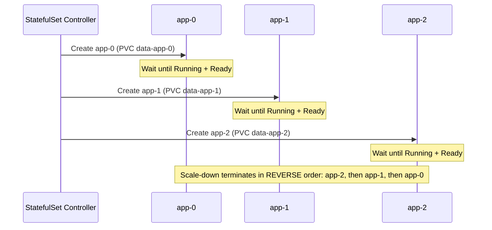

# Chapter 12 — StatefulSets, DaemonSets and Jobs

## Learning Objectives

By the end of this chapter, you will be able to:

- Explain why Deployments are the wrong tool for databases and other stateful workloads
- Configure a StatefulSet with stable Pod identity, stable network identity, and per-replica persistent storage
- Explain the role of a headless Service in a StatefulSet and how ordered startup/scale-down works
- Configure a DaemonSet to run exactly one Pod per node and explain its automatic node-join/leave behavior
- Configure a Job with `completions`, `parallelism`, and `backoffLimit` for batch workloads
- Configure a CronJob with cron scheduling and understand `concurrencyPolicy` options
- Choose the correct controller (Deployment, StatefulSet, DaemonSet, Job, CronJob) for a given workload scenario

---

## Prerequisites for This Chapter

- Deployments and ReplicaSets (Chapter 5) — this chapter assumes you understand the stateless replica model
- Services and DNS, especially how Service discovery works (Chapter 6)
- Persistent Volumes, PersistentVolumeClaims, and StorageClasses (Chapter 8)
- Comfortable reading and writing multi-document YAML manifests

---

## 12.1 Recap: Why Deployments Aren't Enough

A Deployment (Chapter 5) manages a set of **interchangeable, stateless** Pods. Each replica is identical, disposable, and replaceable — if `web-7d9f8c6b5-x2j4k` dies, Kubernetes creates `web-7d9f8c6b5-p9m3q` to replace it. The new Pod gets a new random name, a new IP, and (unless you've attached shared/external storage yourself) no memory of what the old Pod had on disk. This model is perfect for stateless web servers, API backends, and anything where "any replica can handle any request" is true.

But some workloads fundamentally do not fit that model:

- A **database** replica (PostgreSQL, MySQL) has its own distinct data directory — you cannot swap one replica's disk for another's and expect correctness
- A **Kafka broker** has a specific broker ID and owns specific partitions — other brokers and clients need to reach *that specific broker*, not "any broker"
- An **Elasticsearch** or **Zookeeper** node needs a stable identity to participate correctly in cluster consensus and shard assignment

These workloads need three things a Deployment doesn't provide: a **stable, predictable name** for each replica, a **stable network address** for each replica, and **stable storage that follows a specific replica** even if it's rescheduled to a different node. This chapter covers the controllers built for these needs — StatefulSet, DaemonSet, Job, and CronJob — each solving a distinct scheduling pattern that Deployments cannot express.

---

## 12.2 StatefulSet: Stable Identity for Stateful Workloads

A **StatefulSet** manages Pods that need a durable identity across restarts and rescheduling. It provides three specific guarantees that a Deployment does not.

### Guarantee 1 — Stable, predictable Pod names

Deployment replicas get random suffixes: `web-7d9f8c6b5-x2j4k`. StatefulSet replicas get a predictable ordinal suffix based on the StatefulSet's name: `app-0`, `app-1`, `app-2`. If `app-1` is deleted and recreated, it comes back as `app-1` again — same name, not a new random one.

### Guarantee 2 — Stable network identity via a headless Service

Each Pod in a StatefulSet gets its own stable DNS name, in the form:

```
<pod-name>.<service-name>.<namespace>.svc.cluster.local
```

This only works when the StatefulSet is paired with a **headless Service** (`clusterIP: None`) — a Service that, instead of load-balancing across Pods behind a single virtual IP (as a normal ClusterIP Service does, covered in Chapter 6), returns DNS records for *each individual Pod*. This is the mechanism that lets a client connect to `app-0.app-headless.default.svc.cluster.local` specifically, rather than "whichever Pod the Service happens to route to."

### Guarantee 3 — Stable, per-replica storage via volumeClaimTemplates

Instead of one shared PersistentVolumeClaim (PVC) for the whole StatefulSet, each replica gets **its own dedicated PVC**, generated from a template and named after the Pod (`data-app-0`, `data-app-1`, `data-app-2` — see Chapter 8 for PVC/PV mechanics). Critically, if `app-1` is deleted and rescheduled — even onto a completely different node — Kubernetes reattaches the **same** PVC (`data-app-1`) to the new `app-1` Pod. The data follows the identity, not the node.

### Guarantee 4 — Ordered, sequential lifecycle

By default, StatefulSet Pods are created, scaled, and terminated **one at a time, in order**. `app-0` must reach `Running` and `Ready` before `app-1` is even created. Scaling down works in reverse — the highest ordinal Pod (`app-2`) is terminated first. This matters enormously for workloads like databases with primary/replica topologies, where `app-0` is conventionally the first node to bootstrap a cluster and later Pods join it.



### Full Example: A 3-Node Stateful Application

```yaml
# Headless Service — required for stable per-Pod DNS names
apiVersion: v1
kind: Service
metadata:
  name: app-headless
  labels:
    app: statefuldemo
spec:
  clusterIP: None            # this is what makes it "headless"
  selector:
    app: statefuldemo
  ports:
    - port: 5432
      name: db
---
apiVersion: apps/v1
kind: StatefulSet
metadata:
  name: app
spec:
  serviceName: app-headless   # must match the headless Service above
  replicas: 3
  selector:
    matchLabels:
      app: statefuldemo
  template:
    metadata:
      labels:
        app: statefuldemo
    spec:
      containers:
        - name: db
          image: postgres:16
          ports:
            - containerPort: 5432
              name: db
          env:
            - name: POSTGRES_PASSWORD
              valueFrom:
                secretKeyRef:
                  name: db-credentials
                  key: password
          volumeMounts:
            - name: data
              mountPath: /var/lib/postgresql/data
  volumeClaimTemplates:              # one PVC PER REPLICA, generated automatically
    - metadata:
        name: data
      spec:
        accessModes: ["ReadWriteOnce"]
        storageClassName: standard
        resources:
          requests:
            storage: 10Gi
```

After applying this, you get:

```bash
kubectl get pods -l app=statefuldemo
# app-0   1/1   Running
# app-1   1/1   Running
# app-2   1/1   Running

kubectl get pvc
# data-app-0   Bound   10Gi
# data-app-1   Bound   10Gi
# data-app-2   Bound   10Gi

# Each Pod is reachable by its own stable DNS name:
# app-0.app-headless.default.svc.cluster.local
# app-1.app-headless.default.svc.cluster.local
# app-2.app-headless.default.svc.cluster.local
```

**Important operational note:** deleting a StatefulSet does **not** delete its PVCs by default — this is intentional, protecting your data from an accidental `kubectl delete statefulset`. You must delete the PVCs explicitly (`kubectl delete pvc data-app-0 data-app-1 data-app-2`) if you actually intend to discard the data.

---

## 12.3 DaemonSet: One Pod per Node

A **DaemonSet** guarantees that exactly one copy of a Pod runs on every node in the cluster (or on a selected subset of nodes, via `nodeSelector`/affinity/tolerations). This is the controller for **node-level infrastructure agents** — software that needs to observe or act on every single machine, not scale independently of node count.

Common real uses:

- **Log collectors** — Fluentd or Fluent Bit, reading container log files from the node's filesystem and shipping them to a central store
- **Monitoring agents** — `node-exporter` (Prometheus), collecting node-level CPU/memory/disk metrics
- **CNI network plugins** — Calico, Cilium, and similar run their own node agent as a DaemonSet to program networking rules on every node
- **Security/compliance agents** — endpoint agents scanning every node for vulnerabilities or policy violations

The key structural difference from a Deployment: **a DaemonSet has no `replicas` field.** The desired Pod count isn't a number you choose — it's derived automatically from the number of matching nodes. When a new node joins the cluster (autoscaling adds one, or you provision a new machine), the DaemonSet controller automatically schedules a new Pod onto it. When a node is removed, its DaemonSet Pod is garbage collected along with it. You never manually scale a DaemonSet.

```yaml
apiVersion: apps/v1
kind: DaemonSet
metadata:
  name: fluent-bit
  namespace: logging
spec:
  selector:
    matchLabels:
      app: fluent-bit
  template:
    metadata:
      labels:
        app: fluent-bit
    spec:
      tolerations:
        # allow scheduling even on control-plane/tainted nodes — log collection
        # typically needs to run EVERYWHERE, including control-plane nodes
        - key: node-role.kubernetes.io/control-plane
          effect: NoSchedule
      containers:
        - name: fluent-bit
          image: fluent/fluent-bit:3.1
          resources:
            requests:
              cpu: 100m
              memory: 128Mi
            limits:
              memory: 256Mi
          volumeMounts:
            - name: varlog
              mountPath: /var/log
              readOnly: true
            - name: varlibdockercontainers
              mountPath: /var/lib/docker/containers
              readOnly: true
      volumes:
        - name: varlog
          hostPath:
            path: /var/log
        - name: varlibdockercontainers
          hostPath:
            path: /var/lib/docker/containers
```

Notice the `hostPath` volumes — DaemonSets very commonly mount paths from the underlying **node's** filesystem (not a Pod-local volume), because their entire purpose is to observe or interact with node-level state (log files written by the container runtime, node metrics exposed via `/proc`, etc.).

```bash
kubectl get daemonset -n logging
# NAME         DESIRED   CURRENT   READY   NODE SELECTOR
# fluent-bit   4         4         4       <none>
# DESIRED automatically equals the number of eligible nodes — not something you set
```

---

## 12.4 Job: Run to Completion

A **Job** is for workloads that should **run once (or a fixed number of times) and then stop** — not a long-running service. Think of it as the opposite mental model from a Deployment: a Deployment tries to keep Pods running forever; a Job tries to run a Pod exactly until it succeeds, then leaves it done.

Common use cases: batch data processing (crunch a file, write results, exit), one-off database migration scripts, report generation, sending a batch of emails.

Key fields:

| Field | Meaning |
|---|---|
| `completions` | Total number of successful Pod completions required for the Job to be considered done |
| `parallelism` | How many Pods can run at the same time working toward that total |
| `backoffLimit` | Number of retries allowed after a Pod fails before the Job itself is marked failed |
| `activeDeadlineSeconds` | Optional hard wall-clock timeout for the entire Job |

```yaml
apiVersion: batch/v1
kind: Job
metadata:
  name: image-resize-batch
spec:
  completions: 5      # need 5 total successful Pod completions
  parallelism: 2      # but only run 2 Pods at once, working through the queue
  backoffLimit: 3      # retry a failed Pod up to 3 times before giving up
  template:
    spec:
      restartPolicy: OnFailure   # Jobs require OnFailure or Never, never Always
      containers:
        - name: resize-worker
          image: image-resizer:1.4
          command: ["python", "resize_batch.py"]
          env:
            - name: QUEUE_URL
              value: "https://queue.internal/image-jobs"
```

With `completions: 5, parallelism: 2`, Kubernetes runs 2 Pods concurrently; as each one finishes successfully, a new one starts, until 5 total successes have been recorded. If a Pod fails, it counts against `backoffLimit`, and a replacement Pod is started (following the exponential backoff pattern described for `CrashLoopBackOff` in Chapter 10) until either it succeeds or `backoffLimit` retries are exhausted, at which point the entire Job is marked `Failed`.

```bash
kubectl get jobs
# NAME                  COMPLETIONS   DURATION   AGE
# image-resize-batch    5/5           45s        1m

kubectl get pods -l job-name=image-resize-batch
# 5 Pods total, each showing "Completed" once finished — Job Pods are NOT deleted automatically,
# so you can inspect logs from any of them after the fact
```

Note `restartPolicy: OnFailure` — this is the field discussed in Chapter 10, and Jobs are exactly why `OnFailure` (and `Never`) exist as options distinct from `Always`. A Pod that exits `0` (success) in a Job should stay finished, not be restarted — the opposite of a Deployment's expectation.

---

## 12.5 CronJob: Scheduled Jobs

A **CronJob** creates a new **Job** on a recurring schedule, using standard cron syntax. It's the Kubernetes-native replacement for a crontab entry that runs `some-script.sh` on a server — except the "server" here is an ephemeral Pod, created fresh on each scheduled run.

```yaml
apiVersion: batch/v1
kind: CronJob
metadata:
  name: nightly-db-backup
spec:
  schedule: "0 2 * * *"                    # 2:00 AM every day, standard cron syntax
  concurrencyPolicy: Forbid                 # do not start a new run if the previous one is still going
  successfulJobsHistoryLimit: 3             # keep the last 3 successful Job records for inspection
  failedJobsHistoryLimit: 5                 # keep the last 5 failed Job records for debugging
  jobTemplate:
    spec:
      backoffLimit: 2
      template:
        spec:
          restartPolicy: OnFailure
          containers:
            - name: backup
              image: db-backup-tool:2.0
              command: ["/scripts/backup-to-s3.sh"]
              env:
                - name: S3_BUCKET
                  value: "company-db-backups"
                - name: DB_HOST
                  value: "postgres-primary.default.svc.cluster.local"
```

**`concurrencyPolicy`** controls what happens if a scheduled run is still executing when the *next* scheduled time arrives:

| Value | Behavior |
|---|---|
| `Allow` (default) | Start the new Job anyway — you can have overlapping runs |
| `Forbid` | Skip the new run entirely if the previous one is still active |
| `Replace` | Cancel the still-running previous Job and start the new one immediately |

For a nightly backup job, `Forbid` is almost always correct — you never want two backup jobs racing to write to the same destination simultaneously. `Replace` suits workloads where only the freshest run matters and a stale in-flight run should be abandoned. `Allow` fits workloads that are naturally safe to run concurrently (e.g., independent, idempotent processing of different data partitions).

`successfulJobsHistoryLimit` and `failedJobsHistoryLimit` cap how many completed Job objects (and their Pods) are retained for inspection — without these, a CronJob running every few minutes over months would accumulate an unbounded number of old Job/Pod records cluttering the cluster.

```bash
kubectl get cronjobs
# NAME                SCHEDULE      SUSPEND   ACTIVE   LAST SCHEDULE   AGE
# nightly-db-backup    0 2 * * *     False     0        14h             3d

# Manually trigger an ad-hoc run of a CronJob's Job template (useful for testing)
kubectl create job manual-backup-test --from=cronjob/nightly-db-backup
```

---

## 12.6 Decision Table: Which Controller Do I Need?

| Scenario | Controller |
|---|---|
| Stateless web app or API, any replica can serve any request | **Deployment** |
| Database, message broker, or clustered system needing stable identity + per-replica storage | **StatefulSet** |
| Log shipper, metrics agent, or network plugin that must run on every node | **DaemonSet** |
| One-time data migration script or batch processing job that should run to completion | **Job** |
| Nightly backup, scheduled report, or any recurring task on a cron schedule | **CronJob** |
| GPU training run processing 1000 files, 4 at a time | **Job** with `completions: 1000, parallelism: 4` |
| Elasticsearch/Kafka/Zookeeper cluster | **StatefulSet** |
| Security/compliance scanning agent on every node | **DaemonSet** |
| Weekly report emailed to stakeholders | **CronJob** |

---

## 12.7 Real-World Scenario: Elasticsearch, Fluent Bit, and Nightly Snapshots

A company runs a self-managed logging and search platform on Kubernetes, combining all three controllers from this chapter into one coherent system:

**Elasticsearch as a StatefulSet** — 3 nodes (`es-0`, `es-1`, `es-2`), each with its own 100Gi PVC via `volumeClaimTemplates`, and a headless Service (`es-headless`) giving each node a stable DNS name so the Elasticsearch cluster's own internal discovery (which needs to reach specific named nodes to form a quorum) works correctly. If `es-1`'s Pod is rescheduled to a different node after a hardware failure, it reattaches to the same PVC and rejoins the cluster with its original shard data intact — no cluster-wide reindex required.

**Fluent Bit as a DaemonSet** — one Pod per node across the entire cluster, mounting each node's `/var/log` and container log directories via `hostPath`, tailing every container's logs on that node and forwarding them into Elasticsearch. As the company's autoscaler adds nodes during peak traffic, Fluent Bit Pods appear on them automatically with zero manual intervention; as nodes scale back down, their Fluent Bit Pods are cleaned up along with them.

**A nightly CronJob for index snapshots** — scheduled at `0 3 * * *` (3 AM daily), `concurrencyPolicy: Forbid` (a snapshot must fully complete before the next one starts), running a small container that calls the Elasticsearch snapshot API to back up the previous day's indices to an S3 bucket, with `failedJobsHistoryLimit: 10` retained so the on-call engineer can inspect the logs of any failed snapshot attempt from the past ten days.

```yaml
apiVersion: batch/v1
kind: CronJob
metadata:
  name: es-snapshot-to-s3
spec:
  schedule: "0 3 * * *"
  concurrencyPolicy: Forbid
  successfulJobsHistoryLimit: 5
  failedJobsHistoryLimit: 10
  jobTemplate:
    spec:
      backoffLimit: 2
      template:
        spec:
          restartPolicy: OnFailure
          containers:
            - name: snapshot
              image: es-snapshot-tool:1.2
              command: ["/scripts/snapshot.sh"]
              env:
                - name: ES_HOST
                  value: "es-0.es-headless.default.svc.cluster.local"
                - name: S3_BUCKET
                  value: "company-es-snapshots"
```

This combination — StatefulSet for the stateful core, DaemonSet for node-wide agents, CronJob for scheduled maintenance — is one of the most common production patterns you'll encounter operating real Kubernetes clusters, and each piece exists because a Deployment could not have expressed its requirements.

---

## Best Practices

- Always pair a StatefulSet with a headless Service (`clusterIP: None`) matching its `serviceName` field — without it, per-Pod DNS names won't resolve
- Never assume deleting a StatefulSet deletes its PVCs — delete them explicitly and deliberately when you actually want to discard stateful data
- Set resource requests/limits on DaemonSet Pods conservatively — they run on *every* node, so an oversized request can starve application workloads cluster-wide
- Use `concurrencyPolicy: Forbid` for any Job whose runs must not overlap (backups, migrations, anything writing to a shared destination)
- Set `activeDeadlineSeconds` on Jobs that call external services, to guarantee they don't hang indefinitely if a dependency stalls
- Keep `successfulJobsHistoryLimit`/`failedJobsHistoryLimit` low but non-zero — you want enough history to debug a failure, not an unbounded pile of old Job objects

---

## Common Mistakes

- Forgetting the headless Service for a StatefulSet, then being confused why `app-0.app-headless...` doesn't resolve
- Using a Deployment for a database "because it's easier," then hitting data-consistency problems when Pods get rescheduled with mismatched storage
- Setting `restartPolicy: Always` on a Job's Pod template (Jobs require `OnFailure` or `Never` — `Always` will be rejected or behave incorrectly)
- Leaving `concurrencyPolicy` at the default `Allow` on a CronJob that writes to a shared resource, causing two overlapping runs to corrupt or duplicate output
- Assuming a DaemonSet needs a `replicas` field — it doesn't have one, and adding one has no effect; Pod count is always derived from matching node count

*(The full catalog of common Kubernetes mistakes, with fixes, is covered in Chapter 16.)*

---

## Summary

| Topic | Key Point |
|---|---|
| Why not Deployment | Deployments assume interchangeable, stateless Pods — some workloads need stable identity and storage |
| StatefulSet | Stable Pod names (`app-0`, `app-1`...), stable DNS via headless Service, stable per-replica storage via `volumeClaimTemplates`, ordered lifecycle |
| Headless Service | `clusterIP: None`; returns individual Pod DNS records instead of load-balancing behind one virtual IP |
| DaemonSet | Exactly one Pod per (eligible) node; no `replicas` field; auto-adds/removes Pods as nodes join/leave |
| Job | Run-to-completion workload; `completions` + `parallelism` control the work; `backoffLimit` controls retries |
| CronJob | Creates Jobs on a cron schedule; `concurrencyPolicy` (`Allow`/`Forbid`/`Replace`) governs overlapping runs |
| Decision table | Stateless → Deployment; stateful → StatefulSet; per-node agent → DaemonSet; one-off → Job; scheduled → CronJob |

---

## Knowledge Check

1. Name the three stability guarantees a StatefulSet provides that a Deployment does not.
2. Why does a StatefulSet require a headless Service, and what does `clusterIP: None` actually change about how that Service behaves?
3. If you delete a StatefulSet with `kubectl delete statefulset app`, what happens to its PVCs? Why is this the default behavior?
4. A DaemonSet has no `replicas` field. How does Kubernetes decide how many Pods it should run, and what happens automatically when a new node joins the cluster?
5. You configure a Job with `completions: 10` and `parallelism: 3`. Explain in your own words how Kubernetes will execute this Job over time.
6. A CronJob runs a report every 15 minutes, but sometimes a run takes longer than 15 minutes to finish. Explain the difference in outcome between setting `concurrencyPolicy: Allow`, `Forbid`, and `Replace` in this situation.

---

## Hands-On Exercise

**Goal:** Deploy a StatefulSet, a DaemonSet, and a scheduled Job on a local `kind` cluster.

1. Create (or reuse) a `kind` cluster: `kind create cluster --name workloads-demo`.
2. Apply the headless Service and StatefulSet from section 12.2 (you can substitute a lightweight image like `postgres:16` or even `busybox` with a sleep loop if you want to avoid pulling a large image). Confirm with `kubectl get pods -w` that `app-0`, `app-1`, and `app-2` come up **in order**, each reaching `Running` before the next is created. Confirm three separate PVCs exist with `kubectl get pvc`.
3. Delete the `app-1` Pod directly (`kubectl delete pod app-1`) and confirm it comes back with the **same name** and reattaches to the **same PVC** (check `kubectl describe pod app-1` for the volume claim name).
4. Apply the Fluent Bit DaemonSet manifest from section 12.3 (or a simplified version using `busybox` if you don't want to configure real log shipping). Confirm exactly one Pod is running per node with `kubectl get pods -o wide -l app=fluent-bit`.
5. Create the Job from section 12.4 with `completions: 5, parallelism: 2` using a simple image (e.g., `busybox` running `sleep 5 && echo done`). Watch `kubectl get pods -l job-name=image-resize-batch -w` and observe at most 2 Pods running at once until all 5 complete.
6. Create a CronJob scheduled for one minute in the future using a `busybox` container that just echoes the date. Wait for it to fire, then run `kubectl get jobs` and `kubectl logs -l job-name=<generated-job-name>` to confirm it executed.

---

## Further Reading

- [StatefulSets](https://kubernetes.io/docs/concepts/workloads/controllers/statefulset/)
- [Headless Services](https://kubernetes.io/docs/concepts/services-networking/service/#headless-services)
- [DaemonSet](https://kubernetes.io/docs/concepts/workloads/controllers/daemonset/)
- [Jobs — Run to Completion](https://kubernetes.io/docs/concepts/workloads/controllers/job/)
- [CronJob](https://kubernetes.io/docs/concepts/workloads/controllers/cron-jobs/)

---

<div style="display:flex;justify-content:space-between;align-items:center;">
  <a href="./11-ingress-and-load-balancing.md">← Previous: Ingress and Load Balancing</a>
  <a href="./00-index.md">🏠 Index</a>
  <a href="./13-helm-and-package-management.md">Next: Helm and Package Management →</a>
</div>
