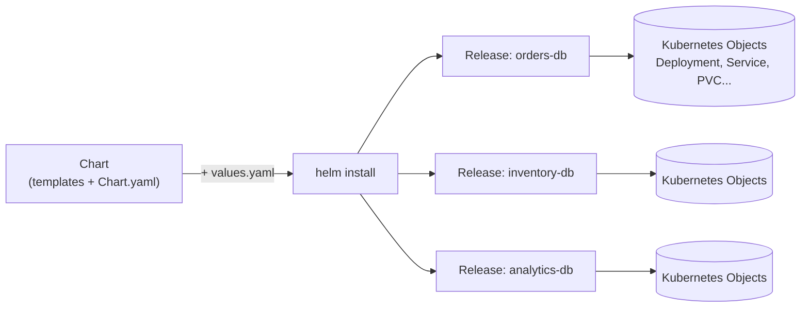

# Chapter 13 — Helm and Package Management

## Learning Objectives

By the end of this chapter, you will be able to:

- Explain the problem Helm solves and why raw YAML manifests don't scale across environments
- Describe the core Helm concepts: Chart, Release, Values, and Repository
- Read and understand the anatomy of a Helm chart, including its templating engine
- Install, upgrade, roll back, and uninstall releases using the Helm CLI
- Add a public chart repository and install a real-world chart with custom values
- Write a minimal custom Helm chart from scratch for a simple application
- Compare Helm, Kustomize, and raw `kubectl apply -f` and choose the right tool for a situation

---

## Prerequisites for This Chapter

- Comfortable writing and applying Kubernetes YAML manifests (Deployments, Services, ConfigMaps) — Chapters 4–7
- Understand Ingress and how external traffic reaches a Service — Chapter 11
- Understand StatefulSets, DaemonSets, and Jobs — Chapter 12
- A working local cluster (`kind` or `minikube`) with `kubectl` configured — Chapter 3
- Comfortable with basic shell scripting and YAML syntax

---

## 13.1 The Problem: YAML Doesn't Scale Across Environments

By the time a real application is running in Kubernetes, it is rarely just one manifest. A typical service needs:

- A `Deployment` for the application Pods
- A `Service` to expose it inside the cluster
- A `ConfigMap` for non-secret configuration
- A `Secret` for credentials
- An `Ingress` to route external traffic
- A `HorizontalPodAutoscaler` for scaling
- Maybe a `PodDisruptionBudget`, a `ServiceAccount`, and RBAC bindings

That's easily 8-10 YAML files for *one* application. Now multiply that by environments: dev needs 1 replica and no Ingress TLS; staging needs 2 replicas and a staging hostname; production needs 5 replicas, strict resource limits, and a production TLS certificate. Do you maintain three near-identical copies of every file, hand-editing replica counts and hostnames each time you promote a change? That approach breaks down fast:

- **Copy-paste drift.** Someone fixes a liveness probe in the prod YAML and forgets to port the fix to staging. Weeks later, staging is silently misconfigured.
- **No versioning of "the whole app."** Kubernetes tracks individual objects, not "version 2.3.0 of my application" as a single, installable, upgradable, rollback-able unit.
- **No parameterization.** Raw manifests are static text. There's no clean way to say "this value comes from a config file that differs per environment" without a templating layer bolted on top.

This is the exact problem package managers solved for operating systems and language ecosystems decades ago. `apt` doesn't ask you to hand-assemble a `.deb` file's dependency graph — it resolves versions and installs a *package*. `npm` doesn't ask you to manually vendor every dependency of every dependency — you declare intent in `package.json` and npm handles the mechanics.

**Helm is that package manager, but for Kubernetes.** It packages a set of related Kubernetes manifests into one versioned, parameterized, installable unit called a **chart**, and it tracks every install of that chart as a **release** that can be upgraded or rolled back with a single command.

---

## 13.2 Core Helm Concepts

Four terms form the vocabulary of Helm. Get these clear before anything else makes sense.

| Concept | What It Is | Analogy |
|---|---|---|
| **Chart** | A package: a directory of templated Kubernetes YAML plus metadata | A `.deb` package or an `npm` package |
| **Release** | A specific installed instance of a chart in a cluster, given a name | A running installation — you can `apt install nginx` once, but you can install the same Helm chart many times as different releases |
| **Values** | The parameters (`values.yaml`) that fill in the chart's templates | `package.json` config, or `terraform.tfvars` for a Terraform module |
| **Repository** | A location where charts are published and discovered | `npmjs.com`, an APT repository, or PyPI |

The relationship: you take a **Chart**, combine it with a set of **Values**, and `helm install` produces a **Release** — an actual set of live Kubernetes objects in your cluster, tracked by name.

Crucially, one chart can produce many releases. You can install the `bitnami/postgresql` chart three times in the same cluster — once as `orders-db`, once as `inventory-db`, once as `analytics-db` — each with its own values, each independently upgradable and uninstallable.



---

## 13.3 Chart Anatomy

A chart is just a directory with a specific, predictable structure. Here is a real, minimal chart tree:

```
mychart/
├── Chart.yaml           # Metadata: name, version, description
├── values.yaml          # Default configuration values
├── charts/              # Subcharts (dependencies) go here
├── templates/           # Templated Kubernetes manifests
│   ├── deployment.yaml
│   ├── service.yaml
│   ├── configmap.yaml
│   ├── ingress.yaml
│   ├── hpa.yaml
│   ├── _helpers.tpl      # Reusable template snippets/functions
│   └── NOTES.txt         # Printed to the user after install/upgrade
└── .helmignore          # Files to exclude when packaging the chart
```

**`Chart.yaml`** — the package metadata:

```yaml
apiVersion: v2
name: mychart
description: A Helm chart for the payments API
type: application
version: 1.4.0        # the chart's own version — bump this when templates change
appVersion: "2.3.0"    # the version of the application being deployed
```

Note the two version fields are independent. `version` is the chart's release number (bump it when you change templates or defaults). `appVersion` documents which version of your actual application image the chart currently deploys — it's informational and doesn't affect chart resolution.

**`values.yaml`** — the default parameters every template reads from:

```yaml
replicaCount: 2

image:
  repository: myregistry.io/payments-api
  tag: "2.3.0"
  pullPolicy: IfNotPresent

service:
  type: ClusterIP
  port: 80

resources:
  requests:
    cpu: 100m
    memory: 128Mi
  limits:
    cpu: 500m
    memory: 512Mi

ingress:
  enabled: false
  host: payments.example.com
```

---

## 13.4 Templating Basics: Go Templates + Sprig

Helm templates are plain Kubernetes YAML with `{{ }}` placeholders, processed by Go's `text/template` engine, extended with a library of helper functions called **Sprig** (string manipulation, defaults, type conversion, etc.). You do not need to master Go's templating language deeply for day-to-day chart authoring — a handful of patterns cover most real charts.

```yaml
# templates/deployment.yaml
apiVersion: apps/v1
kind: Deployment
metadata:
  name: {{ .Release.Name }}-mychart
  labels:
    app.kubernetes.io/name: mychart
    app.kubernetes.io/instance: {{ .Release.Name }}
spec:
  replicas: {{ .Values.replicaCount }}
  selector:
    matchLabels:
      app.kubernetes.io/name: mychart
      app.kubernetes.io/instance: {{ .Release.Name }}
  template:
    metadata:
      labels:
        app.kubernetes.io/name: mychart
        app.kubernetes.io/instance: {{ .Release.Name }}
    spec:
      containers:
        - name: mychart
          image: "{{ .Values.image.repository }}:{{ .Values.image.tag }}"
          imagePullPolicy: {{ .Values.image.pullPolicy }}
          ports:
            - containerPort: 8080
          resources:
            {{- toYaml .Values.resources | nindent 12 }}
```

What's happening here:

- `.Values.replicaCount` reads a value from `values.yaml` (or an override supplied at install time).
- `.Release.Name` is a built-in object Helm injects automatically — the name you give the release at `helm install <name> ...`. This is how the *same chart* produces uniquely-named, non-colliding resources across multiple installs.
- `{{- toYaml .Values.resources | nindent 12 }}` is a common Sprig pattern: dump an entire YAML block from values (rather than field-by-field) and re-indent it to fit the surrounding structure. The leading `-` trims whitespace/newlines to keep the rendered YAML clean.

You can always preview exactly what a chart will render without touching the cluster:

```bash
# Render templates locally, no cluster contact
helm template myrelease ./mychart

# Render with a specific values override
helm template myrelease ./mychart -f values-prod.yaml

# Ask the Kubernetes API server to validate too (dry run against a real cluster)
helm install myrelease ./mychart --dry-run --debug
```

Making `helm template` (or `--dry-run`) a habit before every real install is the single best way to avoid surprises — you see the exact YAML that would be applied, with all placeholders resolved.

---

## 13.5 Installing, Upgrading, and Rolling Back Releases

```bash
# Install a chart from a local directory as a new release named "payments"
helm install payments ./mychart

# Install into a specific namespace, creating it if needed
helm install payments ./mychart --namespace payments-ns --create-namespace

# List all releases in the current namespace
helm list

# NAME       NAMESPACE     REVISION   STATUS     CHART            APP VERSION
# payments   payments-ns   1          deployed   mychart-1.4.0    2.3.0

# Check the detailed status of a release
helm status payments

# Upgrade an existing release with new values or a new chart version
helm upgrade payments ./mychart --set image.tag=2.4.0

# The idempotent CI/CD pattern: install if absent, upgrade if present
# This single command is safe to run on every deploy — first run installs,
# every subsequent run upgrades
helm upgrade --install payments ./mychart -f values-prod.yaml

# See the revision history of a release
helm history payments

# REVISION   UPDATED                   STATUS       CHART           APP VERSION
# 1          Mon Jun 1 10:00:00 2026   superseded   mychart-1.4.0   2.3.0
# 2          Mon Jun 1 14:30:00 2026   deployed     mychart-1.4.1   2.4.0

# Roll back to a previous revision
helm rollback payments 1

# Completely remove a release and its Kubernetes objects
helm uninstall payments
```

`helm upgrade --install` deserves special attention because it is the pattern you will actually use in CI/CD pipelines. A pipeline stage that runs on every merge to `main` doesn't know in advance whether this is the *first* deploy of a service or the *hundredth*. Using plain `helm install` would fail on every run after the first ("release already exists"), and using plain `helm upgrade` would fail on the very first run ("release not found"). `--install` makes the command idempotent — the same invocation is correct whether or not the release already exists, which is exactly the property a deployment pipeline needs.

Every `helm upgrade` records a new revision. That revision history is what makes `helm rollback` possible: Helm keeps a copy of the fully-rendered manifests for each revision (by default the last 10) so a rollback is simply "re-apply the previous revision's rendered YAML" — no need to remember what the old values were.

---

## 13.6 Using Public Chart Repositories

Most infrastructure software you'd otherwise hand-roll — PostgreSQL, Redis, RabbitMQ, an Ingress controller, cert-manager, Prometheus — already has a well-maintained public Helm chart. **Artifact Hub** (artifacthub.io) is the standard place to search across all public chart repositories.

```bash
# Add a chart repository (a URL that serves an index of charts)
helm repo add bitnami https://charts.bitnami.com/bitnami
helm repo add ingress-nginx https://kubernetes.github.io/ingress-nginx

# Refresh the local cache of what each repo offers
helm repo update

# Search for a chart across all added repos
helm search repo postgresql

# NAME                    CHART VERSION   APP VERSION   DESCRIPTION
# bitnami/postgresql      13.2.0          16.1.0        PostgreSQL is an open source...

# Inspect a chart's full default values before installing
helm show values bitnami/postgresql > default-values.yaml

# Install with your own override file
helm install orders-db bitnami/postgresql -f myvalues.yaml

# Or override a handful of values inline without a file
helm install orders-db bitnami/postgresql \
  --set auth.postgresPassword=supersecret \
  --set primary.persistence.size=20Gi
```

A real `myvalues.yaml` for the `ingress-nginx` chart, showing that overrides only need to specify what differs from the chart's defaults:

```yaml
# myvalues.yaml — only what we need to change
controller:
  replicaCount: 3
  service:
    type: LoadBalancer
  resources:
    requests:
      cpu: 200m
      memory: 256Mi
    limits:
      cpu: 500m
      memory: 512Mi
```

```bash
helm install ingress-nginx ingress-nginx/ingress-nginx \
  --namespace ingress-nginx --create-namespace \
  -f myvalues.yaml
```

This is the everyday Helm workflow for infrastructure components: find the chart, dump its default values to see what's configurable, write a small override file with only the handful of settings you actually need to change, and install.

---

## 13.7 Writing a Minimal Custom Chart From Scratch

Helm can scaffold a starter chart for you:

```bash
helm create mychart
```

This generates a fairly elaborate starter chart (with Ingress, HPA, ServiceAccount, and Pod autoscaling all templated and conditionally enabled). For a course-level example, let's trim it to the essentials: a Deployment, a Service, and a `values.yaml` for a simple web app.

```
mychart/
├── Chart.yaml
├── values.yaml
└── templates/
    ├── deployment.yaml
    └── service.yaml
```

```yaml
# Chart.yaml
apiVersion: v2
name: mychart
description: A minimal chart for a simple web service
type: application
version: 0.1.0
appVersion: "1.0.0"
```

```yaml
# values.yaml
replicaCount: 2

image:
  repository: nginxdemos/hello
  tag: "plain-text"
  pullPolicy: IfNotPresent

service:
  type: ClusterIP
  port: 80
  targetPort: 80

resources:
  requests:
    cpu: 50m
    memory: 64Mi
  limits:
    cpu: 200m
    memory: 128Mi
```

```yaml
# templates/deployment.yaml
apiVersion: apps/v1
kind: Deployment
metadata:
  name: {{ .Release.Name }}-mychart
  labels:
    app.kubernetes.io/name: mychart
    app.kubernetes.io/instance: {{ .Release.Name }}
spec:
  replicas: {{ .Values.replicaCount }}
  selector:
    matchLabels:
      app.kubernetes.io/name: mychart
      app.kubernetes.io/instance: {{ .Release.Name }}
  template:
    metadata:
      labels:
        app.kubernetes.io/name: mychart
        app.kubernetes.io/instance: {{ .Release.Name }}
    spec:
      containers:
        - name: mychart
          image: "{{ .Values.image.repository }}:{{ .Values.image.tag }}"
          imagePullPolicy: {{ .Values.image.pullPolicy }}
          ports:
            - containerPort: {{ .Values.service.targetPort }}
          resources:
            {{- toYaml .Values.resources | nindent 12 }}
```

```yaml
# templates/service.yaml
apiVersion: v1
kind: Service
metadata:
  name: {{ .Release.Name }}-mychart
  labels:
    app.kubernetes.io/name: mychart
    app.kubernetes.io/instance: {{ .Release.Name }}
spec:
  type: {{ .Values.service.type }}
  ports:
    - port: {{ .Values.service.port }}
      targetPort: {{ .Values.service.targetPort }}
  selector:
    app.kubernetes.io/name: mychart
    app.kubernetes.io/instance: {{ .Release.Name }}
```

```bash
# Validate the templates render correctly, no cluster needed
helm template demo ./mychart

# Install for real
helm install demo ./mychart

# Confirm the resulting objects exist
kubectl get deployment,service -l app.kubernetes.io/instance=demo
```

This is the complete round trip: write two templates and a values file, and you have a reusable, parameterized, versioned package — install it twice with different release names and you get two fully independent copies of the same application.

---

## 13.8 Helm vs Kustomize vs Raw Manifests

Helm is not the only way to manage environment-specific Kubernetes configuration. **Kustomize** is a template-free alternative built directly into `kubectl` (`kubectl apply -k`). Instead of filling in placeholders in a templating language, Kustomize starts from a base set of plain, valid YAML manifests and applies **patches** on top of them per environment — there is no `{{ }}` syntax anywhere; every file is real YAML that could be applied on its own.

```yaml
# kustomization.yaml (overlays/production/kustomization.yaml)
resources:
  - ../../base
patches:
  - path: replica-patch.yaml
    target:
      kind: Deployment
      name: mychart
```

```yaml
# replica-patch.yaml
apiVersion: apps/v1
kind: Deployment
metadata:
  name: mychart
spec:
  replicas: 5
```

| Aspect | Raw `kubectl apply -f` | Kustomize | Helm |
|---|---|---|---|
| Templating | None — hand-edit files | None — patch-based overlays | Full templating language (Go templates + Sprig) |
| Environment variation | Copy-paste entire files | Base + per-environment patches | One `values.yaml` per environment |
| Packaging/versioning | None | None (just directories) | First-class: `Chart.yaml` version, `appVersion` |
| Reuse across projects | Copy-paste | Copy-paste bases, or remote bases | Install the same chart many times as different releases |
| Rollback | Manual (`kubectl apply` an old file) | Manual | Built-in: `helm rollback` |
| Public ecosystem | None | Small | Large — Artifact Hub, Bitnami, most CNCF projects publish charts |
| Learning curve | Lowest | Low | Moderate (templating syntax, chart structure) |
| Best fit | Tiny projects, learning, one-off scripts | Teams that want zero templating "magic," GitOps-friendly patch review | Reusable packages, third-party software, complex parameterized apps |

Neither replaces the other everywhere — some organizations use Kustomize to manage environment overlays and Helm to install third-party software (an Ingress controller, cert-manager, a database), using both in the same cluster for different purposes. For this course, the important takeaway is: **raw manifests work but don't scale past a handful of environments; Kustomize solves environment variation without a templating language; Helm solves both variation and packaging/distribution, at the cost of learning a templating syntax.**

---

## 13.9 Real-World Scenario

A platform team at a mid-sized company noticed every product team was writing nearly identical Kubernetes YAML: a Deployment, a Service, an HPA, and an Ingress, differing only in image name, replica counts, resource sizes, and hostname. Six teams meant six slightly-different, independently-drifting copies of the same 150 lines of YAML — and every time the platform team wanted to add a standard label, a security context default, or a PodDisruptionBudget, it meant six pull requests to six repos, with predictably inconsistent results.

The fix: the platform team published one internal Helm chart — `internal/web-service` — encapsulating the Deployment + Service + HPA + Ingress pattern, with sensible defaults baked in (a `securityContext` that blocks running as root, a default `PodDisruptionBudget`, standard labels). Product teams no longer write Kubernetes YAML at all. Each team's entire deployment configuration becomes a `values.yaml` roughly 15 lines long:

```yaml
# team-checkout/values.yaml
image:
  repository: registry.internal/checkout-service
  tag: "1.8.2"
replicaCount: 4
ingress:
  host: checkout.internal.example.com
resources:
  requests:
    cpu: 250m
    memory: 256Mi
```

```bash
helm upgrade --install checkout-service internal/web-service -f team-checkout/values.yaml
```

When the platform team improves the shared chart — say, adding topology spread constraints for better availability — they bump the chart's `version`, and every team picks up the improvement on their next `helm upgrade`, without needing to touch YAML they never had to write in the first place. This is the pattern that makes Helm valuable at organizational scale: it turns "copy-paste a folder of YAML and hope nobody drifts" into "consume a versioned package and supply a few parameters."

---

## Best Practices

- Always run `helm template` or `helm upgrade --install --dry-run` before applying to a real environment — see the exact rendered YAML first.
- Keep `values.yaml` defaults sane for local development; use `-f values-prod.yaml` to layer production-specific overrides rather than maintaining fully separate chart copies.
- Use `helm upgrade --install` in CI/CD pipelines, never bare `helm install`, so the same command works on first deploy and every deploy after.
- Pin chart versions explicitly in production (`helm install ... --version 13.2.0`) rather than always pulling the newest chart version, so upgrades are a deliberate choice, not a surprise.
- Store your custom charts and environment-specific values files in Git, and drive `helm upgrade` from your CI/CD pipeline rather than running it by hand from a laptop.

---

## Common Mistakes

- Editing rendered Kubernetes objects directly with `kubectl edit` instead of updating `values.yaml` and running `helm upgrade` — the next Helm operation silently reverts the manual change.
- Forgetting `--namespace` and installing a release into the wrong namespace (or the accidental default).
- Using `--set` for large or nested structures instead of a values file — becomes unreadable and easy to typo past a few fields.
- Never running `helm template`/`--dry-run` first, and discovering a templating bug only after a broken object is already applied to the cluster.
- Not pinning chart versions, leading to an unplanned major-version chart upgrade (with breaking values schema changes) picked up during a routine deploy.

---

## Summary

Helm packages the growing pile of related Kubernetes YAML that every real application needs into a single versioned, parameterized, installable unit called a chart. A chart combined with a set of values produces a release — a specific, named, trackable installation that can be upgraded and rolled back. Chart templates use Go's templating language plus Sprig helper functions to substitute values from `values.yaml` and built-in objects like `.Release.Name`. `helm upgrade --install` is the idempotent pattern used in CI/CD. Public repositories like Artifact Hub and Bitnami provide production-ready charts for common infrastructure (databases, Ingress controllers) that you customize with your own values file rather than writing from scratch. Kustomize offers a template-free, patch-based alternative built into `kubectl`, useful when teams prefer plain YAML over a templating language; Helm's strength is packaging, versioning, and distribution at scale.

---

## Knowledge Check

1. What is the difference between a Helm chart, a release, and a values file?
2. Why does `helm upgrade --install` behave better in a CI/CD pipeline than using `helm install` alone?
3. You install the `bitnami/postgresql` chart twice in the same namespace with different release names. What happens, and why is this useful?
4. What command lets you see the fully-rendered Kubernetes YAML a chart would produce, without touching the cluster?
5. Compare Kustomize and Helm: which one uses a templating language, and which one uses patches on top of plain YAML?
6. A colleague manually ran `kubectl edit deployment` to hot-fix a running Helm-managed release. What will happen the next time someone runs `helm upgrade`, and why?

---

## Hands-On Exercise

1. Create a local cluster with `kind create cluster --name helm-lab` and confirm `kubectl get nodes` works.
2. Install Helm if you haven't already, then add the `bitnami` and `ingress-nginx` repositories and run `helm repo update`.
3. Run `helm show values bitnami/nginx > default-values.yaml` and inspect it. Write your own `myvalues.yaml` that overrides `replicaCount` to `2` and sets a custom resource request/limit.
4. Install the chart: `helm install web bitnami/nginx -f myvalues.yaml`. Confirm with `helm list` and `kubectl get pods,svc`.
5. Upgrade the release, changing `replicaCount` to `4` in your values file, then run `helm upgrade web bitnami/nginx -f myvalues.yaml`. Confirm the new replica count with `kubectl get pods` and check `helm history web`.
6. Roll back to the previous revision with `helm rollback web 1` and confirm the replica count reverted.
7. Now scaffold your own chart with `helm create mychart`, delete everything in `templates/` except `deployment.yaml` and `service.yaml`, trim `values.yaml` down to the fields those two templates actually use, and install it as a new release named `demo`.
8. Clean up: `helm uninstall web demo` and `kind delete cluster --name helm-lab`.

---

## Further Reading

- [Helm Documentation — Charts](https://helm.sh/docs/topics/charts/)
- [Helm Documentation — Chart Template Guide](https://helm.sh/docs/chart_template_guide/getting_started/)
- [Helm Documentation — Helm Install/Upgrade Commands](https://helm.sh/docs/helm/helm_upgrade/)
- [Artifact Hub](https://artifacthub.io/)
- [Kubernetes Documentation — Kustomize](https://kubernetes.io/docs/tasks/manage-kubernetes-objects/kustomization/)

---

<div style="display:flex;justify-content:space-between;align-items:center;">
  <a href="./12-statefulsets-daemonsets-and-jobs.md">← Previous: StatefulSets, DaemonSets and Jobs</a>
  <a href="./00-index.md">🏠 Index</a>
  <a href="./14-scaling-and-autoscaling.md">Next: Scaling and Autoscaling →</a>
</div>
