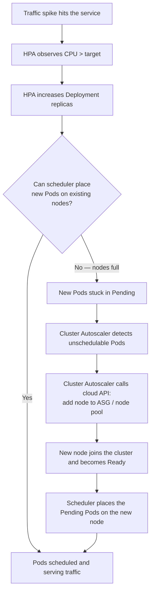

# Chapter 14 — Scaling and Autoscaling

## Learning Objectives

By the end of this chapter, you will be able to:

- Scale a Deployment manually and explain when manual scaling is appropriate
- Configure a Horizontal Pod Autoscaler (HPA) to scale Pods based on CPU utilization
- Explain the role of `metrics-server` and the HPA control loop's scaling calculation
- Describe how custom and external metrics extend HPA beyond CPU/memory
- Explain what the Vertical Pod Autoscaler (VPA) does differently from HPA, and why combining them on the same metric is risky
- Explain how the Cluster Autoscaler adds and removes nodes in response to Pod scheduling pressure
- Describe why scaling to zero requires tools beyond stock HPA, such as KEDA or Knative

---

## Prerequisites for This Chapter

- Deployments and ReplicaSets, including how `replicas` is enforced — Chapter 5
- Resource requests and limits, and how the scheduler uses them — Chapter 9
- Liveness and readiness probes — Chapter 10
- Helm basics, useful for installing `metrics-server` or the Cluster Autoscaler via chart — Chapter 13
- Basic familiarity with your cloud provider's node group / Auto Scaling Group concept is helpful, but not required

---

## 14.1 Manual Scaling

The simplest way to change how many Pods are running is to tell Kubernetes directly:

```bash
kubectl scale deployment/myapp --replicas=5
```

This is a perfectly legitimate operation. If you know a batch job is about to run, or you're preparing for a planned traffic event with a known shape (a product launch at a specific time), scaling manually ahead of time is simple and predictable. The Deployment controller reconciles the ReplicaSet to the new count immediately, the same way it does for any other declarative change.

The limitation is exactly what you'd expect: manual scaling doesn't react to *actual, real-time load*. If traffic spikes at 2 AM because of an unexpected event, nobody is scaling anything until someone notices and runs a command — by which point users have already experienced degraded performance or errors. Manual scaling also doesn't scale back down automatically once load drops, so it tends to bias toward over-provisioning (nobody wants to be the one who scaled down right before a second spike).

This is the gap the Horizontal Pod Autoscaler closes.

---

## 14.2 Horizontal Pod Autoscaler (HPA)

The **Horizontal Pod Autoscaler** automatically adjusts the `replicas` field of a Deployment (or StatefulSet, or ReplicaSet) based on observed metrics — most commonly CPU or memory utilization. "Horizontal" scaling means changing the *number* of Pods, as opposed to "vertical" scaling, which changes the *size* of each Pod (covered in section 14.4).

### Prerequisite: metrics-server

HPA needs a source of live resource usage data. That source is the **Metrics API**, which is served by an add-on called `metrics-server` — it is not part of the Kubernetes control plane by default and must be installed separately in most clusters (managed cloud clusters often ship it pre-installed).

```bash
# Install metrics-server (example using the official manifest)
kubectl apply -f https://github.com/kubernetes-sigs/metrics-server/releases/latest/download/components.yaml

# Confirm it's working — this command has no output until metrics-server is ready
kubectl top nodes
kubectl top pods
```

`metrics-server` scrapes CPU and memory usage from the `kubelet` on every node roughly every 15 seconds and exposes it through the Kubernetes API's Metrics API (`metrics.k8s.io`). Without it installed and healthy, `kubectl top` returns nothing and the HPA controller has no data to scale on — an HPA object will exist but show `<unknown>` for its current metric value.

### A Full HPA Example

```yaml
apiVersion: autoscaling/v2
kind: HorizontalPodAutoscaler
metadata:
  name: myapp-hpa
spec:
  scaleTargetRef:
    apiVersion: apps/v1
    kind: Deployment
    name: myapp
  minReplicas: 3
  maxReplicas: 20
  metrics:
    - type: Resource
      resource:
        name: cpu
        target:
          type: Utilization
          averageUtilization: 70
  behavior:
    scaleDown:
      stabilizationWindowSeconds: 300   # wait 5 min of sustained low usage before scaling down
    scaleUp:
      stabilizationWindowSeconds: 0     # scale up immediately, no delay
```

```bash
kubectl apply -f myapp-hpa.yaml
kubectl get hpa myapp-hpa

# NAME         REFERENCE          TARGETS   MINPODS   MAXPODS   REPLICAS   AGE
# myapp-hpa    Deployment/myapp   45%/70%   3         20        4          2m
```

This HPA targets 70% average CPU utilization across all Pods in the `myapp` Deployment, and will never scale below 3 or above 20 replicas — the guardrails matter as much as the target itself. `minReplicas` protects against scaling to zero traffic-serving capacity due to a metrics blip; `maxReplicas` is a cost and blast-radius ceiling.

**Important**: `averageUtilization` is relative to the Pod's CPU **request**, not its limit. A Pod requesting `200m` CPU with `averageUtilization: 70` targets roughly `140m` of actual usage per Pod. This is exactly why every scalable workload must have `resources.requests` set (Chapter 9) — without a request, HPA has no baseline to compute utilization percentage against, and CPU-based HPA simply will not work.

### The Control Loop

The HPA controller doesn't scale continuously — it runs a periodic loop, by default polling metrics every 15 seconds, and applies a well-defined formula:

```
desiredReplicas = ceil( currentReplicas × ( currentMetricValue / desiredMetricValue ) )
```

Worked example: 4 replicas currently running, actual average CPU utilization is measured at 90%, target is 70%.

```
desiredReplicas = ceil( 4 × (90 / 70) ) = ceil(5.14) = 6
```

The controller requests 6 replicas. Once the new Pods are up and reporting metrics, the loop re-evaluates on the next tick — if utilization settles at 70% across 6 Pods, no further change happens. If it's still elevated, it scales again. This is a feedback loop, not a one-shot calculation — it converges over several polling intervals, not instantly.

Scaling down is intentionally more conservative than scaling up (see the `behavior.scaleDown.stabilizationWindowSeconds` field above). Kubernetes defaults to a 5-minute stabilization window for scale-down decisions specifically to avoid "flapping" — rapidly scaling down right after a brief dip, then immediately needing to scale back up when load returns a few seconds later.

---

## 14.3 Custom and External Metrics

CPU and memory are useful defaults, but they are not always the right signal. Consider a worker service that consumes jobs from a message queue: CPU usage might stay low even while the queue backs up with thousands of unprocessed messages, because each worker is I/O-bound waiting on downstream calls, not CPU-bound. Scaling that service on CPU alone would never trigger — the real bottleneck is queue depth.

The Kubernetes autoscaling API supports two additional metric types beyond the built-in `Resource` type:

- **Custom metrics** — metrics about Kubernetes objects, typically sourced from an in-cluster monitoring system like Prometheus via an adapter (commonly the **Prometheus Adapter**), exposed through the `custom.metrics.k8s.io` API. Example: requests-per-second on an Ingress, or queue depth reported by an application's own `/metrics` endpoint.
- **External metrics** — metrics about things *outside* the cluster entirely, exposed through the `external.metrics.k8s.io` API. Example: the depth of an AWS SQS queue, or a metric from a managed message broker that isn't running inside Kubernetes at all.

```yaml
# Illustrative only — requires Prometheus Adapter or similar installed
apiVersion: autoscaling/v2
kind: HorizontalPodAutoscaler
metadata:
  name: worker-hpa
spec:
  scaleTargetRef:
    apiVersion: apps/v1
    kind: Deployment
    name: queue-worker
  minReplicas: 2
  maxReplicas: 30
  metrics:
    - type: External
      external:
        metric:
          name: sqs_queue_depth
          selector:
            matchLabels:
              queue: orders-processing
        target:
          type: AverageValue
          averageValue: "30"   # aim for ~30 messages per worker Pod
```

Setting up the metrics pipeline behind custom/external metrics (Prometheus, an adapter, exporters) is beyond the scope of this basics course — the important takeaway for now is that **HPA is not limited to CPU and memory**, and real production systems very often scale on business-relevant signals like queue depth or requests-per-second instead.

---

## 14.4 Vertical Pod Autoscaler (VPA)

Where HPA changes the *number* of Pods, the **Vertical Pod Autoscaler** changes the *size* of each Pod — specifically, it adjusts `resources.requests` (and optionally `limits`) based on observed historical usage.

The use case VPA solves: right-sizing. It's common for a Deployment's resource requests to be set once, by guesswork, when the service was first written, and never revisited. Six months later the service might be requesting `1000m` CPU while actually using `150m` — wasting cluster capacity and money — or the reverse: under-requesting and getting CPU-throttled or OOMKilled under normal load. VPA watches actual usage over time and recommends (or automatically applies) better values.

```yaml
apiVersion: autoscaling.k8s.io/v1
kind: VerticalPodAutoscaler
metadata:
  name: myapp-vpa
spec:
  targetRef:
    apiVersion: apps/v1
    kind: Deployment
    name: myapp
  updatePolicy:
    updateMode: "Auto"   # Off | Initial | Recreate | Auto
```

`updateMode` controls how aggressively VPA acts:

| Mode | Behavior |
|---|---|
| `Off` | Only produces recommendations (viewable via `kubectl describe vpa`) — takes no action. Safe way to observe before trusting it. |
| `Initial` | Applies its recommendation only when a Pod is first created, never touches running Pods. |
| `Recreate` | Evicts and recreates Pods with updated resource values when a better recommendation is available. |
| `Auto` | Currently behaves the same as `Recreate` — evicts and recreates Pods to apply new resource values. |

**The important caveat**: VPA in `Auto` (or `Recreate`) mode applies new resource values by *deleting and recreating the Pod* — there is no way to change a running container's resource requests in place. This means VPA causes disruption every time it acts, which has two consequences worth internalizing:

1. It doesn't combine well with HPA on the *same metric*. If VPA is adjusting CPU requests up and down while HPA is simultaneously trying to scale replica count based on CPU utilization (which is computed relative to the request), the two controllers can fight each other — VPA changes the denominator HPA's percentage is based on, causing erratic scaling decisions. If you use both together, scale HPA on one metric (e.g., a custom metric or memory) and let VPA manage CPU/memory requests, or restrict VPA to recommendation-only (`Off` mode) and apply its suggestions manually/periodically.
2. Because it recreates Pods, VPA needs the same graceful-shutdown care as any rolling update (Chapter 5) — a `PodDisruptionBudget` (see Chapter 15) is strongly recommended on any Deployment managed by an active VPA, so multiple replicas aren't recreated simultaneously.

---

## 14.5 Cluster Autoscaler: Scaling the Nodes Themselves

HPA and VPA both operate at the Pod level — they assume the cluster has room to schedule whatever Pods they create. But what happens when HPA decides it needs 10 more replicas and every existing node is already full?

The new Pods are created, but the scheduler can't place them — they sit in `Pending` state, visible via `kubectl get pods` with an event like `0/5 nodes are available: 5 Insufficient cpu`. Nothing about HPA or VPA can fix this; more Pods doesn't help if there's nowhere to run them.

This is what the **Cluster Autoscaler** does: it watches for Pods that are `Pending` due to insufficient resources, and if it determines that adding a node would allow them to be scheduled, it adds a node to the underlying infrastructure — an Auto Scaling Group on AWS, a node pool on GKE, or a Virtual Machine Scale Set on AKS. Conversely, it also watches for nodes that are significantly underutilized for a sustained period and, if the Pods on them can be safely rescheduled elsewhere, drains and removes those nodes to reduce cost.



The two autoscalers operate on different layers and different timescales — HPA reacts in seconds to tens of seconds (bounded by the metrics polling interval and Pod startup time); Cluster Autoscaler reacts in the time it takes a cloud provider to provision and boot a new VM, which is typically one to a few minutes. This gap matters operationally: during the minutes a new node is booting, Pending Pods simply wait. Reducing that gap (e.g., keeping a small buffer of spare capacity, or using faster-booting node types) is a common production tuning knob, but is outside the scope of this basics course.

---

## 14.6 Scaling to Zero

A natural question once you understand HPA: can it scale a Deployment down to zero Pods when there's no traffic at all, to save cost? **No — `minReplicas` in stock HPA cannot go below 1.** HPA is designed to size an already-running service up and down, not to turn a service fully off and back on based on incoming demand.

Scaling to zero — and, critically, scaling back up from zero the moment a request arrives — is a different problem requiring a component that can intercept traffic (or an event) *before* any Pod exists, hold or queue it, trigger a scale-up from zero, and then release the traffic once a Pod is ready. Two well-known projects solve this:

- **KEDA (Kubernetes Event-Driven Autoscaling)** — extends the HPA model to scale based on event sources (queue length, Kafka lag, cron schedules, and dozens of other "scalers"), and explicitly supports scaling a Deployment down to zero replicas when there are no events to process.
- **Knative Serving** — a fuller "serverless on Kubernetes" framework that scales HTTP-serving workloads to zero and back up on demand, including request buffering while a cold-start Pod boots.

Both are advanced, add-on components rather than built into core Kubernetes, so full coverage is out of scope for this basics course — the important thing to know at this stage is that **scale-to-zero is a real, solved pattern**, just not one that stock HPA provides.

---

## 14.7 Real-World Scenario: Surviving a Flash Sale

An e-commerce platform runs its checkout service with:

```yaml
apiVersion: autoscaling/v2
kind: HorizontalPodAutoscaler
metadata:
  name: checkout-hpa
spec:
  scaleTargetRef:
    apiVersion: apps/v1
    kind: Deployment
    name: checkout
  minReplicas: 3
  maxReplicas: 20
  metrics:
    - type: Resource
      resource:
        name: cpu
        target:
          type: Utilization
          averageUtilization: 60
```

...alongside a Cluster Autoscaler managing the node group backing the cluster. A flash sale goes live at noon. Here's what happens, minute by minute:

- **12:00** — Sale announcement goes out. Traffic to `checkout` begins climbing steadily. The 3 baseline replicas start reporting rising CPU utilization as the metrics-server scrape loop picks it up.
- **12:01** — Average CPU utilization crosses 60%, hitting roughly 85%. The HPA controller's next evaluation computes `ceil(3 × 85/60) ≈ 5` and requests 5 replicas.
- **12:02** — The 2 new Pods schedule successfully — there happens to be just enough spare node capacity from normal headroom. CPU utilization briefly settles, then climbs again as sale traffic keeps growing.
- **12:03** — HPA scales again, this time requesting 11 replicas. The scheduler can only place 6 of them; the remaining 5 sit `Pending` because every existing node is now fully allocated.
- **12:03** — Cluster Autoscaler's watch loop notices the unschedulable Pods and their resource requests, determines that 2 additional nodes of the cluster's node group would provide enough capacity, and calls the cloud provider's API to scale the underlying Auto Scaling Group up by 2 nodes.
- **12:05** — The new nodes finish booting, join the cluster, and pass their `Ready` check. The scheduler immediately places the 5 previously-Pending Pods onto them.
- **12:06** — All 11 replicas are running and serving traffic; CPU utilization across the fleet settles back near the 60% target. HPA stops scaling up.
- **13:30** — The flash sale ends and traffic drops sharply. HPA's 5-minute scale-down stabilization window means replicas are reduced gradually rather than instantly, avoiding a flap if a second wave of traffic follows. Over the next 15–20 minutes, replicas step back down toward the 3-replica baseline.
- **13:50** — With the extra nodes now significantly underutilized for a sustained period, Cluster Autoscaler drains and terminates the 2 nodes it added, and the cloud bill drops back to baseline.

No engineer touched a keyboard during any of this. The only manual work happened weeks earlier, when the team set sensible `minReplicas`/`maxReplicas` bounds, a realistic CPU target backed by correct resource requests, and confirmed the underlying node group's Auto Scaling Group had enough headroom (and correct IAM permissions) for Cluster Autoscaler to act.

---

## Best Practices

- Always set `resources.requests` accurately on any workload managed by CPU-based HPA — utilization percentages are meaningless without a correct baseline.
- Set both `minReplicas` and `maxReplicas` deliberately: `minReplicas` for baseline availability and cold-start latency tolerance, `maxReplicas` as a deliberate cost/blast-radius ceiling.
- Use `behavior.scaleDown.stabilizationWindowSeconds` to avoid flapping — the default 5-minute window is a reasonable starting point for most services.
- Install and monitor `metrics-server` health as a first-class piece of cluster infrastructure — HPA silently stops working if it goes down.
- Prefer scaling on the metric that actually reflects your bottleneck (queue depth, RPS) over CPU when CPU doesn't correlate with real load.
- If running VPA and HPA together, never target the same metric with both; consider VPA in `Off` mode purely for recommendations until you've validated its suggestions.

---

## Common Mistakes

- Enabling CPU-based HPA on a Deployment with no `resources.requests` set — the HPA shows `<unknown>` and never scales.
- Setting `minReplicas: 1` on a customer-facing service, leaving no headroom to absorb a sudden spike before HPA reacts.
- Running VPA in `Auto` mode and HPA on CPU for the same Deployment, causing the two controllers to fight each other.
- Assuming HPA can scale a Deployment to zero replicas during quiet periods — it cannot; that requires KEDA or Knative.
- Forgetting that Cluster Autoscaler requires correctly configured cloud-side permissions and node group tags — without them, HPA-requested Pods can be stuck `Pending` indefinitely with no node ever being added.

---

## Summary

Manual scaling (`kubectl scale`) is simple and predictable but doesn't react to real load. The Horizontal Pod Autoscaler automates replica-count adjustments based on CPU/memory (via `metrics-server`) or, for more realistic production signals, custom and external metrics such as queue depth. Its control loop repeatedly computes `desiredReplicas = ceil(currentReplicas × currentMetric/desiredMetric)` on a roughly 15-second cycle, with built-in stabilization to prevent flapping on scale-down. The Vertical Pod Autoscaler instead right-sizes a Pod's resource requests based on observed usage, at the cost of recreating Pods to apply changes — which is why it should be used carefully alongside HPA on the same metric. When HPA wants more Pods than the cluster has room for, the Cluster Autoscaler adds nodes to the underlying cloud infrastructure, and removes them again once they're no longer needed — together, HPA and Cluster Autoscaler let a cluster absorb and shed load automatically, as demonstrated end-to-end in the flash-sale scenario. Scaling all the way to zero is outside stock HPA's design and is handled by specialized tools like KEDA or Knative.

---

## Knowledge Check

1. What must be installed in a cluster before CPU-based HPA can function, and what happens if it's missing?
2. A Deployment has no `resources.requests` set. Why will a CPU-based HPA targeting it fail to scale correctly?
3. Walk through the HPA scaling formula for a Deployment with 5 current replicas, a target of 50% CPU, and a currently observed 80% average CPU utilization. How many replicas will HPA request?
4. Why is scaling down more conservative (longer stabilization window) than scaling up, by default?
5. What specifically causes VPA in `Auto` mode to disrupt running Pods, and why does this create tension with HPA on the same metric?
6. HPA requests 8 new replicas but they remain stuck in `Pending`. What component is responsible for resolving this, and what does it actually do?

---

## Hands-On Exercise

1. Create a local cluster with `kind create cluster --name scaling-lab` and install `metrics-server` (note: on `kind`, `metrics-server` typically needs `--kubelet-insecure-tls` added to its args to work without real TLS certificates — check the metrics-server docs for the kind-specific patch).
2. Deploy a simple CPU-bound test application with `resources.requests.cpu` set explicitly, e.g. `kubectl create deployment cpu-demo --image=vish/stress` (or any small image that can be driven to high CPU).
3. Create an HPA targeting it: `kubectl autoscale deployment cpu-demo --cpu-percent=50 --min=2 --max=8`.
4. Confirm `kubectl get hpa` initially shows a low/idle CPU percentage.
5. Generate load against the Pods (e.g., exec into a Pod and run a busy loop, or use a load-testing tool) and watch `kubectl get hpa -w` as replicas scale up in real time.
6. Stop the load and observe the stabilization window delay before replicas scale back down.
7. Clean up: `kubectl delete hpa cpu-demo`, `kubectl delete deployment cpu-demo`, `kind delete cluster --name scaling-lab`.

---

## Further Reading

- [Kubernetes Documentation — Horizontal Pod Autoscaling](https://kubernetes.io/docs/tasks/run-application/horizontal-pod-autoscale/)
- [Kubernetes Documentation — HPA Walkthrough](https://kubernetes.io/docs/tasks/run-application/horizontal-pod-autoscale-walkthrough/)
- [Kubernetes SIG Autoscaling — Vertical Pod Autoscaler](https://github.com/kubernetes/autoscaler/tree/master/vertical-pod-autoscaler)
- [Kubernetes SIG Autoscaling — Cluster Autoscaler](https://github.com/kubernetes/autoscaler/tree/master/cluster-autoscaler)
- [KEDA Documentation](https://keda.sh/docs/latest/)

---

<div style="display:flex;justify-content:space-between;align-items:center;">
  <a href="./13-helm-and-package-management.md">← Previous: Helm and Package Management</a>
  <a href="./00-index.md">🏠 Index</a>
  <a href="./15-best-practices.md">Next: Best Practices →</a>
</div>
