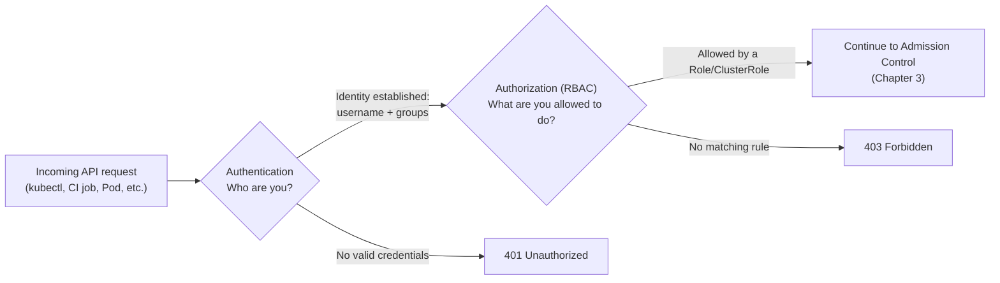
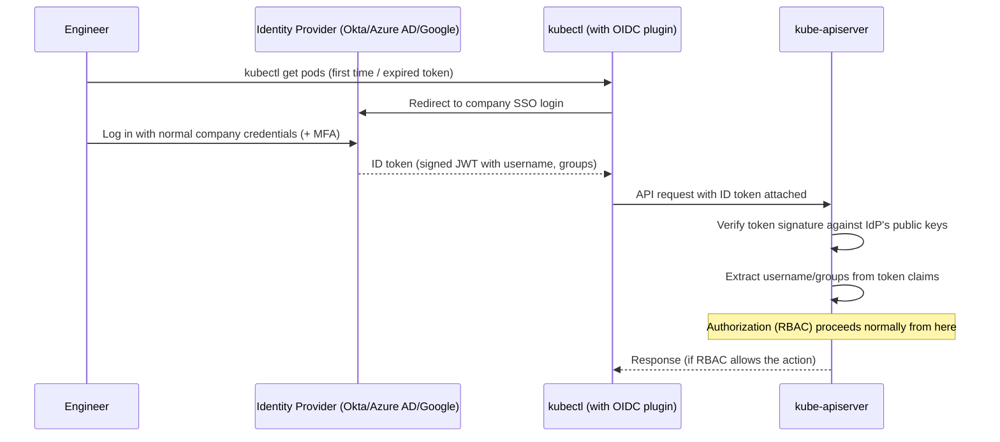

# Chapter 2 — RBAC and Authentication

## Learning Objectives

By the end of this chapter you will be able to:

- Explain the difference between authentication ("who are you?") and authorization ("what are you allowed to do?") in Kubernetes
- Describe the three main authentication mechanisms — client certificates, ServiceAccounts, and OIDC — and when each is used
- Explain why every Pod runs as a ServiceAccount, and what that identity is used for
- Write full YAML for `Role`, `ClusterRole`, `RoleBinding`, and `ClusterRoleBinding` objects
- Read and write RBAC `rules`, understanding `apiGroups`, `resources`, and `verbs`
- Apply the principle of least privilege to design a minimal-permission ServiceAccount for a CI/CD pipeline
- Use `kubectl auth can-i` to verify and debug permissions

---

## Prerequisites for This Chapter

- **Chapter 1 — Introduction to Advanced Kubernetes** — required. This chapter assumes you understand why access control matters on a shared cluster.
- **Kubernetes Basics, Chapter 3 (Installation and Setup)** — required, specifically the kubeconfig discussion (clusters, users, contexts) and the `client-certificate-data` field, which this chapter builds on directly.
- **Kubernetes Basics, Chapter 9 (Namespaces and Resource Management)** — required, since RBAC's namespace-scoped objects (`Role`, `RoleBinding`) only make sense with a solid grasp of what a Namespace is.
- A running local `kind` cluster from Topic 8, Chapter 3.

---

## 2.1 Two Separate Questions: Authentication vs. Authorization

Every single request that reaches the `kube-apiserver` — whether it comes from `kubectl`, a CI/CD pipeline, or a Pod calling the API from inside the cluster — passes through two distinct, sequential checks. Kubernetes deliberately keeps them as separate concerns, and confusing them is one of the most common sources of "why can't I do this?!" frustration for newcomers.

- **Authentication (AuthN) — "Who are you?"** The API server must first establish an identity for the caller. It does this by inspecting the request's credentials (a client certificate, a bearer token, and so on) and mapping them to a **username** and a set of **group** memberships. Kubernetes does not have a built-in user database — it never stores usernames and passwords itself. It only knows how to *verify* credentials issued by one of a few pluggable mechanisms (covered in section 2.2) and extract an identity from them.
- **Authorization (AuthZ) — "What are you allowed to do?"** Once the API server knows *who* is asking, it must decide whether *that identity* is allowed to perform *this specific action* on *this specific resource*. This is a completely separate check, evaluated after authentication succeeds. Kubernetes supports several authorization modes, but the standard, universally-used one — and the entire focus of section 2.4 onward — is **RBAC (Role-Based Access Control)**.



A useful analogy: authentication is showing your ID badge at the building's front door — it proves *who you are*. Authorization is whether your badge actually unlocks the server room door — a valid badge (successful authentication) does not automatically mean every door opens for you. You can be a perfectly authenticated, verified identity and still be authorized to do absolutely nothing.

---

## 2.2 Authentication Mechanisms

Kubernetes supports several ways to authenticate, and real clusters typically use more than one simultaneously, for different kinds of callers.

### Client Certificates (the `kubectl` default)

Recall from Topic 8, Chapter 3 that your kubeconfig's `users` section contains a `client-certificate-data` field (and a matching private key). This is an **X.509 client certificate**, and it is how `kubectl` typically authenticates you to a cluster.

The mechanism: the cluster's certificate authority (CA) signs a certificate for you, embedding your identity directly into it — conventionally, the certificate's **Common Name (CN)** becomes your Kubernetes **username**, and its **Organization (O)** fields become your **group** memberships. When `kubectl` connects, it presents this certificate as part of the TLS handshake; the API server verifies it was signed by a CA it trusts, and if so, trusts the CN/O fields as your identity — no separate password or token exchange is needed.

```bash
# Inspect the certificate embedded in your current kubeconfig user
kubectl config view --raw -o jsonpath='{.users[0].user.client-certificate-data}' | base64 -d | openssl x509 -noout -subject
# Example output:
# subject=CN = alice, O = platform-team
```

This is simple and works well for a small number of long-lived identities (cluster administrators, the cluster's own control plane components), but it has real drawbacks at organizational scale: Kubernetes has **no built-in way to revoke an individual client certificate** before it expires, and distributing a certificate + private key pair to every one of forty engineers — and rotating them — is exactly the kind of manual credential management that doesn't scale safely. This is precisely the gap OIDC (below) closes.

### ServiceAccounts — Identity for Pods, Not Humans

Client certificates and OIDC both authenticate *humans*. But the overwhelming majority of API requests in a running cluster don't come from humans at all — they come from **Pods**: a controller checking on its own resources, an application calling the Kubernetes API to discover other Services, a CI/CD job running as a Pod inside the cluster. Kubernetes needs an identity concept for these non-human callers, and that concept is the **ServiceAccount**.

Every single Pod runs as a ServiceAccount — always, whether you configured one or not. If a Pod's spec doesn't specify `serviceAccountName`, it is automatically assigned the namespace's `default` ServiceAccount. Kubernetes automatically mounts that ServiceAccount's credentials (a short-lived, auto-rotating JSON Web Token, projected into the Pod's filesystem) at `/var/run/secrets/kubernetes.io/serviceaccount/token`, so any process inside the container can present that token to authenticate to the API server as that ServiceAccount.

```yaml
# A dedicated ServiceAccount for an application that needs to call the K8s API
apiVersion: v1
kind: ServiceAccount
metadata:
  name: order-service
  namespace: shop
```

```yaml
# Reference it explicitly from a Pod's controller (Deployment shown, but the
# field is identical on any Pod-creating object)
apiVersion: apps/v1
kind: Deployment
metadata:
  name: order-service
  namespace: shop
spec:
  replicas: 3
  selector:
    matchLabels:
      app: order-service
  template:
    metadata:
      labels:
        app: order-service
    spec:
      serviceAccountName: order-service   # explicit — not the namespace's `default`
      containers:
        - name: order-service
          image: registry.example.com/order-service:v2.3.1
```

**Never leave production workloads on the `default` ServiceAccount.** Because it exists in every namespace automatically and is easy to forget about, it becomes an easy, overlooked target — if it accumulates permissions over time (for example, through an overly broad `ClusterRoleBinding` applied "temporarily" and never removed), *every* Pod in that namespace that doesn't explicitly specify its own ServiceAccount inherits those permissions silently. Always create a dedicated, purpose-named ServiceAccount per application and grant it only what that application needs (section 2.6).

### OIDC — Connecting Kubernetes to Your Real Identity Provider

For human users at any organization beyond a handful of engineers, distributing and rotating client certificates by hand does not scale, and it creates exactly the kind of unmanaged, un-auditable credential sprawl Chapter 1's "Cowboy Cluster Inc." scenario described. The standard production solution is **OIDC (OpenID Connect)** integration.

The idea: instead of Kubernetes trusting a certificate you generated once, the API server is configured to trust tokens issued by your organization's existing identity provider — **Okta, Google Workspace, Azure AD/Entra ID**, or an internal SSO system. The flow looks like this:



The practical benefit is enormous: engineers authenticate with the same company login (and the same MFA, the same offboarding process) they already use for email and every other internal system. When someone leaves the company, disabling their identity provider account instantly cuts off their Kubernetes access too — no separate certificate revocation process to remember. RBAC rules can also be written against **groups** from the identity provider (e.g., "everyone in the `payments-team` Okta group"), so access follows the org chart automatically instead of requiring per-person cluster configuration.

**A brief note on managed cloud clusters.** EKS, GKE, and AKS each layer their own IAM-based authentication in front of (or alongside) standard Kubernetes authentication — for example, EKS uses AWS IAM identities mapped to Kubernetes usernames via the `aws-auth` ConfigMap (or, more recently, EKS Access Entries), and GKE integrates with Google Cloud IAM. This course does not go deep into any single cloud provider's specific mechanism, since it varies by platform and changes over time — but the underlying pattern is the same one this section already taught you: an external identity system establishes *who* you are, and Kubernetes RBAC still decides *what you're allowed to do* once that identity is established.

---

## 2.3 RBAC: The Four Objects

Once an identity is established (a username, a group, or a ServiceAccount), **RBAC** decides what that identity can do. RBAC is built from exactly four object types, split along two dimensions: *scope* (namespace vs. cluster) and *purpose* (defining permissions vs. granting them to someone).

| | Defines a set of permissions | Grants permissions to an identity |
|---|---|---|
| **Namespace-scoped** | `Role` | `RoleBinding` |
| **Cluster-scoped** | `ClusterRole` | `ClusterRoleBinding` |

### Role — Namespace-Scoped Permissions

A `Role` defines a set of permissions that only apply within **one specific namespace**. It has no effect outside that namespace, and it cannot grant permission on cluster-scoped resources like Nodes or Namespaces themselves.

```yaml
apiVersion: rbac.authorization.k8s.io/v1
kind: Role
metadata:
  namespace: shop
  name: pod-reader
rules:
  - apiGroups: [""]              # "" means the core API group (Pods, Services, ConfigMaps, etc.)
    resources: ["pods"]
    verbs: ["get", "list", "watch"]
```

### ClusterRole — Cluster-Scoped Permissions (or a Reusable Template)

A `ClusterRole` looks identical in structure to a `Role`, but it serves two distinct purposes:

1. Granting permission on genuinely **cluster-scoped resources** — Nodes, PersistentVolumes, Namespaces themselves, ClusterRoles, CustomResourceDefinitions — none of which belong to any single namespace, so a namespace-scoped `Role` cannot reference them meaningfully.
2. Acting as a **reusable permission template** that can be bound within *any* namespace via a `RoleBinding` (see below) — useful when many teams need the identical set of namespaced permissions (e.g., "can fully manage Deployments and Services") without copy-pasting the same `Role` YAML into every namespace.

```yaml
apiVersion: rbac.authorization.k8s.io/v1
kind: ClusterRole
metadata:
  name: node-viewer
rules:
  - apiGroups: [""]
    resources: ["nodes"]
    verbs: ["get", "list", "watch"]   # Nodes are cluster-scoped — only a ClusterRole can grant this
```

```yaml
# A reusable namespaced-permission template, meant to be bound per-namespace
apiVersion: rbac.authorization.k8s.io/v1
kind: ClusterRole
metadata:
  name: namespace-developer
rules:
  - apiGroups: ["apps"]
    resources: ["deployments", "replicasets"]
    verbs: ["get", "list", "watch", "create", "update", "patch", "delete"]
  - apiGroups: [""]
    resources: ["services", "configmaps", "pods", "pods/log"]
    verbs: ["get", "list", "watch", "create", "update", "patch", "delete"]
```

### RoleBinding — Granting a Role (or ClusterRole) Within One Namespace

A `RoleBinding` connects a `Role` (or a `ClusterRole`, used as a template) to one or more identities — and its effect is **always scoped to the namespace the RoleBinding itself lives in**, even when it references a cluster-wide `ClusterRole`.

```yaml
apiVersion: rbac.authorization.k8s.io/v1
kind: RoleBinding
metadata:
  name: alice-pod-reader
  namespace: shop
subjects:
  - kind: User
    name: alice              # matches the CN from her client cert, or her OIDC username
    apiGroup: rbac.authorization.k8s.io
roleRef:
  kind: Role
  name: pod-reader
  apiGroup: rbac.authorization.k8s.io
```

```yaml
# Binding the *reusable ClusterRole template* from above, but only within "shop" —
# the payments team gets the identical permission set only within their own namespace
apiVersion: rbac.authorization.k8s.io/v1
kind: RoleBinding
metadata:
  name: shop-team-developers
  namespace: shop
subjects:
  - kind: Group
    name: shop-team           # a group claim from OIDC, e.g. from Okta/Azure AD
    apiGroup: rbac.authorization.k8s.io
roleRef:
  kind: ClusterRole
  name: namespace-developer   # the reusable template — bound here only to "shop"
  apiGroup: rbac.authorization.k8s.io
```

### ClusterRoleBinding — Granting Cluster-Wide

A `ClusterRoleBinding` grants a `ClusterRole`'s permissions **across every namespace in the cluster**, plus any cluster-scoped resources it references. This is the most powerful — and most dangerous — RBAC object, and should be used sparingly.

```yaml
apiVersion: rbac.authorization.k8s.io/v1
kind: ClusterRoleBinding
metadata:
  name: platform-team-cluster-admin
subjects:
  - kind: Group
    name: platform-team
    apiGroup: rbac.authorization.k8s.io
roleRef:
  kind: ClusterRole
  name: cluster-admin          # a powerful built-in ClusterRole, ships with every cluster
  apiGroup: rbac.authorization.k8s.io
```

### Decision Table: "I Want to Grant X in Y Scope"

| I want to grant... | ...within one namespace | ...across the whole cluster |
|---|---|---|
| A brand-new, narrow permission set | `Role` + `RoleBinding` | `ClusterRole` + `ClusterRoleBinding` |
| A reusable permission template, applied per-namespace | `ClusterRole` (as template) + `RoleBinding` per namespace | `ClusterRole` + `ClusterRoleBinding` |
| Permission on a cluster-scoped resource (Nodes, PVs, CRDs, ClusterRoles) | Not possible — must be cluster-scoped | `ClusterRole` + `ClusterRoleBinding` |

---

## 2.4 Anatomy of a Role's Rules

Every `rules` entry in a `Role` or `ClusterRole` has exactly three parts, and understanding each precisely removes most of the guesswork from writing RBAC.

```yaml
rules:
  - apiGroups: ["apps"]
    resources: ["deployments"]
    verbs: ["get", "list", "watch", "update", "patch"]
```

- **`apiGroups`** — which API group the resource belongs to. The core group (Pods, Services, ConfigMaps, Secrets, Namespaces) is written as an empty string `""`. Other resources live in named groups: `apps` (Deployments, ReplicaSets, StatefulSets, DaemonSets), `batch` (Jobs, CronJobs), `networking.k8s.io` (NetworkPolicies, Ingress), `rbac.authorization.k8s.io` (Roles, RoleBindings themselves), and so on. Run `kubectl api-resources` to see the group every resource belongs to.
- **`resources`** — the plural, lowercase resource name(s), e.g. `pods`, `deployments`, `secrets`. Subresources are addressed with a slash, e.g. `pods/log` (reading container logs) or `pods/exec` (the permission needed for `kubectl exec` — notably separate from being able to merely view a Pod).
- **`verbs`** — the specific actions allowed on that resource. These map directly onto HTTP methods and `kubectl` operations:

| Verb | What It Allows | Typical `kubectl` Equivalent |
|------|-----------------|-------------------------------|
| `get` | Read one specific named object | `kubectl get pod my-pod` |
| `list` | Read a collection of objects | `kubectl get pods` |
| `watch` | Subscribe to change events on an object/collection | Used internally by `kubectl get -w` and by controllers |
| `create` | Create a new object | `kubectl apply -f new.yaml` (first time), `kubectl create` |
| `update` | Replace an existing object's full spec | `kubectl apply -f` (subsequent times), `kubectl replace` |
| `patch` | Modify part of an existing object | `kubectl edit`, `kubectl patch`, `kubectl scale` |
| `delete` | Remove an object | `kubectl delete pod my-pod` |
| `deletecollection` | Remove a whole collection matching a selector | `kubectl delete pods -l app=foo` |

Note that `list`/`watch` and `get` are commonly granted together but are technically distinct — a Role granting only `get` lets you fetch a Pod you already know the name of, but `kubectl get pods` (listing everything) will fail without `list` too. This granularity is exactly what makes least-privilege design possible, and it's the subject of the next section.

---

## 2.5 Least Privilege in Practice: A CI/CD ServiceAccount

The principle of **least privilege** means granting the absolute minimum set of permissions needed to do a job, and nothing more. Here is a concrete, complete worked example: a CI/CD pipeline that needs to deploy application updates to the `prod` namespace, and should be able to do exactly that — update Deployments and Services — and nothing else. It should not be able to read Secrets, delete Namespaces, list Nodes, or touch any other namespace.

```yaml
# 1. The identity the CI/CD pipeline will authenticate as
apiVersion: v1
kind: ServiceAccount
metadata:
  name: ci-deployer
  namespace: ci
---
# 2. The exact, narrow set of permissions this job needs — nothing more
apiVersion: rbac.authorization.k8s.io/v1
kind: Role
metadata:
  name: deployer
  namespace: prod
rules:
  - apiGroups: ["apps"]
    resources: ["deployments"]
    verbs: ["get", "list", "create", "update", "patch"]
  - apiGroups: [""]
    resources: ["services"]
    verbs: ["get", "list", "create", "update", "patch"]
---
# 3. Grant the Role to the ServiceAccount, scoped only to "prod"
apiVersion: rbac.authorization.k8s.io/v1
kind: RoleBinding
metadata:
  name: ci-deployer-binding
  namespace: prod
subjects:
  - kind: ServiceAccount
    name: ci-deployer
    namespace: ci             # note: the ServiceAccount lives in a different namespace than the binding
roleRef:
  kind: Role
  name: deployer
  apiGroup: rbac.authorization.k8s.io
```

Notice deliberately what is *absent*: no `delete` verb (a compromised or buggy pipeline cannot tear anything down), no access to `secrets` (it cannot exfiltrate credentials), no access to any namespace other than `prod`, and no `ClusterRole`/`ClusterRoleBinding` anywhere (it has zero visibility into cluster-scoped resources). If this pipeline's credentials were ever leaked, the blast radius is exactly "can create/update Deployments and Services in `prod`" — nothing else.

---

## 2.6 `kubectl auth can-i` — Verifying and Debugging Permissions

Rather than guessing whether an RBAC setup is correct by trial and error, use `kubectl auth can-i` — it asks the API server's real authorization logic the question directly, without actually performing the action.

```bash
# Am I (my current kubeconfig identity) allowed to delete pods in the default namespace?
kubectl auth can-i delete pods

# Check permissions for a specific ServiceAccount, not yourself
kubectl auth can-i delete pods \
  --as=system:serviceaccount:ci:deployer \
  -n prod
# no

kubectl auth can-i update deployments \
  --as=system:serviceaccount:ci:deployer \
  -n prod
# yes

# List everything you personally can do in a namespace (useful for a quick audit)
kubectl auth can-i --list -n prod

# Check as an arbitrary user, useful when testing an OIDC group's effective permissions
kubectl auth can-i create pods \
  --as=alice \
  --as-group=shop-team \
  -n shop
```

Note the ServiceAccount naming convention used with `--as`: `system:serviceaccount:<namespace>:<name>`. This is the exact username format Kubernetes assigns internally to every ServiceAccount, and it's the value RBAC subjects and audit logs will show you.

`kubectl auth can-i` requires no special permission beyond authenticating — it's specifically designed as a safe, side-effect-free debugging tool, and should be your first move whenever something fails with `Error from server (Forbidden)`.

---

## 2.7 Real-World Scenario: Per-Team Namespace Ownership

A platform team supports four product teams — `checkout`, `search`, `notifications`, and `analytics` — sharing one cluster. The requirement: each team can **fully** manage every resource inside their own namespace (create, update, delete Deployments, Services, ConfigMaps, Jobs — whatever they need), but has **zero** access to any other team's namespace, and **zero** access to cluster-scoped resources (Nodes, CRDs, ClusterRoles, other namespaces' existence). This is one of the most common RBAC patterns in real organizations, and it composes cleanly from what this chapter already covered.

```yaml
# One reusable ClusterRole template — defined once, bound many times
apiVersion: rbac.authorization.k8s.io/v1
kind: ClusterRole
metadata:
  name: team-namespace-admin
rules:
  - apiGroups: ["", "apps", "batch", "networking.k8s.io"]
    resources: ["*"]              # everything in these groups — full control within a namespace
    verbs: ["*"]
  # Deliberately NOT included: any cluster-scoped resource (nodes, namespaces,
  # clusterroles, customresourcedefinitions, persistentvolumes) — a namespaced
  # RoleBinding referencing this ClusterRole cannot grant access to them anyway,
  # since RoleBinding effect never escapes its own namespace.
---
# One RoleBinding per team, each scoped to that team's own namespace only
apiVersion: rbac.authorization.k8s.io/v1
kind: RoleBinding
metadata:
  name: checkout-team-admin
  namespace: checkout
subjects:
  - kind: Group
    name: checkout-team           # an OIDC group claim — membership managed in the identity provider
    apiGroup: rbac.authorization.k8s.io
roleRef:
  kind: ClusterRole
  name: team-namespace-admin
  apiGroup: rbac.authorization.k8s.io
---
apiVersion: rbac.authorization.k8s.io/v1
kind: RoleBinding
metadata:
  name: search-team-admin
  namespace: search
subjects:
  - kind: Group
    name: search-team
    apiGroup: rbac.authorization.k8s.io
roleRef:
  kind: ClusterRole
  name: team-namespace-admin
  apiGroup: rbac.authorization.k8s.io
```

The pattern repeats identically for `notifications` and `analytics`. A single `ClusterRole` is authored once by the platform team and reviewed carefully; onboarding a new team is then a one-YAML-object change (a new `RoleBinding`), and — critically — because each `RoleBinding` lives in, and only affects, its own namespace, the `search-team` group can never accidentally (or maliciously) touch anything in `checkout`. Verification is a single command per team:

```bash
kubectl auth can-i delete deployments --as-group=checkout-team -n checkout    # yes
kubectl auth can-i delete deployments --as-group=checkout-team -n search     # no
kubectl auth can-i get nodes           --as-group=checkout-team              # no
```

---

## Best Practices

- Always use `kubectl auth can-i` to verify RBAC changes rather than assuming YAML correctness — RBAC bugs are silent until someone hits a wall.
- Prefer binding a shared `ClusterRole` template per-namespace via `RoleBinding` over duplicating near-identical `Role` YAML across every namespace.
- Give every workload its own dedicated ServiceAccount; never let production Pods run on a namespace's `default` ServiceAccount.
- Reserve `ClusterRoleBinding` for genuinely cluster-wide needs (platform team, monitoring agents that must read all namespaces) — default to namespace-scoped `RoleBinding` otherwise.
- Prefer OIDC group-based bindings over binding individual `User` subjects one at a time — access should follow identity-provider group membership, not per-person cluster edits.
- Periodically audit bindings to the powerful built-in `cluster-admin` ClusterRole — it should be an exceptionally short, deliberate list.

## Common Mistakes

- Granting `resources: ["*"]` / `verbs: ["*"]` "just to get something working," then never tightening it — this is how `default` ServiceAccounts and forgotten pipelines end up with far more power than intended.
- Forgetting that a `RoleBinding`'s effect is always limited to its own namespace, even when it references a `ClusterRole` — leading to confusion about why a "cluster-wide" permission doesn't apply elsewhere.
- Confusing `get`/`list`/`watch` — granting only `get` and being surprised that `kubectl get pods` (a `list` operation) still fails.
- Leaving workloads on the `default` ServiceAccount instead of creating a purpose-specific one, so unrelated permission grants leak into every un-labeled Pod in the namespace.
- Managing RBAC for humans with individually-issued client certificates at organizational scale instead of moving to OIDC — this creates unrevocable, unaudited credentials that outlive employment.

---

## Summary

Kubernetes splits access control into two sequential, independent checks: **authentication** (who are you — via client certificates, ServiceAccounts, or OIDC) and **authorization** (what can you do — via RBAC). Client certificates are how `kubectl` typically authenticates individual long-lived identities but don't scale or revoke cleanly for large teams; ServiceAccounts are the mandatory identity every Pod runs as, whether configured explicitly or defaulted; OIDC connects Kubernetes auth to a real identity provider (Okta, Azure AD, Google) so engineers use their normal company login, with instant revocation on offboarding and group-based policy. Authorization is implemented with four RBAC objects: `Role` and `ClusterRole` define permission sets (namespace-scoped and cluster-scoped/reusable respectively), while `RoleBinding` and `ClusterRoleBinding` grant those permission sets to identities (namespace-scoped and cluster-wide respectively) — and critically, a `RoleBinding`'s effect never escapes its own namespace even when it references a `ClusterRole`. Rules are built from `apiGroups`, `resources`, and precise `verbs` (`get`, `list`, `watch`, `create`, `update`, `patch`, `delete`), which is what makes least-privilege design possible down to individual actions. `kubectl auth can-i` is the standard tool for verifying and debugging exactly what an identity can and cannot do.

---

## Knowledge Check

1. Explain, precisely, the difference between authentication and authorization in Kubernetes, and give one example mechanism for each.
2. Why does every Pod need a ServiceAccount, even if you never explicitly configure one?
3. What is the practical scaling/security problem with authenticating every human user via individually-issued client certificates, and how does OIDC solve it?
4. A `RoleBinding` in the `search` namespace references a `ClusterRole` named `admin-template`. Does this grant any permissions in the `checkout` namespace? Why or why not?
5. Write the `rules` entry that would allow reading (but never modifying) Secrets in a namespace — which specific verbs would you include, and which would you deliberately leave out?
6. What command would you run to check whether the ServiceAccount `system:serviceaccount:ci:deployer` can delete Deployments in the `prod` namespace, without actually attempting the deletion?

---

## Hands-On Exercise

Using your local `kind` cluster:

1. Create two namespaces: `team-a` and `team-b`.
2. Create a `ServiceAccount` named `team-a-bot` in `team-a`.
3. Write a `Role` in `team-a` that allows `get`, `list`, `create`, `update`, `patch`, and `delete` on `pods` and `deployments` only — no other resources.
4. Write a `RoleBinding` in `team-a` binding that Role to the `team-a-bot` ServiceAccount.
5. Verify with `kubectl auth can-i create deployments --as=system:serviceaccount:team-a:team-a-bot -n team-a` (expect `yes`).
6. Verify with `kubectl auth can-i create deployments --as=system:serviceaccount:team-a:team-a-bot -n team-b` (expect `no`) — confirming the binding does not leak across namespaces.
7. Verify with `kubectl auth can-i get secrets --as=system:serviceaccount:team-a:team-a-bot -n team-a` (expect `no`) — confirming the Role's scope is exactly what you wrote, and nothing broader.
8. Bonus: Create a `ClusterRole` named `pod-reader-all` allowing `get`/`list`/`watch` on `pods` across all namespaces, then a `ClusterRoleBinding` granting it to a new ServiceAccount. Confirm with `kubectl auth can-i list pods -n team-b --as=system:serviceaccount:<ns>:<name>` that it now works cluster-wide.

---

## Further Reading

- kubernetes.io/docs/reference/access-authn-authz/authentication/ — official authentication concepts and supported methods
- kubernetes.io/docs/reference/access-authn-authz/rbac/ — official RBAC documentation, including all built-in ClusterRoles
- kubernetes.io/docs/reference/access-authn-authz/authentication/#openid-connect-tokens — OIDC token authentication reference
- kubernetes.io/docs/tasks/configure-pod-container/configure-service-account/ — configuring ServiceAccounts for Pods
- kubernetes.io/docs/reference/kubectl/generated/kubectl_auth/ — `kubectl auth` command reference, including `can-i`

---

<div style="display:flex;justify-content:space-between;align-items:center;">
  <a href="./01-introduction.md">← Previous: Introduction to Advanced Kubernetes</a>
  <a href="./00-index.md">🏠 Index</a>
  <a href="./03-admission-control-and-pod-security.md">Next: Admission Control and Pod Security →</a>
</div>
