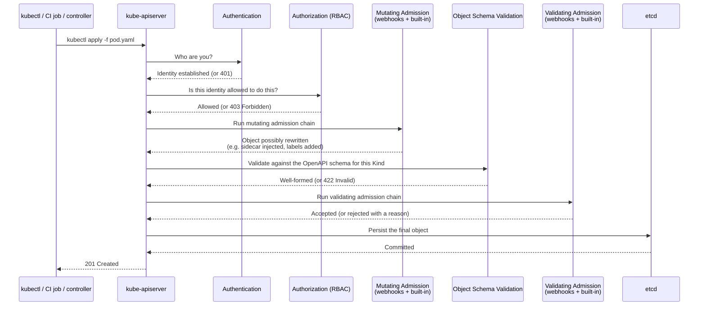
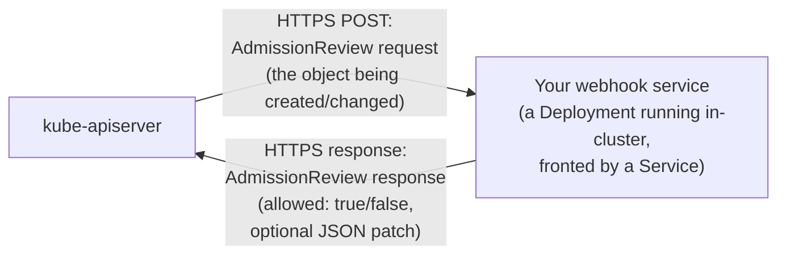

# Chapter 3 — Admission Control and Pod Security

## Learning Objectives

By the end of this chapter you will be able to:

- Place admission control correctly in the API request lifecycle, relative to authentication and RBAC authorization
- Explain the difference between mutating and validating admission, and why the order between them matters
- Describe what an admission webhook is and design a real use case for each type
- Explain the three Pod Security Standards levels (Privileged, Baseline, Restricted) and what each restricts
- Configure Pod Security Admission via namespace labels, and explain why it replaced the deprecated PodSecurityPolicy
- Compare Pod Security Admission, OPA/Gatekeeper, and Kyverno, and write an equivalent policy in each of the two policy engines
- Explain why a security team rolls out new policy in "audit" mode before switching to "enforce"

---

## Prerequisites for This Chapter

- **Chapter 2 — RBAC and Authentication** — required. This chapter picks up exactly where Chapter 2 left off in the request lifecycle: RBAC answers "can this identity act at all?"; admission control answers "is the content of this specific request acceptable?"
- **Kubernetes Basics, Chapter 9 (Namespaces and Resource Management)** — required; Pod Security Admission is configured entirely through namespace labels.
- **Kubernetes Basics, Chapter 7 (ConfigMaps and Secrets)** — helpful background for the sidecar-injection webhook example in section 3.3.
- A running local `kind` cluster from Topic 8, Chapter 3.

---

## 3.1 Where Admission Control Sits in the Request Lifecycle

Chapter 2 covered the first two checks every API request passes through: **authentication** (who are you?) and **authorization** via RBAC (are you allowed to perform this action at all?). There is a third, final stage — and it only applies to requests that **create, modify, or delete** an object (a plain `get` or `list` never reaches it): **admission control**.

Where RBAC asks a yes/no question about the *identity and the verb* ("can `alice` `create` `pods` in `shop`?"), admission control inspects the **content** of the request itself, and can do one of two things to it: **validate** it (accept or reject it based on its content) or **mutate** it (silently rewrite parts of it before it's persisted). This is a categorically different kind of check — RBAC would happily let a well-authorized engineer create a Pod that runs as root with no resource limits and mounts the host's filesystem; admission control is the layer that can catch and stop exactly that, automatically, every time, without relying on a human reviewer remembering to look for it.



Two details in that diagram matter enormously: **mutating admission always runs before validating admission**, and schema validation happens in between. This ordering is deliberate — it means validating webhooks see the *final*, fully-mutated object (including anything a mutating webhook added, like an injected sidecar or a default label), so validation logic never has to guess whether a field will be filled in later by some other mechanism.

---

## 3.2 Built-In Admission Controllers (Briefly)

Kubernetes ships with a number of built-in admission controllers compiled directly into the API server, enabled by cluster administrators via a flag. You won't typically write these yourself, but you should recognize the most common ones, since they explain behavior you may already have encountered in Topic 8 without knowing why:

| Built-in Admission Controller | What It Does |
|---|---|
| `NamespaceLifecycle` | Prevents creating objects in a Namespace that is being deleted, and prevents deleting the built-in `default`/`kube-system`/`kube-public` namespaces |
| `LimitRanger` | Enforces a namespace's `LimitRange` object — e.g. applying default resource requests/limits to Pods that don't specify them (Topic 8, Chapter 9) |
| `ResourceQuota` | Enforces a namespace's `ResourceQuota` object — rejects object creation that would exceed the namespace's total allotted CPU/memory/object counts |
| `ServiceAccount` | Automatically assigns the `default` ServiceAccount to Pods that don't specify one, and mounts its token (Chapter 2) |
| `DefaultStorageClass` | Automatically assigns the cluster's default `StorageClass` to a PVC that doesn't specify one |
| `PodSecurity` | Enforces Pod Security Standards based on namespace labels (section 3.4) — the built-in replacement for the deprecated PodSecurityPolicy |

These are fixed, compiled-in behaviors — useful, but not extensible. The real power for *your own* organization-specific rules comes from the two extensible admission controller types covered next.

---

## 3.3 The Extensible Controllers: Admission Webhooks

**MutatingAdmissionWebhook** and **ValidatingAdmissionWebhook** are themselves built-in admission controllers, but their job is simply to call out to **your own external HTTP service** — an "admission webhook" — and let it decide what happens to the request. This is how Kubernetes lets organizations, and third-party tools, plug arbitrary custom logic directly into the object-creation pipeline without modifying the API server itself.



The webhook is nothing exotic — it's just a small HTTP server, usually running as an ordinary Deployment inside the cluster, registered with the API server via a `MutatingWebhookConfiguration` or `ValidatingWebhookConfiguration` object that tells the API server which kinds of requests to forward to it (e.g., "call me for every `Pod` creation in any namespace labeled `env=prod`").

**Mutating webhook — real use case: auto-injecting a sidecar.** Service meshes (Chapter 7) commonly work by injecting a proxy sidecar container into every Pod automatically, so application teams never have to remember to add it themselves. A mutating webhook intercepts every Pod creation, and if the Pod's namespace is labeled for mesh injection, returns a JSON patch adding the sidecar container and its required volumes to the Pod spec — the application team's original YAML never mentions the sidecar at all.

```yaml
# Simplified illustration of what a mutating webhook's JSON patch response
# effectively adds to an incoming Pod spec (the webhook computes this dynamically)
spec:
  containers:
    - name: app                 # the container the user actually submitted
      image: myapp:v1.2
    - name: istio-proxy          # injected by the mutating webhook — user never wrote this
      image: istio/proxyv2:1.20
```

**Validating webhook — real use case: rejecting Deployments without resource limits.** Recall from Topic 8, Chapter 9 that unset resource limits let one misbehaving Pod starve every other workload on its Node. A validating webhook can inspect every incoming Deployment/Pod and simply refuse it — returning `allowed: false` with a human-readable reason — if any container omits `resources.limits`.

```yaml
# What the API server sends the webhook, in essence (simplified AdmissionReview)
request:
  kind: {group: apps, version: v1, kind: Deployment}
  object:
    spec:
      template:
        spec:
          containers:
            - name: web
              image: myapp:v1.2
              # no `resources` block at all

# What a validating webhook would respond, rejecting it:
response:
  allowed: false
  status:
    message: "Container 'web' has no resource limits set. All containers must set resources.limits.cpu and resources.limits.memory."
```

In practice, very few organizations hand-write raw admission webhooks for common policy needs like this — the policy engines in section 3.5 (Gatekeeper, Kyverno) are themselves implemented *as* validating and mutating webhooks, giving you a much friendlier, higher-level way to express the same idea without writing and operating a custom webhook service yourself.

---

## 3.4 Pod Security Standards and Pod Security Admission

Even a validating webhook only enforces whatever policy someone at your organization thought to write. Kubernetes also defines a standardized, built-in baseline: the **Pod Security Standards (PSS)** — three named levels of increasingly strict Pod-level security posture, intended to be consistent across every Kubernetes cluster in the world, not just something your organization invented internally.

| Level | Intent | Examples of What's Restricted |
|---|---|---|
| **Privileged** | Unrestricted — an explicit opt-out of Pod security enforcement | Nothing is restricted; allows privileged containers, host namespaces, anything |
| **Baseline** | Prevent known privilege escalations, while staying broadly compatible with common workloads | No privileged containers; no sharing the host's network/PID/IPC namespaces (`hostNetwork`, `hostPID`, `hostIPC`); no mounting arbitrary host paths without restriction; restricts dangerous Linux capabilities |
| **Restricted** | Heavily hardened — current Pod security best practice | Everything Baseline restricts, **plus**: containers must run as a non-root user (`runAsNonRoot: true`), must not allow privilege escalation (`allowPrivilegeEscalation: false`), must drop all Linux capabilities except `NET_BIND_SERVICE` if needed, and must use the `RuntimeDefault` (or a custom) seccomp profile |

The enforcement mechanism built into Kubernetes for these standards is **Pod Security Admission (PSA)** — itself a built-in admission controller (no separate installation needed on any supported cluster version) configured entirely through **labels on a Namespace**, with no custom objects to create at all.

```bash
# Enforce the Restricted standard for every Pod created in the "checkout" namespace —
# any Pod that violates Restricted is rejected outright at creation time
kubectl label namespace checkout \
  pod-security.kubernetes.io/enforce=restricted

# You can also independently set "audit" and "warn" modes to different levels —
# useful for previewing impact before actually enforcing (see section 3.6)
kubectl label namespace checkout \
  pod-security.kubernetes.io/warn=restricted \
  pod-security.kubernetes.io/audit=restricted
```

```yaml
# The equivalent expressed declaratively as part of the Namespace object itself
apiVersion: v1
kind: Namespace
metadata:
  name: checkout
  labels:
    pod-security.kubernetes.io/enforce: restricted
    pod-security.kubernetes.io/enforce-version: latest
```

**A brief, important historical note.** If you search for Kubernetes Pod security material online, you will frequently encounter references to **PodSecurityPolicy (PSP)** — an older, separate mechanism that worked completely differently (a cluster-scoped `PodSecurityPolicy` object combined with RBAC bindings to determine which policy applied to which Pod). PSP was deprecated in Kubernetes 1.21 and **fully removed in Kubernetes 1.25**. Pod Security Admission (the namespace-label mechanism above) is its official, simpler, built-in replacement. If you see PSP referenced in older blog posts, tutorials, or Stack Overflow answers, treat it as historical context, not something to implement on any current cluster.

---

## 3.5 Beyond the Built-In: OPA/Gatekeeper and Kyverno

Pod Security Admission covers Pod-level security specifically, using exactly three fixed levels. Real organizations frequently need policy that goes beyond Pod security entirely — "every Ingress must use TLS," "images must come from our internal registry," "every namespace must have a `cost-center` label," "Deployments in `prod` must have at least 2 replicas." For open-ended custom policy like this, two CNCF policy engines dominate the ecosystem.

### OPA/Gatekeeper

**Open Policy Agent (OPA)** is a general-purpose policy engine, and **Gatekeeper** is the project that integrates it with Kubernetes as a validating (and mutating) admission webhook. Policies are written in **Rego**, OPA's own declarative query language, and are split into two objects: a `ConstraintTemplate` (defines the reusable policy logic, in Rego) and a `Constraint` (an instance of that template, configured with specific parameters and applied to specific resources).

```yaml
# ConstraintTemplate — defines the reusable Rego logic once
apiVersion: templates.gatekeeper.sh/v1
kind: ConstraintTemplate
metadata:
  name: requirelimits
spec:
  crd:
    spec:
      names:
        kind: RequireLimits
  targets:
    - target: admission.k8s.gatekeeper.sh
      rego: |
        package requirelimits

        violation[{"msg": msg}] {
          container := input.review.object.spec.containers[_]
          not container.resources.limits
          msg := sprintf("Container '%v' has no resource limits set", [container.name])
        }
---
# Constraint — an instance of the template, applied to Pods
apiVersion: constraints.gatekeeper.sh/v1beta1
kind: RequireLimits
metadata:
  name: pods-must-have-limits
spec:
  match:
    kinds:
      - apiGroups: [""]
        kinds: ["Pod"]
```

### Kyverno

**Kyverno** solves the same problem but is written entirely in plain, Kubernetes-style YAML — no separate query language to learn. This is Kyverno's headline advantage and the main reason many teams find it more approachable to adopt and review in a pull request.

```yaml
apiVersion: kyverno.io/v1
kind: ClusterPolicy
metadata:
  name: require-resource-limits
spec:
  validationFailureAction: Enforce
  rules:
    - name: check-resource-limits
      match:
        any:
          - resources:
              kinds: ["Pod"]
      validate:
        message: "All containers must set resource limits."
        pattern:
          spec:
            containers:
              - resources:
                  limits:
                    memory: "?*"
                    cpu: "?*"
```

Both examples above enforce the *exact same rule* — every container must declare resource limits — but the authoring experience is deliberately different: Gatekeeper requires learning Rego's logic-programming style (powerful, but a genuine learning curve, especially for teams without a policy/security background), while Kyverno's YAML pattern-matching style reads almost like the resource it's validating, and can be written and reviewed by anyone already comfortable with Kubernetes manifests.

### Comparison Table

| | Pod Security Admission (PSA) | OPA/Gatekeeper | Kyverno |
|---|---|---|---|
| **Scope** | Pod security only (3 fixed levels) | Anything expressible in Rego — any resource, any field | Anything expressible in its YAML rule language — any resource, any field |
| **Policy language** | None — fixed built-in levels, configured via labels | Rego (general-purpose policy language) | Plain Kubernetes-style YAML |
| **Learning curve** | Very low — just apply namespace labels | Steep — Rego is a new language with its own semantics | Low-moderate — YAML patterns feel native to Kubernetes users |
| **Mutation support** | No — validation only | Yes (separate mutation policies) | Yes, and generally considered simpler to author than Gatekeeper's |
| **Built into Kubernetes** | Yes — no installation required | No — install via Helm/manifests | No — install via Helm/manifests |
| **Best fit** | Baseline Pod hardening everywhere, zero extra tooling | Teams wanting one policy engine for extremely broad/complex org-wide rules, often already OPA users elsewhere | Teams wanting custom cluster policy without adopting a new language |

In practice, many organizations layer these: PSA enforcing `restricted` everywhere as a non-negotiable floor, plus Kyverno or Gatekeeper for everything else (image provenance, labeling standards, naming conventions) that PSA was never designed to cover.

---

## 3.6 Real-World Scenario: Rolling Out Policy Without Breaking Production

A security team at a mid-size company decides every container across the cluster must (a) run as a non-root user and (b) never use the `:latest` image tag (since `:latest` makes deployments non-reproducible and complicates incident response — "which version was actually running?"). They choose **Kyverno** for its approachable YAML syntax, since the policy will need review and sign-off from teams outside the security group itself.

```yaml
apiVersion: kyverno.io/v1
kind: ClusterPolicy
metadata:
  name: disallow-latest-tag-and-root
spec:
  validationFailureAction: Audit   # <-- the critical first-rollout setting
  rules:
    - name: no-latest-tag
      match:
        any:
          - resources:
              kinds: ["Pod"]
      validate:
        message: "Images must not use the ':latest' tag — pin an explicit version."
        pattern:
          spec:
            containers:
              - image: "!*:latest"
    - name: require-non-root
      match:
        any:
          - resources:
              kinds: ["Pod"]
      validate:
        message: "Containers must set runAsNonRoot: true."
        pattern:
          spec:
            securityContext:
              runAsNonRoot: true
```

Notice `validationFailureAction: Audit` rather than `Enforce`. This is deliberate, and it's the whole point of this scenario: if the security team had gone straight to `Enforce`, every existing Deployment across the cluster still using `:latest` or running as root — quite possibly dozens of them, built up over years before this policy existed — would suddenly fail to deploy the moment anyone tried to roll out even an unrelated change, at a time and in a way the security team doesn't control or even know about in advance. That's an outage caused by the security policy itself, not by anything the policy was actually meant to catch.

With `Audit` mode, Kyverno evaluates every matching resource and **records violations without blocking anything** — visible via `kubectl get policyreport` or a connected dashboard. The security team spends a week or two reviewing exactly which existing workloads would be blocked, reaches out to those specific teams to fix their manifests on their own schedule, and only then flips the policy:

```bash
kubectl patch clusterpolicy disallow-latest-tag-and-root \
  --type merge -p '{"spec":{"validationFailureAction":"Enforce"}}'
```

This **audit-then-enforce** rollout pattern is standard practice for any cluster-wide policy change on a cluster with existing workloads, precisely because it separates "decide what the rule should be" from "turn on the rule" — giving every affected team a warning and a grace period instead of an unannounced outage.

---

## Best Practices

- Always roll out new cluster-wide policy in audit/warn mode first, and only switch to enforce after reviewing real violation data against existing workloads.
- Set Pod Security Admission's `enforce` label to at least `baseline` on every namespace by default, reserving `privileged` for the rare, explicitly-justified workloads (e.g., certain CNI or monitoring DaemonSets) that genuinely need it.
- Prefer Kyverno for organizations without existing Rego/OPA expertise; prefer Gatekeeper if you already use OPA elsewhere (e.g., API gateways, CI policy) and want one policy language across systems.
- Keep admission webhooks fast and highly available — a slow or down webhook can block all matching object creation cluster-wide; always configure `failurePolicy` deliberately (`Fail` vs `Ignore`) rather than leaving the default unexamined.
- Layer defenses: RBAC (who can act), admission control/policy engines (is the request's content acceptable), and Pod Security Standards (a hardened floor for every Pod) are complementary, not redundant.

## Common Mistakes

- Enabling a new validating policy in `Enforce`/blocking mode on day one, breaking unrelated deployments across the cluster with no warning.
- Confusing RBAC with admission control — RBAC being satisfied does not mean the request's content is safe; they are sequential, independent checks.
- Referencing PodSecurityPolicy (PSP) examples found online and attempting to apply them to a Kubernetes 1.25+ cluster, where PSP no longer exists at all.
- Setting a namespace's Pod Security Admission level to `restricted` without first checking whether existing workloads (e.g., ones needing `hostNetwork` for legitimate reasons) will suddenly be rejected.
- Running an admission webhook as a single replica with no redundancy — if it becomes unreachable and `failurePolicy: Fail` is set, it can block all matching object creation cluster-wide.

---

## Summary

Admission control is the third and final stage of the API request lifecycle, running after authentication and RBAC authorization, and it only applies to requests that create or modify objects. It splits into a mutating phase (which can rewrite a request, e.g. injecting a sidecar) that always runs before a validating phase (which can only accept or reject), with schema validation in between. Built-in admission controllers (`ResourceQuota`, `LimitRanger`, `NamespaceLifecycle`, and others) handle fixed, common behaviors; **MutatingAdmissionWebhook** and **ValidatingAdmissionWebhook** let you plug in arbitrary external HTTP services for custom logic. Pod Security Standards define three levels — Privileged, Baseline, Restricted — of increasingly strict Pod hardening, enforced via the built-in **Pod Security Admission** mechanism using simple namespace labels, which replaced the now-removed PodSecurityPolicy (gone as of Kubernetes 1.25). For policy needs beyond Pod security, **OPA/Gatekeeper** (Rego, `ConstraintTemplate`/`Constraint`) and **Kyverno** (plain Kubernetes-style YAML) are the two dominant policy engines, both implemented as admission webhooks under the hood. Whatever engine you choose, rolling out new cluster-wide policy in an audit-first mode before switching to enforcement is the standard, safe practice for not breaking existing workloads.

---

## Knowledge Check

1. Where does admission control sit relative to authentication and RBAC authorization in the request lifecycle, and what kind of requests does it apply to?
2. Why must mutating admission webhooks run before validating admission webhooks, rather than the other way around or in any order?
3. Name two things the Baseline Pod Security Standard restricts, and one additional thing Restricted adds on top of Baseline.
4. How is Pod Security Admission configured on a namespace, and what replaced it that you might still see referenced in older documentation?
5. What is the core authoring difference between OPA/Gatekeeper and Kyverno, and why might a team without a security/policy background prefer one over the other?
6. Why does a security team typically deploy a new cluster-wide policy with `validationFailureAction: Audit` before switching to `Enforce`?

---

## Hands-On Exercise

Using your local `kind` cluster:

1. Create a namespace called `hardened` and label it to enforce the `baseline` Pod Security Standard: `kubectl label namespace hardened pod-security.kubernetes.io/enforce=baseline`.
2. Attempt to create a Pod in `hardened` with `hostNetwork: true` set in its spec. Confirm it is rejected, and read the rejection message carefully — it should explicitly reference the Baseline standard.
3. Change the namespace label to `pod-security.kubernetes.io/enforce=restricted`, then attempt to create a plain Pod with no `securityContext` at all. Confirm it is rejected, and identify from the error message specifically which Restricted requirement it violates.
4. Fix the Pod spec to satisfy Restricted: add `securityContext: { runAsNonRoot: true, allowPrivilegeEscalation: false, capabilities: { drop: ["ALL"] }, seccompProfile: { type: RuntimeDefault } }` at the container level, and confirm it is now accepted.
5. Install Kyverno in your `kind` cluster (`helm install kyverno kyverno/kyverno -n kyverno --create-namespace`) and apply the `disallow-latest-tag-and-root` policy from section 3.6 with `validationFailureAction: Audit`. Create a Pod using an image tagged `:latest` and confirm it is *not* blocked, but appears in `kubectl get policyreport -A`. Then switch the policy to `Enforce` and confirm the same Pod creation is now rejected.

---

## Further Reading

- kubernetes.io/docs/reference/access-authn-authz/admission-controllers/ — full list and explanation of built-in admission controllers
- kubernetes.io/docs/reference/access-authn-authz/extensible-admission-controllers/ — official documentation on writing and registering admission webhooks
- kubernetes.io/docs/concepts/security/pod-security-standards/ — official Pod Security Standards definitions (Privileged/Baseline/Restricted)
- kubernetes.io/docs/concepts/security/pod-security-admission/ — official Pod Security Admission configuration guide
- open-policy-agent.github.io/gatekeeper/website/docs/ — Gatekeeper documentation, including `ConstraintTemplate` authoring
- kyverno.io/docs/ — Kyverno documentation, including its policy library of ready-made rules

---

<div style="display:flex;justify-content:space-between;align-items:center;">
  <a href="./02-rbac-and-authentication.md">← Previous: RBAC and Authentication</a>
  <a href="./00-index.md">🏠 Index</a>
  <a href="./04-network-policies.md">Next: Network Policies →</a>
</div>
