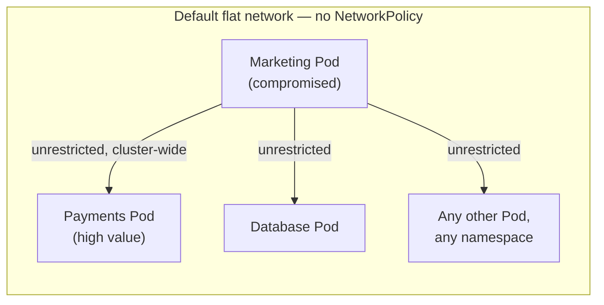
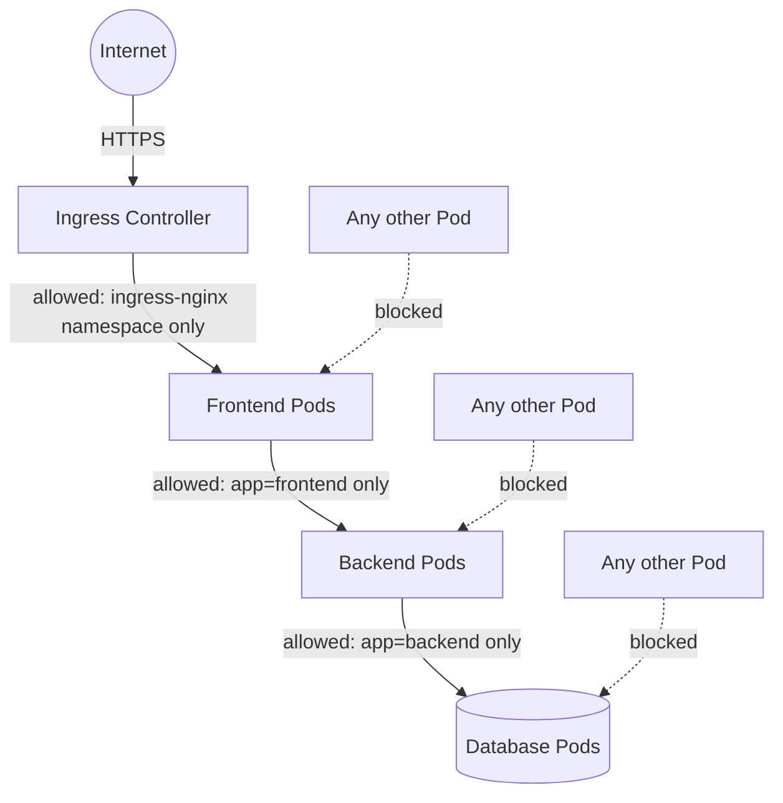

# Chapter 4 — Network Policies

## Learning Objectives

By the end of this chapter you will be able to:

- Explain why Kubernetes' default "flat network" model is a security liability at scale
- Explain the critical CNI-plugin dependency that determines whether NetworkPolicies do anything at all
- Write default-deny NetworkPolicies for both ingress and egress traffic in a namespace
- Write allow-list NetworkPolicy rules using `podSelector`, `namespaceSelector`, and `ipBlock`
- Diagnose the single most common NetworkPolicy failure: forgetting to allow DNS egress
- Design a layered, zero-trust network policy for a multi-tier application

## Prerequisites for This Chapter

- Topic 8, Chapter 6 (Services and Networking) — Pod IPs, Services, CoreDNS, and the CNI-provided flat network model
- Topic 8, Chapter 9 (Namespaces and Resource Management) — namespaces as an organizational, not a network, boundary
- Chapter 2 of this course (RBAC and Authentication) — the general idea of least privilege
- Chapter 3 of this course (Admission Control and Pod Security) — admission policies as a way to enforce cluster-wide rules

---

## 4.1 Recap: The Flat Network Is Wide Open by Design

Topic 8, Chapter 6 established the Kubernetes networking model: every Pod gets its own IP, and **every Pod can reach every other Pod's IP directly, cluster-wide, without NAT** — regardless of namespace. Topic 8, Chapter 9 reinforced the same point from the namespace angle: creating a namespace organizes your objects, but it draws no line in the network. A Pod in `team-marketing` can open a TCP connection straight to a Pod in `team-payments` as easily as it can reach a Pod sitting right next to it.

This was a deliberate design choice — it makes basic cluster networking simple and predictable, and it's exactly what let Services and DNS "just work" without you thinking about firewalls in Topic 8. But it has a consequence that becomes serious the moment your cluster hosts more than one team, more than one trust level, or any sensitive data: **there is zero network-layer resistance between a low-value Pod and a high-value Pod.**

Think concretely about what that means. Suppose your cluster runs:

- A public-facing marketing microsite, built quickly, with a known set of loosely-vetted third-party dependencies
- A payments service, holding database credentials and talking to a card-processing API

In the default flat network, if an attacker finds a remote code execution vulnerability in the marketing site's dependencies — a scenario that happens constantly in the real world — the compromised Pod is not confined to "damage the marketing site." It can immediately start scanning the cluster's internal IP ranges, discover the payments Service's ClusterIP and DNS name via CoreDNS (Topic 8, Chapter 6 — the same discovery mechanism that makes legitimate traffic easy also makes *illegitimate* traffic easy), and attempt to connect directly to it. Nothing in the network itself says no. The only things standing between the attacker and the payments service at that point are application-layer authentication/authorization inside the payments service itself — a much weaker position than not being reachable in the first place.



This is precisely the gap **NetworkPolicy** exists to close: a Kubernetes-native object that restricts which Pods may talk to which other Pods, turning the flat network into a network with actual, enforced boundaries.

---

## 4.2 The Critical Caveat: NetworkPolicy Does Nothing Without CNI Support

Before writing a single line of NetworkPolicy YAML, internalize this, because it is the single most common source of "I wrote a policy and nothing happened" confusion:

> **A NetworkPolicy object is just a request. It only takes effect if the cluster's CNI plugin implements NetworkPolicy enforcement.** Kubernetes itself does not enforce NetworkPolicies — it delegates enforcement entirely to the CNI plugin, exactly the same way it delegates the flat network's existence to the CNI plugin in the first place (Topic 8, Chapter 6).

| CNI Plugin | Enforces NetworkPolicy? |
|---|---|
| **Calico** | Yes — one of the most common choices specifically because of this |
| **Cilium** | Yes — eBPF-based, also supports richer policy beyond the standard NetworkPolicy spec |
| **Flannel** (default/simple mode) | **No** — plain Flannel does not enforce NetworkPolicies at all |
| **kindnet** (kind's default CNI) | **No** — this is why NetworkPolicies silently do nothing on an out-of-the-box `kind` cluster |
| Most cloud-managed CNIs (varies by provider/mode) | Depends — check your provider's documentation; some require an explicit "enable NetworkPolicy" flag |

You can apply the most carefully-written default-deny policy in the world, and on an unsupported CNI, traffic keeps flowing exactly as before — no error, no warning, `kubectl apply` succeeds cleanly. The object simply sits in etcd, unread by anything capable of acting on it. This is why the Hands-On Exercise in this chapter has you explicitly install Calico on your `kind` cluster rather than assuming the default setup will demonstrate anything.

**Always confirm your CNI plugin enforces NetworkPolicy before relying on one for security.** This is not a minor footnote — it is the first thing to check when a NetworkPolicy "isn't working."

---

## 4.3 The Default-Deny Pattern: Zero-Trust Networking

Once you have NetworkPolicy enforcement available, the next question is: what's the right default? Kubernetes NetworkPolicies are **additive** — if a Pod is selected by at least one policy of a given type (`Ingress` or `Egress`), only the traffic explicitly allowed by that (or any other matching) policy is permitted; everything else is dropped. If a Pod is selected by *no* policy of a given type, that type of traffic is unrestricted (back to flat-network behavior) for that Pod.

This leads directly to the pattern serious platform teams adopt as a baseline: **apply a default-deny policy to every namespace first, then explicitly allow only the specific traffic each workload actually needs.** This is the network equivalent of least-privilege RBAC (Chapter 2) — start from zero access, and grant exactly what's justified. It's often called **zero-trust networking**: no Pod is trusted merely because it's "inside the cluster."

### Deny all ingress in a namespace

```yaml
apiVersion: networking.k8s.io/v1
kind: NetworkPolicy
metadata:
  name: default-deny-ingress
  namespace: team-payments
spec:
  podSelector: {}          # empty selector = applies to ALL Pods in this namespace
  policyTypes:
    - Ingress
  # no `ingress:` rules block at all = nothing is allowed in
```

### Deny all egress in a namespace

```yaml
apiVersion: networking.k8s.io/v1
kind: NetworkPolicy
metadata:
  name: default-deny-egress
  namespace: team-payments
spec:
  podSelector: {}
  policyTypes:
    - Egress
  # no `egress:` rules block = nothing is allowed out
```

You can combine both into a single manifest by listing `policyTypes: [Ingress, Egress]` with no rules — the effect is the same, a namespace where every Pod can neither be reached by, nor reach, anything, until further policies say otherwise.

```bash
kubectl apply -f default-deny.yaml -n team-payments
kubectl get networkpolicy -n team-payments
# NAME                    POD-SELECTOR   AGE
# default-deny-ingress    <none>         5s
# default-deny-egress     <none>         5s
```

At this point, every Pod in `team-payments` is network-isolated from everything, including from other Pods in the same namespace and from the internet. This is intentionally a blank slate — the next sections build back exactly the access each workload needs, and nothing more.

---

## 4.4 Building Allow Rules: `podSelector`, `namespaceSelector`, `ipBlock`

A NetworkPolicy's `ingress`/`egress` rules are lists of "peers" that are allowed, each described by one or more selector types:

| Selector | Matches |
|---|---|
| `podSelector` | Pods by label, **within the same namespace as the NetworkPolicy** by default |
| `namespaceSelector` | All Pods in namespaces matching the given label — this is how you allow traffic *from another namespace* |
| `podSelector` + `namespaceSelector` together | Pods matching *both* — a specific label, in a specific other namespace |
| `ipBlock` | A CIDR range of IP addresses, typically used for traffic to/from outside the cluster |

### Example: allow ingress only from Pods with a specific label, same namespace

```yaml
apiVersion: networking.k8s.io/v1
kind: NetworkPolicy
metadata:
  name: allow-from-frontend
  namespace: team-payments
spec:
  podSelector:
    matchLabels:
      app: payments-api          # this policy applies TO Pods labeled app=payments-api
  policyTypes:
    - Ingress
  ingress:
    - from:
        - podSelector:
            matchLabels:
              app: checkout-frontend   # ONLY allow traffic FROM Pods with this label
      ports:
        - protocol: TCP
          port: 8443
```

Read this carefully: the top-level `podSelector` picks which Pods this policy governs (`payments-api`); the `ingress.from.podSelector` picks who is allowed to reach them (`checkout-frontend`). These are two different selectors doing two different jobs, and mixing them up is a common source of confusion when first learning NetworkPolicy YAML.

### Example: allow ingress from another namespace

```yaml
apiVersion: networking.k8s.io/v1
kind: NetworkPolicy
metadata:
  name: allow-from-ingress-namespace
  namespace: team-payments
spec:
  podSelector:
    matchLabels:
      app: payments-api
  policyTypes:
    - Ingress
  ingress:
    - from:
        - namespaceSelector:
            matchLabels:
              kubernetes.io/metadata.name: ingress-nginx   # built-in label = namespace name
      ports:
        - protocol: TCP
          port: 8443
```

`kubernetes.io/metadata.name` is a label the API server automatically applies to every namespace, always equal to the namespace's own name — a convenient, always-available way to write a `namespaceSelector` that targets one specific namespace by name, without depending on that namespace having been given a custom label.

### Example: allow egress only to a specific external CIDR (a managed database) — plus DNS

This is where a default-deny egress policy gets genuinely tricky, and it is the single most common gotcha in this entire chapter. Suppose `payments-api` needs to reach a managed database service living outside the cluster, at a known IP range:

```yaml
apiVersion: networking.k8s.io/v1
kind: NetworkPolicy
metadata:
  name: payments-egress
  namespace: team-payments
spec:
  podSelector:
    matchLabels:
      app: payments-api
  policyTypes:
    - Egress
  egress:
    # 1. Allow egress to the managed database's CIDR, on the database port only
    - to:
        - ipBlock:
            cidr: 10.50.0.0/24        # e.g. a cloud provider's managed-DB subnet
      ports:
        - protocol: TCP
          port: 5432
    # 2. Allow DNS egress — WITHOUT this, service discovery breaks entirely
    - to:
        - namespaceSelector: {}       # any namespace...
          podSelector:
            matchLabels:
              k8s-app: kube-dns        # ...but only the CoreDNS Pods within it
      ports:
        - protocol: UDP
          port: 53
        - protocol: TCP
          port: 53
```

**Why the DNS rule is not optional.** Under a default-deny egress policy, a Pod cannot send *any* outbound traffic that isn't explicitly allowed — including the DNS lookup it needs to resolve `payments-db.internal` or even a Service name like `backend-svc` (Topic 8, Chapter 6) into an IP in the first place. Forget the DNS egress rule, and every single outbound connection your Pod attempts will fail at the name-resolution step, often with a confusing timeout rather than an obvious "connection refused" — because the Pod never even got far enough to attempt the TCP connection your `ipBlock` rule was supposed to allow. This single missing rule is responsible for more "NetworkPolicy broke my app" incidents than almost anything else in this chapter. Always pair a default-deny egress policy with an explicit allow for DNS (UDP/TCP port 53 to CoreDNS) as step zero.

---

## 4.5 A Layered Example: Locking Down a Three-Tier Application

Put it all together: a typical `frontend → backend → database` application, where each tier should only be reachable from the tier immediately in front of it, and the Ingress controller (Topic 8, Chapter 11) is the only entry point from outside the cluster.



```yaml
# Frontend: reachable ONLY from the ingress-nginx namespace
apiVersion: networking.k8s.io/v1
kind: NetworkPolicy
metadata:
  name: frontend-allow-ingress
  namespace: shop
spec:
  podSelector:
    matchLabels:
      tier: frontend
  policyTypes:
    - Ingress
  ingress:
    - from:
        - namespaceSelector:
            matchLabels:
              kubernetes.io/metadata.name: ingress-nginx
      ports:
        - protocol: TCP
          port: 8080
---
# Backend: reachable ONLY from frontend Pods in the same namespace
apiVersion: networking.k8s.io/v1
kind: NetworkPolicy
metadata:
  name: backend-allow-frontend
  namespace: shop
spec:
  podSelector:
    matchLabels:
      tier: backend
  policyTypes:
    - Ingress
  ingress:
    - from:
        - podSelector:
            matchLabels:
              tier: frontend
      ports:
        - protocol: TCP
          port: 9090
---
# Database: reachable ONLY from backend Pods in the same namespace
apiVersion: networking.k8s.io/v1
kind: NetworkPolicy
metadata:
  name: database-allow-backend
  namespace: shop
spec:
  podSelector:
    matchLabels:
      tier: database
  policyTypes:
    - Ingress
  ingress:
    - from:
        - podSelector:
            matchLabels:
              tier: backend
      ports:
        - protocol: TCP
          port: 5432
```

Notice what this achieves even *without* a namespace-wide default-deny: because each policy's `podSelector` matches a specific tier, and each policy defines its own explicit `ingress.from`, a Pod labeled `tier: database` simply has no rule permitting traffic from `tier: frontend` — the frontend cannot skip the backend and hit the database directly, even though all three tiers share one namespace and the same flat network underneath. This is the practical value of NetworkPolicy: turning "anyone can reach anyone" into "only the intended call graph is reachable," expressed declaratively, right alongside the rest of your manifests.

---

## Real-World Scenario: Default-Deny as a Fintech Onboarding Checklist Item

A fintech company runs several dozen microservices across multiple team-owned namespaces on a shared cluster with Calico as its CNI. Early on, a security audit found exactly the flat-network risk described in section 4.1: a lower-trust internal tools namespace had unrestricted network access to namespaces handling card data.

Their response became a standing platform policy: **every namespace gets a default-deny ingress and egress policy applied automatically the moment it's created** (via the same kind of namespace-provisioning automation discussed in Topic 8, Chapter 9), and **every new microservice's onboarding checklist requires its own explicit allow policies** before it's considered production-ready — one policy pair describing exactly which other services it accepts traffic from, and exactly which destinations (internal services, external APIs, DNS) it's allowed to call out to.

This ties directly back to Chapter 3's admission control discussion: rather than trusting every team to remember to add default-deny policies to namespaces they create, the platform team eventually implemented an **admission policy** (using the same OPA/Gatekeeper or Kyverno mechanism from Chapter 3) that flatly **rejects the creation of any new namespace that doesn't already have a default-deny NetworkPolicy applied** as part of the same request. This closes the gap between "policy documented in a wiki" and "policy actually enforced" — exactly the theme of Chapter 3, now applied to networking.

The practical payoff: when a real incident did occur — a dependency vulnerability in an internal admin tool — the compromised Pod could not reach the card-data namespace at all. The connection attempt was dropped at the network layer before it ever reached an application that could have been exploited further. The incident was contained to a single, low-value namespace by design, not by luck.

---

## Best Practices

- Confirm your CNI plugin enforces NetworkPolicy (Calico, Cilium, or equivalent) before relying on it for anything security-critical — check this first whenever a policy "isn't working."
- Apply default-deny ingress and egress as the baseline for every namespace, then add narrow, explicit allow rules — least privilege for networking, mirroring RBAC's least privilege for the API.
- Always pair default-deny egress with an explicit DNS allow rule (UDP/TCP port 53 to CoreDNS) — this is the single most common cause of "everything broke" after applying a default-deny policy.
- Select peers by label (`podSelector`/`namespaceSelector`) rather than by IP wherever possible — Pod IPs are ephemeral (Topic 8, Chapter 6), and label-based rules survive rescheduling and scaling automatically.
- Use `ipBlock` sparingly, reserved for genuinely external, stable endpoints (a managed database, a partner API) — not as a substitute for label selectors inside the cluster.
- Treat NetworkPolicy as a *complement* to RBAC and admission control (Chapters 2–3), not a replacement — network restrictions stop lateral movement; RBAC and admission control stop unauthorized API actions in the first place.

## Common Mistakes

- Writing a NetworkPolicy on a CNI that doesn't enforce it (plain Flannel, default `kind`/`kindnet`) and assuming it's working because `kubectl apply` succeeded with no errors.
- Applying default-deny egress without an explicit DNS allow rule, breaking all service discovery and external calls in one step.
- Confusing the top-level `podSelector` (who this policy governs) with the `ingress.from`/`egress.to` selector (who is allowed to talk to them).
- Assuming a `podSelector` inside `ingress.from` automatically searches other namespaces — it only matches Pods in the *same* namespace as the NetworkPolicy unless combined with a `namespaceSelector`.
- Forgetting that NetworkPolicies are additive, not overriding — multiple policies selecting the same Pod are combined (unioned), never one replacing another.

*(The full catalog of Kubernetes pitfalls is covered in Chapter 15 — Common Mistakes and Pitfalls.)*

---

## Summary

- Kubernetes' default flat network lets any Pod reach any other Pod cluster-wide — a serious liability once a cluster hosts multiple trust levels or sensitive workloads.
- NetworkPolicy is the Kubernetes-native object for restricting Pod traffic, but it **only works if the CNI plugin enforces it** — Calico and Cilium do; plain Flannel and `kind`'s default CNI do not.
- The default-deny pattern (deny all ingress, deny all egress, per namespace) establishes zero-trust networking as a baseline, with explicit allow rules layered on top.
- Rules are built from `podSelector` (same-namespace label match), `namespaceSelector` (cross-namespace match), and `ipBlock` (external CIDR match), combined under `ingress`/`egress` and gated by `policyTypes`.
- Default-deny egress without an explicit DNS (port 53) allow rule breaks all service discovery — the most common NetworkPolicy mistake.
- Layering policies per tier (frontend/backend/database) restricts traffic to only the intended call graph, even within a single namespace sharing one flat network underneath.

---

## Knowledge Check

1. Why does the default Kubernetes flat network become a serious security risk once a cluster hosts multiple teams or sensitive workloads, even though namespaces already separate them logically?
2. You apply a NetworkPolicy on a `kind` cluster using the default CNI and observe no change in traffic behavior. What is the most likely explanation?
3. Write (in your own words, no need for full YAML) a description of a NetworkPolicy that allows ingress to `app: api` Pods only from Pods labeled `app: web` in the same namespace, on port 443.
4. What does an empty `podSelector: {}` mean in a NetworkPolicy's top-level `spec`, versus in an `ingress.from` entry?
5. A team applies a default-deny egress policy to their namespace and their application immediately stops being able to reach anything, including internal Services it previously called successfully by name. What is the most likely missing piece?
6. How does an admission control policy (Chapter 3) complement NetworkPolicy in enforcing that every namespace has a network security baseline?

---

## Hands-On Exercise

Your local `kind` cluster's default CNI (`kindnet`) does not enforce NetworkPolicies, so this exercise starts by installing one that does.

1. Create a `kind` cluster with the default CNI disabled so Calico can be installed instead:
   ```yaml
   # kind-calico-config.yaml
   kind: Cluster
   apiVersion: kind.x-k8s.io/v1alpha4
   networking:
     disableDefaultCNI: true
   ```
   ```bash
   kind create cluster --name netpol-demo --config kind-calico-config.yaml
   kubectl apply -f https://raw.githubusercontent.com/projectcalico/calico/v3.28.0/manifests/calico.yaml
   kubectl get pods -n kube-system -l k8s-app=calico-node -w   # wait until Running
   ```
2. Create a namespace `shop` and deploy three simple Deployments/Services labeled `tier: frontend`, `tier: backend`, and `tier: database` (any lightweight image like `nginx` or `busybox` with a sleep loop is fine — the goal is testing connectivity, not running a real app).
3. Before applying any policy, confirm the flat network: exec into the frontend Pod and `wget`/`curl` the database Service directly — it should succeed.
4. Apply the three-tier NetworkPolicy set from section 4.5 (`frontend-allow-ingress`, `backend-allow-frontend`, `database-allow-backend`), adjusting ports/selectors to match your test Deployments.
5. Re-test: frontend → database directly should now fail; frontend → backend should still work; backend → database should still work.
6. Apply a default-deny egress policy to the `backend` Pods only, without a DNS allow rule, and observe that even a working call to the database (by Service name) now fails. Add the DNS allow rule from section 4.4 and confirm it starts working again — this reproduces the chapter's central gotcha firsthand.
7. Clean up: `kind delete cluster --name netpol-demo`.

---

## Further Reading

- [Kubernetes Docs — Network Policies](https://kubernetes.io/docs/concepts/services-networking/network-policies/)
- [Calico — Network Policy documentation](https://docs.tigera.io/calico/latest/network-policy/)
- [Cilium — NetworkPolicy support](https://docs.cilium.io/en/stable/security/policy/)
- [Kubernetes Docs — Declare Network Policy (tutorial)](https://kubernetes.io/docs/tasks/administer-cluster/declare-network-policy/)
- [editor.networkpolicy.io — interactive NetworkPolicy visual editor](https://editor.networkpolicy.io/)

---

<div style="display:flex;justify-content:space-between;align-items:center;">
  <a href="./03-admission-control-and-pod-security.md">← Previous: Admission Control and Pod Security</a>
  <a href="./00-index.md">🏠 Index</a>
  <a href="./05-custom-resources-and-operators.md">Next: Custom Resources and Operators →</a>
</div>
