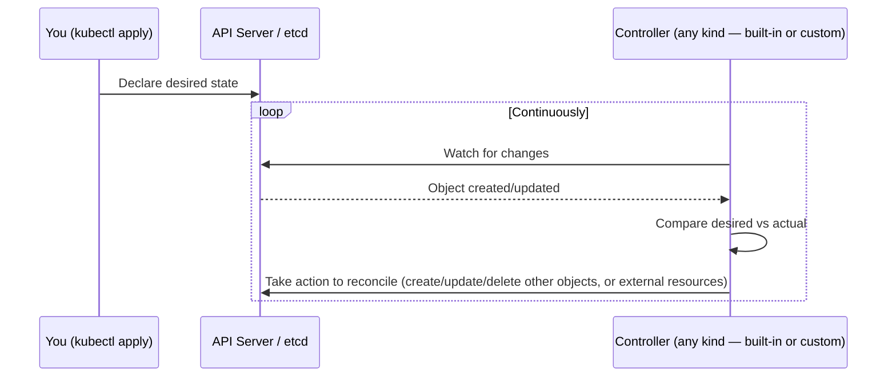
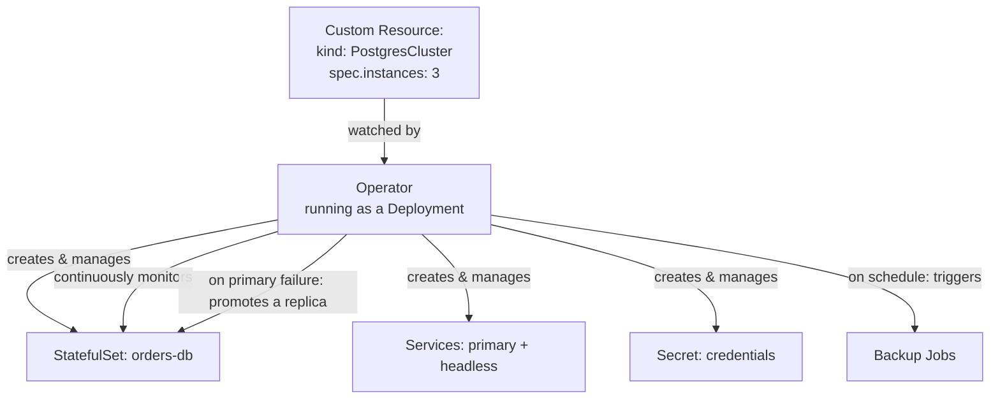

# Chapter 5 — Custom Resources and Operators

## Learning Objectives

By the end of this chapter you will be able to:

- Explain the reconciliation loop as a general design pattern, not a Kubernetes-specific hardcoded behavior
- Define a Custom Resource Definition (CRD) and create Custom Resource instances of it
- Explain what an Operator is, why a CRD alone does nothing, and how the two combine
- Identify the standard tooling used to build Operators (`controller-runtime`, `kubebuilder`, Operator SDK) at an appropriate depth for an infrastructure engineer
- Name several widely-used, production-grade Operators and what each manages
- Know where to look for an existing Operator before considering building one
- Explain the difference between a Custom Resource's `spec` and `status`, and why only a controller should write to `status`

## Prerequisites for This Chapter

- Topic 8, Chapter 2 (Architecture and Internals) — the reconciliation loop, controllers, and the API server/etcd model
- Topic 8, Chapter 12 (StatefulSets, DaemonSets, and Jobs) — comfort with the idea of a controller managing Pods on your behalf
- Chapter 4 of this course (Network Policies) — not strictly required, but useful context for the cert-manager example

---

## 5.1 Recap: The Reconciliation Loop Is a Pattern, Not Magic

Topic 8, Chapter 2 introduced the idea that sits underneath essentially everything Kubernetes does: a **controller** continuously compares **desired state** (what you declared, stored in etcd) against **actual state** (what's really running), and takes action to close the gap. A Deployment controller notices "desired: 3 replicas, actual: 2" and creates a Pod. A StatefulSet controller notices a Pod died and recreates it with the same name and reattaches its PVC (Topic 8, Chapter 12). None of this is achieved by special-cased code buried in the API server — it's achieved by independent controller processes that **watch** the API server for changes to objects they care about, and **reconcile** by issuing further API calls.

The important realization for this chapter: **this is a general-purpose pattern that Kubernetes exposes to you, not a closed set of built-in behaviors.** Kubernetes doesn't have a fixed list of "the twelve things a controller can manage." Anyone can write a new controller that watches a new *kind* of object and reconciles it toward whatever "actual state" means for that object — including things far outside anything Kubernetes ships with out of the box, like an entire external database cluster, a DNS record, or a cloud provider's load balancer configuration. This chapter is about exactly that extensibility: how you add new object types to the API, and how you attach real, automated behavior to them.



---

## 5.2 Custom Resource Definitions: New Object Types in the API

A **Custom Resource Definition (CRD)** registers an entirely new object *kind* with the Kubernetes API server. Once a CRD is installed, instances of that kind — called **Custom Resources (CRs)** — behave exactly like any built-in object you already know from Topic 8: they're stored in etcd, they're created/read/updated/deleted with `kubectl`, they support labels/annotations/selectors, they can be watched, and they show up in `kubectl get`/`kubectl describe` output using their own kind name.

This is the crucial mental shift for this chapter: a CRD is not a "Kubernetes plugin" living outside the normal object model — it *becomes part of* the normal object model. `kind: PostgresCluster` becomes just as real, from the API server's point of view, as `kind: Deployment`.

### A minimal CRD definition

```yaml
apiVersion: apiextensions.k8s.io/v1
kind: CustomResourceDefinition
metadata:
  name: postgresclusters.db.example.com     # must be <plural>.<group>
spec:
  group: db.example.com
  names:
    kind: PostgresCluster
    plural: postgresclusters
    singular: postgrescluster
    shortNames:
      - pgc
  scope: Namespaced
  versions:
    - name: v1
      served: true
      storage: true
      schema:
        openAPIV3Schema:
          type: object
          properties:
            spec:
              type: object
              properties:
                instances:
                  type: integer
                  minimum: 1
                storageSize:
                  type: string
                postgresVersion:
                  type: integer
              required: ["instances", "storageSize", "postgresVersion"]
```

```bash
kubectl apply -f postgrescluster-crd.yaml
kubectl get crd postgresclusters.db.example.com
```

Notice the `schema.openAPIV3Schema` block — the API server validates any Custom Resource submitted against this schema, just as it validates a built-in Pod spec against its known schema. Submit a `PostgresCluster` with `instances: -1` and the API server rejects it outright, before it's ever stored, exactly like submitting a malformed Deployment.

### An instance of the Custom Resource

```yaml
apiVersion: db.example.com/v1
kind: PostgresCluster
metadata:
  name: orders-db
  namespace: team-checkout
spec:
  instances: 3
  storageSize: 20Gi
  postgresVersion: 16
```

```bash
kubectl apply -f orders-db.yaml
kubectl get postgresclusters -n team-checkout
# NAME        AGE
# orders-db   4s

kubectl get pgc -n team-checkout      # the shortName works too, just like `kubectl get deploy`
kubectl describe postgrescluster orders-db -n team-checkout
```

**And here is the deliberately anticlimactic part: nothing happens.** No Postgres Pods get created. No Service appears. No StatefulSet materializes. The CRD only taught the API server a new *shape* of object to accept and store — it did not teach the cluster any *behavior* in response. A CRD is a schema, not automation. This is the exact gap the Operator pattern exists to close.

---

## 5.3 The Operator Pattern: A Controller for Your Custom Resource

An **Operator** is a custom controller — an ordinary program, typically packaged as a container and run as a Deployment inside the cluster, just like any application workload from Topic 8 — that **watches Custom Resources of a specific kind and takes real action to reconcile the cluster's actual state to match what the Custom Resource declares.** It applies the exact reconciliation loop pattern from section 5.1, except the "desired state" it's watching is your new, custom kind rather than a built-in one.

Continuing the `PostgresCluster` example: an Operator watching that CRD, upon seeing the `orders-db` object created in section 5.2, would actually:

1. Create a StatefulSet with 3 replicas (matching `spec.instances: 3`), using the built-in StatefulSet mechanics from Topic 8, Chapter 12 — stable Pod identity, per-replica PVCs sized per `spec.storageSize`
2. Create a headless Service for internal peer discovery, and a regular Service for client connections
3. Generate and store a Secret with database credentials
4. Configure one instance as primary and the others as streaming replicas, wiring up the replication configuration itself
5. Continuously monitor primary health, and **automatically promote a replica to primary if the current primary fails** — a failover decision a human DBA would otherwise have to notice and execute manually, often at an inconvenient hour
6. Handle scheduled backups, and orchestrate safe, one-instance-at-a-time version upgrades when you bump `spec.postgresVersion`



This is why Operators are consistently described as **"encoding operational knowledge as software."** Everything in that list — how to detect a failed primary, how to safely promote a replica without split-brain, how to sequence a version upgrade without downtime, how to size and rotate backups — is knowledge that used to live in a human DBA's head (or a runbook they executed by hand under pressure). The Operator pattern takes that knowledge and expresses it as code that runs continuously, reacts automatically, and doesn't get paged at 3 AM. The CRD (5.2) is the *interface* a team interacts with; the Operator is the *automation* behind that interface.

### What actually changed for the end user

| Without an Operator (Topic 8 primitives, hand-managed) | With an Operator |
|---|---|
| You author and maintain a StatefulSet, Services, Secrets, and backup CronJobs yourself | You author one small Custom Resource |
| You write and test your own failover script/runbook | The Operator detects and handles failover automatically |
| You manually sequence version upgrades, Pod by Pod | You bump one field; the Operator sequences the upgrade safely |
| Operational knowledge lives in a wiki page or a person's head | Operational knowledge lives in the Operator's code, applied consistently every time |

---

## 5.4 How Operators Are Actually Built

You are not expected to build a production Operator from scratch in this course — that is a significant software engineering undertaking in its own right. What matters for a platform/infrastructure engineer is understanding the landscape well enough to evaluate, install, and operate *existing* Operators confidently, and to recognize what's involved if your team ever does need to build one.

- **`controller-runtime`** — the Go library that the overwhelming majority of Kubernetes Operators are built on top of. It provides the plumbing for watching API objects, queuing reconcile requests, and handling retries/backoff — the generic "watch and reconcile" machinery from section 5.1, so Operator authors don't reimplement it from scratch every time.
- **`kubebuilder`** — a scaffolding framework (built on `controller-runtime`) that generates a working project skeleton for a new Operator: CRD boilerplate, a reconciler stub, RBAC manifests (Chapter 2 of this course — an Operator needs its own ServiceAccount and permissions to manage the objects it creates), and a `Makefile` for building/deploying it.
- **Operator SDK** — a related, slightly higher-level toolset (part of the Operator Framework) that also supports building Operators in Ansible or Helm in addition to Go, for teams that want to encode simpler reconciliation logic without writing a full Go controller.

The realistic expectation at this level: know these names, understand that "someone wrote a Go program using `controller-runtime`, probably scaffolded with `kubebuilder`" is what's running inside almost every Operator Deployment you'll ever `kubectl get pods` and see, and be able to read an Operator's documentation and CRD schema well enough to operate it correctly. Building one from scratch is a specialized skill for teams with a genuine, unmet need — which brings us to the next point.

---

## 5.5 Real-World Operators Worth Knowing By Name

Before writing any Operator, the strong, near-universal industry norm is: **check OperatorHub.io and the project's own ecosystem first.** The number of problems that genuinely require a brand-new, bespoke Operator is small; the number of problems already solved by a mature, widely-adopted existing Operator is large.

| Operator | Manages | Notable Custom Resources |
|---|---|---|
| **Prometheus Operator** | Deploying and configuring Prometheus and Alertmanager declaratively | `ServiceMonitor`, `PodMonitor`, `PrometheusRule`, `Alertmanager` |
| **cert-manager** | Issuing, renewing, and rotating TLS certificates automatically | `Certificate`, `Issuer`, `ClusterIssuer` (ties directly back to Topic 8, Chapter 11's mention of cert-manager for Ingress TLS) |
| **CloudNativePG** | Running highly-available PostgreSQL clusters (the Operator used in the Real-World Scenario below) | `Cluster`, `Backup`, `ScheduledBackup` |
| **Percona/MySQL Operators** | Running highly-available MySQL/MariaDB clusters | `PerconaXtraDBCluster` and similar |
| **MongoDB Community/Enterprise Operator** | Running replica-set MongoDB deployments | `MongoDBCommunity`, `MongoDB` |
| **Elastic Cloud on Kubernetes (ECK)** | Running Elasticsearch, Kibana, and related stack components | `Elasticsearch`, `Kibana` |
| **Argo CD** | (Foreshadowing Chapter 8) Argo CD's own `Application` objects are themselves Custom Resources — GitOps is, structurally, another Operator pattern | `Application`, `AppProject` |

**OperatorHub.io** is the community catalog purpose-built for this discovery step — a searchable directory of Operators across categories (databases, monitoring, security, streaming, storage) with maturity ratings and installation instructions. The habit worth building: whenever a recurring operational task feels like it involves "install this stateful thing, then babysit it," search OperatorHub and the tool's own documentation before reaching for `kubectl` and a runbook.

---

## 5.6 `spec` vs. `status`: How Operators Report Back

Every well-designed Custom Resource, like every well-designed built-in Kubernetes object (a Deployment, a Pod), splits its fields into two conceptually distinct blocks: **`spec`**, which holds the desired state *you* declare, and **`status`**, which holds the actual, observed state that the *controller* reports back. This split is not a stylistic convention — it's enforced by a distinct API mechanism called the **status subresource**, and understanding it clarifies a common point of confusion for anyone new to CRDs.

```yaml
apiVersion: apiextensions.k8s.io/v1
kind: CustomResourceDefinition
metadata:
  name: postgresclusters.db.example.com
spec:
  group: db.example.com
  names:
    kind: PostgresCluster
    plural: postgresclusters
  scope: Namespaced
  versions:
    - name: v1
      served: true
      storage: true
      subresources:
        status: {}          # this line enables a SEPARATE status subresource
      schema:
        openAPIV3Schema:
          type: object
          properties:
            spec:
              type: object
              properties:
                instances:
                  type: integer
            status:
              type: object
              properties:
                phase:
                  type: string
                readyInstances:
                  type: integer
                currentPrimary:
                  type: string
```

Once `subresources.status: {}` is declared, `kubectl edit` or `kubectl apply` against the main object **cannot modify `.status` at all** — only a client explicitly writing to the object's `/status` subresource endpoint can, and in practice that client is always the Operator's own reconcile loop, never a human or a CI pipeline. This mirrors exactly what you'd expect from a built-in object: you can `kubectl edit deployment` to change `spec.replicas`, but you cannot hand-edit a Deployment's `status.readyReplicas` — the Deployment controller owns that field exclusively, because it reflects what the controller has actually observed, not what anyone wishes were true.

```bash
kubectl get postgrescluster orders-db -n team-checkout -o yaml
# spec:
#   instances: 3          <- you declared this
# status:
#   phase: Healthy         <- the Operator observed and reported this
#   readyInstances: 3
#   currentPrimary: orders-db-1
```

This is why `kubectl get postgrescluster` can meaningfully show a `STATUS` or `READY` column (via `additionalPrinterColumns` in the CRD, the same mechanism that gives `kubectl get deployment` its `READY` column) — the Operator is continuously writing real, observed facts into `.status`, and `kubectl` is just displaying them. If you ever find yourself tempted to manually patch a Custom Resource's `status` field to "fix" what a dashboard shows, stop — you're fighting the reconciliation loop, and the Operator will simply overwrite your change on its next reconcile pass anyway, because from its point of view, `.status` is *its* field to own, not yours.

### API versioning: `v1alpha1` → `v1beta1` → `v1`

CRDs support multiple simultaneous API versions, following the same maturity convention Kubernetes itself uses for built-in APIs (`apps/v1beta1` historically preceding today's `apps/v1`). A `CustomResourceDefinition`'s `versions` list can declare several versions at once, each independently marked `served` (clients can use it) and at most one marked `storage: true` (the version etcd actually persists; the API server transparently converts between versions on read/write via a conversion webhook for anything beyond simple cases). In practice, this means an Operator author can introduce `v1beta1` with a new field, let users migrate at their own pace while `v1alpha1` remains served, and eventually deprecate the old version — exactly the same lifecycle discipline expected of any public API, because to the cluster and its users, a CRD's API *is* a public API.

---

## 5.7 Real-World Scenario: Replacing a Hand-Rolled Postgres Setup with CloudNativePG

A team needs a highly-available PostgreSQL cluster for a new service. Using only Topic 8 primitives, this would mean hand-authoring something like the StatefulSet from Topic 8, Chapter 12, a headless Service for peer discovery, a Secret for credentials, a CronJob for nightly backups (Topic 8, Chapter 12 again), and — the genuinely hard part — a custom failover script or sidecar that watches the primary's health and promotes a replica if it goes down, tested thoroughly enough to trust in production. This is weeks of engineering effort for something that isn't the team's actual product.

Instead, the team installs the **CloudNativePG Operator** (available on OperatorHub.io) and creates a single Custom Resource:

```yaml
apiVersion: postgresql.cnpg.io/v1
kind: Cluster
metadata:
  name: orders-db
  namespace: team-checkout
spec:
  instances: 3
  storage:
    size: 20Gi
  postgresql:
    parameters:
      max_connections: "200"
  backup:
    barmanObjectStore:
      destinationPath: "s3://team-checkout-backups/orders-db"
      s3Credentials:
        accessKeyId:
          name: backup-s3-creds
          key: ACCESS_KEY_ID
        secretAccessKey:
          name: backup-s3-creds
          key: ACCESS_SECRET_KEY
    retentionPolicy: "30d"
```

```bash
kubectl apply -f orders-db-cluster.yaml
kubectl get cluster orders-db -n team-checkout
# NAME        AGE   INSTANCES   READY   STATUS                     PRIMARY
# orders-db   45s   3           3       Cluster in healthy state   orders-db-1
```

Compare the size and content of this one manifest to everything it replaces. Behind the scenes, the CloudNativePG Operator is doing exactly what section 5.3 described in the abstract: provisioning a StatefulSet-equivalent set of Pods with per-replica storage, configuring streaming replication between the three instances, continuously monitoring the primary, automatically promoting `orders-db-2` or `orders-db-3` to primary within seconds if `orders-db-1` fails (updating the `PRIMARY` column shown above and rewriting Service endpoints so clients transparently reconnect to the new primary), and running continuous WAL archiving plus scheduled base backups to the configured S3 destination per the `backup` block — all operational knowledge that used to require a human DBA's judgment, now expressed as a controller that reacts in seconds, every time, without needing sleep.

The team's actual job shrank to: write a 20-line Custom Resource, and periodically review the Operator's own release notes when upgrading it. The hard, error-prone operational logic is the Operator maintainers' problem to get right once, for everyone who installs it — not each individual platform team's problem to reinvent.

---

## Best Practices

- Search OperatorHub.io and the relevant project's own documentation before starting to build a custom Operator — a mature, community-maintained Operator almost always beats a bespoke one for well-known workload types (databases, certificates, monitoring).
- Treat a CRD's `openAPIV3Schema` as a real API contract — validate as much as possible at the schema level so invalid Custom Resources are rejected immediately, not discovered later inside a failed reconcile loop.
- Remember a CRD without a running Operator does nothing — if `kubectl get <your-crd>` shows the object but nothing is happening in the cluster, check whether the Operator Deployment is actually running and healthy first.
- Give Operators the least-privilege RBAC (Chapter 2) they need for their specific job — an Operator with cluster-admin-level permissions is a large, unnecessary blast radius if its container image is ever compromised.
- Pin Operator versions deliberately and read release notes before upgrading — an Operator upgrade can change reconciliation behavior for every Custom Resource it manages across the cluster simultaneously.
- Monitor the Operator's own health (its Pod, its logs, its own metrics if exposed) — if the Operator itself crashes or falls behind, your Custom Resources stop being reconciled even though they still look fine in `kubectl get`.

## Common Mistakes

- Assuming applying a CRD alone accomplishes anything — a CRD only defines a schema; without a running Operator watching it, nothing is reconciled.
- Building a custom Operator for a problem (Postgres HA, cert rotation, monitoring config) that a mature existing Operator already solves well.
- Granting an Operator's ServiceAccount overly broad (often cluster-admin) permissions "to make the errors go away," instead of scoping RBAC to what the Operator actually needs.
- Upgrading an Operator without reading its changelog, and being surprised when its reconciliation behavior changes for every existing Custom Resource at once.
- Confusing the Custom Resource's `spec` (desired state you declare) with its `status` (actual state the Operator reports back) — writing to `status` yourself has no effect; only the Operator should update it.

*(The full catalog of Kubernetes pitfalls is covered in Chapter 15 — Common Mistakes and Pitfalls.)*

---

## Summary

- The reconciliation loop (desired vs. actual state, watched and reconciled continuously) is a general Kubernetes design pattern, not a fixed set of built-in behaviors — anyone can extend it.
- A Custom Resource Definition (CRD) registers a new object *kind* with the API server; instances of it (Custom Resources) are stored in etcd and behave like built-in objects, but a CRD by itself has no behavior.
- An Operator is a custom controller that watches Custom Resources and takes real action to reconcile actual state — the automation that gives a CRD meaning.
- Operators are described as "encoding operational knowledge as software": failover, backups, and upgrades that a human specialist would otherwise perform manually.
- Most Operators are built in Go on `controller-runtime`, scaffolded with `kubebuilder` or Operator SDK — infrastructure engineers need to understand and operate them, not necessarily build them.
- Well-known Operators to recognize: Prometheus Operator, cert-manager, CloudNativePG and other database Operators, ECK, and Argo CD (whose Applications are themselves Custom Resources).
- Check OperatorHub.io before building a custom Operator — the industry default is "use an existing one" unless there's a genuine, unmet need.

---

## Knowledge Check

1. In your own words, explain why the reconciliation loop is described as a "pattern" rather than a fixed Kubernetes feature.
2. What specifically happens (and does not happen) in the cluster immediately after you apply a CRD, before any Custom Resource instances are created?
3. You create a `PostgresCluster` Custom Resource in a namespace, but no Pods or Services appear. List two possible explanations tied directly to this chapter's concepts.
4. What does it mean to say Operators "encode operational knowledge as software"? Give an example from the PostgresCluster/CloudNativePG scenario.
5. Name two tools/libraries commonly used to build Operators, and describe their relationship to each other.
6. Why should a team check OperatorHub.io before building a custom Operator for, say, managing MySQL clusters?
7. Why can't you fix a Custom Resource's reported health by directly editing its `.status` field with `kubectl edit`, and what would actually happen if you tried?

---

## Hands-On Exercise

**Goal:** Define a minimal CRD, observe that it does nothing on its own, then install a real, minimal Operator and observe actual reconciliation.

1. On your local `kind` cluster, apply the `PostgresCluster` CRD from section 5.2, then create the `orders-db` Custom Resource from the same section. Confirm with `kubectl get postgresclusters -n team-checkout` that it exists, and confirm with `kubectl get pods,svc -n team-checkout` that **nothing else was created** — reinforcing that a CRD alone is inert.
2. Delete that CRD and Custom Resource (`kubectl delete -f postgrescluster-crd.yaml` — this cascades to delete any instances too).
3. Install the CloudNativePG Operator on your `kind` cluster following its published installation manifest (a single `kubectl apply -f` of their release manifest). Confirm the Operator Deployment is running: `kubectl get pods -n cnpg-system`.
4. Apply a small `Cluster` Custom Resource similar to section 5.6 (omit the `backup` block for simplicity — no S3 bucket needed for this exercise), with `instances: 1` to keep resource usage light on a local cluster.
5. Watch the Operator actually reconcile: `kubectl get pods -n team-checkout -w` — observe Pods, a Secret, and Services appear automatically, created by the Operator, not by you.
6. Delete the primary Pod directly (`kubectl delete pod <primary-pod-name>`) and observe in `kubectl get cluster orders-db -n team-checkout` and the Operator's logs (`kubectl logs -n cnpg-system deploy/cnpg-controller-manager`) how it detects and responds to the disruption.
7. Clean up: delete the `Cluster` Custom Resource, then uninstall the Operator manifest, then `kind delete cluster` if you don't need it further.

---

## Further Reading

- [Kubernetes Docs — Custom Resources](https://kubernetes.io/docs/concepts/extend-kubernetes/api-extension/custom-resources/)
- [Kubernetes Docs — Operator Pattern](https://kubernetes.io/docs/concepts/extend-kubernetes/operator/)
- [kubebuilder Book](https://book.kubebuilder.io/)
- [OperatorHub.io](https://operatorhub.io/)
- [CloudNativePG Documentation](https://cloudnative-pg.io/documentation/)

---

<div style="display:flex;justify-content:space-between;align-items:center;">
  <a href="./04-network-policies.md">← Previous: Network Policies</a>
  <a href="./00-index.md">🏠 Index</a>
  <a href="./06-multi-tenancy.md">Next: Multi-Tenancy →</a>
</div>
