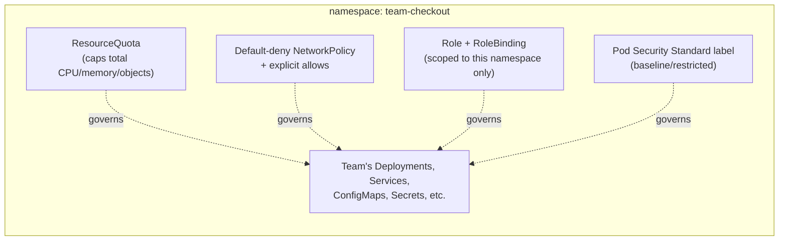
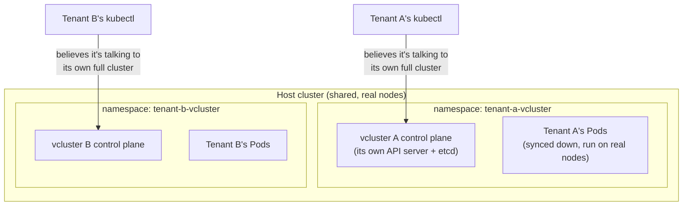

# Chapter 6 — Multi-Tenancy

## Learning Objectives

By the end of this chapter you will be able to:

- Define multi-tenancy in the Kubernetes context and articulate the central question it raises: isolation strength versus blast radius
- Distinguish soft multi-tenancy from hard multi-tenancy and identify which situations call for each
- Combine Namespaces, RBAC, ResourceQuotas/LimitRanges, and NetworkPolicies into one coherent soft multi-tenancy pattern
- Explain concretely where namespace-based isolation breaks down, even when configured correctly
- Compare namespace-per-tenant, virtual clusters (vcluster), and cluster-per-tenant as isolation strategies
- Make a defensible isolation-strategy choice for a given tenancy scenario

## Prerequisites for This Chapter

- Chapter 2 of this course (RBAC and Authentication) — Roles, RoleBindings, least privilege
- Chapter 3 of this course (Admission Control and Pod Security) — Pod Security Standards
- Chapter 4 of this course (Network Policies) — default-deny and allow-list patterns
- Topic 8, Chapter 9 (Namespaces and Resource Management) — Namespaces, ResourceQuotas, LimitRanges

---

## 6.1 What "Multi-Tenancy" Actually Means Here

**Multi-tenancy** in Kubernetes means multiple teams, applications, or customers — the "tenants" — share the compute, networking, and control-plane capacity of **one cluster**, rather than each getting a dedicated cluster of their own. This is common for a simple reason: clusters are not free. Every cluster has fixed overhead — a control plane to run and upgrade, baseline node capacity, monitoring and logging pipelines to wire up, on-call coverage to staff. Sharing one cluster across many tenants amortizes that overhead, often dramatically.

The moment you share a cluster, though, one question becomes unavoidable, and this entire chapter is really just a deep exploration of it:

> **How much isolation does each tenant actually get, and if that isolation is imperfect, what's the blast radius?**

"Isolation" here spans several independent dimensions you've already met individually across this course, and which this chapter deliberately brings together: *who can call which API operations* (RBAC, Chapter 2), *what security posture Pods are allowed to run with* (Pod Security Standards, Chapter 3), *which Pods can talk to which other Pods over the network* (NetworkPolicy, Chapter 4), and *how much CPU/memory/storage each tenant can consume* (ResourceQuota/LimitRange, Topic 8 Chapter 9). A cluster can be strong on some of these dimensions and weak on others — and "multi-tenancy" as a design goal means being deliberate about all of them together, not assuming that configuring one automatically covers the rest.

---

## 6.2 Soft Multi-Tenancy vs. Hard Multi-Tenancy

The right amount of isolation depends entirely on **how much you trust your tenants.**

### Soft multi-tenancy

Tenants are **mutually trusting** — typically different teams within the same company, all subject to the same employment agreements, code review processes, and security training. Nobody is trying to attack anybody else. The goal of isolation here is **preventing accidents and resource contention**, not defending against malice: stopping one team's runaway Deployment from starving another team's Pods of scheduling capacity (the "noisy neighbor" problem from Topic 8, Chapter 9), preventing an engineer from `team-search` accidentally deleting a Service that belongs to `team-payments` because they were in the wrong namespace, and giving each team a Kubernetes-native perimeter to reason about that doesn't touch anyone else's workloads.

Soft multi-tenancy is achieved entirely with tools you already have from this course and Topic 8: **Namespaces + RBAC (Chapter 2) + ResourceQuotas/LimitRanges (Topic 8, Chapter 9) + NetworkPolicies (Chapter 4)** — all sharing one physical cluster, one control plane, one set of nodes.

### Hard multi-tenancy

Tenants **do not trust each other at all** — the canonical example is a SaaS platform running each paying customer's workloads on shared infrastructure. Customer A has every incentive (or at least, no disincentive) to try to see Customer B's data, exhaust Customer B's resources, or exploit a shared-kernel vulnerability to escape into Customer B's workloads, whether through malice, a compromised dependency, or simple curiosity. Here, "isolation" needs to hold up even against a tenant that is actively, skillfully trying to break it — a fundamentally stronger bar than "prevent well-intentioned engineers from making mistakes."

Hard multi-tenancy generally requires isolation *beneath* the Kubernetes API-object layer entirely: separate clusters per tenant, or strong virtualization/sandboxing between tenants sharing infrastructure. Sections 6.4 and 6.5 cover the concrete options.

| | Soft Multi-Tenancy | Hard Multi-Tenancy |
|---|---|---|
| **Trust model** | Tenants are mutually trusting | Tenants are mutually hostile or unknown |
| **Typical example** | Internal teams sharing one company's cluster | SaaS platform running customer workloads |
| **Goal** | Prevent accidents, contain noisy neighbors | Withstand deliberate attack/escape attempts |
| **Primary tools** | Namespaces, RBAC, ResourceQuota/LimitRange, NetworkPolicy | Separate clusters, virtual clusters, node sandboxing |

---

## 6.3 The Layered Soft Multi-Tenancy Pattern (Synthesis)

This section is explicitly a **synthesis** of Chapters 2 through 4 — soft multi-tenancy isn't a new mechanism, it's the disciplined combination of mechanisms you already have. A well-isolated tenant namespace, onboarded consistently, looks like this for a hypothetical `team-checkout`:



```yaml
# 1. The namespace itself, labeled for Pod Security Standards enforcement (Chapter 3)
apiVersion: v1
kind: Namespace
metadata:
  name: team-checkout
  labels:
    pod-security.kubernetes.io/enforce: baseline
    pod-security.kubernetes.io/warn: restricted
---
# 2. ResourceQuota — caps total consumption (Topic 8, Chapter 9)
apiVersion: v1
kind: ResourceQuota
metadata:
  name: team-checkout-quota
  namespace: team-checkout
spec:
  hard:
    requests.cpu: "16"
    requests.memory: "32Gi"
    limits.cpu: "32"
    limits.memory: "64Gi"
    pods: "60"
---
# 3. Default-deny NetworkPolicy, plus an explicit allow (Chapter 4)
apiVersion: networking.k8s.io/v1
kind: NetworkPolicy
metadata:
  name: default-deny-ingress
  namespace: team-checkout
spec:
  podSelector: {}
  policyTypes: ["Ingress"]
---
apiVersion: networking.k8s.io/v1
kind: NetworkPolicy
metadata:
  name: allow-within-namespace
  namespace: team-checkout
spec:
  podSelector: {}
  policyTypes: ["Ingress"]
  ingress:
    - from:
        - podSelector: {}     # allow traffic from any Pod within THIS namespace only
---
# 4. Role + RoleBinding — scopes the team's engineers to their own namespace (Chapter 2)
apiVersion: rbac.authorization.k8s.io/v1
kind: Role
metadata:
  name: checkout-team-edit
  namespace: team-checkout
rules:
  - apiGroups: ["", "apps", "batch"]
    resources: ["pods", "deployments", "services", "configmaps", "jobs", "cronjobs"]
    verbs: ["get", "list", "watch", "create", "update", "patch", "delete"]
---
apiVersion: rbac.authorization.k8s.io/v1
kind: RoleBinding
metadata:
  name: checkout-team-binding
  namespace: team-checkout
subjects:
  - kind: Group
    name: team-checkout-engineers
    apiGroup: rbac.authorization.k8s.io
roleRef:
  kind: Role
  name: checkout-team-edit
  apiGroup: rbac.authorization.k8s.io
```

Four independent controls, each doing a distinct job, none of which substitutes for another: the **Pod Security Standard label** stops risky Pod specs (privileged containers, host namespace access) from ever being admitted (Chapter 3); the **ResourceQuota** stops one namespace's workloads from starving the shared cluster's capacity (Topic 8, Chapter 9); the **NetworkPolicy** stops lateral network movement into or out of this namespace beyond what's explicitly allowed (Chapter 4); the **Role/RoleBinding** stops engineers from other teams from touching this namespace's objects via the API at all (Chapter 2). Remove any one layer, and the isolation model has a real gap — for example, RBAC alone would stop a `team-search` engineer from *modifying* `team-checkout`'s Deployments through `kubectl`, but without the NetworkPolicy, a compromised Pod in `team-search`'s namespace could still reach `team-checkout`'s Pods directly over the network, bypassing the API and RBAC entirely.

---

## 6.4 Where Namespace-Based Soft Multi-Tenancy Breaks Down

Even with all four layers from 6.3 correctly configured, namespace-based isolation has real, structural limits worth knowing explicitly — this is precisely the line between "good enough for soft multi-tenancy" and "not sufficient for hard multi-tenancy."

**Node-level and kernel-level sharing is untouched by any of this.** Namespaces are an API-server-level and (with NetworkPolicy) network-level construct — they say nothing about what happens on the physical or virtual machine underneath. Pods from `team-checkout` and `team-search` can easily be scheduled onto the **same node**, sharing the same Linux kernel, the same CPU cache, the same disk I/O bandwidth. A CPU-cache-contention problem or a noisy `team-search` Pod hammering disk I/O can degrade `team-checkout`'s Pod performance in ways no `ResourceQuota` prevents, because `ResourceQuota` governs *requested* CPU/memory, not cache locality or I/O contention. More seriously: **if an attacker achieves a container escape** — breaking out of their container's isolation into the underlying node's kernel, a rare but real class of vulnerability — every other Pod scheduled on that same node, regardless of namespace, RBAC, or NetworkPolicy, is potentially reachable. None of the four layers in section 6.3 exist below the container boundary.

**Cluster-scoped resources aren't namespace-scoped at all.** Recall from Topic 8, Chapter 9 that some object types — Nodes, PersistentVolumes, StorageClasses, and CRDs (Chapter 5) themselves — live outside any namespace. A CRD installed for one tenant's use is visible and usable, in principle, cluster-wide; a misconfigured cluster-scoped resource, or a Custom Resource type whose Operator (Chapter 5) has broad RBAC permissions, can create cross-tenant effects no namespace boundary was ever designed to stop. Even something as simple as a `StorageClass` misconfiguration can affect every tenant provisioning storage through it.

The honest summary: **namespace-based soft multi-tenancy is genuinely effective against accidents and reasonably effective against a compromised low-privilege workload, but it is not a security boundary strong enough to hold against a determined, skilled attacker, or against a tenant you don't trust at all.** That's not a flaw in how you configured it — it's a structural property of sharing one kernel, one control plane, and one set of cluster-scoped resources.

---

## 6.5 Hard Multi-Tenancy Options

When tenants genuinely don't trust each other — the SaaS-platform case from 6.2 — you need isolation that doesn't rely on the shared kernel and shared control plane holding perfectly.

### Cluster-per-tenant

The strongest, simplest-to-reason-about option: **each tenant gets an entirely separate Kubernetes cluster** — its own control plane, its own nodes, its own etcd. There is no shared kernel between tenants at all (assuming separate node pools, which is the norm), so a container escape in one tenant's cluster has no path to another tenant's cluster. The cost is real and grows linearly with tenant count: every cluster needs its own upgrade cadence, its own monitoring, its own baseline node capacity sitting mostly idle for small tenants — a problem commonly called **cluster sprawl**, and one of the reasons Topic 8, Chapter 9 flagged "separate clusters per environment" as a deliberate cost/complexity tradeoff, not a free win.

### Virtual clusters (vcluster)

A compelling middle ground. A tool like **vcluster** runs an entire additional, lightweight Kubernetes **control plane** (its own API server, its own etcd or equivalent) *inside a single namespace* of a shared "host" cluster. From the tenant's point of view, they get what looks and behaves like their own real cluster — their own `kubectl` context pointed at their own API server, their own cluster-scoped resources (their own CRDs, their own view of "all namespaces," even their own Namespace objects, which are otherwise cluster-scoped and would collide between tenants in a shared cluster). Under the hood, the virtual cluster's workloads are still ultimately scheduled as ordinary Pods on the host cluster's real nodes — vcluster **syncs** objects from the virtual API server down into a real namespace in the host cluster.



This gives each tenant genuine **API-level and control-plane-level isolation** — they cannot see or affect each other's cluster-scoped resources, CRDs, or Namespace objects at all, closing exactly the gap identified in section 6.4 — at a fraction of the operational cost of a fully separate physical/cloud cluster, since the underlying nodes, and their capacity, are still pooled and shared. It does **not**, by itself, close the node-level/kernel-level gap from 6.4 — workloads from different vclusters can still land on the same underlying node and share a kernel — so it's often combined with node-level sandboxing (next) or scheduling constraints that pin each tenant's workloads to dedicated node pools.

### Stronger node-level sandboxing

For the remaining gap — different tenants' containers still sharing a literal kernel on the same node — tools like **gVisor** and **Kata Containers** run each container with an additional isolation layer between it and the host kernel (gVisor intercepts syscalls in a user-space kernel shim; Kata runs each "container" inside its own lightweight micro-VM). This meaningfully raises the bar against container-escape-class vulnerabilities, at some performance cost. This is genuinely deep, specialized material — worth knowing the names and the one-sentence idea ("stronger isolation than a normal container, cheaper than a whole separate machine"), but a full treatment is out of scope for this course.

### Hierarchical namespaces (brief mention)

For large organizations with nested team structures (a division containing several departments, each containing several teams), some platforms adopt **hierarchical namespaces** — sub-namespaces that automatically inherit RBAC and policy from a parent namespace, so a policy applied at the division level propagates down to every team's namespace beneath it without being reapplied manually at each level. Conceptually, instead of thirty flat, sibling namespaces each independently configured with the pattern from section 6.3, a large organization might structure things as a tree:

```
platform-org                         (root namespace: baseline NetworkPolicy + PSS applied here)
├── platform-org-payments            (department: additional RBAC restrictions)
│   ├── platform-org-payments-checkout   (team: their own ResourceQuota)
│   └── platform-org-payments-billing
└── platform-org-search              (department)
    └── platform-org-search-ranking  (team)
```

A RoleBinding or NetworkPolicy applied at `platform-org-payments` is automatically inherited by both `platform-org-payments-checkout` and `platform-org-payments-billing` beneath it, without anyone reapplying it twice — and a change at the root propagates to every namespace in the tree. This is a more niche, advanced pattern than the flat namespace-per-tenant model in section 6.3, useful mainly at large scale where manually keeping dozens of sibling namespaces' policies consistent becomes its own maintenance burden, and where the organization's team structure genuinely is hierarchical rather than flat. Know that the concept exists, recognize it if you encounter the Hierarchical Namespace Controller (HNC) project; it is not something most platform teams need on day one, and adopting it prematurely just adds a layer of indirection over a problem flat namespaces hadn't actually created yet.

---

## 6.6 Comparison: Namespace-per-Tenant vs. vcluster vs. Cluster-per-Tenant

| | Namespace-per-Tenant | vcluster | Cluster-per-Tenant |
|---|---|---|---|
| **Isolation strength** | Low–Moderate (API/network level only, shared kernel and control plane) | Moderate–High (own control plane and cluster-scoped resources; shared kernel/nodes) | Highest (fully separate control plane, etcd, and typically nodes) |
| **Operational cost** | Low — one cluster to run and upgrade | Moderate — one host cluster, but per-tenant control planes to provision and monitor | High — full cluster lifecycle (upgrades, monitoring, on-call) multiplied by tenant count |
| **Resource efficiency** | High — capacity pooled and shared tightly | High — capacity still pooled at the host-cluster level | Low — each cluster needs its own baseline capacity, often underutilized for small tenants |
| **Typical use case** | Internal teams within one trusted organization (soft multi-tenancy) | Platform teams offering self-service "own-cluster-like" experience without cluster sprawl; internal or semi-trusted tenants | SaaS platforms with untrusted/paying customers; strict compliance or contractual isolation requirements (hard multi-tenancy) |

---

## 6.7 A Practical Decision Checklist

With four isolation strategies on the table (plain namespaces, the layered namespace pattern, vcluster, and cluster-per-tenant), it helps to have a small set of concrete questions to walk through rather than picking based on gut feeling or whatever the last team you talked to used.

1. **Would a successful attacker or a severe misconfiguration from one tenant cause direct financial, legal, or contractual harm if it reached another tenant?** If yes — think regulated data, paying customers, competitors sharing infrastructure — you are almost certainly in hard-multi-tenancy territory (vcluster with strong scheduling isolation, or cluster-per-tenant), regardless of how small or well-behaved you expect tenants to be.
2. **Do tenants need their own cluster-scoped resources** — their own CRDs, their own view of Namespaces, their own admission webhooks — **that must not collide with or be visible to other tenants?** Plain namespace-based isolation cannot provide this at all (section 6.4); this is precisely the gap vcluster was built to close.
3. **What is the actual cost budget for isolation, measured in engineering time, not just cloud spend?** A cluster-per-tenant model multiplies every recurring operational task from Chapter 9 of this course (upgrades, backups, monitoring, auditing) by tenant count. Thirty clusters means thirty times the upgrade windows, thirty times the potential for a stuck node drain, thirty sets of audit logs to review. This cost is often underestimated until a platform team is already committed to it.
4. **Is the tenant population size and churn rate stable, or does it change constantly?** A SaaS platform onboarding a new enterprise customer every few weeks needs an isolation strategy whose operational cost per new tenant is well understood and automatable (a scripted new-cluster or new-vcluster provisioning pipeline) — not one that assumes tenants are added rarely by hand.
5. **Can you even answer question 1 with confidence?** If you genuinely don't know whether a tenant should be trusted, default to treating them as untrusted. It is far easier to relax isolation later for a population that turns out to be low-risk than to discover, after an incident, that a shared-cluster assumption was wrong.

Running through this checklist for the two populations in the Real-World Scenario below makes the diverging answers obvious well before any infrastructure gets built: internal engineering teams clearly fail question 1 (no plausible attacker motive, shared employment/legal relationship) and question 2 (no team has asked for its own CRDs or admission webhooks), so the layered namespace pattern from section 6.3 is a comfortable, well-justified fit. External SaaS customers clearly trigger question 1 on their own, which is normally sufficient by itself to justify the higher cost from question 3.

---

## Real-World Scenario: One Platform, Two Different Isolation Choices

An internal developer platform (IDP) team supports two very different populations, and — correctly — makes two very different isolation choices for them.

**For 30 internal engineering teams**, the IDP team offers **self-service namespaces**: any team can request a new namespace through an internal portal, and it's automatically provisioned with the full layered pattern from section 6.3 — a ResourceQuota sized to their stated needs, a default-deny NetworkPolicy plus standard internal-traffic allows, a Role/RoleBinding scoping the requesting team to their own namespace, and a Pod Security Standard label. This is a clear soft multi-tenancy situation: every one of these 30 teams is a fellow employee bound by the same code of conduct and security policies, nobody is incentivized to attack another team, and the platform team's actual risk to manage is accidents and resource contention — exactly what namespace-based isolation is good at, at a cost of operating a single shared cluster rather than 30 separate ones.

**For their customer-facing SaaS product**, the same platform team runs a **completely separate cluster per enterprise customer.** These customers are, from a trust perspective, unknown third parties: some are direct competitors of each other, all of them have contractual and often regulatory (e.g., data-residency, compliance-audit) requirements that a shared-kernel, shared-control-plane namespace could never satisfy or even credibly demonstrate to an auditor. A security incident or noisy-neighbor problem affecting one customer's cluster must be structurally incapable of touching another paying customer's data or availability — a bar that namespace-based soft multi-tenancy, per section 6.4, was never designed to meet. The higher operational cost of cluster-per-tenant here isn't overhead to be optimized away; it's the actual product requirement paying customers are buying when they choose this platform.

The lesson generalizes: **the right isolation strategy is a function of trust, not a function of how many tenants you have.** The same platform team runs 30 tenants one way and single-digit tenants a completely different way, because the trust relationship — not the tenant count — is what determined the answer.

---

## Best Practices

- Decide your trust model explicitly before choosing an isolation strategy — "how much do we trust these tenants" is the question that determines everything else in this chapter, not tenant count or convenience.
- For soft multi-tenancy, always deploy all four layers together (Pod Security Standards, ResourceQuota/LimitRange, NetworkPolicy, RBAC) — each closes a gap the others don't cover.
- Never treat namespace separation alone as a security boundary against untrusted or potentially hostile tenants — it wasn't designed to be one.
- Consider vcluster (or similar) when internal teams want a "my own cluster" self-service experience without the operational cost of true cluster sprawl.
- Reserve cluster-per-tenant for situations with genuine compliance, contractual, or trust requirements that justify its operational cost — not as a default for every tenant.
- Revisit the isolation strategy as trust relationships change — a tenant that starts as "internal team" can become "semi-trusted partner" or "external customer" as a product evolves, and the isolation model should evolve with it.

## Common Mistakes

- Assuming ResourceQuota, RBAC, or NetworkPolicy alone constitutes "multi-tenancy," instead of deploying all four layers from section 6.3 together.
- Applying soft multi-tenancy patterns (shared cluster, namespace-per-tenant) to an untrusted, hard-multi-tenancy situation like a SaaS platform with paying customers.
- Forgetting that cluster-scoped resources (CRDs, StorageClasses, Nodes) are not namespace-scoped, and can leak configuration or behavior across tenants regardless of how well namespaces are locked down.
- Over-provisioning cluster-per-tenant for internal teams that would have been perfectly well served, at far lower cost, by namespace-based soft multi-tenancy.
- Ignoring node-level/kernel-level sharing as a residual risk even after "textbook-correct" namespace isolation is in place.

*(The full catalog of Kubernetes pitfalls is covered in Chapter 15 — Common Mistakes and Pitfalls.)*

---

## Summary

- Multi-tenancy means sharing one cluster's capacity across multiple teams, applications, or customers; the central design question is isolation strength versus blast radius.
- Soft multi-tenancy (mutually trusting tenants) is achieved by combining Namespaces, RBAC, ResourceQuota/LimitRange, and NetworkPolicy — a direct synthesis of Chapters 2 through 4 of this course.
- Hard multi-tenancy (mutually untrusting tenants, e.g., SaaS customers) requires isolation below the API-object layer: separate clusters, virtual clusters, or stronger node-level sandboxing.
- Namespace-based isolation has real limits even when configured correctly: shared kernel/node resources, and cluster-scoped resources (CRDs, StorageClasses, Nodes) that aren't namespace-bound.
- vcluster offers a middle ground — a full virtual control plane per tenant inside a shared host cluster, closing the cluster-scoped-resource gap at much lower cost than fully separate clusters.
- The isolation strategy should be chosen based on trust level, not tenant count — the same organization can reasonably run soft multi-tenancy internally and hard multi-tenancy for external customers simultaneously.

---

## Knowledge Check

1. What is the fundamental difference in goals between soft multi-tenancy and hard multi-tenancy?
2. List the four layers used together in the soft multi-tenancy pattern from section 6.3, and state what specific gap each one closes.
3. Give two concrete reasons namespace-based isolation is insufficient for hard multi-tenancy, even when RBAC, ResourceQuota, and NetworkPolicy are all correctly configured.
4. How does a vcluster differ from a plain namespace in terms of what a tenant can see and control?
5. Why might a platform team choose cluster-per-tenant for external SaaS customers but namespace-per-tenant for internal engineering teams, rather than applying the same model to both?
6. What problem do gVisor and Kata Containers address that namespace-based isolation and NetworkPolicy do not?
7. Using the decision checklist from section 6.7, walk through why an internal platform team's "self-service namespace" offering for trusted engineering teams does not need to trigger a move to vcluster or cluster-per-tenant.

---

## Hands-On Exercise

**Goal:** Build and verify a complete soft multi-tenancy namespace on your local `kind` cluster (reuse the Calico-enabled cluster from Chapter 4's exercise if you still have it, so NetworkPolicy actually takes effect).

1. Apply the full `team-checkout` manifest set from section 6.3 (Namespace with Pod Security Standard labels, ResourceQuota, default-deny + allow-within-namespace NetworkPolicies, Role, and RoleBinding).
2. Create a second namespace, `team-search`, with no policies at all (representing an unmanaged, pre-multi-tenancy namespace for contrast).
3. Deploy a simple Pod in each namespace (e.g., `busybox` with a long sleep command). From the `team-search` Pod, attempt to reach the `team-checkout` Pod's IP directly — confirm it is blocked by the default-deny NetworkPolicy.
4. From a Pod inside `team-checkout`, confirm it *can* reach another Pod inside the same namespace (the `allow-within-namespace` rule).
5. Try to exceed the `team-checkout` ResourceQuota by deploying a Deployment requesting more CPU than the quota allows — confirm the `FailedCreate` event, exactly as in Topic 8, Chapter 9's exercise.
6. If you have a second `kubeconfig` user/context available (or simulate with `kubectl auth can-i` using `--as`), confirm that a user bound only to the `checkout-team-edit` Role cannot list or modify Pods in `team-search`: `kubectl auth can-i list pods -n team-search --as=someone-in-team-checkout-engineers`.
7. Clean up: `kubectl delete namespace team-checkout team-search`.

---

## Further Reading

- [Kubernetes Docs — Multi-tenancy](https://kubernetes.io/docs/concepts/security/multi-tenancy/)
- [vcluster Documentation](https://www.vcluster.com/docs/what-are-virtual-clusters)
- [gVisor Documentation](https://gvisor.dev/docs/)
- [Kata Containers Documentation](https://katacontainers.io/docs/)
- [Kubernetes Multi-tenancy Working Group — Hierarchical Namespace Controller](https://github.com/kubernetes-sigs/hierarchical-namespaces)

---

<div style="display:flex;justify-content:space-between;align-items:center;">
  <a href="./05-custom-resources-and-operators.md">← Previous: Custom Resources and Operators</a>
  <a href="./00-index.md">🏠 Index</a>
  <a href="./07-service-mesh.md">Next: Service Mesh →</a>
</div>
