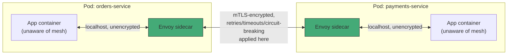
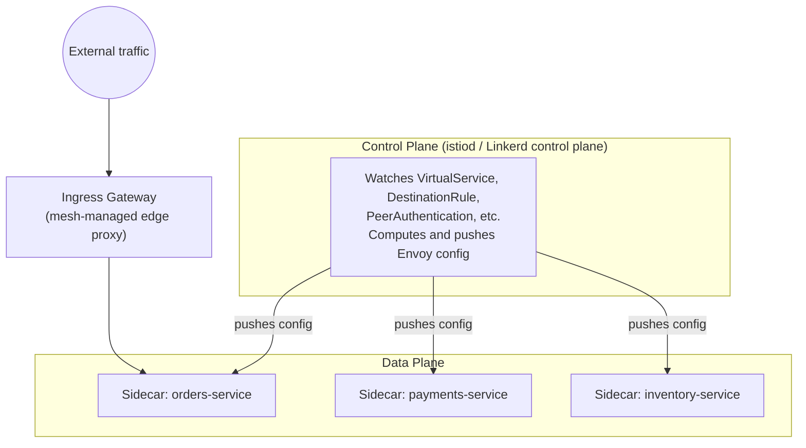

# Chapter 7 — Service Mesh

## Learning Objectives

By the end of this chapter you will be able to:

- Explain precisely what raw Kubernetes networking (Services + Ingress) does *not* give you as the number of microservices grows
- Describe the sidecar proxy pattern mechanically — how a service mesh intercepts and manages traffic without application code changes
- Explain the four core capabilities a mesh adds: mutual TLS, fine-grained traffic control, uniform resiliency policy, and uniform observability
- Compare Istio and Linkerd and articulate the operational trade-offs between them
- Read and write a minimal Istio `VirtualService`/`DestinationRule` pair for weighted traffic splitting
- Make a reasoned, honest decision about whether a given team or system actually needs a service mesh

---

## Prerequisites for This Chapter

- **Services and Ingress (Kubernetes Basics, Chapters 6 and 11)** — required. This chapter assumes you're comfortable with `ClusterIP`/`LoadBalancer` Services, DNS-based service discovery, and Ingress-based L7 routing, and builds directly on top of them.
- **The sidecar pattern (Kubernetes Basics, Chapter 4 — multi-container Pods)** — required. A service mesh is the sidecar pattern applied uniformly, cluster-wide; if the term "sidecar container" is unfamiliar, revisit that chapter first.
- **NetworkPolicies (this course, Chapter 4)** — recommended. NetworkPolicies and a mesh solve adjacent but distinct problems (who *can* talk to whom, at L3/L4, versus *how* traffic between allowed parties is managed at L7), and this chapter contrasts the two directly.

---

## 7.1 What You Already Have, and Where It Stops

Topic 8 gave you two networking primitives that, together, solve most of what a typical application needs:

- **Services** give you stable service discovery and basic load balancing — `orders-service.default.svc.cluster.local` always resolves to a healthy backing Pod, regardless of how many times Pods are rescheduled.
- **Ingress** gives you a single, HTTP-aware entry point into the cluster from the outside world, with path- and host-based routing.

For a handful of services, this is genuinely enough. But watch what happens as an organization grows from 5 microservices to 50, spread across several teams. New problems appear that Services and Ingress were never designed to solve, because both were designed to solve *north-south* traffic (into and out of the cluster) or basic *east-west* discovery (Pod-to-Pod), not the *quality and security* of east-west traffic at scale:

| Problem | Why Services + Ingress don't solve it |
|---|---|
| **No automatic encryption between services** | A `ClusterIP` Service happily load-balances plaintext HTTP between Pods. Nothing encrypts orders-service → payments-service traffic unless every team individually implements TLS in their own app. |
| **No fine-grained traffic control** | You cannot say "send 5% of traffic to `payments-service:v2`, and only from requests carrying a specific header" using a Service alone — a Service selects Pods by label and load-balances across all of them roughly evenly. Ingress can do *coarse* traffic splitting only via controller-specific, non-portable annotations. |
| **No uniform resiliency policy** | If you want retries, timeouts, and circuit breakers when `orders-service` calls `inventory-service`, someone has to build that into the HTTP client library `orders-service` uses. Every team either builds this themselves, uses a different library, or skips it entirely — resulting in wildly inconsistent behavior under failure across the organization. |
| **No consistent service-to-service observability** | You can see whether a single Pod is healthy (via probes), but you cannot see, without effort, "what is the p99 latency and error rate of every call from `checkout-service` to `payments-service`, on every request, right now" unless every team instruments their app the same way with the same tracing/metrics library. |

None of this means Services and Ingress are broken — they are doing exactly the job they were designed for. The gap only becomes painful at a specific scale: **many services, likely owned by many different teams, where you cannot realistically force every team to independently and consistently implement encryption, retries, and telemetry inside their own application code.** A service mesh exists to close exactly that gap, uniformly, at the infrastructure layer, so no individual application has to.

---

## 7.2 The Sidecar Proxy Pattern, Applied Cluster-Wide

Recall the sidecar pattern from Topic 8, Chapter 4: a second container in the same Pod as your application, sharing its network namespace, doing one auxiliary job (a log shipper, a config reloader) alongside the main container without the main container knowing or caring.

**A service mesh is that exact pattern, applied to every single Pod in the mesh, with the sidecar's job being "intercept and manage all network traffic."**

Concretely: when you enable mesh injection for a namespace, every new Pod created in it automatically gets a second container added — a lightweight proxy, almost always built on **Envoy**. Once that sidecar is present, the mesh transparently redirects all inbound and outbound traffic for the Pod through it, typically using `iptables` rules configured by an init container at Pod startup. Your application code keeps making what looks like a completely normal, plain HTTP call to `payments-service` — it has no idea a proxy is involved.



The critical shift to notice in that diagram: **application containers never talk directly to each other anymore.** `orders-service`'s app container talks to *its own* sidecar over `localhost`; that sidecar talks to `payments-service`'s sidecar over the real network (with mTLS, retries, and telemetry all applied in that hop); and `payments-service`'s sidecar hands the request to its own app container over `localhost`. Every policy the mesh enforces — encryption, retry behavior, circuit breaking, metrics collection — happens in that middle hop, entirely outside application code.

A **control plane** (in Istio, the `istiod` component; in Linkerd, a small set of control-plane Pods) configures every sidecar's behavior centrally — when you write a mesh policy, you're not touching any application, you're pushing configuration to thousands of Envoy proxies at once.

---

## 7.3 What a Mesh Gives You — One Capability at a Time

### Automatic mutual TLS (mTLS), with zero app code changes

Without a mesh, encrypting service-to-service traffic means every team's application must generate/rotate certificates, load them, and negotiate TLS in every language and framework they use — in practice, this rarely gets done consistently, and most internal traffic in most clusters runs as plaintext HTTP.

With a mesh, the sidecar owns TLS entirely. The control plane issues and rotates short-lived certificates to every sidecar automatically (identity is typically tied to the Pod's ServiceAccount). Every sidecar-to-sidecar hop is encrypted and each side cryptographically verifies the other's identity — **mutual** TLS, not just server-side TLS. The application containers still write and read plain HTTP over `localhost`; they are completely unaware encryption is happening one hop later. This is the single most common reason organizations adopt a mesh: it is the most practical way to satisfy a "traffic must be encrypted in transit, everywhere, including internally" compliance requirement across dozens of services owned by dozens of teams, without a multi-quarter project to retrofit TLS into every application individually.

### Fine-grained traffic control

A mesh lets you route traffic based on rules far richer than a Service's label selector: percentage-based splits ("90% of traffic to v1, 10% to v2"), header-based routing ("requests with `x-beta-user: true` go to v2, everyone else to v1"), and fault injection for resilience testing ("randomly delay 5% of requests to `inventory-service` by 2 seconds and see if `checkout-service` handles it gracefully"). This is the mechanism that makes true canary releases and A/B testing possible at the infrastructure layer instead of inside application code — and it's the direct link forward to progressive delivery in Chapter 8, which builds canary *automation* on top of this traffic-splitting capability.

### Consistent retries, timeouts, and circuit breaking

Instead of every team choosing (or forgetting to choose) their own retry logic, timeout values, and circuit-breaker thresholds inside their HTTP client library, these become declarative policy applied uniformly by the mesh:

```yaml
apiVersion: networking.istio.io/v1beta1
kind: DestinationRule
metadata:
  name: inventory-service
spec:
  host: inventory-service
  trafficPolicy:
    connectionPool:
      http:
        http1MaxPendingRequests: 50
        maxRequestsPerConnection: 10
    outlierDetection:            # circuit breaking
      consecutive5xxErrors: 5
      interval: 30s
      baseEjectionTime: 30s
```

If `inventory-service` starts returning five consecutive 5xx errors, the mesh automatically stops sending it traffic for 30 seconds (ejecting it from the load-balancing pool) — a circuit breaker every calling service benefits from, without a single line of resilience code in any of them.

### A uniform telemetry layer

Because every request between every pair of services flows through Envoy sidecars, the mesh can emit consistent metrics (request rate, error rate, latency percentiles) and distributed traces for **every** service-to-service call — including services whose teams never wrote a single line of instrumentation code. This produces a full traffic graph of the entire system for free: which services call which, how often, and how healthy each edge is. (Topic 10, on Monitoring & Logging, covers what you do with this telemetry once it exists — dashboards, alerting, and distributed tracing in depth.)

---

## 7.4 Istio vs. Linkerd

Both are CNCF projects and both are legitimate, production-proven choices; they differ mainly in philosophy.

| | Istio | Linkerd |
|---|---|---|
| Proxy | Envoy (general-purpose, highly configurable) | linkerd2-proxy (purpose-built in Rust, minimal by design) |
| Feature surface | Very broad — traffic management, security, extensibility via Envoy filters, multi-cluster | Deliberately narrower — the "80% of use cases, done simply" set |
| Resource overhead per sidecar | Higher — more features, more memory/CPU per proxy | Lower — a stated design goal of the project |
| Operational complexity | Higher — more CRDs, more moving parts, steeper learning curve | Lower — fewer concepts, faster time-to-first-mTLS |
| Configuration model | `VirtualService`, `DestinationRule`, `Gateway`, `PeerAuthentication`, and more | Mostly automatic defaults (mTLS on by default) plus a smaller CRD set |
| Adoption profile | Large enterprises, complex multi-team/multi-cluster environments, teams that need the extensibility | Teams that want mTLS and observability quickly without becoming mesh experts |
| Best fit when | You need advanced traffic shaping, multi-cluster mesh federation, or fine Envoy-level control | You want the core mesh benefits (mTLS, retries, telemetry) with the lowest possible operational tax |

Neither is "better" in the abstract — Istio trades simplicity for power; Linkerd trades some power for simplicity and a smaller footprint. Many teams that don't need Istio's advanced traffic-shaping and extensibility features are well served, and better served operationally, by Linkerd.

### A Minimal Istio Traffic-Splitting Example

This is the most concrete, teachable illustration of "why a mesh" — doing this reliably with raw Kubernetes primitives alone is not possible.

Assume `reviews-service` has two Deployments, labeled with `version: v1` and `version: v2`, both selected by a single Service:

```yaml
apiVersion: networking.istio.io/v1beta1
kind: DestinationRule
metadata:
  name: reviews-destination
spec:
  host: reviews-service
  subsets:
    - name: v1
      labels: { version: v1 }
    - name: v2
      labels: { version: v2 }
---
apiVersion: networking.istio.io/v1beta1
kind: VirtualService
metadata:
  name: reviews-route
spec:
  hosts:
    - reviews-service
  http:
    - route:
        - destination:
            host: reviews-service
            subset: v1
          weight: 90
        - destination:
            host: reviews-service
            subset: v2
          weight: 10
```

The `DestinationRule` defines *which Pods count as which subset* (using the version label you already applied to your Deployments); the `VirtualService` defines *how traffic is split between those subsets*. Change `weight: 10` to `weight: 50` and re-apply, and traffic shifts immediately — no redeploy, no new Service, no client-side logic. This exact mechanism is what tools like Argo Rollouts (Chapter 8) drive automatically, step by step, during an automated canary rollout.

---

## 7.5 Data Plane vs. Control Plane, and the Mesh's Own Gateway

It helps to name the two halves of a service mesh explicitly, because every mesh vendor's documentation uses this vocabulary constantly.

- **The data plane** is the collection of all the Envoy (or linkerd2-proxy) sidecars actually sitting in your application Pods, doing the real work of intercepting, encrypting, routing, and measuring traffic, request by request. This is the part diagrammed in section 7.2.
- **The control plane** is the small set of components (Istio's `istiod`, or Linkerd's control-plane Pods) that don't touch application traffic directly at all — instead, they watch your mesh configuration objects (`VirtualService`, `DestinationRule`, `PeerAuthentication`, and so on), compute what each individual sidecar's configuration should be, and push it out continuously. This is, again, the same watch → diff → act reconciliation pattern from Topic 8, Chapter 2 — just reconciling proxy configuration instead of Pod counts.



Most meshes also introduce their own **ingress gateway** — conceptually similar to the Ingress Controller from Topic 8, Chapter 11 (an Envoy proxy sitting at the cluster edge), but configured through the mesh's own CRDs (Istio's `Gateway` resource, for example) instead of the standard `networking.k8s.io/Ingress` object, so that traffic entering the mesh from outside gets the same mTLS, routing, and telemetry benefits as traffic already inside it. In practice, many organizations still front their cluster with a regular Ingress Controller or cloud load balancer and only mesh traffic once it's inside the cluster boundary — using the mesh's own gateway is optional, not mandatory, and adds yet another component to reason about.

---

## 7.6 Adopting a Mesh Incrementally

Because of the real costs discussed in section 7.7, teams that do decide a mesh is worth adopting rarely flip it on for an entire cluster overnight. A safer, staged rollout looks like this:

1. **Pick one namespace, ideally a low-risk internal service, not anything customer-facing.** Enable sidecar injection there only, and observe: does latency change measurably? Does resource usage on that namespace's nodes rise as expected? Does anything break in ways you didn't anticipate?
2. **Run mTLS in `PERMISSIVE` mode first.** In this mode, a meshed sidecar accepts *both* plaintext and mTLS connections — which matters enormously during rollout, because it means a Pod that already has a sidecar can still receive traffic from a Pod that doesn't yet, without any dropped connections. Only once every relevant workload in scope has a sidecar do you tighten to `STRICT` mode, which rejects plaintext outright.
3. **Use traffic mirroring (also called "shadow traffic") to validate a new version with zero user-facing risk before it ever receives real production weight.** A mesh can duplicate a copy of live production traffic to a new version in parallel, discarding its responses, purely so you can observe how it behaves under real load and real request shapes before it's in the traffic-splitting rotation at all:

```yaml
apiVersion: networking.istio.io/v1beta1
kind: VirtualService
metadata:
  name: reviews-mirror
spec:
  hosts:
    - reviews-service
  http:
    - route:
        - destination:
            host: reviews-service
            subset: v1
          weight: 100
      mirror:
        host: reviews-service
        subset: v2
      mirrorPercentage:
        value: 100.0
```

Here, 100% of real traffic is served by `v1` exactly as before — but a full mirrored copy is also sent to `v2`, whose responses are simply discarded. This lets you watch `v2`'s error rates, latency, and logs under genuine production traffic patterns with **zero** risk to any real user, before you ever shift a single percentage point of live weight to it with the canary mechanism from section 7.4.
4. **Expand namespace by namespace**, repeating the same validate-before-trust discipline, rather than a single cluster-wide cutover.

This staged approach is what turns "adopting a service mesh" from a risky big-bang migration into a series of small, individually reversible steps — consistent with the overall caution this chapter recommends toward mesh adoption in the first place.

---

## 7.7 The Honest Cost/Benefit Conversation

A service mesh is not a free upgrade. Adopting one means accepting three real, ongoing costs:

- **Operational complexity.** You are now running and upgrading an entirely new distributed system (the mesh control plane and its CRDs) alongside Kubernetes itself. Istio in particular has a real learning curve and a history of complex upgrades.
- **Latency overhead.** Every request now makes an extra network hop — app → local sidecar → remote sidecar → remote app — instead of app → app directly. Modern proxies like Envoy add low single-digit milliseconds typically, but at very high request volumes or very latency-sensitive paths, this is a real, measurable cost, not a theoretical one.
- **Resource cost.** Every meshed Pod now runs an additional container. Multiply a sidecar's memory and CPU footprint by thousands of Pods across a large cluster, and the aggregate resource cost is significant — this is a genuine line item to budget for, not a rounding error.

**The right default posture is skepticism, not enthusiasm.** Do not adopt a service mesh because it is popular, because a conference talk made it sound essential, or because "we'll probably need it eventually." Adopt one when you can point at a specific, current pain that Ingress + NetworkPolicies (Chapter 4) + per-app instrumentation cannot solve at your actual scale — most commonly: a genuine compliance requirement for mTLS everywhere, a real multi-team environment where inconsistent per-team resiliency and observability practices are already causing incidents, or a traffic-shaping need (organization-wide canary releases) that would otherwise require building custom infrastructure. For a small number of services owned by one team, that infrastructure (Ingress, NetworkPolicies, and a shared HTTP client library with sane retry defaults) is very often enough, and a mesh is pure added weight.

---

## 7.8 Real-World Scenario

**Company A — 60 microservices, adopts Istio.** A mid-size fintech platform has grown to 60 microservices across 12 teams. Two concrete pressures converge: their compliance team requires that *all* internal traffic be encrypted, including service-to-service, as part of a SOC 2 audit — and several teams have been independently (and inconsistently) hand-rolling canary deployment scripts that shift a percentage of traffic using custom Nginx configs, each slightly different and each fragile. They adopt Istio specifically to solve both problems at once: mTLS becomes a cluster-wide default with a single `PeerAuthentication` policy instead of 60 teams each implementing TLS themselves, and traffic splitting becomes a standard `VirtualService` pattern every team uses the same way, later automated further with Argo Rollouts (Chapter 8). The mesh's operational overhead is accepted because it replaces work that was already happening badly and inconsistently, twelve different ways.

**Company B — 8 services, evaluates a mesh and declines.** A smaller company running 8 services behind a single Ingress Controller evaluates Istio after a new hire, previously at a much larger company, suggests it. They map their actual pain points: no compliance requirement for internal mTLS yet, no team autonomy problem (one team owns all 8 services), and canary releases happen rarely enough that a manual, careful rolling Deployment is acceptable. They conclude the mesh would add a nontrivial new distributed system to operate, a resource tax on every Pod, and a learning curve — in exchange for capabilities they are not currently missing. They stick with Ingress + NetworkPolicies + a shared retry library, and revisit the decision if and when the team or service count grows meaningfully. Both decisions are correct for their respective contexts — that is the point.

---

## Best Practices

- Adopt a mesh to solve a specific, currently-felt pain (compliance mTLS, inconsistent cross-team resiliency, org-wide canary tooling) — not speculatively
- Start with mTLS in `PERMISSIVE` mode (accepts both plaintext and mTLS) during rollout so you don't break traffic from not-yet-meshed Pods, then move to `STRICT` once every relevant workload has a sidecar
- Budget sidecar CPU/memory into your cluster capacity planning explicitly — it is not negligible at scale
- Prefer Linkerd if your primary goals are mTLS, retries, and observability and you want the lowest operational tax; reach for Istio when you specifically need its broader traffic-management and extensibility surface
- Roll mesh injection out namespace by namespace, not cluster-wide on day one, so you can observe the latency/resource impact before committing everywhere

---

## Common Mistakes

- Adopting a service mesh cluster-wide before validating it on one namespace, then discovering latency or resource surprises at full scale
- Treating a mesh as a replacement for NetworkPolicies — a mesh manages *how* allowed traffic behaves (encryption, retries, routing); NetworkPolicies (Chapter 4) still decide *whether* traffic is allowed at all, and both are commonly used together
- Enabling `STRICT` mTLS before every workload in a namespace has a sidecar, causing silent connection failures for not-yet-meshed Pods
- Underestimating the learning curve and upgrade complexity of Istio specifically, and being surprised by the operational burden after adoption

*(The full catalog of common Kubernetes mistakes, with fixes, is covered in Chapter 15.)*

---

## Summary

| Topic | Key Point |
|---|---|
| The gap | Services + Ingress give discovery, load balancing, and north-south routing — not mTLS, fine-grained traffic control, uniform resiliency, or uniform east-west observability |
| Sidecar pattern | A mesh injects an Envoy (or similar) sidecar into every Pod; app containers talk to `localhost`, unaware the sidecar handles the real network hop |
| mTLS | Every sidecar-to-sidecar hop is encrypted and mutually authenticated, with zero app code changes |
| Traffic control | `VirtualService`/`DestinationRule` (Istio) enable weighted splits and header-based routing — the foundation for automated canary in Chapter 8 |
| Resiliency | Retries, timeouts, and circuit breaking become declarative infrastructure policy instead of per-app library choices |
| Observability | Every service-to-service request is automatically measured, producing a full traffic graph for free |
| Istio vs. Linkerd | Istio = broad features, more complexity; Linkerd = simplicity and lower overhead, narrower scope |
| The honest trade-off | Real latency, resource, and operational cost — adopt only when solving a genuine, currently-felt pain at your actual scale |

---

## Knowledge Check

1. Name two specific problems a service mesh solves that Services and Ingress alone do not, and explain briefly why Ingress can't solve them.
2. Describe, step by step, what happens to a request from `orders-service` to `payments-service` once both are meshed — which containers does the traffic actually pass through?
3. What is the relationship between the sidecar pattern taught in Topic 8, Chapter 4, and the service mesh pattern in this chapter?
4. In the Istio `VirtualService`/`DestinationRule` example in section 7.4, what would you change to shift the split from 90/10 to 50/50, and would that change require redeploying either version of `reviews-service`?
5. List the three concrete costs of adopting a service mesh, and explain what kind of organization is most likely to decide those costs are worth paying.
6. A company with 8 services and one team evaluates and declines to adopt a mesh. Was that a mistake? Justify your answer using the framework from section 7.7.
7. What is the difference between the mesh's data plane and its control plane, and which one actually touches your application's network traffic?
8. Explain how traffic mirroring lets you validate a new service version with zero user-facing risk, and how it differs from a 90/10 canary split.

---

## Hands-On Exercise

**Goal:** Install a service mesh on a local `kind` cluster and observe mTLS and traffic splitting directly.

1. Create a `kind` cluster (`kind create cluster --name mesh-demo`) and install Istio using `istioctl install --set profile=demo -y` (or install Linkerd via `linkerd install | kubectl apply -f -` if you prefer the lighter-weight option — either is fine for this exercise).
2. Label the `default` namespace for automatic sidecar injection (`kubectl label namespace default istio-injection=enabled` for Istio, or `kubectl annotate namespace default linkerd.io/inject=enabled` for Linkerd).
3. Deploy two versions of a simple HTTP echo service (`v1` and `v2`, using distinct `version` labels) plus a single Service selecting both, and a client Pod (e.g., running `curl` in a loop) to generate traffic. Confirm each Pod now shows `2/2` containers ready — your application container plus its injected sidecar.
4. Apply a `VirtualService`/`DestinationRule` pair (from section 7.4) splitting traffic 90/10 between `v1` and `v2`. Run the client's `curl` loop 50 times and count how many responses came from each version — confirm it's roughly a 90/10 split.
5. If using Istio, install `kiali` or check `istioctl proxy-config` to directly observe that traffic between the client and the service is using mTLS. Then change the weight to 50/50, re-apply, and re-run the traffic test to confirm the shift takes effect immediately with no redeploy.

---

## Further Reading

- [Istio Documentation — Traffic Management](https://istio.io/latest/docs/concepts/traffic-management/)
- [Linkerd Documentation — Architecture](https://linkerd.io/2/reference/architecture/)
- [Istio — Mutual TLS Migration](https://istio.io/latest/docs/tasks/security/authentication/mtls-migration/)
- [CNCF — Service Mesh Comparison](https://www.cncf.io/blog/2020/07/03/service-mesh-comparison/)
- [Envoy Proxy Documentation](https://www.envoyproxy.io/docs)

---

<div style="display:flex;justify-content:space-between;align-items:center;">
  <a href="./06-multi-tenancy.md">← Previous: Multi-Tenancy</a>
  <a href="./00-index.md">🏠 Index</a>
  <a href="./08-gitops-and-progressive-delivery.md">Next: GitOps and Progressive Delivery →</a>
</div>
