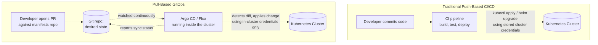
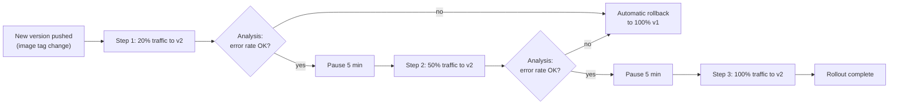

# Chapter 8 — GitOps and Progressive Delivery

## Learning Objectives

By the end of this chapter you will be able to:

- Contrast the traditional push-based CI/CD deployment model with the pull-based GitOps model, and explain the security and auditability difference between them
- Define GitOps precisely: Git as the single source of truth, reconciled continuously by an in-cluster agent
- Compare Argo CD and Flux and choose between them for a given team
- Write a minimal Argo CD `Application` manifest pointing at a Git repository
- Explain configuration drift and how a GitOps agent detects and (optionally) corrects it
- Explain how Argo Rollouts extends progressive delivery (canary/blue-green) beyond what a plain Kubernetes `Deployment` supports, including automated, metrics-driven rollback

---

## Prerequisites for This Chapter

- **CI/CD Pipelines (Topic 5), especially deployment strategies (Chapter 7)** — required. This chapter assumes you know what rolling, blue/green, and canary deployments are conceptually; here we cover the Kubernetes-native tooling that automates them.
- **Custom Resources and Operators (this course, Chapter 5)** — required. Argo CD's `Application` object and Argo Rollouts' `Rollout` object are both Custom Resources reconciled by controllers, exactly as described in Chapter 5 — this chapter treats that pattern as already understood.
- **Deployments and rolling updates (Kubernetes Basics, Chapter 5)** — required, as the baseline that Argo Rollouts replaces for progressive delivery use cases.

---

## 8.1 The Traditional Push Model, and Its Hidden Problem

Recall the CI/CD pipelines from Topic 5: a commit triggers a pipeline (GitHub Actions, Jenkins, GitLab CI) that builds an image, runs tests, and then — in the final "deploy" step — runs something like:

```bash
kubectl apply -f k8s/deployment.yaml
# or
helm upgrade myapp ./charts/myapp --set image.tag=$GIT_SHA
```

This works, and thousands of teams run production this way successfully. But look closely at what it requires: **the pipeline itself needs credentials to your Kubernetes cluster.** Your CI system — a piece of infrastructure that also runs arbitrary third-party GitHub Actions, arbitrary `npm` package installs, and arbitrary Dockerfile builds — holds a kubeconfig (or an OIDC token) with enough privilege to modify your production cluster. Every pipeline run is an external system reaching *into* the cluster and pushing a change.

This creates two problems that only become painful once you have to answer for them:

- **Security surface.** Compromise the CI system (a leaked secret, a malicious dependency, a misconfigured runner) and you've potentially compromised a path directly into your production cluster. The credential has to exist somewhere outside the cluster, which is inherently a larger attack surface than a credential that never leaves it.
- **Auditability.** After an incident, "what is actually running in production, and why?" should be an easy question. In the push model, the honest answer is "whatever the last pipeline run happened to apply" — which might have used a manually triggered rerun, a hotfix pushed from someone's laptop with `kubectl apply` directly, or a Helm value overridden ad hoc in a CI variable that isn't tracked anywhere. The cluster's actual state and the record of *why* it's in that state can drift apart, and reconstructing history after the fact is often genuinely difficult.

GitOps is a direct response to both of these problems.

---

## 8.2 GitOps: Definition and Principles

**GitOps means: the desired state of your cluster is declared entirely as files in a Git repository, and an agent running *inside* the cluster continuously watches that repository and reconciles the live cluster to match it.**

Notice the inversion compared to section 8.1: instead of an external pipeline *pushing* changes into the cluster, an in-cluster agent *pulls* the desired state from Git and applies it itself. This single inversion produces both benefits at once:

- **More secure.** No external CI system needs cluster-modifying credentials at all. The GitOps agent lives inside the cluster it manages and only needs **read** access to a Git repository — a far smaller, safer permission to grant to something outside the cluster's trust boundary. There is no long-lived cluster-admin kubeconfig sitting in a CI system's secrets store waiting to be exfiltrated.
- **More auditable.** Every change to the cluster's desired state is, by construction, a Git commit. That gives you full history, `git blame`, and (if your repository requires it) mandatory pull-request review *before* a change can take effect — because the agent only ever applies what's actually merged. "What is running in production and why" becomes "read the Git log," which is a dramatically better place to be during an incident review than trying to piece together CI run history across multiple systems.

The two dominant GitOps agents are **Argo CD** and **Flux**, covered in section 8.4. Both implement the identical underlying idea: watch a Git repo, diff it against the live cluster, and reconcile — this is the exact same observe → diff → act reconciliation loop from Topic 8, Chapter 2's controller pattern, just aimed at an entire Git repository's worth of manifests instead of a single object's replica count.



The key visual difference: in the push model, an arrow reaches *from outside the cluster into it*, carrying credentials. In the pull model, no external system ever touches the cluster directly — the agent that touches the cluster already lives inside it, and the only thing crossing the boundary from outside is a **read-only** watch on a Git repository.

---

## 8.3 Argo CD vs. Flux

Both are CNCF graduated projects, both are proven in large-scale production, and either is a legitimate choice — the decision mostly comes down to how much visibility and UI-driven workflow you want versus a leaner, more API-driven footprint.

| | Argo CD | Flux |
|---|---|---|
| Interface | Full web UI showing sync status, live diffs, resource trees, and rollback history | Primarily CLI/API-driven; visibility typically added via separate tooling (e.g., Weave GitOps UI) |
| Visibility | Very high out of the box — this is the most commonly cited reason teams choose it | Lower by default, but tightly scriptable/automatable |
| Architecture | A set of controllers plus an API server and UI, centered on the `Application` CRD | A toolkit of smaller, focused controllers (source, kustomize, helm, notification controllers) that compose together |
| Multi-tenancy / multiple teams | `AppProject` CRD gives strong built-in multi-team boundaries | Achieved through Kubernetes-native RBAC and repository structure rather than a dedicated project object |
| Progressive delivery integration | Pairs naturally with **Argo Rollouts** (same project family, section 8.5) | Pairs with Flagger for canary/progressive delivery |
| Typical adoption driver | Teams that want strong visibility and a UI-centric operational workflow | Teams that want a lightweight, composable, more "Unix philosophy" toolkit tightly integrated with existing GitOps tooling |

Neither is objectively superior — pick Argo CD when the visual sync/diff UI is a priority for your team's workflow (it is the more commonly adopted default for that reason); pick Flux when you prefer a smaller set of composable controllers and are comfortable with a more API/CLI-driven operational style.

### A Minimal Argo CD `Application`

Recall from Chapter 5 that Custom Resources let you extend the Kubernetes API with your own object types, reconciled by a controller you install. Argo CD's own core object — the `Application` — is exactly that: a CRD, reconciled by the Argo CD controller running in your cluster.

```yaml
apiVersion: argoproj.io/v1alpha1
kind: Application
metadata:
  name: orders-service
  namespace: argocd
spec:
  project: default
  source:
    repoURL: https://github.com/example-org/k8s-manifests.git
    targetRevision: main
    path: apps/orders-service
  destination:
    server: https://kubernetes.default.svc
    namespace: orders
  syncPolicy:
    automated:
      prune: true       # remove cluster resources no longer present in Git
      selfHeal: true     # revert manual cluster changes back to match Git
```

Apply this once (`kubectl apply -f application.yaml`), and from that point forward Argo CD continuously watches `apps/orders-service` in the `main` branch of that repository and reconciles the `orders` namespace to match it — no further `kubectl apply` from any pipeline is ever needed for that application again.

---

## 8.4 The Full Workflow, End to End

Walking through one complete change:

1. A developer opens a pull request against the Git-tracked manifests repository, changing the `orders-service` Deployment's image tag from `v1.4` to `v1.5`.
2. A teammate reviews and approves the PR (this review step is itself now a mandatory, auditable gate on production changes — something the push model rarely enforces this cleanly). The PR is merged to `main`.
3. Argo CD's controller, on its next reconciliation pass (typically within seconds, since it also supports Git webhooks for near-instant triggering), notices the live cluster's Deployment spec no longer matches what's now in Git.
4. Argo CD applies the change to the cluster, exactly as `kubectl apply` would — except no human and no external CI system directly touched the cluster to do it.
5. The Argo CD UI (or `argocd app get orders-service` via CLI) shows the application's status: **`Synced`** (cluster state matches Git) and **`Healthy`** (the resources are reporting healthy, e.g. the Deployment's Pods are `Running` and passing readiness probes).

### Drift Detection and Correction

Now suppose, during an incident at 2 AM, an engineer runs `kubectl edit deployment orders-service` directly and bumps `replicas` from 3 to 10 to handle a traffic spike — bypassing Git entirely.

Argo CD notices this on its next reconciliation: the live cluster state no longer matches Git. Depending on configuration:

- With `selfHeal: false` (the default unless you opt in), Argo CD flags the application as **`OutOfSync`** in the UI/CLI, surfacing exactly what changed — but does *not* revert it automatically, leaving the manual fix in place until someone reconciles the difference (usually by then updating Git to reflect the new desired value, restoring the "Git is truth" property after the fact).
- With `selfHeal: true` (as set in the example above), Argo CD automatically reverts the manual edit, scaling `replicas` back down to whatever Git says — treating the manual `kubectl edit` as unwanted drift to be corrected, not a legitimate change.

This is a genuinely powerful anti-configuration-drift property: it becomes structurally difficult for a cluster's real state to silently diverge from its documented, reviewed desired state over time, which is a common and hard-to-detect problem in push-based, manually-operated clusters. The trade-off is real too — `selfHeal: true` means genuine emergency `kubectl` fixes get silently undone unless someone also fixes Git, so many teams enable it for most applications but consciously reason about it for services where manual emergency intervention needs to "stick" until Git is updated.

---

## 8.5 Progressive Delivery with Argo Rollouts

Topic 8, Chapter 5 introduced canary and blue-green deployments conceptually and noted that a plain Kubernetes `Deployment` only natively supports rolling updates — achieving true canary or blue-green behavior requires extra tooling. **Argo Rollouts** is that tooling, and it fits naturally into a GitOps workflow because, like Argo CD's `Application`, it is a Kubernetes-native CRD (the `Rollout` object) reconciled by a controller — the same CRD/controller pattern from Chapter 5, applied to deployment strategy itself.

A `Rollout` is a drop-in replacement for a `Deployment` — same Pod template, same selector — but with an explicit `strategy` describing *how* to roll out a change step by step, instead of the fixed rolling-update behavior a `Deployment` gives you.

**Canary, precisely defined:** release the new version to a small percentage of real traffic first, watch it, then progressively increase that percentage — limiting the blast radius of a bad release to a fraction of users instead of all of them at once.

**Blue-green, precisely defined:** deploy the new version fully, in parallel with the old version, verify it while it receives no (or only test) traffic, then cut over all traffic to it at once — trading the gradual-exposure property of canary for an instantaneous, fully-tested switch with an equally instantaneous rollback path (just switch back).

```yaml
apiVersion: argoproj.io/v1alpha1
kind: Rollout
metadata:
  name: checkout-service
spec:
  replicas: 10
  strategy:
    canary:
      steps:
        - setWeight: 20
        - pause: { duration: 5m }
        - setWeight: 50
        - pause: { duration: 5m }
        - setWeight: 100
      analysis:
        templates:
          - templateName: success-rate
        startingStep: 1
        args:
          - name: service-name
            value: checkout-service
  selector:
    matchLabels: { app: checkout-service }
  template:
    metadata:
      labels: { app: checkout-service }
    spec:
      containers:
        - name: checkout-service
          image: registry.example.com/checkout-service:v1.5
```

The `steps` list is the entire canary plan, declared once: shift 20% of traffic to the new version, pause five minutes, shift to 50%, pause again, then complete at 100%. The `analysis` block is what elevates this above a manually-scripted traffic shift: at each step, Argo Rollouts can automatically query a metrics backend — most commonly Prometheus — for a defined `AnalysisTemplate` (for example, "error rate over the last 5 minutes for `checkout-service` must stay under 1%"). If the metric fails the defined threshold during any step, **Argo Rollouts automatically halts and rolls back the canary**, no human intervention required. This directly ties into the observability discipline Topic 10 covers in depth — automated analysis is only as good as the metrics you're able to query, and a canary with no real error-rate/latency signal to check is really just a slower, riskier rolling update.



Under the hood, Argo Rollouts achieves the weighted traffic split either by manipulating ReplicaSet Pod counts proportionally (works with no additional infrastructure) or, for more precise and instantaneous splits, by driving a service mesh's traffic-splitting API directly — including the exact Istio `VirtualService` weight mechanism from Chapter 7. This is the concrete link between the two chapters: a mesh gives you the *mechanism* for weighted traffic splitting; Argo Rollouts gives you the *automated, metrics-driven process* that decides when and how far to shift that weight.

---

## 8.6 Repository Structure: App-of-Apps and Monorepo vs. Polyrepo

Once you have more than a handful of `Application` objects, how you organize the Git repositories behind them starts to matter as much as the tooling itself.

**Monorepo vs. polyrepo for manifests.** Some organizations keep every team's Kubernetes manifests in a single repository, with clear per-team directories (`apps/orders-service/`, `apps/payments-service/`); others give each team, or each service, its own dedicated manifests repository. A single manifests repo makes cluster-wide changes (a shared label, a security policy update) easy to apply and review in one PR, but requires careful `CODEOWNERS`-style access control so one team can't accidentally (or maliciously) modify another team's manifests. Separate repos per team give cleaner ownership and blast-radius boundaries at the cost of making cluster-wide changes require many coordinated PRs. Neither is universally correct — this is a genuine trade-off organizations make based on team count and trust boundaries.

**The "app of apps" pattern.** As the number of `Application` objects grows into the dozens or hundreds, managing each one with a separate `kubectl apply` becomes its own operational burden — the exact kind of problem GitOps was meant to solve in the first place, now recurring one level up. Argo CD's answer is the **app of apps** pattern: a single "root" `Application` whose entire purpose is to point at a directory of *other* `Application` manifests, so that adding a new service to the platform means adding one new file to Git, and the root Application's own sync process creates the child Application for you.

```yaml
apiVersion: argoproj.io/v1alpha1
kind: Application
metadata:
  name: root-app
  namespace: argocd
spec:
  project: default
  source:
    repoURL: https://github.com/example-org/k8s-manifests.git
    targetRevision: main
    path: argocd-apps           # a directory full of other Application YAMLs
  destination:
    server: https://kubernetes.default.svc
    namespace: argocd
  syncPolicy:
    automated:
      prune: true
      selfHeal: true
```

This is the same CRD/controller reconciliation idea recursively applied — Argo CD reconciling `Application` objects that themselves describe other `Application` objects — and it's a common pattern once a platform team is managing GitOps for many application teams rather than just one service.

---

## 8.7 Blue-Green with Argo Rollouts

Section 8.5 walked through Argo Rollouts' canary strategy in detail; the same `Rollout` CRD also supports blue-green directly, worth seeing concretely since it's a meaningfully different mechanism, not just "canary with bigger steps."

```yaml
apiVersion: argoproj.io/v1alpha1
kind: Rollout
metadata:
  name: checkout-service
spec:
  replicas: 10
  strategy:
    blueGreen:
      activeService: checkout-service-active     # receives live production traffic
      previewService: checkout-service-preview   # points only at the new version, for testing
      autoPromotionEnabled: false                # require a manual promotion step
  selector:
    matchLabels: { app: checkout-service }
  template:
    metadata:
      labels: { app: checkout-service }
    spec:
      containers:
        - name: checkout-service
          image: registry.example.com/checkout-service:v1.5
```

With `autoPromotionEnabled: false`, Argo Rollouts deploys the new version fully (all 10 replicas) but routes it *only* to `checkout-service-preview` — a separate Service you (or automated smoke tests) can query directly to validate the new version under real conditions, entirely isolated from `checkout-service-active`, which continues serving all live traffic from the old version. Once satisfied, a human (or an automated check) promotes the rollout — `kubectl argo rollouts promote checkout-service` — and Argo Rollouts atomically switches `checkout-service-active` to point at the new version. If anything goes wrong post-promotion, `kubectl argo rollouts undo checkout-service` switches `checkout-service-active` straight back to the previous version, since Argo Rollouts keeps the old ReplicaSet running (not scaled to zero) for exactly this instant-rollback window.

Notice the shape of the trade-off versus canary, made concrete: blue-green gives you a fully-tested new version and an instantaneous, all-or-nothing cutover with an equally instantaneous rollback; canary gives you gradual, automatically-monitored exposure with a smaller blast radius at every step, at the cost of a slower rollout. Argo Rollouts lets a team choose per-service which trade-off fits — a highly variable, high-risk service might prefer canary's gradual exposure and automated analysis, while a simpler service where "fully test then flip" is easier to reason about might prefer blue-green.

---

## 8.8 Real-World Scenario

A platform team at a mid-size company starts in a familiar place: engineers deploy by running `kubectl apply` or `helm upgrade` directly from their laptops, using a shared kubeconfig with cluster-admin access, whenever they're ready to ship. There is no single record of what was deployed when, no required review step before a production change, and post-incident reviews routinely stall on "wait, who deployed what, and when, exactly?"

They migrate to a full GitOps workflow: a dedicated `k8s-manifests` repository becomes the single source of truth, Argo CD is installed in-cluster and configured with an `Application` per service (each with `selfHeal: true`), and Argo Rollouts replaces plain `Deployment` objects for their most customer-facing services.

**What changes for a developer's day-to-day:** shipping a change no longer means having cluster credentials at all. A developer opens a pull request against `k8s-manifests` changing an image tag, a teammate reviews it, and merging is the entire "deploy" action — Argo CD takes it from there. For the services running Argo Rollouts, the developer watches the canary progress through its steps in the Argo CD UI rather than babysitting a deploy script.

**What new safety properties the team gets:** a complete, reviewable audit trail of every production change as Git history; automatic correction of configuration drift when someone forgets and runs an ad hoc `kubectl edit` during an incident; and canary rollouts that automatically abort and roll back the moment error-rate metrics degrade, instead of relying on an engineer noticing a dashboard spike at 2 AM. No engineer holds a production-scoped kubeconfig on their laptop anymore — the only credential that touches the cluster directly lives inside Argo CD itself, with read-only access to Git as its only external dependency.

---

## Best Practices

- Keep application manifests in a repository separate from application source code — this cleanly separates "what changed in the app" review from "what changed in the deployed environment" review, and lets the GitOps agent watch a smaller, purpose-built repo
- Enable `selfHeal: true` for most services to get real anti-drift protection, but discuss explicitly (per service) whether emergency manual changes should "stick" until Git is updated, or be auto-reverted
- Require pull-request review on the manifests repository just as strictly as on application code — this is now your production change-control gate
- Don't hand-write canary steps you can't reason about — pair every `analysis` step with a metric you trust and have already validated is meaningful (a flaky or noisy metric will trigger false-positive rollbacks)
- Start progressive delivery with generous pause durations and conservative early-step weights (e.g., 5–10%) until you trust your analysis metrics, then tighten the process over time

---

## Common Mistakes

- Granting a CI pipeline long-lived, broad cluster-admin credentials "temporarily" and never revisiting it — the exact push-model risk GitOps exists to remove
- Enabling automated sync without `selfHeal` and then being surprised the cluster stays `OutOfSync` indefinitely after a manual `kubectl edit`, because nothing is actually correcting the drift
- Writing an Argo Rollouts `analysis` step against a metric that's too noisy or too slow to be meaningful, causing frequent false-positive automatic rollbacks
- Treating Argo CD/Flux installation itself as "done" without also migrating the team's actual habits — engineers who still reflexively run `kubectl apply` manually undermine the entire audit-trail benefit
- Mixing manifests for many unrelated services into one giant repository/`Application` with no clear ownership boundaries, making review and blast-radius reasoning harder as the org grows

*(The full catalog of common Kubernetes mistakes, with fixes, is covered in Chapter 15.)*

---

## Summary

| Topic | Key Point |
|---|---|
| Push-based CI/CD | External pipeline holds cluster credentials and runs `kubectl apply`/`helm upgrade` directly — larger attack surface, harder to audit after the fact |
| GitOps definition | Git is the single source of truth; an in-cluster agent continuously reconciles the live cluster to match it — a pull-based model |
| Security benefit | No external system needs cluster-modifying credentials; the agent only needs read access to Git |
| Auditability benefit | Every cluster change is a Git commit with history, blame, and (optionally) mandatory PR review |
| Argo CD vs. Flux | Argo CD = strong UI/visibility, `AppProject` multi-tenancy; Flux = lightweight, composable, API-driven toolkit |
| Drift detection | `OutOfSync` flags manual changes; `selfHeal: true` automatically reverts them back to match Git |
| Argo Rollouts | A `Rollout` CRD replacing `Deployment` for canary/blue-green, with automated, metrics-driven analysis and rollback at each step |
| The mesh connection | A service mesh (Chapter 7) provides the traffic-splitting mechanism; Argo Rollouts provides the automated process driving it |

---

## Knowledge Check

1. In the push-based CI/CD model, what specific credential risk exists that the pull-based GitOps model removes?
2. Define GitOps in one or two sentences, using the words "Git," "source of truth," and "reconcile."
3. What does it mean for an Argo CD `Application` to be `OutOfSync`, and what two different things can happen next depending on `syncPolicy.automated.selfHeal`?
4. Why is Argo CD's `Application` object itself an example of the CRD/controller pattern from Chapter 5, rather than a built-in Kubernetes type?
5. In the `Rollout` example in section 8.5, what happens if the `success-rate` analysis fails during the 50%-traffic step, and what infrastructure (from Chapter 7) might Argo Rollouts use to actually implement the weighted split?
6. A developer manually runs `kubectl scale deployment orders-service --replicas=10` on a cluster managed by Argo CD with `selfHeal: true`. What happens on Argo CD's next reconciliation pass, and why?
7. What problem does the "app of apps" pattern solve, and why is it described as the same reconciliation idea applied recursively?
8. In the blue-green `Rollout` example in section 8.7, what is the difference between `checkout-service-preview` and `checkout-service-active`, and what does `kubectl argo rollouts promote` actually change?

---

## Hands-On Exercise

**Goal:** Stand up a working GitOps loop with Argo CD on a local `kind` cluster, then layer in an automated canary with Argo Rollouts.

1. Create a `kind` cluster and install Argo CD (`kubectl create namespace argocd && kubectl apply -n argocd -f https://raw.githubusercontent.com/argoproj/argo-cd/stable/manifests/install.yaml`). Port-forward the Argo CD API server/UI and log in.
2. Create a small public (or local) Git repository containing a single Deployment and Service manifest for a simple app. Create an `Application` object (as in section 8.3) pointing Argo CD at that repository and path, with `syncPolicy.automated.selfHeal: true`.
3. Confirm the app deploys automatically and shows `Synced`/`Healthy`. Then run `kubectl edit deployment` directly against the deployed app, changing the replica count, and observe Argo CD detect and revert the drift within its next reconciliation interval.
4. Change the image tag in your Git repository, commit, and push. Confirm Argo CD picks up the change and updates the running Deployment with no manual `kubectl` command on your part.
5. Install Argo Rollouts (`kubectl apply -n argo-rollouts -f https://github.com/argoproj/argo-rollouts/releases/latest/download/install.yaml`) and convert your Deployment into a `Rollout` with a simple canary `steps` list (no live analysis needed for this exercise — just `setWeight`/`pause` steps). Trigger a new rollout by changing the image tag again, and use `kubectl argo rollouts get rollout <name> --watch` to observe it progress step by step.

---

## Further Reading

- [OpenGitOps — Principles](https://opengitops.dev/)
- [Argo CD Documentation](https://argo-cd.readthedocs.io/)
- [Flux Documentation](https://fluxcd.io/flux/)
- [Argo Rollouts Documentation](https://argo-rollouts.readthedocs.io/)
- [Argo Rollouts — Analysis and Progressive Delivery](https://argo-rollouts.readthedocs.io/en/stable/features/analysis/)

---

<div style="display:flex;justify-content:space-between;align-items:center;">
  <a href="./07-service-mesh.md">← Previous: Service Mesh</a>
  <a href="./00-index.md">🏠 Index</a>
  <a href="./09-cluster-administration-and-upgrades.md">Next: Cluster Administration and Upgrades →</a>
</div>
