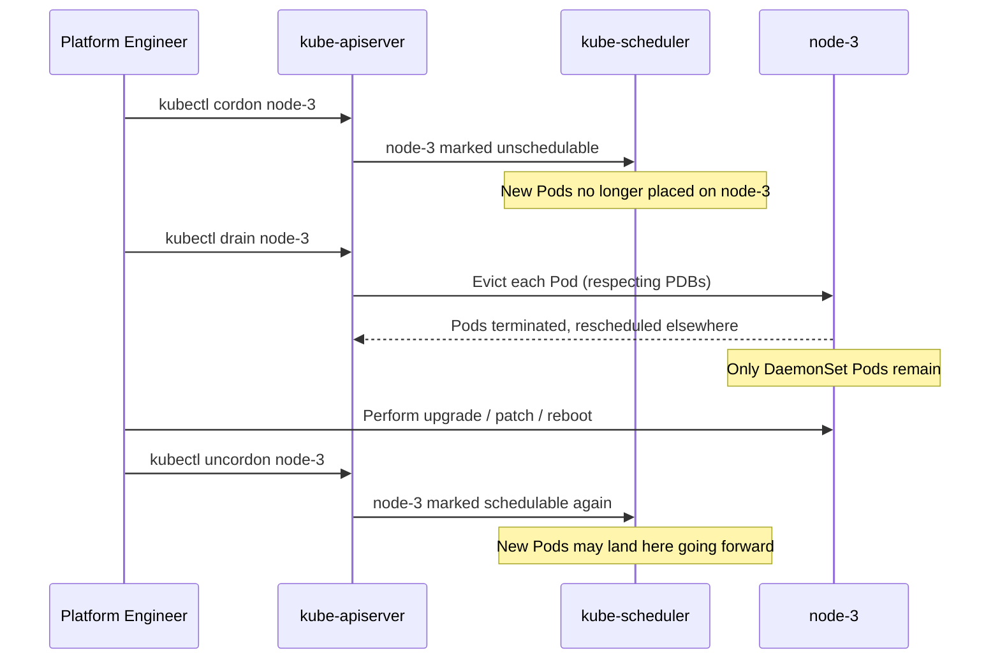
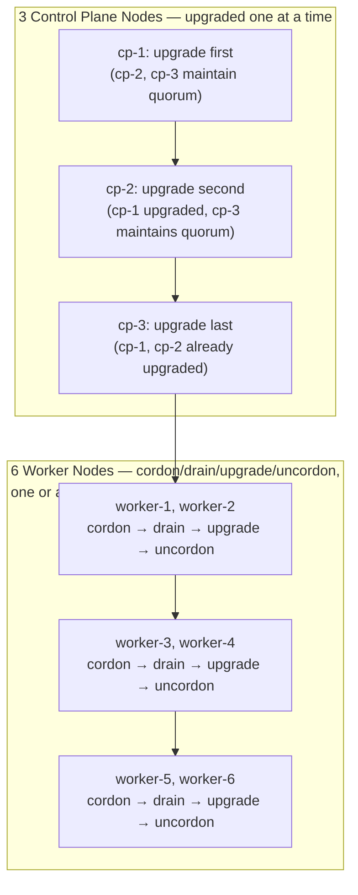

# Chapter 9 — Cluster Administration and Upgrades

## Learning Objectives

By the end of this chapter you will be able to:

- Articulate the shift in responsibility from "running workloads on a cluster" to "keeping the cluster itself healthy"
- Explain what `kubeadm` automates when bootstrapping or upgrading a self-managed cluster, and what a managed control plane (EKS/GKE/AKS) does instead
- Explain why Kubernetes version skew policy exists and why upgrade order (control plane before nodes) matters
- Perform a safe node maintenance workflow using `cordon`, `drain`, and `uncordon`, and explain how PodDisruptionBudgets interact with draining
- Take and restore an `etcd` snapshot, and explain why untested backups are not real backups
- Describe a safe rolling upgrade strategy across a multi-node control plane and worker fleet

---

## Prerequisites for This Chapter

- **Architecture and Internals (Kubernetes Basics, Chapter 2)** — required. This chapter assumes fluency with the control plane components (`kube-apiserver`, `etcd`, `kube-scheduler`, `kube-controller-manager`), the `kubelet`/`kube-proxy`/container runtime split on worker nodes, and why `etcd` quorum matters — none of that is re-explained here, only built upon.
- **Health probes and PodDisruptionBudgets (Kubernetes Basics, Chapter 10 and Chapter 15's best practices)** — required for understanding how draining interacts with running workloads safely.
- **StatefulSets (Kubernetes Basics, Chapter 12)** — helpful context, since stateful workloads are the ones most sensitive to careless node draining.

---

## 9.1 A Different Kind of Responsibility

Every chapter before this one in the Advanced Kubernetes course — RBAC, admission control, NetworkPolicies, CRDs, multi-tenancy, service mesh, GitOps — has been about controlling and organizing what runs **on top of** a cluster that is already assumed to exist and be healthy. This chapter is about a genuinely different job: **keeping the cluster itself alive, correctly versioned, and recoverable.**

This distinction maps closely to a real organizational boundary. Application teams deploy Deployments, manage their own Namespaces, and consume the cluster as a platform. A **platform or infrastructure team** typically owns the concerns in this chapter: is the control plane healthy, are nodes running a supported and consistent Kubernetes version, is there a tested path back to a working cluster if something catastrophic happens. If you've only ever consumed a cluster someone else built (which is the assumption Topic 8 explicitly made), everything in this chapter will feel like new territory — that's expected and intentional.

---

## 9.2 `kubeadm` and the Managed vs. Self-Hosted Divide

**`kubeadm`** is the standard, Kubernetes-project-maintained tool for bootstrapping and upgrading a self-managed cluster's control plane. It automates the tedious, error-prone, security-sensitive parts of standing up Kubernetes from raw machines:

- Installing and configuring the control plane components (`kube-apiserver`, `kube-scheduler`, `kube-controller-manager`) as static Pods on control plane nodes
- Generating and distributing the full set of TLS certificates the control plane needs internally (API server serving certs, `etcd` peer/client certs, and more) — getting this right by hand is genuinely difficult and a common source of self-hosted cluster problems
- Bootstrapping `etcd` (either stacked on control plane nodes or as an external cluster)
- Producing **join tokens** — short-lived credentials that let a new worker (or control plane) node securely join the cluster with `kubeadm join`

```bash
# On the first control plane node
kubeadm init --control-plane-endpoint "cluster-lb.example.com:6443" --upload-certs

# On subsequent control plane nodes (using the join command kubeadm init prints)
kubeadm join cluster-lb.example.com:6443 --token <token> \
  --discovery-token-ca-cert-hash sha256:<hash> \
  --control-plane --certificate-key <key>

# On worker nodes
kubeadm join cluster-lb.example.com:6443 --token <token> \
  --discovery-token-ca-cert-hash sha256:<hash>
```

**The important practical note:** the majority of engineers working with Kubernetes today never run `kubeadm` at all, because they use a managed control plane — Amazon EKS, Google GKE, or Azure AKS — where the cloud provider runs and upgrades `kube-apiserver`, `etcd`, and the other control plane components for you, entirely out of view. You click (or `terraform apply`) a "control plane version" setting, and the provider handles the equivalent of everything `kubeadm` automates.

So why does this chapter still matter if you'll likely never type `kubeadm init`? Two reasons: first, understanding what `kubeadm` automates is what makes a managed control plane's behavior *legible* instead of magic — when EKS upgrades your control plane, it is doing the conceptual equivalent of what's described here, and knowing that helps you reason about what can and can't go wrong. Second, if you ever do self-host — common in on-premises environments, air-gapped environments, or cost-sensitive infrastructure at scale — every concept in this chapter becomes your direct, hands-on operational responsibility.

---

## 9.3 The Version Skew Policy

Kubernetes is a distributed system made of several independently-versioned components, and they are **not** all required to run the exact same version simultaneously — but they also can't drift arbitrarily far apart. The project defines a formal **version skew policy** governing how far apart components may be.

The intuition, stated simply rather than as exact version numbers (which change across releases and are best looked up live rather than memorized): the API server is the most authoritative component and generally must be at the same or a newer minor version than everything that talks to it. `kube-controller-manager` and `kube-scheduler` must not be newer than the API server they talk to. `kubelet` on any given node must not be newer than the API server, and is allowed to lag behind by a small, bounded number of minor versions — this is what makes rolling node upgrades practical, since it means you don't have to upgrade every node in the same instant the control plane is upgraded.

**Why this matters practically:** if you upgraded worker nodes before the control plane, you could end up with a `kubelet` newer than `kube-apiserver` — a combination the skew policy explicitly disallows, because the API server may not understand API fields or behaviors a newer kubelet expects. This is precisely why upgrade order is not arbitrary:

> **Control plane components are upgraded first, in a defined internal order — `etcd` and `kube-apiserver` before `kube-controller-manager`/`kube-scheduler` — and only after the entire control plane is upgraded do you begin upgrading worker nodes.**

Because exact skew numbers change across Kubernetes releases, treat [kubernetes.io's official skew policy page](https://kubernetes.io/releases/version-skew-policy/) as the authoritative source to check before any real upgrade — this chapter teaches you the *shape* of the rule (why order matters, which direction skew is tolerated) rather than numbers worth memorizing, since they are exactly the kind of detail that goes stale.

---

## 9.4 Safe Node Maintenance: Cordon, Drain, Uncordon

Whether you're upgrading a node's Kubernetes version, patching its OS, or replacing the underlying hardware, you need a safe way to move workloads off a node before touching it — without an outage. Kubernetes gives you exactly three commands for this, always used in the same order.

### Step 1 — `kubectl cordon`: stop new Pods from landing here

```bash
kubectl cordon node-3
```

This marks `node-3` as **unschedulable**. The scheduler will no longer place any *new* Pod on it. Critically, cordon does **not** touch Pods already running there — it only prevents the situation from getting worse while you prepare to drain.

### Step 2 — `kubectl drain`: evict existing Pods gracefully

```bash
kubectl drain node-3 \
  --ignore-daemonsets \
  --delete-emptydir-data \
  --timeout=300s
```

`drain` does the real work: it evicts every Pod currently running on `node-3` (using the Eviction API, which respects graceful termination and, critically, PodDisruptionBudgets — see below), one at a time, waiting for each to actually terminate before evicting the next, so workloads controlled by a Deployment/ReplicaSet get rescheduled onto other nodes with minimal disruption.

Two flags matter enough to call out explicitly:

- **`--ignore-daemonsets`** — DaemonSet-managed Pods (Topic 8, Chapter 12) are intentionally tied to every node by design (a log shipper, a CNI agent, a node-monitoring agent) and are not meant to be evicted and rescheduled elsewhere — there's nowhere else for them to usefully go, and the DaemonSet controller will simply recreate them on this same node the moment it's schedulable again anyway. Without this flag, `drain` refuses to proceed at all if DaemonSet Pods are present.
- **`--delete-emptydir-data`** — Pods using an `emptyDir` volume (Topic 8, Chapter 7) store data that lives only on that node and is lost when the Pod is evicted. `drain` refuses to evict such Pods by default, as a safety check forcing you to consciously acknowledge that data loss before proceeding.

### Why PodDisruptionBudgets matter here

Recall PodDisruptionBudgets (PDBs) from Topic 8's best-practices coverage: a PDB declares the minimum number (or percentage) of Pods from a given workload that must remain available during *voluntary* disruptions — and node draining is precisely a voluntary disruption. If a critical service is deployed with a **single replica and no PDB**, draining the node it happens to be running on evicts that one and only Pod immediately — a real, direct outage, not a theoretical risk. If that same service has `replicas: 3` and a PDB requiring at least 2 available, `drain` will evict Pods one at a time, always keeping at least 2 of the 3 running throughout, and will actually **block and wait** rather than violate the budget if evicting would drop availability below the configured minimum. This is the single most concrete, practical reason PDBs matter: they are what makes `drain` a safe, non-outage-causing operation instead of a gamble.

### Step 3 — perform the maintenance

With the node fully drained (no non-DaemonSet Pods remaining), perform whatever maintenance is needed: upgrade the `kubelet`/`kube-proxy`/container runtime versions, apply OS patches, reboot, or replace the node entirely.

### Step 4 — `kubectl uncordon`: bring it back

```bash
kubectl uncordon node-3
```

This marks the node schedulable again. It does **not** automatically move any Pods back onto it — the scheduler will simply consider it eligible for new Pods going forward, exactly like any other healthy node.



---

## 9.5 etcd Backup and Restore

Recall from Topic 8, Chapter 2: `etcd` is the **single source of truth** for the entire cluster's state — every Pod spec, Secret, ConfigMap, Node status, and RBAC rule lives there and nowhere else. Losing `etcd` without a backup does not mean "some inconvenience" — it means losing the complete configuration of everything running in your cluster, with no way to reconstruct it except by hand from whatever documentation, GitOps repositories (Chapter 8), or memory your team has.

### Taking a snapshot

```bash
ETCDCTL_API=3 etcdctl snapshot save /backup/etcd-snapshot-$(date +%Y%m%d%H%M).db \
  --endpoints=https://127.0.0.1:2379 \
  --cacert=/etc/kubernetes/pki/etcd/ca.crt \
  --cert=/etc/kubernetes/pki/etcd/server.crt \
  --key=/etc/kubernetes/pki/etcd/server.key
```

This produces a single point-in-time snapshot file containing the entire `etcd` keyspace — every Kubernetes object in the cluster, serialized.

### Restoring from a snapshot

```bash
ETCDCTL_API=3 etcdctl snapshot restore /backup/etcd-snapshot-202607010200.db \
  --data-dir=/var/lib/etcd-restored
```

Restore writes a fresh `etcd` data directory from the snapshot. In practice, restoring into a running cluster is an involved procedure — it typically means stopping the API server, pointing `etcd` at the newly restored data directory (often on each control plane node if `etcd` is clustered), and restarting the control plane — the exact mechanics depend on your topology, which is exactly why this needs to be a **rehearsed** procedure, not one you improvise for the first time during an actual outage.

### Automate it, and — just as important — test it

Taking a backup once and forgetting about it provides a false sense of safety. Two disciplines matter equally:

- **Automate the snapshot** on a schedule (a `CronJob` running `etcdctl snapshot save` against a healthy `etcd` member, shipping the resulting file to durable off-cluster storage such as object storage) so backups exist continuously, not just when someone remembers.
- **Regularly test the restore path** in a non-production environment. An untested backup is, functionally, not a backup — corrupted snapshots, missing certificates needed to run `etcdctl` against a given cluster, or an out-of-date runbook are all things you want to discover during a scheduled drill, not during a real incident at 2 AM.

**Managed Kubernetes offerings handle this for you.** EKS, GKE, and AKS all take responsibility for `etcd` backup and control-plane recovery as part of the managed control plane — this is one of the strongest concrete reasons organizations choose managed control planes over self-hosting: `etcd` backup/restore is genuinely tricky operational work with a very high cost of failure, and offloading it to a cloud provider's SRE team is a reasonable trade for most organizations. If you self-host (via `kubeadm` or otherwise), this operational ownership does not exist unless you build it yourself — there is no default safety net.

---

## 9.6 The Shared Responsibility Model on Managed Kubernetes

Section 9.2 introduced the idea that managed offerings (EKS/GKE/AKS) run the control plane for you. It's worth being precise about exactly where that boundary sits, because "managed Kubernetes" does not mean "someone else operates everything."

| Responsibility | Self-hosted (`kubeadm`) | Managed (EKS/GKE/AKS) |
|---|---|---|
| Control plane components (`kube-apiserver`, `kube-scheduler`, `kube-controller-manager`) | You install, upgrade, and monitor them | Cloud provider operates and upgrades them |
| `etcd` — running, scaling, backing up | You own this entirely | Cloud provider owns this entirely (you generally cannot even access `etcd` directly) |
| Control plane version upgrades | You run `kubeadm upgrade` yourself, in the order from section 9.3 | You trigger the upgrade (console/API/Terraform) but the provider performs it |
| Worker node OS patching and `kubelet` upgrades | You own this fully, including the cordon/drain workflow from section 9.4 | **Still your responsibility** — even on EKS/GKE/AKS, worker nodes are your VMs (or managed node groups you still configure), and you still cordon/drain/upgrade/uncordon them, or configure a managed node group's auto-upgrade behavior |
| Application-level backup (databases, PVs) | Your responsibility | Your responsibility — no cloud control-plane guarantee covers your application's stateful data (covered fully in Chapter 10) |
| RBAC, NetworkPolicies, Pod security | Your responsibility | Your responsibility |

The critical row to internalize is worker nodes: choosing a managed control plane removes the hardest, highest-stakes items (control plane upgrades and `etcd`) from your plate, but it does **not** remove node-level maintenance — you still need to understand and practice the cordon/drain/uncordon workflow from section 9.4 on a managed cluster's worker nodes, whether you do it manually or configure a managed node group to automate it. Many teams adopt managed node groups (EKS Managed Node Groups, GKE node pools with auto-upgrade) specifically to have the cloud provider automate even this remaining piece — but it's important to know that's a deliberate additional feature you're opting into, not something "managed Kubernetes" gives you automatically just by virtue of a managed control plane.

---

## 9.7 Rolling Upgrade Strategy for a Production Cluster

Upgrading a live, multi-node production cluster combines everything above into one disciplined sequence: control plane nodes first (one at a time, preserving `etcd` quorum throughout), then worker nodes (one at a time or in small batches, using cordon/drain/upgrade/uncordon).

**Why one control plane node at a time?** Recall from Topic 8, Chapter 2 that `etcd` requires a quorum (majority) of members to remain available for writes. Upgrading (and briefly restarting) an `etcd`/API server pair on one control plane node at a time means the remaining members always retain quorum — a 3-node control plane can safely lose one member to a rolling upgrade at any moment and still have 2 of 3 available, comfortably above the quorum threshold. Upgrading two control plane nodes simultaneously in a 3-node cluster would risk dropping below quorum and taking the entire control plane's write path down mid-upgrade.



Worker nodes are upgraded only **after** the entire control plane is on the target version, consistent with the skew policy in section 9.3 — a `kubelet` should never end up newer than `kube-apiserver`. Batching workers (a few at a time rather than strictly one-by-one) speeds up a large fleet's upgrade while still keeping enough capacity online at every moment that draining a batch doesn't exhaust available scheduling room for evicted Pods — the right batch size depends on total cluster capacity headroom, which is worth calculating explicitly before a large upgrade rather than guessing.

---

## 9.8 Real-World Scenario: A Minor Version Upgrade Runbook

A platform team needs to upgrade a self-hosted production cluster from Kubernetes 1.28 to 1.29, running 3 control plane nodes and 6 worker nodes, during a scheduled low-traffic maintenance window.

**Step 0 — Preparation (days before).** The team reads the official 1.29 release notes and the version skew policy page for any breaking changes relevant to their workloads. They rehearse the upgrade procedure, including an `etcd` restore drill, in a staging cluster that mirrors production.

**Step 1 — Fresh etcd snapshot, immediately before starting.** As the very first action of the maintenance window itself — not the night before, not "recent enough" — they take a fresh snapshot:

```bash
ETCDCTL_API=3 etcdctl snapshot save /backup/pre-upgrade-1.29-$(date +%Y%m%d%H%M).db \
  --endpoints=https://127.0.0.1:2379 \
  --cacert=/etc/kubernetes/pki/etcd/ca.crt \
  --cert=/etc/kubernetes/pki/etcd/server.crt \
  --key=/etc/kubernetes/pki/etcd/server.key
```

This snapshot is copied off-cluster immediately. It is their safety net: if anything goes catastrophically wrong mid-upgrade, they have a known-good point to restore to, taken at the last moment before any change was made.

**Step 2 — Upgrade control plane nodes, one at a time.** On `cp-1`, they run `kubeadm upgrade plan` to confirm the target version and see the upgrade path, then `kubeadm upgrade apply v1.29.x`, followed by upgrading that node's `kubelet` and `kubectl` packages and restarting the `kubelet`. They confirm `cp-1` reports `Ready` at the new version before touching `cp-2`. They repeat the identical procedure for `cp-2`, then `cp-3` — at every point during this sequence, the remaining un-upgraded control plane nodes keep the API server and `etcd` quorum available, so the cluster continues serving reads and writes throughout.

**Step 3 — Upgrade worker nodes, in small batches.** For each worker node (starting with `worker-1` and `worker-2` as the first batch):

```bash
kubectl cordon worker-1
kubectl drain worker-1 --ignore-daemonsets --delete-emptydir-data --timeout=300s
# upgrade kubeadm, kubelet, kubectl packages on worker-1; restart kubelet
kubectl uncordon worker-1
kubectl get nodes   # confirm worker-1 is Ready at the new version before continuing
```

They confirm each batch is healthy — nodes `Ready`, workloads rescheduled and passing health checks — before moving to the next batch, working through all 6 workers in three batches of two.

**Step 4 — Verification.** After all nodes report the target version (`kubectl get nodes -o wide`), the team runs their standard post-upgrade smoke tests against key services, confirms no PodDisruptionBudget was ever violated during draining (checked via `kubectl get events` during the window), and confirms application error rates and latency are unchanged from pre-upgrade baselines. Only then is the maintenance window closed out and the fresh `etcd` snapshot from Step 1 archived alongside the upgrade record — not deleted, in case a delayed issue surfaces and a restore is needed after all.

---

## Best Practices

- Prefer a managed control plane (EKS/GKE/AKS) unless you have a specific operational reason and dedicated staffing to self-host — it removes the hardest and highest-stakes items in this chapter (control plane upgrades, `etcd` backup/restore) from your team's responsibility
- Always take a fresh `etcd` snapshot immediately before any upgrade or major cluster change, regardless of how recent your last scheduled backup is
- Regularly rehearse `etcd` restore in a non-production environment — an untested backup procedure is not a real safety net
- Always upgrade the control plane fully before touching any worker node, consistent with the version skew policy
- Never drain a node running a single-replica critical service without a PodDisruptionBudget in place first — check for this explicitly before any planned maintenance
- Upgrade worker nodes in small batches with verification between batches, not all at once, so a bad batch is caught before it affects the whole fleet

---

## Common Mistakes

- Draining a node hosting a single-replica service with no PodDisruptionBudget, causing an avoidable outage during routine maintenance
- Upgrading worker nodes before the control plane, violating the version skew policy and risking a `kubelet` newer than the API server
- Taking `etcd` backups on a schedule but never once testing the restore procedure, only to discover a problem with it during a real disaster
- Upgrading all control plane nodes simultaneously "to save time," risking a loss of `etcd` quorum and a full control plane outage
- Assuming `kubectl uncordon` rebalances existing workloads back onto the node — it only makes the node eligible for new scheduling decisions going forward

*(The full catalog of common Kubernetes mistakes, with fixes, is covered in Chapter 15.)*

---

## Summary

| Topic | Key Point |
|---|---|
| The shift | This chapter is about keeping the cluster itself healthy — typically a platform/infra team responsibility, distinct from deploying workloads onto it |
| `kubeadm` | Automates control plane bootstrapping, certificate generation, and node join tokens for self-managed clusters; managed offerings (EKS/GKE/AKS) do this for you |
| Version skew policy | Control plane components and `kubelet` must stay within defined version bounds of each other; upgrade control plane before nodes; check kubernetes.io for current exact rules |
| Node maintenance | `cordon` (stop new Pods) → `drain` (evict existing Pods, respecting PDBs) → maintain → `uncordon` (make schedulable again) |
| PodDisruptionBudgets | Make `drain` safe by guaranteeing a minimum number of replicas stay available during voluntary disruption |
| etcd backup/restore | `etcdctl snapshot save`/`snapshot restore`; must be automated *and* regularly tested; managed control planes handle this for you |
| Shared responsibility | Managed control planes remove control plane and `etcd` ownership from you, but worker node maintenance (cordon/drain/upgrade) remains your job unless you opt into a managed node group's automation |
| Rolling cluster upgrade | Control plane nodes one at a time (preserving quorum), then worker nodes in small batches with cordon/drain/upgrade/uncordon |

---

## Knowledge Check

1. What does `kubeadm` automate when bootstrapping a self-managed control plane, and what happens to that responsibility on a managed offering like EKS?
2. Why must control plane components be upgraded before worker nodes, according to the version skew policy's general shape?
3. Walk through what `kubectl drain` actually does, and explain why `--ignore-daemonsets` is typically required for it to complete.
4. A critical service runs as a single replica with no PodDisruptionBudget. What happens if you drain the node it's running on, and how would a PDB change that outcome?
5. Why is an `etcd` backup that has never been restored in a test environment not really a backup you can rely on?
6. In a 3-control-plane-node cluster, why is it safe to upgrade one control plane node at a time, but unsafe to upgrade two simultaneously?
7. On a managed EKS/GKE/AKS cluster, which specific responsibilities from this chapter still belong to you, even though the cloud provider operates the control plane?

---

## Hands-On Exercise

**Goal:** Practice the cordon/drain/uncordon workflow and take a real `etcd` snapshot on a local `kind` cluster.

1. Create a multi-node `kind` cluster (`kind` supports multiple worker nodes via its config file — configure at least 3 worker nodes). Deploy a Deployment with 3 replicas and a PodDisruptionBudget requiring at least 2 available.
2. Identify which node one of your Pods is running on (`kubectl get pods -o wide`), then `cordon` and `drain` that node. Observe the Pod get rescheduled onto another node, and confirm (`kubectl get pods -o wide` throughout) that at least 2 replicas remained available the entire time, consistent with your PDB.
3. Remove the PodDisruptionBudget, scale the Deployment down to 1 replica, and repeat the drain against the node hosting that single Pod. Observe the difference — you should be able to reason about why this drain now causes a brief service gap.
4. `uncordon` the drained node and confirm it becomes schedulable again with `kubectl get nodes`.
5. `docker exec` into the `kind` control plane container (`docker exec -it <kind-control-plane-container> bash`) and run `etcdctl snapshot save` against the cluster's local `etcd` instance, using the certificates under `/etc/kubernetes/pki/etcd/`. Confirm a snapshot file is produced and inspect its size.

---

## Further Reading

- [kubeadm — Creating a cluster](https://kubernetes.io/docs/setup/production-environment/tools/kubeadm/create-cluster-kubeadm/)
- [Kubernetes Version Skew Policy](https://kubernetes.io/releases/version-skew-policy/)
- [Safely Drain a Node](https://kubernetes.io/docs/tasks/administer-cluster/safely-drain-node/)
- [etcd — Disaster Recovery](https://etcd.io/docs/latest/op-guide/recovery/)
- [kubeadm — Upgrading Clusters](https://kubernetes.io/docs/tasks/administer-cluster/kubeadm/kubeadm-upgrade/)

---

<div style="display:flex;justify-content:space-between;align-items:center;">
  <a href="./08-gitops-and-progressive-delivery.md">← Previous: GitOps and Progressive Delivery</a>
  <a href="./00-index.md">🏠 Index</a>
  <a href="./10-backup-and-disaster-recovery.md">Next: Backup and Disaster Recovery →</a>
</div>
