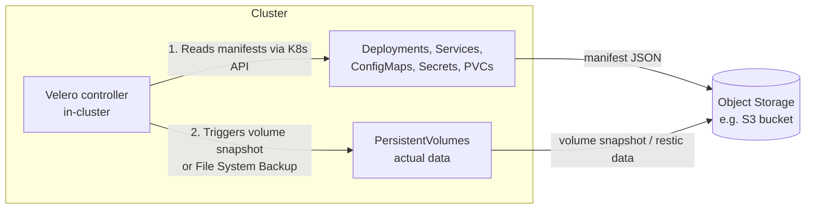
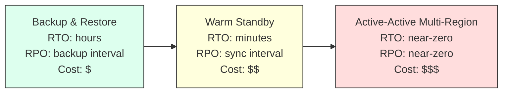

# Chapter 10 — Backup and Disaster Recovery

## Learning Objectives

By the end of this chapter you will be able to:

- Explain why "the Pod will just get rescheduled" is not a backup strategy, and enumerate the failure modes self-healing does not cover
- Distinguish between control-plane state backup (etcd) and application/workload backup, and explain why this chapter focuses on the latter
- Explain what Velero actually backs up — Kubernetes object manifests and PersistentVolume data — and where that data is stored
- Create an on-demand Velero backup, a scheduled backup, and perform a restore
- Define RTO and RPO precisely, and explain why both are business decisions, not purely technical ones
- Compare backup-and-restore, warm standby, and active-active DR patterns on cost, RTO, RPO, and complexity
- Explain why an untested backup should be treated as no backup at all, and design a recurring DR drill

---

## Prerequisites for This Chapter

- **Chapter 9 — Cluster Administration and Upgrades**: this chapter assumes you've seen `etcdctl snapshot save`/`restore` for control-plane state — we reference it briefly but do not repeat it.
- **Topic 8, Chapter 8 — Storage and Persistent Volumes**: PV/PVC, StorageClasses, reclaim policies, and dynamic provisioning are used throughout without re-explanation.
- **Topic 8, Chapter 9 — Namespaces and Resource Management**: backups in this chapter are frequently scoped by namespace.
- **Topic 8, Chapter 12 — StatefulSets, DaemonSets, and Jobs**: familiarity with how a StatefulSet's PVCs are provisioned per-replica is helpful when reasoning about restoring stateful workloads.

---

## 10.1 Two Very Different Backup Problems

"Back up the cluster" is an ambiguous sentence that actually hides two almost entirely unrelated problems:

1. **Control-plane state — `etcd`.** Every object definition in your cluster — every Deployment, Service, Secret, RBAC binding, CRD, everything — lives as a key in `etcd`. Chapter 9 covered taking an `etcdctl snapshot save` of this data and restoring it, because a corrupted or lost `etcd` means the cluster itself no longer knows what it's supposed to be running. This is control-plane disaster recovery.
2. **Application/workload state — the actual data your applications produced.** The rows in your Postgres database, the files a user uploaded to your object-storage-backed service, the Kafka topic's retained messages sitting on a PersistentVolume. None of this lives in `etcd` — `etcd` only stores the *fact that a PVC exists and is bound*, not the bytes on the disk behind it. Restoring `etcd` perfectly gives you back the PVC object, pointing at a volume that may or may not still exist, and even if it exists, may or may not still have the data you need.

This chapter is entirely about problem 2. It is the problem application teams actually experience most often, and it is the one self-healing and even a perfect `etcd` restore do nothing to solve.

```
                    ┌─────────────────────────────┐
                    │      "Back up the cluster"    │
                    └──────────────┬───────────────┘
                                    │
                ┌───────────────────┴───────────────────┐
                ▼                                         ▼
   CONTROL PLANE STATE (etcd)                 APPLICATION / WORKLOAD STATE
   Chapter 9 — etcdctl snapshot               THIS CHAPTER — Velero
   "What objects should exist?"               "What data do those objects hold,
                                                and can I get the manifests back too?"
   - Deployment/Service/Secret definitions     - PersistentVolume contents (DB rows,
   - RBAC bindings, CRDs                         uploaded files, queue data)
   - Cluster-wide configuration                - The manifests themselves, useful for
                                                  restoring into a DIFFERENT cluster
```

---

## 10.2 Why "It'll Just Get Rescheduled" Is Not a Backup Strategy

Topic 8, Chapter 2 taught you that Kubernetes self-heals: if a Pod dies, the Deployment controller creates a replacement; if a Node fails, the scheduler places evicted Pods elsewhere. This is genuinely one of Kubernetes' best features, and it is easy to let it lull you into thinking data loss "just isn't really a Kubernetes problem." It is not, for a specific and important reason: **self-healing protects against process and node failure. It does nothing to protect against data loss or human/configuration error**, which are the failure modes that actually destroy businesses.

Consider what self-healing does *not* protect you from:

- **Accidental deletion.** Someone runs `kubectl delete pvc postgres-data -n production` while cleaning up what they believed was a stale dev claim. The PVC is gone; if its StorageClass has `reclaimPolicy: Delete` (the dynamic-provisioning default, Topic 8 Chapter 8), the underlying cloud disk is deleted with it. A new Pod gets rescheduled instantly onto... nothing. There is no data left to reattach to.
- **Accidental namespace deletion.** `kubectl delete namespace staging` run against the wrong context deletes every object in that namespace — Deployments, Services, ConfigMaps, Secrets, and every PVC in it — in one command, with no confirmation prompt and no undo.
- **Cloud-side disk loss.** A cloud provider's block storage is highly durable but not indestructible — human error on the provider's side, a botched API call from your own automation, or a rare storage-system fault can delete or corrupt a volume that Kubernetes itself never touched.
- **A non-replicated volume in a regional outage.** If your PV lives in a single availability zone and that AZ has an outage that also destroys storage (not just compute), your data is gone regardless of how quickly Kubernetes could reschedule the Pod — there's a new Pod, and an empty disk to give it.
- **Configuration mistakes, not just deletions.** An engineer merges a Helm values change that accidentally drops a ConfigMap key an application depends on at startup. Nothing "fails" in the Kubernetes sense — the object was updated exactly as instructed. But the previous, correct configuration is gone unless you have it backed up (or in Git, per Chapter 8 — GitOps and backups are complementary, not substitutes for each other, since GitOps tracks desired manifests, not runtime data).

The common thread: **self-healing assumes the data is still there and just needs a new Pod pointed at it. Backup and disaster recovery exist for the cases where the data itself is what's gone.**

---

## 10.3 Velero: Backing Up Both Manifests and Data

**Velero** is the de facto standard tool for Kubernetes application backup and disaster recovery. It runs as a Deployment inside your cluster and does two distinct things in a single backup operation, both of which matter:

1. **Backs up Kubernetes object manifests** — Deployments, Services, ConfigMaps, Secrets, PVCs, RBAC objects, CRDs, whatever you scope it to include — as JSON, uploaded to an object storage bucket. This is what lets you restore not just data, but the *entire shape* of a namespace, including into a cluster that has never seen these objects before.
2. **Backs up PersistentVolume data** — the actual bytes — using either your cloud provider's native volume snapshot API (EBS snapshots on AWS, Persistent Disk snapshots on GCP, etc.) or Velero's **File System Backup** (built on the open-source `restic`/`kopia` engines), which works at the filesystem level and is cloud-agnostic — useful for on-prem clusters or storage backends without a native snapshot API.

Both outputs land in an **object storage destination** — an S3 bucket or S3-compatible store (MinIO, GCS via an S3-compatible layer, Azure Blob) — which Velero is configured with on installation.



### Why It Matters That Both Are Captured Together

If you only had cloud disk snapshots (data) without the manifests, restoring means someone has to remember (or reverse-engineer) exactly what Deployments, Services, ConfigMaps, and Secrets pointed at that data, and recreate all of it by hand before the snapshot is even useful. If you only had manifests (e.g., everything checked into Git for GitOps) without the data, you get a perfectly correct empty database. Velero captures both together, versioned as a single named backup, so a restore is one coherent operation: bring back the objects *and* the data they depended on, consistently.

### Creating a Backup

```bash
# Install Velero (one-time setup) with the AWS plugin and an S3 bucket as backend
velero install \
  --provider aws \
  --plugins velero/velero-plugin-for-aws:v1.9.0 \
  --bucket my-velero-backups \
  --backup-location-config region=us-east-1 \
  --snapshot-location-config region=us-east-1 \
  --secret-file ./credentials-velero

# On-demand backup of a single namespace
velero backup create prod-backup-2026-07-01 \
  --include-namespaces production \
  --wait

# Check status
velero backup describe prod-backup-2026-07-01
velero backup logs prod-backup-2026-07-01
```

```
$ velero backup describe prod-backup-2026-07-01
Name:         prod-backup-2026-07-01
Namespaces:
  Included:  production
Phase:        Completed
Total items to be backed up:   142
Items backed up:               142
Persistent Volumes: 3 of 3 snapshotted
```

### Scheduled Backups

Manual, one-off backups are useful for a pre-upgrade safety net, but real disaster recovery needs backups to happen automatically and continuously. Velero's `schedule` object wraps a standard cron expression:

```bash
# Every 6 hours, keep each backup for 30 days
velero schedule create prod-every-6h \
  --schedule="0 */6 * * *" \
  --include-namespaces production \
  --ttl 720h0m0s
```

```yaml
# Equivalent declarative form — a Schedule object, applied like any other manifest
apiVersion: velero.io/v1
kind: Schedule
metadata:
  name: prod-every-6h
  namespace: velero
spec:
  schedule: "0 */6 * * *"
  template:
    includedNamespaces:
      - production
    ttl: 720h0m0s   # 30 days retention
```

### Restoring

```bash
# Restore everything from a specific backup, into the SAME cluster
velero restore create --from-backup prod-backup-2026-07-01

# Restore into a DIFFERENT cluster (e.g., a fresh DR cluster), remapping namespace if needed
velero restore create --from-backup prod-backup-2026-07-01 \
  --namespace-mappings production:production-restored

velero restore describe <restore-name>
velero restore logs <restore-name>
```

Restoring into a namespace or cluster that never previously had these objects is exactly what makes Velero a *disaster recovery* tool and not just a snapshot utility — it's the mechanism behind both the "warm standby" and "backup-and-restore" DR patterns in section 10.5.

---

## 10.4 RTO and RPO: The Business Decisions Behind the Technical Choices

Two acronyms drive every backup and DR design decision, and both are frequently misunderstood as technical settings when they are actually business risk tolerances that technical choices must satisfy.

- **RPO — Recovery Point Objective.** *How much data can we afford to lose, measured in time?* If backups run every 6 hours and disaster strikes right before the next scheduled backup, you lose everything written since the last successful one — up to 6 hours of data. An RPO of "6 hours" is a statement that the business has decided losing up to 6 hours of data, in the worst case, is an acceptable risk.
- **RTO — Recovery Time Objective.** *How long can we afford to be down while we recover?* If a full restore of your production namespace set — provisioning volumes, restoring manifests, waiting for Pods to become Ready, warming caches — takes 45 minutes end to end, that is your RTO. An RTO of "45 minutes" is a statement that the business has decided 45 minutes of downtime, in a real disaster, is tolerable.

```
Timeline of a disaster, showing RPO and RTO:

  Last backup          Disaster           Restore starts        Service restored
  taken                 strikes                                  and verified
     │                     │                      │                      │
─────┼─────────────────────┼──────────────────────┼──────────────────────┼─────▶ time
     │◄──── RPO window ────┤                      │◄──── RTO window ─────┤
     │  (data written here │                      │  (time spent          │
     │   is at risk of     │                      │   recovering)         │
     │   being lost)       │                      │                      │
```

Neither number is chosen by an engineer picking a cron schedule in isolation — both should come from a conversation with the business about what a specific service is worth and what an outage or data-loss event actually costs:

- A marketing content-management system might tolerate an RPO of 24 hours and an RTO of half a day — nightly backups, restored at a relaxed pace, are fine.
- A payments ledger might require an RPO of minutes (near-continuous replication, not periodic snapshots) and an RTO of single-digit minutes — which pushes the architecture toward active-active multi-region (section 10.5), not periodic Velero backups at all.

Once RTO/RPO targets are set, they *drive* the technical decisions: your backup frequency is chosen to satisfy the RPO (a 6-hour RPO target implies backups need to run at least every 6 hours), and your restore automation, rehearsal frequency, and DR architecture are chosen to satisfy the RTO (a 5-minute RTO target rules out "someone manually runs `velero restore create` and waits" as a strategy entirely).

---

## 10.5 Disaster Recovery Patterns

Given a set of RTO/RPO targets, there are three broad architectural patterns for actually meeting them, trading cost and complexity for speed of recovery.

| Pattern | How it works | Typical RTO | Typical RPO | Cost | Complexity |
|---|---|---|---|---|---|
| **Backup-and-restore** | No standby infrastructure at all. On disaster, provision a new cluster (or use a cold spare) and `velero restore` into it from the last backup. | Hours (cluster provisioning + restore + verification) | Matches backup interval (e.g., 6 hours) | Lowest — pay only for backup storage | Lowest to operate day-to-day, but the restore itself is the riskiest, least-rehearsed moment |
| **Warm standby** | A second, smaller cluster is kept running continuously in another region/account, receiving periodic data sync or backup restores, but scaled down (fewer replicas, smaller nodes). On disaster, it's scaled up to full capacity and traffic is cut over. | Minutes to tens of minutes (mostly just scale-up + cutover time) | Depends on sync frequency — can be much tighter than backup-and-restore if using continuous replication rather than periodic backups | Medium — paying for a always-on but under-provisioned second environment | Medium — requires ongoing sync tooling and periodic validation that the standby is actually usable |
| **Active-active multi-region** | Multiple full production clusters run simultaneously across regions, all serving live traffic, with data replicated continuously between them. Losing one region means traffic simply routes to the others. | Seconds to low minutes (often near-zero from the user's perspective) | Near-zero — data is continuously replicated, not periodically snapshotted | Highest — full production capacity duplicated N times, plus cross-region replication and consistency engineering | Highest — this is genuinely hard distributed-systems territory (conflict resolution, data consistency across regions); foreshadows Chapter 11's multi-cluster architecture content |

The right choice is whichever pattern is the *cheapest one that still meets the RTO/RPO the business actually needs* — reaching for active-active because it sounds more impressive, for a service whose real RTO/RPO tolerance would have been comfortably met by scheduled Velero backups, is a common and expensive over-engineering mistake.



---

## 10.6 Testing DR: An Untested Backup Is Not a Backup

This is worth stating as bluntly as possible: **a backup you have never restored is a hypothesis, not a backup.** Backups fail silently in ways that are invisible until the moment you actually need them — a Secret excluded by a scoping rule nobody remembered was there, a StorageClass on the DR cluster with a different name than the one referenced in the backed-up PVC manifests, expired cloud credentials on the backup job that's been "succeeding" against a bucket it can no longer actually write new objects to, or a restore runbook that exists only in one engineer's head.

A real DR plan includes scheduled **"game day" restore drills**: deliberately, on a calendar (not "whenever someone gets around to it"), restoring a full backup into a scratch cluster and verifying the application actually comes up correctly — not just that the `velero restore` command exits with success, but that the application serves traffic, the data is present and consistent, and the team practiced the actual runbook they'd use in a real incident, including the parts that are awkward or slow. The first drill is usually the most valuable one precisely because it's the one most likely to surface a gap.

---

## 10.7 Real-World Scenario: Quarterly DR Drills at a SaaS Company

A SaaS company runs Velero with a scheduled backup every 6 hours against their `production` namespace set, targeting an S3 bucket with a 30-day retention (`ttl: 720h`). Their stated RPO is 6 hours and their target RTO is 1 hour for a full-environment restore.

Rather than trusting that on paper, the platform team runs a **quarterly DR drill**:

1. **Spin up a scratch cluster.** A fresh `kind` cluster (or, for a closer-to-production drill, a freshly provisioned cloud cluster) is created — deliberately not reusing any existing cluster, to simulate genuinely starting from nothing.
2. **Restore the latest scheduled backup into it.** `velero install` is run against the scratch cluster pointing at the same S3 bucket, then `velero restore create --from-backup <latest>`.
3. **Verify, don't assume.** The team runs through a checklist: are all expected Deployments present and their Pods `Running`? Are PVCs `Bound` with the expected data (spot-checked via a database query, not just "the PVC exists")? Does the application's health endpoint return healthy? Can a test transaction complete end-to-end?
4. **Record what breaks, and fix it before the next drill — not during a real incident.**

**What the first drill caught:** two real problems, neither of which had been visible from monitoring the backup jobs' "success" status:

- **A Secret wasn't actually included in the backup scope.** The team's `velero backup create` command scoped to `--include-namespaces production`, but a database credential Secret their application depended on had been created in a separate `production-secrets` namespace by an older, since-forgotten convention. The restored application's Pods came up and immediately crash-looped on a missing credential — something the "backup succeeded" notification gave zero indication of, because the backup genuinely succeeded; it just wasn't backing up everything the application needed.
- **A StorageClass mismatch between clusters.** The scratch cluster's default StorageClass was named differently from the production cluster's (`standard` vs. `fast-ssd`), and the restored PVC manifests explicitly referenced `fast-ssd` by name. PVCs sat `Pending` indefinitely on the scratch cluster until the team either pre-created a matching StorageClass name on the DR target or added a Velero restore-time resource modifier to remap it.

Both fixes were cheap and calm to make during a scheduled Tuesday-afternoon drill. Discovering either one for the first time during an actual production outage — with customers watching a status page — would have turned a 1-hour RTO target into a multi-hour scramble, and that gap is exactly what the quarterly drill exists to close.

---

## 10.8 Getting Backup Scope Right: Namespaces, Cluster-Scoped Resources, and Hooks

The DR drill in section 10.7 turned on a scoping mistake, which makes this worth treating as its own topic rather than a footnote. Velero backups can be scoped several different ways, and picking the wrong scope is the single easiest way to end up with a backup that looks successful but is quietly incomplete.

**Namespace-scoped backups** (`--include-namespaces`) are the most common starting point — back up everything in `production`, or in a specific team's namespace. The trap, as seen in 10.7, is that applications often have dependencies that live *outside* the namespace you thought to include: a Secret created under an older convention in a separate namespace, a shared ConfigMap in `kube-system`, or a CRD definition (cluster-scoped by nature) that the namespaced Custom Resources in your backup depend on to mean anything on restore.

**Cluster-scoped resources** — Nodes, PersistentVolumes (as opposed to PersistentVolumeClaims, which are namespaced), StorageClasses, ClusterRoles/ClusterRoleBindings, and CRD definitions themselves — are not owned by any namespace, so a `--include-namespaces` backup silently excludes them unless you deliberately also capture them. If your production namespace's PVCs reference a custom StorageClass, and that StorageClass definition itself isn't part of any backup, a restore onto a fresh cluster (which won't have that StorageClass either) leaves PVCs stuck `Pending` — precisely the second failure the 10.7 drill uncovered.

```bash
# A more complete backup: the production namespace, PLUS the cluster-scoped
# objects it structurally depends on to be restorable elsewhere
velero backup create prod-backup-full \
  --include-namespaces production \
  --include-cluster-resources=true \
  --wait
```

**Backup hooks** address a different, subtler correctness problem: application-consistency. A database mid-write when a volume snapshot is taken can be captured in a torn, inconsistent state — the snapshot succeeds, but the data on it may not be usable. Velero supports **pre-hooks** and **post-hooks** — commands run inside a target container immediately before and after the backup of its volume — commonly used to flush buffers or briefly quiesce a database (e.g., running `pg_start_backup()`/`pg_stop_backup()` style commands for Postgres) so the snapshot captures a consistent point rather than a mid-transaction one.

```yaml
apiVersion: v1
kind: Pod
metadata:
  name: postgres
  annotations:
    pre.hook.backup.velero.io/command: '["/bin/bash", "-c", "psql -c \"SELECT pg_start_backup(''velero'')\""]'
    post.hook.backup.velero.io/command: '["/bin/bash", "-c", "psql -c \"SELECT pg_stop_backup()\""]'
```

The lesson from both sub-problems is the same: **the default, narrowest backup scope is rarely the correct one for a real application**, and figuring out the correct scope is exactly the kind of thing a DR drill (10.6) is designed to surface before it costs you a real incident.

---

## Best Practices

- Treat application/workload backup (Velero) and control-plane backup (`etcd`, Chapter 9) as two separate, both-required disciplines — neither substitutes for the other.
- Set RTO/RPO deliberately, per service, in conversation with whoever owns the business risk — don't let backup frequency be an arbitrary engineering default.
- Scope Velero backups explicitly and audit that scope periodically — as this chapter's scenario shows, "backup succeeded" and "backup captured everything the application needs" are not the same statement.
- Use `reclaimPolicy: Retain` (Topic 8, Chapter 8) on StorageClasses backing anything a backup strategy also protects, as defense in depth against accidental `kubectl delete pvc`.
- Schedule DR drills on a calendar — quarterly is a common cadence — and treat every gap they surface as a solved problem before the next drill, not a permanent asterisk on the runbook.
- Choose the cheapest DR pattern (backup-and-restore, warm standby, active-active) that still meets the actual RTO/RPO — resist over-engineering into active-active multi-region for workloads that don't need it.

---

## Common Mistakes

- Believing Kubernetes' self-healing (Pod rescheduling) is itself a backup strategy, and discovering otherwise only after a `kubectl delete pvc` or namespace deletion.
- Backing up data but not the Kubernetes manifests describing it (or vice versa), leaving a restore incomplete or requiring manual reconstruction.
- Never actually testing a restore, and finding out about scoping gaps or StorageClass mismatches for the first time during a real incident.
- Setting an aggressive RTO/RPO on paper without an architecture (warm standby or active-active) actually capable of meeting it — leaving scheduled Velero backups to try to satisfy a target they structurally cannot.
- Leaving backup retention (`ttl`) unset or too short, silently losing the ability to recover from an issue that wasn't discovered until after old backups expired.

---

## Summary

Cluster backup is really two separate problems: `etcd`/control-plane state (Chapter 9) and application/workload state — PersistentVolume data plus the Kubernetes manifests describing it — which is this chapter's focus. Self-healing protects against process and node failure, not against data loss from accidental deletion, cloud-side disk loss, or configuration mistakes, which is why a dedicated backup tool is necessary. Velero is the standard tool: it backs up both object manifests and PV data (via cloud snapshot APIs or File System Backup) to an object storage destination, supporting on-demand backups, cron-scheduled backups, and restores into the same or a different cluster. RTO (how long recovery takes) and RPO (how much data loss is tolerable) are business decisions that drive backup frequency and DR architecture choice — not the other way around. Three DR patterns — backup-and-restore, warm standby, and active-active multi-region — trade cost and complexity for recovery speed, and the right choice is the cheapest one that meets the actual targets. Finally, an untested backup is not a backup: scheduled game-day restore drills into a scratch cluster are what turn a backup strategy from a hypothesis into a proven capability — and getting backup scope right (cluster-scoped resources, not just namespaces, plus consistency hooks for stateful applications) is usually exactly what those drills surface as missing.

---

## Knowledge Check

1. Explain why `etcd` backup (Chapter 9) and Velero backup are both necessary and neither replaces the other.
2. Give two concrete scenarios where Kubernetes' self-healing does nothing to prevent data loss.
3. What two categories of things does a Velero backup actually capture, and where are both stored?
4. Your backups run every 4 hours and a full restore takes 30 minutes. State your RPO and RTO, and explain in one sentence why these numbers should come from a business conversation, not just from what's technically convenient.
5. Rank backup-and-restore, warm standby, and active-active multi-region from lowest to highest cost, and from slowest to fastest RTO. Are the two orderings the same?
6. During your first DR drill, the restored application crash-loops due to a missing Secret. What does this reveal about the original backup's scope, and how would you prevent recurrence?
7. Why can a namespace-scoped Velero backup leave PVCs stuck `Pending` after a restore onto a fresh cluster, even when the PVCs themselves were successfully backed up?
8. What problem do Velero backup hooks solve that volume snapshotting alone does not?

---

## Hands-On Exercise

**Goal:** Install Velero against a local `kind` cluster using a local MinIO instance as the object storage backend, perform a backup and restore, and deliberately reproduce a scoping mistake.

1. Create a `kind` cluster: `kind create cluster --name dr-lab`.
2. Run MinIO in a container (or as a Deployment in the cluster) to act as your S3-compatible backup destination, and create a bucket, e.g. `velero-backups`.
3. Install Velero using the AWS plugin pointed at your MinIO endpoint (`--provider aws --plugins velero/velero-plugin-for-aws:... --bucket velero-backups --backup-location-config region=minio,s3ForcePathStyle="true",s3Url=http://<minio-address>:9000`).
4. Deploy a small stateful app into a `demo` namespace: a Deployment plus a PVC-backed volume with a file written to it, and a Secret in a *different* namespace that the app references (intentionally, to reproduce the scenario from 10.7).
5. Create a backup scoped only to `--include-namespaces demo` and confirm it completes: `velero backup create demo-backup-1 --include-namespaces demo --wait`.
6. Delete the `demo` namespace entirely: `kubectl delete namespace demo`.
7. Restore: `velero restore create --from-backup demo-backup-1` and observe the Pod crash-loop due to the missing Secret — you've just reproduced the real-world scenario's finding.
8. Fix it by adding the Secret's namespace to the backup scope, re-running the backup, and restoring again to confirm the application comes up cleanly.
9. Clean up: `kind delete cluster --name dr-lab`.

---

## Further Reading

- [Velero Documentation](https://velero.io/docs/latest/)
- [Velero — Backup Reference](https://velero.io/docs/latest/backup-reference/)
- [Velero — File System Backup (restic/kopia)](https://velero.io/docs/latest/file-system-backup/)
- [AWS Well-Architected Framework — Reliability Pillar (RTO/RPO guidance)](https://docs.aws.amazon.com/wellarchitected/latest/reliability-pillar/welcome.html)
- [Kubernetes Documentation — Operating etcd clusters for Kubernetes](https://kubernetes.io/docs/tasks/administer-cluster/configure-upgrade-etcd/)

---

<div style="display:flex;justify-content:space-between;align-items:center;">
  <a href="./09-cluster-administration-and-upgrades.md">← Previous: Cluster Administration and Upgrades</a>
  <a href="./00-index.md">🏠 Index</a>
  <a href="./11-multi-cluster-architectures.md">Next: Multi-Cluster Architectures →</a>
</div>
