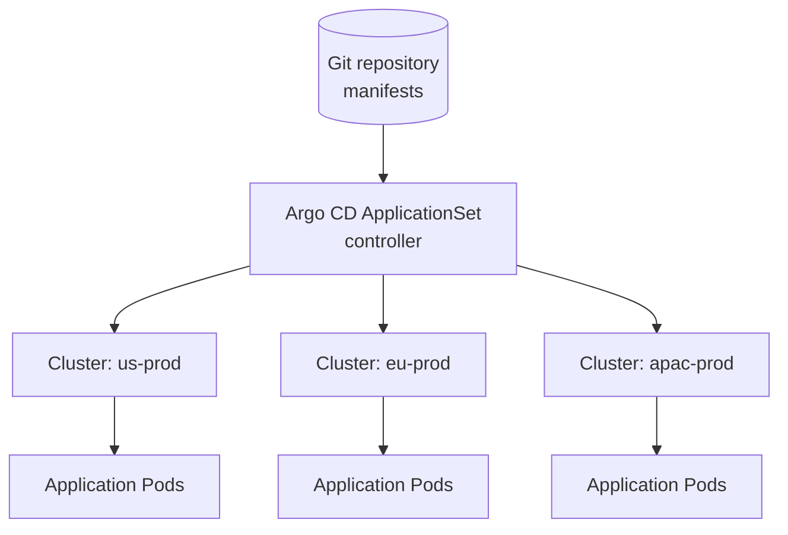
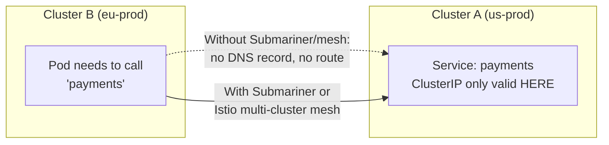

# Chapter 11 — Multi-Cluster Architectures

## Learning Objectives

By the end of this chapter you will be able to:

- Enumerate the concrete reasons organizations run more than one Kubernetes cluster
- Contrast "separate clusters per environment" with "namespaces per environment," and explain when teams choose one over the other
- Explain the operational cost multi-cluster adds, and why that cost demands fleet management tooling
- Describe the mental model behind Cluster API (CAPI) — clusters as declarative Kubernetes objects
- Explain GitOps-based fleet management (Argo CD ApplicationSets, Flux) and name production fleet tools
- Describe the multi-cluster service discovery problem and the classes of solutions that address it
- Apply a decision framework to judge whether a given team actually needs multiple clusters

---

## Prerequisites for This Chapter

- **Chapter 5 — Custom Resources and Operators**: Cluster API's mental model (a cluster as a CRD-backed object) depends directly on understanding CRDs.
- **Chapter 6 — Multi-Tenancy**: this chapter extends the soft-multi-tenancy-vs-hard-multi-tenancy discussion to the cluster level.
- **Chapter 7 — Service Mesh**: multi-cluster service mesh (section 11.5) assumes you understand the sidecar/mTLS model from a single-cluster perspective first.
- **Chapter 8 — GitOps and Progressive Delivery**: fleet management (section 11.4) is GitOps applied across many clusters instead of one.
- **Topic 8, Chapter 6 — Services and Networking**: the per-cluster nature of Kubernetes Service/DNS resolution is the baseline this chapter's service-discovery section pushes past.

---

## 11.1 Why Run More Than One Cluster At All?

A single, well-run Kubernetes cluster with good namespace isolation (Chapter 6), RBAC (Chapter 2), and NetworkPolicies (Chapter 4) can comfortably host many teams and many environments. So the question "why would you ever want *more* clusters, given everything that complicates?" deserves a genuine answer, not just "because big companies do it." There are five recurring, concrete reasons.

**Blast radius reduction.** A Kubernetes control plane, and particularly `etcd`, is a single point of correlated failure for everything running on it. If `etcd` becomes corrupted, if a botched cluster-wide admission webhook starts rejecting all requests, or if a CRD upgrade goes wrong, *every* workload on that cluster is affected simultaneously — regardless of how well-isolated its namespaces were from each other. A second, independent cluster means a control-plane-level failure only ever takes down half your capacity, not all of it.

**Compliance and data residency.** Some regulatory regimes (GDPR being the most commonly cited example) require that certain customer data physically stay within a geographic region. A namespace cannot enforce "this data never leaves the EU" — the underlying nodes, disks, and network could still be anywhere the cluster's infrastructure happens to live. A genuinely separate cluster, provisioned entirely within EU cloud regions, is the only architecture that makes that guarantee structurally true rather than policy-enforced.

**Multi-region for latency and availability.** A user in Singapore talking to a cluster in `us-east-1` pays real, physics-bound network latency on every request. Running a cluster per region — US, EU, APAC — lets each region's users talk to a nearby cluster, and gives you resilience against a regional cloud outage taking down the whole service (this directly foreshadows the active-active multi-region DR pattern from Chapter 10).

**Environment isolation via separate clusters, not just namespaces.** Topic 8, Chapter 9 taught namespace-based environment separation (a `dev`, `staging`, and `prod` namespace on one cluster), and Chapter 6 of this course covered namespace-based soft multi-tenancy. Some teams deliberately go further and run an entirely separate *cluster* per environment instead. The reason is usually **blast radius plus the ability to test cluster-level changes safely**: a Kubernetes version upgrade, a CNI plugin change, or a new cluster-wide admission policy is exactly the kind of change a namespace cannot isolate you from — it affects the whole control plane, every namespace on it, all at once. Rolling that kind of change out to a *separate* staging cluster first, watching it for a few days, and only then applying it to the *separate* production cluster gives you a genuine rollback story (leave the old cluster running, cut traffic back to it) that a shared-cluster namespace upgrade cannot offer, because there's only one control plane to upgrade and it's shared by everyone.

**Hard multi-tenancy.** Chapter 6 introduced the soft-vs-hard multi-tenancy spectrum: namespaces plus RBAC/NetworkPolicies is "soft" isolation — real, but sharing a kernel, a control plane, and (without careful configuration) a blast radius. "Hard" multi-tenancy — a fully separate cluster per tenant — is the ceiling of that spectrum, chosen when a tenant's isolation requirements (a competitor of another tenant, a regulatory requirement, a customer paying for dedicated infrastructure) make anything less than a separate control plane and separate nodes unacceptable.

```
                    Isolation strength increases →
Namespace + RBAC        Namespace + RBAC          Separate cluster
+ ResourceQuota    →    + NetworkPolicy      →    per tenant/environment/region
(Ch 2, Topic 8 Ch 9)    (Ch 4, Ch 6 "soft")       (this chapter, Ch 6 "hard")

Operational cost increases →
```

---

## 11.2 The Operational Cost Nobody Skips

Every one of the reasons above is real. So is the cost. **N clusters means N times the upgrade work** (Chapter 9's upgrade procedure, repeated per cluster, on its own schedule), **N times the monitoring and alerting setup**, **N control planes to secure, patch, and audit** (Chapters 2–4's RBAC/admission/NetworkPolicy work, again per cluster), and N places a misconfiguration can silently diverge from the others. A team that stands up three clusters "for safety" and then manually `kubectl apply`s changes to each one by hand has not reduced risk — it has traded one large, well-understood risk (a shared cluster) for three smaller, poorly-synchronized ones, which is frequently worse.

This is precisely the pain that **fleet management tooling** exists to solve: multi-cluster is only a net win once the operational burden of having many clusters is itself automated away, rather than manually repeated per cluster.

---

## 11.3 Cluster API (CAPI): Clusters as Declarative Objects

Chapter 5 introduced Custom Resource Definitions — teaching Kubernetes about entirely new kinds of objects, and Operators — controllers that watch those objects and reconcile the real world toward their desired state. **Cluster API (CAPI)** applies that exact same idea one level up: instead of the CRD describing an application-level concept (a database, a certificate), it describes **a Kubernetes cluster itself**.

The mental model: you run one small **management cluster**, and apply `Cluster`, `MachineDeployment`, and related custom resources to it, declaratively describing clusters you want to exist — their Kubernetes version, node counts, instance types, and which cloud/infrastructure provider they run on. A CAPI controller, running in the management cluster, watches those objects and reconciles them — provisioning the actual VMs, control plane, and networking needed, the same reconciliation-loop pattern from Topic 8, Chapter 2, just aimed at "does this cluster exist and match its spec" instead of "does this Pod exist and match its spec."

```yaml
# Illustrative only — a simplified CAPI Cluster object applied to a management cluster
apiVersion: cluster.x-k8s.io/v1beta1
kind: Cluster
metadata:
  name: apac-prod
  namespace: default
spec:
  clusterNetwork:
    pods:
      cidrBlocks: ["192.168.0.0/16"]
  infrastructureRef:
    apiVersion: infrastructure.cluster.x-k8s.io/v1beta2
    kind: AWSCluster       # provider-specific — the same Cluster kind works across providers
    name: apac-prod
```

```bash
# Provisioning a new cluster becomes a kubectl apply against the management cluster,
# not a bespoke Terraform module written and maintained per cloud provider
kubectl apply -f apac-prod-cluster.yaml --context management-cluster
kubectl get clusters --context management-cluster
```

The practical payoff: provisioning a new cluster becomes the same `kubectl apply` workflow you already know, against a well-defined API, instead of a hand-maintained, cloud-specific Terraform module that someone has to keep in sync with every other cloud-specific module for every other cluster. This is a genuinely complex subsystem in real deployments (provider integrations, upgrade orchestration, node lifecycle) — the goal here is the mental model and knowing it exists, not hands-on CAPI operation.

---

## 11.4 Fleet Management: GitOps, Extended Across Clusters

Chapter 8 established GitOps for a single cluster: an in-cluster agent (Argo CD or Flux) continuously reconciles that cluster's state against manifests in a Git repository, replacing "someone runs `kubectl apply` from a laptop" with an audited, pull-based model.

**Fleet management** is the direct extension of that idea: push the *same* GitOps-managed manifests to *many* clusters from one control point, instead of configuring GitOps separately, cluster by cluster.

- **Argo CD ApplicationSets** — a controller that generates many Argo CD `Application` objects from a single template, commonly driven by a **cluster generator**: register N target clusters with Argo CD, define one `ApplicationSet` template, and Argo CD creates and reconciles one `Application` per registered cluster automatically. Add a new cluster to the fleet, and it starts receiving the same GitOps-managed manifests with no additional YAML to write.
- **Flux's multi-cluster support** — a similar model, typically using a hub-and-spoke arrangement where a central Flux instance (or per-cluster Flux instances bootstrapped from a shared repository structure) apply the same source manifests across a fleet.
- **Rancher Fleet** — a purpose-built fleet management product (the name is not a coincidence) for exactly this problem: managing GitOps deployment across large numbers of clusters, with fleet-wide visibility into which clusters are in sync and which have drifted.



The point of naming Rancher Fleet and Argo CD ApplicationSets specifically: these are not niche or experimental tools — they are how this problem is actually solved in production today, and "we have 8 clusters and someone manually applies manifests to each one" is a strong signal a fleet tool is overdue.

| Tool | Model | Best fit |
|---|---|---|
| **Argo CD ApplicationSets** | Extends an existing Argo CD install with a generator that produces one `Application` per matched cluster | Teams already using Argo CD for single-cluster GitOps (Chapter 8) who want to scale the same model out |
| **Flux multi-cluster** | Hub-and-spoke or per-cluster Flux instances syncing from a shared repository structure | Teams already using Flux, or preferring a more decentralized, per-cluster-agent model |
| **Rancher Fleet** | Purpose-built fleet manager with fleet-wide drift visibility as a first-class feature | Large fleets (dozens to hundreds of clusters) where "which clusters have drifted" needs to be a single dashboard, not something inferred per-tool |

None of these tools replace Chapter 8's GitOps principles — they all still rely on Git as the single source of truth and a pull-based reconciliation loop. What they add is the *fan-out*: taking that one source of truth and reliably keeping N clusters, not one, converged on it.

---

## 11.5 Multi-Cluster Service Discovery

Topic 8, Chapter 6 taught you that a Service gets a stable ClusterIP and a DNS name resolvable via CoreDNS — but that entire mechanism is scoped to a single cluster. A Service named `payments` in cluster A has no meaning at all inside cluster B; there is no DNS record, no ClusterIP, nothing — from cluster B's perspective, `payments.default.svc.cluster.local` simply does not exist.

This becomes a real problem the moment workloads need to talk *across* clusters — a shared "tools" cluster's CI runners calling into a regional cluster's internal API, or two regional clusters needing to fail over traffic to each other. Three broad classes of solution exist:

- **Submariner** — establishes secure network tunnels between clusters and extends Kubernetes' own service discovery across them, so a Service in one cluster becomes resolvable and reachable from another, largely transparently to the application.
- **Istio multi-cluster mesh** — Chapter 7 introduced the service mesh's sidecar-proxy model for traffic management and mTLS *within* one cluster; Istio (and other meshes) can extend that same mesh across multiple clusters, so a service mesh's traffic routing, retries, and mTLS apply uniformly whether the destination Pod happens to be local or in another cluster entirely.
- **Simpler approaches: shared external DNS / Ingress.** Not every cross-cluster call needs full mesh-level integration. Exposing a service via a public or shared-internal Ingress endpoint (Topic 8, Chapter 11) with a stable external DNS name, and having other clusters call that external endpoint like any other external dependency, sidesteps the whole problem at the cost of an extra network hop and losing some mesh-level guarantees.

This is genuinely conceptual-overview territory for this course — the important takeaway is that **cross-cluster service discovery is a real, separate problem from single-cluster Service/DNS**, with names attached to the solution space, not a skill to implement here.



---

## 11.6 Decision Framework: Do You Actually Need Multiple Clusters?

Given the real reasons in 11.1 and the real cost in 11.2, most teams should ask this question explicitly rather than defaulting to multi-cluster because it "feels more serious" or more scalable.

| Signal pointing toward **one cluster + namespaces** | Signal pointing toward **multiple clusters** |
|---|---|
| Teams trust each other and RBAC/NetworkPolicy (Ch 2, 4, 6) already give adequate isolation | A specific regulatory or contractual requirement mandates physical data residency or dedicated infrastructure |
| All users are in one geographic region, latency to a single cluster is fine | Users are genuinely distributed across regions with real latency or availability requirements |
| Team size and blast-radius tolerance are both modest — a bad `etcd` day is recoverable within your RTO | A control-plane failure taking down every environment/tenant simultaneously is unacceptable |
| You don't yet have the automation (fleet tooling, CI/CD maturity) to manage N clusters without N times the manual toil | You already have, or are willing to invest in, GitOps-based fleet management (11.4) before scaling cluster count |
| You want to test a Kubernetes upgrade or CNI change safely — but a *namespace* on the same cluster can't isolate you from that; you need at minimum a second cluster for exactly this | You specifically need to validate cluster-level changes (upgrades, CNI/admission policy changes) in an environment fully isolated from production |

**Explicit advice:** many teams over-engineer into multi-cluster before they need it. Namespaces plus RBAC plus NetworkPolicies (Chapters 2, 4, 6) solve the isolation problem for far longer than people expect, at a fraction of the operational cost. The right trigger for going multi-cluster is a specific, named requirement from the table's right column — not a vague sense that "real companies run multiple clusters."

---

## 11.7 Real-World Scenario: Three Regions, One Git Commit

A global company runs three regional production clusters — `us-prod`, `eu-prod`, and `apac-prod` — for two concrete reasons: **latency** (each region's users are served by a nearby cluster) and **EU data residency compliance** (`eu-prod` is the only cluster permitted to hold EU customer data, and its infrastructure is provisioned entirely within EU cloud regions to make that a structural fact, not a policy).

Alongside the three regional clusters, they run one additional **shared "tools" cluster** — not serving any customer traffic — hosting Argo CD and their centralized CI runners.

Here's how a single application release rolls out, from one Git commit, across all three regions:

1. A developer merges a pull request into the application's Git repository, bumping the image tag referenced in the Helm chart's values.
2. The centralized CI pipeline (running on the tools cluster) builds and pushes the new container image, and the merge itself is the only "deployment trigger" — nobody runs `kubectl apply` or `helm upgrade` by hand, consistent with the GitOps model from Chapter 8.
3. Argo CD, running on the tools cluster, has an `ApplicationSet` configured with a cluster generator registered against all three regional clusters (`us-prod`, `eu-prod`, `apac-prod`). The `ApplicationSet` template says, in effect, "deploy this chart, from this repo, to every registered cluster."
4. Argo CD detects the new commit and, per its configured sync policy, begins reconciling each of the three regional `Application` objects — one per cluster — pulling the updated manifests and applying them.
5. Depending on the team's chosen rollout policy, this can happen simultaneously across all three regions, or staged (e.g., `us-prod` first, then `eu-prod` and `apac-prod` after a health-check window) — Argo CD's `ApplicationSet` supports both, and staged rollout is the safer default for anything customer-facing.
6. Each regional cluster's Argo CD `Application` reconciles independently — if `apac-prod`'s cluster is temporarily unreachable, `us-prod` and `eu-prod` still update on schedule, and `apac-prod` catches up automatically once it's reachable again, the same self-healing reconciliation guarantee from a single-cluster GitOps setup, just now visible at fleet scale.
7. The platform team has one place — the Argo CD UI/API on the tools cluster — to see whether all three regions are in sync with the same Git commit, or whether one has drifted, without logging into three separate clusters and comparing state by hand.

One Git commit, one CI build, one `ApplicationSet` definition — and three regionally-isolated production clusters, each satisfying its own latency and compliance requirements, all converge on the same release without anyone running a per-cluster deployment command.

---

## 11.8 Multi-Cluster Configuration Consistency: Beyond Just Manifests

Fleet management (11.4) solves the problem of pushing the *same application manifests* to many clusters. But a fleet of clusters accumulates a second, quieter consistency problem that ApplicationSets alone don't fully solve: **cluster-level configuration drift** — the RBAC bindings, admission policies, NetworkPolicy defaults, and installed cluster add-ons (CNI version, ingress controller version, cert-manager version) that make each cluster behave the same way, independent of any application deployed onto it.

Two clusters can be running the identical application manifests via the same ApplicationSet and still behave differently in production if one cluster has a slightly older admission webhook configuration, a different default StorageClass name (exactly the mismatch that surfaced in Chapter 10's DR drill scenario), or a NetworkPolicy default that was hand-patched on one cluster after an incident and never backported to the others. This is why mature fleet setups treat **cluster bootstrap configuration itself as GitOps-managed**, not just application workloads — the same Git-repository-as-source-of-truth model from Chapter 8, applied to the cluster's own baseline configuration (RBAC, admission policy, installed platform add-ons) as a distinct, fleet-wide-synced layer beneath the application layer.

```
Layer 2 (top):     Application manifests   ── synced via ApplicationSet, per Chapter 8/11.4
                    (Deployments, Services, ConfigMaps)

Layer 1 (bottom):  Cluster baseline config ── ALSO GitOps-managed, fleet-wide
                    (RBAC, admission policy, NetworkPolicy
                     defaults, CNI/ingress/cert-manager versions)
```

A fleet that only automates Layer 2 while leaving Layer 1 to manual, per-cluster `kubectl apply` or click-ops is still exposed to the exact kind of drift that makes "which cluster is actually configured correctly?" an uncomfortable question during an incident. Extending the same pull-based reconciliation discipline to both layers is what makes a fleet of clusters actually behave like one logical platform instead of N independently-drifting ones.

---

## Best Practices

- Justify each additional cluster against a specific reason from section 11.1 — blast radius, compliance, latency/availability, environment isolation for cluster-level changes, or hard multi-tenancy — not general instinct.
- Don't scale cluster count faster than your fleet management maturity; adopt GitOps-based fleet tooling (ApplicationSets, Fleet, Flux) before or alongside adding clusters, not long after.
- Treat a management cluster running Cluster API (or any fleet-control-point cluster running Argo CD/Flux) as itself a critical, carefully secured piece of infrastructure — it now has the blast radius of every cluster it manages.
- Default to namespaces + RBAC + NetworkPolicies for environment and tenant isolation until a concrete requirement (not a hypothetical one) demands a separate cluster.
- If you need cross-cluster service discovery, start by asking whether a simpler shared Ingress/external-DNS approach is sufficient before adopting Submariner or a full multi-cluster service mesh.

---

## Common Mistakes

- Standing up multiple clusters "for safety" without the automation to keep them consistent, ending up with drifted, inconsistently-patched clusters that are individually more fragile than one well-managed cluster.
- Choosing separate clusters per environment purely out of habit, when namespace-based isolation (Topic 8 Ch 9, this course's Ch 6) would have been sufficient and far cheaper to operate.
- Assuming a Service in one cluster is reachable from another without any additional tooling, and being surprised when DNS resolution simply fails.
- Treating Cluster API or a fleet-management control-point cluster as low-stakes infrastructure, when a compromise or outage there can affect every cluster it manages.
- Reaching for a full multi-cluster service mesh (Submariner/Istio multi-cluster) when a simple shared external Ingress endpoint would have solved the actual cross-cluster call pattern needed.

---

## Summary

Multi-cluster architectures exist to solve five concrete problems: blast radius reduction, compliance/data residency, multi-region latency and availability, environment isolation for testing cluster-level changes safely, and hard multi-tenancy — each a real, named requirement, not a vague scalability aspiration. The cost is real too: N clusters multiply upgrade work, monitoring setup, and control planes to secure, which is exactly why fleet management tooling exists. Cluster API (CAPI) applies the CRD/Operator pattern (Chapter 5) to clusters themselves, letting a management cluster provision and manage other clusters declaratively. GitOps-based fleet management — Argo CD ApplicationSets, Flux's multi-cluster support, or Rancher Fleet — extends Chapter 8's single-cluster GitOps model to push the same manifests across many clusters from one control point. Multi-cluster service discovery (Submariner, multi-cluster service mesh, or simpler shared Ingress/DNS approaches) solves the problem that a Service in one cluster is invisible to another by default. The decision framework in 11.6 is the chapter's central practical takeaway: justify multi-cluster against specific requirements, because namespaces plus RBAC plus NetworkPolicies solve the isolation problem for most teams far longer than expected. Finally, fleet consistency isn't just about application manifests — cluster-level baseline configuration (RBAC, admission policy, add-on versions) needs the same GitOps discipline, or a fleet of clusters silently drifts into N differently-behaving platforms.

---

## Knowledge Check

1. Name the five concrete reasons an organization might run multiple clusters, and give a one-sentence justification for each.
2. Why can't a namespace protect you from the risk of a Kubernetes version upgrade or a CNI plugin change, the way it can protect you from two teams' workloads interfering with each other?
3. In your own words, what is the mental model behind Cluster API, and how does it relate to the CRD/Operator pattern from Chapter 5?
4. What does an Argo CD ApplicationSet's cluster generator actually do, and how does it reduce the effort of adding a new cluster to a fleet?
5. Why does a Service's ClusterIP and DNS name, which work perfectly within one cluster, fail entirely when referenced from a different cluster?
6. A team wants to run a separate cluster per customer purely for stronger isolation. Using the decision framework in 11.6, what questions should they answer before doing this instead of using namespace-per-customer?
7. Two clusters in the same fleet are running identical application manifests via the same ApplicationSet, yet behave differently in production. What layer of configuration does section 11.8 suggest investigating, and why wouldn't GitOps-managed application manifests alone have prevented this?

---

## Hands-On Exercise

**Goal:** Simulate a two-cluster fleet locally using `kind`, and manually reproduce what an Argo CD ApplicationSet automates, to feel the operational cost multi-cluster adds before automating it away.

1. Create two local clusters: `kind create cluster --name fleet-a` and `kind create cluster --name fleet-b`.
2. Write a single Deployment + Service manifest for a simple app (e.g., an nginx Deployment with a ConfigMap-mounted custom `index.html`).
3. Apply the exact same manifest to both clusters using `--context`: `kubectl apply -f app.yaml --context kind-fleet-a` and `kubectl apply -f app.yaml --context kind-fleet-b`.
4. Make a change to the manifest (bump a label or the ConfigMap content) and apply it to `fleet-a` only. Run `kubectl diff -f app.yaml --context kind-fleet-b` against the unchanged cluster to see the drift you just introduced — this is exactly the kind of drift fleet tooling exists to prevent.
5. Reconcile `fleet-b` manually to match, and reflect on how this two-command, two-cluster exercise would not scale to real fleet sizes (5, 20, 100 clusters) without something like an ApplicationSet doing it declaratively.
6. **Bonus, if you have Argo CD available:** register both `kind` clusters with a local Argo CD instance and create a minimal `ApplicationSet` with a cluster generator targeting both, pointed at a Git repo containing the same manifest — observe both clusters converge automatically on the next sync.
7. Clean up: `kind delete cluster --name fleet-a && kind delete cluster --name fleet-b`.

---

## Further Reading

- [Cluster API Book](https://cluster-api.sigs.k8s.io/)
- [Argo CD ApplicationSet Documentation](https://argo-cd.readthedocs.io/en/stable/operator-manual/applicationset/)
- [Rancher Fleet Documentation](https://fleet.rancher.io/)
- [Submariner Documentation](https://submariner.io/)
- [Istio — Multi-Cluster Deployment Models](https://istio.io/latest/docs/ops/deployment/deployment-models/)

---

<div style="display:flex;justify-content:space-between;align-items:center;">
  <a href="./10-backup-and-disaster-recovery.md">← Previous: Backup and Disaster Recovery</a>
  <a href="./00-index.md">🏠 Index</a>
  <a href="./12-autoscaling-and-performance-tuning.md">Next: Autoscaling and Performance Tuning →</a>
</div>
