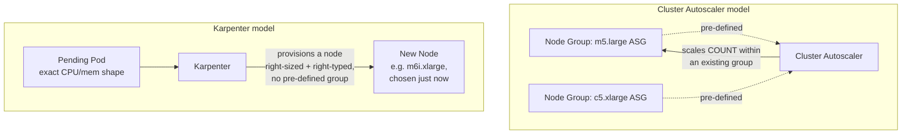
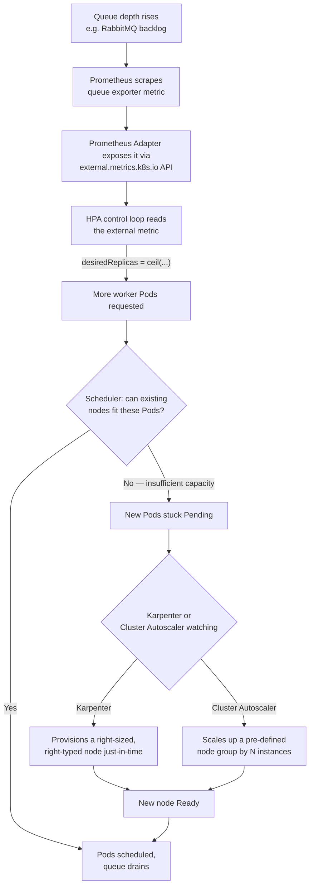

# Chapter 12 — Autoscaling and Performance Tuning

## Learning Objectives

By the end of this chapter you will be able to:

- Configure an HPA to scale on a custom metric (via the Prometheus Adapter) and explain why CPU is often a poor proxy for real load
- Use the three VPA modes deliberately, adopting `Off` mode as a safe observation-first workflow before hand-tuning resource values
- Compare Cluster Autoscaler and Karpenter on speed, cost-efficiency, flexibility, and maturity, and explain the "right-sized, right-typed node" difference
- Diagnose CPU throttling conceptually, distinguishing it from raw CPU usage
- Work through the standard "why isn't my HPA scaling" troubleshooting checklist
- Trace the full autoscaling stack end-to-end, from a custom metric source through to a newly provisioned node

---

## Prerequisites for This Chapter

- **Topic 8, Chapter 14 — Scaling and Autoscaling**: this chapter assumes you're already fluent with manual scaling, basic CPU-based HPA, the `metrics-server` prerequisite, the HPA control-loop formula, basic VPA modes, and the Cluster Autoscaler's role — none of that is repeated here. If any of it feels unfamiliar, revisit that chapter first.
- **Topic 8, Chapter 9 — Namespaces and Resource Management**: resource requests/limits and how the scheduler uses them.
- **Chapter 7 — Service Mesh**: not required, but the "I/O-bound worker" pattern in this chapter's real-world scenario is a workload shape you'll also see discussed there.

---

## 12.1 Beyond CPU and Memory: Custom and External Metrics in Practice

Topic 8, Chapter 14 mentioned that HPA supports custom and external metrics beyond `Resource` (CPU/memory) — this section actually builds one.

**Why CPU is often the wrong signal.** CPU-based HPA assumes CPU utilization tracks the thing you actually care about — user-facing load. That assumption holds for compute-bound workloads (a service doing heavy in-process calculation per request) and breaks down badly for **I/O-bound workloads**: a worker that spends most of its time waiting on a database query, an external API call, or a message queue. Such a worker can be completely overwhelmed — thousands of unprocessed messages piling up — while its CPU usage sits at a lazy 15%, because it's *waiting*, not *computing*. A CPU-based HPA watching that service will never scale it, no matter how bad the backlog gets, because the metric it's watching genuinely never crosses the threshold.

The fix is to scale on a metric that actually reflects the real bottleneck: **requests-per-second** for a latency-sensitive HTTP service, or **queue depth** for a queue-processing worker.

**The Prometheus Adapter** is the most common way to make this work: it reads metrics already being collected by Prometheus and re-exposes them through Kubernetes' `custom.metrics.k8s.io` (for metrics about in-cluster objects) or `external.metrics.k8s.io` (for metrics about things outside the cluster, like a managed message broker) APIs — the same APIs the HPA controller already knows how to query, exactly the extension point Topic 8, Chapter 14 told you existed.

```yaml
# HPA scaling a queue-processing worker on external queue depth,
# via Prometheus Adapter exposing a metric originally scraped from
# a queue exporter (e.g., an SQS or RabbitMQ exporter feeding Prometheus)
apiVersion: autoscaling/v2
kind: HorizontalPodAutoscaler
metadata:
  name: order-worker-hpa
  namespace: processing
spec:
  scaleTargetRef:
    apiVersion: apps/v1
    kind: Deployment
    name: order-worker
  minReplicas: 2
  maxReplicas: 50
  metrics:
    - type: External
      external:
        metric:
          name: rabbitmq_queue_messages_ready
          selector:
            matchLabels:
              queue: orders
        target:
          type: AverageValue
          averageValue: "25"     # aim for ~25 unprocessed messages per worker Pod
  behavior:
    scaleUp:
      stabilizationWindowSeconds: 0
      policies:
        - type: Pods
          value: 4
          periodSeconds: 60      # add at most 4 Pods per minute, even under a huge backlog spike
    scaleDown:
      stabilizationWindowSeconds: 300
```

```bash
# Confirm the metric is actually being served through the external metrics API
# before trusting the HPA to use it — this is the #1 thing to check when a
# custom/external-metric HPA appears stuck (see 12.4's troubleshooting checklist)
kubectl get --raw "/apis/external.metrics.k8s.io/v1beta1/namespaces/processing/rabbitmq_queue_messages_ready" | jq .

kubectl get hpa order-worker-hpa -n processing
# NAME               REFERENCE                  TARGETS      MINPODS   MAXPODS   REPLICAS
# order-worker-hpa   Deployment/order-worker    340/25       2         50        14
```

Note the `scaleUp.policies` block — a queue-depth metric can spike enormously in a burst (a batch job dumps 10,000 messages at once), and without a rate limit on how fast HPA is allowed to add Pods, it would try to jump straight to `maxReplicas` in one step, potentially overwhelming downstream dependencies (the very database or API the workers call) faster than they can handle the sudden concurrency increase.

---

## 12.2 VPA in Depth: A Safe Adoption Workflow

Topic 8, Chapter 14 listed VPA's `updateMode` values in a table. Here's how to actually use them without VPA becoming a source of surprise disruption in production.

| Mode | Behavior | When to use it |
|---|---|---|
| `Off` | Computes and exposes recommendations only (`kubectl describe vpa`); never touches a running Pod | The **only** mode to start with on any workload you haven't run VPA against before |
| `Initial` | Applies the current recommendation only at Pod creation time (new rollout, crash restart); never evicts a running Pod to update it | A reasonable middle ground once you trust the recommendations, for workloads where you're comfortable waiting for the next natural rollout to pick up new values |
| `Auto` / `Recreate` | Actively evicts and recreates Pods whenever a materially better recommendation is available | Only after you've validated recommendations in `Off` mode over a real traffic period, and have a `PodDisruptionBudget` in place |

**The safe workflow: observe first, act later.**

1. **Deploy VPA in `Off` mode** against the target Deployment. It watches actual CPU/memory usage continuously but makes zero changes to running Pods.

```yaml
apiVersion: autoscaling.k8s.io/v1
kind: VerticalPodAutoscaler
metadata:
  name: checkout-vpa-observer
spec:
  targetRef:
    apiVersion: apps/v1
    kind: Deployment
    name: checkout
  updatePolicy:
    updateMode: "Off"
```

2. **Let it run for a full traffic cycle** — a week is the common baseline, long enough to see weekday/weekend patterns, batch jobs, and at least one traffic peak, not just a quiet Tuesday afternoon.

3. **Read the recommendation, don't blindly apply it:**

```bash
kubectl describe vpa checkout-vpa-observer
```

```
Recommendation:
  Container Recommendations:
    Container Name:  checkout
    Lower Bound:
      Cpu:     120m
      Memory:  180Mi
    Target:
      Cpu:     240m
      Memory:  310Mi
    Uncapped Target:
      Cpu:     240m
      Memory:  310Mi
    Upper Bound:
      Cpu:     410m
      Memory:  520Mi
```

4. **Hand-tune the Deployment's `resources` block based on that data**, applied through your normal, reviewed deployment pipeline (Chapter 8's GitOps flow) — not through VPA evicting Pods automatically:

```yaml
resources:
  requests:
    cpu: 250m       # informed by VPA's "Target" recommendation, with small headroom
    memory: 320Mi
  limits:
    cpu: 500m       # informed by VPA's "Upper Bound", giving burst headroom
    memory: 512Mi
```

5. **Only after this manual cycle has been validated once or twice** would a team consider `Initial` or, more cautiously, `Auto` mode — and even then, with a `PodDisruptionBudget` in place (Chapter 15 covers this as a common mistake to avoid: running an active VPA without one), since `Auto`/`Recreate` still works by deleting and recreating Pods, exactly as Topic 8, Chapter 14 described.

This is a meaningfully safer adoption pattern than pointing VPA at `Auto` mode on day one and trusting it — a bad early recommendation (VPA's model needs time and real traffic to converge on good numbers) applied automatically in `Auto` mode means Pods get evicted and recreated with resource values nobody reviewed, which can just as easily make things worse as better.

---

## 12.3 Cluster Autoscaler vs. Karpenter

Topic 8, Chapter 14 covered what Cluster Autoscaler does: watch for `Pending` Pods caused by insufficient capacity, and add nodes to the underlying infrastructure. This section goes deeper into *how* it does that, and contrasts it with **Karpenter**, a newer, faster approach to the same problem.

**Cluster Autoscaler** works against **pre-defined node groups** — an AWS Auto Scaling Group, a GKE node pool, an AKS Virtual Machine Scale Set — that an administrator configured ahead of time with a specific instance type (or a small set of allowed types) and a min/max size. When Cluster Autoscaler decides more capacity is needed, it scales the *count* of instances within one of those existing groups. It does not choose a new instance type — it can only pick among the node groups you already defined, and picks whichever pre-defined group best fits the pending Pods.

**Karpenter** (originated at AWS, now supporting other clouds) takes a fundamentally different approach: instead of choosing among pre-defined node groups, it looks directly at the exact resource shape of a specific pending Pod (or set of Pods) — its CPU/memory requests, any node affinity or toleration requirements — and provisions a **node that is the right size and the right instance type for that Pod, on demand**, with no pre-defined node group required at all. Karpenter also tends to be significantly faster (it talks to the cloud provider's instance-launch API more directly, skipping some of the abstraction layers a node-group-based approach goes through) and better bin-packed (because it isn't constrained to whatever handful of instance types someone configured a node group with months ago — it can pick a genuinely well-fitting shape from dozens of available instance types).

| Dimension | Cluster Autoscaler | Karpenter |
|---|---|---|
| **Provisioning unit** | Adds/removes instances within pre-defined node groups (ASG/node pool/VMSS) | Provisions individual nodes directly, no pre-defined node group needed |
| **Instance type selection** | Fixed to whatever the node group was configured with | Chooses the best-fitting type dynamically, per pending Pod's actual shape |
| **Speed** | Slower — bound by node-group scaling semantics and often a full ASG launch-template cycle | Generally faster — provisions more directly against the cloud API |
| **Bin-packing / cost-efficiency** | Limited to the instance types available in the matching node group, can over-provision if none fit well | Better — can select from a broad range of instance types to closely match the actual pending workload, reducing waste |
| **Flexibility** | Requires an admin to pre-create and maintain node groups for each shape of workload expected | No pre-defined node groups; a single Karpenter `NodePool` config can cover many workload shapes |
| **Cloud support** | Broad — works with any cloud provider's node-group-equivalent concept | Started AWS-only, now expanding (Azure support, and community ports); still less universally available than Cluster Autoscaler |
| **Maturity** | Very mature, long-standing default choice, deeply battle-tested across all major clouds | Newer, rapidly maturing, already the recommended default on AWS EKS for new clusters |



Neither is strictly "better" in all situations — Cluster Autoscaler's simplicity and universal cloud support still make it the right choice for teams with a small number of well-understood workload shapes, or on clouds Karpenter doesn't yet fully support. Karpenter's speed and bin-packing advantages are most valuable for clusters running many different workload shapes with unpredictable, varied resource requests — exactly the profile of a large multi-tenant platform cluster (Chapter 6).

---

## 12.4 Performance Diagnosis Workflow

### Live Snapshot: `kubectl top`

Topic 8 briefly covered `kubectl top pod` / `kubectl top node` for a live resource-usage snapshot, sourced from `metrics-server`. That remains the fastest first check — but it's a snapshot, not a diagnosis, and two specific problems it can't show you are covered below.

### Node-Level Pressure Conditions

`kubectl describe node <node>` surfaces **Conditions** that reveal whether a node itself is under resource pressure, independent of any single Pod's usage:

```bash
kubectl describe node worker-3
```

```
Conditions:
  Type                 Status  Reason                       Message
  ----                 ------  ------                       -------
  MemoryPressure       False   KubeletHasSufficientMemory    kubelet has sufficient memory available
  DiskPressure         True    KubeletHasDiskPressure        kubelet has disk pressure
  PIDPressure          False   KubeletHasSufficientPID       kubelet has sufficient PID available
  Ready                True    KubeletReady                  kubelet is posting ready status
```

- **`MemoryPressure`** — the node is close to running out of memory; the kubelet will begin evicting Pods (lowest-priority / most-over-their-request first) to reclaim it.
- **`DiskPressure`** — the node's filesystem or image storage is nearly full, commonly from accumulated container images or excessive log/`emptyDir` usage; also triggers Pod eviction.
- **`PIDPressure`** — the node is running out of available process IDs, usually from a runaway workload spawning far more processes/threads than expected.

A node showing `DiskPressure: True`, for instance, explains scheduling and eviction behavior that `kubectl top node`'s CPU/memory-only view would never reveal — the node might look fine on CPU and memory and still be actively evicting Pods due to disk.

### CPU Throttling: The Metric `kubectl top` Cannot Show You

Here is a genuinely counterintuitive and common production trap: **a container can look completely fine on a CPU usage graph while still being throttled.** `kubectl top pod` shows *average* CPU usage over its sampling window. But the kernel's CFS (Completely Fair Scheduler) bandwidth controller — the mechanism that enforces `resources.limits.cpu` — throttles a container the instant it exceeds its limit *within any individual scheduling period* (by default, 100ms slices), even if the container's usage averages out to something well under the limit over a longer window.

Concretely: a container with a `limits.cpu: 500m` that bursts to 100% of a core for 30ms out of every 100ms period, then goes idle, could show an *average* usage of well under 500m on a `kubectl top` snapshot — while actually being throttled repeatedly within nearly every period, adding real, invisible latency to every request it handles during those throttled slices.

The real signal for this is the kernel/cgroup counter `container_cpu_cfs_throttled_periods_total` (compared against `container_cpu_cfs_periods_total` to get a throttling *ratio*) — conceptually, "out of all the scheduling periods this container ran in, what fraction were periods where it hit its CPU limit and got throttled before the period ended?" A high ratio means real, request-latency-affecting throttling is happening, invisible to a plain usage-average view. Fully wiring this up requires a metrics pipeline (Prometheus scraping cAdvisor/kubelet metrics) that this course treats as **Topic 10 — Monitoring & Logging** territory — the goal here is to plant the concept firmly enough that "my CPU usage graph looks fine but my p99 latency is bad" immediately makes you suspect throttling, not just to hand you a working dashboard.

### The "My HPA Isn't Scaling" Checklist

When an HPA that should be scaling appears stuck, work through these in order:

1. **Is `metrics-server` actually installed and healthy?** `kubectl top pod` returning data is the fastest sanity check — no data means no HPA scaling is possible, full stop (Topic 8, Ch 14).
2. **Are `resources.requests` actually set on the target container?** CPU-based HPA computes a percentage relative to the request; an unset request means there's no baseline to compute against, and the HPA will show `<unknown>` for its current value.
3. **Is the target metric actually moving?** `kubectl get hpa <name>` shows current vs. target — if the current value never approaches the target, either the workload genuinely isn't under load, or (for custom/external metrics) the metrics pipeline itself is broken between the source and the adapter — verify with the `kubectl get --raw` query shown in 12.1.
4. **Are you already at `maxReplicas`?** `kubectl get hpa` shows current replica count next to the configured max — if they're equal, the HPA is working correctly; it's just hit its deliberate ceiling, and the fix (if warranted) is raising `maxReplicas`, not debugging HPA itself.
5. **Is the scale target's Pod template failing to schedule?** If new replicas are being requested but stuck `Pending`, the problem has moved one layer down to the Cluster Autoscaler/Karpenter layer (12.3), not the HPA.

---

## 12.5 The Full Autoscaling Stack, End to End

Putting the pieces from this chapter together with Topic 8, Chapter 14's HPA-to-Cluster-Autoscaler flow, extended with a custom metric source and Karpenter:



The chain from top to bottom is the whole point of this chapter: a real-world signal (queue depth) drives HPA, HPA's Pod-count decisions drive node-level capacity decisions, and Karpenter/Cluster Autoscaler close that final gap between "Kubernetes wants more Pods" and "the cloud infrastructure actually has room for them."

---

## 12.6 Real-World Scenario: Fixing a Queue-Processing Fleet

A company runs a fleet of order-processing workers that consume from a RabbitMQ queue. Originally, they scaled this fleet with a standard CPU-based HPA, mirroring the pattern from Topic 8, Chapter 14's flash-sale example — and it consistently under-scaled during real traffic spikes. The root cause, once diagnosed, was exactly the I/O-bound problem described in 12.1: each worker spent most of its time waiting on downstream API calls and database writes per order, not computing. CPU usage crept up only mildly even as the queue backlog climbed into the thousands, so the CPU-based HPA barely reacted, and the on-call team routinely got paged for "orders processing slowly" while `kubectl top pod` showed unremarkable CPU numbers the whole time.

**The fix, in two parts:**

1. **Switched to queue-depth-based HPA.** They stood up the Prometheus Adapter, exposed `rabbitmq_queue_messages_ready` as an external metric, and replaced the CPU-based HPA with the `external` metric configuration shown in section 12.1, targeting an average of ~25 messages per worker Pod. Scaling now tracked the *actual* bottleneck directly — when the queue backed up, replicas increased immediately, regardless of how idle the workers' CPUs looked.

2. **Adopted Karpenter to replace a patchwork of manually-sized node groups.** Before this change, the platform team maintained several separate Auto Scaling Groups — one for "small" workers, one for "large" batch jobs, one general-purpose group — each sized and instance-typed by guesswork months earlier, and each requiring separate Cluster Autoscaler configuration. Nodes sat idle in one group while another group hit its max and couldn't schedule new Pods, a classic symptom of a fixed-node-group model failing to match a fleet with varied resource shapes. Karpenter replaced all of it with a single `NodePool` configuration expressing acceptable instance families and a resource ceiling — it now provisions exactly the right-sized node for whatever Pod (queue worker or batch job) is actually pending, from a much wider set of possible instance types than the old node groups ever covered.

**The result:** under-provisioning incidents (queue backlog paging the on-call team while HPA sat idle) dropped to effectively zero, because the HPA now scales on the metric that actually reflects load. Idle-node cost also dropped meaningfully, because Karpenter's per-Pod right-sizing eliminated the wasted capacity that came from guessing node-group shapes ahead of time and living with the mismatch. Both fixes were independent and additive — the queue-depth HPA fixed *when* to scale Pods; Karpenter fixed *how well* the resulting capacity request was matched to real infrastructure.

---

## Best Practices

- Scale on the metric that reflects your actual bottleneck — queue depth or requests-per-second for I/O-bound and latency-sensitive services — rather than defaulting to CPU because it's the easiest metric to wire up.
- Adopt VPA in `Off` mode first, always. Let it observe a full traffic cycle before trusting any recommendation enough to apply it, whether by hand or via `Auto` mode.
- Rate-limit HPA scale-up (`behavior.scaleUp.policies`) for any metric that can spike suddenly (queue depth especially), to avoid overwhelming downstream dependencies with a too-fast replica ramp.
- Prefer Karpenter over a patchwork of manually-sized, fixed node groups for clusters with varied or unpredictable workload shapes; keep Cluster Autoscaler for simpler, well-understood, cloud-agnostic setups.
- Treat CPU usage graphs with suspicion for latency-sensitive services — check throttling ratios, not just averages, once a real metrics pipeline (Topic 10) is in place.
- Work through the "why isn't my HPA scaling" checklist in order (12.4) before assuming a deeper bug — most stuck HPAs are `metrics-server` health, missing `requests`, or `maxReplicas` already reached.

---

## Common Mistakes

- Scaling an I/O-bound or queue-processing workload on CPU alone, and being confused why it under-scales despite a growing backlog.
- Running VPA in `Auto` mode on day one, before its recommendations have been observed and validated, and getting surprised by disruptive, poorly-informed Pod evictions.
- Maintaining several manually-sized, fixed node groups for different workload shapes instead of adopting Karpenter, and living with chronic mismatches between available and needed capacity.
- Trusting `kubectl top pod`'s average CPU usage as proof a container isn't CPU-constrained, missing real CPU throttling happening within individual scheduling periods.
- Debugging an HPA that's actually working correctly but has simply hit its configured `maxReplicas` ceiling.

---

## Summary

This chapter went past the basic HPA/VPA/Cluster Autoscaler mechanics from Topic 8, Chapter 14 into the tuning and diagnosis layer platform engineers actually live in. Custom and external metrics via the Prometheus Adapter let HPA scale on the signal that actually reflects load — queue depth or request rate — instead of CPU, which is frequently a poor proxy for I/O-bound workloads. VPA's `Off` mode enables a safe observe-then-hand-tune adoption workflow, avoiding the disruption risk of trusting `Auto` mode blindly. Karpenter provisions right-sized, right-typed nodes just-in-time per pending Pod, without pre-defined node groups, generally faster and better bin-packed than Cluster Autoscaler's fixed-node-group model — though Cluster Autoscaler remains the simpler, more universally supported choice for well-understood workload shapes. Performance diagnosis goes beyond `kubectl top`: node Conditions (`MemoryPressure`, `DiskPressure`, `PIDPressure`) reveal node-level constraints invisible in usage snapshots, and CPU throttling can silently degrade latency even when average usage graphs look fine. The end-to-end autoscaling stack — custom metric source, HPA, scheduler, Karpenter/Cluster Autoscaler, new node — is one continuous pipeline, and the queue-processing fleet scenario showed both halves (the right scaling metric, and the right node-provisioning tool) fixing a real production pain point together.

---

## Knowledge Check

1. Why can a queue-processing worker fleet be severely backlogged while its CPU-based HPA sees no reason to scale?
2. Walk through the recommended VPA adoption workflow, starting from `Off` mode, and explain why starting directly in `Auto` mode is riskier.
3. What is the fundamental difference between how Cluster Autoscaler and Karpenter decide what new node to add?
4. A container's `kubectl top pod` output looks well under its CPU limit, yet its p99 latency is unexpectedly high. What metric would you want to check, and what is it conceptually measuring?
5. Walk through the "why isn't my HPA scaling" checklist for a case where `kubectl get hpa` shows the current replica count exactly equal to `maxReplicas`.
6. In the end-to-end autoscaling diagram (12.5), what specifically closes the gap between "HPA wants more Pods" and "there's capacity to run them"?

---

## Hands-On Exercise

**Goal:** Reproduce the CPU-vs-queue-depth mismatch conceptually on a `kind` cluster, and practice the VPA observe-first workflow.

1. Create a cluster: `kind create cluster --name autoscale-lab`, and install `metrics-server` (with the `kind`-specific TLS flag noted in Topic 8, Chapter 14's exercise).
2. Deploy a small "worker" Deployment that simulates I/O-wait rather than CPU load — e.g., a container running a loop that sleeps for most of its cycle and only briefly spikes CPU, with `resources.requests.cpu` set low.
3. Create a CPU-based HPA against it (`kubectl autoscale deployment ... --cpu-percent=50 --min=2 --max=10`) and confirm, using `kubectl get hpa -w`, that it does not scale meaningfully even while you simulate "backlog" by some other means (e.g., a counter in a ConfigMap or a simple exposed custom metric if you want to go further).
4. If you have Prometheus and the Prometheus Adapter available (or are willing to install a minimal setup), expose a synthetic custom metric representing "backlog" and replace the CPU-based HPA with an `external` or `custom` metric HPA targeting it — observe it scale correctly where the CPU-based one didn't.
5. Separately, deploy any Deployment with deliberately mis-sized `resources.requests` (e.g., far too high), install the VPA components, and create a VPA object in `updateMode: "Off"` targeting it. After generating some load, run `kubectl describe vpa` and compare its recommendation against your original, deliberately-wrong request values.
6. Clean up: `kind delete cluster --name autoscale-lab`.

---

## Further Reading

- [Kubernetes Documentation — Horizontal Pod Autoscaler: Support for Metrics APIs](https://kubernetes.io/docs/tasks/run-application/horizontal-pod-autoscale/#support-for-metrics-apis)
- [Kubernetes SIG Autoscaling — Prometheus Adapter](https://github.com/kubernetes-sigs/prometheus-adapter)
- [Karpenter Documentation](https://karpenter.sh/docs/)
- [Kubernetes Documentation — Node Pressure Eviction](https://kubernetes.io/docs/concepts/scheduling-eviction/node-pressure-eviction/)
- [Kubernetes Blog — CPU Limits and Aggressive Throttling](https://kubernetes.io/blog/2020/09/03/warnings/)

---

<div style="display:flex;justify-content:space-between;align-items:center;">
  <a href="./11-multi-cluster-architectures.md">← Previous: Multi-Cluster Architectures</a>
  <a href="./00-index.md">🏠 Index</a>
  <a href="./13-auditing-and-troubleshooting-at-scale.md">Next: Auditing and Troubleshooting at Scale →</a>
</div>
