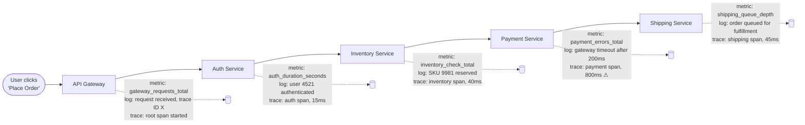

# Chapter 1 — Introduction to Observability

## Learning Objectives

By the end of this chapter you will be able to:

- Describe, with a concrete example, why "SSH in and grep the logs" does not scale as an incident-response strategy
- Distinguish monitoring from observability precisely, and explain why observability is a superset of monitoring rather than a replacement for it
- Define the three pillars of observability (metrics, logs, traces) and state which pillar answers which kind of question
- Explain why Nagios-style, host-list-based monitoring broke down as infrastructure became dynamic and container-based
- Describe Prometheus's origin (SoundCloud, inspired by Google's Borgmon) and its place in CNCF history
- Explain why this course is the natural next step after Kubernetes Basics and Advanced Kubernetes

---

## Prerequisites for This Chapter

- **Kubernetes Basics (Topic 8)** and **Advanced Kubernetes (Topic 9)** — required. This course assumes you can already deploy, scale, and administer workloads on Kubernetes (Pods, Deployments, Services, Helm, HPA, RBAC, Operators, GitOps, cluster upgrades). None of that is re-taught here; it is referenced only where it motivates an observability concept.
- No prior monitoring, logging, or tracing knowledge is assumed. This is the first chapter of the course.

---

## 1.1 A 3 AM Page: Two Versions of the Same Incident

An on-call engineer's phone buzzes at 3:14 AM. The page says: **"checkout is down."** That is the entire message. Nothing about which service, which region, which dependency, or why. What happens next depends entirely on whether the company has invested in observability — and the difference is not a matter of convenience, it is the difference between an eight-minute incident and a ninety-minute one.

**Without observability**, the engineer's night looks like this:

1. SSH into a server that might be running the checkout service — if they can remember which one.
2. Run `docker ps` or `kubectl get pods` and eyeball which Pods look unhealthy.
3. `kubectl logs` on a few Pods, scrolling by hand, `grep`-ing for the word "error," with no idea whether they're even looking at the right time window.
4. Guess that it might be the payment provider, restart a few Pods "just in case," and wait to see if the pages stop.
5. Eventually — after 60 to 90 minutes of guesswork — stumble onto a stack trace that shows the payment gateway integration timing out, and only then realize a deploy went out at 2:58 AM that changed a timeout value.

**With observability**, the same page plays out like this:

1. Open a Grafana dashboard for the checkout service. Within seconds, an error-rate panel shows a sharp spike starting at 2:58 AM — the same minute a deploy marker (annotated automatically from the CI/CD pipeline) appears on the same graph.
2. Click into a distributed trace for one of the failing requests. It shows the request touching `auth → inventory → payment → shipping`, and the `payment` span alone accounts for 800ms of a 900ms total — clearly the bottleneck.
3. Jump directly from that trace to the exact log lines for that request (correlated by a trace ID), which show the payment client raising a timeout exception after a newly reduced 200ms limit.
4. Roll back the 2:58 AM deploy. Dashboards confirm the error rate returns to baseline within two minutes.

Total time to root cause: **under ten minutes**, most of it spent confirming the fix rather than finding the problem. The engineer never had to guess, never had to SSH anywhere, and never had to read logs by hand. This is not a hypothetical — it is the default expectation at any organization running production services at meaningful scale, and it's the entire subject of this course.

---

## 1.2 Monitoring vs. Observability

These two words are often used interchangeably, and that sloppiness causes real confusion, so it is worth being precise before going any further.

**Monitoring** is watching for failure modes you already anticipated. You decide in advance which questions matter ("is CPU above 80%?", "is disk space below 10%?", "is the health check endpoint returning 200?"), you build a dashboard or alert for each one, and the system tells you when one of those predefined conditions is true. Monitoring is fundamentally about **known unknowns** — things you know you should watch, even though you don't know exactly when they'll happen.

**Observability** is the ability to ask *arbitrary new questions* about a system's internal state, using only its external outputs (metrics, logs, traces), **without shipping new code** to answer that question. It exists specifically for **unknown unknowns** — failure modes nobody anticipated, questions nobody thought to build a dashboard for, because in a sufficiently complex distributed system you cannot enumerate every way it might break in advance. "Why are 0.3% of requests from users in a specific browser version, hitting a specific Pod replica, during a specific fifteen-second window, timing out?" is not a question you'd ever pre-build a dashboard for — but a genuinely observable system lets you slice, filter, and correlate your existing telemetry to answer it live, on the spot.

The relationship between them matters: **observability is an evolution of monitoring, not a replacement for it.** You still want threshold alerts for known failure modes — paging someone when disk space crosses 90% is still exactly the right thing to do, and rebuilding that from first principles during an incident would be absurd. What observability adds is the capability to go *beyond* those predefined checks when the incident turns out to be something nobody predicted, which, empirically, most serious incidents are. Every tool covered later in this course — Prometheus, Grafana, the ELK stack, Loki, OpenTelemetry — sits somewhere on this spectrum, and the best production setups use all of them together.

| | Monitoring | Observability |
|---|---|---|
| **Question type** | Predefined — "is X above/below threshold Y?" | Arbitrary and ad hoc — "why is X happening?" |
| **Handles** | Known unknowns | Unknown unknowns |
| **Primary artifact** | Dashboards and alerts built in advance | Rich, high-cardinality telemetry you can query live |
| **Fails when** | Something breaks in a way nobody anticipated | (Ideally, doesn't — that's the point) |
| **Relationship** | A subset of what observability provides | A superset that includes monitoring |

---

## 1.3 The Three Pillars of Observability

Observability is built from three distinct types of telemetry data, commonly called the "three pillars." Each answers a different category of question, and each has a different shape.

| Pillar | What It Is | Concrete Example | Answers |
|---|---|---|---|
| **Metrics** | Numeric measurements of a system, sampled over time | "how many requests per second is the checkout service handling, and what's the p99 latency?" | "What is the overall health and trend of this system right now?" |
| **Logs** | Discrete, timestamped records of individual events | `user 4521 failed login at 14:32:01 with reason "bad password"` | "What exactly happened, in detail, at this specific moment?" |
| **Traces** | The end-to-end path of a single request as it flows through multiple services | "this checkout request touched auth → inventory → payment → shipping, and the payment call consumed 800ms of the total 900ms" | "Where, specifically, did this one request spend its time, and which service is the bottleneck?" |

None of the three is a replacement for the others — they answer different questions at different resolutions:

- **Metrics** are cheap to store and query even at massive scale (because they're pre-aggregated numbers), which makes them the right tool for "what's the big picture, and is it trending badly?" They are covered in depth starting in Chapter 2.
- **Logs** are the most detailed and most expensive pillar — a full event record for every single thing that happened — which makes them the right tool for "show me exactly what this one request/user/error looked like." Centralized logging is covered starting in Chapter 8.
- **Traces** exist specifically for distributed systems, where a single user-facing request fans out across many services and a slow overall response could be caused by any one of them. Traces are covered in Chapter 11.

### Where Each Pillar Is Captured, Hop by Hop

Consider a single checkout request flowing through four microservices. At every hop, all three pillars are being produced simultaneously, but each captures something different:

Notice that every service independently emits its own metrics and logs, but the **trace** is the one artifact that ties all five hops together into a single coherent story of where the 900ms total response time actually went. This is exactly why the incident in section 1.1 was solved in minutes: the trace immediately pointed at the payment span as the outlier, and the correlated logs explained why.

---

## 1.4 Why "Unknown Unknowns" Are the Normal Case, Not the Exception

It's worth dwelling on why observability's focus on unknown unknowns matters so much in practice, rather than treating it as an abstract distinction. As distributed systems grow — more services, more dependencies, more deployment frequency, more infrastructure layers (containers, orchestration, service meshes, managed cloud services) — the space of things that could possibly go wrong grows combinatorially, not linearly. A monolithic application running on one server has a relatively small, enumerable list of failure modes: the process crashes, the disk fills up, the CPU maxes out. A system of thirty microservices, each independently deployed, calling each other over a network, running on autoscaled Kubernetes Pods, has failure modes that emerge from *combinations* of components interacting in ways no single engineer designed or anticipated: a slow DNS resolution in one service compounding with a retry policy in another, causing a queue to back up in a third, three hops away from where the original slowness occurred.

This is precisely why experienced SRE teams describe most real production incidents as "novel" in some dimension — not identical to any previous incident, even if they superficially resemble one. If your entire telemetry strategy is a fixed set of dashboards built to catch failure modes you've seen before, you are, by construction, blind to this entire category of incident until you happen to build a new dashboard for it — usually right after the incident that motivated it, which is exactly the reactive posture observability is meant to break. The ability to ask a brand-new question of your system's existing telemetry, live, during an incident nobody has seen before, is not a nice-to-have feature — it's the specific capability that determines whether a novel incident takes eight minutes or ninety.

---

## 1.5 A Brief History: From Nagios to Prometheus to Cloud-Native Observability

Understanding where this tooling came from clarifies *why* it works the way it does.

### The Nagios/Zabbix Era: Static Hosts, Threshold Alerts

For roughly two decades, the dominant monitoring model — tools like **Nagios** (1999) and **Zabbix** (2001) — worked like this: an administrator maintained a static configuration file listing every host and service to check (`web-01`, `web-02`, `db-primary`), an agent or check script ran periodically against each one, and a threshold breach (CPU too high, disk too full, port not responding) fired an alert. This model matches its era well: infrastructure was physical or long-lived virtual machines, provisioned by hand, that stayed at the same IP address for months or years. Writing down a host list once and checking it forever was a completely reasonable design.

That model breaks down completely once infrastructure becomes dynamic. Recall from Kubernetes Basics (Topic 8, Chapter 4) that Pods are ephemeral by design — they are created, destroyed, and rescheduled constantly, each time with a new name and a new IP address, and the Horizontal Pod Autoscaler (Topic 8, Chapter 14) can add or remove replicas automatically based on load, sometimes multiple times per hour. A static host list simply cannot keep up: by the time you've hand-edited a Nagios config to add `checkout-7d9f8b6c5-x2p4q`, that Pod may already be gone, replaced by `checkout-7d9f8b6c5-m9k2l`. Monitoring tools built around the assumption of a fixed inventory of long-lived hosts are fundamentally incompatible with a platform whose entire value proposition is dynamically creating and destroying compute on demand.

### The Rise of Prometheus

In 2012, engineers at **SoundCloud** — facing exactly this dynamic-infrastructure problem as they moved toward microservices — built a new monitoring system called **Prometheus**. Its design was explicitly inspired by an internal Google system called **Borgmon**, the monitoring counterpart to **Borg**, Google's internal cluster scheduler — the same Borg that inspired Kubernetes itself (Kubernetes Basics, Topic 8, Chapter 1). This is not a coincidence: Google had already solved the "monitoring a fleet of ephemeral, auto-scheduled workloads" problem internally years earlier, and both Kubernetes and Prometheus are, in their own domains, public re-implementations of ideas Google had already proven at massive scale.

Prometheus was open-sourced in 2015, and in 2016 it became the **second project ever accepted into the Cloud Native Computing Foundation**, immediately after Kubernetes itself. That ordering is telling: the CNCF's founding thesis was that cloud-native infrastructure needs both an orchestration layer and an observability layer built for the same dynamic, ephemeral, container-based world — and it recognized Prometheus as the answer to the second half of that problem almost as soon as it recognized Kubernetes as the answer to the first half.

| Era | Representative Tools | Target Infrastructure | Failure Mode |
|---|---|---|---|
| Agent-based, static inventory | Nagios, Zabbix | Physical servers, long-lived VMs | Cannot track dynamically created/destroyed hosts |
| Push-based aggregation | StatsD, Graphite | Early cloud, still mostly static | Push destinations scattered across every app; no built-in "is the target even alive" signal |
| Cloud-native, pull-based, service-discovery-driven | **Prometheus** | Containers, Kubernetes, autoscaling fleets | Designed from day one for targets that appear and disappear constantly |

The broader industry has followed this same trajectory: structured, centralized logging (the ELK stack, then Loki) and distributed tracing (OpenTelemetry, Jaeger) each emerged for the same underlying reason — traditional tools assumed static, long-lived infrastructure, and cloud-native systems needed tools that assumed the opposite from the start.

---

## 1.6 The Broader Shift to Cloud-Native Observability

The rise of Prometheus was not an isolated event — it was the leading edge of an industry-wide shift, and it's worth naming the pattern explicitly so you can recognize it elsewhere.

Once Kubernetes normalized running workloads as fleets of ephemeral, dynamically-scheduled containers (rather than a fixed set of named servers), every adjacent category of infrastructure tooling had to be rebuilt around the same assumption: that the set of things you're monitoring, logging, and tracing is constantly changing shape underneath you. This played out in parallel across all three observability pillars:

- **Metrics** moved from static-host tools (Nagios, Zabbix) to Prometheus's pull-plus-service-discovery model, as covered in section 1.5.
- **Logging** moved from "SSH in and read a file on a known server" toward centralized log aggregation, where every container's output is shipped off-host automatically the moment it's written, because the container itself might not exist five minutes later. This is the entire subject of Chapters 8-10.
- **Tracing** emerged as a discipline in its own right specifically because microservice architectures (which containers and Kubernetes made practical to run at scale) turned "one request, one process, one log file" into "one request, a dozen services, a dozen independent log streams" — a problem that essentially didn't exist when applications were deployed as a handful of large, monolithic processes. This is Chapter 11.

Underneath all of this, a related trend is the move toward vendor-neutral, open standards. **OpenTelemetry** — a CNCF project that merged two earlier, competing tracing standards (OpenTracing and OpenCensus) — is now the industry's converging answer for how applications should emit metrics, logs, and traces in an instrumentation format that isn't locked to any single vendor's backend. You'll meet OpenTelemetry directly in Chapter 11, but it's worth knowing now that it exists for exactly the same reason Kubernetes and Prometheus both live under the CNCF: portability and vendor neutrality, driven by a large, shared community rather than one company's roadmap.

---

## 1.7 Why This Course Comes Now

If you've been following this roadmap in order, you've already been told, repeatedly, that deep observability content was coming later. This course is "later."

- **Kubernetes Basics, Chapter 15 (Best Practices)** introduced Prometheus and Grafana as "the de facto standard" for Kubernetes monitoring, explicitly deferring full depth to this course.
- **Advanced Kubernetes, Chapter 5 (Custom Resources and Operators)** used the Prometheus Operator as a running example of the Operator pattern — showing *how* an Operator manages a Prometheus deployment as a Kubernetes-native object, without teaching Prometheus itself.
- **Advanced Kubernetes, Chapter 13 (Auditing and Troubleshooting at Scale)** covered Kubernetes audit logs as one specific, cluster-level log source, without covering the general discipline of centralized logging that this course builds out in full.

Every one of those chapters made a promise. This course is where that promise is kept — and it goes well beyond just "install Prometheus," ending with the SRE frameworks (SLIs, SLOs, error budgets) that turn raw telemetry into an actual operational decision-making process.

---

## 1.8 Real-World Scenario: Two Companies, One Incident

To make the stakes concrete, consider two companies experiencing the *identical* underlying failure — a database connection pool exhausting under a traffic spike, causing a downstream API to start timing out — and compare their incident timelines.

**Company A — no observability stack.**

| Time | Event |
|---|---|
| T+0 min | Customers report the app is slow; a support ticket eventually reaches engineering |
| T+15 min | An engineer is paged, unsure which service is even implicated |
| T+25 min | SSHes into three different hosts, checking `top` and `docker ps` on each |
| T+45 min | Finds elevated CPU on one host, assumes it's the cause, restarts the service there |
| T+55 min | Problem persists; starts grepping application logs by hand across multiple files with no shared timestamp format |
| T+80 min | Finally finds a "connection pool exhausted" log line, buried among thousands of unrelated lines |
| T+90 min | Root cause identified and fixed: increase the pool size and add backpressure |

**Company B — Prometheus, Grafana, centralized logging, and tracing in place.**

| Time | Event |
|---|---|
| T+0 min | An alert fires automatically: `api_error_rate` has breached its threshold for 2 minutes |
| T+1 min | On-call engineer opens the linked Grafana dashboard; a panel shows the error spike starts exactly when `db_connection_pool_active` flatlines at its configured maximum |
| T+3 min | A trace for a failing request shows the API span blocked waiting on a database connection, not on the database query itself |
| T+5 min | Correlated logs (filtered to the same trace ID) show the exact "connection pool exhausted" error, with full context, instantly |
| T+8 min | Root cause identified and fixed: increase the pool size and add backpressure |

Same failure, same eventual fix — an 82-minute difference in how long the business was degraded, purely as a function of whether telemetry existed to answer the right questions quickly. This is the entire economic case for the rest of this course.

---

## 1.9 The Road Ahead: A Map of This Course

This course is organized into five milestone groups, each building on the last:

| Milestone | Chapters | What You Build Toward |
|---|---|---|
| **Metrics Foundations** | 01–04 | Understand observability theory, Prometheus's data model, and how to query it with PromQL |
| **Metrics in Production** | 05–07 | Run Prometheus and Grafana on Kubernetes using the Prometheus Operator, and configure real alerting |
| **Logs and Traces** | 08–11 | Centralize logs with the ELK stack and Loki, and implement distributed tracing with OpenTelemetry |
| **SRE and Kubernetes Depth** | 12–13 | Turn telemetry into decisions using SLIs/SLOs/error budgets, and handle Kubernetes-specific observability challenges like cardinality explosion |
| **Professional** | 14–18 | Best practices, common mistakes, capstone projects, and interview readiness |

By the time you reach Chapter 18, you will be able to design and operate the same kind of observability stack that let "Company B" in section 1.8 resolve its incident in eight minutes instead of ninety.

---

## 1.10 Why "Just Add More Logging" Is Not Observability

A reasonable-sounding objection to everything in this chapter is: "Why not just log everything, generously, and grep when something breaks?" This deserves a direct answer, because it's the instinct most engineers have before they've been burned by it at scale.

Logging everything, indiscriminately, runs into three problems that metrics and traces exist specifically to solve:

1. **Volume and cost.** A single moderately busy service can produce gigabytes of logs per day. Centralized log storage (Chapter 9) charges by volume, both in infrastructure cost and query latency — searching a haystack of unstructured text for one incident's needle gets slower and more expensive as the haystack grows. Metrics, by contrast, are pre-aggregated numbers; a whole day of request-rate data might be a few kilobytes, because you stored the *count*, not every individual request's full detail.
2. **The trend question.** Logs are fundamentally records of discrete events. Answering "is our error rate trending upward over the last six hours?" from raw log lines means counting matching lines yourself, bucketed by time — which is exactly what a Counter metric already does, continuously, for free. Logs are the wrong tool for "what's the shape of this trend," even though they're the *right* tool for "show me exactly what happened at 14:32:01."
3. **The cross-service question.** In a system with a dozen microservices, "why was this one request slow" requires seeing the request's entire journey, in order, across every service it touched. Grepping a dozen separate log streams for anything that might be related to one request, with no shared identifier connecting them, is exactly the "guesswork" failure mode from section 1.1 — which is precisely the gap traces are built to close, by attaching a single shared trace ID to every log line and span the request touches along its path.

None of this means logging is unimportant — the opposite is true, and centralized, *structured* logging is a major pillar of this course (Chapters 8-10). The point is narrower: logging generously is necessary but not sufficient. An organization that only logs, with no metrics and no tracing, will always be slower at both "detecting that something is trending badly" and "pinpointing which service in a chain is the actual bottleneck" than one using all three pillars together.

---

## 1.11 The Vocabulary You'll Hear Around This Space

Before moving on, it's worth anchoring a handful of terms you will encounter constantly for the rest of this course and in any real observability conversation — not to master them yet, but so they don't feel like unexplained jargon when they show up.

| Term | Plain-Language Meaning | Where It's Covered in Full |
|---|---|---|
| **Instrumentation** | The act of adding code (or configuration) to a system so it produces metrics, logs, or traces in the first place | Chapters 2-3 (metrics), Chapter 8 (logs), Chapter 11 (traces) |
| **Time series** | A sequence of numeric values recorded over time for one specific, uniquely-labeled measurement | Chapter 2 |
| **Scraping** | Prometheus's term for actively fetching metrics from a target on a schedule, rather than waiting for the target to send them | Chapter 3 |
| **Alerting rule** | A predefined condition ("error rate above 5% for 5 minutes") that, when true, fires a notification | Chapter 7 |
| **SLI / SLO / error budget** | The formal SRE vocabulary for turning telemetry into a measurable reliability target and a decision-making budget for risk | Chapter 12 |
| **Cardinality** | How many distinct label combinations a single metric produces — a central operational risk in metrics systems | Chapter 2, revisited in Chapter 13 |
| **Correlation** | Linking a metric spike, a specific log line, and a specific trace together as evidence of the same underlying event | Chapter 11 |

You do not need to memorize this table. Treat it as a map you can return to any time a later chapter uses a term you've half-forgotten.

---

## 1.12 Self-Assessment: Does Your System Have Observability, or Just Monitoring?

Before moving on to Chapter 2, it's worth having a concrete checklist to distinguish where a real system sits on the monitoring-to-observability spectrum, since the terms are easy to state abstractly but harder to apply to something you actually run.

Ask these questions about any system you're responsible for:

1. **Can you answer "is it up?" without opening a terminal?** If not, you don't yet have basic monitoring. This is the floor, not the ceiling.
2. **When a threshold alert fires, does it tell you which specific component is affected, or just that "something" is wrong?** A vague page ("checkout is down," with nothing else) is a symptom of shallow monitoring, even if an alert technically fired.
3. **Can you filter or group your telemetry by a dimension nobody thought to pre-build a dashboard for** — a specific customer, a specific Kubernetes node, a specific code path — **without redeploying anything?** If yes, you have real observability; if every new question requires shipping new logging statements and waiting for the next deploy, you don't yet.
4. **If a completely novel failure occurred tomorrow, could you trace it from symptom to root cause using only existing telemetry?** This is the ultimate test of observability as defined in section 1.2 — it is specifically a test of your ability to handle the *unknown* unknown, not a failure mode you already anticipated.
5. **Do your metrics, logs, and traces share a common identifier** (a request ID, a trace ID) **that lets you jump from one pillar to another for the same event?** Without this correlation capability, you have three separate, disconnected pillars rather than one coherent observability practice — a distinction Chapter 11 returns to directly.

Most real organizations sit somewhere in the middle of this checklist rather than cleanly on one side — which is exactly why this course spends five milestone groups building the full picture piece by piece, rather than assuming any one tool (Prometheus, or Grafana, or an ELK stack) automatically confers "observability" on its own. Tooling is necessary but not sufficient; how you instrument, correlate, and query that tooling is what actually determines where you land on this checklist.

---

## Best Practices

- Treat monitoring and observability as complementary, not competing — keep your threshold alerts for known failure modes even as you build out ad hoc query capability for the unknown ones.
- When evaluating a new system or service before it goes to production, ask "if this broke in a way we haven't seen before, could we diagnose it from its outputs alone?" If the answer is no, that's an observability gap to close before launch, not after an incident.
- Instrument the three pillars from the start of a project rather than bolting them on after the first bad incident — retrofitting observability into a codebase is always more expensive than designing it in.
- Recognize that observability tooling exists because infrastructure changed (static hosts → ephemeral, autoscaled containers) — when your infrastructure changes further (e.g., serverless, edge compute), expect your observability approach to need to evolve again.

## Common Mistakes

- Treating "we have Grafana dashboards" as equivalent to "we have observability" — dashboards only answer the questions someone thought to build in advance; true observability also requires the ability to ask new questions on the fly.
- Assuming logs alone are sufficient observability — logs answer "what happened in detail" but are a poor tool for "what's the overall trend," which is what metrics are for.
- Trying to adapt static-host-list tools (or that mindset) to Kubernetes environments, then being surprised when Pods churn faster than the inventory can be kept current.
- Deferring observability investment until after the first major incident, rather than treating it as part of the system's initial design.

---

## Summary

An on-call engineer facing "checkout is down" either spends ninety minutes guessing, or eight minutes reading dashboards, traces, and correlated logs — the difference is observability. Monitoring watches for failure modes you already anticipated (known unknowns); observability is the broader ability to ask arbitrary new questions about a system's internal state from its external outputs, without shipping new code, which is essential for the unknown unknowns that show up in complex distributed systems — and observability builds on monitoring rather than replacing it. The three pillars — metrics (numeric trends over time), logs (detailed discrete events), and traces (the path of a single request across services) — each answer a different kind of question, and production systems need all three together. This tooling exists because infrastructure changed: Nagios-style static host lists worked for long-lived servers but collapse under Kubernetes' constantly churning Pods, which is exactly the problem Prometheus (inspired by Google's internal Borgmon, just as Kubernetes was inspired by Borg) was built to solve, becoming the CNCF's second graduated project right after Kubernetes itself. Every previous course in this roadmap deferred observability depth to "Topic 10" — this is that course, and Chapter 2 begins with the foundational unit of it all: the metric.

---

## Knowledge Check

1. In your own words, define the difference between monitoring and observability, and explain why observability is described as a "superset" rather than a replacement.
2. Name the three pillars of observability and give one question each pillar is uniquely suited to answer.
3. Why did Nagios-style, static-host-list monitoring break down specifically in Kubernetes environments? Tie your answer to a specific Kubernetes concept from Topic 8.
4. What is Borgmon, and what is its relationship to both Prometheus and Kubernetes?
5. In the two-company incident scenario (section 1.8), identify the single biggest time sink for "Company A" and explain which specific pillar of observability would have eliminated it.
6. Which two prior chapters (one in Kubernetes Basics, one in Advanced Kubernetes) explicitly deferred observability depth to this course, and what did each of them cover instead?
7. What problem does OpenTelemetry solve, and why is its emergence described as following "the same pattern" that produced Kubernetes and Prometheus?
8. Explain why "unknown unknowns" become more common, not less, as a system grows from a single monolith into dozens of independently deployed microservices.

---

## Hands-On Exercise

You will not install any tooling yet — that begins in Chapter 3 — but you should start reasoning like someone responsible for a production incident.

1. Think of (or invent) a specific application you're familiar with. Write down three "known unknown" conditions you'd want a threshold alert for (classic monitoring), and three "unknown unknown" questions you could imagine needing to ask during an incident that no predefined dashboard could answer in advance.
2. Pick a public postmortem from a well-known company's engineering blog (search `"[company] postmortem" OR "[company] incident report"`). Identify which of the three pillars (metrics, logs, traces) the team used to find the root cause, and how long it took them.
3. Write a 150-word explanation, for a developer who has only ever used `print()` statements and manual server restarts, of why "just add more logging" is not the same thing as "having observability."

---

## Further Reading

- prometheus.io/docs/introduction/overview/ — official Prometheus overview and history
- cncf.io/projects/prometheus/ — Prometheus's CNCF project page
- kubernetes.io/docs/concepts/cluster-administration/monitoring/ — Kubernetes' own tooling landscape for monitoring architecture
- "Borgmon: Monitoring at Scale" — Google SRE Book, Chapter 10 (sre.google/sre-book/practical-alerting/), for the historical system that inspired Prometheus
- opentelemetry.io/docs/concepts/observability-primer/ — OpenTelemetry's primer on the three pillars, useful as a second framing of this chapter's core ideas

---

  <a href="./00-index.md">← Previous: Index</a>
  <a href="./00-index.md">🏠 Index</a>
  <a href="./02-metrics-fundamentals.md">Next: Metrics Fundamentals →</a>

