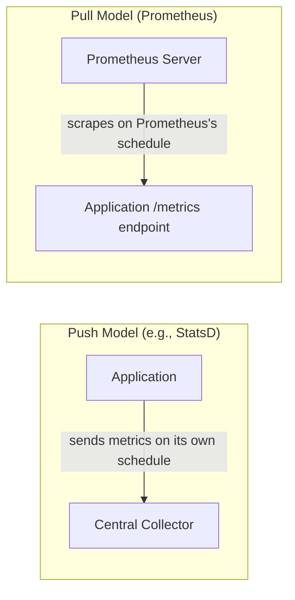

# Chapter 2 — Metrics Fundamentals

## Learning Objectives

By the end of this chapter you will be able to:

- Define what a metric is and describe the core data model: name, labels, value, timestamp
- Explain the difference between Counters, Gauges, Histograms, and Summaries, and pick the correct type for a given measurement
- Explain why raw counter values are rarely useful on their own, and why `rate()`-style calculations exist
- Define a time series precisely, in terms of a unique metric name + label combination
- Define cardinality, explain why high cardinality is dangerous, and identify a high-cardinality label before it causes a production problem
- Contrast push-based and pull-based metric collection at a conceptual level

---

## Prerequisites for This Chapter

- **Chapter 1 — Introduction to Observability** — required. This chapter assumes you already know the three pillars and the monitoring-vs-observability distinction; here we go deep on exactly one of those pillars: metrics.
- **Kubernetes Basics (Topic 8), Chapter 4 (Pods and Workloads)** — required for the cardinality discussion later in this chapter, which relies on understanding that Pods are ephemeral and are replaced (not repaired) throughout their lifecycle.

---

## 2.1 What a Metric Actually Is

A **metric** is a numeric measurement of some aspect of a system, captured at a specific point in time. On its own, a single measurement is barely useful — "there were 1,523 requests" tells you almost nothing without context. The value of metrics comes from taking the *same* measurement repeatedly, at regular intervals, which produces a **time series**: a sequence of `(timestamp, value)` pairs that lets you see trends, spikes, and drops over time.

Every metric in a system like Prometheus is identified by more than just a name — it also carries a set of key-value pairs called **labels** (sometimes called dimensions or tags elsewhere), which let you slice the same underlying measurement along multiple axes without creating a separate metric for every combination. Here is a single raw sample, in the exact text format Prometheus itself uses internally:

```
http_requests_total{method="GET", status="200", path="/api/orders"} 1523 @1700000000
```

Breaking this apart:

| Component | Value | Meaning |
|---|---|---|
| Metric name | `http_requests_total` | What is being measured — a running count of HTTP requests |
| Labels | `method="GET", status="200", path="/api/orders"` | The dimensions of this specific measurement — this count is scoped to GET requests, that returned a 200, on the `/api/orders` path |
| Value | `1523` | The measurement itself at this point in time |
| Timestamp | `@1700000000` | A Unix timestamp — when this value was recorded |

Change any label value — say, `status="500"` instead of `status="200"` — and you get a completely distinct measurement, tracked as its own independent sequence of values over time. This label-based model is what makes metrics queryable along arbitrary combinations later (full PromQL depth is Chapter 4): you can ask for "all GET requests regardless of status," or "all requests to `/api/orders` regardless of method," or the fully specific combination, all from the same underlying metric name.

---

## 2.2 The Four Core Metric Types

Not every measurement behaves the same way, and treating them all identically leads to wrong conclusions. Prometheus (and most modern metrics systems, following the same conventions) defines four fundamental metric types, each suited to a different kind of measurement.

### Counter

A **Counter** is a value that only ever goes up, or resets to zero when the process restarts. It is the right type for anything you are *counting cumulatively* — you never subtract from a counter.

- **Examples:** total HTTP requests served, total errors encountered, total bytes sent, total tasks completed.
- **Behavior:** starts at 0 when the process starts, increments with each event, and — critically — you almost never care about its raw value. You care about how fast it's increasing (covered in section 2.3).

```
# A counter that only ever increases (until the process restarts)
http_requests_total{method="POST", status="200"} 48213
```

### Gauge

A **Gauge** is a value that can go up or down freely, representing a current, instantaneous state rather than an accumulation.

- **Examples:** current memory usage, number of active database connections, queue depth right now, current temperature, number of currently logged-in users.
- **Behavior:** at any moment, it simply reflects "what is true right now" — there is no accumulation, no reset-on-restart semantics to reason about.

```
# A gauge reflecting current state — can rise and fall freely
checkout_queue_depth 42
```

### Histogram

A **Histogram** samples observations (typically durations or sizes) and sorts them into a configurable set of buckets, letting you calculate percentiles/quantiles **on the server side**, at query time, potentially across many instances at once.

- **Examples:** request duration distributions, response body size distributions.
- **Behavior:** for every observation, a histogram increments the count in every bucket whose upper bound is greater than or equal to the observed value, and Prometheus exposes three related outputs for a histogram named `http_request_duration_seconds`:

```
http_request_duration_seconds_bucket{le="0.1"} 8020
http_request_duration_seconds_bucket{le="0.5"} 8890
http_request_duration_seconds_bucket{le="1"}   8990
http_request_duration_seconds_bucket{le="+Inf"} 9000
http_request_duration_seconds_sum   4211.7
http_request_duration_seconds_count 9000
```

Here, `le` means "less than or equal to." Reading this: 8,020 of the 9,000 total observed requests finished in 0.1 seconds or less; 8,890 finished in 0.5 seconds or less; all 9,000 finished in 1 second or less (the `+Inf` bucket always equals the total count). `_sum` is the running total of all observed durations (useful for calculating an average: `_sum / _count`), and `_count` is the same as the `+Inf` bucket. From these bucket counts, a query engine can *estimate* any percentile — p50, p95, p99 — after the fact, and because each bucket is just a counter, histograms from many instances can be summed together and a percentile recalculated correctly across the whole fleet.

### Summary

A **Summary** looks similar to a histogram on the surface — it also tracks observations of durations or sizes — but it calculates configured quantiles **client-side, at scrape time, within the application itself**, rather than exposing raw bucket counts for the server to compute from later.

```
http_request_duration_seconds{quantile="0.5"} 0.042
http_request_duration_seconds{quantile="0.95"} 0.320
http_request_duration_seconds{quantile="0.99"} 0.890
http_request_duration_seconds_sum   4211.7
http_request_duration_seconds_count 9000
```

This looks convenient — the percentile is already computed for you — but it has a serious limitation: **quantiles calculated by different instances cannot be meaningfully averaged or combined.** If you have ten replicas of a service, each exposing its own client-side p99, there is no mathematically valid way to derive the fleet-wide p99 from those ten individual p99 values. A histogram's bucket counts, by contrast, are just counters — and counters can always be safely summed across instances, after which a single, correct percentile can be computed for the combined data. This is the specific, precise reason Prometheus documentation and the wider community generally recommend **histograms over summaries** for anything you expect to aggregate across multiple instances, which in a Kubernetes environment with multiple replicas is nearly always the case.

| Type | Direction | Typical Use | Aggregatable Across Instances? |
|---|---|---|---|
| **Counter** | Only up (or reset to 0) | Total requests, total errors | Yes — sum counters directly |
| **Gauge** | Up or down freely | Memory usage, queue depth, active connections | Yes — sum, average, or take min/max as appropriate |
| **Histogram** | Bucketed counts of observations | Request duration, response size, with percentiles computed server-side | Yes — bucket counts are counters, so percentiles can be recomputed correctly across instances |
| **Summary** | Pre-computed quantiles | Same use case as histogram, computed client-side | No — quantiles from separate instances cannot be validly combined |

---

## 2.3 Why You Almost Never Want a Counter's Raw Value

Here is a fact that feels counterintuitive the first time you encounter it: **you almost never care what a counter's absolute value actually is.** Knowing that `http_requests_total` currently equals `48,213` tells you almost nothing on its own — is that a lot? A little? Compared to what? What you actually care about is the **rate of change** — how fast is that number increasing right now, i.e., requests per second.

This single fact is the entire reason a function like `rate()` exists in Prometheus's query language (full depth in Chapter 4) — its whole job is to convert a monotonically increasing counter into a per-second rate over some recent time window.

Work through the intuition with concrete numbers. Suppose `http_requests_total` reads `1000` at time `T`, and `1300` sixty seconds later at time `T+60s`:

```
Δ value     = 1300 - 1000 = 300 requests
Δ time      = 60 seconds
rate        = 300 requests / 60 seconds = 5 requests/second
```

That single number — 5 req/sec — is immediately meaningful in a way the raw counter value never was: you can compare it to yesterday's traffic at the same time, alert if it drops to zero (implying the service stopped receiving traffic entirely), or graph it alongside error rate to compute a percentage. Every dashboard you will ever look at showing "requests per second" or "errors per second" is doing exactly this calculation, continuously, over a sliding time window. Chapter 4 covers `rate()` and its close relative `irate()` in full, including why the choice of time window matters.

---

## 2.4 The Time-Series Data Model

Stepping back to formalize what section 2.1 introduced informally: Prometheus (and virtually every modern metrics system built on the same principles) stores data as a collection of **time series** — where a time series is defined as one specific, unique combination of a metric name plus a complete set of label values, together with the stream of `(timestamp, value)` samples recorded for that exact combination over time.

Concretely, these are three *distinct* time series, even though they share a metric name:

```
http_requests_total{method="GET",  status="200", path="/api/orders"}
http_requests_total{method="GET",  status="500", path="/api/orders"}
http_requests_total{method="POST", status="200", path="/api/orders"}
```

Each one is tracked, stored, and queried independently. Change any single label value and you get an entirely new, independent series, starting from whatever its own history has been. This is a powerful model — it's what lets you ask "just show me the 500s" or "show me all methods combined" from the exact same instrumentation — but it directly creates the central risk metrics systems have to manage, covered next.

---

## 2.5 Cardinality: The Most Important Concept in This Chapter

**Cardinality**, in this context, means: the number of unique label value combinations that exist for a given metric — in other words, how many distinct time series one metric name actually expands into.

A metric with low cardinality (a `method` label with values `GET`/`POST`/`PUT`/`DELETE`, and a `status` label with a handful of common HTTP status codes) might expand into a few dozen time series. That's completely manageable. The danger appears when a label's possible values are effectively unbounded.

### A Concrete Before/After Example

Imagine instrumenting an API and, without thinking carefully, including the exact request path as a label:

```
# BAD — one unique time series is created for every distinct user ID ever seen
http_requests_total{path="/api/users/12345"} 1
http_requests_total{path="/api/users/12346"} 1
http_requests_total{path="/api/users/12347"} 1
... (one new series for every user who has ever hit this endpoint)
```

If this API has ten million users, this single instrumentation point can generate up to ten million independent time series — each one consuming memory in the metrics database, each one appearing separately in query results, and each one making every query against `http_requests_total` slower, because the query engine now has to scan millions of series instead of a handful. This is called **cardinality explosion**, and it is one of the most common ways a Prometheus deployment falls over in production — not from too much traffic, but from too many *distinct series*.

The fix is to template the path before it becomes a label value, collapsing the unbounded `user_id` dimension into a bounded route pattern:

```
# GOOD — bounded cardinality; one series per route pattern, not per user
http_requests_total{path="/api/users/:id"} 3021847
```

Now there is exactly one time series for this route, regardless of whether it has been hit by 10 users or 10 million — the `path` label captures "which endpoint," which is what you actually wanted to know, without capturing "which specific user," which you did not.

| Label Choice | Cardinality | Why |
|---|---|---|
| `path="/api/users/12345"` (raw path with ID) | Unbounded — grows with every new user | One series per unique user ID ever seen |
| `path="/api/users/:id"` (templated path) | Bounded — one series per route | Captures which endpoint, not which user |
| `user_id="12345"` as its own label | Unbounded | Same problem, more explicit — this pattern shows up constantly in naive instrumentation |
| `pod_ip="10.244.1.7"` as a label | Effectively unbounded in Kubernetes | Kubernetes Pods are ephemeral (Topic 8, Chapter 4) — a new Pod means a new IP, so this label churns constantly and never stops growing the total series count over the life of a cluster |

That last row matters enough to call out explicitly here, because it foreshadows a topic this course returns to in depth in Chapter 13: Kubernetes environments are especially prone to cardinality explosions, precisely because so many natural-seeming labels (Pod name, Pod IP, container ID) are recreated constantly as Pods are rescheduled, autoscaled, or rolled out during deploys. A label that looked perfectly reasonable in a world of long-lived VMs can quietly become a five-figure or six-figure cardinality problem in a Kubernetes cluster that reschedules Pods dozens of times a day.

**The rule of thumb:** a label is safe when its set of possible values is small and bounded, known in advance (HTTP methods, a fixed list of status code buckets, a fixed list of environment names). A label is dangerous when its possible values grow with your data (user IDs, session IDs, raw IP addresses, timestamps as label values, unbounded free-text fields, or anything tied to an ephemeral Kubernetes object's identity).

---

## 2.6 Cardinality Math: How Fast It Actually Multiplies

The danger in section 2.5 is easy to state abstractly but more convincing with real numbers, because cardinality does not add across labels — it **multiplies**.

Suppose you instrument an API with a single metric, `http_requests_total`, and give it three labels:

- `method` — 4 realistic values (`GET`, `POST`, `PUT`, `DELETE`)
- `status` — 6 realistic values (`200`, `201`, `400`, `401`, `404`, `500`)
- `route` — 30 distinct API routes in your application, templated correctly (as section 2.5 recommends)

The total number of time series this one metric can produce is the *product* of those possibilities, not the sum:

```
4 (method) × 6 (status) × 30 (route) = 720 possible time series
```

720 series for one metric is entirely reasonable — Prometheus handles this without any strain. Now suppose a well-meaning engineer adds a fourth label, `pod_name`, reasoning "this will help us see which replica handled which request." If the deployment runs 20 replicas at any given time, and Pods are recycled (Topic 8, Chapter 4) roughly twice a day due to rolling deploys and rescheduling, the realistic number of distinct Pod names seen over even a single week could easily reach 200 or more:

```
4 (method) × 6 (status) × 30 (route) × 200 (pod names seen this week) = 144,000 time series
```

For one metric. That is a 200x increase in stored series from adding a single label that felt harmless — and every additional metric on the same service pays the same multiplier. This is why cardinality problems tend to appear suddenly and severely rather than gradually: a single careless label addition, deployed once, can retroactively multiply every metric it's attached to, and the effect compounds further if more than one high-cardinality label is added to the same metric at once (multiplying the multipliers together). Chapter 13 returns to this exact scenario with Kubernetes-specific mitigation strategies (relabeling, metric relabeling rules, and `kube-state-metrics` configuration) once you have the Prometheus Operator (Chapter 5) in hand to apply them with.

---

## 2.7 Push vs. Pull: Two Ways to Collect Metrics

There are two fundamentally different architectural models for getting metric data out of an application and into a central system, and it's worth having the vocabulary now — full depth on why Prometheus specifically chose one of them is the subject of Chapter 3.

- **Push model.** The application itself is responsible for sending its metrics to a central collector, typically on its own schedule. **StatsD** and **Graphite** are the classic historical examples of this model: your application code calls a client library that fires off a UDP packet (StatsD) or a TCP connection (Graphite) to a known collector address every time a metric changes.
- **Pull model.** The monitoring system itself is responsible for reaching out and fetching ("scraping") metrics from each application on a fixed schedule, rather than waiting for the application to send anything. **Prometheus** uses this model exclusively for normal application metrics.



Neither model is "wrong" in the abstract, and both remain in production use across the industry today. Chapter 3 goes into precisely why Prometheus's designers chose pull, including a specific, powerful advantage it creates almost for free: a failed scrape is itself a health signal.

---

## 2.8 Metric and Label Naming Conventions

Beyond choosing the correct type and avoiding unbounded labels, there's a smaller but still important craft to naming metrics well — and Prometheus's own ecosystem has converged on strong conventions that are worth adopting from day one, rather than retrofitting later once dashboards and alerts already depend on the old names.

- **Metric names use `snake_case`** and are structured, by convention, as `<namespace>_<subsystem>_<name>_<unit>` — for example, `checkout_payment_duration_seconds` clearly signals which subsystem (`payment`, within `checkout`) and what unit (`seconds`) without needing to read any documentation.
- **Always include the unit as a suffix**, and always use base units — `_seconds` rather than `_milliseconds`, `_bytes` rather than `_megabytes`. This matters more than it sounds: PromQL functions and Grafana's unit-aware formatting both assume base units, and mixing units across metrics silently produces wrong-looking graphs and incorrect alert thresholds.
- **Counters should end in `_total`** — this is a strong, near-universal Prometheus convention (`http_requests_total`, `checkout_requests_total`), and it exists specifically so that anyone reading a metric name can immediately tell it's a Counter without checking its `# TYPE` line.
- **Label names use `snake_case`** as well, and should describe a dimension, not encode a value inside the name itself — `status="500"` is correct; a separate metric literally named `http_requests_500_total` is not, because it defeats the entire purpose of having a queryable label in the first place (recall from section 2.1 that labels exist so you can slice one metric along many dimensions, rather than hand-rolling a separate metric per value).
- **Avoid redundant information already implied by the metric name or job.** If every series for a metric only ever comes from the `checkout` service, you don't need a `service="checkout"` label repeated on every single sample — Prometheus already attaches a `job` label automatically from the scrape configuration itself (Chapter 3 covers scrape configuration in depth).

```
# GOOD — clear namespace, unit suffix, counter convention, dimension as a label
checkout_payment_duration_seconds_bucket{le="0.5", provider="stripe"} 8890
checkout_requests_total{status="success"} 48213

# BAD — value baked into the metric name instead of a label; no unit; ambiguous
checkout_500_errors 312
paymentTime 0.42
```

These conventions are not cosmetic — a badly named metric is a metric that gets misused in a PromQL query, misinterpreted on a dashboard, or duplicated by a second engineer who didn't realize an equivalent metric already existed under a different, inconsistent name. Chapter 4 assumes these conventions are already in place when it introduces PromQL functions that operate on `_total` counters and `_bucket`/`_sum`/`_count` histogram triples specifically because of this naming discipline.

---

## 2.9 Real-World Scenario: Instrumenting a Checkout Service

An engineer is asked to add observability to a checkout service that currently has none. Applying everything from this chapter, they add exactly three metrics:

```
# A Counter — total checkout attempts, labeled by outcome
checkout_requests_total{status="success"} 48213
checkout_requests_total{status="failure"} 312

# A Histogram — how long checkouts take, bucketed for percentile calculation
checkout_duration_seconds_bucket{le="0.5"}  41022
checkout_duration_seconds_bucket{le="1"}    47890
checkout_duration_seconds_bucket{le="2"}    48450
checkout_duration_seconds_bucket{le="+Inf"} 48525
checkout_duration_seconds_sum   28710.4
checkout_duration_seconds_count 48525

# A Gauge — how many checkouts are currently queued for processing
checkout_queue_depth 7
```

Each metric answers a distinct, concrete production question:

| Metric | Type | Question It Answers |
|---|---|---|
| `checkout_requests_total{status=...}` | Counter | "What's our checkout success rate?" — computed as the rate of `status="success"` divided by the rate of all statuses combined |
| `checkout_duration_seconds` | Histogram | "How slow are checkouts at the 95th percentile?" — computed from the bucket counts at query time |
| `checkout_queue_depth` | Gauge | "Is the queue backing up right now?" — read directly as a current value, no rate calculation needed |

Notice the deliberate type choices: success/failure counts only ever accumulate, so they're Counters. Duration needs percentiles and will be aggregated across many replicas, so it's a Histogram, not a Summary. Queue depth rises and falls from moment to moment, so it's a Gauge. And critically, none of these three metrics include a user ID, order ID, or any other unbounded identifier as a label — `status` has exactly two possible values, keeping cardinality trivially bounded. This is a textbook-correct, production-safe instrumentation of a single service, and the pattern generalizes directly to nearly anything you'll ever need to instrument.

---

## Best Practices

- Default to Counters for anything cumulative and Gauges for anything representing current state — resist the urge to invent a new pattern when one of the four standard types already fits.
- Prefer Histograms over Summaries whenever you might run multiple replicas of a service (which, on Kubernetes, is effectively always), because only histogram bucket counts can be validly aggregated across instances.
- Before adding any label, ask "how many distinct values could this label ever take, across the life of the system?" If the honest answer is "unbounded" or "grows with our user base," do not add it as a label — template it, bucket it, or drop it.
- Think in rates, not raw values, for every Counter you look at — a raw counter value is almost never the number you actually want to reason about.
- Name metrics consistently and include units in the name (e.g., `_seconds`, `_bytes`, `_total`) — Prometheus community conventions expect this, and Chapter 4's PromQL functions often assume it.

## Common Mistakes

- Adding a raw user ID, session ID, or Pod IP as a label "just in case it's useful later," without considering cardinality — this is the single most common way a metrics system is accidentally overwhelmed.
- Using a Gauge for something that should be a Counter (or vice versa) — for example, tracking "total errors" as a Gauge that gets reset to 0 periodically, which makes rate-of-change calculations meaningless.
- Reading a Counter's raw value directly on a dashboard and trying to interpret it without a rate calculation.
- Choosing a Summary over a Histogram out of convenience, then later discovering you cannot compute a correct fleet-wide percentile once you scale past one replica.
- Confusing "a metric" with "a time series" — forgetting that one metric name can silently represent thousands of distinct series once labels are involved.

---

## Summary

A metric is a numeric measurement, identified by a name plus a set of labels, recorded with a value and a timestamp — repeated sampling of the same metric produces a time series. Prometheus defines four core metric types: Counters (monotonically increasing, used with rate calculations rather than read directly), Gauges (freely rising and falling current-state values), Histograms (bucketed observations enabling server-side, aggregatable percentile calculations), and Summaries (client-side quantiles that cannot be validly combined across instances, which is why histograms are generally preferred). A time series is precisely defined as one unique metric-name-plus-label-set combination, and cardinality — the number of such unique combinations a metric produces — is the single most important operational concept in this chapter: unbounded labels like raw user IDs or ephemeral Kubernetes Pod IPs can silently explode a metric into millions of series, degrading memory and query performance. Metrics are collected via either a push model (the app sends data out, as StatsD does) or a pull model (the monitoring system scrapes the app, as Prometheus does) — the reasoning behind Prometheus's specific choice is the opening topic of Chapter 3.

---

## Knowledge Check

1. Given the raw sample `checkout_duration_seconds_bucket{le="1"} 8990`, explain in your own words what this line means.
2. Why is a raw counter value like `http_requests_total = 48213` nearly meaningless without additional calculation? What calculation turns it into something useful?
3. A colleague proposes adding `order_id` as a label on a `orders_processed_total` counter "so we can filter by specific order later." Explain why this is dangerous, using the term "cardinality" correctly.
4. Explain precisely why Summary quantiles cannot be correctly averaged across multiple service replicas, while Histogram bucket counts can be summed.
5. For each of the following measurements, state which of the four metric types is the correct choice, and why: (a) total number of failed login attempts, (b) current number of open file descriptors, (c) the distribution of API response sizes in bytes.
6. Define, in one or two sentences, exactly what a "time series" is in the context of this chapter.
7. A metric has 5 possible `method` values, 8 possible `status` values, and 50 templated `route` values. Calculate its maximum possible cardinality. Now recalculate it if a fourth label, `pod_name`, adds 150 realistic distinct values over a week — by what factor did cardinality increase?

---

## Hands-On Exercise

No Prometheus installation is required yet (that begins in Chapter 3) — this is a design exercise.

1. Pick an application you're familiar with (a personal project, or a hypothetical one — e.g., a URL shortener). Design exactly three metrics for it: one Counter, one Gauge, and one Histogram. For each, write out the metric name, its labels, and a one-sentence justification for why you chose that type.
2. For each label you proposed in step 1, explicitly estimate its cardinality (how many distinct values could it realistically take?). If any label is unbounded, redesign it (e.g., by templating or bucketing) so that it is bounded.
3. Using the worked example in section 2.3, calculate the rate for a counter that goes from `9,400` to `9,850` over a 30-second window. Show your work and state the final answer in requests per second.
4. Using the multiplication method from section 2.6, calculate the total possible cardinality of a metric with labels `method` (4 values), `status` (6 values), `route` (25 values), and `environment` (3 values: dev/staging/prod). Then identify which one of those four labels, if any, would be at risk of becoming unbounded in a real production system, and explain why the other three are safe.

---

## Further Reading

- prometheus.io/docs/concepts/metric_types/ — official Prometheus documentation on Counter, Gauge, Histogram, and Summary
- prometheus.io/docs/practices/naming/ — official metric and label naming conventions
- prometheus.io/docs/practices/histograms/ — deep dive on histograms vs. summaries, including the aggregation argument covered in this chapter
- prometheus.io/docs/practices/instrumentation/#use-labels — official guidance on label cardinality
- opentelemetry.io/docs/specs/otel/metrics/data-model/ — OpenTelemetry's metrics data model, useful for seeing how these same concepts generalize beyond Prometheus specifically

---

<div style="display:flex;justify-content:space-between;align-items:center;">
  <a href="./01-introduction.md">← Previous: Introduction to Observability</a>
  <a href="./00-index.md">🏠 Index</a>
  <a href="./03-prometheus-architecture.md">Next: Prometheus Architecture →</a>
</div>
