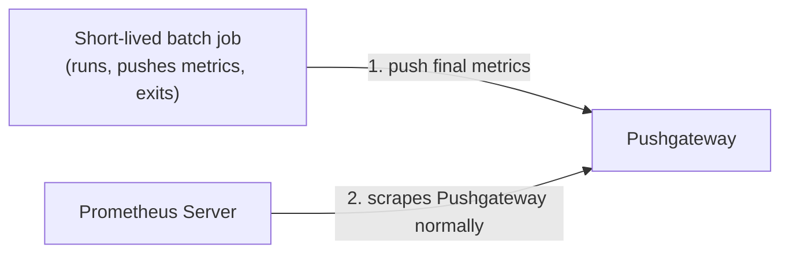
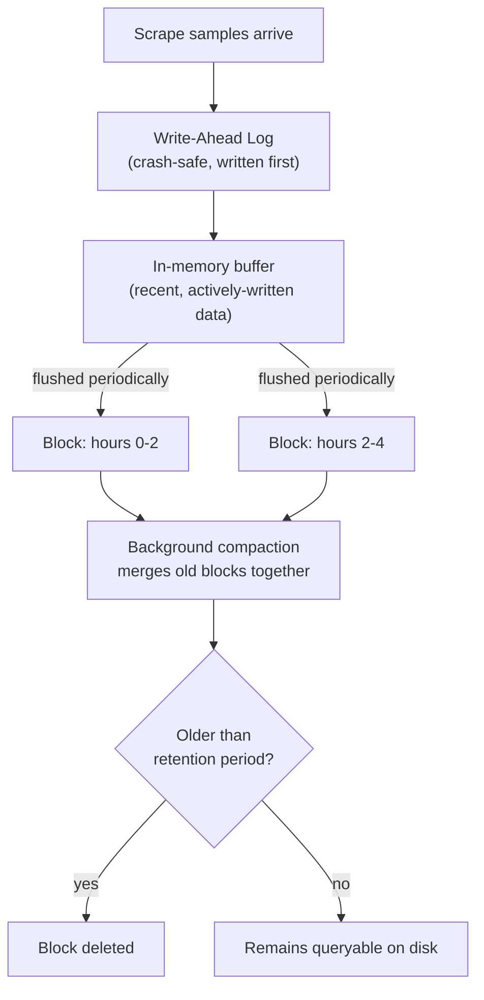
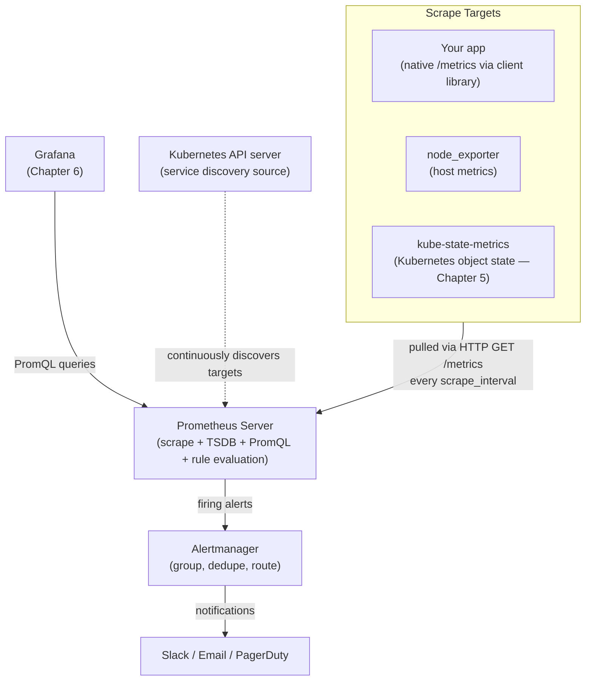

# Chapter 3 — Prometheus Architecture

## Learning Objectives

By the end of this chapter you will be able to:

- Explain the pull-based scraping model in detail, including why Prometheus chose it over the push model
- Read a raw `/metrics` endpoint response and identify counters, gauges, and histogram output
- Name and describe the role of every major Prometheus ecosystem component: the server, exporters, client libraries, Alertmanager, and Pushgateway
- Explain the narrow, specific use case for Pushgateway and why it is not a general push-metrics replacement
- Explain what service discovery solves and why static target lists don't work in Kubernetes
- Describe, at a conceptual level, how Prometheus's local TSDB stores data and why it is not meant for indefinite long-term retention
- Trace, end to end, exactly what happens during one scrape cycle

---

## Prerequisites for This Chapter

- **Chapter 2 — Metrics Fundamentals** — required. This chapter assumes fluency with metric types, labels, time series, and the push-vs-pull vocabulary introduced there.
- **Kubernetes Basics (Topic 8), Chapter 14 (Scaling and Autoscaling)** — helpful context for the service discovery section, which references autoscaling Pods as the motivating problem. Full Kubernetes-specific service discovery depth is Chapter 5 of this course.

---

## 3.1 The Pull-Based Scraping Model, in Depth

Prometheus's defining architectural decision is that it **pulls** metrics rather than waiting for applications to push them. Concretely, this means: on a fixed interval (commonly every 15 or 30 seconds), the Prometheus server sends a plain HTTP `GET` request to a `/metrics` path exposed by each application it's configured to monitor, called a **target**. The target responds with its current metrics in a simple, human-readable plain-text format, and Prometheus parses that response, attaches a timestamp, and appends every sample it finds into its local storage.

Here is what a real `/metrics` response actually looks like — this is exactly the kind of output you'd see if you ran `curl http://localhost:9100/metrics` against a running exporter:

```
# HELP http_requests_total The total number of HTTP requests processed.
# TYPE http_requests_total counter
http_requests_total{method="GET",status="200"} 8021
http_requests_total{method="POST",status="200"} 1502
http_requests_total{method="POST",status="500"} 14

# HELP process_resident_memory_bytes Resident memory size in bytes.
# TYPE process_resident_memory_bytes gauge
process_resident_memory_bytes 4.8234496e+07

# HELP http_request_duration_seconds Request duration in seconds.
# TYPE http_request_duration_seconds histogram
http_request_duration_seconds_bucket{le="0.1"} 7301
http_request_duration_seconds_bucket{le="0.5"} 8890
http_request_duration_seconds_bucket{le="1"} 9530
http_request_duration_seconds_bucket{le="+Inf"} 9537
http_request_duration_seconds_sum 1832.9
http_request_duration_seconds_count 9537
```

Every metric is preceded by two comment lines Prometheus uses for self-documentation: `# HELP` (a human-readable description) and `# TYPE` (which of the four types from Chapter 2 this metric is). This entire response is just text over plain HTTP — there is no special binary protocol, no authentication handshake beyond what you configure yourself, and nothing that requires Prometheus-specific tooling to inspect. That last point is more important than it first appears, and it's one of the reasons pull won out.

### Why Pull, Not Push?

The dominant alternative — exemplified historically by **StatsD** and **Graphite** — has applications actively send metrics outward to a collector. Prometheus's designers deliberately chose the opposite model, for three concrete, practical reasons:

1. **A failed scrape is itself a health signal.** If Prometheus tries to scrape a target and gets no response, that failure is immediately visible — Prometheus automatically exposes a metric called `up` (`1` if the last scrape succeeded, `0` if it didn't) for every target it monitors. You get "is this thing even alive?" monitoring for free, with zero extra instrumentation, purely as a side effect of the pull architecture. In a push model, if an application silently crashes and stops sending metrics, nothing distinguishes "this app is idle" from "this app is dead" — the collector simply receives no messages either way.
2. **Scrape configuration is centralized, not scattered.** In a push model, every single application needs to know the network address of the metrics collector, baked into its own configuration. Change collectors, and you must update every application. In Prometheus's pull model, the *target* doesn't need to know anything about Prometheus at all — it just exposes `/metrics` and answers whoever asks. All the configuration about which targets to scrape, how often, and with what labels lives in exactly one place: the Prometheus server's own configuration.
3. **You can debug a target exactly the way Prometheus does.** Because scraping is just an HTTP GET against a well-known path, you can reproduce it yourself, by hand, with `curl http://target:port/metrics`, and see literally the same data Prometheus would have collected. There is no way to "curl" what a push-based agent would have sent — you'd have to intercept network traffic or dig through the collector's own logs instead.

Pull is not free of tradeoffs — Prometheus needs network access *to* every target, which can be awkward across certain network topologies (e.g., reaching short-lived serverless functions, or targets behind strict firewalls) — and this is precisely the gap Pushgateway exists to fill (section 3.2).

---

## 3.2 Scrape Intervals: Choosing How Often to Ask

Before cataloging every architecture component, it's worth addressing a question every new Prometheus user asks almost immediately: how often should Prometheus actually scrape a target?

The `scrape_interval` setting controls this, and it's a genuine tradeoff, not a "smaller is always better" dial:

- **Shorter intervals (e.g., every 5-10 seconds)** give you finer-grained visibility — a brief spike lasting only a few seconds is far more likely to be captured accurately. But this comes at a real cost: more samples stored per unit of time means more disk usage and more CPU spent scraping, parsing, and compacting data, multiplied across every target you monitor.
- **Longer intervals (e.g., every 60 seconds or more)** are cheaper to store and scrape, but a brief spike can be smoothed out or missed entirely between two scrape points, and any rate calculation (section 2.3) over a short window becomes less accurate because you have fewer data points to work with.
- **A common default and reasonable starting point is 15 or 30 seconds** for most application and infrastructure metrics — frequent enough to catch meaningful trends and support reasonably responsive alerting, without the storage and CPU overhead of scraping every couple of seconds across an entire fleet.

The right choice also depends on what you're measuring: a slow-moving gauge like total disk space might be scraped far less frequently than a fast-moving one like current request latency, and Prometheus lets you configure `scrape_interval` per job, not just globally, so different targets can be scraped at different cadences based on how quickly the thing they measure actually changes.

```yaml
# Illustrating per-job scrape_interval overrides
global:
  scrape_interval: 30s        # applies to any job that doesn't override it

scrape_configs:
  - job_name: "checkout-service"
    scrape_interval: 10s      # this service's latency matters enough to sample more often
    static_configs:
      - targets: ["checkout-service:8080"]

  - job_name: "node-disk-usage"
    scrape_interval: 60s      # disk usage changes slowly; no need to scrape often
    static_configs:
      - targets: ["node-exporter:9100"]
```

---

## 3.3 Prometheus's Architecture Components

Prometheus is not one monolithic program — it's an ecosystem of small, single-purpose components that compose together. Understanding each piece's specific job prevents a common beginner confusion: assuming "Prometheus" refers to one thing that does everything.

### The Prometheus Server

This is the core: a single binary that (1) scrapes configured targets on a schedule, (2) stores the resulting samples in its own local time-series database, (3) evaluates PromQL queries against that stored data (Chapter 4), and (4) evaluates alerting and recording rules on a schedule, forwarding firing alerts to Alertmanager. All four responsibilities live in this one process.

### Exporters

Many systems you'd want to monitor — a Linux host's CPU/memory/disk, a PostgreSQL database, an Nginx server — were never written with Prometheus in mind and have no way to natively expose a `/metrics` endpoint. An **exporter** is a small, standalone HTTP server whose only job is to translate that system's existing metrics (from `/proc`, from a database's internal statistics tables, from a log file, from whatever native interface exists) into the Prometheus text format described in section 3.1.

- **`node_exporter`** — exposes host-level metrics (CPU, memory, disk, network) for any Linux machine.
- **`postgres_exporter`** — connects to a PostgreSQL instance and exposes its internal statistics (connection counts, query performance, replication lag) in Prometheus format.
- Dozens of official and community exporters exist for almost anything you'd want to monitor that doesn't speak Prometheus natively — Redis, Kafka, MySQL, HAProxy, and many more.

The exporter runs as its own separate process (often as a sidecar container in Kubernetes), sitting between the system being measured and Prometheus.

### Client Libraries

When you're instrumenting code you actually own — your own application — you don't need a separate exporter process at all. **Client libraries** (official ones exist for Go, Python, Java, Ruby, and more) let you add Prometheus instrumentation directly inside your application code: you declare a Counter, Gauge, or Histogram object in your code, increment or observe it wherever relevant, and the library automatically exposes a `/metrics` endpoint natively from within your own application process, with no separate exporter needed. The checkout service metrics from Chapter 2, section 2.7, would in practice be implemented using exactly this kind of client library.

### Alertmanager

A deliberately separate binary from the Prometheus server itself, responsible for everything that happens *after* an alerting rule fires: grouping related alerts together, deduplicating repeats, silencing known issues, and routing notifications to the right channel (email, Slack, PagerDuty). Full depth is Chapter 7 — for now, just know it exists as its own component and that Prometheus server talks to it over HTTP whenever a rule transitions into a firing state.

### Pushgateway

Pushgateway is the **deliberate, narrow exception** to Prometheus's pull-only philosophy — and it is worth being precise about exactly when it applies, because it is one of the most commonly misused components in the ecosystem.

The problem it solves: imagine a nightly batch job that runs for ninety seconds, processes a data export, and exits. If it doesn't exist by the time Prometheus's next scheduled scrape rolls around, Prometheus can never pull metrics from it — there is no long-lived process for Prometheus to scrape. Pushgateway sits in between: the short-lived job **pushes** its final metrics to the Pushgateway right before exiting, and the Pushgateway holds onto those values, exposing them on its own `/metrics` endpoint, where Prometheus scrapes the Pushgateway itself (using the normal pull model) on its usual schedule.



**This is explicitly not a general-purpose push-metrics replacement.** If you use Pushgateway to push metrics from a long-running service instead of instrumenting it with a client library and letting Prometheus scrape it directly, you lose the exact benefits described in section 3.1 — most importantly, the free `up` health signal, since Pushgateway will happily keep serving the last-pushed value forever, even if the service that pushed it has been dead for hours. Reach for Pushgateway only for genuinely short-lived, scheduled batch/cron-style jobs that would not otherwise exist long enough to be scraped — nothing else.

| Component | Runs Where | Job |
|---|---|---|
| Prometheus server | Its own process | Scrape, store, query (PromQL), evaluate rules |
| Exporter (e.g., `node_exporter`) | Alongside the system it monitors | Translate a foreign system's metrics into Prometheus format |
| Client library | Embedded inside your own app | Expose `/metrics` natively from application code, no separate process needed |
| Alertmanager | Its own separate process | Group, deduplicate, silence, and route firing alerts |
| Pushgateway | Its own separate process | Hold final metrics from short-lived batch jobs until the next scrape |

---

## 3.4 Choosing Between an Exporter and a Client Library

Section 3.2 introduced exporters and client libraries as two distinct mechanisms for getting a `/metrics` endpoint into existence, but in practice, engineers new to Prometheus often aren't sure which one applies to their situation. The deciding question is simple: **do you control and can you modify the source code of the thing you want to monitor?**

| Situation | Correct Choice | Why |
|---|---|---|
| Your own application's business logic (checkout flow, API handlers) | Client library | You can add instrumentation directly at the exact point in the code where the measurement is meaningful — e.g., incrementing a counter exactly when a checkout succeeds |
| A Linux host's CPU/memory/disk | `node_exporter` | You don't (and shouldn't) modify the Linux kernel to speak Prometheus; an exporter translates existing OS-level statistics instead |
| A third-party database (PostgreSQL, Redis, MySQL) | The matching community exporter | You typically cannot or should not modify the database's own source code, but it already exposes internal statistics through its own native interface, which an exporter reads and translates |
| A legacy internal service you can redeploy but rarely touch | Either, depending on effort | If a code change is feasible, a client library gives more precise, business-relevant metrics; if not, consider whether an existing generic exporter (e.g., one that tails logs or queries an existing internal metrics endpoint) already covers your need |

A useful mental shortcut: **exporters translate; client libraries originate.** An exporter never invents new information — it takes statistics some other system already tracks internally (via `/proc`, a database's system tables, an admin API) and reshapes them into the Prometheus text format. A client library, by contrast, lets you create entirely new measurements that only make sense in the context of your own application's logic — there is no external source `node_exporter`-style tooling could ever have translated a `checkout_duration_seconds` histogram from, because "how long did checkout take" only exists as a concept inside your own code.

---

## 3.5 Service Discovery: Keeping Up With a Moving Target List

Everything so far assumes Prometheus already knows which targets to scrape. In a static environment, that's trivial — you write down a fixed list of hostnames and ports once, and it stays accurate indefinitely. But recall from Kubernetes Basics (Topic 8, Chapter 14) that autoscaling means the number of running Pods for a service changes continuously based on load — new replicas appear, old ones disappear, and every one gets a new identity (Chapter 2 of this course already made this exact point about IP addresses and cardinality). A hardcoded scrape target list would be stale within minutes of being written.

Prometheus solves this with pluggable **service discovery (SD)** mechanisms: instead of a fixed list, you configure a *source of truth* that Prometheus continuously queries to discover the current set of valid targets, adding and removing them automatically as the underlying environment changes. Prometheus supports several SD mechanisms, selected in its configuration file:

```yaml
# prometheus.yml — illustrating several service discovery mechanisms side by side
scrape_configs:
  - job_name: "static-example"
    static_configs:
      - targets: ["localhost:9100"]          # a fixed, unchanging target — fine for stable infra

  - job_name: "file-sd-example"
    file_sd_configs:
      - files: ["/etc/prometheus/targets/*.json"]   # re-read periodically; useful for external inventory systems

  - job_name: "kubernetes-pods"
    kubernetes_sd_configs:
      - role: pod                             # continuously discovers Pods via the Kubernetes API
```

The `kubernetes_sd_config` role is the one most relevant to everything you've already learned in Topics 8 and 9: rather than watching a static list, Prometheus queries the **Kubernetes API server** directly (the same API server from Kubernetes Basics, Chapter 2) and continuously discovers the current set of Pods, Services, or Nodes matching your configuration, updating its scrape target list automatically as Pods are created, rescheduled, or terminated — with no manual intervention required, ever. This section only establishes that the mechanism exists and the problem it solves; the full Kubernetes-specific configuration (label-based target selection, relabeling rules, and the higher-level `ServiceMonitor`/`PodMonitor` custom resources that the Prometheus Operator provides on top of raw `kubernetes_sd_config`) is the entire subject of Chapter 5.

---

## 3.6 The Time-Series Database (TSDB)

Once Prometheus scrapes a target, the resulting samples need to be stored somewhere durable and queryable. Prometheus ships with its own purpose-built, embedded time-series storage engine, and understanding its basic shape prevents a very common and very costly operational mistake.

At a conceptual level:

- Data is written to disk in **blocks**, each covering a fixed time range (by default, roughly 2 hours of data per block). Recent, actively-written data lives in an in-memory buffer, periodically flushed to a new immutable block on disk.
- A **write-ahead log (WAL)** records every incoming sample before it's fully committed to a block, so that if Prometheus crashes or is restarted, it can replay the WAL and recover recent data without loss.
- Old blocks are eventually compacted together into larger blocks in the background, and blocks older than the configured retention period are deleted entirely.
- The storage format is heavily compressed — Prometheus uses a compression scheme specifically designed for time-series data (where consecutive values often change only slightly), keeping disk usage per sample remarkably small compared to a naive format.



**The key operational fact this implies:** Prometheus's local storage is explicitly **not designed for indefinite, long-term retention or multi-year historical analysis.** A commonly used default retention window is around **15 days** — configurable, but rarely pushed to years, because local disk usage and query performance both degrade as the dataset grows, and a single Prometheus server has no built-in mechanism for high availability or horizontal scaling of its storage.

For organizations that genuinely need years of retention, or the ability to run a single query across dozens of separate Prometheus servers in different clusters or regions, purpose-built solutions exist in the wider ecosystem — **Thanos**, **Cortex**, **Mimir**, or a vendor-managed long-term-storage-as-a-service offering. Each works by taking data Prometheus would otherwise delete and shipping it into cheaper, horizontally scalable long-term storage (commonly object storage like S3), while providing a unified query layer across everything. This is a genuinely advanced topic, well beyond the scope of this course — the goal here is only that you know these tools exist and roughly what problem they solve, so that "how do we keep three years of metrics history across five clusters" doesn't feel like an unsolvable question later in your career. Treat it as a pointer for future, deeper study rather than something you need to configure yourself in this course.

---

## 3.7 Full Architecture Diagram

Putting every component from this chapter together into a single picture:



Every arrow into Prometheus in this diagram is Prometheus reaching outward to pull data or discover targets — nothing pushes into Prometheus except the narrow Pushgateway exception from section 3.2, which isn't pictured here because it's deliberately the odd one out.

---

## 3.8 Debugging a Target That Won't Scrape

Every one of the mechanisms described so far gives you a specific, mechanical way to diagnose the single most common Prometheus problem you'll encounter: "my metrics aren't showing up." Rather than guessing, work through the pipeline in order.

1. **Check the `up` metric first.** Query `up{job="your-job-name"}` in Prometheus's own expression browser. If it's `0`, the scrape itself is failing — Prometheus could not successfully reach and parse the target's `/metrics` endpoint. If it's `1`, the scrape is succeeding, and your problem is somewhere else (likely a naming or label mismatch in your query, not a scraping problem at all).
2. **Check Prometheus's own Targets page** (`/targets` in the Prometheus web UI). This lists every configured target, whether its last scrape succeeded, and — critically — the exact error message if it didn't: connection refused, DNS resolution failure, TLS handshake failure, or a non-200 HTTP response.
3. **Reproduce the scrape yourself.** Exactly as section 3.1 emphasized, pull is debuggable with a plain `curl`: run `curl http://<target-address>:<port>/metrics` from a location with the same network access Prometheus has (this matters — a Pod-to-Pod curl inside the cluster is a very different test than curling from your laptop). If `curl` fails the same way Prometheus's scrape does, you've confirmed it's a network or application problem, not a Prometheus configuration problem.
4. **Check whether the target is even in Prometheus's target list at all.** If a target doesn't appear on the `/targets` page, the problem isn't a failed scrape — it's that service discovery (section 3.5) never found the target in the first place. In a Kubernetes environment, this usually means a label selector in your `kubernetes_sd_config` (or, once you reach Chapter 5, a `ServiceMonitor`'s selector) doesn't actually match the target you expect it to.
5. **If the target is scraped successfully but a specific metric is still missing from queries,** check the metric name and label spelling carefully — PromQL (Chapter 4) requires an exact match, and a metric named `checkout_requests_total` will never appear in a query for `checkout_request_total` (note the missing "s"), with no error raised, just an empty result silently returned.

```bash
# Reproduce Prometheus's scrape by hand, exactly as it would perform it
curl -s http://checkout-service.prod.svc.cluster.local:8080/metrics | grep checkout_requests_total

# Check whether Prometheus itself considers the target healthy
# (query this inside Prometheus's own expression browser, not a shell)
up{job="checkout-service"}
```

This five-step sequence — `up`, the Targets page, manual `curl`, service discovery membership, exact name/label matching — resolves the overwhelming majority of "why don't I see my metrics" problems, and it works precisely because every step maps to one specific, named piece of the architecture covered earlier in this chapter.

---

## 3.9 Real-World Scenario: One Scrape Cycle, End to End

To tie the whole chapter together operationally, walk through exactly what happens during a single, ordinary 15-second scrape cycle against one target — the `checkout-service` from Chapter 2.

1. **T+0s.** Prometheus's internal scheduler determines it's time to scrape the `checkout-service` target again, based on the `scrape_interval: 15s` configured for its job.
2. **The HTTP request.** Prometheus opens an HTTP connection to the target's address (resolved either from a static config or from Kubernetes service discovery, section 3.5) and issues `GET /metrics`.
3. **The text response.** The checkout service's embedded Prometheus client library (section 3.3) responds with its current metrics in the plain-text format shown in section 3.1 — including `checkout_requests_total`, `checkout_duration_seconds`, and `checkout_queue_depth` from Chapter 2's worked example.
4. **Parsing.** Prometheus parses that plain-text response line by line, extracting each metric name, its labels, and its current value.
5. **Timestamping and appending.** Every parsed sample is stamped with the current time (the moment of the scrape, not any timestamp the target might have included) and appended to the in-memory buffer described in section 3.6, which is simultaneously written to the write-ahead log for crash safety.
6. **Recording the scrape's own health.** Prometheus also records its own internal metric, `up{job="checkout-service", instance="..."} 1`, reflecting that this scrape succeeded — this is the free health signal discussed in section 3.1. Had the HTTP request failed or timed out, this value would be `0` instead, immediately visible to anyone querying it.
7. **T+15s.** The cycle repeats, and the new samples for `checkout_requests_total` (now a slightly higher cumulative value, since it's a Counter) are appended right alongside the previous ones, extending the time series.
8. **Later, a query arrives.** An engineer opens Grafana and asks (via PromQL, Chapter 4) for the current request rate: `rate(checkout_requests_total[1m])`. Prometheus's query engine reads back the last minute's worth of raw samples for that series from its local TSDB, computes the per-second rate exactly as demonstrated in Chapter 2 section 2.3, and returns a single number — all without the checkout service ever being aware that a query happened at all. The service's only job was to answer a `GET /metrics` request; everything downstream of that is entirely Prometheus's responsibility.

Every piece of this chapter is present in that eight-step story: the pull model (steps 2-3), the text format (step 3), the exporter/client-library distinction (the checkout service uses a client library, not a separate exporter), the free `up` health signal (step 6), the TSDB's write path (step 5), and PromQL reading it all back later (step 8).

---

## Best Practices

- Prefer client libraries over Pushgateway for any long-running service — reserve Pushgateway strictly for short-lived batch and cron jobs.
- Use Kubernetes service discovery (or the Prometheus Operator's `ServiceMonitor`/`PodMonitor` abstractions, Chapter 5) rather than hand-maintained static target lists in any dynamic environment.
- Treat the `up` metric as a first-class signal — alert on `up == 0` for critical targets, since it's the cheapest, most reliable "is this thing alive" check you'll ever get.
- Plan explicitly for retention: know your Prometheus server's configured retention window, and if you need longer-term history, evaluate Thanos/Cortex/Mimir/a managed option deliberately rather than discovering the 15-day default has already deleted data you needed.
- Reserve exporters for systems you don't control the source code of; instrument your own applications with client libraries directly instead of writing a custom exporter for them.

## Common Mistakes

- Using Pushgateway as a general-purpose metrics ingestion point for long-running services, silently losing the "is this target alive" signal that the pull model would otherwise provide for free.
- Hardcoding static scrape targets against a Kubernetes environment, then being confused when metrics silently stop appearing after a routine autoscaling event or rolling deploy.
- Assuming Prometheus's local storage is a permanent historical archive, then losing access to data older than the retention window with no long-term storage solution in place.
- Confusing an exporter (a separate translation process for a foreign system) with a client library (instrumentation embedded directly in your own application) and building the wrong one for the situation.
- Forgetting that Prometheus needs network reachability *to* every target — pull cannot work across a network boundary that blocks inbound connections to the target.

---

## Summary

Prometheus scrapes metrics by pulling them: it issues an HTTP GET against each target's `/metrics` endpoint on a fixed schedule, parses the plain-text response, and stores the resulting samples. This pull model was chosen deliberately over the historical push alternative (StatsD/Graphite) because it provides a free target-health signal (the `up` metric), centralizes scrape configuration in one place, and lets you debug any target the exact same way Prometheus does, with `curl`. The ecosystem around the core Prometheus server includes exporters (translating foreign systems like `node_exporter` for hosts or `postgres_exporter` for databases), client libraries (for instrumenting your own application code directly), Alertmanager (a separate component for routing firing alerts, Chapter 7), and Pushgateway (a narrow, deliberate exception for short-lived batch jobs only). Because dynamic environments like Kubernetes make static target lists stale almost immediately, Prometheus supports pluggable service discovery, including `kubernetes_sd_config`, with full Kubernetes-specific depth arriving in Chapter 5. Locally, Prometheus stores data in its own compressed, block-based TSDB with a write-ahead log for crash safety, but this storage is explicitly not meant for indefinite retention — a common default is around 15 days, with tools like Thanos, Cortex, and Mimir existing for genuine long-term, multi-cluster needs, a topic this course flags but does not go deep on. Every one of these pieces came together in the section 3.9 walkthrough of one 15-second scrape cycle, which is the operational heartbeat of everything Prometheus does.

---

## Knowledge Check

1. Give two concrete, specific advantages of the pull model over the push model, beyond "it's just how Prometheus does it."
2. What is the difference between an exporter and a client library? Give an example of when you'd choose each.
3. Why is Pushgateway explicitly not a general-purpose replacement for the pull model? What specific benefit do you lose if you push metrics from a long-running service through it?
4. What problem does Kubernetes service discovery solve that a static target list cannot, and why does this problem not exist (or exist far less) in a traditional data center with long-lived physical servers?
5. What is Prometheus's default local retention window roughly, and what solutions exist for organizations that need multi-year retention?
6. Walk through, in your own words, what happens between Prometheus initiating a scrape and that data becoming queryable via PromQL.
7. A target does not appear on Prometheus's `/targets` page at all. Is this a scrape failure or a service discovery problem? Explain how you'd confirm your answer.
8. Why might you configure a shorter `scrape_interval` for a checkout service's latency metrics than for a host's total disk usage? What's the cost of scraping every target as frequently as possible "just to be safe"?

---

## Hands-On Exercise

1. If you have Docker available (Topic 4), run `node_exporter` locally in a container and use `curl localhost:9100/metrics | head -50` to inspect real, raw exporter output. Identify at least one Counter, one Gauge, and (if present) one Histogram in the output, using the `# TYPE` comment lines to confirm your answer.
2. Write a minimal `prometheus.yml` scrape configuration (using the examples in sections 3.2 and 3.5 as templates) that defines two jobs: one `static_configs` job scraping `localhost:9100`, and one `job_name` of your choosing with a `scrape_interval` of `10s` instead of the default.
3. In your own words (3-5 sentences), explain to a teammate why you would never use Pushgateway to expose metrics from a normal, always-on web service, using the specific `up`-metric reasoning from this chapter.
4. Sketch (on paper or in a text file) the full architecture diagram from section 3.7 from memory, then compare it against the chapter and correct any component you misplaced or omitted.
5. Using the `node_exporter` container from step 1, deliberately stop the container, then explain (without running Prometheus) exactly what you would expect to see on Prometheus's `/targets` page and in the `up` metric if Prometheus had been configured to scrape it, using the five-step debugging sequence from section 3.8 as your reasoning framework.

---

## Further Reading

- prometheus.io/docs/prometheus/latest/getting_started/ — official Prometheus getting-started guide, including running your first scrape
- prometheus.io/docs/instrumenting/exporters/ — the official, curated list of available exporters
- prometheus.io/docs/prometheus/latest/configuration/configuration/ — full `prometheus.yml` configuration reference, including all supported `*_sd_configs`
- prometheus.io/docs/prometheus/latest/storage/ — official documentation on Prometheus's local storage engine, blocks, and retention
- prometheus.io/docs/practices/pushing/ — official guidance on exactly when (and when not) to use Pushgateway

---

<div style="display:flex;justify-content:space-between;align-items:center;">
  <a href="./02-metrics-fundamentals.md">← Previous: Metrics Fundamentals</a>
  <a href="./00-index.md">🏠 Index</a>
  <a href="./04-promql-and-querying.md">Next: PromQL and Querying →</a>
</div>
