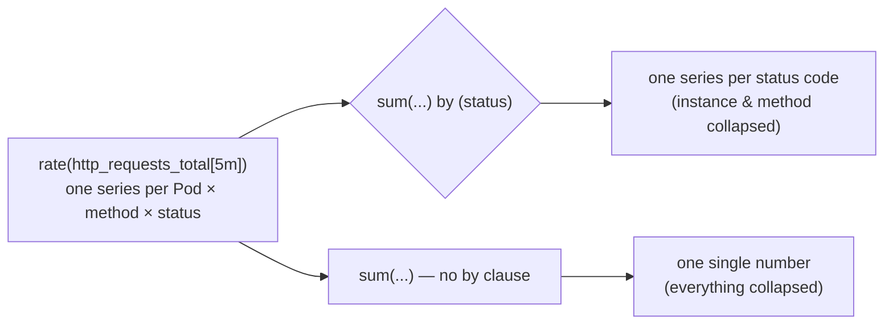

# Chapter 4 — PromQL and Querying

## Learning Objectives

By the end of this chapter, you will be able to:

- Explain PromQL's four core data types and identify which two matter for nearly all real-world queries
- Write instant vector selectors using label matchers (`=`, `!=`, `=~`, `!~`)
- Explain why raw counters should never be graphed directly, and use `rate()` and `irate()` correctly and appropriately
- Use aggregation operators (`sum`, `avg`, `max`, `min`, `count`) with `by` and `without` clauses to control which labels survive
- Calculate percentiles from a Prometheus histogram using `histogram_quantile()`
- Write comparison/threshold expressions suitable for alerting rules
- Explain the problem recording rules solve and write one

## Prerequisites for This Chapter

- Chapter 2 (Metrics Fundamentals) — counters, gauges, histograms, and the counter-reset/rate intuition introduced there
- Chapter 3 (Prometheus Architecture) — the pull-based scrape model, the TSDB, and how labels identify a time series
- Comfort reading YAML is helpful for the recording-rule example, but no new Kubernetes concepts are required in this chapter

---

## 4.1 PromQL in One Sentence, and Its Four Data Types

**PromQL (Prometheus Query Language) is the language you use to ask Prometheus's TSDB questions about the time-series data it has collected** — the same language powers three things you'll do constantly: ad-hoc exploration in the Prometheus web UI when debugging, the queries behind every Grafana dashboard panel (Chapter 6), and the expressions that define alerting rules (Chapter 7). Learning PromQL once pays off in all three places.

PromQL has four data types. In practice, two of them do almost all the work:

| Data Type | What It Is | Example | How Common |
|---|---|---|---|
| **Instant vector** | A set of time series, each with a *single* sample value, all at one timestamp | `http_requests_total` | Extremely common — the default result of most queries |
| **Range vector** | A set of time series, each with a *range* of samples over a time window | `http_requests_total[5m]` | Extremely common, but almost always immediately wrapped in a function like `rate()` |
| **Scalar** | A single, unitless numeric value with no labels | `42` | Rare on its own; mostly appears in arithmetic (`... > 100`) |
| **String** | A literal string value | `"5m"` | Essentially never appears in query results — used internally for things like range durations |

The rest of this chapter is built almost entirely around instant vectors and range vectors, because that's where essentially all real usage lives. Keep the terminology precise, though — "instant vector" and "range vector" are the words you'll see in every Prometheus error message and every piece of documentation, and mixing them up is a common source of confusion (a range vector is *not directly graphable*, as section 4.3 explains).

---

## 4.2 Instant Vector Selectors: Picking Which Series You Want

The simplest possible PromQL query is just a metric name:

```promql
http_requests_total
```

This returns an **instant vector**: every time series named `http_requests_total`, regardless of its labels, each showing its most recent value at the current time. Recall from Chapter 2 that a "time series" in Prometheus is really the combination of a metric name plus a unique set of label values — so if `http_requests_total` is being exported by three Pods with labels for `status` and `method`, this single query might return a dozen or more distinct series at once:

```
http_requests_total{instance="10.244.1.5:8080", job="api", method="GET",  status="200"}  1523
http_requests_total{instance="10.244.1.5:8080", job="api", method="GET",  status="500"}  12
http_requests_total{instance="10.244.1.6:8080", job="api", method="POST", status="200"}  844
http_requests_total{instance="10.244.1.6:8080", job="api", method="POST", status="500"}  3
```

**Label matchers** narrow this down to exactly the series you care about. PromQL supports four matcher operators, applied inside `{ }` after the metric name:

| Matcher | Meaning | Example |
|---|---|---|
| `=` | Label equals this exact string | `http_requests_total{status="500"}` |
| `!=` | Label does not equal this exact string | `http_requests_total{status!="200"}` |
| `=~` | Label matches this regular expression | `http_requests_total{status=~"5.."}` |
| `!~` | Label does not match this regular expression | `http_requests_total{status!~"2.."}` |

Concrete examples, all valid PromQL:

```promql
# Exact match: only 500-status series
http_requests_total{status="500"}

# Negative exact match: everything except 200-status series
http_requests_total{status!="200"}

# Regex match: any 5xx status code (500, 501, 503, 599, ...)
http_requests_total{status=~"5.."}

# Regex non-match: exclude anything in the 2xx range
http_requests_total{status!~"2.."}

# Combine matchers — comma is an implicit AND
http_requests_total{job="api", method="GET", status=~"5.."}
```

Regex matchers (`=~`, `!~`) are fully anchored (Prometheus implicitly wraps your pattern as `^(?:pattern)$`), so `status=~"5.."` matches exactly three characters starting with `5` for the *entire* label value — not "contains a 5 somewhere." This trips up newcomers coming from tools with unanchored regex by default; if you want "contains," you write the anchors yourself (`.*foo.*`).

---

## 4.3 Range Vector Selectors: Adding a Time Window

Appending a time duration in square brackets turns an instant vector selector into a **range vector selector**:

```promql
http_requests_total[5m]
```

This does not return one value per series anymore — it returns *every raw sample* collected for each matching series over the last 5 minutes. If Prometheus is scraping this target every 15 seconds, a `[5m]` range vector returns roughly 20 samples per series, not one.

This is exactly why **a range vector, by itself, is not something you can graph or display as a single number** — Grafana and the Prometheus UI's graph view need one value per series per point in time, not a bundle of raw samples. A range vector selector is a raw ingredient, almost always immediately passed into a function that reduces that bundle of samples back down to something graphable — most commonly `rate()` or `irate()`, covered next. If you type a bare range vector expression into the Prometheus UI's "Graph" tab, it won't render a line; you'll only see it in "Table" view as a stack of raw sample/timestamp pairs. That's the tell that you've reached for a range vector but forgotten to wrap it in a function.

Valid duration units: `s` (seconds), `m` (minutes), `h` (hours), `d` (days), `w` (weeks), `y` (years), and they can be combined (`1h30m`).

---

## 4.4 `rate()` vs. `irate()`: Turning Counters Into Something Meaningful

Chapter 2 introduced the intuition: a **counter** only ever goes up (until the process restarts and it resets to zero), so a raw counter value on its own — "14,302,981 total requests" — tells you almost nothing useful on a dashboard. What you actually want to know is *how fast* it's increasing: requests per second right now, versus an hour ago, versus during last week's incident. `rate()` and `irate()` are the two functions that convert a range vector of raw counter samples into a per-second rate — an instant vector you can actually graph.

### `rate()` — smoothed, safe for alerting and dashboards

```promql
rate(http_requests_total[5m])
```

`rate()` calculates the **per-second average rate of increase** over the entire time window, using the first and last samples in the range (with interpolation across all samples in between for accuracy). Two properties make it the correct default choice for almost everything:

1. **It automatically handles counter resets.** If the application restarted 2 minutes into this 5-minute window (the counter dropped from 14,302,981 back to 0), `rate()` detects the drop and correctly treats it as "the counter reset, not the traffic reversed" — it doesn't report a nonsensical negative rate. This is precisely the counter-reset problem Chapter 2 flagged as the reason you must never graph a raw counter directly.
2. **It smooths out noise.** Because it's averaged across the whole window, a single unusually slow or fast scrape interval doesn't dominate the result.

**Rule of thumb: always wrap a counter in `rate()` before graphing it or alerting on it — never graph `http_requests_total` directly.** A raw counter graph is always a line going up and to the right (or a sawtooth if the app restarts often) — visually useless for answering "is traffic spiking right now?"

### `irate()` — responsive, noisier, for fast-moving graphs

```promql
irate(http_requests_total[5m])
```

`irate()` uses **only the last two data points** inside the window (the range you provide is really just "look back far enough to find two samples," not "average across all of it"). This makes it far more responsive to sudden, short-lived changes — useful when you're staring at a live, high-resolution graph of something fast-moving (like network throughput on a single high-traffic interface) and want to see a spike the instant it happens.

The tradeoff is noise: because `irate()` reacts to literally the last two scrapes, it can produce a jagged, spiky graph that makes longer-term trends harder to read, and it's a poor choice for alerting rules — you don't want an alert flapping because of one noisy scrape interval.

| | `rate()` | `irate()` |
|---|---|---|
| Samples used | All samples in the window, averaged | Only the last two samples |
| Graph shape | Smooth | Jagged, spiky |
| Best for | Alerting rules, dashboards, general use | High-resolution, fast-moving graphs where you need to see instantaneous spikes |
| Counter reset handling | Yes | Yes |
| Recommended default | **Yes — use this unless you have a specific reason not to** | Situational |

**Practical guidance: reach for `rate()` by default.** Only switch to `irate()` when you are specifically debugging a fast-changing value in real time and the smoothing of `rate()` is hiding the signal you need.

---

## 4.5 Aggregation Operators: Collapsing Many Series Into Fewer

A raw `rate()` query still returns one series *per instance* (per Pod, per label combination). Often you don't want that level of detail — you want one number for "total request rate across the whole fleet," or "request rate broken down by status code, but not by individual Pod." That's what aggregation operators do.

The core aggregation operators:

| Operator | Computes |
|---|---|
| `sum()` | The sum across matching series |
| `avg()` | The average across matching series |
| `max()` | The maximum value across matching series |
| `min()` | The minimum value across matching series |
| `count()` | The number of matching series (not their values — how many series exist) |

By default, an aggregation collapses *all* labels, leaving one single number with no labels at all:

```promql
sum(rate(http_requests_total[5m]))
```

This returns exactly one time series with no labels — the total request rate across every instance, every method, every status code, everything, added together. Useful for a single "total throughput" number, but it throws away every dimension you might want to break down by.

### `by (label)` and `without (label)`: controlling what survives

Almost always, you want to keep *some* dimensions and collapse others. The `by (...)` clause says "keep only these labels, collapse everything else":

```promql
sum(rate(http_requests_total[5m])) by (status)
```

This computes the total request rate across all instances and methods, but keeps `status` as a label — the result is one series per status code:

```
{status="200"}  1842.3
{status="500"}  4.1
{status="404"}  12.7
```

Compare this directly against the fully-collapsed version from above:

```promql
sum(rate(http_requests_total[5m]))                     # one number, e.g. 1859.1 — everything collapsed
sum(rate(http_requests_total[5m])) by (status)          # broken down by status code
sum(rate(http_requests_total[5m])) by (status, method)  # broken down by status code AND method
```

The `without (...)` clause is the inverse: "collapse only these labels, keep everything else":

```promql
sum(rate(http_requests_total[5m])) without (instance)
```

This drops just the `instance` label (collapsing per-Pod detail into a fleet-wide total) while automatically keeping every *other* label the series had — `job`, `method`, `status`, and any others. `by` is an allow-list; `without` is a deny-list. In practice, `by` is more common because it's more explicit about intent and doesn't silently keep labels you forgot existed.



---

## 4.6 `histogram_quantile()`: Calculating Percentiles

This is the single most important — and most confusing to newcomers — pattern in practical PromQL, so it's worth walking through carefully from first principles.

Recall from Chapter 2 that a **histogram** metric doesn't store individual observations (like "this request took 243ms"); it stores **cumulative bucket counts** — "how many requests took less than or equal to X seconds," for a series of configured bucket boundaries. Prometheus's histogram convention names these buckets with a special label, `le` (less-than-or-equal), and exposes them as a suffixed metric name, `_bucket`. A latency histogram for an HTTP handler typically looks like this once scraped:

```
http_request_duration_seconds_bucket{le="0.1"}   842
http_request_duration_seconds_bucket{le="0.3"}   1500
http_request_duration_seconds_bucket{le="1.0"}   1980
http_request_duration_seconds_bucket{le="2.5"}   1998
http_request_duration_seconds_bucket{le="+Inf"}  2000
```

Read this as: 842 requests finished in ≤ 0.1s, 1500 requests finished in ≤ 0.3s (which necessarily includes the 842 from the bucket below — buckets are cumulative), all the way up to `+Inf`, which always equals the total request count (every request took *some* finite amount of time, which is ≤ infinity).

To compute a percentile — say, "the 95th percentile latency, p95" — from these cumulative counts, use `histogram_quantile()`:

```promql
histogram_quantile(0.95, sum(rate(http_request_duration_seconds_bucket[5m])) by (le))
```

Breaking this down piece by piece, from the inside out:

1. **`rate(http_request_duration_seconds_bucket[5m])`** — converts each bucket's raw cumulative counter into a per-second rate, exactly as in section 4.4. This is necessary because `_bucket` values are themselves counters (they only increase), so they need `rate()` just like any other counter before further math makes sense.
2. **`sum(...) by (le)`** — this step is the one beginners most often get wrong or omit. If your histogram is being scraped from multiple Pod instances, you have multiple complete sets of buckets (one set per instance), and `histogram_quantile()` needs *one* combined set of buckets across the whole fleet to compute a meaningful fleet-wide percentile. `sum(...) by (le)` adds up the rates across all instances for each bucket boundary, producing exactly one series per `le` value — which is the shape `histogram_quantile()` requires. **You must aggregate `by (le)` — and only `by (le)`, never accidentally dropping it — before calling `histogram_quantile()`, or the function has no bucket structure to interpolate across.**
3. **`histogram_quantile(0.95, ...)`** — given that combined bucket structure, this interpolates within the bucket boundaries to estimate the value below which 95% of observations fall. The `0.95` here means p95; use `0.5` for the median (p50), `0.99` for p99, and so on.

The three most common percentiles side by side:

```promql
# p50 (median) latency
histogram_quantile(0.50, sum(rate(http_request_duration_seconds_bucket[5m])) by (le))

# p95 latency
histogram_quantile(0.95, sum(rate(http_request_duration_seconds_bucket[5m])) by (le))

# p99 latency
histogram_quantile(0.99, sum(rate(http_request_duration_seconds_bucket[5m])) by (le))
```

A subtlety worth flagging honestly: because the result is interpolated *between* the configured bucket boundaries, the accuracy of `histogram_quantile()` is only as good as your bucket boundary choices. If your buckets jump from `le="0.3"` straight to `le="2.5"` with nothing in between, and your real p95 sits somewhere in that gap, the interpolation is a rough linear guess across a wide range — not a precise measurement. This is a design tradeoff of the histogram metric type itself (Chapter 2) and part of why choosing sensible bucket boundaries when instrumenting an application matters.

If you want to keep the breakdown by another label *in addition to* `le` — say, per HTTP path — include it in the `by` clause too:

```promql
histogram_quantile(0.95, sum(rate(http_request_duration_seconds_bucket[5m])) by (le, path))
```

This produces one p95 value per `path`, which is exactly the pattern used in the Real-World Scenario below.

---

## 4.7 Binary Operators and Comparisons: The Building Blocks of Alerting Expressions

PromQL supports ordinary arithmetic (`+`, `-`, `*`, `/`) and comparison operators (`>`, `<`, `==`, `!=`, `>=`, `<=`) directly between vectors, which is exactly what turns a query into a condition worth alerting on.

The canonical example — an error ratio expressed as a fraction, compared against a threshold:

```promql
rate(http_requests_total{status="500"}[5m])
  /
rate(http_requests_total[5m])
  > 0.05
```

Read this in three parts:

- `rate(http_requests_total{status="500"}[5m])` — the per-second rate of *only* 500-status responses
- Divided by `rate(http_requests_total[5m])` — the per-second rate of *all* responses
- The result is the fraction of requests that are failing; `> 0.05` filters this down to an instant vector containing *only* the series where that fraction currently exceeds 5%

When both sides of a binary arithmetic operator are vectors (as here), PromQL performs **vector matching** — it pairs up series from the left and right side that share identical labels (aside from the metric name itself), and only produces a result for pairs that match. This is why the expression above works correctly per-instance: each instance's 500-count is divided by *that same instance's* total count, not against some other instance's total. Vector matching has more advanced forms (`on (...)`, `ignoring (...)`, `group_left`/`group_right`) for cases where the label sets genuinely differ between the two sides, but the default "match on identical labels" behavior is exactly what you want for same-metric comparisons like this one, and covers the overwhelming majority of real queries.

This exact expression — an error ratio compared against a threshold — is precisely the shape of expression that becomes a Prometheus **alerting rule** in Chapter 7: "fire an alert when this condition's result is non-empty for some sustained duration." Everything in this section is the query half of alerting; Chapter 7 adds the *when to actually notify a human* half on top.

---

## 4.8 Recording Rules: Precomputing Expensive Queries

### The problem

The p95 latency query from section 4.6, or the error-ratio query from section 4.7, might look innocent as a one-off, but consider what happens once it's in real use: a Grafana dashboard panel showing it refreshes every 30 seconds, all day, for every engineer with that dashboard open. An alerting rule evaluates the same expression every 15-30 seconds, forever, whether or not anything is wrong. If the underlying `rate()`/`sum() by ()` computation is expensive — high cardinality, a long time range, many instances — you're paying that computational cost repeatedly, for a result that doesn't actually change between one 15-second evaluation and the next by much.

### The solution: precompute once, read many times

A **recording rule** runs a PromQL expression on a schedule (typically the same interval as your scrape interval, e.g., every 15-30 seconds), and saves the result as a brand-new time series with a name you choose — as if some exporter out there had been exposing that exact computed value all along. Every dashboard panel and every alerting rule that would otherwise run the expensive expression can instead just read the cheap, precomputed series.

```yaml
# recording-rules.yml
groups:
  - name: http-slos
    interval: 30s
    rules:
      - record: job:http_errors:ratio5m
        expr: |
          sum(rate(http_requests_total{status="500"}[5m])) by (job)
            /
          sum(rate(http_requests_total[5m])) by (job)
```

A few conventions worth internalizing here:

- **The naming convention `level:metric:operations`** (e.g., `job:http_errors:ratio5m`) is a widely-adopted Prometheus community convention, not a hard requirement — `job` indicates the aggregation level (per-job here), `http_errors` describes what's measured, and `ratio5m` documents both that it's a ratio and the window used. Following it makes recorded series self-documenting at a glance.
- Once this rule is loaded, querying `job:http_errors:ratio5m` directly is just as if it were a real scraped metric — you can graph it, alert on it, or aggregate it further, all without Prometheus recomputing the `rate()`/`sum()`/division underneath every time.
- Recording rules live in rule files, loaded via Prometheus's configuration (`rule_files:`) — the same mechanism used for alerting rules, which is why the two are frequently defined side by side and why Chapter 7 revisits this exact YAML shape for `alert:` rules instead of `record:` rules.

The rule of thumb for when a query is worth turning into a recording rule: if it's expensive (wide time range, high cardinality, nested aggregations) **and** it's queried repeatedly (a dashboard panel viewed constantly, or an alerting rule evaluated every interval), precompute it. A one-off ad-hoc query you type once while debugging doesn't need this — recording rules are for load-bearing, recurring queries.

---

## 4.9 Real-World Scenario: "The API Feels Slow" — A PromQL Debugging Walkthrough

An engineer reports that "the API feels slow" — vague, but it's 9am and support tickets are trickling in. Here is the realistic sequence of PromQL queries an SRE actually types, broad to narrow, using nothing but the tools built up in this chapter.

**Step 1 — is anything actually unusual with traffic volume?**

```promql
sum(rate(http_requests_total[5m]))
```

One number. Compared mentally against "what this normally looks like at 9am," this confirms whether there's a traffic spike or drop, or whether volume looks normal (pointing toward a latency or error problem rather than a load problem).

**Step 2 — is the *error rate* elevated, broken down by status code?**

```promql
sum(rate(http_requests_total[5m])) by (status)
```

If `status="500"` is near zero and `status="200"` dominates, errors aren't the story — this really is a *latency* complaint, not a *failure* complaint. That rules out one whole class of causes and focuses the next queries specifically on timing.

**Step 3 — what does overall latency actually look like, at multiple percentiles?**

```promql
histogram_quantile(0.50, sum(rate(http_request_duration_seconds_bucket[5m])) by (le))
histogram_quantile(0.95, sum(rate(http_request_duration_seconds_bucket[5m])) by (le))
histogram_quantile(0.99, sum(rate(http_request_duration_seconds_bucket[5m])) by (le))
```

Suppose p50 looks normal (150ms) but p95 has jumped from a usual 400ms to 2.1s, and p99 is worse still. This is a classic "most users are fine, but a meaningful tail is having a bad time" signature — exactly the kind of problem an average latency metric would have hidden completely, and exactly why p95/p99 matter more than averages for user-facing latency.

**Step 4 — narrow the tail-latency problem down to a specific endpoint**

```promql
histogram_quantile(0.95,
  sum(rate(http_request_duration_seconds_bucket[5m])) by (le, path)
)
```

This returns one p95 value per API path. Scanning the results, `/api/reports/export` shows a p95 of 8.4 seconds while every other path is under 300ms — the slow endpoint is found. The rest of the investigation (checking that endpoint's downstream dependencies, database query times, recent deploys) proceeds from here, but PromQL's job — going from "the API feels slow" to "specifically `/api/reports/export` has a p95 latency regression" in four queries — is done.

This progression — overall rate, then broken down by an error dimension, then percentiles, then broken down by a business dimension like endpoint — is a reusable template worth internalizing: **start broad to rule out categories of problems, then add one `by (...)` dimension at a time until the culprit is isolated.**

---

## Best Practices

- Never graph or alert on a raw counter — always wrap it in `rate()` (or `irate()` for high-resolution live graphs) first.
- Default to `rate()`; reach for `irate()` only when you specifically need to see instantaneous spikes on a live, high-resolution graph.
- Always aggregate `by (le)` immediately before calling `histogram_quantile()` — it's the single most common mistake with histograms.
- Prefer `by (...)` over `without (...)` in aggregations when practical — it's more explicit about which labels you intend to keep.
- Turn expensive, frequently-evaluated queries (dashboard panels viewed constantly, alerting rule expressions) into recording rules rather than recomputing them from scratch on every evaluation.
- Follow the `level:metric:operations` naming convention for recording rules so recorded series are self-documenting.

## Common Mistakes

- Graphing a raw counter (`http_requests_total`) directly instead of wrapping it in `rate()`, producing an always-increasing, visually useless line.
- Forgetting `sum(...) by (le)` before `histogram_quantile()`, or aggregating away the `le` label by accident, which breaks the bucket structure the function needs.
- Using `irate()` for alerting rules, producing flapping alerts driven by single noisy scrape intervals.
- Confusing unanchored "contains" regex intuition with PromQL's fully-anchored `=~` matching, writing `status=~"5"` expecting it to match `"500"` (it won't — that pattern only matches the literal single-character value `"5"`).

*(The full catalog of monitoring and alerting pitfalls is covered in Chapter 15 — Common Mistakes and Pitfalls.)*

## Summary

PromQL has four data types, but instant vectors and range vectors cover nearly all real usage. Label matchers (`=`, `!=`, `=~`, `!~`) select which series an instant vector query returns. A range vector selector (`metric[5m]`) collects raw samples over a window but isn't directly graphable — it's fed into a function like `rate()` (smoothed, counter-reset-aware, the correct default for dashboards and alerting) or `irate()` (last-two-points, more responsive but noisier, for high-resolution live graphs). Aggregation operators (`sum`, `avg`, `max`, `min`, `count`) collapse many series into fewer, and `by (...)`/`without (...)` control exactly which labels survive that collapse. `histogram_quantile()` computes percentiles from a histogram's cumulative `_bucket` series, but requires the buckets to be summed `by (le)` first so it has one combined bucket structure to interpolate across. Comparison operators (`>`, `<`, `==`) turn any of the above into a threshold condition — the exact shape used by alerting rules in Chapter 7. Recording rules precompute expensive, frequently-evaluated expressions on a schedule and save the result as a new, cheap-to-query time series.

## Knowledge Check

1. Why does typing a bare range vector expression like `http_requests_total[5m]` into the Prometheus UI's graph view fail to render a line?
2. Explain, in terms of counter resets, why `rate()` is safe to use across an application restart but a naive "last value minus first value" calculation would not be.
3. When would you deliberately choose `irate()` over `rate()`, and what's the tradeoff?
4. Write a PromQL expression that returns total request rate broken down by `method`, with `instance` and `status` collapsed. Which clause, `by` or `without`, did you use, and why?
5. Explain in your own words why `histogram_quantile()` requires its input to be aggregated `by (le)` first, and what goes wrong if you omit that aggregation.
6. What problem does a recording rule solve, and how does the naming convention `job:http_errors:ratio5m` communicate information about the rule at a glance?

## Hands-On Exercise

**Goal:** Practice the full progression of PromQL from raw counters to a recording rule, against a real running target.

1. On your local `kind` cluster (or `docker run`), deploy the Prometheus-bundled example instrumentation target, `prom/prometheus` itself as a scrape target of a second Prometheus, or any small app exposing `/metrics` with a counter and a histogram (a minimal option: deploy `quay.io/brancz/prometheus-example-app` and scrape it, which exposes `http_requests_total`-style counters and a duration histogram out of the box).
2. In the Prometheus UI's **Graph** tab, first query the raw counter directly and observe the always-increasing line. Then query `rate(<counter>[5m])` against the same metric and compare the shapes.
3. Write and run an aggregation query using `sum(...) by (...)` on a label the metric exposes, and compare it against the fully-collapsed `sum(...)` with no `by` clause.
4. If your target exposes a `_bucket` histogram, compute p50, p95, and p99 using `histogram_quantile()`, remembering the `sum(...) by (le)` step. Deliberately omit the `by (le)` once to see what error or empty result you get, so you recognize that failure mode in the future.
5. Write a recording rule YAML file defining `job:http_errors:ratio5m` (or an equivalent name for whatever metric you have available), load it into your Prometheus configuration's `rule_files:`, reload Prometheus, and confirm the new series appears when you query its name directly.

## Further Reading

- [Prometheus Docs — Querying Basics](https://prometheus.io/docs/prometheus/latest/querying/basics/)
- [Prometheus Docs — Query Functions (`rate`, `irate`, `histogram_quantile`)](https://prometheus.io/docs/prometheus/latest/querying/functions/)
- [Prometheus Docs — Recording Rules](https://prometheus.io/docs/prometheus/latest/configuration/recording_rules/)
- [Robust Perception — Irate vs Rate](https://www.robustperception.io/irate-and-rate/)
- [Prometheus Docs — Histograms and Summaries](https://prometheus.io/docs/practices/histograms/)

---

<div style="display:flex;justify-content:space-between;align-items:center;">
  <a href="./03-prometheus-architecture.md">← Previous: Prometheus Architecture</a>
  <a href="./00-index.md">🏠 Index</a>
  <a href="./05-prometheus-on-kubernetes.md">Next: Prometheus on Kubernetes →</a>
</div>
