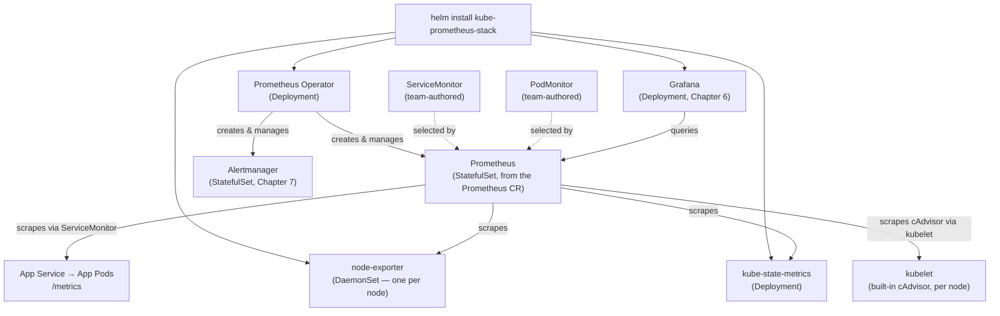

# Chapter 5 — Prometheus on Kubernetes

## Learning Objectives

By the end of this chapter, you will be able to:

- Explain why the Prometheus Operator is the standard way to run Prometheus on Kubernetes, rather than hand-rolling a Deployment/ConfigMap yourself
- Describe what `ServiceMonitor` and `PodMonitor` Custom Resources do and write a `ServiceMonitor` for your own application
- Explain how the Operator's CRD-driven scrape configuration is Kubernetes service discovery under the hood
- Install and lightly customize the `kube-prometheus-stack` Helm chart
- Clearly distinguish `node-exporter`, `kube-state-metrics`, and `cAdvisor` — what each one measures and why none of them is redundant with the others
- Describe the full architecture of a monitoring stack running on a real Kubernetes cluster

## Prerequisites for This Chapter

- Chapter 3 (Prometheus Architecture) — the pull-based scrape model and Kubernetes service discovery concept, which this chapter makes concrete
- Chapter 4 (PromQL and Querying) — you'll be querying the metrics this stack produces
- Advanced Kubernetes, Chapter 5 (Custom Resources and Operators) — this chapter assumes you already know what a CRD and an Operator are; the Prometheus Operator was named there as a real-world Operator example, and this chapter is that example in full
- Kubernetes Basics, Chapter 13 (Helm and Package Management) — `kube-prometheus-stack` is installed via Helm
- Kubernetes Basics, Chapter 12 (StatefulSets, DaemonSets, and Jobs) — the DaemonSet pattern, referenced again for `node-exporter`

---

## 5.1 Recap: Two Threads This Chapter Ties Together

Two things you've already learned are about to become concrete, real infrastructure instead of abstractions:

1. **Advanced Kubernetes, Chapter 5** introduced the Operator pattern — a CRD defines a new object *kind*, and an Operator is a controller that watches instances of that kind and reconciles real cluster state to match. That chapter named the **Prometheus Operator** as one of the flagship real-world examples, alongside cert-manager and CloudNativePG, without going into its specifics. This chapter *is* those specifics.
2. **Chapter 3 of this course** explained that Prometheus discovers scrape targets dynamically via **service discovery** rather than a static, hand-maintained list of IP addresses — because Pods in Kubernetes are ephemeral and constantly rescheduled with new IPs. This chapter shows you exactly how that service discovery is configured in practice: not by editing a central `prometheus.yml` scrape config by hand, but through two Custom Resources the Prometheus Operator provides.

Put together: **the Prometheus Operator is what lets Kubernetes-native service discovery be configured declaratively, per-application, via CRDs — instead of centrally, via a static config file every team has to request an edit to.**

---

## 5.2 Why Install Prometheus *Via* an Operator, Not By Hand

You could, in principle, deploy Prometheus on Kubernetes the way you'd deploy any stateful application using only Topic 8 primitives: a `StatefulSet` for Prometheus itself (for stable storage across restarts), a `ConfigMap` holding `prometheus.yml`, a `Service` to expose its UI/API, and a `Secret` for any credentials. This works, technically. It is also exactly the situation Advanced Kubernetes Chapter 5 warned against: hand-rolling infrastructure that a mature, purpose-built Operator already manages far more robustly.

Consider what actually needs to happen as your Prometheus deployment matures:

- **Config reload** — every time a new scrape target needs to be added, `prometheus.yml` must change and Prometheus must reload it (a `SIGHUP` or an API call) without dropping data. Hand-rolled setups often need a sidecar just for this.
- **Sharding** — a single Prometheus instance eventually can't handle the scrape volume of a large cluster; splitting scrape load across multiple Prometheus instances (sharding) while keeping queries and alerting consistent is nontrivial to hand-manage.
- **Upgrades** — bumping the Prometheus version safely, especially with `StatefulSet` storage involved, benefits from an Operator that understands Prometheus's specific upgrade semantics rather than a generic rolling update.
- **Coordinating with Alertmanager** — Prometheus and Alertmanager (Chapter 7) need to discover each other and stay in sync as either scales.

The **Prometheus Operator** encodes all of this operational knowledge as software, exactly the framing from Advanced Kubernetes Chapter 5: you no longer author a `StatefulSet` and a `ConfigMap` — you author a small `Prometheus` Custom Resource describing *what you want* (how many replicas, how much retention, which rule files, which scrape targets to select), and the Operator's controller reconciles the actual `StatefulSet`, generates the actual `prometheus.yml` from your selectors, and manages reloads, sharding, and upgrades on your behalf.

```yaml
# A Prometheus Custom Resource — you write this, not a hand-rolled StatefulSet
apiVersion: monitoring.coreos.com/v1
kind: Prometheus
metadata:
  name: platform
  namespace: monitoring
spec:
  replicas: 2
  retention: 15d
  serviceMonitorSelector: {}      # select ServiceMonitors — see 5.3
  podMonitorSelector: {}          # select PodMonitors — see 5.3
  resources:
    requests:
      cpu: 500m
      memory: 2Gi
```

Applying this one object causes the Operator to create and manage an actual `StatefulSet` running Prometheus underneath — you never write that `StatefulSet` yourself, and you're not expected to; that's precisely the "don't reinvent an Operator" principle in practice.

---

## 5.3 `ServiceMonitor` and `PodMonitor`: Declarative Scrape Configuration

This is the Operator's most important contribution for day-to-day use, and it's what makes the service-discovery concept from Chapter 3 fully concrete on Kubernetes.

Without the Operator, telling Prometheus to scrape a new application means editing a central `scrape_configs:` block in `prometheus.yml` — a file one team (usually platform/SRE) owns, that every other team has to request a change to whenever they ship a new service with a `/metrics` endpoint. That's a bottleneck, and it doesn't scale past a handful of teams.

The Operator solves this with two CRDs that let **application teams declare their own scrape configuration, next to their own application's manifests**, with no edits to any central file:

| CRD | Selects | Use When |
|---|---|---|
| **`ServiceMonitor`** | Kubernetes `Service` objects, by label selector | The normal case — your app already has a stable `Service` in front of its Pods (which it should, per Kubernetes Basics) |
| **`PodMonitor`** | `Pod` objects directly, by label selector | No stable `Service` exists for the thing you want scraped, or you need to scrape Pods that aren't behind a single Service (e.g., scraping each replica of a headless-Service-backed StatefulSet individually) |

### A full, annotated `ServiceMonitor`

Suppose a team has a `Deployment` and a `Service` for their app, and the app exposes Prometheus-format metrics on `/metrics` at port `8080`:

```yaml
apiVersion: v1
kind: Service
metadata:
  name: orders-api
  namespace: team-checkout
  labels:
    app: orders-api
spec:
  selector:
    app: orders-api
  ports:
    - name: http-metrics
      port: 8080
      targetPort: 8080
---
apiVersion: monitoring.coreos.com/v1
kind: ServiceMonitor
metadata:
  name: orders-api
  namespace: team-checkout
  labels:
    release: platform          # must match the Prometheus CR's serviceMonitorSelector
spec:
  selector:
    matchLabels:
      app: orders-api           # selects the Service above by its labels
  endpoints:
    - port: http-metrics        # must match the Service's named port, not a raw number
      path: /metrics
      interval: 30s
```

Walking through what each part actually does:

- `spec.selector.matchLabels` tells the Operator *which Kubernetes Services* this `ServiceMonitor` cares about — here, any `Service` labeled `app: orders-api` in the same namespace. This is a label selector, the exact same mechanism Kubernetes Basics used for connecting Services to Pods — just one layer up, connecting a `ServiceMonitor` to a `Service`.
- `spec.endpoints[].port` references the Service's **named port** (`http-metrics`), not a raw port number — the Operator resolves the name to find the actual port to scrape on each of the Service's backing Pods.
- `spec.endpoints[].path` and `.interval` map directly to what would otherwise be a `scrape_configs` entry's `metrics_path` and `scrape_interval` in raw Prometheus configuration.
- The `release: platform` label on the `ServiceMonitor` itself matters for a different reason: it's how the `Prometheus` Custom Resource from section 5.2 finds *this* `ServiceMonitor` in the first place, via its own `serviceMonitorSelector`.

**Tie this back to Chapter 3 directly: this entire mechanism *is* Kubernetes service discovery.** A raw Prometheus `kubernetes_sd_config` scrape config (what Chapter 3 described happening under the hood) watches the Kubernetes API for Services/Pods matching certain criteria and dynamically updates its scrape target list as Pods come and go. A `ServiceMonitor` achieves the exact same dynamic, label-driven discovery — the Operator's controller watches for `ServiceMonitor` objects, and for each one, generates the equivalent `kubernetes_sd_config` scrape block and reloads Prometheus automatically. You get all the benefits of dynamic service discovery, expressed as a small Kubernetes object living next to your application's own manifests instead of a line item in someone else's config file.

A `PodMonitor` looks almost identical, but selects Pods directly instead of going through a Service:

```yaml
apiVersion: monitoring.coreos.com/v1
kind: PodMonitor
metadata:
  name: orders-worker
  namespace: team-checkout
  labels:
    release: platform
spec:
  selector:
    matchLabels:
      app: orders-worker      # selects Pods by label directly, no Service involved
  podMetricsEndpoints:
    - port: metrics
      path: /metrics
```

---

## 5.4 The `kube-prometheus-stack` Helm Chart

In practice, almost nobody installs the Prometheus Operator alone and then hand-assembles everything around it. The overwhelmingly standard path — tying directly back to Kubernetes Basics Chapter 13's Helm chapter — is the **`kube-prometheus-stack`** Helm chart (maintained by the `prometheus-community` chart repository), a single batteries-included package that bundles:

- The **Prometheus Operator** itself (the controller from sections 5.2–5.3)
- A **`Prometheus`** Custom Resource instance, already wired up and running
- **Alertmanager** (Chapter 7), also deployed and managed via its own Operator-provided CRD
- **Grafana** (Chapter 6), pre-installed with a Prometheus data source already configured
- **`kube-state-metrics`** (section 5.5)
- **`node-exporter`**, deployed as a DaemonSet (section 5.5)
- A large set of **pre-built dashboards and `PrometheusRule` alerting rules** covering cluster health out of the box — node resource usage, Pod restart loops, API server latency, etcd health, and more, so you start from a working baseline instead of a blank slate

```bash
helm repo add prometheus-community https://prometheus-community.github.io/helm-charts
helm repo update

helm install platform prometheus-community/kube-prometheus-stack \
  --namespace monitoring --create-namespace
```

A brief `values.yaml` customization, following exactly the override pattern from Kubernetes Basics Chapter 13 — specify only what differs from the chart's defaults:

```yaml
# values.yaml — kube-prometheus-stack customization
prometheus:
  prometheusSpec:
    retention: 30d
    storageSpec:
      volumeClaimTemplate:
        spec:
          accessModes: ["ReadWriteOnce"]
          resources:
            requests:
              storage: 50Gi
    # By default the chart's Prometheus CR only picks up ServiceMonitors
    # matching its own release label — this widens it to any ServiceMonitor
    # in the cluster, useful when many independent teams add their own
    serviceMonitorSelectorNilUsesHelmValues: false

grafana:
  persistence:
    enabled: true
    size: 10Gi
```

```bash
helm upgrade --install platform prometheus-community/kube-prometheus-stack \
  --namespace monitoring --create-namespace \
  -f values.yaml
```

`helm upgrade --install`, exactly as Kubernetes Basics Chapter 13 recommended, is the idempotent form you'd actually run from CI/CD — safe whether this is the first install or the hundredth upgrade.

---

## 5.5 `node-exporter` vs. `kube-state-metrics` vs. `cAdvisor`

This is one of the most common points of confusion for anyone new to Kubernetes observability, and it's worth getting precisely right now — Chapter 13 revisits it in more depth, but the core distinction belongs here, at first introduction.

All three expose Prometheus-format metrics, all three are commonly scraped in every Kubernetes cluster, and all three sound vaguely like "metrics about the cluster" — but they answer entirely different questions, and none of them is redundant with the others.

| | **`node-exporter`** | **`kube-state-metrics`** | **`cAdvisor`** |
|---|---|---|---|
| Answers | "How healthy is this **machine**?" | "What does the **Kubernetes API** say about object state?" | "How much **resource** is this **container** actually using?" |
| Data source | The host OS directly (`/proc`, `/sys`) | The Kubernetes API server (watches objects, does not touch containers at all) | The kubelet, which tracks each container's cgroup |
| Example metrics | `node_cpu_seconds_total`, `node_memory_MemAvailable_bytes`, `node_disk_io_time_seconds_total`, `node_filesystem_avail_bytes` | `kube_pod_status_phase`, `kube_deployment_status_replicas` vs. `kube_deployment_spec_replicas`, `kube_pod_container_status_ready` | `container_cpu_usage_seconds_total`, `container_memory_working_set_bytes` |
| Deployment shape | DaemonSet — one per node | Single Deployment (cluster-wide) | Built into the kubelet — no separate deployment needed |
| Powers | Host-level dashboards, disk/CPU/memory capacity planning | "Is my Deployment actually at desired replica count?", Pod-pending alerts, crash-loop detection | `kubectl top pod` (Kubernetes Basics, Chapter 14) and per-container resource dashboards |

Concretely: if a Pod is stuck in `Pending` because the scheduler can't place it, **`node-exporter` has no idea this is happening at all** — it only knows about host CPU/memory/disk, not Kubernetes objects. **`kube-state-metrics`** is what exposes `kube_pod_status_phase{phase="Pending"}`, because it watches the Kubernetes API directly rather than any machine or container. Meanwhile, if a *running* container's memory usage is climbing toward its limit and about to get OOM-killed, that's **`cAdvisor`**'s `container_memory_working_set_bytes` — a live measurement of the container's actual cgroup, not a fact about Kubernetes object state or the host machine as a whole.

**`node-exporter` as a DaemonSet is a textbook use case straight out of Kubernetes Basics Chapter 12** — you want exactly one instance running on every node, no more, no fewer, automatically added or removed as nodes join or leave the cluster. This is precisely the pattern DaemonSets exist for, and `kube-prometheus-stack` deploys `node-exporter` as one by default, no manual configuration required.

`cAdvisor` is a special case in this table because it isn't deployed at all — it's built directly into the kubelet on every node, and Prometheus scrapes it via the kubelet's own metrics endpoint rather than a separate Pod. It's the same underlying data source that powers `kubectl top pod`, so if you've ever wondered "where does `kubectl top` actually get its numbers from," the answer is: the same cAdvisor data Prometheus is also scraping.

---

## 5.6 The Full Stack, End to End



Reading this left to right: one `helm install` produces the Operator plus a running Prometheus, Alertmanager, Grafana, `kube-state-metrics`, and `node-exporter` — nothing hand-assembled. From there, every application team adds a `ServiceMonitor` (or `PodMonitor`) alongside their own Deployment, and Prometheus discovers and scrapes it automatically, with zero edits to any file the platform team owns.

---

## 5.7 Real-World Scenario: Zero-Central-Config Onboarding

A platform team installs `kube-prometheus-stack` via Helm into a dedicated `monitoring` namespace — the shared observability namespace pattern that echoes Advanced Kubernetes Chapter 6's multi-tenancy model: one namespace, owned by the platform team, that every other team's application gets scraped into without living inside it.

```bash
helm install platform prometheus-community/kube-prometheus-stack \
  -n monitoring --create-namespace \
  -f values.yaml
```

Three months later, the `team-checkout` product team ships a new service, `orders-api`, and wants its custom `/metrics` endpoint (request counts, latency histograms, and a business metric — orders processed) picked up by monitoring. They do not file a ticket with the platform team. They do not touch anything in the `monitoring` namespace. They add exactly one small object alongside their existing Deployment and Service, inside their *own* namespace:

```yaml
apiVersion: monitoring.coreos.com/v1
kind: ServiceMonitor
metadata:
  name: orders-api
  namespace: team-checkout
  labels:
    release: platform
spec:
  selector:
    matchLabels:
      app: orders-api
  endpoints:
    - port: http-metrics
      path: /metrics
```

```bash
kubectl apply -f orders-api-servicemonitor.yaml -n team-checkout
```

Within one Prometheus scrape-config reload cycle (the Operator handles this automatically — no restart, no manual reload command), `orders-api`'s metrics start flowing into the shared Prometheus, queryable with everything from Chapter 4, and available to build a dashboard on in Chapter 6. The platform team's central configuration — the `Prometheus` Custom Resource itself — never changed. This is the payoff of the entire CRD-driven model: **onboarding a new service to monitoring is a self-service action for the team that owns it, not a centrally-gated one.**

---

## Best Practices

- Install Prometheus on Kubernetes via the Prometheus Operator (typically through `kube-prometheus-stack`), not a hand-rolled `StatefulSet`/`ConfigMap` — let the Operator own config reloads, sharding, and upgrades.
- Let application teams own their own `ServiceMonitor`/`PodMonitor` objects alongside their Deployments — treat central `prometheus.yml` edits as a smell, not the norm.
- Start from `kube-prometheus-stack`'s bundled dashboards and alerting rules rather than a blank slate; customize incrementally instead of rebuilding cluster-health monitoring from scratch.
- Set an explicit `retention` and storage size for Prometheus rather than accepting silent defaults that may not match your cluster's actual metric volume.
- Remember `node-exporter`, `kube-state-metrics`, and `cAdvisor` answer different questions — don't expect one to substitute for another when debugging.

## Common Mistakes

- Hand-building a Prometheus Deployment/ConfigMap instead of using the Operator, then reinventing config-reload and upgrade logic the Operator already solves.
- Forgetting the `release` label (or whatever label the `Prometheus` CR's selector expects) on a `ServiceMonitor`, so it's silently never picked up despite being valid YAML.
- Referencing a `ServiceMonitor` endpoint by raw port number instead of the Service's named port, causing scrape failures.
- Assuming `node-exporter` metrics will tell you about Pod scheduling problems, when that's `kube-state-metrics`'s job, not the host-level exporter's.
- Not setting `serviceMonitorSelectorNilUsesHelmValues: false` (or an equivalent selector) when multiple teams need their `ServiceMonitors` picked up beyond the chart's own default scope.

*(The full catalog of Kubernetes observability pitfalls is covered in Chapter 15 — Common Mistakes and Pitfalls, and Chapter 13 — Observability for Kubernetes.)*

## Summary

Running Prometheus on Kubernetes means installing it via the **Prometheus Operator** rather than hand-rolling the underlying `StatefulSet` — the exact "don't reinvent an Operator" principle from Advanced Kubernetes Chapter 5, applied to Prometheus itself. The Operator provides two CRDs, **`ServiceMonitor`** (selects Services by label) and **`PodMonitor`** (selects Pods directly), that let application teams declare their own scrape configuration next to their own manifests — this is Kubernetes service discovery (Chapter 3) expressed declaratively through CRDs instead of a central, hand-edited config file. The **`kube-prometheus-stack`** Helm chart is the standard way most teams install this whole stack in one shot: the Operator, a running Prometheus, Alertmanager, Grafana, `kube-state-metrics`, and `node-exporter`, plus pre-built dashboards and alerting rules. `node-exporter` (host/OS metrics, deployed as a DaemonSet), `kube-state-metrics` (Kubernetes object state, from the API server), and `cAdvisor` (per-container resource usage, built into the kubelet) each answer a different question and are all necessary, not redundant.

## Knowledge Check

1. What operational tasks does the Prometheus Operator take over that you would otherwise have to hand-manage with a raw `StatefulSet`?
2. What is the difference between a `ServiceMonitor` and a `PodMonitor`, and when would you reach for the latter?
3. Explain how a `ServiceMonitor` relates to the Kubernetes service discovery concept introduced in Chapter 3 — what is the Operator doing under the hood when it sees a new `ServiceMonitor`?
4. Name the five to six major components bundled by the `kube-prometheus-stack` Helm chart.
5. A Pod is stuck in `Pending`. Which of `node-exporter`, `kube-state-metrics`, or `cAdvisor` would actually surface this, and why would the other two be silent about it?
6. Why is `node-exporter` deployed as a DaemonSet specifically, rather than a Deployment with multiple replicas?

## Hands-On Exercise

**Goal:** Install `kube-prometheus-stack` on a local `kind` cluster and onboard a sample application with a self-authored `ServiceMonitor`.

1. Create a `kind` cluster if you don't already have one: `kind create cluster --name monitoring-lab`.
2. Add the `prometheus-community` Helm repo and install `kube-prometheus-stack` into a `monitoring` namespace, following section 5.4. Confirm with `kubectl get pods -n monitoring` that Prometheus, Alertmanager, Grafana, `kube-state-metrics`, and `node-exporter` Pods are all `Running`.
3. Confirm `node-exporter` is running as a DaemonSet with one Pod per node: `kubectl get daemonset -n monitoring`.
4. Deploy a small sample app that exposes Prometheus metrics on `/metrics` (e.g., `quay.io/brancz/prometheus-example-app`) with its own `Deployment` and `Service`, into a separate namespace like `demo-app`.
5. Write and apply a `ServiceMonitor` for it, following the pattern in section 5.3, remembering the label the chart's `Prometheus` CR expects (check `kubectl get prometheus -n monitoring -o yaml` and inspect `spec.serviceMonitorSelector` to confirm which label to use).
6. Port-forward to Prometheus (`kubectl port-forward -n monitoring svc/platform-kube-prometheus-prometheus 9090:9090`) and confirm your app's target shows up and is `UP` under **Status → Targets** in the Prometheus UI.
7. Query one of your app's metrics directly in the Prometheus UI to confirm end-to-end scraping is working, then clean up with `kind delete cluster --name monitoring-lab` if you're done.

## Further Reading

- [Prometheus Operator Documentation](https://prometheus-operator.dev/docs/getting-started/introduction/)
- [kube-prometheus-stack Helm Chart (Artifact Hub)](https://artifacthub.io/packages/helm/prometheus-community/kube-prometheus-stack)
- [Prometheus Operator — `ServiceMonitor` API Reference](https://prometheus-operator.dev/docs/api-reference/api/#monitoring.coreos.com/v1.ServiceMonitor)
- [kube-state-metrics Documentation](https://github.com/kubernetes/kube-state-metrics)
- [Prometheus Node Exporter](https://github.com/prometheus/node_exporter)

---

<div style="display:flex;justify-content:space-between;align-items:center;">
  <a href="./04-promql-and-querying.md">← Previous: PromQL and Querying</a>
  <a href="./00-index.md">🏠 Index</a>
  <a href="./06-grafana-and-visualization.md">Next: Grafana and Visualization →</a>
</div>
