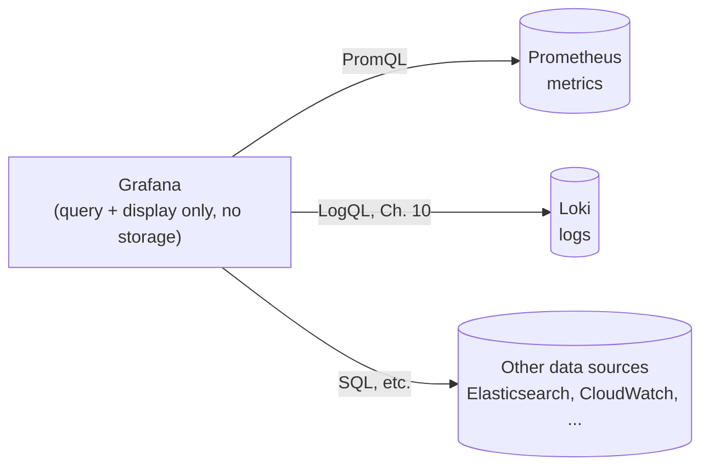
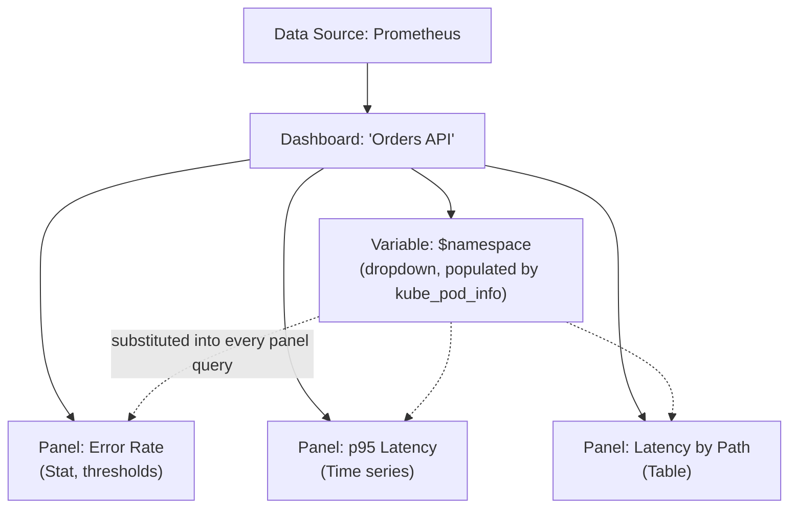

# Chapter 6 — Grafana and Visualization

## Learning Objectives

By the end of this chapter, you will be able to:

- Explain precisely what Grafana is and is not — a query-and-display layer, not a storage system
- Define Grafana's core concepts: data source, dashboard, panel, and variable
- Build a first dashboard from scratch, using PromQL queries from Chapter 4 as panel content
- Choose an appropriate visualization type (time series, stat, gauge, table) for a given kind of data
- Explain why dashboards should be defined as code and version-controlled, not only built through the UI
- Provision a Grafana dashboard automatically in Kubernetes via a labeled ConfigMap
- Organize dashboards with folders and permissions, and use annotations to correlate deploys with metric changes
- Describe the relationship — and the important difference — between Grafana-managed alerting and Prometheus Alertmanager

## Prerequisites for This Chapter

- Chapter 4 (PromQL and Querying) — every panel example in this chapter reuses queries built there
- Chapter 5 (Prometheus on Kubernetes) — `kube-prometheus-stack` already installs Grafana with a Prometheus data source pre-configured; this chapter builds on that installation
- Advanced Kubernetes, Chapter 8 (GitOps principles) — referenced when discussing dashboards-as-code
- Kubernetes Basics familiarity with ConfigMaps

---

## 6.1 What Grafana Is — and Is Not

**Grafana is a visualization and dashboarding layer that queries data sources and renders the results — it stores no metrics, logs, or traces of its own.** This is worth stating plainly and early, because it's the single most common misconception for anyone new to the tool: Grafana is not a database, not a monitoring agent, and not a replacement for Prometheus. It is purely a *query-and-display* layer sitting on top of systems that actually store data.

Prometheus is the most common data source Grafana talks to, and it's the one this chapter focuses on, but Grafana is explicitly designed to be data-source-agnostic. The same Grafana instance can simultaneously visualize:

- **Prometheus** — metrics (this chapter)
- **Loki** — logs, queried with LogQL (foreshadowing Chapter 10 of this course)
- Many others in the wider ecosystem — Elasticsearch, InfluxDB, cloud-provider metrics (CloudWatch, Azure Monitor), and plain SQL databases

The practical consequence: if Prometheus, or the underlying TSDB, goes down, **Grafana has nothing left to show** — it has no local copy of your metrics. Grafana's dashboards are only as available and only as historically deep as the data sources feeding them. This single fact also explains why alerting has a subtlety worth flagging early and revisiting properly in section 6.5: an alert that depends on Grafana being up to fire is a weaker guarantee than one that doesn't.



---

## 6.2 Core Concepts: Data Source, Dashboard, Panel, Variable

Four terms make up nearly all of Grafana's vocabulary.

| Concept | What It Is | Analogy |
|---|---|---|
| **Data source** | A configured connection to a backend that Grafana can query (URL, auth, query language) | A database connection string |
| **Dashboard** | A named collection of panels, arranged on a grid, usually focused on one system or team | A single "screen" in a monitoring tool |
| **Panel** | One visualization — backed by one or more queries against one or more data sources | A single chart or number on that screen |
| **Variable** | A dashboard-level, user-selectable parameter (a dropdown) that's substituted into every panel's query at once | A single filter that reruns every chart on the page |

A **data source** is configured once, pointing at a Prometheus instance's URL (typically the in-cluster Service, e.g., `http://platform-kube-prometheus-prometheus.monitoring.svc:9090`, when `kube-prometheus-stack` from Chapter 5 has already deployed both). Every dashboard and panel that follows queries through this one connection.

A **variable** is what makes a single dashboard reusable across many teams or many namespaces instead of needing a hand-copied dashboard per team. Once a dashboard defines a variable — say, `$namespace`, populated by a PromQL query like `label_values(kube_pod_info, namespace)` (using `kube-state-metrics` from Chapter 5) — every panel on that dashboard can reference `$namespace` directly inside its own query:

```promql
sum(rate(http_requests_total{namespace="$namespace"}[5m]))
```

Whoever is viewing the dashboard picks a namespace from a dropdown at the top of the page, and **every panel** on the dashboard re-queries using that selection simultaneously — one dashboard definition, parameterized per viewer, instead of one dashboard copy per team.

---

## 6.3 Building a First Dashboard

Walking through the actual steps, assuming Grafana is already running (via `kube-prometheus-stack` from Chapter 5, which pre-configures a Prometheus data source for you automatically):

**Step 1 — confirm the data source.** Under **Connections → Data sources**, you should already see a `Prometheus` entry pointing at the in-cluster Prometheus Service. If you were setting this up manually rather than via the Helm chart, you'd click **Add data source**, choose **Prometheus**, and supply its URL — that's the entire manual setup.

**Step 2 — create a new dashboard, add a panel.** A new panel starts with a query editor where you type PromQL directly. Reusing Chapter 4's error-ratio expression as a first real panel:

```promql
sum(rate(http_requests_total{status="500"}[5m]))
  /
sum(rate(http_requests_total[5m]))
```

**Step 3 — choose a visualization type appropriate to the data.** This choice should follow directly from what kind of value the query produces:

| Query Produces | Appropriate Visualization | Why |
|---|---|---|
| A rate over time, one or more series (e.g., `rate(...)` broken down `by (status)`) | **Time series** graph | You want to see the trend and shape over time, and compare multiple series as lines |
| A single current value (e.g., "current error rate right now") | **Stat** panel | A single, ideally large, number — this is a "what's true right now" question, not a trend question |
| A single current value against known thresholds (e.g., error rate with green/yellow/red zones) | **Gauge** | Same as Stat, but visually communicates how close the value is to a threshold |
| Many rows of categorical data (e.g., p95 latency broken down `by (path)` across a dozen endpoints) | **Table** | Easiest to scan many discrete values side by side, sortable |
| Distribution across buckets (e.g., raw histogram bucket data) | **Heatmap** | Visualizes how the bulk of observations are distributed across the histogram's `le` buckets over time |

For the error-ratio query above, a **Stat** panel showing "current error rate" as a single percentage, with thresholds colored green under 1%, yellow 1–5%, red above 5%, communicates the at-a-glance health signal far better than a plotted line would for this particular use case. For the p95 latency query from Chapter 4 tracked over the last few hours, a **Time series** panel is the natural choice — you want to see whether latency is trending up, not just its current value.

```promql
histogram_quantile(0.95, sum(rate(http_request_duration_seconds_bucket[5m])) by (le))
```

as a **Time series** panel immediately shows whether p95 has been climbing over the last hour — exactly the shape of investigation from Chapter 4's Real-World Scenario, now visible continuously on a dashboard instead of typed ad hoc during an incident.

**Step 4 — add the variable.** Under the dashboard's **Settings → Variables**, define `namespace` as a query variable sourced from `label_values(kube_pod_info, namespace)`, then update each panel's query to include `{namespace="$namespace"}`. The dashboard now has a dropdown at the top, and every panel reacts to it together.



---

## 6.4 Dashboards-as-Code

### Why hand-built dashboards don't scale

A dashboard built entirely by clicking through Grafana's UI has the same fundamental weakness raw, hand-edited Kubernetes YAML had before Helm (Kubernetes Basics, Chapter 13): it lives only inside one running Grafana instance's database, it's not versioned, and there's no record of *why* a panel was changed or who changed it. If that Grafana instance (or its underlying database/PVC) is ever lost — a cluster rebuild, a botched upgrade, an accidental namespace deletion — every dashboard anyone ever hand-built through the UI is gone with it, with no way to recover it except institutional memory of "I think the error-rate panel used this query..."

### The fix: dashboards as versioned JSON

A Grafana dashboard, in its entirety, is just a JSON document — panels, queries, layout, variables, thresholds, all of it. Grafana's UI has a **"Export → Export as JSON"** option (or a "View JSON" / dashboard settings JSON model) that produces exactly this document. Once it's JSON, it's just a file, and files belong in Git:

```json
{
  "title": "Orders API — Golden Signals",
  "uid": "orders-api-golden-signals",
  "templating": {
    "list": [
      {
        "name": "namespace",
        "type": "query",
        "query": "label_values(kube_pod_info, namespace)"
      }
    ]
  },
  "panels": [
    {
      "title": "Error Rate",
      "type": "stat",
      "targets": [
        {
          "expr": "sum(rate(http_requests_total{status=\"500\", namespace=\"$namespace\"}[5m])) / sum(rate(http_requests_total{namespace=\"$namespace\"}[5m]))"
        }
      ]
    }
  ]
}
```

This is precisely the same reasoning that led you to GitOps for Kubernetes manifests in Advanced Kubernetes Chapter 8: **the manifest describing desired state should live in Git as the single source of truth, and the running system should be a reflection of what's in Git — not the other way around, with Git as an afterthought export of whatever someone happened to click together.** Dashboards should live in Git for exactly the same reasons Deployments and Services do: reviewable diffs, a rollback path, and a record that survives a cluster rebuild.

The good news, tying directly back to Chapter 5: **you are not starting from a blank slate.** `kube-prometheus-stack` already ships a large library of pre-built dashboards (cluster overview, per-node resource usage, API server health, and more) as part of the chart itself — these already exist as JSON, already live in the chart's own Git repository, and are provisioned automatically the moment you install the chart. Dashboards-as-code isn't an exotic practice you have to introduce yourself from scratch; the stack you already installed in Chapter 5 is already doing it for its own bundled dashboards. Your job is to extend that same discipline to the dashboards *your* teams build on top.

---

## 6.5 Provisioning Dashboards via Kubernetes ConfigMaps

The common, Kubernetes-native pattern for actually deploying dashboard JSON automatically — without anyone manually importing a file through the Grafana UI — is: store the dashboard JSON inside a `ConfigMap`, label it in a way Grafana's sidecar container recognizes, and let the sidecar watch for such ConfigMaps and load them into Grafana automatically. `kube-prometheus-stack`'s Grafana deployment ships with exactly this sidecar (based on the `k8s-sidecar` project) already configured and watching by default.

```yaml
apiVersion: v1
kind: ConfigMap
metadata:
  name: orders-api-dashboard
  namespace: monitoring
  labels:
    grafana_dashboard: "1"        # the label the sidecar watches for
data:
  orders-api-dashboard.json: |
    {
      "title": "Orders API — Golden Signals",
      "uid": "orders-api-golden-signals",
      "panels": [
        {
          "title": "Error Rate",
          "type": "stat",
          "targets": [
            { "expr": "sum(rate(http_requests_total{status=\"500\"}[5m])) / sum(rate(http_requests_total[5m]))" }
          ]
        }
      ]
    }
```

```bash
kubectl apply -f orders-api-dashboard-configmap.yaml
```

Within seconds, the Grafana sidecar notices the new `ConfigMap` (it's watching the API for anything labeled `grafana_dashboard: "1"`, the exact same label-selector-driven pattern used by `ServiceMonitor`/`PodMonitor` in Chapter 5), reads the JSON out of `data`, and pushes it into Grafana via its provisioning API — no one ever opened the Grafana UI to import anything by hand. This closes the loop on section 6.4's dashboards-as-code goal in a fully Kubernetes-native way: the dashboard JSON lives in a Git repository as a `ConfigMap` manifest, gets applied by whatever GitOps tool deploys the rest of the cluster's manifests, and Grafana picks it up automatically — the exact "no manual config-edit" philosophy Chapter 5 established for `ServiceMonitor`-based scrape configuration, now applied to dashboards instead of scrape targets.

---

## 6.6 Organizing Dashboards: Folders, Permissions, and Annotations

As the number of dashboards grows past a handful, two more Grafana features become necessary rather than optional.

**Folders** group related dashboards together and are the natural unit for access control — a `team-checkout` folder holding that team's golden-signals dashboard, a `platform` folder holding cluster-overview dashboards, and so on. Folder-level permissions let a platform team keep cluster-wide dashboards editable only by platform engineers while giving individual teams edit access to their own folder, without needing per-dashboard permission management as the count climbs into the dozens or hundreds.

**Annotations** overlay discrete events — a deployment, an incident start/end, a feature flag flip — directly on top of time series graphs, which turns "latency went up" into "latency went up, and look, that's exactly when the 2:15pm deploy landed." Annotations can be added manually by clicking a graph, but the more valuable pattern is automated: a CI/CD pipeline (Topic 5) calls Grafana's annotation API as its final deploy step, so every dashboard automatically gets a vertical marker at every deploy, with no human remembering to add it.

```bash
# A CI/CD pipeline step posting a deploy annotation to Grafana after a successful rollout
curl -X POST http://grafana.monitoring.svc:3000/api/annotations \
  -H "Authorization: Bearer $GRAFANA_API_TOKEN" \
  -H "Content-Type: application/json" \
  -d '{
        "text": "Deployed orders-api v1.8.2",
        "tags": ["deploy", "orders-api"],
        "time": '"$(date +%s000)"'
      }'
```

The next time someone opens the p95 latency panel from section 6.3 and sees a spike, the deploy annotation sitting right on top of that spike answers "did we just ship this?" before anyone has to go check a deployment log separately — correlating cause and effect directly on the same graph the on-call engineer is already looking at.

---

## 6.7 Grafana-Managed Alerting vs. Prometheus Alertmanager

Grafana ships its own built-in alerting engine — **Grafana-managed alerts** — capable of evaluating queries against any configured data source on a schedule and firing notifications, entirely independent of Prometheus's own alerting rule mechanism. It's a legitimate option, and some teams standardize on it deliberately, particularly teams that want every alert *and* every dashboard managed through one single UI, or teams whose alerting conditions span multiple, heterogeneous data sources (not just Prometheus) that only Grafana can query uniformly.

That said, the more common and generally recommended default — and the path this course teaches in full in Chapter 7 — is **Prometheus alerting rules evaluated by Prometheus itself, routed through Alertmanager**, for one structural reason worth stating plainly: **alerts should fire even if Grafana itself is down.** Section 6.1 already established that Grafana holds no data of its own and is purely a display layer on top of Prometheus; if Grafana-managed alerting is your only alerting path and the Grafana Pod crashes, restarts, or is mid-upgrade, your alerting capability degrades along with it, even though Prometheus itself — and the conditions you actually care about detecting — may be perfectly healthy. Keeping alert *evaluation* inside Prometheus (which is already the system continuously scraping and storing the data the alert depends on) removes Grafana as an additional point of failure in the alerting path.

This chapter does not go deeper into either alerting mechanism's configuration — that's the entirety of Chapter 7's scope — but the decision worth carrying forward is: **Prometheus rules + Alertmanager as the primary, most resilient path; Grafana-managed alerting as a legitimate complement or alternative for teams who have a specific reason to want a single UI.**

---

## 6.8 Real-World Scenario: Three Dashboard Tiers, Standardized Across a Platform

A platform team, having onboarded a dozen product teams onto the shared `kube-prometheus-stack` from Chapter 5, notices dashboards sprawling in inconsistent, ad-hoc directions — some teams have excellent dashboards, others have none, and no two look alike. They standardize on exactly three tiers:

**Tier 1 — Cluster overview**, taken directly from `kube-prometheus-stack`'s own bundled dashboards, unmodified. Node resource usage, API server health, etcd status — this is infrastructure-level and applies identically to everyone, so there's no reason to customize it per team.

**Tier 2 — Per-team "golden signals" dashboard**, built as a single reusable *template* that every team customizes only by supplying their own `$namespace` variable. The four panels map directly onto the **four golden signals** from Google's SRE book — a naming worth knowing explicitly, since it's the industry-standard vocabulary for "what should every service's dashboard show, at minimum":

| Golden Signal | What It Measures | Example Panel Query |
|---|---|---|
| **Latency** | How long requests take | `histogram_quantile(0.95, sum(rate(http_request_duration_seconds_bucket{namespace="$namespace"}[5m])) by (le))` |
| **Traffic** | How much demand the service is under | `sum(rate(http_requests_total{namespace="$namespace"}[5m]))` |
| **Errors** | Rate of failed requests | `sum(rate(http_requests_total{namespace="$namespace", status=~"5.."}[5m])) / sum(rate(http_requests_total{namespace="$namespace"}[5m]))` |
| **Saturation** | How "full" the service's resources are (CPU/memory relative to limits) | `sum(container_memory_working_set_bytes{namespace="$namespace"}) / sum(kube_pod_container_resource_limits{namespace="$namespace", resource="memory"})` |

Every team's dashboard has the identical four-panel layout; only the `$namespace` variable's selected value differs, meaning a platform engineer jumping between teams' dashboards during an incident sees the same shape of information every time, in the same place, regardless of which team's service is on fire.

**Tier 3 — a dashboard-as-code Git repository**, holding every dashboard's JSON as a file, each wrapped in the labeled-`ConfigMap` pattern from section 6.5, deployed to the cluster by the same GitOps pipeline that deploys everything else (Advanced Kubernetes, Chapter 8). A new team onboarding no longer means "go click together a dashboard and hope you remember what queries you used" — it means copying the golden-signals template file, changing the namespace default, and opening a pull request.

The platform team also organizes all of this into matching **folders**: a `Platform` folder (Tier 1, editable only by the platform team), and one folder per product team (Tier 2, editable by that team, viewable by everyone). Deploy annotations (section 6.6) are wired into every team's CI/CD pipeline automatically as part of the same shared `internal/web-service` Helm chart referenced in Kubernetes Basics Chapter 13 — so the moment a new team adopts that chart for deployment, they get deploy markers on their golden-signals dashboard for free, with no extra integration work.

Six months later, when a new team joins the platform, onboarding to observability is no longer a multi-day exercise in learning PromQL and Grafana panel configuration from scratch — it's copying one dashboard template, filling in one variable default, and opening a pull request. The three-tier structure also pays off during incidents: any engineer, regardless of which team they normally work on, can jump into an unfamiliar team's dashboard during an on-call escalation and immediately know where to look, because the golden-signals layout is identical everywhere.

---

## Best Practices

- Treat Grafana strictly as a query-and-display layer — never assume dashboards will survive if the underlying data source (Prometheus) is unavailable.
- Use variables (`$namespace`, `$pod`, etc.) to build one reusable dashboard template per pattern, instead of one hand-copied dashboard per team.
- Match visualization type to the shape of the data: time series for trends, stat/gauge for a single current value, table for many categorical rows, heatmap for bucketed distributions.
- Export dashboards as JSON and store them in Git — provision them via labeled ConfigMaps (or an equivalent Operator-based mechanism) rather than manual UI imports.
- Start from `kube-prometheus-stack`'s bundled dashboards rather than rebuilding cluster-health visualizations from scratch.
- Default to Prometheus alerting rules + Alertmanager as your primary alerting path; treat Grafana-managed alerting as a deliberate choice, not a default, given Grafana's own uptime dependency.

## Common Mistakes

- Believing Grafana stores historical metrics itself, and being surprised when a Prometheus outage or retention limit also erases what a Grafana dashboard can show.
- Building dashboards entirely through the UI with no JSON export or Git history, then losing them permanently in a cluster rebuild.
- Choosing a time series graph for a single "current value" panel (or vice versa — a stat panel for a trend) instead of matching visualization type to the question being asked.
- Hardcoding a namespace or Pod name into a panel's query instead of using a dashboard variable, producing a dashboard that only works for one team.
- Relying solely on Grafana-managed alerts for critical conditions without considering that Grafana itself being down silences them.

*(The full catalog of monitoring and dashboarding pitfalls is covered in Chapter 15 — Common Mistakes and Pitfalls.)*

## Summary

Grafana is a visualization and dashboarding layer that queries data sources like Prometheus (and, later in this course, Loki for logs) — it stores no data of its own, so its dashboards are only as available as the systems feeding them. Its core concepts are the data source (a configured backend connection), the dashboard (a collection of panels), the panel (one visualization backed by a query), and the variable (a dashboard-level dropdown that parameterizes every panel's query at once). Building a first dashboard means adding a data source, writing a PromQL query (reusing patterns from Chapter 4), and choosing a visualization type that matches the data's shape — time series for trends, stat/gauge for single current values, table for categorical breakdowns. Dashboards should be treated as code: exported as JSON, stored in Git, and provisioned automatically — commonly via a labeled `ConfigMap` that a Grafana sidecar watches and loads, mirroring the GitOps principles from Advanced Kubernetes Chapter 8 and the label-selector-driven pattern from Chapter 5's `ServiceMonitor`. Grafana has its own built-in alerting engine as an alternative to Prometheus Alertmanager, but most teams keep Prometheus + Alertmanager as the primary alerting path specifically so alerts keep firing even if Grafana itself is down.

## Knowledge Check

1. Why is it inaccurate to describe Prometheus as "part of Grafana," and what actually happens to your dashboards if Prometheus becomes unreachable?
2. Define, in one sentence each, a data source, a dashboard, a panel, and a variable.
3. You have a PromQL query returning a single current error-rate percentage, and another returning a time series of p95 latency over the last six hours. Which visualization type suits each, and why?
4. Explain the reasoning connecting GitOps for Kubernetes manifests (Advanced Kubernetes, Chapter 8) to the practice of storing Grafana dashboards as JSON in Git.
5. Describe the ConfigMap-based dashboard provisioning pattern: what label does the Grafana sidecar look for, and what does it do once it finds a matching ConfigMap?
6. Why do most teams keep Prometheus alerting rules + Alertmanager as their primary alerting mechanism rather than relying solely on Grafana-managed alerts?
7. What problem do annotations solve on a time series panel, and how would you automate adding one from a CI/CD pipeline rather than clicking it in manually?

## Hands-On Exercise

**Goal:** Build a variable-driven dashboard on top of the `kube-prometheus-stack` installation from Chapter 5's exercise, then provision it as code via a ConfigMap.

1. If you don't already have it running, complete Chapter 5's Hands-On Exercise to have `kube-prometheus-stack` and a sample app with a `ServiceMonitor` running on a local `kind` cluster.
2. Port-forward to Grafana (`kubectl port-forward -n monitoring svc/platform-grafana 3000:80`) and log in (default `kube-prometheus-stack` credentials are `admin` / `prom-operator` unless you changed them).
3. Create a new dashboard. Add a `namespace` variable using a query like `label_values(kube_pod_info, namespace)`.
4. Add three panels using your sample app's metrics and the `$namespace` variable: a **Stat** panel for a current rate or ratio, a **Time series** panel for a rate or latency percentile over time, and a **Table** panel breaking a metric down by a label.
5. Export the dashboard as JSON (dashboard settings → JSON Model, or the export option), save it to a file, and wrap it in a `ConfigMap` manifest labeled `grafana_dashboard: "1"` as shown in section 6.5.
6. Delete the dashboard from the Grafana UI entirely, then `kubectl apply` your ConfigMap and confirm the sidecar automatically reloads it into Grafana within a few seconds — proving the dashboard now lives as code, not only as UI state.
7. Using Grafana's annotation API (or the UI's "Add annotation" on a graph, if you don't want to script the API call), add a manual annotation marking "simulated deploy" on your time series panel, and confirm it renders as a vertical marker on the graph.

## Further Reading

- [Grafana Documentation — Introduction](https://grafana.com/docs/grafana/latest/introduction/)
- [Grafana Documentation — Dashboards and Panels](https://grafana.com/docs/grafana/latest/dashboards/)
- [Grafana Documentation — Templates and Variables](https://grafana.com/docs/grafana/latest/dashboards/variables/)
- [Grafana Documentation — Provisioning](https://grafana.com/docs/grafana/latest/administration/provisioning/)
- [Google SRE Book — Monitoring Distributed Systems (The Four Golden Signals)](https://sre.google/sre-book/monitoring-distributed-systems/)

---

<div style="display:flex;justify-content:space-between;align-items:center;">
  <a href="./05-prometheus-on-kubernetes.md">← Previous: Prometheus on Kubernetes</a>
  <a href="./00-index.md">🏠 Index</a>
  <a href="./07-alerting-and-alertmanager.md">Next: Alerting and Alertmanager →</a>
</div>
