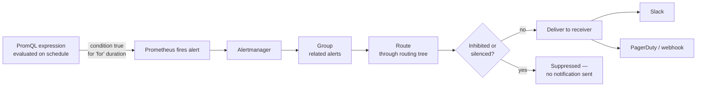

# Chapter 7 — Alerting and Alertmanager

## Learning Objectives

By the end of this chapter, you will be able to:

- Write a Prometheus alerting rule with `expr`, `for`, `labels`, and `annotations`, and explain why each field exists
- Explain the distinct responsibilities Alertmanager owns: grouping, routing, silencing, and inhibition
- Configure a routing tree that sends different alerts to different receivers based on labels
- Configure notification receivers for Slack and a generic webhook (representing paging tools like PagerDuty/Opsgenie)
- Define alert fatigue precisely and apply the core discipline that prevents it
- Diagnose and fix a noisy on-call rotation using grouping, inhibition, `for` durations, and routing

---

## Prerequisites for This Chapter

- PromQL syntax and aggregation operators — Chapter 4 (this chapter wraps PromQL expressions in alerting rules)
- The Prometheus Operator and `ServiceMonitor`/`PodMonitor` — Chapter 5
- Grafana dashboards and data sources — Chapter 6 (alerting and dashboards are two different consumers of the same metrics)
- General comfort reading YAML

---

## 7.1 From PromQL Expression to Fired Alert

Chapter 4 showed you how to write a PromQL expression that identifies a bad condition — for example, an HTTP error ratio above 5%:

```promql
sum(rate(http_requests_total{status=~"5.."}[5m]))
  /
sum(rate(http_requests_total[5m]))
  > 0.05
```

Run that query in Grafana's Explore view and you get a number back. That's useful for a human staring at a dashboard, but it does nothing while nobody is looking. An **alerting rule** is what turns a PromQL expression into something Prometheus itself watches continuously, on your behalf, forever — evaluating the expression on a schedule (typically every 15–30 seconds, tied to your `evaluation_interval`) and taking action the moment it becomes true.

The action Prometheus takes is deliberately narrow: when an alerting rule's condition is met, Prometheus generates an **alert** — a lightweight record with a name, labels, and annotations — and pushes it to **Alertmanager**, a separate component with its own separate job. Prometheus's responsibility ends at "this condition is true." Alertmanager's responsibility is everything that happens next: deciding whether this is the tenth alert about the same underlying problem (dedupe it), whether it should be bundled with forty related alerts into one notification (group it), which human or channel should be told (route it), whether someone has already acknowledged this exact situation (silence it), and whether a bigger, related alert already covers it (inhibit it).

This separation matters architecturally: Prometheus stays simple and fast at the one job it's good at (continuously evaluating time-series expressions), while Alertmanager owns the considerably more complicated, more human-facing job of turning "a condition became true" into "the right person got notified in the right way, exactly once."



---

## 7.2 Writing a Prometheus Alerting Rule

Alerting rules live in a `PrometheusRule` custom resource (Chapter 5's Prometheus Operator pattern) or a plain rule file, grouped under `groups`. Here is a complete, annotated example:

```yaml
apiVersion: monitoring.coreos.com/v1
kind: PrometheusRule
metadata:
  name: api-alerts
  namespace: monitoring
  labels:
    release: kube-prometheus-stack   # so the Operator picks this rule up
spec:
  groups:
    - name: api.rules
      rules:
        - alert: HighErrorRate
          expr: |
            sum(rate(http_requests_total{status=~"5..", job="checkout-api"}[5m]))
              /
            sum(rate(http_requests_total{job="checkout-api"}[5m]))
              > 0.05
          for: 5m
          labels:
            severity: critical
            team: checkout
          annotations:
            summary: "Checkout API error rate is {{ $value | humanizePercentage }}"
            description: >
              The checkout-api 5xx error rate has been above 5% for 5 minutes.
              Current value: {{ $value | humanizePercentage }}. Check recent
              deploys and the checkout-api Grafana dashboard.
```

Field by field:

- **`expr`** — the PromQL expression from Chapter 4. This is the entire "what counts as bad" definition; everything else in the rule is about what to do once it's true.
- **`for`** — the duration the expression must remain continuously true before Prometheus actually fires the alert. This is one of the most important fields in this chapter, and it exists for one reason: **a single noisy sample should not page anyone.** A 15-second blip where error rate spiked because of a deploy's rolling restart, then immediately recovered, is not an incident — without `for`, Prometheus would fire (and Alertmanager would notify) on that blip anyway. `for: 5m` means the condition has to be genuinely sustained, not a momentary flicker, before anyone is bothered.
- **`labels`** — arbitrary key-value pairs attached to the fired alert. These aren't decorative — Alertmanager's entire routing and inhibition system operates by matching on these labels. `severity: critical` here is what a routing rule later matches against to decide "this goes to PagerDuty."
- **`annotations`** — human-readable text, not used for routing/matching, but for making the notification actually useful to the person receiving it. `summary` is the short one-liner (what shows in a Slack message title or a pager's headline); `description` is the longer one, often templated with `{{ $value }}` (the actual number the expression evaluated to) so the recipient sees "error rate is 8.2%," not just "error rate is high" — a concrete number is what lets someone triage severity at 3 AM without opening a dashboard first.

You can confirm firing/pending alerts directly against Prometheus's own UI or API:

```bash
kubectl port-forward -n monitoring svc/prometheus-operated 9090:9090
# then visit http://localhost:9090/alerts — rules show as Inactive, Pending, or Firing
# "Pending" = expr is true but the "for" duration hasn't elapsed yet
```

---

## 7.3 Alertmanager's Job, Broken Into Pieces

Alertmanager receives a stream of fired alerts from one or more Prometheus instances and applies four distinct, composable transformations before anything reaches a human.

### Grouping — one notification, not fifty

If a bad deploy causes 50 Pods across a Deployment to crashloop simultaneously, Prometheus's per-Pod alerting rule fires 50 separate alerts, nearly simultaneously. Without grouping, that's 50 pages. Nobody needs 50 pages to learn about one bad deploy — they need one page that says "50 Pods are crashlooping, here's the list."

`group_by` tells Alertmanager which labels define "the same underlying issue" — alerts sharing those label values get bundled into a single notification:

```yaml
route:
  group_by: ['alertname', 'namespace']
  group_wait: 30s        # wait this long after the FIRST alert in a group, to catch siblings
  group_interval: 5m     # wait this long before sending a notification about NEW alerts added to an existing group
  repeat_interval: 4h    # if the group is still firing, resend a reminder notification this often
```

`group_wait: 30s` matters in the crashloop example specifically: the very first Pod alert fires and starts a 30-second window during which Alertmanager waits to see if more alerts join the same group before sending anything — that's what turns "50 individual pages arriving over 2 minutes" into "one page listing all 50, sent after a brief pause to let them all show up."

### Routing — the right alert to the right receiver

A **route tree** is a set of matching rules, evaluated top-down, that decides which **receiver** (Slack channel, PagerDuty service, webhook) an alert is delivered to, based on its labels:

```yaml
route:
  receiver: default-slack          # fallback if nothing more specific matches
  group_by: ['alertname', 'namespace']
  routes:
    - match:
        severity: critical
      receiver: pagerduty-oncall
      continue: false               # stop evaluating further routes once matched

    - match:
        severity: warning
      receiver: slack-warnings

    - match:
        team: checkout
        severity: critical
      receiver: pagerduty-checkout-team   # more specific match, evaluated before the general one if ordered above it
```

Routes are evaluated in order and — unless `continue: true` is set — the first match wins, so put your most specific rules first. This is exactly how `severity: critical` alerts end up paging someone via PagerDuty while `severity: warning` alerts quietly land in a Slack channel that nobody's phone buzzes for.

### Silencing — planned, temporary, and explicit

A **silence** temporarily mutes notifications matching a label selector, without touching the underlying alerting rule at all. This is what you reach for during planned maintenance — you know alerts will fire (you're intentionally taking something down), and you don't want them paging anyone, but you also don't want to comment out or delete the rule (you still want it evaluating and firing normally the moment the silence expires, in case something stays broken after maintenance ends).

```bash
# Silence all alerts for the checkout namespace for the next 2 hours
amtool silence add namespace=checkout --duration=2h \
  --comment="Planned checkout-db migration, JIRA-4821"
```

Silences are visible in the Alertmanager UI, have an expiry, and are attributable (the `--comment` and the identity of who created it are recorded) — this is the difference between "temporarily and accountably muted" and "someone quietly disabled our alerting and forgot."

### Inhibition — don't pile on when a bigger alert already fired

**Inhibition** suppresses a lower-priority alert when a related, higher-priority alert is already firing for the same underlying cause. The canonical example: if an entire node goes down, every Pod scheduled on it becomes unreachable, and if you have a per-Pod "Pod unreachable" alert, it fires once per Pod on that node — potentially dozens of alerts, all downstream symptoms of the one real problem (the node is down). An inhibition rule says "if `NodeDown` is already firing for this node, don't also notify about `PodUnreachable` alerts on that same node":

```yaml
inhibit_rules:
  - source_match:
      alertname: NodeDown
    target_match:
      alertname: PodUnreachable
    equal: ['node']    # only inhibit if the NodeDown and PodUnreachable share the same 'node' label value
```

The `equal` field is what keeps this precise rather than dangerously broad — it only suppresses `PodUnreachable` alerts for the *specific* node that `NodeDown` is firing for, not every `PodUnreachable` alert cluster-wide.

Grouping and inhibition solve similar-sounding but distinct problems: grouping bundles alerts of the *same kind* (50 crashlooping Pods) into one notification; inhibition suppresses alerts of a *different, lower-priority kind* because a higher-priority alert already explains them.

---

## 7.4 Notification Channels

Alertmanager delivers to **receivers** — named configurations, each pointing at a specific integration. Two representative examples:

```yaml
receivers:
  - name: slack-warnings
    slack_configs:
      - api_url: https://hooks.slack.com/services/T00000/B00000/XXXXXXXXXXXX
        channel: '#platform-alerts'
        title: '{{ .CommonAnnotations.summary }}'
        text: '{{ .CommonAnnotations.description }}'
        send_resolved: true       # also post when the alert clears, so the channel isn't left ambiguous

  - name: pagerduty-oncall
    webhook_configs:
      - url: https://events.pagerduty.com/integration/abcdef1234567890/enqueue
        send_resolved: true
```

(PagerDuty and Opsgenie both have dedicated `pagerduty_configs`/native integrations in real Alertmanager configs; the generic `webhook_configs` block above stands in for "any paging system that accepts an inbound webhook," which is the shape every such integration ultimately takes.)

The practical difference between these two receivers is not technical, it's behavioral: **a Slack notification is for visibility** — it sits in a channel, gets glanced at, and nobody's sleep is interrupted. **A paging integration wakes a human up**, often literally, at any hour. That asymmetry means the two should never be used interchangeably. Route only alerts that represent genuine, actionable, current-or-imminent user impact to a paging receiver. Everything else — informational, "worth knowing," "keep an eye on it" signals — belongs in Slack. Getting this wrong in either direction is costly: paging on Slack-tier noise burns out on-call engineers; routing a real outage to a Slack channel that nobody's watching at 3 AM delays response to an actual incident.

---

## 7.5 Alert Fatigue and the Discipline That Prevents It

**Alert fatigue** is the condition where so many low-value, noisy, or non-actionable alerts fire that engineers stop trusting the alerting system altogether — they start ignoring notifications, muting channels wholesale, or silencing rules indefinitely "until things calm down." It is one of the most damaging anti-patterns in observability, precisely because of what it destroys: once someone stops trusting alerts, they stop reacting quickly to *any* of them, including the one that represents a real outage. A system that pages constantly for nothing is, in practice, worse than a system with no alerting at all — it trains the humans downstream of it to tune out the exact signal it exists to deliver.

The discipline that prevents it comes down to one question, asked of every alerting rule before it ships: **if this fires, does the person receiving it have a clear, specific next step, and does it represent genuine, current or imminent user impact?**

- If the answer to "clear next step" is no — the alert isn't actionable, it's informational. It belongs in a dashboard or, at most, a Slack channel, not a page.
- If the answer to "genuine user impact" is no — the alert is measuring an arbitrary threshold crossing (CPU above 80%, a queue depth above some round number picked because it looked reasonable) rather than something a customer would actually notice or care about. Thresholds like this are exactly the kind of alert that fires constantly under normal, healthy variation and trains people to ignore it.

This is also precisely the gap Chapter 12's SLO-based **burn-rate alerting** is designed to close. Rather than alerting on an arbitrary threshold ("CPU > 80%"), burn-rate alerting asks "at the current rate of failure, will we exhaust our error budget for this service soon?" — which is a direct, principled measure of user-facing impact, not a guess dressed up as a number. You'll see the full mechanics in Chapter 12; for now, the takeaway is that ad-hoc thresholds are a starting point, not the industry's best answer to designing alerts that stay trustworthy at scale.

---

## 7.6 Real-World Scenario: From 40 Pages a Week to 3

A platform team's on-call rotation was being paged roughly 40 times a week. Engineers were sleep-deprived, resentful of the rotation, and — predictably — starting to acknowledge-and-ignore pages rather than actually investigating each one. A retro dug into three months of PagerDuty history and categorized every page:

| Category | Share of pages | Root issue |
|---|---|---|
| Single-Pod restarts, self-resolved within a minute | ~45% | No `for` duration — rule fired on the first bad sample |
| Pod-level "unreachable" alerts during node failures | ~20% | No inhibition — a `NodeDown` event fanned out into dozens of per-Pod pages |
| Purely informational signals (e.g., "cache hit ratio below 90%") | ~25% | Routed to PagerDuty when they should never have paged anyone |
| Genuine, actionable incidents | ~10% | Correctly paged |

The fixes, applied over two sprints:

1. **Added `for: 5m` (or longer, tuned per rule) to every flappy rule.** The single-Pod-restart alerts were almost all transient — a Pod restarting once during a rolling deploy or a brief OOM blip that Kubernetes's own restart policy handled fine on its own. Requiring the bad condition to persist for 5 minutes eliminated nearly all of these without hiding a single genuine sustained outage.

2. **Added inhibition rules for node-down scenarios.** A `NodeDown` alert firing now suppresses `PodUnreachable` alerts sharing the same `node` label, so a single node failure produces one page (about the node) instead of a flood of pages about every Pod that happened to be scheduled there.

3. **Moved informational alerts to a Slack-only route.** Cache hit ratio, queue depth trending up, and similar "worth knowing" signals were re-routed away from the `pagerduty-oncall` receiver entirely, to a `slack-warnings` receiver with no paging attached — visible to anyone who wanted to look, waking up no one.

4. **Left the genuinely actionable 10% alone** — those alerts were fine exactly as they were; the problem was never that they existed, it was that they were drowned in the other 90%.

The result: pages dropped from ~40/week to ~3/week, and — more importantly than the raw number — every one of those 3 was something an engineer confirmed was worth being woken up for. On-call morale recovered, and pages started being taken seriously again within weeks, because trust in the signal had been restored.

---

## 7.7 Alertmanager High Availability and Deduplication

A single Alertmanager instance is a single point of failure for the one system whose entire job is to tell you when something is broken — if it goes down at the same moment as the incident it should be reporting, you learn about neither. Production deployments run Alertmanager as a small cluster (the kube-prometheus-stack Helm chart, introduced in Chapter 5, defaults to this), typically 3 replicas, with each Prometheus instance configured to send every alert to all of them:

```yaml
# Prometheus config — send alerts to every Alertmanager replica, not just one
alerting:
  alertmanagers:
    - static_configs:
        - targets:
            - alertmanager-0.alertmanager-operated:9093
            - alertmanager-1.alertmanager-operated:9093
            - alertmanager-2.alertmanager-operated:9093
```

This raises an obvious question: if all three replicas receive the same alert, why doesn't the on-call engineer get three identical pages? Alertmanager replicas **gossip with each other** over a peer-to-peer protocol to agree on what's already been notified, deduplicating before delivery — the cluster behaves as one logical Alertmanager from the receiver's point of view, but survives any single replica failing without losing the ability to notify. This is a distinct concern from the grouping covered in section 7.3: grouping reduces *how many alerts* become one notification; HA deduplication ensures *redundant Alertmanager replicas* don't each independently send that one notification.

### Multiple Prometheus instances, one alerting picture

Larger environments often run more than one Prometheus instance (per cluster, per region, or sharded by workload for scale — a pattern touched on again in Chapter 13). Pointing every instance at the same Alertmanager cluster, as shown above, is what gives you one unified alerting picture instead of several disconnected ones — a critical-severity alert firing from any Prometheus shard still flows through the same routing tree, the same inhibition rules, and the same on-call rotation.

---

## 7.8 Testing Alerting Rules Before They Reach Production

An alerting rule that's wrong in a way that never fires is a silent gap in your coverage — you find out it doesn't work exactly when you needed it to. An alerting rule that's wrong in a way that fires constantly is next week's alert-fatigue case study. Both failure modes are cheap to catch before merge with Prometheus's own rule-testing tooling, `promtool`.

```bash
# Statically validate rule syntax — catches YAML/PromQL mistakes immediately
promtool check rules api-alerts.yaml
```

`promtool` also supports **unit testing** alerting rules against synthetic time series, which is the more valuable check — it lets you assert "given this exact sequence of metric values over time, this alert should (or should not) fire":

```yaml
# rules_test.yaml
rule_files:
  - api-alerts.yaml

evaluation_interval: 1m

tests:
  - interval: 1m
    input_series:
      - series: 'http_requests_total{job="checkout-api", status="500"}'
        values: '0 0 0 10 10 10 10 10 10'
      - series: 'http_requests_total{job="checkout-api", status="200"}'
        values: '100 100 100 100 100 100 100 100 100'
    alert_rule_test:
      - eval_time: 8m
        alertname: HighErrorRate
        exp_alerts:
          - exp_labels:
              severity: critical
              team: checkout
            exp_annotations:
              summary: "Checkout API error rate is 9.09%"
```

```bash
promtool test rules rules_test.yaml
```

Wiring `promtool check rules` and `promtool test rules` into your CI pipeline (the CI/CD discipline from Topic 5, applied here to alerting rules specifically) means a broken or badly-tuned rule is caught in a pull request, by a reviewer or an automated check, rather than discovered live — either by silently never firing during a real incident, or by firing immediately and paging someone the moment it's deployed.

---

## Best Practices

- Set `for` on every rule susceptible to brief, self-resolving blips — a rule with no `for` fires on the very first bad sample
- Reserve paging receivers strictly for alerts with genuine, current-or-imminent user impact and a clear next step; route everything else to Slack or a dashboard
- Use `group_by` deliberately (usually `alertname` plus a scope label like `namespace` or `cluster`) so related alerts collapse into one notification instead of flooding a channel
- Write inhibition rules for any alert hierarchy where a higher-level failure predictably fans out into many lower-level alerts (node down → Pod unreachable; cluster-wide DNS failure → per-service timeout alerts)
- Template `annotations` with `{{ $value }}` so the notification carries an actual number, not just a vague "something is wrong"
- Treat every new alerting rule as a candidate for review: would a human receiving this at 3 AM know exactly what to do next?

## Common Mistakes

- Shipping an alerting rule with no `for`, so a single noisy scrape interval triggers a page
- Routing informational or "nice to know" alerts to a paging receiver instead of Slack, contributing directly to alert fatigue
- Missing inhibition rules, so a single node or cluster-wide failure fans out into dozens of redundant pages for the same root cause
- Silencing an alert indefinitely instead of fixing the underlying rule or the underlying problem it correctly identifies
- Alerting on arbitrary thresholds (a "nice round number" for CPU or queue depth) instead of an SLO-based, user-impact-driven condition — full treatment in Chapter 12 and Chapter 15

*(The full catalog of monitoring and alerting mistakes is covered in Chapter 15.)*

---

## Summary

A Prometheus alerting rule wraps a PromQL expression with `for` (sustained-duration protection against noisy blips), `labels` (used for Alertmanager routing/inhibition), and `annotations` (human-readable context). Alertmanager receives fired alerts and applies four distinct transformations: grouping (bundling related alerts into one notification via `group_by`), routing (a top-down tree of label matches directing alerts to receivers like Slack or PagerDuty), silencing (temporary, accountable, explicit muting during planned events), and inhibition (suppressing lower-priority alerts already explained by a firing higher-priority alert). Alert fatigue — so much noise that engineers stop trusting and reacting to alerts, including the important ones — is prevented by one discipline: every alert should be actionable and represent genuine user impact, not an arbitrary threshold crossing. Chapter 12's SLO-based burn-rate alerting is the industry's principled answer to that discipline.

---

## Knowledge Check

1. Why does the `for` field exist on an alerting rule, and what specific failure mode does it prevent?
2. What is the difference between grouping and inhibition — both reduce notification volume, but for different reasons. Explain each with an example.
3. Write a short routing rule (in words or YAML) that sends `severity: critical` alerts to PagerDuty and everything else to Slack.
4. Why is silencing preferable to deleting or commenting out an alerting rule during planned maintenance?
5. Define alert fatigue precisely, and explain the two-part test ("actionable" and "genuine user impact") used to prevent it.
6. A team is paged for "disk usage above 70%" every few days, and it always self-resolves without anyone doing anything. What's wrong with this alert, and what would you change?
7. Why does a 3-replica Alertmanager cluster not result in 3 duplicate pages for the same alert, and what mechanism prevents that?
8. What is the practical difference between what `promtool check rules` catches and what `promtool test rules` catches?

---

## Hands-On Exercise

**Configure a Complete Alerting Path, End to End**

Using the kube-prometheus-stack from Chapter 5 on a local cluster:

1. Write a `PrometheusRule` that fires when any Pod in a target namespace restarts more than twice in 10 minutes, with `for: 2m`, `labels: {severity: warning}`, and a templated `annotations.description` including `{{ $value }}`.
2. Deploy Alertmanager's config with a two-branch routing tree: `severity: critical` → a webhook receiver (use `https://webhook.site` to get a disposable inspectable URL), everything else → a Slack receiver (or another webhook.site URL if you don't have a Slack workspace to test against).
3. Deliberately crashloop a test Pod (`kubectl run crashy --image=busybox -- sh -c "exit 1"`) enough times to trigger the rule, and confirm the notification arrives at the correct receiver with the templated value populated.
4. Add an inhibition rule suppressing your new alert whenever a `NodeDown`-style alert (simulate one manually via `amtool alert add` if you don't have a real one) is firing for the same node, and confirm with `amtool` that the alert is inhibited rather than delivered.
5. Create a 15-minute silence for your alert's `alertname` using `amtool silence add`, confirm no notification is delivered while it's active, and confirm delivery resumes automatically once it expires.

---

## Further Reading

- [Prometheus Alerting Rules Documentation](https://prometheus.io/docs/prometheus/latest/configuration/alerting_rules/)
- [Alertmanager Configuration Documentation](https://prometheus.io/docs/alerting/latest/configuration/)
- [Alertmanager Documentation — Grouping, Inhibition, and Silences](https://prometheus.io/docs/alerting/latest/notification_examples/)
- [Google SRE Book — Chapter 6: Monitoring Distributed Systems](https://sre.google/sre-book/monitoring-distributed-systems/)
- [PagerDuty — Alert Fatigue: What It Is and How to Avoid It](https://www.pagerduty.com/resources/learn/what-is-alert-fatigue/)

---

<div style="display:flex;justify-content:space-between;align-items:center;">
  <a href="./06-grafana-and-visualization.md">← Previous: Grafana and Visualization</a>
  <a href="./00-index.md">🏠 Index</a>
  <a href="./08-logging-fundamentals.md">Next: Logging Fundamentals →</a>
</div>
