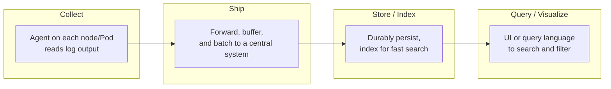
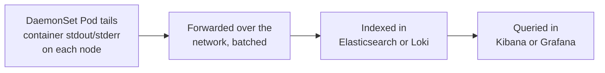

# Chapter 8 — Logging Fundamentals

## Learning Objectives

By the end of this chapter, you will be able to:

- Explain why logs remain necessary alongside rich metrics and distributed tracing
- Explain why Kubernetes's ephemeral Pod model makes centralized logging mandatory rather than optional
- Distinguish structured from unstructured logging and explain why structured logging is the industry default
- Choose appropriate log levels and avoid the two opposite failure modes of over-logging and under-logging
- Describe the generic four-stage logging pipeline (Collect, Ship, Store/Index, Query) that underlies every logging stack
- Explain the mechanical link between "log to stdout" and centralized log aggregation actually working

---

## Prerequisites for This Chapter

- Alerting rules and Alertmanager — Chapter 7 (logs are the other half of "an alert fired, now what actually happened")
- DaemonSets — Kubernetes Basics, Chapter 12 (log-shipping agents are deployed as DaemonSets; this chapter builds directly on that pattern)
- The twelve-factor logging convention (log to stdout/stderr) — Kubernetes Basics, Chapter 15
- The three pillars of observability — Chapter 1 (metrics, logs, traces)

---

## 8.1 Why Logs, When You Already Have Metrics?

Chapter 1 introduced the three pillars of observability — metrics, logs, and traces — and made the case that they're complementary, not redundant. This chapter makes that concrete.

Suppose a Grafana dashboard built in Chapter 6, backed by an alerting rule from Chapter 7, pages you: the checkout service's error rate just crossed 5%. That metric answers exactly one question well: **that** something is wrong, and roughly how much. It does not tell you *which* requests failed, *why* they failed, or what the application was actually doing at the moment of failure. A counter going up is a symptom, not a diagnosis.

If the checkout service is instrumented with distributed tracing (Chapter 11), a trace can narrow down **where** in the request path the failure happened — this specific call from the checkout service to the payments service took 4 seconds and returned an error, out of a chain of six services. That's a huge narrowing of the search space, but a trace typically shows you *that* a call failed and *how long it took*, not the actual error message, stack trace, or the specific input that triggered it.

That last piece — **what specifically happened** — is what a log line gives you. The payments service's log for that exact failed call might read:

```
2026-07-01T09:14:22Z ERROR payments-svc: charge failed for order_id=98212, card_declined, gateway_response="insufficient_funds", retry_count=2
```

Now you know exactly what happened: not "error rate is elevated" (metric), not "the payments service call was slow" (trace), but "this specific card was declined for insufficient funds, and the service had already retried twice." Metrics told you something was wrong; a trace told you where; the log told you what. None of the three pillars substitutes for either of the other two — a mature observability setup always has all three, correlated together (a theme Chapter 11 develops further when it shows trace IDs embedded directly in log lines).

---

## 8.2 The Problem Centralized Logging Solves in Kubernetes

Kubernetes Basics covered `kubectl logs <pod>` as the way to see a container's output, and also covered — as a fundamental property of Pods — that **Pods are ephemeral**. A Pod can be evicted, rescheduled, replaced by a rollout, or OOMKilled at any moment, and once it's gone, `kubectl logs` has nothing left to show you (the kubelet retains a short buffer for a recently-terminated container, but that window is brief and not something you can rely on during an actual investigation).

That's a minor inconvenience with one Pod. It's an operational dead end at real scale. A production system might run dozens of microservices, each with many replicas, spread across dozens or hundreds of nodes, with Pods being created and destroyed continuously as deployments roll out and the autoscaler reacts to load. If a customer reports a failed checkout from 20 minutes ago, there is no realistic way to `kubectl logs` your way to the answer — you don't know which of the (possibly now-terminated) Pod replicas handled that specific request, and even if you did, its logs may already be gone.

The only way this problem is solvable is to stop treating Pod logs as something that lives and dies with the Pod. Logs need to be **shipped off the Pod, off the node, into a durable, centrally searchable store**, continuously, as they're produced — so that by the time anyone needs to search for something, the search is against a permanent record, not a container that may no longer exist. This is the entire reason centralized logging exists as a discipline, and it is non-negotiable at any real Kubernetes scale, not a nice-to-have.

---

## 8.3 Structured vs. Unstructured Logging

Consider the same event, logged two different ways.

**Unstructured** (a free-text string, meant for a human reading a terminal):

```
User 4521 failed login at 14:32:01 because bad password
```

**Structured** (a JSON object, meant for a machine to parse and index):

```json
{
  "timestamp": "2026-07-01T14:32:01Z",
  "level": "warn",
  "user_id": 4521,
  "event": "login_failed",
  "reason": "bad_password"
}
```

The unstructured version reads naturally to a person, but it is close to useless to a machine. To answer "how many failed logins were there for user 4521 in the last hour, and why did they fail," you'd need to grep for a string pattern and hope every log line follows exactly the same free-text phrasing — and the moment a developer changes the wording ("failed login" becomes "login attempt failed"), every downstream search or dashboard built against the old phrasing silently breaks.

The structured version answers that same question as a trivial filter: `event = "login_failed" AND user_id = 4521 AND timestamp > now-1h`. Every field is independently queryable, filterable, and aggregable — you can count failures grouped by `reason`, build a dashboard of failed logins over time, or alert on a spike in `reason: "bad_password"` specifically (a plausible brute-force signal), none of which is realistically achievable by pattern-matching free text at scale.

This is why structured logging (almost always JSON in practice) is the industry standard for anything beyond a hobby project: **it turns logs from text you grep into data you query.** Every serious logging backend — Elasticsearch (Chapter 9) and Loki (Chapter 10) alike — is fundamentally better at its job the more structured the input is, because indexing and filtering on discrete fields is what these systems are built to do well.

| | Unstructured | Structured |
|---|---|---|
| Example | `User 4521 failed login...` | `{"user_id": 4521, "event": "login_failed", ...}` |
| Queryable by field | No — text search only | Yes — filter/aggregate on any field |
| Resilient to wording changes | No — breaks pattern-matching | Yes — field names are stable, message text can vary |
| Machine-aggregable (counts, dashboards) | Difficult, fragile | Native |
| Human-readable in raw form | Yes | Less so, but every log viewer (Kibana, Grafana) renders structured fields nicely |

---

## 8.4 Log Levels and the Discipline of Choosing Them

Nearly every logging library implements a standard severity hierarchy:

| Level | Meaning | Typical use |
|---|---|---|
| `DEBUG` | Fine-grained internal detail | Local development, temporary deep-dive investigation |
| `INFO` | Normal, expected operational events | Service started, request handled, scheduled job completed |
| `WARN` | Something unexpected but non-fatal, may need attention | Retry occurred, deprecated API used, cache miss above expected rate |
| `ERROR` | An operation failed | A request failed, a downstream call errored out |
| `FATAL` / `CRITICAL` | The process cannot continue | Unrecoverable startup failure, data corruption detected |

Choosing levels correctly is an operational discipline, not a formality, because it directly determines two things: how much signal is buried in noise, and how much you're paying to ingest and store all of it.

**Over-logging at `INFO`** — logging every request, every cache hit, every routine internal step at `INFO` — is a common mistake with two costs. First, it drowns genuinely useful information in volume; when everything is logged, nothing stands out, and a human (or an alerting rule built on log content) scanning for the one line that matters has to wade through thousands of routine ones. Second, it is a direct, often underestimated cost driver — centralized logging systems charge (in compute, storage, or literal dollars for managed services) per byte ingested and indexed, and an `INFO` line logged on every single request across every replica adds up to enormous volume very quickly for close to zero diagnostic value most of the time.

**Under-logging at `ERROR` only** is the opposite failure: when the only thing ever logged is "it failed," you lack the surrounding context needed to understand *why* it failed once it does. A single `ERROR: payment failed` line with no preceding context about which gateway was called, what the request payload looked like, or what state the service was in gives you almost nothing to work with during an actual investigation.

The practical middle ground most production systems converge on: `INFO` for meaningful business events (an order was placed, a user signed up — not every internal function call), `WARN` for anything that recovered but was abnormal, and `ERROR` for anything that didn't. `DEBUG` is typically **disabled by default in production** (it's too voluminous to run continuously) but kept available to turn on selectively.

That last point deserves its own emphasis: mature logging setups support **dynamically adjustable log levels at runtime**, without a redeploy. If an on-call engineer is chasing an elusive bug in one specific service, they can raise that service's log level to `DEBUG` for the duration of the investigation (via a config reload, a feature flag, or an admin endpoint the application exposes) and then drop it back to `INFO` once done — getting the deep detail exactly when it's needed, without paying the ingestion and noise cost of running at `DEBUG` all the time.

---

## 8.5 The Generic Logging Pipeline

Every centralized logging system — regardless of the specific tools it's built from — implements the same four-stage pipeline. Understanding this generic shape first is what makes Chapter 9 (ELK) and Chapter 10 (Loki) easy to compare later: they are two different, opinionated implementations of exactly this same pipeline, not two unrelated approaches.



**Collect** — an agent runs on every node (or as a sidecar per Pod, though the node-level pattern is far more common) and picks up log output as it's produced. This is exactly the DaemonSet pattern from Kubernetes Basics Chapter 12 — recall that chapter's own worked example was a Fluent Bit DaemonSet mounting `/var/log` and the container runtime's log directory via `hostPath`, running one Pod per node so that every node's logs are collected regardless of which Pods happen to be scheduled there. Fluent Bit, Promtail (Loki's collector, Chapter 10), and Filebeat (ELK's collector, Chapter 9) are all implementations of this same "Collect" stage.

**Ship** — the collected logs are forwarded to a central system, typically buffered and batched rather than sent one line at a time (sending every single log line as an individual network call would be prohibitively expensive at any real volume). This stage often includes lightweight parsing or enrichment — attaching Kubernetes metadata like namespace, Pod name, and labels to each log line so it can be filtered by them later.

**Store/Index** — logs are durably persisted and indexed so that searching across potentially terabytes of historical log data returns results in seconds, not minutes. This is the stage where ELK (Elasticsearch, Chapter 9) and Loki (Chapter 10) differ most fundamentally in approach — full-text indexing of every log line's content versus indexing only a small set of labels — which is exactly the tradeoff Chapter 10 examines in depth.

**Query/Visualize** — a UI or query language lets a human (or an automated system) search, filter, and build dashboards from the stored logs. Kibana for ELK, Grafana (with a Loki data source) for Loki — this is the log-search analog of the metrics dashboards Chapter 6 covered for Prometheus.

A Kubernetes-flavored instance of the same diagram makes the mapping concrete:



---

## 8.6 The Mechanical Link: stdout to Centralized Search

Kubernetes Basics established a specific, non-negotiable convention: containers should write logs to **stdout/stderr**, never to a file inside the container's own filesystem. It's worth being precise about *why* that convention is what actually makes centralized log aggregation possible at all — this is the mechanical bridge between "a best practice from an earlier course" and "logging infrastructure that actually works."

Here's the chain of causation:

1. A container writes a log line by printing it to stdout (this is just how `console.log`, `print()`, `System.out.println`, or any standard logging library behaves by default when not explicitly configured to write to a file).
2. The **container runtime** (containerd, CRI-O) captures that stdout/stderr stream and redirects it to a log file on the **node's own disk** — typically under `/var/log/containers/` or `/var/log/pods/`, with a symlink structure that ties the file back to the specific Pod and container. This happens automatically, for every container, with zero application-level configuration required.
3. A node-level log-shipping DaemonSet (Fluent Bit, Promtail, Filebeat) is mounted, via `hostPath`, directly onto that same node filesystem location. It **tails** those files — watching for new lines appended in real time, exactly the way `tail -f` would — and forwards each new line onward.

If an application instead wrote its logs to a file *inside its own container's filesystem* (e.g., `/app/logs/app.log`), none of this works: that file lives inside the container's isolated, ephemeral filesystem, invisible to the node-level DaemonSet, and it disappears the moment the container is removed — recreating, inside a single container, exactly the ephemeral-logs problem centralized logging exists to solve. "Log to stdout" isn't a stylistic preference; it's the specific mechanical precondition that makes the DaemonSet-based collection stage in section 8.5 possible in the first place.

---

## 8.7 Real-World Scenario: Tracing One Order Across 40 Pods

An engineer gets a support ticket: order `98212` failed, and the customer wants to know why. The order passed through 12 different microservices during checkout — cart, inventory, pricing, tax, payments, fraud-check, notifications, and others — each running multiple replicas, for a combined total of roughly 40 Pods across the cluster at the time the order was placed.

**Without centralized structured logging**, answering "what happened to order 98212" means guessing which of those 12 services might have been involved in the failure, then `kubectl logs`-ing into some subset of their replicas, hoping the specific Pod that handled this particular request hasn't since been evicted, scaled down, or replaced by a rollout — and even if the right Pod is still around, grepping through unstructured free-text logs hoping the order ID appears in a consistent, greppable format. This can easily take 30–60 minutes of tedious, uncertain investigation, and sometimes ends in "we can't determine what happened, the relevant Pod is gone."

**With centralized structured logging**, every one of those 12 services logs structured JSON including an `order_id` field (assuming the order ID is threaded through the request as context, a practice Chapter 11 also depends on for distributed tracing), and every log line, from every Pod, from every service, has already been shipped off-Pod and indexed centrally. The entire investigation becomes one query:

```
order_id="98212"
```

run against the centralized store, returning every relevant log line from every one of the 12 services, in chronological order, instantly — including from Pods that no longer exist. What was a 30–60 minute uncertain forensic exercise becomes a query that returns an answer in seconds. This is the single clearest illustration of why centralized, structured logging is considered foundational infrastructure for running anything beyond a small, single-service application on Kubernetes.

---

## 8.8 Multi-Line Logs and the Stack-Trace Problem

The stdout-tailing mechanism described in section 8.6 has a wrinkle that trips up nearly every team the first time they hit it: a log **line**, mechanically, is whatever text sits between two newline characters. Most log output really is one event per line. A stack trace is not.

```
2026-07-01T09:15:03Z ERROR Unhandled exception processing order 98212
java.lang.NullPointerException: Cannot invoke "Gateway.charge()" because "gateway" is null
    at com.example.payments.PaymentService.process(PaymentService.java:88)
    at com.example.payments.PaymentController.handle(PaymentController.java:41)
    at com.example.checkout.CheckoutFlow.pay(CheckoutFlow.java:120)
```

To the container runtime and a naive collector, this is five separate lines, and therefore — without special handling — five separate log entries in your central store: one that looks like a real error event, and four fragments that look like meaningless noise with no level, no timestamp, and no context of their own. Searching for `order_id="98212"` would find the first line and none of the stack frames that explain *why* it failed, defeating the entire point of centralized structured logging for exactly the kind of event you most need it for.

The fix happens at the collection stage: log shippers (Fluent Bit, Filebeat, Promtail) support **multi-line parsing rules** that recognize a continuation line (in Java's case, a line starting with whitespace followed by `at ` is almost always a stack frame continuing the previous line) and merge it back into the original log entry before it's shipped onward:

```yaml
# Fluent Bit multiline parser example — merges Java-style stack traces
# back into the single log entry they belong to
[MULTILINE_PARSER]
    name          java-multiline
    type          regex
    flush_timeout 1000
    rule          "start_state" "/^\d{4}-\d{2}-\d{2}T\d{2}:\d{2}:\d{2}/" "cont"
    rule          "cont"        "/^\s+at .*/"                            "cont"
```

The practical lesson: structured logging (section 8.3) solves the *field-parsing* half of making logs queryable, but multi-line handling is the other, easy-to-overlook half — without it, exceptions and stack traces (often the single most valuable pieces of context during a real investigation) end up fragmented and effectively unsearchable in your central store.

---

## 8.9 Retention, Volume, and the Cost of Logging Everything

Section 8.4 mentioned that over-logging at `INFO` has a real cost, not just a noise problem. It's worth being explicit about the shape of that cost, because it directly informs how long you keep logs and at what granularity.

Centralized logging systems typically charge — in literal cost for managed offerings, or in disk/compute for self-managed ones — roughly in proportion to **ingested volume** and **retention period**. A service logging a structured JSON line per request, at any real production request volume, sustained across dozens of replicas, adds up to a genuinely large amount of data per day; keeping all of it, at full detail, forever, is rarely proportionate to its actual value. Two techniques are standard:

- **Tiered retention.** Keep recent logs (say, the last 7–14 days) at full fidelity and fast query speed, because that's the window where an incident investigation or a support ticket is most likely to need them. Move or delete older data — this is exactly the hot-warm-cold pattern Chapter 9 covers for Elasticsearch, and it applies conceptually to any logging backend, including Loki in Chapter 10.
- **Sampling.** For extremely high-volume, low-value log lines (e.g., a debug trace on every single request in a service handling thousands of requests per second), some teams sample — logging only a percentage of routine events at full detail, while always logging 100% of `WARN`/`ERROR` events regardless of sampling rate, since those are precisely the ones you can't afford to miss.

Neither technique is free — tiered retention means an investigation into something from 60 days ago may take longer or require restoring from cold storage, and sampling means you genuinely lose some routine detail. Both are still usually the right trade, because "log absolutely everything, forever, at full detail" is rarely something even a well-funded team can sustain once volume grows, and the alternative — no logging discipline at all until a cost or performance crisis forces one — tends to happen at the worst possible time, under pressure, exactly like the Elasticsearch scaling story in Chapter 9's real-world scenario.

---

## 8.10 Correlating Logs With the Other Two Pillars

Section 8.1 showed metrics, traces, and logs each answering a different part of the same question. In practice, the value of having all three multiplies when they're **correlated** — linked together by shared identifiers — rather than simply existing side by side as three separate systems you have to manually cross-reference.

The most common and highest-value correlation is embedding a **trace ID** (the identifier a distributed tracing system, Chapter 11, assigns to a single request as it crosses service boundaries) directly into every structured log line produced while handling that request:

```json
{
  "timestamp": "2026-07-01T09:14:22Z",
  "level": "error",
  "service": "payments-svc",
  "trace_id": "4bf92f3577b34da6a3ce929d0e0e4736",
  "order_id": 98212,
  "event": "charge_failed",
  "reason": "gateway_timeout"
}
```

With `trace_id` present, a Grafana panel showing an anomalous trace (Chapter 11) can link directly to the exact log lines produced during that specific request, across every service it touched — instead of an engineer manually guessing which log lines, out of millions, correspond to the slow or failed trace they're looking at. This is precisely why Chapter 8's insistence on structured logging with consistent field names matters beyond just "logs you can query" — it's also the substrate that makes cross-pillar correlation mechanically possible at all. A free-text log line has nowhere consistent to put a trace ID; a structured one does, by design.

The same principle applies to linking logs back to metrics: if a Grafana alert (Chapter 7) fires with labels like `service` and `namespace`, a well-designed observability setup lets an on-call engineer jump straight from that alert to a pre-filtered log query for the same `service`/`namespace`/time-window — turning "an alert fired, now go manually figure out where to look" into "an alert fired, here are the relevant logs already filtered for you." Chapter 13 revisits this kind of tooling integration in the specific context of Kubernetes-native observability.

---

## Best Practices

- Log to stdout/stderr only — never to a file inside the container — so the node-level collection stage can see the output at all
- Default to structured (JSON) logging for anything beyond local development or a hobby project
- Thread correlating identifiers (order ID, request ID, user ID) through every log line involved in handling a given request, so a single query can reconstruct the whole story
- Pick log levels deliberately: `INFO` for meaningful business events, not every internal function call; reserve `DEBUG` for opt-in, temporary deep dives
- Support dynamically adjustable log levels at runtime so a production investigation doesn't require a redeploy just to get more detail
- Treat logs, metrics, and traces as complementary, not redundant — design your logging strategy assuming a human will also have dashboards and traces available, not logs alone

## Common Mistakes

- Logging to a file inside the container instead of stdout, silently breaking the DaemonSet-based collection pipeline
- Shipping unstructured free-text logs by default, then discovering during an incident that they can't be reliably filtered or aggregated
- Logging everything at `INFO`, inflating ingestion cost and burying the handful of lines that actually matter
- Never including a correlating ID (order ID, request ID) in log lines, making cross-service investigations far slower than they need to be
- Treating logs as a replacement for metrics and alerting rather than a complementary pillar — discovering an outage by manually grepping logs instead of being paged

*(The full catalog of monitoring and logging mistakes is covered in Chapter 15.)*

---

## Summary

Metrics, logs, and traces are complementary: metrics tell you *that* something is wrong, traces tell you *where* in the request path, and logs tell you *what specifically happened*. Kubernetes's ephemeral Pod model makes centralized logging mandatory — `kubectl logs` cannot answer questions once a Pod is gone, and at real scale there's no way to manually chase logs across dozens of Pods anyway. Structured (JSON) logging turns log lines into queryable, filterable, aggregable data, which is why it's the industry default over free-text unstructured logs. Log levels (`DEBUG` through `FATAL`) require deliberate discipline — over-logging at `INFO` drowns signal and inflates cost, under-logging at `ERROR` only loses debugging context, and dynamically adjustable levels give you deep detail on demand without a redeploy. Every logging stack, regardless of specific tooling, implements the same four-stage pipeline — Collect (DaemonSet tailing stdout), Ship, Store/Index, Query/Visualize — and the mechanical reason this works at all is the "log to stdout" convention, which lets the container runtime redirect output to a node-local file that the collection DaemonSet can tail. Chapters 9 and 10 cover ELK and Loki as two different implementations of this same pipeline.

---

## Knowledge Check

1. Give a concrete example of a single failure where a metric, a trace, and a log line each tell you something the other two don't.
2. Why does Kubernetes's Pod ephemerality make `kubectl logs` insufficient as a debugging strategy at scale?
3. Rewrite this unstructured log line as a structured JSON log line, choosing sensible field names: `"Payment of $49.99 failed for order 7734 — card expired"`.
4. What is the specific operational cost of logging everything at `INFO`, beyond just "it's noisy"?
5. Trace the mechanical path a single log line takes from an application calling `print()` to appearing in a centralized log search UI. Where does the container runtime's role fit in, and why would writing to a file inside the container break this chain?
6. Why are `Collect`, `Ship`, `Store/Index`, and `Query/Visualize` described as a "generic" pipeline rather than specific to any one tool?
7. A Java service's stack traces show up in your central log store as several disconnected, context-free lines instead of one coherent error event. What stage of the pipeline is responsible for fixing this, and how?
8. Name two techniques for controlling log storage cost as volume grows, and explain what each one trades away.
9. Why does embedding a `trace_id` field in structured log lines require structured logging specifically — what would go wrong trying to do this with unstructured free-text logs?

---

## Hands-On Exercise

**Observe the stdout-to-Node-Disk Mechanism Directly**

Using a local `kind` or `minikube` cluster:

1. Deploy a simple Pod running a container that prints a structured JSON log line to stdout once per second (a small `busybox` loop is enough: `while true; do echo "{\"timestamp\":\"$(date -Iseconds)\",\"level\":\"info\",\"event\":\"heartbeat\"}"; sleep 1; done`).
2. Confirm `kubectl logs -f <pod>` shows the structured output streaming live.
3. `kubectl debug node/<node>` (or SSH, if available) into the node your Pod is scheduled on, and find the corresponding log file under `/var/log/pods/` or `/var/log/containers/` — confirm the exact same JSON lines are being written there by the container runtime, independent of `kubectl logs`.
4. Delete the Pod, then immediately check whether `kubectl logs` still works (it may briefly, from a cached buffer) versus whether the node-level log file persists after the Pod object is gone — this is the ephemerality problem from section 8.2, observed directly.
5. Write down, in your own words, which specific stage (Collect/Ship/Store/Query) a Fluent Bit or Promtail DaemonSet would need to add to turn what you just did manually into an always-on centralized logging pipeline.

---

## Further Reading

- [The Twelve-Factor App — Logs](https://12factor.net/logs)
- [Kubernetes Documentation — Logging Architecture](https://kubernetes.io/docs/concepts/cluster-administration/logging/)
- [Google SRE Workbook — Monitoring](https://sre.google/workbook/monitoring/)
- [Elastic — What is Structured Logging?](https://www.elastic.co/what-is/structured-logging)
- [Fluent Bit Documentation — Concepts](https://docs.fluentbit.io/manual/concepts/key-concepts)

---

<div style="display:flex;justify-content:space-between;align-items:center;">
  <a href="./07-alerting-and-alertmanager.md">← Previous: Alerting and Alertmanager</a>
  <a href="./00-index.md">🏠 Index</a>
  <a href="./09-elk-stack.md">Next: The ELK Stack →</a>
</div>
