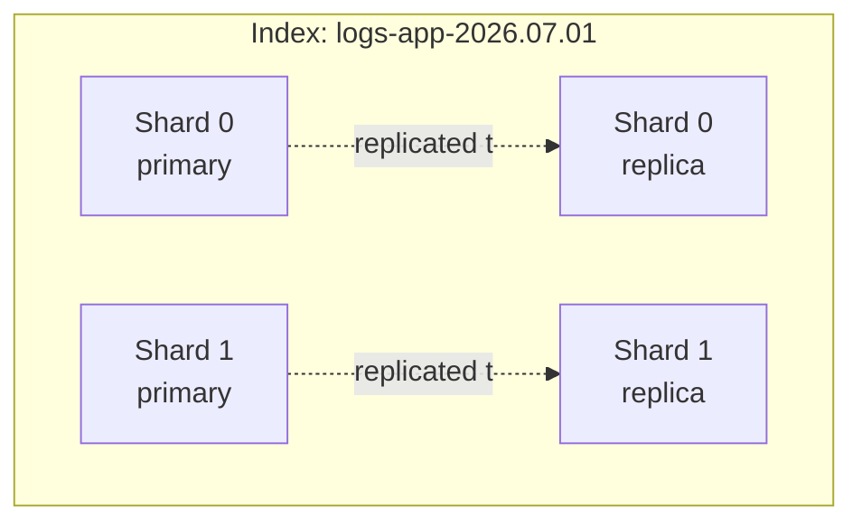
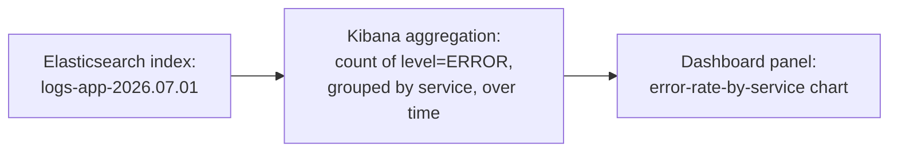
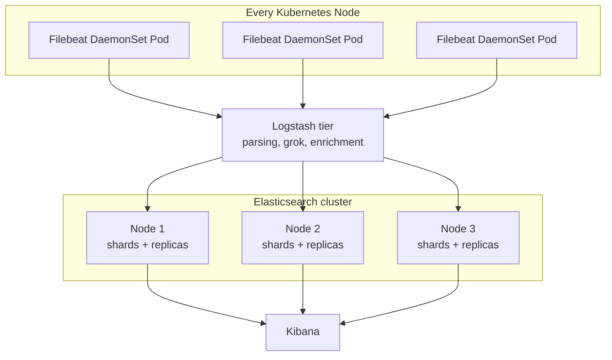

# Chapter 9 — The ELK Stack

## Learning Objectives

By the end of this chapter, you will be able to:

- Explain what each letter in ELK stands for and how the pieces fit into the generic logging pipeline from Chapter 8
- Explain Elasticsearch's core data model: documents, indices, sharding/replication, and the inverted index that makes full-text search fast
- Write a simple Logstash `input`/`filter`/`output` pipeline, including a `grok` pattern that parses an unstructured log line
- Explain why Filebeat runs as a per-node DaemonSet while Logstash runs as a smaller, centralized tier
- Use Kibana's Discover view and describe how log-derived dashboards are built
- Describe the operational cost of running Elasticsearch at scale and name managed alternatives

---

## Prerequisites for This Chapter

- The generic logging pipeline (Collect, Ship, Store/Index, Query) — Chapter 8
- Structured vs. unstructured logging — Chapter 8
- DaemonSets — Kubernetes Basics, Chapter 12
- Grafana as a reference point for what a visualization layer does — Chapter 6

---

## 9.1 ELK as an Implementation of the Generic Pipeline

Chapter 8 described a generic four-stage logging pipeline — Collect, Ship, Store/Index, Query/Visualize — and promised that Chapters 9 and 10 would show two different, real implementations of it. This chapter covers the first, and by far the older and more established: **ELK**.

ELK is an acronym for its three original core open-source components: **E**lasticsearch, **L**ogstash, and **K**ibana. In a real modern deployment, a fourth component — **Beats** (specifically Filebeat, for logs) — is typically also part of the stack, handling the "Collect" stage that the original three-letter acronym didn't originally name. You'll sometimes see the whole thing referred to as the "Elastic Stack" for this reason, though "ELK" remains the far more commonly used term in practice.

Mapped onto Chapter 8's generic pipeline:

| Generic stage | ELK component |
|---|---|
| Collect | Filebeat (a Beat) |
| Ship / transform | Logstash |
| Store / Index | Elasticsearch |
| Query / Visualize | Kibana |

---

## 9.2 Elasticsearch: Storage and Search

Elasticsearch sits at the center of the stack — it's what actually stores your logs durably and makes them searchable. Understanding its core model, at a level appropriate for using it well without needing to operate its internals, means understanding three ideas: documents, the inverted index, and sharding/replication.

**Documents.** Elasticsearch is a distributed, JSON-document store — every log line you ship into it becomes a single JSON document. This maps naturally onto the structured logging discussion from Chapter 8: a structured JSON log line is already close to exactly the shape Elasticsearch wants to ingest.

**The inverted index.** This is the fundamental data structure behind full-text search generally, not something unique to Elasticsearch — the same idea powers search engines broadly. A naive way to search text would be to scan every document, every time, looking for a match — hopelessly slow at any real volume. An **inverted index** flips the relationship: instead of documents pointing to the words they contain, the index maps each word (or "token") to the list of documents that contain it.

```
Word            → Documents containing it
"error"         → [doc_1, doc_4, doc_9, doc_23, ...]
"payment"       → [doc_4, doc_9, doc_15, ...]
"card_declined" → [doc_4, doc_9, ...]
```

Searching for "payment error" then becomes a fast lookup and intersection of two short lists, rather than a scan of every document ever stored. This is why Elasticsearch (and full-text search engines generally, including the ones behind most web search) can return results from terabytes of data in milliseconds — the expensive work of building the index happens once, at write time, so that read time is cheap.

**Indices, sharding, and replication.** Elasticsearch organizes documents into **indices** (the rough analog of a database table, though schema-flexible) — commonly one per day and per log type in a logging use case, e.g., `logs-app-2024.06.01`, `logs-nginx-2024.06.01`. Time-based indices like this make it cheap to delete old data (drop the whole index for a date once it's past your retention window, rather than deleting individual documents) and let you tier storage by age (a theme picked up again in section 9.5). Each index is split into **shards** — the unit of horizontal scale, letting an index's data and query load be spread across multiple nodes — and each shard can have **replicas**, additional copies on different nodes, both for resilience (a node failing doesn't lose data) and for spreading read load across more machines.



---

## 9.3 Logstash: Parse and Transform

**Logstash** is ELK's traditional processing and transformation stage, built around a three-part pipeline model: `input → filter → output`.

- **`input`** — where data comes from: reading from Beats agents, a Kafka topic (common at higher volume, to buffer bursts and decouple producers from Logstash's processing rate), files, or several other sources.
- **`filter`** — where transformation happens: parsing unstructured text into structured fields, enriching documents with extra metadata, dropping fields you don't want to store.
- **`output`** — where the transformed data goes: almost always Elasticsearch in this stack, though Logstash can write elsewhere too.

The most common `filter` job is turning an unstructured log line into structured fields using **grok** — a pattern-matching syntax built on top of regular expressions, with a library of named patterns for common formats (timestamps, IP addresses, log levels) so you don't have to hand-write raw regex for everything.

```
# A raw, unstructured application log line arriving at Logstash:
2026-07-01 09:14:22 ERROR Payment gateway timeout for order 98212
```

```ruby
# logstash.conf
input {
  beats {
    port => 5044
  }
}

filter {
  grok {
    match => {
      "message" => "%{TIMESTAMP_ISO8601:log_timestamp} %{LOGLEVEL:level} %{GREEDYDATA:log_message}"
    }
  }
  date {
    match => ["log_timestamp", "yyyy-MM-dd HH:mm:ss"]
    target => "@timestamp"
  }
}

output {
  elasticsearch {
    hosts => ["http://elasticsearch:9200"]
    index => "logs-app-%{+YYYY.MM.dd}"
  }
}
```

That single `grok` pattern turns the raw line into structured fields: `log_timestamp = "2026-07-01 09:14:22"`, `level = "ERROR"`, `log_message = "Payment gateway timeout for order 98212"` — exactly the unstructured-to-structured transformation Chapter 8 argued is worth doing, applied here as a centralized processing step for applications that don't (or can't) emit structured JSON themselves.

Worth being upfront about: Logstash is **JVM-based and comparatively heavyweight** — it has meaningful memory and CPU footprint per instance, especially once you're running non-trivial `grok` patterns across high log volume. Many modern stacks either replace it entirely with lighter-weight processing (pushing structured JSON logging further upstream into applications, so there's less parsing work to do centrally) or supplement it with a lighter agent doing basic parsing before Logstash does heavier enrichment. It remains a fully supported, capable piece of the stack — the honest caveat is resource cost, not capability.

---

## 9.4 Beats (Filebeat): Lightweight, Per-Node Collection

**Filebeat** is a purpose-built, lightweight shipper — it does one job (read log files, or container stdout/stderr, and forward them onward) and is written to have a small resource footprint doing it, in deliberate contrast to Logstash's heavier processing role.

This resource-profile difference is the direct reason for an architectural pattern worth calling out explicitly: **Filebeat runs on every node** (as a DaemonSet in Kubernetes — the exact same pattern Kubernetes Basics Chapter 12 and this course's Chapter 8 both used Fluent Bit to illustrate), while **Logstash runs centrally, as its own smaller tier**, not per-node.

```yaml
apiVersion: apps/v1
kind: DaemonSet
metadata:
  name: filebeat
  namespace: logging
spec:
  selector:
    matchLabels:
      app: filebeat
  template:
    metadata:
      labels:
        app: filebeat
    spec:
      containers:
        - name: filebeat
          image: docker.elastic.co/beats/filebeat:8.13.0
          resources:
            requests:
              cpu: 100m
              memory: 100Mi
            limits:
              memory: 200Mi
          volumeMounts:
            - name: varlogcontainers
              mountPath: /var/log/containers
              readOnly: true
            - name: varlogpods
              mountPath: /var/log/pods
              readOnly: true
      volumes:
        - name: varlogcontainers
          hostPath:
            path: /var/log/containers
        - name: varlogpods
          hostPath:
            path: /var/log/pods
```

The reasoning is a straightforward resource-efficiency argument: if you ran a full Logstash instance on every node, you'd be paying its JVM memory and CPU overhead multiplied by your node count, for work that doesn't actually need to happen per-node — parsing and enrichment logic doesn't care which node a log line originated on. By keeping the per-node footprint minimal (Filebeat's job is just "read and forward, with only the lightest optional parsing") and concentrating the heavier processing into a smaller, independently-scaled central Logstash tier, you get the coverage you need (every node has an agent) without the multiplied cost of running something heavy everywhere. This split — lightweight, ubiquitous collection agent versus heavier, centralized processing tier — is a pattern you'll see recur anywhere a system needs both broad coverage and non-trivial per-event work.

---

## 9.5 Kibana: Query and Visualization

**Kibana** is ELK's query and visualization layer, purpose-built for Elasticsearch — the direct analog of what Grafana (Chapter 6) is for Prometheus, but specialized for log/document data rather than time-series metrics.

The **Discover** view is Kibana's ad-hoc search interface — you type a query, optionally filter by time range and fields, and see matching log documents directly:

```
level:ERROR AND service:"payments-svc" AND order_id:"98212"
```

That query (in Kibana Query Language, KQL) is the structured-query payoff described conceptually in Chapter 8's real-world scenario — filtering precisely by discrete fields (`level`, `service`, `order_id`) rather than free-text pattern matching, made possible because the underlying documents are structured.

Beyond ad-hoc search, Kibana supports building **dashboards** from log-derived aggregations — for example, a panel showing error count over time, broken down by service, built from the same indexed documents:



This is conceptually the same idea as a Grafana panel built from a PromQL aggregation (Chapter 6) — the difference is the data source and query language underneath (Elasticsearch's query DSL/KQL versus PromQL), not the mental model of "aggregate stored data into a visual panel."

---

## 9.6 Full Architecture



Filebeat runs everywhere collection needs to happen (every node); Logstash runs as a right-sized central tier doing the heavier processing work once; Elasticsearch is a multi-node cluster providing durable, indexed, sharded/replicated storage; Kibana sits on top as the human-facing query and dashboard layer.

---

## 9.7 The Honest Operational Cost Conversation

Elasticsearch is powerful, and it is also genuinely resource-hungry to run well, especially as log volume grows. This is worth stating plainly rather than glossing over, because it directly motivates Chapter 10.

A handful of the real operational concerns a team running self-managed Elasticsearch at scale has to actively manage:

- **JVM heap sizing.** Elasticsearch runs on the JVM, and getting heap size right (typically capped well below total node memory, to leave room for the OS page cache that Lucene — the search library underneath Elasticsearch — relies on heavily) is a genuine tuning exercise, not a one-time setting you forget about.
- **Disk I/O.** Indexing is disk-intensive; slow or contended disks translate directly into indexing backlogs and slow queries, especially under high write volume.
- **Shard management and rebalancing.** Too many shards (over-sharding) wastes overhead per shard; too few limits parallelism and makes individual shards unwieldy to move or recover. As data grows and nodes are added or removed, shards need active rebalancing — usually automatic, but not always automatically *correct* for your workload without tuning.
- **Hot-warm-cold tiering.** To manage cost as data ages, teams commonly move recent, actively-queried indices to fast/expensive storage ("hot"), older indices to cheaper storage with less query traffic expected ("warm"), and archive the oldest to the cheapest storage tier or delete it entirely ("cold") — a real architecture to design and maintain, not a checkbox.
- **Cluster management complexity generally** — node sizing, index lifecycle policies, backup/snapshot strategy, and version upgrades all require ongoing, specialized attention.

Running Elasticsearch well at real scale is a genuine specialty — some organizations employ people whose primary job is exactly that. If you'd rather not build that expertise in-house, managed alternatives exist and are widely used: **Elastic Cloud** (the managed offering from Elastic, the company behind Elasticsearch) and **AWS OpenSearch Service** (the AWS-maintained fork of Elasticsearch, relevant here since Topic 6 of this roadmap covered AWS directly) both let you offload cluster operations to the provider in exchange for a service fee, trading operational burden for cost.

This operational cost is precisely the gap **Loki**, covered next in Chapter 10, was designed to address — by taking a fundamentally lighter-weight approach to what gets indexed in the first place, rather than trying to out-operate Elasticsearch's complexity.

---

## 9.8 Real-World Scenario: When Self-Managed ELK Becomes a Second Job

A company adopts self-managed ELK early, when log volume is modest — a few gigabytes a day, comfortably handled by a small three-node Elasticsearch cluster with default settings and minimal tuning. It works well, and nobody thinks much about the operational side of it.

Two years later, the company has grown: more services, more traffic, more verbose structured logging adopted more broadly (a good practice from Chapter 8, but one with a real storage cost) — and log volume has grown from gigabytes to **terabytes per day**. The Elasticsearch cluster that once ran itself now requires a dedicated two-person on-call rotation just to keep healthy:

- **Shard rebalancing** has become a recurring manual intervention — the default sharding strategy chosen when the cluster was small no longer fits the current data volume, and shards are unevenly distributed, causing some nodes to be near capacity while others sit underutilized.
- **Hot-warm-cold tiering** had to be designed and implemented after the fact, under pressure, once storage costs on all-hot infrastructure became impossible to justify — a project that took months and required non-trivial Elasticsearch expertise to get right.
- **JVM garbage collection tuning** became a recurring firefight — GC pauses under heavy indexing load were causing intermittent query timeouts and even node instability, requiring careful heap and GC-flag tuning that took real trial and error to stabilize.
- **Version upgrades** turned into multi-week planning exercises, given the cluster's size and the risk of downtime or data issues during a rolling upgrade of a system this central to the company's operations.

What started as "just run ELK, it's the standard stack" quietly became a specialized, ongoing operational commitment — two engineers' meaningful fraction of their time, indefinitely, just to keep the logging platform itself healthy, separate from any value-add work on top of it. This is exactly the kind of cost that leads teams to ask the question Chapter 10 opens with: what if centralized log storage didn't require indexing the full content of every log line in the first place — what would a radically simpler, cheaper-to-operate approach even look like?

---

## 9.9 Index Lifecycle Management: Automating Hot-Warm-Cold

Section 9.7 mentioned hot-warm-cold tiering as one of the operational responsibilities of running Elasticsearch at scale. It's worth showing what that actually looks like, because "move old data to cheaper storage" is easy to say and, without automation, easy to let slip until someone notices the storage bill.

Elasticsearch's **Index Lifecycle Management (ILM)** feature lets you define a policy, once, that automatically transitions an index through named phases as it ages — no engineer manually running migration commands on a schedule:

```json
PUT _ilm/policy/logs-policy
{
  "policy": {
    "phases": {
      "hot": {
        "min_age": "0ms",
        "actions": {
          "rollover": { "max_age": "1d", "max_size": "50gb" }
        }
      },
      "warm": {
        "min_age": "3d",
        "actions": {
          "shrink": { "number_of_shards": 1 },
          "forcemerge": { "max_num_segments": 1 }
        }
      },
      "cold": {
        "min_age": "14d",
        "actions": {
          "searchable_snapshot": { "snapshot_repository": "logs-backups" }
        }
      },
      "delete": {
        "min_age": "90d",
        "actions": { "delete": {} }
      }
    }
  }
}
```

Read as a plain-language policy: today's index lives on fast "hot" storage; after 3 days it moves to "warm" storage and gets consolidated into fewer, more efficient shards/segments (less duplicated overhead, since it's no longer being actively written to); after 14 days it moves to "cold," backed by a much cheaper searchable snapshot rather than a fully live index; after 90 days, it's deleted entirely. This is the concrete mechanism behind "time-based indices make retention manageable" from section 9.2 — without ILM, someone has to remember to run this migration and deletion logic by hand, on schedule, forever, which is exactly the kind of recurring manual toil that turned into a dedicated on-call burden in section 9.8's scenario.

---

## 9.10 ELK's Place Among the Stack Choices in This Course

By this point in the course you've seen several "pick the right tool" tables (Chapter 6's Grafana data sources, Kubernetes Basics' controller decision table). It's useful to place ELK explicitly against what you already know before Chapter 10 introduces its direct alternative:

| Concern | ELK | Prometheus + Grafana (Chapters 2–6) |
|---|---|---|
| Data type | Unstructured/structured logs (text/JSON documents) | Numeric time-series metrics |
| Storage model | Inverted index over document content | Time-series database, keyed by label sets |
| Primary question answered | "What exactly happened?" | "How much / how often / is it within range?" |
| Query language | Elasticsearch Query DSL / KQL | PromQL |
| Typical resource profile | Heavy — JVM, disk I/O, shard management | Lighter, but cardinality-sensitive (Chapter 13) |

The two systems are not competitors — a healthy production setup runs both, side by side, because they answer different categories of question, exactly as section 8.1 argued for logs, metrics, and traces generally. Where ELK does have a direct competitor is at the logging layer specifically, which is exactly the comparison Chapter 10 draws out in full once Loki is on the table.

---

## Best Practices

- Use time-based indices (e.g., one per day) so old data can be dropped cheaply by deleting whole indices rather than individual documents
- Push structured (JSON) logging as far upstream into applications as possible, reducing how much `grok`-based parsing Logstash needs to do centrally
- Keep Filebeat (or any Beat) lightweight and per-node; keep heavier processing (Logstash) in a separate, independently-scaled central tier
- Size Elasticsearch JVM heap deliberately, leaving room for the OS page cache Lucene depends on — don't just set it to "most of available RAM"
- Implement hot-warm-cold tiering proactively, before storage cost forces an urgent redesign
- Consider a managed offering (Elastic Cloud, AWS OpenSearch Service) if your team doesn't want to build deep Elasticsearch operational expertise in-house

## Common Mistakes

- Under-provisioning Elasticsearch for the log volume you'll have in a year, not just the volume you have today
- Running heavyweight Logstash instances per-node instead of as a right-sized central tier, multiplying resource cost unnecessarily
- Ignoring shard count and sizing until rebalancing becomes an urgent, manual firefight
- Treating grok-based parsing as a substitute for structured logging at the source, instead of a fallback for logs you don't control
- Delaying hot-warm-cold tiering until storage costs force a rushed redesign under pressure

*(The full catalog of monitoring and logging mistakes is covered in Chapter 15.)*

---

## Summary

ELK — Elasticsearch, Logstash, Kibana, plus Beats/Filebeat in modern deployments — is one of two industry-standard implementations of Chapter 8's generic logging pipeline (Loki, Chapter 10, is the other). Elasticsearch is a distributed JSON-document store built on an inverted index (mapping tokens to the documents containing them, for fast full-text search), organized into sharded, replicated, typically time-based indices. Logstash implements an `input → filter → output` pipeline, commonly using `grok` patterns to parse unstructured log lines into structured fields before writing to Elasticsearch — capable, but comparatively heavyweight (JVM-based). Filebeat is a lightweight, purpose-built shipper that runs as a DaemonSet on every node, deliberately kept lightweight so the heavier Logstash processing tier can run centrally instead of being multiplied across every node. Kibana is the query/visualization layer, analogous to Grafana but built for Elasticsearch, offering ad-hoc search (Discover) and log-derived dashboards. Running Elasticsearch well at scale is a genuine operational specialty — JVM tuning, shard management, hot-warm-cold tiering — which is exactly the cost managed offerings (Elastic Cloud, AWS OpenSearch Service) exist to absorb, and exactly the gap Loki was designed to close with a fundamentally lighter-weight approach.

---

## Knowledge Check

1. What does each letter in ELK stand for, and which additional component is typically part of a real modern deployment?
2. Explain what an inverted index is and why it makes full-text search fast, in your own words.
3. Write a simple description (or sketch the config) of a Logstash pipeline that parses a raw log line of the form `"2026-07-01 10:00:00 WARN Slow query detected"` into structured fields.
4. Why does Filebeat run as a per-node DaemonSet while Logstash runs as a smaller central tier, rather than both running per-node or both running centrally?
5. Name three distinct operational burdens of running Elasticsearch at scale, and name one managed alternative that can absorb that burden.
6. How does Kibana's Discover view relate to the structured-logging query example from Chapter 8's real-world scenario (finding every log line for `order_id="98212"`)?
7. In an ILM policy with hot, warm, cold, and delete phases, what is actually happening to an index's underlying storage and shard structure as it moves from hot to warm to cold?
8. Why do teams typically run both ELK (or Loki) and Prometheus/Grafana rather than choosing one over the other?

---

## Hands-On Exercise

**Stand Up a Minimal ELK Pipeline**

Using Docker Compose or a local `kind` cluster:

1. Run a single-node Elasticsearch container and confirm it's healthy: `curl http://localhost:9200/_cluster/health?pretty`.
2. Run Kibana pointed at that Elasticsearch instance, and confirm you can reach its UI.
3. Manually index a handful of sample JSON log documents directly into an index called `logs-app-2026.07.01` using `curl -X POST` against Elasticsearch's `_doc` API (no Logstash needed for this step) — include a mix of `level: "INFO"` and `level: "ERROR"` documents with an `order_id` field on a few of them.
4. In Kibana, create a Data View for `logs-app-*`, then use Discover to run a KQL query filtering for `level:ERROR AND order_id:"98212"` (using whichever order_id you set in your sample data), confirming only the matching documents appear.
5. Write a simple Logstash `input`/`filter`/`output` config (from section 9.3) that reads a small file of raw, unstructured log lines, parses them with `grok`, and writes the resulting structured documents into Elasticsearch — then confirm the parsed fields (`level`, `log_message`, etc.) appear correctly in Kibana's Discover view.

---

## Further Reading

- [Elasticsearch Reference — Basic Concepts](https://www.elastic.co/guide/en/elasticsearch/reference/current/documents-indices.html)
- [Logstash Reference — Configuration and Pipelines](https://www.elastic.co/guide/en/logstash/current/configuration.html)
- [Grok Filter Plugin Documentation](https://www.elastic.co/guide/en/logstash/current/plugins-filters-grok.html)
- [Filebeat Reference — How Filebeat Works](https://www.elastic.co/guide/en/beats/filebeat/current/how-filebeat-works.html)
- [AWS OpenSearch Service Documentation](https://docs.aws.amazon.com/opensearch-service/)

---

<div style="display:flex;justify-content:space-between;align-items:center;">
  <a href="./08-logging-fundamentals.md">← Previous: Logging Fundamentals</a>
  <a href="./00-index.md">🏠 Index</a>
  <a href="./10-loki-and-log-aggregation.md">Next: Loki and Modern Log Aggregation →</a>
</div>
