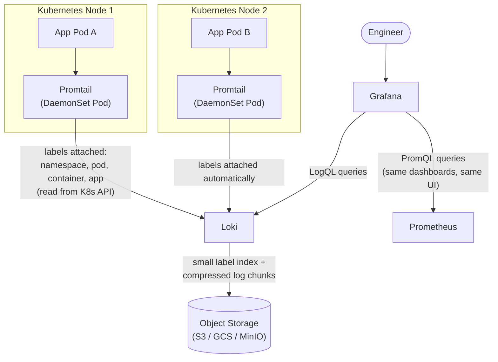

# Chapter 10 — Loki and Modern Log Aggregation

## Learning Objectives

By the end of this chapter you will be able to:

- Explain precisely why Loki indexes only labels, not log content, and why that is described as "Prometheus, but for logs"
- Describe how Promtail (and its newer evolutions, Grafana Agent and Grafana Alloy) discovers Kubernetes Pod logs and automatically attaches labels
- Read and write LogQL queries, including label selectors, line filters, and metric queries derived from log lines
- Compare Elasticsearch/ELK and Loki across indexing approach, cost, query model, and best-fit use case, and choose correctly between them
- Explain how Loki and Grafana let you view metrics and logs in the same UI you already use for Prometheus dashboards

## Prerequisites for This Chapter

- **Chapter 9 (The ELK Stack)** — required. This chapter is written as a direct continuation of Chapter 9's closing argument about Elasticsearch's operational cost, and assumes you understand what Elasticsearch, Logstash, and Kibana each do.
- **Chapter 3 (Prometheus Architecture) and Chapter 4 (PromQL and Querying)** — required. Loki's entire design is a deliberate parallel to Prometheus, and this chapter leans on that parallel constantly — if PromQL's label selectors and `rate()` function aren't fresh, revisit Chapter 4 first.
- **Chapter 6 (Grafana and Visualization)** — required. Loki is queried through the same Grafana instance you already configured as a Prometheus data source.
- **Kubernetes Basics, Chapter 12 (DaemonSets)** — required. Promtail is deployed as a DaemonSet, and this chapter assumes you know what that means and why.

---

## 10.1 Picking Up Where Chapter 9 Left Off

Chapter 9 ended with an honest admission about the ELK stack: Elasticsearch's operational cost comes largely from **full-text indexing** — every single word of every single log line gets tokenized, analyzed, and written into an inverted index so that Kibana can support rich, arbitrary text search across your entire log corpus. That capability is genuinely powerful, but it isn't free. The index Elasticsearch builds is frequently *larger than the raw log data itself*, and every document written has to pay that indexing cost up front, whether or not anyone ever searches for most of those words.

**Loki**, built by Grafana Labs and first released in 2018, starts from a different premise entirely: what if you didn't index the log content at all?

Instead of indexing every word, Loki indexes only a small, deliberately bounded set of **labels** — key-value metadata like `namespace="checkout"`, `app="api"`, `pod="checkout-api-7d9f8b-x2p4q"`, `container="api"` — and stores the actual log lines as compressed, append-only chunks that sit behind that label index. Searching for text within a stream of logs still works, but it happens by scanning the (already narrow, already-selected) compressed chunks at query time, not by consulting a pre-built full-text index.

This is commonly summarized in one sentence that should land immediately for anyone who has just finished Chapters 2 through 4 of this course:

> **Loki is often described as "Prometheus, but for logs."**

Make that analogy concrete, because it is not a marketing slogan — it is a literal description of the architecture:

| | Prometheus | Loki |
|---|---|---|
| What it indexes | Time series, identified by a metric name plus a set of labels (`http_requests_total{method="GET", status="200"}`) | Log **streams**, identified by a set of labels (`{namespace="checkout", app="api", container="api"}`) |
| What it does *not* index | The numeric sample values themselves — you never build an index of "which time series had the value 42" | The log line content itself — you never build an index of "which lines contain the word 'timeout'" |
| How you narrow a query | Select time series by label matchers first (`{job="checkout-api"}`), then apply functions | Select a log stream by label matchers first (`{app="api"}`), then filter the lines within it |
| Storage model | Compressed time-series chunks, indexed by labels | Compressed log-line chunks, indexed by labels |

In both systems, the index stays small and cheap precisely because it only ever has to represent the *combinations of labels in use*, not the full content flowing through the system. This is the single idea that explains almost everything else about how Loki behaves, how you query it, and when it is (and isn't) the right tool.

---

## 10.2 The Tradeoff, Made Explicit

A tiny label-only index has a direct, unavoidable consequence, and understanding it is the difference between using Loki well and being confused by it in production.

**Because Loki's index only knows about label combinations, a query that supplies good labels is extremely fast** — Loki narrows immediately to the small number of chunks belonging to that exact stream, then reads and filters only those. **A query without helpful labels has nothing to narrow with**, and falls back to scanning — decompressing and grepping through every chunk that could possibly match, across however many streams and time range you specified. This is comparatively much slower than Elasticsearch's equivalent, because Elasticsearch built a full-text index specifically to make that global search fast at query time, in exchange for paying the cost at write time instead.

The practical implication is a genuine shift in how you think about querying logs:

- **In Loki**, you query by known dimensions *first* — namespace, application, Pod, environment — the same way you'd first narrow a PromQL query with `{job="checkout-api"}` before doing anything else. Once you're looking at one already-narrow stream (or a small number of them), searching or filtering text *within* that stream is fast, because there just isn't that much data left to scan.
- **In Elasticsearch**, "find this word anywhere, in any log, from any service, with no other context" is a first-class, well-supported query pattern, because that's precisely the workload full-text indexing was built for.

Neither approach is universally superior — they optimize for different access patterns, which is exactly why section 10.4 treats "which one should I use" as a real decision rather than declaring a winner.

```mermaid
flowchart TB
    subgraph ES["Elasticsearch query"]
        Q1["'error' anywhere,\nno labels needed"] --> IDX["Full-text inverted index\n(built at write time)"] --> R1["Fast — the index\nwas built for this"]
    end
    subgraph LOKI["Loki query, well-labeled"]
        Q2["'{app=\"api\"} |= \"error\"'"] --> LBL["Label index\n(tiny, just label combos)"] --> CHUNK1["Narrowed to one stream's\ncompressed chunks"] --> R2["Fast — very little\ndata left to scan"]
    end
    subgraph LOKIBAD["Loki query, no labels"]
        Q3["'{} |= \"error\"'\n(match everything)"] --> LBL2["Label index can't help —\nevery stream matches"] --> CHUNKALL["Scan every chunk,\nevery stream, in range"] --> R3["Slow — this is exactly\nthe workload Loki\nwasn't optimized for"]
    end
```

---

## 10.3 Promtail, Grafana Agent, and Grafana Alloy: Loki's Log Shipper

Every logging pipeline needs something running on each node to find log files and ship them somewhere central — Chapter 9 covered Filebeat filling this role for the ELK stack. Loki's equivalent, and direct parallel, is **Promtail**.

Like Filebeat, Promtail is deployed as a **DaemonSet** (recall Kubernetes Basics, Chapter 12) — one Promtail Pod runs on every node in the cluster, so no matter which node a workload's Pods get scheduled onto, something is always present locally to read that Pod's logs from disk.

```yaml
# promtail-daemonset.yaml (abridged — a real install typically comes from the Loki Helm chart)
apiVersion: apps/v1
kind: DaemonSet
metadata:
  name: promtail
  namespace: monitoring
spec:
  selector:
    matchLabels:
      app: promtail
  template:
    metadata:
      labels:
        app: promtail
    spec:
      serviceAccountName: promtail
      containers:
        - name: promtail
          image: grafana/promtail:2.9.0
          args:
            - -config.file=/etc/promtail/promtail.yaml
          volumeMounts:
            - name: logs
              mountPath: /var/log/pods
              readOnly: true
            - name: config
              mountPath: /etc/promtail
      volumes:
        - name: logs
          hostPath:
            path: /var/log/pods
        - name: config
          configMap:
            name: promtail-config
```

What makes Promtail specifically valuable in a Kubernetes context, though, isn't just "it tails files" — it's **automatic label attachment**. Promtail talks to the Kubernetes API using the same service-discovery mechanism Prometheus itself uses (Chapter 3), and for every log line it ships, it automatically attaches labels straight from the Pod's own Kubernetes metadata: `namespace`, `pod`, `container`, and any of that Pod's own Kubernetes labels (`app`, `version`, `team`, whatever your Deployments already carry).

```yaml
# promtail.yaml — the relevant scrape_configs excerpt
scrape_configs:
  - job_name: kubernetes-pods
    kubernetes_sd_configs:
      - role: pod
    relabel_configs:
      - source_labels: [__meta_kubernetes_namespace]
        target_label: namespace
      - source_labels: [__meta_kubernetes_pod_name]
        target_label: pod
      - source_labels: [__meta_kubernetes_pod_container_name]
        target_label: container
      - source_labels: [__meta_kubernetes_pod_label_app]
        target_label: app
```

This is a genuine operational win worth calling out explicitly: **you get consistent, correct labels for free.** Nobody has to remember to configure an application to emit a `namespace` field into its own JSON logs, and nobody can get it wrong by typo, because Promtail reads the ground truth straight from the Kubernetes API rather than trusting whatever the application happened to embed in its own log format. The exact same class of automatic-metadata win you already saw with kube-state-metrics and ServiceMonitors in Chapter 5 shows up again here, applied to logs instead of metrics.

**Grafana Agent**, and its successor **Grafana Alloy**, are worth knowing by name even without deep configuration detail here: they are Grafana Labs' newer, unified telemetry collectors, designed to eventually replace separate single-purpose agents (Promtail for logs, the Prometheus node-exporter pattern for metrics, an OpenTelemetry Collector for traces) with one agent capable of collecting and shipping all three pillars. Think of this the same way you'd think of any tool's evolution: Promtail remains extremely common and fully supported in production today, but new deployments increasingly start with Alloy, which absorbs Promtail's exact Kubernetes log-discovery behavior described above as one of its capabilities, alongside metrics and trace collection in the same binary.

---

## 10.4 LogQL: Loki's Query Language

**LogQL** is Loki's query language, and it was deliberately modeled after PromQL specifically so that anyone who already learned Chapter 4 has a massive head start. Every LogQL query has the same two-part shape:

```logql
{label selector} | line filter(s) | further processing
```

### Part 1 — the label selector

This looks, on purpose, exactly like a PromQL instant vector selector:

```logql
{namespace="checkout", app="api"}
```

This alone is a complete, valid LogQL query — it returns every raw log line from every stream whose labels match `namespace="checkout"` AND `app="api"`, most recent first. Just like PromQL, you can use `=`, `!=`, `=~` (regex match), and `!~` (regex non-match):

```logql
{namespace="checkout", app=~"api|worker"}
```

### Part 2 — the line filter

Once you've narrowed to a stream (or small set of streams) using labels, you can filter the *text* of the lines within that stream using a pipe-based filter:

```logql
{namespace="checkout", app="api"} |= "error"
```

`|=` means "line contains this exact substring." The related operators are:

| Operator | Meaning |
|---|---|
| `\|=` | Line contains the string |
| `!=` | Line does not contain the string |
| `\|~` | Line matches the regex |
| `!~` | Line does not match the regex |

You can chain multiple filters, and this is exactly where the tradeoff from section 10.2 pays off in practice — the label selector does the cheap, index-backed narrowing, and the line filter does comparatively cheap text matching on an already-small amount of data:

```logql
{namespace="checkout", app="api"}
  |= "error"
  |= "timeout"
  != "healthcheck"
```

This reads: from the `checkout` namespace's `api` streams, show me lines containing both "error" and "timeout," excluding anything that also contains "healthcheck" (a classic way to cut out expected, noisy health-check log spam).

### Metric queries — deriving Prometheus-style metrics from log lines

This is LogQL's most genuinely powerful capability, and it's worth calling out explicitly because it blurs the line between the "logs" and "metrics" pillars that Chapter 1 was careful to separate. LogQL can wrap a log query in Prometheus-style range functions like `rate()` and `count_over_time()`, turning a stream of matching log lines directly into a numeric time series:

```logql
rate({app="api"} |= "error" [5m])
```

Read this exactly the way you'd read a PromQL `rate()` call from Chapter 4 — because it *is* the same function, applied to a different underlying data source. This produces "the number of log lines per second, over 5-minute windows, from the `api` app's streams, that contain the word 'error.'" You can graph this in Grafana as a normal time-series panel, set a threshold alert on it through Alertmanager (Chapter 7) exactly as you would a Prometheus metric — even though there was never an `error_total` counter instrumented anywhere in the application. If a service was never instrumented to expose an error-rate metric, but it logs its errors to stdout, LogQL lets you derive that metric after the fact, from the logs alone.

```logql
sum by (pod) (
  rate({namespace="checkout", app="api"} |= "error" [5m])
)
```

This further aggregates that derived error rate by `pod`, using the exact same `sum by (...)` aggregation syntax from Chapter 4 — LogQL and PromQL genuinely share this vocabulary, not just superficially.

---

## 10.5 ELK vs. Loki: A Direct Comparison

| | Elasticsearch / ELK (Chapter 9) | Loki |
|---|---|---|
| **Indexing approach** | Full-text — every word of every log line is tokenized and indexed | Labels only — log content is stored as compressed chunks, not indexed |
| **Index size relative to raw logs** | Often larger than the raw data itself | A small fraction of the raw data — just label metadata |
| **Cost / resource footprint at scale** | Comparatively heavy — significant CPU, memory, and disk for indexing and holding indices "hot" | Comparatively light — index is small; bulk of storage is cheap compressed chunk data |
| **Query model** | Kibana UI over Lucene-style full-text queries; strong arbitrary text search | LogQL — PromQL-styled label selector + line filter; strong for narrowed, labeled queries |
| **Best fit** | Rich full-text search across unstructured or unlabeled content; security/SIEM-style investigation where you don't know in advance what you're looking for or where | Kubernetes-native teams already using Prometheus/Grafana who want a much cheaper, tightly integrated logging layer for known services/namespaces |
| **Operational overhead** | Self-managed Elasticsearch clusters are comparatively heavy to run well (shard management, JVM heap tuning, hot/warm tiering) | Comparatively lighter, though large-scale Loki still needs real object storage (S3-compatible) and careful configuration of chunk/index settings — it is not zero-ops |
| **Integrates with** | Kibana (its own dedicated UI) | Grafana — the same UI already used for Prometheus dashboards |

Neither tool is a strictly better version of the other — they were built with different access patterns as the explicit design target, and choosing between them (or running both, which is common at larger organizations with different teams and use cases) should follow from which access pattern actually matches your day-to-day querying needs, not from which one is newer or trendier.

---

## 10.6 Architecture: How It All Fits Together



The point of drawing Prometheus and Loki side by side in that diagram is deliberate: from the engineer's point of view, sitting in Grafana, there is no meaningful seam between "look at a metrics panel" and "look at a logs panel." It's the same login, the same dashboard-editing UI, often the same dashboard, just two different data sources plugged into the same tool you already learned in Chapter 6.

---

## 10.7 Real-World Scenario

A Kubernetes-native startup has been running `kube-prometheus-stack` and Grafana since Chapter 5 — Prometheus scraping their services, Grafana dashboards showing request rate, latency, and error-rate panels for each of their dozen or so microservices. Logging, until now, has meant `kubectl logs`, one Pod at a time, which has become increasingly painful as the number of services and replicas has grown.

The team evaluates the ELK stack (per Chapter 9) and Loki side by side. Their actual logging needs are fairly narrow: when an alert fires or a dashboard panel spikes, an engineer wants to jump straight to "show me this service's logs, in this namespace, around this timestamp" — they are almost never doing open-ended, no-labels, full-text search across the entire company's log history. That access pattern is exactly what Loki is built for, and specifically not what would justify Elasticsearch's heavier resource and operational cost at their log volume.

They deploy Loki plus Promtail via the official Helm chart, pointed at an S3-compatible bucket for chunk storage, and add Loki as a second data source in the **exact same Grafana instance** they already had running for Prometheus. Within the same dashboard used to investigate a latency spike, they add a logs panel directly below the metrics panel, both scoped to the same namespace and time range — so a spike in the `p99 latency` graph and the corresponding application logs are visible in the same screen, without switching tools, without a separate login, without learning a second UI. Their total logging infrastructure cost is a small fraction of what a self-managed Elasticsearch cluster at the same log volume would have required, and the "one pane of glass" experience turns out to matter more day-to-day than the full-text search capability they gave up.

---

## Best Practices

- Always query Loki by label first, and let the line filter narrow within that — never rely on `{}`-with-no-labels queries as your default habit.
- Keep label cardinality bounded, exactly as you learned for Prometheus in Chapter 2 — never attach a high-cardinality value (a request ID, a raw timestamp, a user ID) as a Loki label; put that inside the log line content instead, where it can still be searched with a line filter.
- Let Promtail's automatic Kubernetes label attachment do the work — resist the urge to duplicate `namespace`/`pod`/`container` as application-level structured log fields when Promtail already gives you correct labels for free.
- Use LogQL metric queries (`rate(...)`, `count_over_time(...)`) to backfill an error-rate signal for services that weren't instrumented with a proper Prometheus counter, but treat this as a stopgap, not a substitute for direct instrumentation (Chapter 2).
- Provision real object storage (S3, GCS, or a self-hosted equivalent like MinIO) for any Loki deployment beyond a small test cluster — running Loki against local disk only works for the smallest of setups.

## Common Mistakes

- Treating Loki like Elasticsearch and writing broad, label-less queries, then being surprised when they're slow — the slowness is not a bug, it's the direct consequence of the architecture in section 10.2.
- Attaching high-cardinality values as Loki labels (e.g., a unique request ID per line), which explodes the number of distinct streams Loki has to track and defeats the entire "small index" design goal.
- Forgetting to provision durable object storage and running a production Loki instance on ephemeral or under-provisioned local storage.
- Assuming Loki and Elasticsearch are interchangeable rather than making a deliberate choice based on actual query patterns (narrowed-by-label vs. open-ended full-text).

*(The full catalog of monitoring/logging pitfalls is covered in Chapter 15 — Common Mistakes and Pitfalls.)*

---

## Summary

- Loki indexes only labels, not log content, and stores log lines as compressed chunks — it is deliberately "Prometheus, but for logs," in the same way Prometheus indexes time series by labels rather than by sample values.
- Because Loki's index is tiny, it is cheap to run and store at scale, but queries without helpful labels fall back to scanning compressed chunks — Loki rewards querying by known dimensions (namespace, app, pod) first.
- Promtail (and its successors Grafana Agent and Grafana Alloy) ships logs as a DaemonSet, discovering Pods via the Kubernetes API and automatically attaching correct `namespace`/`pod`/`container` labels — a major, free operational win over hand-configured metadata.
- LogQL mirrors PromQL: a label selector narrows to a stream, an optional line filter (`|= "error"`) searches text within it, and metric queries like `rate({app="api"} |= "error" [5m])` can derive Prometheus-style numeric metrics directly from log lines.
- ELK and Loki solve different access patterns: Elasticsearch excels at rich, open-ended full-text search (security/SIEM-style investigation); Loki excels at cheap, Kubernetes-native, label-narrowed logging tightly integrated with Grafana and Prometheus.
- Grafana can show Prometheus metrics and Loki logs side by side, in the same dashboards, using the same UI — a genuine "one pane of glass" outcome.

---

## Knowledge Check

1. In one or two sentences, explain why Loki is described as "Prometheus, but for logs," referencing specifically what each system does and does not index.
2. Why does a label-less LogQL query (e.g., `{} |= "error"`) perform poorly compared to the same search in Elasticsearch? What is Loki's index actually good at answering?
3. What specific problem does Promtail's automatic Kubernetes label attachment solve, and why is it more reliable than asking every application team to embed the same metadata in their own log format?
4. Write a LogQL query that returns the rate of log lines per second, over a 10-minute window, containing the string "panic," from the `payments` namespace's `worker` app.
5. Give one scenario where Elasticsearch is clearly the better choice over Loki, and one scenario where Loki is clearly the better choice over Elasticsearch.
6. Why should a request ID never be used as a Loki label, even though it would make queries for a specific request trivially fast?

---

## Hands-On Exercise

Using your local `kind` cluster (or any Kubernetes cluster with `kube-prometheus-stack` and Grafana already installed from Chapters 5–6):

1. Install Loki and Promtail using the official Helm chart:
   ```bash
   helm repo add grafana https://grafana.github.io/helm-charts
   helm repo update
   helm install loki grafana/loki-stack \
     --namespace monitoring --create-namespace \
     --set promtail.enabled=true
   ```
2. Confirm Promtail is running as a DaemonSet with one Pod per node: `kubectl get daemonset -n monitoring promtail`.
3. Add Loki as a data source in your existing Grafana instance (Configuration → Data Sources → Add data source → Loki), pointing at `http://loki.monitoring.svc.cluster.local:3100`.
4. Deploy a simple app that logs to stdout (any image that prints periodic lines works, e.g. a busybox loop printing `"INFO request handled"` and occasionally `"ERROR timeout calling downstream"`).
5. In Grafana's Explore view, run these LogQL queries against your app's namespace and observe the results:
   - `{namespace="default"}`
   - `{namespace="default"} |= "ERROR"`
   - `rate({namespace="default"} |= "ERROR" [5m])` — switch the panel to graph view and confirm it renders as a time series, not raw log lines.
6. Build one Grafana dashboard panel showing the derived error rate (step 5's third query) side by side with a Prometheus metrics panel from Chapter 6, in the same dashboard.
7. Clean up: `helm uninstall loki -n monitoring`.

---

## Further Reading

- grafana.com/docs/loki/latest/get-started/ — official Loki architecture and getting-started guide
- grafana.com/docs/loki/latest/query/ — the full LogQL language reference
- grafana.com/docs/loki/latest/send-data/promtail/ — Promtail configuration and Kubernetes service discovery
- grafana.com/docs/alloy/latest/ — Grafana Alloy, the unified successor to Promtail and Grafana Agent
- grafana.com/blog/2018/12/12/loki-prometheus-inspired-open-source-logging-for-cloud-natives/ — Grafana Labs' original announcement, explaining the "Prometheus for logs" design philosophy directly from its creators

---

<div style="display:flex;justify-content:space-between;align-items:center;">
  <a href="./09-elk-stack.md">← Previous: The ELK Stack</a>
  <a href="./00-index.md">🏠 Index</a>
  <a href="./11-distributed-tracing.md">Next: Distributed Tracing →</a>
</div>
