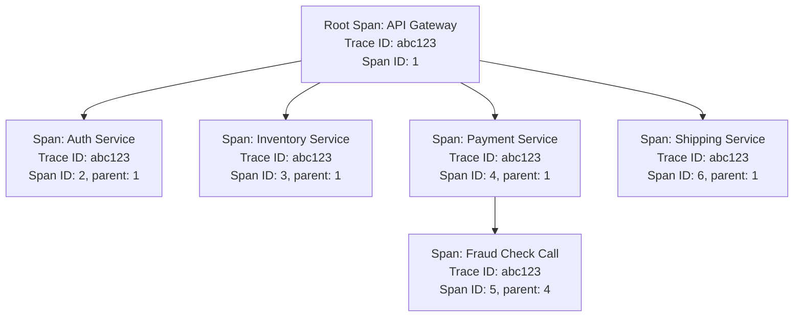
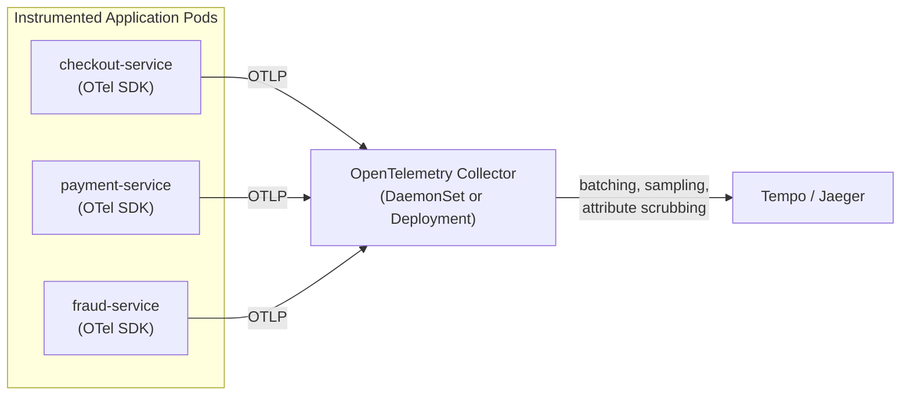
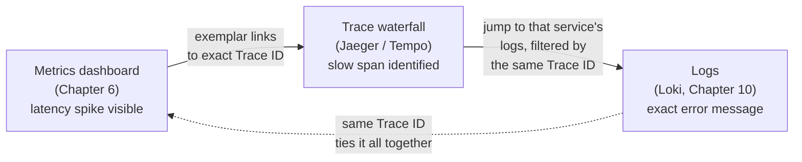

# Chapter 11 — Distributed Tracing

## Learning Objectives

By the end of this chapter you will be able to:

- Explain precisely what problem distributed tracing solves that metrics and logs, even combined, cannot solve on their own
- Define trace, span, parent-child relationship, and trace ID, and read a waterfall diagram to identify a bottleneck
- Explain context propagation and why tracing requires instrumentation rather than happening automatically
- Describe OpenTelemetry's role as a vendor-neutral instrumentation standard, and the difference between auto- and manual instrumentation
- Compare Jaeger and Grafana Tempo as tracing backends
- Describe how traces, logs, and metrics correlate together in a single investigative workflow
- Make an honest, reasoned decision about sampling strategy and when tracing investment actually pays off

## Prerequisites for This Chapter

- **Chapter 1 (Introduction to Observability)** — required, specifically the three-pillars table and the multi-service checkout request diagram, which this chapter revisits directly.
- **Chapter 10 (Loki and Modern Log Aggregation)** — required. Tempo's storage philosophy and the trace-to-log correlation workflow both build directly on Loki concepts from that chapter.
- **Chapter 6 (Grafana and Visualization)** — required. Trace visualization happens in the same Grafana instance already used for metrics and logs.
- **Advanced Kubernetes, Chapter 7 (Service Mesh)** — recommended. This chapter's cost/benefit framing deliberately echoes that chapter's honest treatment of "do you actually need this cross-cutting infrastructure."

---

## 11.1 The Problem Metrics and Logs Cannot Solve Alone

Return to the three-pillars table from Chapter 1. Metrics tell you *that* something is wrong and give you an aggregate trend — "p99 latency for the checkout service just jumped from 200ms to 900ms." Logs tell you the detailed content of individual events — "user 4521's request failed with a timeout exception at 14:32:07." Both are per-service, or at best, per-request-if-you-know-which-request. Neither one, even combined, was designed to answer a question that becomes unavoidable the moment your architecture is genuinely a microservices architecture rather than a single monolith: recall the diagram from Chapter 1, section 1.3 — a single checkout request fanned out across `API Gateway → Auth Service → Inventory Service → Payment Service → Shipping Service`.

In a real production system, that fan-out is often not five services but eight, ten, or fifteen, each maintained by a different team, each with its own dashboards and its own logs. When a user-facing request is slow or fails, the metrics dashboard for any *one* of those services can tell you that service's own health — but none of them, individually, can tell you **which of the other 7–14 services in the call chain was actually responsible** for a specific request being slow. `payment-service`'s own dashboard might look perfectly healthy on average while still occasionally taking 700ms for a specific subset of requests; `checkout-service`'s dashboard just sees "the overall call was slow" without visibility into where inside that call the time went.

This is a genuinely different problem class than aggregating metrics or logs per service in isolation — it requires following *one single request* as it crosses every service boundary, and that is exactly what distributed tracing exists to do.

---

## 11.2 Core Vocabulary: Traces, Spans, and Trace IDs

### Trace

A **trace** represents one complete request's entire journey through a distributed system, from the moment it enters (typically at an API gateway or load balancer) to the moment a response is returned to the caller. One user click, one trace.

### Span

A **span** represents one discrete unit of work within that journey — one service handling one call, one database query, one call to an external API. Every span records, at minimum:

- A **start time** and a **duration**
- **Metadata** (often called attributes or tags) — the operation name, HTTP status code, database query text, or any other custom key-value data the instrumentation attaches
- A reference to its **parent span**, if it has one

### Parent-child relationships and the trace tree

Spans are connected in a **parent-child** relationship, forming a tree. The very first span — the one created at the entry point, before any downstream call has happened yet — is the **root span**. Every call that root span's service makes to another service creates a new **child span**, and if that downstream service makes further calls, those become grandchild spans, and so on. The result is a tree structure that mirrors exactly how the request actually branched out.

### Trace ID

None of this correlation works unless every span, across every service, agrees on which trace it belongs to. A **Trace ID** — a single unique identifier — is generated once, at the very first entry point into the system, and is propagated to every downstream service on every call it makes for the lifetime of that one request. Every span created anywhere in that request's lifetime carries the same Trace ID, which is the only reason a tracing backend can later reassemble dozens of independently-reported spans, from dozens of independent services, back into one coherent trace tree.



### The Waterfall View: Where Tracing Earns Its Keep

Reassembled traces are almost always visualized as a **waterfall** (or Gantt-style) diagram — spans stacked vertically by parent-child relationship, positioned horizontally by start time and sized by duration. This is the single most valuable view in all of tracing, because it makes a bottleneck immediately, visually obvious in a way no per-service dashboard can.

```mermaid
gantt
    title Trace Waterfall — One Checkout Request (900ms total)
    dateFormat X
    axisFormat %L ms

    section API Gateway
    API Gateway (900ms total)      :a1, 0, 900

    section Auth
    Auth Service (50ms)            :a2, 0, 50

    section Inventory
    Inventory Service (100ms)      :a3, 50, 150

    section Payment
    Payment Service (700ms) — BOTTLENECK :crit, a4, 150, 850

    section Shipping
    Shipping Service (50ms)        :a5, 850, 900
```



Look at what this diagram shows in one glance that would take real effort to piece together from five separate service dashboards: the total request took 900ms, and **Payment Service alone consumed 700ms of it** — nearly 78% of the entire request's latency budget. Auth, Inventory, and Shipping combined only account for 200ms. If you were only looking at `checkout-service`'s own aggregate p99 latency metric, you would correctly conclude "checkout is slow" — but you would have no direct way to know, without tracing, that the actual bottleneck sits specifically inside the payment call and not somewhere else in the chain. This is the concrete, unambiguous value proposition of distributed tracing: it turns "something in this chain of 5+ services is slow" into "this specific span, in this specific service, is the bottleneck," directly and visually.

---

## 11.3 Context Propagation: The Mechanical Requirement

None of the correlation in section 11.2 happens automatically. It works only because of a specific mechanical requirement called **context propagation**: the Trace ID (and the ID of the current span, which becomes the new call's "parent") must be attached to every single downstream network call, so the receiving service knows which trace and which parent span its own new span belongs to.

In practice, this context is carried as HTTP headers, standardized by the **W3C Trace Context** specification — most commonly a header named `traceparent`:

```
traceparent: 00-4bf92f3577b34da6a3ce929d0e0e4736-00f067aa0ba902b7-01
             │  └────────── trace id ─────────┘ └── parent span id ─┘ │
             │                                                        └─ flags (e.g., sampled)
             └─ version
```

When `checkout-service` calls `payment-service`, it must include this header on the outbound HTTP (or gRPC) request; `payment-service` must read that header on the inbound side, extract the Trace ID and parent Span ID, generate its own new Span ID as a child of that parent, and — critically — **propagate the same header forward** on any calls *it* makes to `fraud-service`. Break that chain anywhere — a service that doesn't read the incoming header, or doesn't forward it on its own outbound calls — and the trace fragments into disconnected pieces instead of one coherent tree.

This is the reason tracing cannot simply be "turned on" the way, say, a Kubernetes-level metric like CPU usage can be scraped from the outside with zero application changes. **Your services' HTTP clients and frameworks need tracing instrumentation** to automatically inject and extract these headers — it is not a side effect of the network, it is a deliberate, per-service software behavior that has to be present everywhere in the call chain for a trace to stay intact end to end.

Two other pieces of context vocabulary are worth knowing by name, because you will see them in OpenTelemetry documentation and span viewers immediately:

- **Span attributes** — key-value metadata attached to a single span, describing that specific unit of work (`http.status_code=200`, `db.statement="SELECT * FROM orders"`). These are what let you filter and search traces meaningfully ("show me all traces where `http.status_code >= 500`"), and what populated the `order.id` and `shipping.cost_usd` fields in the manual instrumentation example later in this chapter.
- **Span events** — timestamped points *within* a span's duration, marking something notable that happened during that unit of work without ending the span (e.g., "retry attempt 1 at +120ms," "cache miss at +15ms"). Think of them as a span's own miniature, embedded log line, scoped to exactly that operation.

Neither of these is required to get basic tracing working, but both are what turn a bare waterfall of "which span took how long" into a genuinely rich debugging tool — attributes and events are frequently what an engineer actually reads once a slow span has already been located.

---

## 11.4 OpenTelemetry: The Vendor-Neutral Standard

Instrumenting every service by hand, against a specific tracing vendor's proprietary SDK, was exactly the failure mode the industry converged to solve with **OpenTelemetry (OTel)** — now a CNCF project, and the current industry-standard, vendor-neutral specification and set of SDKs/instrumentation libraries for generating and exporting telemetry. This chapter focuses on OTel's tracing capability, but the same project also standardizes metrics and logs, positioning it as the eventual common instrumentation layer across all three pillars of this entire course.

**Why vendor-neutrality matters practically:** you instrument your application once, using OTel's SDKs, and configure an **exporter** to send the resulting spans to whichever backend you choose today — Jaeger, Tempo, or a commercial APM vendor. If your organization later decides to switch backends (say, from a paid vendor to self-hosted Tempo, to control cost), you change an exporter configuration value, not the instrumentation embedded throughout dozens of services' codebases. Before OpenTelemetry, switching tracing vendors commonly meant re-instrumenting every service from scratch, because each vendor shipped its own proprietary client library with its own API surface. OTel removed that lock-in by standardizing the instrumentation layer independently of any specific backend.

### Auto-instrumentation vs. manual instrumentation

- **Auto-instrumentation**: many OTel SDKs can automatically instrument common frameworks and libraries — an HTTP server framework, a database client, a message queue client — with minimal code changes, often just adding an agent or a few lines of setup code. This gets you spans for every inbound request and every outbound call to a known, supported library, for free, without touching your business logic.
- **Manual instrumentation**: adding custom spans explicitly around specific business logic you want visibility into, that auto-instrumentation could never know about — for example, wrapping a specific pricing-calculation function or a cache-warming routine in its own span, with custom attributes describing exactly what it computed.

```python
# Manual instrumentation example (Python, using the OTel SDK)
from opentelemetry import trace

tracer = trace.get_tracer(__name__)

def calculate_shipping_cost(order):
    with tracer.start_as_current_span("calculate_shipping_cost") as span:
        span.set_attribute("order.id", order.id)
        span.set_attribute("order.weight_kg", order.weight_kg)
        cost = _run_pricing_engine(order)
        span.set_attribute("shipping.cost_usd", cost)
        return cost
```

A realistic production service typically uses both: auto-instrumentation for the "free" spans around HTTP handling and database calls, plus a handful of manually added spans around the specific pieces of business logic the team most cares about understanding.

---

## 11.5 Tracing Backends: Jaeger and Grafana Tempo

OpenTelemetry generates and exports spans; something still has to receive, store, and let you query and visualize the resulting traces. Two popular open-source options:

| | Jaeger | Grafana Tempo |
|---|---|---|
| Origin | Built at Uber, CNCF graduated project | Built by Grafana Labs |
| Maturity | Mature, long track record, widely deployed | Newer, but built directly on Loki's proven design philosophy |
| Storage philosophy | Traditionally uses its own storage backends (Cassandra, Elasticsearch, or in-memory for small setups) | Deliberately designed to be cheap at scale using **object storage** (S3-compatible) — same underlying idea as Loki from Chapter 10: don't build an expensive index over the full trace content, index only what's needed (trace IDs) and store the rest cheaply |
| UI | Has its own dedicated web UI for browsing and searching traces | No standalone UI of its own — integrates natively into Grafana, the same UI already used for Prometheus metrics and Loki logs |
| Best fit | Teams that want a mature, standalone tracing system, or are not already standardized on Grafana | Teams already invested in Grafana + Prometheus + Loki who want one integrated observability UI across all three pillars |

This is the same architectural pattern from Chapter 10 showing up again in a different pillar: Tempo, like Loki, avoids building an expensive full-content index and instead keeps its index small (essentially, "which trace IDs exist and where are their chunks"), leaning on cheap object storage for the bulk of the data. The emerging industry pattern this produces is sometimes informally called **"PLG, extended"** — Prometheus, Loki, and Grafana, now joined by Tempo, giving a single tool (Grafana) as the query and visualization layer across metrics, logs, and traces simultaneously, each backed by a purpose-built, cost-conscious storage system rather than one general-purpose database trying to do all three.

---

## 11.6 Getting Traces Out of Kubernetes: The OpenTelemetry Collector

Section 11.4 covered instrumenting an individual service's code with the OTel SDK. In a Kubernetes environment, there is usually one more piece worth understanding: the **OpenTelemetry Collector**, a standalone component that sits between your instrumented applications and whichever backend(s) you send traces to.

Rather than every service's SDK exporting spans directly to Tempo or Jaeger, a common pattern has each service export to a local or cluster-wide **Collector** instead, which then batches, processes, and forwards spans onward. This buys you a few concrete things: you can change your tracing backend, add sampling logic, or scrub sensitive attributes from spans (a customer's email address accidentally attached to a span, for instance) in one central place, without touching a single line of application code or redeploying every service.



The Collector is commonly deployed as a **DaemonSet** (one instance per node, receiving spans from every Pod on that node over `localhost`) or as a central `Deployment` fronted by a Service — the same two deployment shapes you already know well from Kubernetes Basics, applied here to telemetry routing rather than application traffic. Many organizations also use the Collector as the single place where **tail-based sampling** (section 11.8) is actually implemented, since making a keep/drop decision after a request completes requires buffering all of that request's spans somewhere centrally — the Collector is a natural place for that buffering to live, rather than each individual service trying to implement it independently.

---

## 11.7 Correlating Traces, Logs, and Metrics — The Actual Payoff

Everything in Chapters 2 through 11 has been building toward this single workflow, because this is where having all three pillars *wired together* becomes worth meaningfully more than the sum of its parts.

The workflow, concretely:

1. A **metrics dashboard** (Chapter 6) shows a latency spike in a histogram panel for `checkout-service`.
2. Many tools support **exemplars** — a Prometheus feature (Chapter 4) that links a specific histogram observation to the exact Trace ID that produced it. Instead of just seeing "p99 went up," you can click directly from that specific data point on the graph into the one slow trace that contributed to it.
3. That trace opens as a waterfall view (section 11.2), and its slow span immediately shows you which specific service or downstream call was responsible — exactly like the Payment Service example above.
4. From that specific span, you jump directly into that service's **logs**, filtered to the exact Trace ID of the request you're investigating. Both Loki (Chapter 10) and modern structured logging setups support attaching the Trace ID as a log label or field specifically to make this jump possible — a log line like `{trace_id="abc123"} level=error msg="fraud check timed out"` is directly queryable in LogQL as `{app="payment"} | trace_id="abc123"`.



This closes the loop described all the way back in Chapter 1's opening incident story: a metrics spike, correlated to a specific trace, correlated to the exact log line explaining *why* — all inside minutes, without a single manual `grep` across an unknown set of Pods.

---

## 11.8 The Honest Cost/Benefit Conversation

Echoing Advanced Kubernetes Chapter 7's treatment of service mesh adoption directly: distributed tracing is genuinely valuable, but it is not free, and the right posture toward adopting it is deliberate evaluation, not reflexive enthusiasm.

**The real costs:**

- **Instrumentation work.** Every service in the call chain needs tracing instrumentation, and context propagation (section 11.3) needs to work correctly across every hop — a single un-instrumented service, or one that fails to forward the `traceparent` header, breaks the trace at that point. This is meaningful, ongoing engineering work across every team that owns a service in your architecture, not a one-time infrastructure install.
- **Sampling decisions matter.** Tracing every single request at high request volume is often too expensive — the storage and processing overhead of capturing full trace detail for 100% of traffic can be substantial at scale. Two broad sampling strategies exist:
  - **Head-based sampling**: the decision of whether to trace a given request is made at the very start, before anything is known about how that request will turn out. Simple and cheap to implement, but it means you're deciding "sample this request" or "don't" blindly — you might sample a boring, fast, successful request and miss the one slow outlier that would have actually been useful.
  - **Tail-based sampling**: the system waits until a request completes, and only then decides whether to keep its trace — which means it can specifically and deliberately keep traces of slow or failed requests, at a high sampling rate, while still sampling away most ordinary, healthy requests at a much lower rate. This gives you the traces you actually want to look at (the interesting, problematic ones) without paying the storage cost of capturing everything. It is more complex to implement, because it requires buffering all spans for a request somewhere until the request finishes.

**When it pays off:** tracing earns its cost most clearly once you have enough services in a request's call chain that "which service is actually slow" becomes a genuinely hard question to answer from per-service metrics and logs alone. For two or three services, an engineer can often reason about a slow request manually, checking each service's dashboard in turn. Once that number reaches double digits, spread across multiple teams, manual reasoning stops scaling, and a trace waterfall becomes the fastest way to a correct answer, not merely a nice-to-have.

---

## 11.9 Real-World Scenario

A checkout flow spans six microservices: `api-gateway`, `auth-service`, `cart-service`, `inventory-service`, `payment-service`, and `fraud-service` (called internally by `payment-service`). For several weeks, the team has noticed an intermittent p99 latency spike on the overall checkout endpoint — but their existing per-service Grafana dashboards (Chapter 6) all look healthy on average. Every individual service's own p50/p95 latency panels are unremarkable; the spike only shows up in the *end-to-end* checkout latency metric, and nobody can tell which of the six services is actually responsible on the occasions it happens.

The team instruments all six services with OpenTelemetry — auto-instrumentation for each service's HTTP framework and outbound HTTP client, plus a few manual spans around business logic the `payment-service` team specifically wanted visibility into — and exports traces to Grafana Tempo, using tail-based sampling so that slow and failed requests are captured at a much higher rate than routine successful ones.

Within the first day of having real trace data, they filter Tempo for traces exceeding 2 seconds in total duration, and every single one of them shows the same pattern: a child span inside `payment-service`, specifically its call out to `fraud-service`, occasionally taking upwards of 4 seconds, while every other span in the same trace remains under 100ms. Digging into `fraud-service`'s own code (informed by the trace's span attributes, which included the specific fraud-check type being performed) reveals the cause: a particular fraud-rule lookup path skips a cache that every other rule path uses, hitting a slow upstream data source directly on every request of that specific type. The fix is a one-line change adding that lookup to the existing cache layer. Without tracing, this root cause — a single uncached code path, inside one specific downstream service, triggered only for a subset of requests — would have been extremely difficult to isolate from aggregate per-service metrics alone, because `fraud-service`'s own average latency looked fine; only the specific, rare, slow code path was the problem, and only a trace waterfall made that visible directly.

---

## Best Practices

- Treat context propagation as a hard requirement, not an optional nicety — a single service that fails to forward trace headers breaks every trace that passes through it, silently.
- Instrument with OpenTelemetry specifically, rather than a vendor-proprietary SDK, so you retain the freedom to change tracing backends later without re-instrumenting every service.
- Start with auto-instrumentation for broad coverage, and add manual spans only around the specific business logic you genuinely want deeper visibility into — don't hand-instrument everything from day one.
- Use tail-based sampling once request volume makes 100% sampling too expensive, so you keep the traces most likely to be useful (slow, failed) rather than a random, possibly-boring subset.
- Attach the Trace ID as a field/label on your structured logs specifically to enable the trace-to-log jump described in section 11.7 — this one small addition is what makes cross-pillar correlation actually work in practice.
- Don't attempt full tracing coverage on day one across dozens of services — roll it out incrementally, starting with the services most implicated in your hardest-to-diagnose past incidents.

## Common Mistakes

- Instrumenting some services but not others in a call chain, producing fragmented traces that stop at the first un-instrumented hop and give a misleading picture of where time was actually spent.
- Sampling 100% of traffic at high request volume without considering the storage/processing cost, or the opposite mistake — sampling so aggressively with a naive head-based approach that the rare, interesting slow traces are the ones most likely to get dropped.
- Treating tracing as a replacement for metrics and logs rather than a third, complementary pillar — a trace tells you where time went in one request; it does not replace an aggregate dashboard or a searchable log corpus.
- Adopting distributed tracing prematurely, for a two- or three-service architecture, where the engineering cost of full instrumentation exceeds the diagnostic benefit at that scale.

*(The full catalog of monitoring/logging pitfalls is covered in Chapter 15 — Common Mistakes and Pitfalls.)*

---

## Summary

- Distributed tracing solves a problem metrics and logs cannot: identifying which single service, out of many in a request's call chain, was actually responsible for that request being slow or failing.
- A trace represents one request's full journey; a span represents one unit of work within it; spans form a parent-child tree; a Trace ID, generated at the entry point and propagated to every downstream call, ties all of a request's spans back into one coherent trace.
- Context propagation — carrying the Trace ID and parent Span ID as HTTP headers (`traceparent`, the W3C standard) — is a mechanical requirement that only works if every service in the chain is instrumented to forward it; it does not happen automatically.
- OpenTelemetry is the current vendor-neutral standard for generating and exporting traces (and metrics and logs): instrument once, choose and swap backends freely, using both auto-instrumentation (broad, low-effort coverage) and manual instrumentation (targeted business-logic visibility).
- Jaeger and Grafana Tempo are two popular open-source tracing backends; Tempo mirrors Loki's cost-conscious, object-storage-backed philosophy and integrates natively into the same Grafana UI already used for metrics and logs.
- An OpenTelemetry Collector, typically deployed as a DaemonSet or Deployment, sits between instrumented services and tracing backends, centralizing batching, sampling decisions, and sensitive-attribute scrubbing without touching application code.
- The real payoff is correlation: a metrics spike links via exemplars to a specific slow trace, whose slow span links directly to that service's logs filtered by Trace ID — closing the loop from "something is wrong" to "here is exactly why" in minutes.
- Tracing has real costs (instrumentation effort across every service, and sampling tradeoffs between head-based and tail-based strategies) and pays off most clearly once a request's call chain is large enough that "which service is slow" is a genuinely hard question without it.

---

## Knowledge Check

1. Explain, using the waterfall diagram from section 11.2, exactly why tracing revealed the Payment Service as the bottleneck when no single per-service dashboard could have shown this as clearly.
2. What is a Trace ID, when is it generated, and why must it be propagated to every downstream service call?
3. Why does distributed tracing require instrumentation, unlike, say, scraping CPU metrics from the outside with no application changes?
4. What specific practical problem does OpenTelemetry's vendor-neutrality solve, and how would switching from Jaeger to Tempo differ for an OTel-instrumented service versus one instrumented against a proprietary SDK?
5. Explain the difference between head-based and tail-based sampling, and why tail-based sampling is more likely to preserve the traces you actually want to investigate.
6. Describe, step by step, the correlated workflow that takes an engineer from a metrics dashboard spike to the exact log line explaining the root cause.
7. What role does an OpenTelemetry Collector play between an instrumented service and a tracing backend, and why is it a natural place to implement tail-based sampling?

---

## Hands-On Exercise

**Goal:** Instrument a small multi-service application with OpenTelemetry and observe a trace waterfall in Grafana Tempo.

1. On your local `kind` cluster (or Docker Compose, if you prefer a lighter setup for this exercise), deploy Grafana Tempo:
   ```bash
   helm repo add grafana https://grafana.github.io/helm-charts
   helm install tempo grafana/tempo --namespace monitoring --create-namespace
   ```
2. Add Tempo as a data source in your existing Grafana instance (Configuration → Data Sources → Add data source → Tempo), pointing at Tempo's query endpoint.
3. Take (or write) two or three small HTTP services that call each other in a chain (for example, a `gateway` service that calls a `worker` service, which calls a `database` or mock-downstream service). Add the OpenTelemetry SDK for your language of choice to each, enabling auto-instrumentation for the HTTP server and HTTP client libraries, and configure each service's OTel exporter to send spans to Tempo's OTLP endpoint.
4. Add one manual span in the `worker` service around a specific function, with at least one custom attribute set via `span.set_attribute(...)` (or your language's equivalent).
5. Generate a few requests through the `gateway` service, then open Grafana's Explore view, select the Tempo data source, and search for recent traces. Open one and confirm you can see the full waterfall: the root span, its child spans, and your manually added span with its custom attribute visible.
6. Artificially slow down the `database`/downstream service (e.g., add a `sleep`) and re-run a request. Confirm the resulting trace's waterfall visually shows that service's span as the dominant contributor to total duration — the same pattern as the Payment Service example in this chapter.

---

## Further Reading

- opentelemetry.io/docs/concepts/signals/traces/ — OpenTelemetry's own conceptual guide to traces and spans
- w3.org/TR/trace-context/ — the W3C Trace Context specification defining the `traceparent` header
- grafana.com/docs/tempo/latest/ — Grafana Tempo documentation, including its object-storage-backed architecture
- jaegertracing.io/docs/latest/architecture/ — Jaeger's architecture documentation
- research.google/pubs/dapper-a-large-scale-distributed-systems-tracing-infrastructure/ — Google's Dapper paper, the foundational research behind essentially every modern distributed tracing system

---

<div style="display:flex;justify-content:space-between;align-items:center;">
  <a href="./10-loki-and-log-aggregation.md">← Previous: Loki and Modern Log Aggregation</a>
  <a href="./00-index.md">🏠 Index</a>
  <a href="./12-slis-slos-and-error-budgets.md">Next: SLIs, SLOs, and Error Budgets →</a>
</div>
