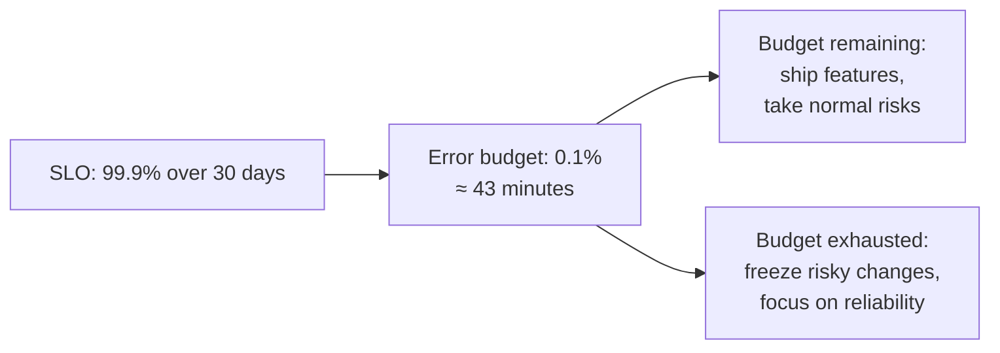
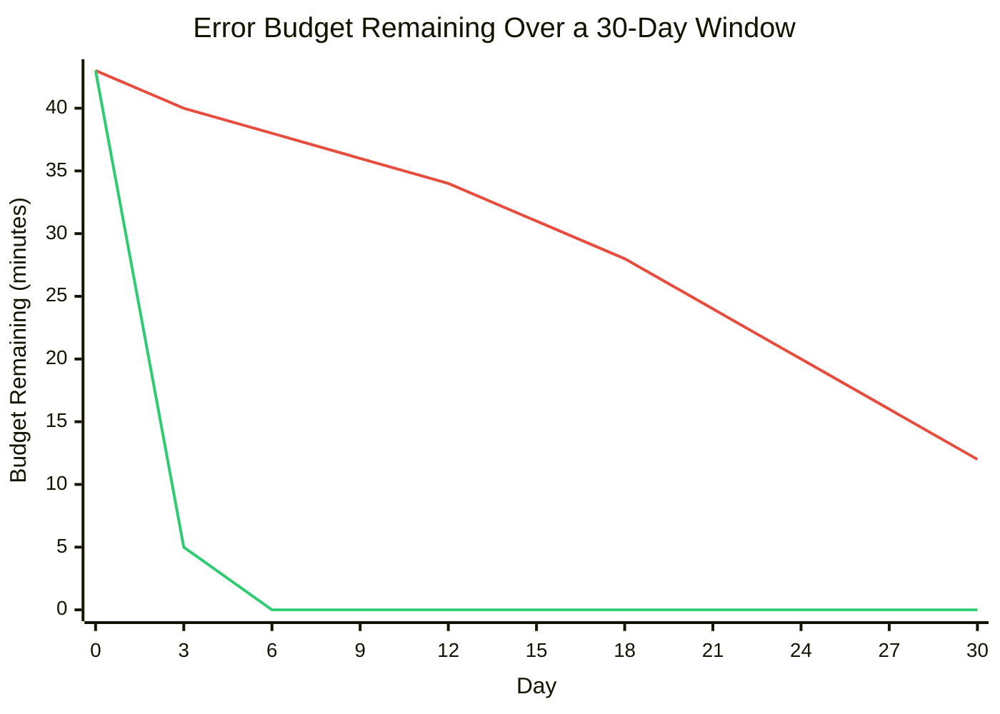
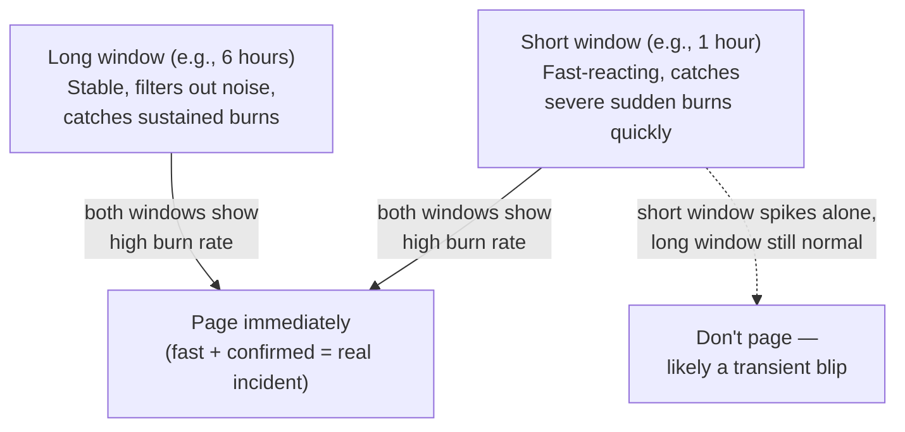

# Chapter 12 — SLIs, SLOs, and Error Budgets

## Learning Objectives

By the end of this chapter you will be able to:

- Explain why raw telemetry alone doesn't tell you what to prioritize, and what problem the SRE SLI/SLO framework solves
- Define SLI, SLO, and SLA precisely, in the correct dependency order, and distinguish all three by who they're for and what happens when they're missed
- Calculate an error budget numerically from an SLO, and convert it into concrete allowed downtime or bad-request counts
- Explain why an error budget functions as a shared, objective decision-making resource between product and reliability-focused teams
- Design multi-window burn-rate alerts and explain why they are better calibrated than raw threshold alerting
- Use the four golden signals as a practical starting checklist for choosing your own SLIs

## Prerequisites for This Chapter

- **Chapter 4 (PromQL and Querying)** — required. This chapter reuses the ratio and `histogram_quantile` query patterns from that chapter directly to express SLIs as PromQL.
- **Chapter 6 (Grafana and Visualization)** — required, specifically its introduction of the four golden signals, which this chapter recaps and builds on.
- **Chapter 7 (Alerting and Alertmanager)** — required. Burn-rate alerting in this chapter is presented explicitly as an upgrade to the threshold-alerting style taught there.
- **Chapters 10–11 (Loki, Distributed Tracing)** — helpful context, not required. This chapter is the payoff for having metrics, logs, and traces all in place, but doesn't require hands-on tracing knowledge to follow.

---

## 12.1 The Payoff for Everything So Far

By this point in the course you can collect metrics (Chapters 2–7), centralize logs (Chapters 8–10), and trace a request across a dozen services (Chapter 11). That is a genuinely complete telemetry stack. But telemetry alone does not answer the question every engineering organization eventually has to answer, usually under pressure, usually in a meeting: **"Is the system reliable enough right now, and should we ship the next feature or stop and fix reliability instead?"**

Raw metrics can tell you the current error rate is 0.4%. They cannot tell you whether 0.4% is fine or a five-alarm fire — that judgment requires a target to compare against, one that was chosen deliberately, in advance, by the people who understand both the user impact of unreliability and the cost of chasing ever-higher reliability. This is exactly the gap that Google's **Site Reliability Engineering (SRE)** discipline — first formalized publicly in Google's *Site Reliability Engineering* book — closes with a specific, precise framework: **SLIs, SLOs, and error budgets**. It turns raw telemetry into an explicit, negotiated reliability target, and turns "should we ship this risky change" from a political argument into a data-driven decision everyone already agreed to the terms of, in advance.

The running example for this chapter, kept consistent throughout: a **checkout API**.

---

## 12.2 SLI — Service Level Indicator

An **SLI (Service Level Indicator)** is a specific, quantitative measurement of some aspect of your service's behavior. It is almost always expressed as a **ratio** — good events divided by total events — precisely because a ratio is easy to reason about, easy to set a target for, and easy to compute from the same Prometheus metrics you've already been instrumenting since Chapter 2.

For the checkout API, a natural SLI is: **the proportion of checkout requests that complete successfully in under 300ms.**

Expressed in PromQL, reusing the exact ratio and rate patterns from Chapter 4:

```promql
# Good events: successful checkout requests completed under 300ms
sum(rate(checkout_request_duration_seconds_bucket{le="0.3", status="success"}[5m]))
  /
# Total events: all checkout requests
sum(rate(checkout_request_duration_seconds_count[5m]))
```

This single query, at any given moment, produces a number between 0 and 1 — the current SLI value. An SLI on its own is just a measurement; it doesn't say anything about whether that measurement is good or bad. That judgment is the SLO's job.

---

## 12.3 SLO — Service Level Objective

An **SLO (Service Level Objective)** is a target value (or range) for an SLI, measured over a defined time window. For the checkout API:

> **99.9% of checkout requests succeed in under 300ms, measured over a rolling 30-day window.**

An SLO is explicitly an **internal engineering target** — chosen deliberately by the team that owns the service, based on what's actually achievable, what users actually need, and what reliability work would cost to improve further. It is not an arbitrary aspiration ("let's just say five nines, that sounds good") and it is not automatically 100% — in fact, choosing 100% as an SLO is almost always a mistake, because it implies zero tolerance for any failure, ever, which is both practically unachievable in any nontrivial distributed system and, as section 12.4 makes concrete, would leave you with zero room to ever take any risk at all, including routine deploys.

---

## 12.4 SLA — Service Level Agreement

An **SLA (Service Level Agreement)** is the customer-facing, usually contractual, promise — typically with financial or contractual consequences for missing it (service credits, refunds, contract termination rights). Critically, an SLA is normally set **less strict** than your internal SLO, deliberately, to give yourself margin:

> Internal SLO: 99.9% availability. External SLA: 99.5% availability.

That gap is not sloppiness — it's a deliberate safety margin. If your SLA is 99.5% and your actual internal target is 99.9%, you have room to miss your own internal target somewhat before you ever risk breaching a contractual promise to a customer. If you set your SLA equal to your SLO, any single bad month puts you in breach of contract the moment your *internal* target is missed, with zero buffer.

| | SLI | SLO | SLA |
|---|---|---|---|
| **What it is** | A measurement | A target for that measurement | A contractual promise |
| **Who it's for** | Engineers, as raw input | Internal engineering teams (product + SRE/platform) | Customers, usually external, often paying customers |
| **Consequence of missing it** | None directly — it's just a number | Internal process kicks in (see error budgets, below) | Financial/contractual penalty — service credits, refunds, breach of contract |
| **Checkout API example** | "99.87% of requests succeeded under 300ms, this week" | "Target: 99.9% over 30 days" | "Promise to customers: 99.5% over the billing month" |
| **Set by** | Whoever instruments the service | The team that owns the service, deliberately | Often negotiated with legal/sales/customers, informed by (and looser than) the SLO |

---

## 12.5 Error Budget — Turning the SLO Into a Number You Can Spend

The **error budget** is derived directly and numerically from the SLO. If your SLO is 99.9% success over 30 days, your error budget is simply the remaining **0.1%** — the amount of "badness" you are explicitly, deliberately allowed to have without it being considered a problem.

The real power of this framework shows up when you convert that percentage into a concrete, intuitive number. For a 30-day window:

```
Total minutes in 30 days = 30 × 24 × 60 = 43,200 minutes

Allowed "bad" proportion = 100% − 99.9% = 0.1%

Error budget (minutes) = 43,200 × 0.001 = 43.2 minutes
```

**A 99.9% SLO over 30 days gives you an error budget of about 43 minutes of allowed downtime (or equivalent badness) for the entire month.** The same arithmetic works directly on request counts instead of time, which is often more meaningful for a request-ratio SLI like the checkout example:

```
If the checkout API serves 10,000,000 requests over 30 days:

Error budget (requests) = 10,000,000 × 0.001 = 10,000 "bad" requests allowed
```

Either framing — minutes of downtime, or a count of bad requests — makes the abstract "0.1%" concrete and spendable.

### Why this number changes the organizational conversation

Before an error budget exists, "how much risk can we take with this deploy" is a subjective, political argument — the product team wants to ship, the platform/SRE team wants caution, and there's no shared, objective fact either side can point to. The error budget replaces that argument with a number **both sides already agreed to in advance**:

- **"We have 30 minutes of error budget left this month — ship the risky migration, we can absorb the risk."**
- **"We burned our entire budget in one incident last week — freeze all risky changes and focus engineering time on reliability until the budget resets."**

This is the cultural and organizational payoff of the entire framework: it takes a decision that used to be argued from gut feeling and authority, and turns it into a shared resource that both feature-velocity-focused teams and reliability-focused teams can reason about using the exact same number.



---

## 12.6 Visualizing the Burn: A Budget Burn-Down

The error budget is easiest to reason about as a burn-down bar over the SLO's time window — exactly like a sprint burn-down chart, except the thing being spent is "permission to be unreliable" rather than story points.



The healthy scenario spends its budget gradually and predictably, and still has margin left at day 30 — normal operation, ordinary background failures, nothing alarming. The fast-burn scenario exhausts the entire 30-day budget by day 3, which is precisely the situation burn-rate alerting (section 12.7) exists to catch as early and as clearly as possible — ideally long before day 3, and certainly before the budget hits zero and every subsequent failure that month is now, by definition, an SLO breach with no cushion left.

---

## 12.7 Burn-Rate Alerting: Upgrading Chapter 7's Alerting Model

Chapter 7 taught threshold-based alerting: alert when a metric crosses some fixed line, for some duration. That style has a real weakness the error-budget framework exposes directly: a raw instantaneous threshold either **fires too often on tiny, self-resolving blips** (a 30-second error spike that recovers on its own shouldn't necessarily page anyone) or **misses slow, sustained degradation** that never crosses the instantaneous threshold at any single moment but quietly consumes the entire month's budget over several days.

**Burn-rate alerting** fixes this by alerting on *how fast you are consuming your error budget relative to how much time is left in the window*, rather than on a raw instantaneous value.

Define **burn rate** as a multiple of the "sustainable" rate — the rate at which you'd exactly exhaust your budget precisely at the end of the window, no faster, no slower:

| Burn Rate | Meaning for a 30-day / 43-minute budget | Urgency |
|---|---|---|
| **1x** | You'll exhaust the entire 30-day budget in exactly 30 days | Fine — this is the baseline, expected rate; not urgent |
| **2x** | You'll exhaust the 30-day budget in 15 days | Important, sustained problem — worth a ticket, investigate this week |
| **10x** | You'll exhaust the 30-day budget in 3 days | Urgent — page a human immediately |
| **100x** | You'll exhaust the 30-day budget in about 7 hours | Severe, active incident — page immediately, all hands |

The insight worth sitting with: a 10x burn rate might correspond to an error rate that's only a few percentage points above normal — small enough that a naive fixed threshold might not even fire — but sustained over hours, it represents a genuinely urgent trajectory toward blowing the entire month's reliability target in days. Burn-rate alerting catches that trajectory directly, instead of only catching a single dramatic spike.

### Multi-window burn-rate alerting, conceptually

A single time window has an unavoidable tradeoff: a short window (say, 5 minutes) reacts fast but is noisy and prone to false positives from brief blips; a long window (say, 6 hours) is stable and reliable but reacts slowly, potentially letting a real fast-burning incident run for a while before the long window's average catches up and fires.

The standard solution, used in Google's own published SRE alerting guidance, is to require **both a short window and a long window to agree** before firing a high-severity alert — this is presented here as a conceptual diagram rather than the full published formula, which is more mathematically involved than this course needs:



Conceptually: a short window alone catches things fast but cries wolf on blips; a long window alone is trustworthy but slow; **requiring agreement between both** gives you an alert that reacts quickly to genuinely severe, sustained problems while filtering out the kind of brief noise that would otherwise trigger unnecessary pages — a direct, practical improvement on Chapter 7's single-threshold alerting for exactly the failure modes that style struggles with.

```yaml
# Conceptual PrometheusRule sketch — illustrating the multi-window idea,
# not the full published multi-window/multi-burn-rate formula
groups:
  - name: checkout-api-error-budget
    rules:
      - alert: CheckoutErrorBudgetFastBurn
        expr: |
          (
            checkout_burn_rate_1h > 10
            and
            checkout_burn_rate_6h > 10
          )
        for: 2m
        labels:
          severity: page
        annotations:
          summary: "Checkout API burning error budget at 10x — will exhaust 30-day budget in ~3 days"

      - alert: CheckoutErrorBudgetSlowBurn
        expr: |
          (
            checkout_burn_rate_6h > 2
            and
            checkout_burn_rate_24h > 2
          )
        for: 15m
        labels:
          severity: ticket
        annotations:
          summary: "Checkout API burning error budget at 2x — sustained degradation, investigate this week"
```

---

## 12.8 The Four Golden Signals: A Starting Checklist for Choosing SLIs

Chapter 6 briefly introduced the **four golden signals** as the categories most dashboards should cover. They are worth recapping explicitly here, because they double as the most common starting checklist for **which SLIs to define** in the first place, rather than staring at a blank page trying to invent one from scratch:

| Signal | What It Measures | Example SLI |
|---|---|---|
| **Latency** | How long requests take | "Proportion of requests completing under 300ms" |
| **Traffic** | How much demand the system is receiving | "Requests per second successfully served" |
| **Errors** | The rate of failed requests | "Proportion of requests returning a non-5xx status" |
| **Saturation** | How full/stressed a resource is | "Proportion of time the connection pool is below 80% utilization" |

Most real-world SLOs are built on Latency and Errors first (they map most directly to what users actually experience), with Traffic and Saturation SLOs used more often for internal capacity-planning purposes than customer-facing reliability targets. When defining your first SLO for a new service, picking one Latency-based and one Error-based SLI from this table is a reliable, well-trodden starting point.

---

## 12.9 Implementing SLOs as Code: Recording Rules and the Error-Budget Dashboard

Everything so far in this chapter has been conceptual arithmetic. In production, you don't want to hand-calculate burn rates during an incident — you want the error budget's current state available as a live number, at all times, the same way any other Prometheus metric is. This is done with **recording rules**, the same feature introduced in Chapter 4 for precomputing expensive PromQL expressions.

```yaml
# recording-rules.yaml — precompute the SLI itself as a named metric
groups:
  - name: checkout-api-sli
    interval: 30s
    rules:
      - record: checkout:sli_success_ratio:rate5m
        expr: |
          sum(rate(checkout_request_duration_seconds_bucket{le="0.3", status="success"}[5m]))
            /
          sum(rate(checkout_request_duration_seconds_count[5m]))

      - record: checkout:sli_error_ratio:rate5m
        expr: 1 - checkout:sli_success_ratio:rate5m

      - record: checkout:burn_rate:1h
        expr: checkout:sli_error_ratio:rate1h / (1 - 0.999)

      - record: checkout:burn_rate:6h
        expr: checkout:sli_error_ratio:rate6h / (1 - 0.999)
```

Each recording rule gives you a small, named, reusable metric — `checkout:sli_error_ratio:rate5m`, `checkout:burn_rate:1h` — that Grafana can graph directly, and that the burn-rate alert rules from section 12.7 reference by name instead of re-deriving the same expression inline in every alert. This is exactly the "compute once, reuse everywhere" discipline Chapter 4 recommended for expensive queries, applied specifically to SLO math.

A dedicated **error-budget dashboard**, built from these recording rules, typically shows three things side by side: the current SLI value against its target line, the burn-down chart from section 12.6 for the active window, and the remaining budget expressed as a single, prominent number ("32 of 43 minutes remaining this month"). Several open-source tools (Sloth and OpenSLO are two commonly used ones) exist specifically to generate this entire set of recording rules and alerts from a single, short SLO definition file, rather than hand-writing each rule as shown above:

```yaml
# A simplified Sloth-style SLO specification — the tool generates
# the recording rules and multi-window burn-rate alerts for you
apiVersion: sloth.slok.dev/v1
kind: PrometheusServiceLevel
metadata:
  name: checkout-api
spec:
  service: "checkout-api"
  slos:
    - name: "requests-availability"
      objective: 99.9
      sli:
        events:
          errorQuery: sum(rate(checkout_request_duration_seconds_count{status=~"5.."}[{{.window}}]))
          totalQuery: sum(rate(checkout_request_duration_seconds_count[{{.window}}]))
      alerting:
        pageAlert:
          labels: { severity: page }
        ticketAlert:
          labels: { severity: ticket }
```

The value of a tool like this isn't a new concept — it's automation of the tedious, error-prone part: correctly deriving multiple time windows, multiple burn-rate thresholds, and the exact alerting expressions from Google's published methodology (section 12.7), so that engineers define the SLO target once, declaratively, and get a consistent, correct set of dashboards and alerts generated from it — the same "define the desired state once, let a tool reconcile the details" philosophy you've already seen applied to infrastructure throughout Topics 7 through 9.

---

## 12.10 Real-World Scenario

A platform team owns the checkout API from this chapter's running example. They define a formal SLO: **99.9% of checkout requests succeed in under 300ms, over a rolling 30-day window** — chosen after reviewing a quarter of historical latency data and confirming it's both achievable with reasonable engineering effort and tight enough to reflect what checkout actually needs (a slow or failing checkout directly costs the business revenue, unlike a slow internal admin tool).

They calculate the resulting error budget: **43,200 total minutes in 30 days × 0.1% ≈ 43 minutes.** They implement multi-window burn-rate alerts in Alertmanager (building directly on Chapter 7): a fast-burn rule pages on-call immediately when the 1-hour and 6-hour windows both show a 10x burn rate (heading toward exhausting the month's entire budget in about 3 days), and a slow-burn rule opens a ticket, without paging anyone at 3 AM, when the 6-hour and 24-hour windows both show a sustained 2x burn rate.

Midway through a quarter, a bad deploy introduces a regression that spikes checkout error rates for four hours before being caught and rolled back. The fast-burn alert pages the on-call engineer within the first hour, well before the full 43-minute budget would have been exhausted blindly — but the incident still consumes roughly 80% of that entire quarter's cumulative error budget in that single event, because the regression's error rate was severe while it lasted.

At the next quarterly planning meeting, this becomes a concrete, data-backed agenda item rather than a subjective debate: with 80% of the quarter's budget already spent on one incident, the platform team and the product team jointly agree to **freeze new feature rollouts to the checkout API for two weeks**, redirecting engineering time specifically toward reliability work — better regression testing in CI/CD (Topic 5) and a canary rollout step (Advanced Kubernetes, Chapter 8) that would have caught the same class of regression on a small percentage of traffic before it ever reached everyone. Nobody had to argue about whether this was "worth it" in the abstract — the error budget number, agreed to months earlier, made the decision for them.

---

## Best Practices

- Choose SLOs deliberately, based on what's actually achievable and what users need — never default to 100%, and never pick a number just because it "sounds impressive."
- Set customer-facing SLAs looser than your internal SLO, to preserve a deliberate safety margin between "we're technically fine internally" and "we're in contractual breach."
- Express SLIs as ratios wherever possible, reusing the same PromQL rate/ratio patterns from Chapter 4 — this makes them cheap to compute continuously and easy to alert on.
- Use multi-window burn-rate alerts rather than single-threshold alerts for SLO-based paging — pair a short window for fast reaction with a long window to filter out noise.
- Start SLI selection from the four golden signals (latency, traffic, errors, saturation) rather than inventing categories from scratch.
- Treat the error budget as a genuine, shared decision-making tool in planning conversations — not just a dashboard number nobody references when it actually matters.

## Common Mistakes

- Setting an SLO of 100% (or effectively 100%, like 99.999% for a service that doesn't need it), which leaves zero room for any deploy risk, ever, and is usually a sign the target was chosen aspirationally rather than deliberately.
- Setting the customer-facing SLA equal to (or stricter than) the internal SLO, eliminating the safety margin the gap between them is supposed to provide.
- Alerting on raw instantaneous thresholds for SLO violations instead of burn rate, causing either alert fatigue from blips or missed slow-burning incidents.
- Defining an error budget and then never actually using it in planning or incident-response decisions — turning a genuinely useful decision framework into an ignored dashboard metric.
- Picking an SLI that doesn't reflect actual user experience (e.g., a purely internal metric with no connection to what a customer perceives as "working").

*(The full catalog of monitoring/logging pitfalls is covered in Chapter 15 — Common Mistakes and Pitfalls.)*

---

## Summary

- Telemetry alone doesn't tell you what to prioritize — the SRE SLI/SLO/error-budget framework turns metrics into an explicit, negotiated reliability target and a data-driven decision process.
- An SLI is a quantitative measurement (usually a ratio); an SLO is a deliberately chosen internal target for that SLI over a time window; an SLA is a looser, customer-facing contractual promise, kept less strict than the SLO to preserve margin.
- An error budget is the inverse of the SLO (100% − SLO), convertible into concrete numbers like "~43 minutes over 30 days" for a 99.9% SLO — a shared, objective resource both product and reliability teams can reason about together.
- Burn-rate alerting pages based on how fast the error budget is being consumed relative to time remaining, not on a raw instantaneous threshold — a 10x burn rate exhausts a 30-day budget in 3 days and should page immediately; a 2x burn rate exhausts it in 15 days and merits a ticket, not necessarily a page.
- Multi-window burn-rate alerting (a short window for fast reaction plus a long window to filter noise) is the practical, better-calibrated upgrade to Chapter 7's single-threshold alerting.
- The four golden signals — latency, traffic, errors, saturation — are the standard starting checklist for choosing which SLIs to define for any service.
- In production, SLIs and burn rates are implemented as Prometheus recording rules (Chapter 4) rather than recomputed inline everywhere; tools like Sloth generate the full set of rules and multi-window alerts from one declarative SLO definition.

---

## Knowledge Check

1. Explain, in the correct dependency order, how an SLI, an SLO, and an SLA relate to one another, using the checkout API example.
2. Why is an external SLA typically set less strict than the internal SLO, rather than equal to it?
3. A service has an SLO of 99.95% over a 30-day window. Calculate the resulting error budget in minutes.
4. Explain, in your own words, why an error budget changes the nature of a "should we ship this risky change" conversation between product and platform/SRE teams.
5. What specific weakness of single-threshold alerting (Chapter 7) does burn-rate alerting fix, and how does a multi-window approach improve on a single-window burn-rate alert?
6. Using the four golden signals, propose one plausible SLI for each signal for a hypothetical video-streaming service.
7. Why is it preferable to express an SLI as a Prometheus recording rule rather than repeating the raw expression inline in every dashboard panel and alert rule?

---

## Hands-On Exercise

1. Pick a service you have metrics for already (from an earlier chapter's exercises, or a hypothetical one) and write down a concrete SLI as a ratio, expressed in PromQL, following the pattern in section 12.2.
2. Choose a specific SLO target and time window for that SLI (e.g., "99.9% over 30 days"), and justify your choice in 2–3 sentences — why not higher, why not lower?
3. Calculate the resulting error budget for your chosen SLO in both minutes of allowed downtime and, if you have an approximate request volume, in a count of allowed bad requests.
4. Sketch (on paper or in the Mermaid `xychart-beta` syntax from section 12.6) a 30-day burn-down for two scenarios: a healthy month using less than half the budget, and a bad month where a single incident consumes 80% of the budget in one day.
5. Write two Alertmanager-style alert rule sketches (following the pattern in section 12.7): one fast-burn rule (high burn rate, short + long window, pages immediately) and one slow-burn rule (moderate burn rate, longer windows, opens a ticket instead of paging).
6. In 200 words or fewer, write the message you would send to a product team explaining why, after burning 80% of the quarter's error budget in one incident, you are proposing a two-week feature freeze — using the framework from this chapter, not just an appeal to caution.

---

## Further Reading

- sre.google/sre-book/service-level-objectives/ — the SRE Book's chapter on SLIs, SLOs, and SLAs, the original source for this entire framework
- sre.google/workbook/implementing-slos/ — the SRE Workbook's practical guide to implementing SLOs in a real organization
- sre.google/workbook/alerting-on-slos/ — Google's own published multi-window, multi-burn-rate alerting strategy in full mathematical detail
- prometheus.io/docs/practices/alerting/ — Prometheus's own alerting best practices, complementary to Chapter 7 and this chapter's burn-rate approach
- cloud.google.com/blog/products/management-tools/sre-fundamentals-slis-slas-and-slos — a concise industry recap of the same vocabulary from a practitioner's perspective
- github.com/slok/sloth — an open-source tool that generates Prometheus recording rules and multi-window burn-rate alerts from a declarative SLO specification

---

<div style="display:flex;justify-content:space-between;align-items:center;">
  <a href="./11-distributed-tracing.md">← Previous: Distributed Tracing</a>
  <a href="./00-index.md">🏠 Index</a>
  <a href="./13-observability-for-kubernetes.md">Next: Observability for Kubernetes →</a>
</div>
