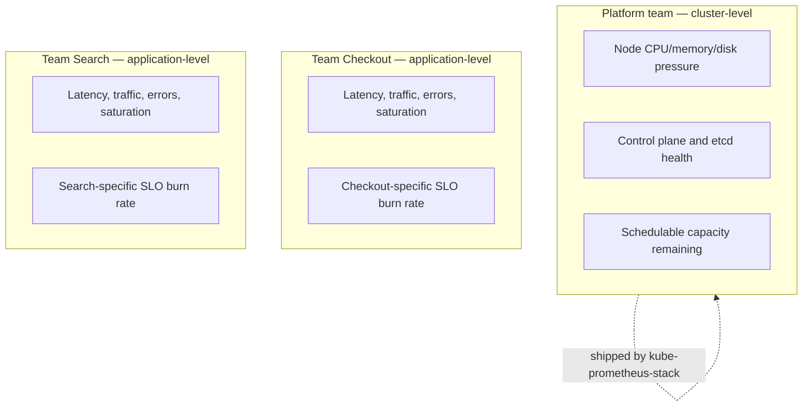

# Chapter 13 — Observability for Kubernetes

## Learning Objectives

By the end of this chapter, you will be able to:

- Explain precisely which questions kube-state-metrics, cAdvisor/kubelet metrics, and node-exporter each answer, and pick the right one for a given query
- Distinguish cluster-level monitoring from application-level monitoring as two different concerns with two different audiences, and explain why merging them into one dashboard is an anti-pattern
- Recognize and fix cardinality explosion caused by ephemeral Kubernetes Pod identifiers on custom metrics
- Write a `metricRelabelings` rule in a `ServiceMonitor` to drop a high-cardinality label before ingestion
- Evaluate the tradeoffs between per-cluster Prometheus and federated/remote-write multi-cluster observability
- Name the concrete cost levers (retention, cardinality, downsampling) a platform team uses to budget for observability at scale

---

## Prerequisites

- **Chapter 2 — Metrics Fundamentals**, specifically the cardinality discussion
- **Chapter 4 — PromQL and Querying**, specifically `rate()` over counters and recording rules
- **Chapter 5 — Prometheus on Kubernetes**, specifically the Prometheus Operator, `ServiceMonitor`/`PodMonitor`, kube-prometheus-stack, kube-state-metrics, and node-exporter
- **Chapter 6 — Grafana and Visualization**, specifically the four golden signals
- **Chapter 12 — SLIs, SLOs, and Error Budgets**
- **Kubernetes Basics, Chapters 4, 5, and 14** — Pods, workload controllers, and `kubectl top pod`
- **Advanced Kubernetes, Chapters 9, 11, and 13** — cluster administration, multi-cluster architectures, and auditing/troubleshooting at scale

---

## 13.1 Three Kubernetes Metric Sources, Three Different Questions

Chapter 5 introduced kube-state-metrics, cAdvisor, and node-exporter as the three exporters that make up a Kubernetes-aware Prometheus deployment. It's easy to remember that all three exist and much harder to remember, under pressure during an incident, which one actually answers the question you're asking. They are not interchangeable, and reaching for the wrong one wastes time exactly when you can least afford it.

### kube-state-metrics: the Kubernetes API's opinion of the world

kube-state-metrics watches the Kubernetes API server and turns the *state of Kubernetes objects* into Prometheus metrics. It never looks inside a container — it only knows what the API server itself knows: how many replicas a Deployment wants, how many it has, whether a container passed its last readiness probe.

**"How many replicas does my Deployment want vs. have?"**

```promql
kube_deployment_spec_replicas{deployment="checkout-api", namespace="production"}
kube_deployment_status_replicas{deployment="checkout-api", namespace="production"}

# The single most useful "is my rollout actually converged" query:
kube_deployment_spec_replicas{namespace="production"}
  - on(deployment, namespace)
  kube_deployment_status_replicas{namespace="production"}
```

A non-zero result on that last query means the Deployment's desired state and its actual state disagree — a rollout is stuck, a node is refusing to schedule new Pods, or something is crash-looping and never becoming Ready long enough to count toward `status.replicas`.

**"Is this Pod's container actually ready?"**

```promql
kube_pod_container_status_ready{namespace="production", pod=~"checkout-api-.*"}
```

This returns `1` or `0` per container, sourced directly from the same readiness-probe result that determines whether the Service's Endpoints list includes that Pod (Kubernetes Basics, Chapter 9 and Chapter 14). kube-state-metrics is, in effect, a Prometheus-shaped mirror of `kubectl get pods` and `kubectl describe deployment` — it tells you what Kubernetes *believes* about its own objects.

### cAdvisor/kubelet: what a specific container is actually doing right now

cAdvisor (built into the kubelet) answers a completely different question: not "what does the Kubernetes API think," but "how much CPU and memory is this specific container process actually consuming, measured from the cgroup itself." This is the same underlying data source that powers `kubectl top pod` (Kubernetes Basics, Chapter 14) — when you run `kubectl top pod`, you are looking at a metrics-server aggregation of exactly this cAdvisor data, just without PromQL's flexibility.

**"How much CPU is this container using right now?"**

```promql
# Counters accumulate CPU-seconds forever — never graph this raw (Chapter 4)
rate(container_cpu_usage_seconds_total{namespace="production", pod=~"checkout-api-.*", container="checkout-api"}[5m])
```

This is the exact `rate()`-over-a-counter pattern from Chapter 4, applied to a Kubernetes-specific metric instead of an application metric — `container_cpu_usage_seconds_total` is a monotonically increasing counter of CPU-seconds consumed, so a raw graph of it is a permanently climbing line that resets to zero on every container restart and tells you nothing about the current rate of consumption. `rate()` over a window converts it into "cores used, averaged over the last 5 minutes," which is the number you actually want.

**"How much memory is this container using right now?"**

```promql
container_memory_working_set_bytes{namespace="production", pod=~"checkout-api-.*", container="checkout-api"}
```

`container_memory_working_set_bytes` (not `container_memory_usage_bytes`, which includes reclaimable page cache) is the number the kubelet itself uses to decide whether a container is approaching its memory `limit` and eligible for OOMKilling — it is the most accurate answer to "is this container about to be OOMKilled."

### node-exporter: is the machine underneath all of this healthy

node-exporter answers neither of the above — it doesn't know what a Pod or a Deployment is at all. It reports on the health of the underlying Linux host: disk space, host-level network throughput and errors, host memory and CPU, filesystem inode exhaustion, clock drift.

```promql
# Disk space getting dangerously low on a node — a classic node-exporter question
node_filesystem_avail_bytes{mountpoint="/"} / node_filesystem_size_bytes{mountpoint="/"} < 0.10

# Host-level network errors, not container-level
rate(node_network_receive_errs_total[5m])
```

A Pod can look perfectly healthy by every kube-state-metrics and cAdvisor signal while the node it's running on is quietly running out of disk space — node-exporter is the only one of the three that will tell you that, because it's the only one looking at the host rather than Kubernetes objects or container cgroups.

### The three side by side

| Question | Source | Example metric |
|---|---|---|
| Does my Deployment have as many replicas as it wants? | kube-state-metrics | `kube_deployment_status_replicas` vs. `kube_deployment_spec_replicas` |
| Is this container passing its readiness probe? | kube-state-metrics | `kube_pod_container_status_ready` |
| How much CPU/memory is this container using right now? | cAdvisor (kubelet) | `container_cpu_usage_seconds_total`, `container_memory_working_set_bytes` |
| Is the node itself healthy (disk, host network)? | node-exporter | `node_filesystem_avail_bytes`, `node_network_receive_errs_total` |

A useful mental shortcut: kube-state-metrics tells you what Kubernetes *thinks*, cAdvisor tells you what a container is *actually doing*, and node-exporter tells you whether the *ground underneath* is stable. Most real incidents require correlating at least two of the three — a Deployment stuck below its desired replica count (kube-state-metrics) because new Pods keep getting OOMKilled (cAdvisor) because the node is memory-starved (node-exporter would show `node_memory_MemAvailable_bytes` collapsing at the same time).

---

## 13.2 Cluster-Level vs. Application-Level Monitoring

These are two genuinely different concerns, with two different audiences, and conflating them is a real, common anti-pattern — not just a stylistic preference.

**Cluster-level monitoring** asks: is the platform itself healthy? Is the control plane responsive (Advanced Kubernetes, Chapter 9 and Chapter 13)? Are nodes under CPU/memory/disk pressure? Is there enough schedulable capacity left in the cluster for the next deploy or scale-out event? Is etcd's disk latency creeping up? This is a **platform team's** dashboard — the audience is the people who operate the cluster as shared infrastructure for everyone running on it, and the questions are about the substrate, not any one team's business logic.

**Application-level monitoring** asks: is *my* service's latency, error rate, throughput, and saturation healthy — the four golden signals from Chapter 6. This is a **product/service team's** dashboard — the audience is the engineers who own a specific service, and the questions are entirely about user-facing behavior of that one service, with almost no concern for which node it happens to be scheduled on.

### Why merging them into one dashboard is an anti-pattern

A single sprawling dashboard mixing node CPU graphs, etcd latency, twelve different teams' request-rate panels, and a handful of Deployment replica counts is difficult for *anyone* to use well during an actual incident. A platform engineer paged for a node-pressure alert has to scroll past panels for services they've never heard of to find the two node-health graphs that matter. A product engineer paged for an elevated error rate on their own service has to hunt through cluster-wide noise to find their own service's panel, which may be one of forty on the same page. Neither audience's actual job is well served by the other audience's signal sharing their screen space — and a dashboard trying to serve both ends up serving neither well. This point is worth remembering now because it becomes one of the most common real mistakes covered explicitly in Chapter 15.

The fix is organizational as much as technical: separate dashboards, separate ownership, separate alerting routes. kube-prometheus-stack (Chapter 5) ships a strong set of cluster-level dashboards out of the box — node health, API server latency, etcd metrics, general Kubernetes resource dashboards — specifically so that a platform team does not need to build cluster-level visibility from scratch. That is a deliberate design decision worth taking advantage of: it frees the platform team's dashboard-building effort to focus on the things kube-prometheus-stack genuinely can't know about — your specific SLOs, your specific capacity-planning views — while each product team builds and owns their own application-level dashboards for their own golden signals.



---

## 13.3 Cardinality Explosion in Kubernetes — the Most Important Gotcha in This Chapter

Chapter 2 introduced cardinality as a general Prometheus concern: every unique combination of label values creates a new time series, and time series are not free — each one consumes memory in Prometheus's TSDB for as long as it's actively being scraped, plus however long your retention window keeps its samples around. Kubernetes turns this general risk into a specific, near-inevitable trap.

### Why Kubernetes makes this worse than a typical application

Recall from Kubernetes Basics (Chapters 4 and 5) that Pods are deliberately ephemeral. A Deployment's Pods are recreated on every rolling update, every horizontal-autoscaling event, every node failure, and every manual `kubectl delete pod`. Each recreated Pod gets a brand-new name (`checkout-api-7d9f8b6c9d-x4k2p`, then `checkout-api-7d9f8b6c9d-m9q1r`, and so on) and typically a brand-new IP address.

If a custom application metric is instrumented with a raw `pod` or `pod_ip` label —

```promql
# DANGEROUS — a new, never-reused series on every single Pod restart
http_requests_total{pod="checkout-api-7d9f8b6c9d-x4k2p", method="GET", status="200"}
```

— then every single Pod restart, for the entire lifetime of that Deployment, creates a brand-new time series that Prometheus has never seen before and will never see again. A healthy Deployment with 10 replicas, rolling out twice a week and autoscaling up and down several times a day under normal traffic variation, can generate hundreds of distinct Pod identities over a few weeks — each one leaving behind its own permanent set of time series in the TSDB for as long as retention keeps them. This is not a spike that recovers; it is continuous, silent, one-directional growth. Prometheus's memory usage climbs steadily week over week with no single obvious cause, until it either OOMs outright or — if you're on a managed observability vendor billed per active series — quietly blows through a cost budget nobody was watching.

### The fix: aggregate or drop high-cardinality labels you don't actually need

The concrete fix has two parts, and they aren't mutually exclusive:

1. **Fix it at the instrumentation source when possible.** If the application code is emitting a `pod` label on a custom metric, ask what question that label is actually answering. Almost always, the real question is "how is my *service* performing," which is answered by a `deployment`, `app`, or `namespace` label — all of which are **stable**: they don't change identity on every restart, because a Deployment's name doesn't change when its Pods do.

2. **Drop or aggregate the label at ingestion time when you can't change the instrumentation immediately.** Prometheus recording rules (Chapter 4) or relabeling rules can strip a high-cardinality label before it ever accumulates in long-term storage.

```promql
# A recording rule that pre-aggregates away the high-cardinality pod label,
# keeping only the stable dimensions dashboards and alerts actually need
- record: job:http_requests:rate5m
  expr: sum by (deployment, namespace, method, status) (
          rate(http_requests_total[5m])
        )
```

The general principle: reserve pod-level labels strictly for genuine pod-level debugging queries (rare, ad hoc, run manually when investigating a specific misbehaving replica), and use stable labels (`deployment`, `namespace`, `app`) for anything that lives permanently in a dashboard or an alerting rule. A dashboard or alert should almost never need to know which specific Pod served a request — it needs to know how the *service* as a whole is doing.

---

## 13.4 Metric Relabeling as the Concrete Cardinality-Control Mechanism

Chapter 5 covered the `ServiceMonitor` custom resource as the Prometheus Operator's way of declaring what to scrape. The same object supports `metricRelabelings` — rules applied to samples *after* they're scraped but *before* they're written to the TSDB — which is exactly the mechanism for enforcing the cardinality discipline from 13.3 at the platform level, rather than trusting every engineer to instrument correctly by hand.

```yaml
apiVersion: monitoring.coreos.com/v1
kind: ServiceMonitor
metadata:
  name: checkout-api
  namespace: production
  labels:
    release: kube-prometheus-stack
spec:
  selector:
    matchLabels:
      app: checkout-api
  endpoints:
    - port: metrics
      interval: 30s
      metricRelabelings:
        # Drop the high-cardinality `pod` label entirely from this one
        # specific metric family before it's ever written to the TSDB
        - sourceLabels: [__name__]
          regex: "checkout_orders_total"
          action: labeldrop
          # labeldrop needs the label name, not the metric name, as its
          # target — expressed as a second rule targeting the label itself:
        - action: labeldrop
          regex: "pod"
```

A more targeted version only drops the label from the specific metric family known to carry it, rather than every metric scraped from the target:

```yaml
      metricRelabelings:
        - sourceLabels: [__name__, pod]
          regex: "checkout_orders_total;.+"
          targetLabel: pod
          replacement: ""
          action: replace
```

This is a platform-level control precisely because it lives in the `ServiceMonitor` — owned and reviewed by whoever manages the monitoring stack — rather than depending on every application team remembering the cardinality discipline from 13.3 correctly in every service's instrumentation code. Whichever team, whenever, adds a `pod` label to a new custom metric, the relabeling rule strips it before it ever costs Prometheus a single new series, buying time to fix the instrumentation properly without an ongoing cardinality bill in the meantime.

---

## 13.5 Multi-Cluster Observability

Advanced Kubernetes, Chapter 11 covered multi-cluster architectures and the recurring theme of "how much operational complexity do I take on vs. how much do I actually need." That exact tradeoff question applies directly to the observability stack once you're running more than one cluster.

**Option 1 — a separate Prometheus per cluster.** Each cluster runs its own independent kube-prometheus-stack, scraping only its own targets, alerting only on its own conditions. This is operationally simple: each Prometheus is small, self-contained, and fails independently — a problem in one cluster's Prometheus doesn't affect any other cluster's observability. The cost is the absence of any unified cross-cluster view: answering "what's our aggregate error rate across all five regional clusters right now" means manually querying five separate Grafana instances and adding the numbers up yourself.

**Option 2 — federation or remote-write into a central long-term-storage system.** Chapter 3 briefly mentioned Thanos, Cortex, and Mimir as systems that extend Prometheus with long-term, horizontally-scalable, globally-queryable storage; that mention becomes directly relevant here. Each cluster's Prometheus remote-writes its samples (or a federation endpoint aggregates them) into a central store, giving you one place to query metrics across every cluster with a single PromQL expression. The cost is real: you are now operating a genuinely more complex piece of distributed infrastructure — object storage, a query layer, a compactor, and often a separate ingestion tier — on top of the per-cluster Prometheus instances you likely still run locally for fast, low-latency dashboards and alerting.

| | Separate Prometheus per cluster | Federated/remote-write central store |
|---|---|---|
| Operational complexity | Low — N independent, simple deployments | Higher — a new distributed system to run and upgrade |
| Cross-cluster query capability | None (manual, per-cluster) | Native — one query spans every cluster |
| Blast radius of a failure | Contained to one cluster | A shared central store failing affects visibility everywhere |
| Right for... | A handful of clusters, no cross-cluster SLOs, teams query per-cluster anyway | Many clusters, genuine need for a global view, dedicated platform capacity to run it |

Exactly as in Advanced Kubernetes Chapter 11's framing of multi-cluster adoption generally: don't reach for Thanos/Cortex/Mimir because it sounds like the mature, "real" way to do multi-cluster observability. Reach for it when a concrete requirement exists — a genuine cross-cluster SLO, a compliance need to correlate incidents across regions quickly, or a team size where five separate Grafana tabs has become an actual daily operational cost. Staying on independent per-cluster Prometheus instances is the *correct*, not merely acceptable, choice for a platform that doesn't have that need yet.

---

## 13.6 The Cost of Observability at Scale

Observability infrastructure has a real, growing cost curve, and it deserves the same explicit budget line item as compute or storage — not a surprise discovered via a vendor invoice or an out-of-disk alert on the Prometheus node.

Two variables drive that cost more than anything else:

- **Cardinality** — every additional unique label combination is more memory in Prometheus's TSDB (or more cost-per-series on a managed vendor), for as long as it's actively scraped and for the entire length of your retention window afterward. Section 13.3's Pod-label problem is the single most common cardinality cost driver in a Kubernetes environment specifically.
- **Retention window** — how long you keep samples directly multiplies your storage requirement. Keeping every raw sample at full 15-second-scrape resolution for a year costs dramatically more than keeping the same window at a coarser resolution.

The practical levers a platform team actually has:

- **Downsampling and rollups.** Chapter 4's recording rules aren't only a query-performance optimization — used deliberately, they let you keep a coarse, pre-aggregated rollup of older data (hourly averages instead of 15-second raw samples) at a fraction of the storage cost, while still answering "what did our error rate look like three months ago, roughly" for capacity planning and postmortems. Thanos and Mimir both support this pattern natively as data ages out of hot storage.
- **Shorter retention on high-cardinality raw data.** Raw, per-Pod-level cAdvisor metrics rarely need to survive at full resolution for months — a debugging session investigating "why did this Pod get OOMKilled yesterday" needs days of retention, not a year. Stable, low-cardinality aggregates (service-level golden signals, SLO burn-rate inputs) are cheap enough to justify much longer retention, since they don't carry the same series-count cost.

There is no universally correct retention window or cardinality budget — the right numbers depend on your actual query patterns, your compliance requirements, and your genuine budget. What matters is that the tradeoff is made *deliberately*, by the platform team, as an explicit decision — not discovered accidentally when a disk fills up or a monthly bill arrives larger than expected.

---

## 13.7 Real-World Scenario: The Six-Week Memory Leak That Wasn't a Leak

A platform team notices Prometheus's own memory usage has been climbing steadily for six weeks. It finally OOMs, taking dashboards and alerting down with it at the worst possible moment — during an unrelated incident that now has no observability to investigate it with.

**Investigation.** Prometheus exposes its own internal state as metrics on its `/metrics` endpoint — the same self-monitoring pattern any well-built exporter follows. The team starts there rather than guessing:

```promql
# Total active series being held in memory right now — the primary
# driver of Prometheus's memory footprint
prometheus_tsdb_head_series

# How the interned string table (label names/values) has grown over time —
# a fast-growing symbol table is a strong cardinality-explosion signal
prometheus_tsdb_symbol_table_size_bytes

# Which specific metric names are contributing the most active series —
# the single most useful query for diagnosing exactly this situation
topk(10, count by (__name__) ({__name__=~".+"}))
```

The `topk` query names the culprit immediately: `checkout_orders_total` has an order of magnitude more active series than any other metric in the system, and its series count has been climbing in a straight line for exactly six weeks — since the date of a specific deploy.

```promql
# Confirm the suspicion directly — count distinct label-value
# combinations for the suspect metric, broken out by label
count by (pod) (checkout_orders_total)
```

The result: thousands of distinct `pod` values, one for essentially every Pod that has ever existed for the `checkout-api` Deployment since that deploy. Reading the diff from that date confirms it — a well-intentioned engineer added a `pod` label to `checkout_orders_total` while debugging an unrelated issue, meaning to make per-Pod investigation easier, and never removed it. Every subsequent rolling update and autoscaling event since then has permanently added a new set of series that Prometheus has been dutifully retaining ever since, exactly the failure mode described in Section 13.3.

**The fix.** Two options, applied together for immediate relief plus a permanent fix:

```yaml
# Immediate mitigation: a metricRelabelings drop rule on the ServiceMonitor,
# stopping the bleeding without waiting for a code change to roll out
apiVersion: monitoring.coreos.com/v1
kind: ServiceMonitor
metadata:
  name: checkout-api
  namespace: production
spec:
  selector:
    matchLabels:
      app: checkout-api
  endpoints:
    - port: metrics
      metricRelabelings:
        - sourceLabels: [__name__, pod]
          regex: "checkout_orders_total;.+"
          targetLabel: pod
          replacement: ""
          action: replace
```

```diff
# Permanent fix: remove the label from the instrumentation itself
- orders_total.labels(pod=os.environ["HOSTNAME"], status=status).inc()
+ orders_total.labels(status=status).inc()
```

**Result.** The `metricRelabelings` rule takes effect on the next scrape cycle — no restart required. `prometheus_tsdb_head_series` drops sharply within minutes as the relabeled series stop accumulating new samples and existing stale ones age out of the head block on the next compaction. Old series matching the abandoned `pod` values eventually expire from the TSDB as their retention window elapses, and total active series settles at a small fraction of its peak. The engineering fix ships in the next release, removing the label at the source so the relabeling rule becomes a safety net rather than a permanent Band-Aid. The team adds a standing alert on `prometheus_tsdb_head_series` itself, so the next cardinality regression — from any team, on any metric — is caught within hours instead of six weeks.

---

## Best Practices

- Know which of the three metric sources (kube-state-metrics, cAdvisor, node-exporter) answers a given question before you start querying — guessing wastes time during an incident.
- Keep cluster-level and application-level dashboards, ownership, and alert routing separate; let kube-prometheus-stack's built-in dashboards cover cluster-level so platform effort goes toward things it can't already provide.
- Never put an unbounded, ephemeral identifier (`pod`, `pod_ip`) on a custom metric that will live in a dashboard or alert; use stable labels (`deployment`, `namespace`, `app`) instead.
- Enforce cardinality discipline with `metricRelabelings` at the platform level, not just instrumentation-review discipline at the individual-engineer level.
- Choose per-cluster Prometheus vs. federated/remote-write central storage based on a genuine cross-cluster query need, not because the more complex option sounds more "production-grade."
- Budget observability cost explicitly — retention window, cardinality limits, and downsampling are levers you pull deliberately, not surprises you discover later.
- Monitor Prometheus's own `prometheus_tsdb_head_series` and related self-monitoring metrics as a standing alert, not just as a debugging tool reached for after an OOM has already happened.

---

## Common Mistakes (Preview)

This chapter's cardinality and dashboard-separation lessons reappear as two of the most damaging entries in Chapter 15's full mistakes catalogue: unbounded label cardinality from ephemeral Pod identifiers, and a single "kitchen sink" dashboard mixing cluster-level and every team's application-level panels. Chapter 15 covers both in full, alongside a dozen other observability-specific failure modes.

---

## Summary

- kube-state-metrics reports on Kubernetes object *state* (desired vs. actual replicas, readiness), cAdvisor/kubelet reports on actual container-level resource *usage* (the same data behind `kubectl top pod`), and node-exporter reports on the health of the underlying *machine*.
- Cluster-level monitoring (platform team, control plane and node health) and application-level monitoring (product team, four golden signals) are different concerns for different audiences — merging them into one dashboard serves neither well.
- Ephemeral Kubernetes Pod identities turn a raw `pod` or `pod_ip` label on a custom metric into a continuous, silent cardinality leak; fix it by aggregating to stable labels at instrumentation time or by dropping the label via `metricRelabelings`.
- `ServiceMonitor.spec.endpoints[].metricRelabelings` is the concrete, platform-owned mechanism for enforcing cardinality discipline before samples ever reach the TSDB.
- Multi-cluster observability is the same complexity-vs-need tradeoff as multi-cluster architecture generally (Advanced Kubernetes, Chapter 11): per-cluster Prometheus is simpler, federation/remote-write into Thanos/Cortex/Mimir buys a unified view at real operational cost.
- Observability cost scales with cardinality and retention; downsampling/rollups and shorter retention on high-cardinality raw data are the practical budget levers.

---

## Knowledge Check

1. A Deployment shows `3/3 Ready` in `kubectl get deployments`, but users are reporting slow responses. Which of the three metric sources would you check first to see actual container resource usage, and which specific metric would you query?
2. Why does `kube_pod_container_status_ready` come from kube-state-metrics rather than cAdvisor?
3. Explain, step by step, why a `pod` label on a custom business metric causes Prometheus's memory usage to grow continuously rather than staying flat.
4. Write a `metricRelabelings` rule that drops a label called `instance_id` from a metric named `checkout_latency_seconds`.
5. A company runs four Kubernetes clusters across four regions and currently has no way to see an aggregate error rate across all of them. What observability architecture change would address this, and what operational cost does it introduce?
6. What is the difference between lowering retention and downsampling, and why might a platform team use both together rather than just one?

---

## Hands-On Exercise

**Diagnose and Fix a Cardinality Leak**

1. Deploy a small sample application to a `kind` or `minikube` cluster that exposes a custom Prometheus metric with a `pod` label (use the Kubernetes downward API to inject `POD_NAME` as an environment variable and set it as a label value).
2. Deploy kube-prometheus-stack via the Prometheus Operator (Chapter 5) and configure a `ServiceMonitor` to scrape your sample application.
3. Force several Pod restarts (`kubectl rollout restart deployment/<name>` a few times, or delete Pods directly) to simulate weeks of normal churn compressed into a few minutes.
4. In Prometheus's UI, run `count by (pod) (your_custom_metric_name)` and confirm you can see the accumulating distinct `pod` values from every restart.
5. Add a `metricRelabelings` rule to your `ServiceMonitor` that drops the `pod` label from this metric, and confirm with the same query that new samples stop carrying it.
6. Write a recording rule that aggregates the metric by `deployment` and `namespace` instead, and build a one-panel Grafana dashboard from the recording rule rather than the raw metric.
7. Query `prometheus_tsdb_head_series` before and after your fix and describe what you'd expect to see in a real cluster over the following hours as old `pod`-labeled series age out of retention.

---

## Further Reading

- [Kubernetes Documentation — Tools for Monitoring Resources](https://kubernetes.io/docs/tasks/debug/debug-cluster/resource-usage-monitoring/)
- [kube-state-metrics Documentation](https://github.com/kubernetes/kube-state-metrics)
- [cAdvisor GitHub Repository](https://github.com/google/cadvisor)
- [Prometheus Operator — ServiceMonitor API Reference](https://prometheus-operator.dev/docs/api-reference/api/#monitoring.coreos.com/v1.ServiceMonitor)
- [Thanos Documentation — Overview](https://thanos.io/tip/thanos/quick-tutorial.md/)
- [Grafana Mimir Documentation](https://grafana.com/docs/mimir/latest/)
- [Prometheus Documentation — Cardinality and Performance](https://prometheus.io/docs/practices/instrumentation/#do-not-overuse-labels)

---

<div style="display:flex;justify-content:space-between;align-items:center;">
  <a href="./12-slis-slos-and-error-budgets.md">← Previous: SLIs, SLOs, and Error Budgets</a>
  <a href="./00-index.md">🏠 Index</a>
  <a href="./14-best-practices.md">Next: Best Practices →</a>
</div>
